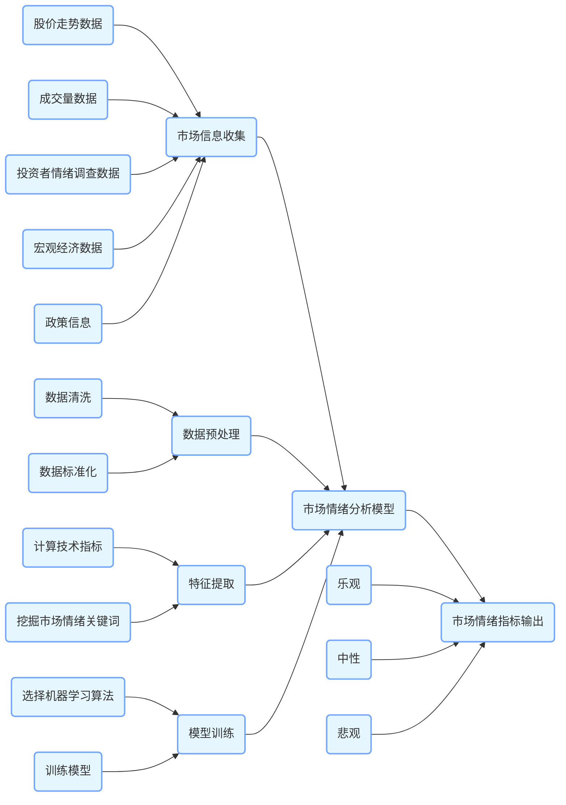

# 彼得林奇的"市场情绪"指标在不同资产类别中的应用比较

> 关键词：彼得林奇、市场情绪指标、资产类别、应用比较、投资策略

> 摘要：本文旨在深入探讨彼得林奇的“市场情绪”指标在不同资产类别中的应用情况。通过对“市场情绪”指标的核心概念、算法原理、数学模型进行详细剖析，并结合实际项目案例和具体代码实现，对比该指标在股票、债券、期货等不同资产类别中的表现和特点。同时，介绍了相关的工具和资源，最后对该指标未来的发展趋势与挑战进行总结，为投资者和研究者在资产配置和市场分析方面提供全面而深入的参考。

## 1. 背景介绍 
### 1.1 目的和范围
本研究的主要目的是全面分析彼得林奇的“市场情绪”指标在不同资产类别中的应用效果和差异。彼得林奇作为投资界的传奇人物，其提出的“市场情绪”指标对于理解市场动态和制定投资策略具有重要意义。我们将研究范围涵盖股票、债券、期货、外汇等常见的资产类别，通过对比分析，揭示该指标在不同市场环境下的适用性和局限性，为投资者提供更精准的决策依据。

### 1.2 预期读者
本文预期读者包括专业投资者、金融分析师、投资研究人员以及对金融市场和投资策略感兴趣的爱好者。无论是希望优化投资组合的专业人士，还是想要了解市场分析方法的初学者，都能从本文中获取有价值的信息。

### 1.3 文档结构概述
本文将按照以下结构展开：首先介绍相关的核心概念和术语，明确“市场情绪”指标的定义和相关联系；接着详细阐述核心算法原理和具体操作步骤，包括使用 Python 代码实现；然后给出数学模型和公式，并通过具体例子进行说明；之后通过项目实战，展示代码的实际应用和详细解读；再探讨该指标在不同资产类别中的实际应用场景；推荐相关的学习资源、开发工具和研究论文；最后总结未来发展趋势与挑战，并提供常见问题解答和扩展阅读资料。

### 1.4 术语表
#### 1.4.1 核心术语定义
- **彼得林奇的“市场情绪”指标**：彼得林奇基于市场参与者的心理和行为特征提出的一种用于衡量市场整体情绪状态的指标，它反映了市场的乐观或悲观程度，对资产价格走势有一定的预测作用。
- **资产类别**：指具有相似特征和风险收益特性的金融资产集合，常见的资产类别包括股票、债券、期货、外汇等。
- **投资策略**：投资者根据自身的投资目标、风险承受能力和市场情况制定的投资计划和方法。

#### 1.4.2 相关概念解释
- **市场情绪**：市场参与者对市场未来走势的预期和信心程度，它受到宏观经济数据、政策变化、公司业绩等多种因素的影响。市场情绪高涨时，投资者更倾向于买入资产，推动价格上涨；市场情绪低落时，投资者则更倾向于卖出资产，导致价格下跌。
- **资产配置**：投资者将资金分配到不同资产类别中的过程，旨在通过分散投资降低风险，实现投资组合的优化。合理的资产配置需要考虑不同资产类别的风险收益特性和市场情绪等因素。

#### 1.4.3 缩略词列表
- **MACD**：Moving Average Convergence Divergence，指数平滑异同移动平均线，是一种常用的技术分析指标。
- **RSI**：Relative Strength Index，相对强弱指标，用于衡量证券自身内在相对强度。

## 2. 核心概念与联系 

### 核心概念原理
彼得林奇的“市场情绪”指标的核心原理基于市场参与者的心理和行为。市场情绪是一个综合性的概念，它反映了投资者对市场的信心、预期和态度。当市场情绪乐观时，投资者更愿意买入资产，推动资产价格上涨；当市场情绪悲观时，投资者则倾向于卖出资产，导致资产价格下跌。

该指标通过对市场上各种信息的综合分析，包括股价走势、成交量、投资者情绪调查等，来判断市场的整体情绪状态。例如，当股价持续上涨且成交量放大时，通常意味着市场情绪乐观；反之，当股价持续下跌且成交量萎缩时，则可能表示市场情绪悲观。

### 架构的文本示意图
```plaintext
市场信息收集
|-- 股价走势数据
|-- 成交量数据
|-- 投资者情绪调查数据
|-- 宏观经济数据
|-- 政策信息
|
市场情绪分析模型
|-- 数据预处理
|   |-- 数据清洗
|   |-- 数据标准化
|-- 特征提取
|   |-- 计算技术指标（如 MACD、RSI 等）
|   |-- 挖掘市场情绪关键词
|-- 模型训练
|   |-- 选择合适的机器学习算法（如逻辑回归、神经网络等）
|   |-- 训练模型以预测市场情绪
|
市场情绪指标输出
|-- 乐观
|-- 中性
|-- 悲观
```

### Mermaid 流程图


## 3. 核心算法原理 & 具体操作步骤 

### 核心算法原理
我们可以使用逻辑回归算法来构建彼得林奇的“市场情绪”指标预测模型。逻辑回归是一种常用的分类算法，它通过对输入特征进行线性组合，并使用逻辑函数将其映射到概率值，从而实现分类任务。

假设我们有一组输入特征 $X = [x_1, x_2,..., x_n]$，逻辑回归模型的输出为 $P(Y = 1|X)$，表示在给定输入特征 $X$ 的情况下，市场情绪为乐观（$Y = 1$）的概率。逻辑回归模型的表达式为：

$P(Y = 1|X) = \frac{1}{1 + e^{-(w_0 + w_1x_1 + w_2x_2 +... + w_nx_n)}}$

其中，$w_0, w_1, w_2,..., w_n$ 是模型的参数，需要通过训练数据进行学习。

### 具体操作步骤

#### 步骤 1：数据收集
收集市场的相关数据，包括股价走势、成交量、投资者情绪调查等数据。

#### 步骤 2：数据预处理
对收集到的数据进行清洗和标准化处理，去除异常值和缺失值，并将数据转换为适合模型输入的格式。

#### 步骤 3：特征提取
从预处理后的数据中提取有用的特征，例如计算技术指标（如 MACD、RSI 等）和挖掘市场情绪关键词。

#### 步骤 4：模型训练
使用训练数据对逻辑回归模型进行训练，学习模型的参数。

#### 步骤 5：模型评估
使用测试数据对训练好的模型进行评估，计算模型的准确率、召回率等指标。

#### 步骤 6：市场情绪预测
使用训练好的模型对新的市场数据进行预测，得到市场情绪指标。

### Python 源代码实现

```python
import pandas as pd
import numpy as np
from sklearn.model_selection import train_test_split
from sklearn.linear_model import LogisticRegression
from sklearn.preprocessing import StandardScaler
from sklearn.metrics import accuracy_score

# 步骤 1：数据收集
# 假设我们已经收集到了市场数据，并存储在一个 CSV 文件中
data = pd.read_csv('market_data.csv')

# 步骤 2：数据预处理
# 去除缺失值
data = data.dropna()

# 分离特征和标签
X = data.drop('market_sentiment', axis=1)
y = data['market_sentiment']

# 数据标准化
scaler = StandardScaler()
X = scaler.fit_transform(X)

# 步骤 3：特征提取
# 这里可以添加更多的特征提取步骤，例如计算技术指标

# 步骤 4：模型训练
# 划分训练集和测试集
X_train, X_test, y_train, y_test = train_test_split(X, y, test_size=0.2, random_state=42)

# 创建逻辑回归模型
model = LogisticRegression()

# 训练模型
model.fit(X_train, y_train)

# 步骤 5：模型评估
# 预测测试集
y_pred = model.predict(X_test)

# 计算准确率
accuracy = accuracy_score(y_test, y_pred)
print(f"模型准确率: {accuracy}")

# 步骤 6：市场情绪预测
# 假设我们有新的市场数据
new_data = np.array([[1.2, 3.4, 5.6, 7.8]])  # 示例数据
new_data = scaler.transform(new_data)
predicted_sentiment = model.predict(new_data)
print(f"预测的市场情绪: {predicted_sentiment}")
```

## 4. 数学模型和公式 & 详细讲解 & 举例说明 

### 逻辑回归模型公式
逻辑回归模型的核心公式为：

$P(Y = 1|X) = \frac{1}{1 + e^{-(w_0 + w_1x_1 + w_2x_2 +... + w_nx_n)}}$

其中：
- $P(Y = 1|X)$ 表示在给定输入特征 $X$ 的情况下，市场情绪为乐观（$Y = 1$）的概率。
- $w_0, w_1, w_2,..., w_n$ 是模型的参数，$w_0$ 是截距项，$w_1, w_2,..., w_n$ 是特征的权重。
- $x_1, x_2,..., x_n$ 是输入特征。

### 详细讲解
逻辑回归模型通过对输入特征进行线性组合，得到一个线性得分 $z = w_0 + w_1x_1 + w_2x_2 +... + w_nx_n$。然后，使用逻辑函数（也称为 sigmoid 函数）将线性得分映射到概率值 $P(Y = 1|X)$。逻辑函数的表达式为：

$\sigma(z) = \frac{1}{1 + e^{-z}}$

逻辑函数的取值范围在 $[0, 1]$ 之间，当 $z$ 趋近于正无穷时，$\sigma(z)$ 趋近于 1；当 $z$ 趋近于负无穷时，$\sigma(z)$ 趋近于 0。因此，逻辑回归模型可以将线性得分转换为概率值，用于分类任务。

### 举例说明
假设我们有两个输入特征 $x_1$ 和 $x_2$，模型的参数为 $w_0 = 0.5$，$w_1 = 0.3$，$w_2 = 0.2$。当输入特征 $x_1 = 2$，$x_2 = 3$ 时，线性得分 $z$ 为：

$z = w_0 + w_1x_1 + w_2x_2 = 0.5 + 0.3\times2 + 0.2\times3 = 1.7$

然后，使用逻辑函数计算市场情绪为乐观的概率：

$P(Y = 1|X) = \frac{1}{1 + e^{-z}} = \frac{1}{1 + e^{-1.7}} \approx 0.84$

这意味着在给定输入特征 $x_1 = 2$ 和 $x_2 = 3$ 的情况下，市场情绪为乐观的概率约为 0.84。

## 5. 项目实战：代码实际案例和详细解释说明 

### 5.1  开发环境搭建
#### 安装 Python
首先，需要安装 Python 环境。建议使用 Python 3.7 及以上版本，可以从 Python 官方网站（https://www.python.org/downloads/）下载并安装。

#### 安装必要的库
使用以下命令安装项目所需的库：
```sh
pip install pandas numpy scikit-learn
```

### 5.2  源代码详细实现和代码解读

```python
import pandas as pd
import numpy as np
from sklearn.model_selection import train_test_split
from sklearn.linear_model import LogisticRegression
from sklearn.preprocessing import StandardScaler
from sklearn.metrics import accuracy_score

# 步骤 1：数据收集
# 假设我们已经收集到了市场数据，并存储在一个 CSV 文件中
data = pd.read_csv('market_data.csv')

# 代码解读：使用 pandas 库的 read_csv 函数读取 CSV 文件，并将数据存储在 DataFrame 对象中。

# 步骤 2：数据预处理
# 去除缺失值
data = data.dropna()

# 代码解读：使用 dropna 方法去除 DataFrame 中包含缺失值的行。

# 分离特征和标签
X = data.drop('market_sentiment', axis=1)
y = data['market_sentiment']

# 代码解读：将数据集中的特征（除了 'market_sentiment' 列）存储在 X 中，将标签（'market_sentiment' 列）存储在 y 中。

# 数据标准化
scaler = StandardScaler()
X = scaler.fit_transform(X)

# 代码解读：使用 StandardScaler 类对特征数据进行标准化处理，使每个特征的均值为 0，标准差为 1。

# 步骤 3：特征提取
# 这里可以添加更多的特征提取步骤，例如计算技术指标

# 代码解读：在实际应用中，可以根据需要添加更多的特征提取步骤，例如计算 MACD、RSI 等技术指标。

# 步骤 4：模型训练
# 划分训练集和测试集
X_train, X_test, y_train, y_test = train_test_split(X, y, test_size=0.2, random_state=42)

# 代码解读：使用 train_test_split 函数将数据集划分为训练集和测试集，测试集占比为 20%。

# 创建逻辑回归模型
model = LogisticRegression()

# 代码解读：创建一个逻辑回归模型对象。

# 训练模型
model.fit(X_train, y_train)

# 代码解读：使用训练集数据对逻辑回归模型进行训练。

# 步骤 5：模型评估
# 预测测试集
y_pred = model.predict(X_test)

# 代码解读：使用训练好的模型对测试集数据进行预测。

# 计算准确率
accuracy = accuracy_score(y_test, y_pred)
print(f"模型准确率: {accuracy}")

# 代码解读：使用 accuracy_score 函数计算模型在测试集上的准确率，并打印输出。

# 步骤 6：市场情绪预测
# 假设我们有新的市场数据
new_data = np.array([[1.2, 3.4, 5.6, 7.8]])  # 示例数据
new_data = scaler.transform(new_data)
predicted_sentiment = model.predict(new_data)
print(f"预测的市场情绪: {predicted_sentiment}")

# 代码解读：创建一个新的市场数据示例，对其进行标准化处理，然后使用训练好的模型进行预测，并打印输出预测结果。
```

### 5.3  代码解读与分析
- **数据收集**：使用 pandas 库读取 CSV 文件，将市场数据加载到 DataFrame 对象中。
- **数据预处理**：去除缺失值和对数据进行标准化处理，以提高模型的性能。
- **特征提取**：可以根据需要添加更多的特征提取步骤，例如计算技术指标，以增强模型的预测能力。
- **模型训练**：使用逻辑回归模型对训练集数据进行训练，学习模型的参数。
- **模型评估**：使用测试集数据对训练好的模型进行评估，计算模型的准确率。
- **市场情绪预测**：使用训练好的模型对新的市场数据进行预测，得到市场情绪指标。

## 6. 实际应用场景 
### 股票市场
在股票市场中，彼得林奇的“市场情绪”指标可以帮助投资者判断市场的整体氛围。当市场情绪指标显示乐观时，投资者可以适当增加股票投资比例，选择具有潜力的成长股或热门板块股票；当市场情绪指标显示悲观时，投资者可以减少股票持仓，甚至选择空仓观望，以避免市场下跌带来的损失。例如，在牛市初期，市场情绪逐渐乐观，股价开始上涨，成交量放大，此时“市场情绪”指标会发出积极信号，投资者可以抓住机会买入股票；而在熊市末期，市场情绪极度悲观，股价持续下跌，成交量萎缩，“市场情绪”指标会提示投资者保持谨慎。

### 债券市场
在债券市场中，市场情绪也会对债券价格产生影响。当市场情绪乐观时，投资者更倾向于投资风险较高的资产，如股票，导致债券需求下降，价格下跌；当市场情绪悲观时，投资者会寻求避险资产，如债券，从而推动债券价格上涨。因此，“市场情绪”指标可以帮助债券投资者把握市场时机。例如，当市场情绪指标显示悲观时，投资者可以增加债券投资比例，选择信用等级较高的债券；当市场情绪指标显示乐观时，可以适当减少债券持仓。

### 期货市场
期货市场具有高风险性和高杠杆性，市场情绪的波动对期货价格的影响更为显著。“市场情绪”指标可以帮助期货投资者判断市场趋势，制定合理的交易策略。例如，在大宗商品期货市场中，当市场情绪乐观时，投资者预期经济增长，对大宗商品的需求增加，期货价格可能上涨；此时投资者可以选择做多期货合约。当市场情绪悲观时，投资者预期经济衰退，对大宗商品的需求减少，期货价格可能下跌；投资者可以选择做空期货合约。

### 外汇市场
外汇市场受到全球经济、政治和市场情绪等多种因素的影响。“市场情绪”指标可以帮助外汇投资者分析市场趋势，判断不同货币的强弱。当市场情绪乐观时，投资者更倾向于投资新兴市场货币，因为新兴市场国家的经济增长潜力较大；当市场情绪悲观时，投资者会选择避险货币，如美元、日元等。例如，当市场情绪指标显示乐观时，投资者可以买入新兴市场货币对避险货币的外汇合约；当市场情绪指标显示悲观时，可以买入避险货币对新兴市场货币的外汇合约。

## 7. 工具和资源推荐
### 7.1 学习资源推荐
#### 7.1.1 书籍推荐
- 《彼得林奇的成功投资》：彼得林奇的经典著作，详细介绍了他的投资理念和方法，包括如何分析市场情绪和选择股票。
- 《聪明的投资者》：本杰明·格雷厄姆的著作，被誉为投资界的圣经，书中阐述了价值投资的理念和方法，对理解市场情绪和资产定价有很大帮助。
- 《金融市场技术分析》：约翰·墨菲的著作，系统介绍了技术分析的理论和方法，包括各种技术指标的应用，对于分析市场情绪和预测市场走势有重要参考价值。

#### 7.1.2 在线课程
- Coursera 上的“投资学原理”：由知名大学教授授课，涵盖了投资的基本原理、资产定价、投资组合管理等内容，有助于深入理解市场情绪和投资策略。
- edX 上的“金融市场与投资”：提供了金融市场的全面介绍，包括股票、债券、期货等市场的分析方法和投资策略。
- 网易云课堂上的“量化投资入门与实战”：介绍了量化投资的基本概念和方法，包括如何使用 Python 进行数据处理和模型构建，对于将“市场情绪”指标应用于投资实践有很大帮助。

#### 7.1.3 技术博客和网站
- 雪球网：国内知名的投资社区，提供了丰富的股票、基金等投资信息和分析文章，投资者可以在这里交流市场情绪和投资经验。
- 东方财富网：提供全面的金融市场数据和资讯，包括股票、债券、期货等市场的行情分析和研究报告，有助于及时了解市场情绪的变化。
- Seeking Alpha：国外知名的金融投资网站，汇聚了众多专业投资者和分析师的观点和分析文章，对于了解国际市场情绪和投资机会有很大帮助。

### 7.2 开发工具框架推荐
#### 7.2.1 IDE和编辑器
- PyCharm：一款功能强大的 Python 集成开发环境，提供了代码编辑、调试、版本控制等功能，适合开发基于 Python 的投资分析程序。
- Jupyter Notebook：一个交互式的开发环境，支持 Python、R 等多种编程语言，适合进行数据探索、模型构建和可视化分析。
- Visual Studio Code：一款轻量级的代码编辑器，支持多种编程语言和插件扩展，可用于快速开发和调试投资分析代码。

#### 7.2.2 调试和性能分析工具
- pdb：Python 内置的调试器，可以帮助开发者逐行调试代码，查找和解决问题。
- cProfile：Python 标准库中的性能分析工具，可以分析代码的运行时间和函数调用次数，帮助开发者优化代码性能。
- Py-Spy：一个跨平台的 Python 性能分析工具，可以实时监测 Python 程序的运行状态和性能瓶颈。

#### 7.2.3 相关框架和库
- Pandas：一个强大的数据处理和分析库，提供了高效的数据结构和数据操作方法，适合处理和分析金融市场数据。
- Numpy：一个用于科学计算的 Python 库，提供了高效的数组操作和数学函数，是许多数据分析和机器学习库的基础。
- Scikit-learn：一个常用的机器学习库，提供了各种机器学习算法和工具，包括分类、回归、聚类等算法，适合构建和训练“市场情绪”指标预测模型。

### 7.3 相关论文著作推荐
#### 7.3.1 经典论文
- “The Cross - Section of Expected Stock Returns” by Eugene F. Fama and Kenneth R. French：提出了著名的 Fama - French 三因子模型，对股票收益的横截面进行了深入分析，为理解市场情绪和资产定价提供了重要理论基础。
- “A Behavioral Model of Asset Prices” by Werner F. M. De Bondt and Richard H. Thaler：探讨了投资者的行为偏差对资产价格的影响，为研究市场情绪和行为金融学提供了重要参考。

#### 7.3.2 最新研究成果
- 近年来，许多学者在市场情绪和资产定价领域进行了深入研究，相关研究成果可以在学术数据库如 SSRN、JSTOR 等上查找。这些研究成果通常涉及新的理论模型、实证分析方法和市场情绪指标的构建。

#### 7.3.3 应用案例分析
- 一些金融机构和研究机构会发布关于市场情绪指标在不同资产类别中应用的案例分析报告。这些报告可以帮助投资者了解实际应用中的方法和效果，以及可能遇到的问题和解决方案。

## 8. 总结：未来发展趋势与挑战
### 未来发展趋势
- **多源数据融合**：未来，“市场情绪”指标的构建将越来越多地融合多源数据，包括社交媒体数据、新闻资讯数据、宏观经济数据等。通过综合分析这些数据，可以更全面、准确地反映市场情绪的变化。
- **人工智能和机器学习的应用**：随着人工智能和机器学习技术的不断发展，将有更多先进的算法和模型应用于“市场情绪”指标的分析和预测。例如，深度学习模型可以自动提取数据中的复杂特征，提高预测的准确性和可靠性。
- **跨资产类别应用拓展**：“市场情绪”指标的应用将不仅仅局限于传统的股票、债券、期货等资产类别，还将拓展到新兴的数字资产、绿色金融等领域。通过分析不同资产类别之间的市场情绪关联，可以实现更有效的资产配置和风险管理。

### 挑战
- **数据质量和可靠性**：多源数据的质量和可靠性参差不齐，如何对数据进行有效的清洗、预处理和验证是一个挑战。不准确或虚假的数据可能会导致“市场情绪”指标的误判，影响投资决策的准确性。
- **模型解释性**：一些复杂的人工智能和机器学习模型，如深度学习模型，往往具有较高的预测性能，但缺乏良好的解释性。在金融领域，投资者需要了解模型的决策依据，以便做出合理的投资决策。因此，如何提高模型的解释性是一个亟待解决的问题。
- **市场变化的不确定性**：金融市场是复杂多变的，市场情绪受到多种因素的影响，包括宏观经济政策、地缘政治事件、突发事件等。这些因素的不确定性增加了“市场情绪”指标预测的难度，模型需要具备较强的适应性和鲁棒性。

## 9. 附录：常见问题与解答
### 问题 1：彼得林奇的“市场情绪”指标是否适用于所有市场环境？
解答：彼得林奇的“市场情绪”指标虽然具有一定的通用性，但并不是适用于所有市场环境。在市场极端波动或出现突发事件时，市场情绪可能会受到非理性因素的影响，导致指标的预测准确性下降。此外，不同的市场环境具有不同的特点和规律，需要结合具体情况对指标进行调整和优化。

### 问题 2：如何判断“市场情绪”指标的准确性？
解答：可以通过以下几种方式判断“市场情绪”指标的准确性：
- **历史数据回测**：使用历史市场数据对指标进行回测，比较指标预测结果与实际市场走势的一致性。
- **与其他指标对比**：将“市场情绪”指标与其他常用的技术指标或基本面指标进行对比，分析它们之间的相关性和互补性。
- **实际应用验证**：在实际投资中应用该指标，观察其对投资决策的指导作用和投资绩效的影响。

### 问题 3：如何获取市场情绪数据？
解答：可以通过以下途径获取市场情绪数据：
- **金融数据提供商**：如 Wind、Bloomberg 等，它们提供了丰富的金融市场数据，包括股价、成交量、投资者情绪调查等数据。
- **社交媒体平台**：社交媒体上的用户言论和讨论可以反映市场参与者的情绪和观点。可以使用自然语言处理技术对社交媒体数据进行分析，提取市场情绪信息。
- **新闻资讯网站**：新闻报道中的观点和分析也可以反映市场情绪。可以通过爬虫技术获取新闻资讯数据，并进行情感分析。

### 问题 4：“市场情绪”指标可以单独作为投资决策的依据吗？
解答：不建议将“市场情绪”指标单独作为投资决策的依据。市场情绪只是影响资产价格的一个因素，还需要综合考虑其他因素，如基本面分析、技术分析、宏观经济环境等。“市场情绪”指标可以作为投资决策的参考，帮助投资者更好地把握市场趋势和时机。

## 10. 扩展阅读 & 参考资料
### 扩展阅读
- 《行为金融学》：深入探讨了投资者的行为偏差和心理因素对金融市场的影响，与“市场情绪”指标的研究密切相关。
- 《量化投资：策略与技术》：介绍了量化投资的各种策略和技术方法，包括如何使用量化模型分析市场情绪和进行投资决策。
- 《金融炼金术》：乔治·索罗斯的著作，阐述了他的反身性理论，对理解市场情绪和市场波动有独特的见解。

### 参考资料
- Fama, E. F., & French, K. R. (1992). The cross - section of expected stock returns. The Journal of Finance, 47(2), 427 - 465.
- De Bondt, W. F. M., & Thaler, R. H. (1985). Does the stock market overreact? The Journal of Finance, 40(3), 793 - 805.
- 彼得·林奇. 《彼得林奇的成功投资》. 机械工业出版社.

作者：AI天才研究院/AI Genius Institute & 禅与计算机程序设计艺术 /Zen And The Art of Computer Programming