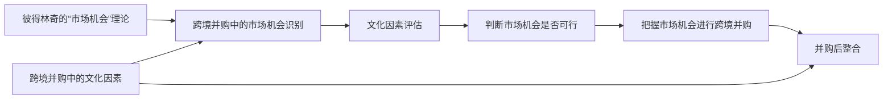

# 彼得林奇的"市场机会"在跨境并购中的文化因素评估

> 关键词：彼得林奇、市场机会、跨境并购、文化因素评估、并购风险

> 摘要：本文旨在探讨彼得林奇的“市场机会”理念在跨境并购中的应用，着重分析文化因素评估在其中的重要性、方法及影响。通过对彼得林奇投资思想的解读，结合跨境并购的实际情况，深入剖析文化差异可能带来的问题以及如何进行有效的文化因素评估，以降低并购风险，提升并购成功率，为企业的跨境并购决策提供理论和实践指导。

## 1. 背景介绍 
### 1.1 目的和范围
在经济全球化的大背景下，跨境并购已成为企业实现快速扩张和国际化发展的重要战略手段。然而，跨境并购面临着诸多挑战，其中文化因素的差异往往是导致并购失败的关键因素之一。彼得林奇作为投资界的传奇人物，其“市场机会”理论为投资者寻找有潜力的投资标的提供了重要思路。本文的目的在于研究如何将彼得林奇的“市场机会”理念应用到跨境并购中，特别是如何对文化因素进行全面、准确的评估，以更好地把握跨境并购中的市场机会，降低风险。本文的范围涵盖了跨境并购中文化因素的各个方面，包括企业文化、国家文化、宗教文化等，以及这些文化因素对并购决策、整合过程和并购绩效的影响。

### 1.2 预期读者
本文预期读者主要包括企业管理人员、投资决策者、金融分析师、学者以及对跨境并购和投资领域感兴趣的专业人士。企业管理人员可以从本文中获取有关跨境并购中文化因素评估的方法和策略，以指导企业的并购实践；投资决策者可以借助彼得林奇的“市场机会”理念，更好地筛选和评估跨境并购项目；金融分析师可以深入了解文化因素对并购估值和风险的影响；学者可以在本文的基础上进行更深入的理论研究；而对该领域感兴趣的专业人士则可以拓宽知识面，增加对跨境并购文化因素的认识。

### 1.3 文档结构概述
本文将按照以下结构展开：首先介绍相关背景信息，包括目的、预期读者和文档结构概述等；接着阐述核心概念，即彼得林奇的“市场机会”和跨境并购中的文化因素，并分析它们之间的联系；然后详细讲解核心算法原理和具体操作步骤，用于文化因素评估；再介绍相关的数学模型和公式，并通过举例进行说明；之后通过项目实战案例，展示文化因素评估在跨境并购中的具体应用；接着探讨实际应用场景；推荐相关的工具和资源；总结未来发展趋势与挑战；提供常见问题与解答；最后列出扩展阅读和参考资料。

### 1.4 术语表
#### 1.4.1 核心术语定义
- **彼得林奇的“市场机会”**：指彼得林奇在投资过程中所强调的，通过深入研究和分析，发现那些被市场低估、具有成长潜力的投资机会。这些机会可能存在于不同的行业、企业或市场环境中。
- **跨境并购**：指一国企业为了达到某种目标，通过一定的渠道和支付手段，将另一国企业的整个资产或足以行使经营控制权的股份购买下来的行为。
- **文化因素评估**：指对跨境并购中涉及的不同文化背景下的价值观、信仰、行为模式、管理风格等因素进行系统的分析和评价，以识别潜在的风险和机会。

#### 1.4.2 相关概念解释
- **企业文化**：指企业在长期的生产经营过程中形成的，为全体员工所认同并遵守的价值观念、行为准则、企业精神等的总和。企业文化是企业的灵魂，对企业的决策、运营和发展具有重要影响。
- **国家文化**：指一个国家或民族在长期的历史发展过程中形成的独特的文化传统、价值观念、社会规范等。国家文化差异会影响企业的经营环境和管理模式。
- **宗教文化**：指与宗教信仰相关的文化现象，包括宗教教义、仪式、习俗等。宗教文化在某些地区和行业中具有重要影响力，可能对跨境并购产生特殊的影响。

#### 1.4.3 缩略词列表
- **M&A**：Merger & Acquisition，并购
- **CBBE**：Customer - Based Brand Equity，基于顾客的品牌资产

## 2. 核心概念与联系 
### 彼得林奇的“市场机会”理论
彼得林奇是美国著名的投资家，他以其卓越的投资业绩和独特的投资理念而闻名于世。他认为，市场中存在着大量被低估的投资机会，投资者可以通过深入的研究和分析，发现那些具有成长潜力的企业。他强调要关注企业的基本面，包括企业的业务模式、财务状况、竞争优势等，同时要结合宏观经济环境和行业发展趋势来判断投资机会。例如，他会关注那些具有独特产品或服务、市场份额不断扩大、管理团队优秀的企业，认为这些企业在未来有可能实现快速增长，从而为投资者带来丰厚的回报。

### 跨境并购中的文化因素
在跨境并购中，文化因素是一个复杂而重要的方面。文化差异可能体现在多个层面，包括国家文化、企业文化和宗教文化等。不同国家的文化背景导致人们的价值观、思维方式和行为习惯存在很大差异。例如，在一些西方国家，强调个人主义和创新精神，而在一些亚洲国家，更注重集体主义和传统价值观。企业文化也会因企业的历史、行业特点和管理风格的不同而有所差异。一些企业注重创新和冒险，而另一些企业则更强调稳健和保守。宗教文化在某些地区和行业中也具有重要影响力，例如在一些伊斯兰国家，宗教教义对商业活动有严格的规定。

### 两者的联系
彼得林奇的“市场机会”理论在跨境并购中具有重要的指导意义。在寻找跨境并购的市场机会时，文化因素是一个不可忽视的重要因素。文化差异可能会给跨境并购带来潜在的风险，如整合困难、员工抵触、市场适应问题等，但同时也可能带来新的机会，如文化互补、拓展新的市场领域等。通过对文化因素的评估，可以更好地判断跨境并购的市场机会是否真正存在，以及如何把握这些机会。例如，如果能够识别并利用文化差异带来的互补优势，就有可能实现企业的协同发展，提升并购绩效。

### 文本示意图
彼得林奇的“市场机会”理论强调通过研究发现潜在的投资机会，而跨境并购是企业实现扩张的一种方式。文化因素在跨境并购中贯穿始终，它既可能影响市场机会的识别，也可能影响并购后的整合过程和绩效。市场机会的识别需要考虑文化因素的影响，而文化因素的评估又可以为把握市场机会提供依据。

### Mermaid 流程图


## 3. 核心算法原理 & 具体操作步骤 
### 文化因素评估的核心算法原理
文化因素评估的核心算法原理是基于多维度的数据分析和综合评价。我们可以将文化因素分为多个维度，如价值观、行为模式、管理风格等，然后对每个维度进行量化评估。通过收集相关的数据，利用统计分析方法，计算出不同文化之间的差异程度和相似度。例如，可以采用层次分析法（AHP）来确定各个维度的权重，然后通过模糊综合评价法对文化因素进行综合评价。

### Python 源代码实现
```python
import numpy as np
from sklearn.preprocessing import MinMaxScaler

# 定义文化因素的维度和权重
dimensions = ['价值观', '行为模式', '管理风格', '沟通方式']
weights = np.array([0.3, 0.25, 0.2, 0.25])

# 假设有两个国家或企业的文化因素数据
culture_data_1 = np.array([80, 70, 60, 75])
culture_data_2 = np.array([60, 80, 70, 65])

# 数据归一化处理
scaler = MinMaxScaler()
normalized_data_1 = scaler.fit_transform(culture_data_1.reshape(-1, 1)).flatten()
normalized_data_2 = scaler.fit_transform(culture_data_2.reshape(-1, 1)).flatten()

# 计算文化差异得分
def calculate_cultural_difference(data_1, data_2, weights):
    diff = np.abs(data_1 - data_2)
    score = np.dot(diff, weights)
    return score

cultural_difference_score = calculate_cultural_difference(normalized_data_1, normalized_data_2, weights)
print(f"文化差异得分: {cultural_difference_score}")
```

### 具体操作步骤
1. **确定文化因素维度**：根据跨境并购的实际情况，确定需要评估的文化因素维度，如上述代码中的价值观、行为模式、管理风格和沟通方式等。
2. **收集数据**：通过问卷调查、访谈、实地考察等方式，收集不同国家或企业的文化因素数据。
3. **数据预处理**：对收集到的数据进行清洗、整理和归一化处理，以消除数据的量纲影响。
4. **确定权重**：采用层次分析法等方法，确定各个文化因素维度的权重。
5. **计算文化差异得分**：根据上述代码中的算法，计算不同文化之间的差异得分。
6. **评估结果分析**：根据文化差异得分，判断文化差异的程度，并分析其对跨境并购的影响。

## 4. 数学模型和公式 & 详细讲解 & 举例说明 
### 层次分析法（AHP）确定权重
层次分析法是一种将复杂问题分解为多个层次，通过比较各层次元素之间的相对重要性来确定权重的方法。其基本步骤如下：
1. **构建层次结构模型**：将问题分解为目标层、准则层和方案层。在文化因素评估中，目标层是确定文化因素的权重，准则层是各个文化因素维度，方案层可以是不同的国家或企业。
2. **构造判断矩阵**：对准则层的元素进行两两比较，根据相对重要性程度赋予 1 - 9 的标度值，构建判断矩阵 $A=(a_{ij})_{n\times n}$，其中 $a_{ij}$ 表示元素 $i$ 相对于元素 $j$ 的重要性程度。
3. **计算特征向量和特征值**：求解判断矩阵 $A$ 的最大特征值 $\lambda_{max}$ 及其对应的特征向量 $W$，并对特征向量进行归一化处理，得到权重向量。
4. **一致性检验**：计算一致性指标 $CI=\frac{\lambda_{max}-n}{n - 1}$，其中 $n$ 是判断矩阵的阶数。然后查找平均随机一致性指标 $RI$，计算一致性比率 $CR=\frac{CI}{RI}$。当 $CR\lt0.1$ 时，认为判断矩阵具有满意的一致性。

### 模糊综合评价法
模糊综合评价法是一种基于模糊数学的综合评价方法，它可以处理具有模糊性和不确定性的问题。其基本步骤如下：
1. **确定因素集和评语集**：因素集 $U=\{u_1,u_2,\cdots,u_n\}$ 是所有需要评估的文化因素维度，评语集 $V=\{v_1,v_2,\cdots,v_m\}$ 是对文化因素的评价等级，如“高”、“中”、“低”等。
2. **确定隶属度矩阵**：通过专家评分或问卷调查等方式，确定每个因素对各个评语的隶属度，构建隶属度矩阵 $R=(r_{ij})_{n\times m}$，其中 $r_{ij}$ 表示因素 $u_i$ 对评语 $v_j$ 的隶属度。
3. **确定权重向量**：采用层次分析法等方法确定因素集的权重向量 $W=(w_1,w_2,\cdots,w_n)$。
4. **进行模糊综合评价**：计算模糊综合评价向量 $B = W\times R$，其中“$\times$” 表示模糊合成运算。
5. **确定评价结果**：根据最大隶属度原则，确定最终的评价结果。

### 举例说明
假设我们要评估两个企业的文化差异，采用层次分析法确定权重，因素集 $U=\{价值观,行为模式,管理风格\}$，通过两两比较得到判断矩阵 $A$ 如下：
$$
A = 
\begin{bmatrix}
1 & 3 & 2 \\
\frac{1}{3} & 1 & \frac{1}{2} \\
\frac{1}{2} & 2 & 1
\end{bmatrix}
$$
求解最大特征值 $\lambda_{max}=3.009$，对应的特征向量 $W=(0.539, 0.164, 0.297)$，经过归一化处理后得到权重向量 $W=(0.539, 0.164, 0.297)$。一致性指标 $CI=\frac{3.009 - 3}{3 - 1}=0.0045$，平均随机一致性指标 $RI = 0.58$，一致性比率 $CR=\frac{0.0045}{0.58}\approx0.0077\lt0.1$，判断矩阵具有满意的一致性。

假设评语集 $V=\{高,中,低\}$，隶属度矩阵 $R$ 如下：
$$
R = 
\begin{bmatrix}
0.6 & 0.3 & 0.1 \\
0.2 & 0.5 & 0.3 \\
0.3 & 0.4 & 0.3
\end{bmatrix}
$$
则模糊综合评价向量 $B = W\times R=(0.539, 0.164, 0.297)\times\begin{bmatrix}
0.6 & 0.3 & 0.1 \\
0.2 & 0.5 & 0.3 \\
0.3 & 0.4 & 0.3
\end{bmatrix}=(0.467, 0.348, 0.185)$。根据最大隶属度原则，评价结果为“高”，说明两个企业的文化差异较大。

## 5. 项目实战：代码实际案例和详细解释说明 
### 5.1  开发环境搭建
- **Python 环境**：安装 Python 3.x 版本，可以从 Python 官方网站（https://www.python.org/downloads/） 下载并安装。
- **开发工具**：推荐使用 PyCharm 作为开发工具，它具有强大的代码编辑、调试和管理功能。可以从 JetBrains 官方网站（https://www.jetbrains.com/pycharm/download/） 下载并安装。
- **必要的库**：安装 `numpy`、`sklearn` 等库，可以使用 `pip` 命令进行安装，如 `pip install numpy sklearn`。

### 5.2  源代码详细实现和代码解读
```python
import numpy as np
from sklearn.preprocessing import MinMaxScaler

# 定义文化因素的维度和权重
dimensions = ['价值观', '行为模式', '管理风格', '沟通方式']
weights = np.array([0.3, 0.25, 0.2, 0.25])

# 假设有两个企业的文化因素数据，通过问卷调查或访谈等方式收集
# 每个维度的得分范围为 0 - 100
culture_data_1 = np.array([80, 70, 60, 75])
culture_data_2 = np.array([60, 80, 70, 65])

# 数据归一化处理
scaler = MinMaxScaler()
normalized_data_1 = scaler.fit_transform(culture_data_1.reshape(-1, 1)).flatten()
normalized_data_2 = scaler.fit_transform(culture_data_2.reshape(-1, 1)).flatten()

# 计算文化差异得分
def calculate_cultural_difference(data_1, data_2, weights):
    diff = np.abs(data_1 - data_2)
    score = np.dot(diff, weights)
    return score

cultural_difference_score = calculate_cultural_difference(normalized_data_1, normalized_data_2, weights)
print(f"文化差异得分: {cultural_difference_score}")

# 根据文化差异得分进行风险评估
if cultural_difference_score < 0.2:
    risk_level = "低"
elif cultural_difference_score < 0.4:
    risk_level = "中"
else:
    risk_level = "高"
print(f"文化差异风险等级: {risk_level}")
```

### 代码解读与分析
1. **数据定义**：首先定义了文化因素的维度和权重，以及两个企业的文化因素数据。这些数据可以通过问卷调查、访谈等方式收集。
2. **数据归一化处理**：使用 `MinMaxScaler` 对数据进行归一化处理，将数据缩放到 0 - 1 的范围内，以消除数据的量纲影响。
3. **计算文化差异得分**：定义了 `calculate_cultural_difference` 函数，通过计算两个企业文化因素数据的绝对差值，并与权重向量进行点积运算，得到文化差异得分。
4. **风险评估**：根据文化差异得分，将风险等级分为低、中、高三个等级，以便企业对文化差异风险进行初步评估。

通过这个项目实战案例，企业可以在跨境并购前对文化因素进行量化评估，为并购决策提供参考依据。

## 6. 实际应用场景 
### 并购前的决策参考
在跨境并购决策阶段，文化因素评估可以帮助企业判断并购目标是否与自身文化相匹配。如果文化差异过大，可能会导致并购后整合困难，增加并购风险。例如，一家注重创新和快速决策的美国企业在考虑并购一家注重传统和稳健决策的日本企业时，通过文化因素评估可以提前了解到双方在管理风格、决策方式等方面的差异，从而决定是否进行并购以及如何制定并购策略。

### 并购后的整合规划
在并购完成后，文化因素评估可以为整合规划提供指导。企业可以根据文化差异的具体情况，制定相应的整合措施，促进双方文化的融合。例如，如果发现双方在价值观方面存在较大差异，可以通过培训、沟通等方式，引导员工树立共同的价值观；如果在管理风格上存在差异，可以进行管理模式的调整和优化。

### 市场拓展和品牌建设
文化因素评估还可以帮助企业在跨境并购后更好地进行市场拓展和品牌建设。了解目标市场的文化特点，可以使企业更好地满足当地消费者的需求，制定更符合当地文化的营销策略。例如，一家中国企业并购了一家欧洲企业后，通过了解欧洲市场的文化差异，可以对产品进行针对性的改进，调整品牌形象和宣传方式，提高品牌在当地市场的认可度和竞争力。

## 7. 工具和资源推荐
### 7.1 学习资源推荐
#### 7.1.1 书籍推荐
- 《彼得林奇的成功投资》：彼得林奇的经典著作，详细阐述了他的投资理念和方法，对理解“市场机会”理论具有重要参考价值。
- 《跨越文化浪潮：管理多元文化团队》：介绍了如何在多元文化环境中进行有效的管理，对于跨境并购中的文化整合具有指导意义。
- 《文化与组织：心理软件的力量》：深入探讨了文化对组织行为和管理的影响，为文化因素评估提供了理论基础。

#### 7.1.2 在线课程
- Coursera 上的“Cross - Cultural Management”（跨文化管理）课程：由知名教授授课，系统介绍了跨文化管理的理论和实践。
- edX 上的“Global Business Strategy”（全球商业战略）课程：涵盖了跨境并购等全球商业战略的相关内容，包括文化因素的影响。

#### 7.1.3 技术博客和网站
- Harvard Business Review（哈佛商业评论）：提供了大量关于跨境并购、文化管理等方面的前沿研究和案例分析。
- McKinsey & Company（麦肯锡公司）官网：发布了许多关于企业战略、并购整合等领域的研究报告和观点。

### 7.2 开发工具框架推荐
#### 7.2.1 IDE和编辑器
- PyCharm：功能强大的 Python 集成开发环境，适合进行文化因素评估的代码开发和调试。
- Jupyter Notebook：交互式的开发环境，方便进行数据分析和可视化，有助于文化因素评估的数据处理和结果展示。

#### 7.2.2 调试和性能分析工具
- PDB：Python 内置的调试器，可以帮助开发者调试代码，查找问题。
- cProfile：Python 的性能分析工具，可以分析代码的运行时间和性能瓶颈。

#### 7.2.3 相关框架和库
- NumPy：用于数值计算和数组处理，在文化因素评估的数据分析中非常有用。
- Pandas：用于数据处理和分析，提供了丰富的数据结构和数据操作方法。
- Scikit - learn：机器学习库，提供了数据预处理、模型训练等功能，可用于文化因素评估的算法实现。

### 7.3 相关论文著作推荐
#### 7.3.1 经典论文
- Hofstede, G. (1980). Culture's Consequences: International Differences in Work - Related Values. 该论文提出了著名的文化维度理论，为文化因素评估提供了重要的理论框架。
- Barkema, H. G., & Vermeulen, F. (1998). International Expansion through Start - up or Acquisition: A Learning Perspective. 研究了跨境并购中文化差异对并购方式选择的影响。

#### 7.3.2 最新研究成果
- 近年来，关于跨境并购中文化因素评估的研究不断涌现。可以通过 Google Scholar、Web of Science 等学术搜索引擎查找最新的研究论文，了解该领域的前沿动态。

#### 7.3.3 应用案例分析
- 许多咨询公司和研究机构会发布跨境并购的案例分析报告，如贝恩公司、波士顿咨询集团等。这些案例分析可以帮助读者了解文化因素评估在实际跨境并购中的应用和效果。

## 8. 总结：未来发展趋势与挑战
### 未来发展趋势
- **数字化评估工具的应用**：随着信息技术的发展，未来将出现更多基于大数据、人工智能等技术的数字化文化因素评估工具。这些工具可以更快速、准确地收集和分析文化数据，提高评估的效率和精度。
- **文化融合的重视**：企业将更加重视跨境并购后的文化融合，不仅关注企业文化的整合，还将注重与当地文化的融合。通过文化融合，提升企业的竞争力和市场适应能力。
- **跨文化管理人才的需求增加**：为了应对跨境并购中的文化挑战，企业对跨文化管理人才的需求将不断增加。这些人才需要具备跨文化沟通、协调和管理的能力，能够有效地处理文化差异带来的问题。

### 挑战
- **文化因素的复杂性**：文化是一个复杂的概念，受到历史、地理、宗教等多种因素的影响。准确评估文化因素的差异和影响是一个具有挑战性的任务，需要综合考虑多个维度和因素。
- **数据获取的困难**：文化因素的数据获取相对困难，需要通过多种渠道和方法进行收集。而且，不同文化背景下的数据可能存在偏差和不准确性，影响评估结果的可靠性。
- **文化变革的阻力**：在跨境并购后的文化整合过程中，员工可能对文化变革存在抵触情绪，导致文化整合难以顺利进行。如何有效地引导员工接受文化变革，是企业面临的一个重要挑战。

## 9. 附录：常见问题与解答
### 1. 文化因素评估的结果是否具有绝对的准确性？
文化因素评估的结果受到多种因素的影响，如数据的准确性、评估方法的局限性等，因此不具有绝对的准确性。但通过科学合理的评估方法和充分的数据收集，可以提高评估结果的可靠性和参考价值。

### 2. 如何处理文化差异较大的跨境并购？
对于文化差异较大的跨境并购，企业可以采取以下措施：一是在并购前进行充分的文化调研和评估，制定详细的整合计划；二是在并购后加强跨文化沟通和培训，促进双方员工的相互理解和信任；三是逐步推进文化整合，避免过于激进的变革。

### 3. 文化因素评估是否只适用于跨境并购？
文化因素评估不仅适用于跨境并购，也适用于国内企业的并购、战略联盟等合作形式。在任何涉及不同文化背景的企业合作中，文化因素都可能对合作的效果产生影响，因此进行文化因素评估是非常必要的。

## 10. 扩展阅读 & 参考资料
- 彼得林奇. 《战胜华尔街》. 机械工业出版社.
- Trompenaars, F., & Hampden - Turner, C. (1998). Riding the Waves of Culture: Understanding Cultural Diversity in Business. McGraw - Hill.
- https://www.investopedia.com/
- https://www.worldbank.org/

作者：AI天才研究院/AI Genius Institute & 禅与计算机程序设计艺术 /Zen And The Art of Computer Programming