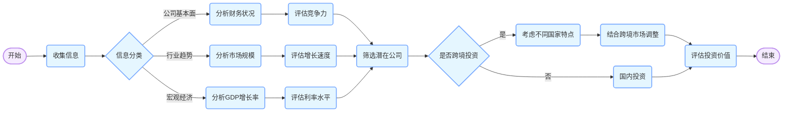

# 彼得林奇的"市场机会"在跨境投资中的识别

> 关键词：彼得林奇、市场机会、跨境投资、机会识别、投资策略

> 摘要：本文聚焦于彼得林奇的“市场机会”理论在跨境投资领域的应用。首先介绍了研究的背景、目的、预期读者和文档结构，对相关术语进行了明确。接着阐述了核心概念及其联系，分析了彼得林奇市场机会理论的原理和架构，并通过Mermaid流程图展示。详细讲解了识别市场机会的核心算法原理和具体操作步骤，辅以Python代码。从数学模型和公式角度深入剖析，结合实际例子加深理解。通过项目实战案例，包括开发环境搭建、源代码实现与解读，呈现了在跨境投资中运用该理论的具体过程。探讨了实际应用场景，推荐了学习资源、开发工具框架以及相关论文著作。最后总结了未来发展趋势与挑战，解答了常见问题并给出扩展阅读和参考资料，旨在为跨境投资者提供全面、深入的市场机会识别指导。

## 1. 背景介绍 
### 1.1 目的和范围
在全球化的经济背景下，跨境投资成为众多投资者拓展资产配置、追求更高收益的重要途径。然而，跨境投资面临着不同国家和地区的政治、经济、文化等多方面的差异，增加了投资的复杂性和风险。彼得林奇作为投资界的传奇人物，其独特的“市场机会”识别方法具有很高的借鉴价值。本文的目的在于探讨如何将彼得林奇的“市场机会”理论应用于跨境投资中，为投资者提供一套系统的市场机会识别方法。研究范围涵盖了不同国家和地区的主要金融市场，包括股票市场、债券市场、外汇市场等，旨在帮助投资者在跨境投资中准确把握市场机会，降低投资风险，提高投资回报率。

### 1.2 预期读者
本文的预期读者主要包括以下几类人群：
- 跨境投资者：希望通过运用彼得林奇的投资理念，在跨境投资中发现潜在的市场机会，优化投资组合，实现资产的增值。
- 金融从业者：如投资顾问、基金经理等，他们可以借鉴本文的方法和思路，为客户提供更专业的投资建议，提升投资管理能力。
- 金融专业学生：有助于他们深入理解投资理论在实际跨境投资中的应用，拓宽知识面，培养投资分析能力。

### 1.3 文档结构概述
本文将按照以下结构进行阐述：
- 核心概念与联系：介绍彼得林奇的“市场机会”理论核心概念，以及这些概念与跨境投资的联系，通过文本示意图和Mermaid流程图展示其原理和架构。
- 核心算法原理 & 具体操作步骤：详细讲解识别跨境投资市场机会的核心算法原理，并给出具体的操作步骤，同时使用Python代码进行说明。
- 数学模型和公式 & 详细讲解 & 举例说明：运用数学模型和公式对市场机会进行量化分析，结合实际例子进行详细讲解。
- 项目实战：通过一个实际的跨境投资项目案例，介绍开发环境搭建、源代码实现和代码解读，展示如何在实践中运用该理论。
- 实际应用场景：探讨彼得林奇的“市场机会”理论在不同跨境投资场景中的应用。
- 工具和资源推荐：推荐学习资源、开发工具框架以及相关论文著作，帮助读者进一步深入学习和研究。
- 总结：未来发展趋势与挑战：总结跨境投资中运用该理论的未来发展趋势，分析可能面临的挑战。
- 附录：常见问题与解答：解答读者在学习和应用过程中可能遇到的常见问题。
- 扩展阅读 & 参考资料：提供相关的扩展阅读材料和参考资料，方便读者进一步探索。

### 1.4 术语表
#### 1.4.1 核心术语定义
- **彼得林奇的“市场机会”**：彼得林奇认为市场机会是指在市场中存在的尚未被充分发掘的、具有潜在投资价值的领域或资产。这些机会可能源于公司的基本面变化、行业趋势、宏观经济环境等因素。
- **跨境投资**：指投资者将资金投入到其他国家或地区的金融市场，以获取收益的投资行为。跨境投资涉及不同国家的法律法规、市场规则、货币汇率等多种因素。
- **市场机会识别**：通过对各种信息的收集、分析和判断，发现潜在市场机会的过程。在跨境投资中，需要综合考虑不同国家和地区的市场特点和投资环境。

#### 1.4.2 相关概念解释
- **基本面分析**：通过研究公司的财务状况、经营业绩、行业竞争力等基本面因素，评估公司的内在价值，从而判断是否存在投资机会。在跨境投资中，基本面分析需要考虑不同国家的会计制度、税收政策等差异。
- **行业趋势分析**：研究特定行业的发展趋势，包括市场规模、增长速度、竞争格局等。跨境投资中，不同国家的行业发展阶段和政策环境可能不同，需要进行深入的比较和分析。
- **宏观经济环境**：指一个国家或地区的总体经济状况，包括GDP增长率、通货膨胀率、利率水平等。宏观经济环境的变化会对跨境投资产生重要影响，投资者需要密切关注不同国家的宏观经济指标。

#### 1.4.3 缩略词列表
- **GDP**：Gross Domestic Product，国内生产总值
- **PE**：Price-to-Earnings Ratio，市盈率
- **PB**：Price-to-Book Ratio，市净率

## 2. 核心概念与联系 

### 彼得林奇“市场机会”核心概念原理
彼得林奇的“市场机会”理论核心在于通过对公司和行业的深入研究，发现那些被市场低估的投资标的。他强调从日常生活中寻找投资线索，关注公司的基本面变化、行业的发展趋势以及宏观经济环境的影响。例如，他会注意到身边新出现的热门产品或服务，进而研究提供这些产品或服务的公司是否具有投资价值。

### 与跨境投资的联系
在跨境投资中，运用彼得林奇的“市场机会”理论需要考虑不同国家和地区的特殊性。不同国家的经济发展阶段、行业结构、政策法规等因素都会影响市场机会的分布。例如，新兴市场国家可能在某些新兴行业具有更大的发展潜力，而发达国家则在成熟行业中可能存在被低估的优质公司。投资者需要综合考虑这些因素，在跨境投资中寻找潜在的市场机会。

### 文本示意图
```plaintext
彼得林奇“市场机会”理论
|-- 公司基本面分析
|   |-- 财务状况
|   |-- 经营业绩
|   |-- 竞争力
|-- 行业趋势分析
|   |-- 市场规模
|   |-- 增长速度
|   |-- 竞争格局
|-- 宏观经济环境
|   |-- GDP增长率
|   |-- 通货膨胀率
|   |-- 利率水平

跨境投资
|-- 不同国家市场特点
|   |-- 经济发展阶段
|   |-- 行业结构
|   |-- 政策法规
|-- 市场机会识别
|   |-- 结合彼得林奇理论
|   |   |-- 筛选潜在投资标的
|   |   |-- 评估投资价值
```

### Mermaid流程图


## 3. 核心算法原理 & 具体操作步骤 

### 核心算法原理
在跨境投资中识别彼得林奇式的市场机会，核心算法基于多维度的数据分析和评估。主要包括以下几个方面：
- **公司基本面评分**：通过对公司的财务指标（如市盈率、市净率、净利润增长率等）进行量化评分，评估公司的内在价值。
- **行业趋势评分**：根据行业的市场规模增长率、竞争格局等因素，对行业的发展前景进行评分。
- **宏观经济评分**：考虑不同国家的GDP增长率、通货膨胀率、利率水平等宏观经济指标，评估宏观经济环境对投资的影响。
- **综合评分**：将公司基本面评分、行业趋势评分和宏观经济评分进行加权求和，得到每个投资标的的综合评分，综合评分越高，表明该标的的投资价值越大。

### 具体操作步骤

#### 步骤1：数据收集
收集不同国家和地区的公司财务数据、行业数据以及宏观经济数据。可以通过金融数据提供商（如彭博、万得等）、政府统计部门网站等渠道获取数据。

#### 步骤2：数据预处理
对收集到的数据进行清洗和整理，去除缺失值和异常值，统一数据格式。例如，将不同国家的财务报表按照统一的会计准则进行调整。

#### 步骤3：计算评分指标
- **公司基本面评分**：
    - 市盈率（PE）：$PE = \frac{股价}{每股收益}$，市盈率越低，表明公司的估值越低，评分越高。
    - 市净率（PB）：$PB = \frac{股价}{每股净资产}$，市净率越低，表明公司的资产价值相对股价越高，评分越高。
    - 净利润增长率：$净利润增长率 = \frac{本期净利润 - 上期净利润}{上期净利润} \times 100\%$，净利润增长率越高，表明公司的盈利能力越强，评分越高。

- **行业趋势评分**：
    - 市场规模增长率：$市场规模增长率 = \frac{本期市场规模 - 上期市场规模}{上期市场规模} \times 100\%$，市场规模增长率越高，表明行业的发展前景越好，评分越高。
    - 竞争格局评分：根据行业内企业的市场份额分布情况，评估行业的竞争激烈程度，竞争越缓和，评分越高。

- **宏观经济评分**：
    - GDP增长率：GDP增长率越高，表明宏观经济形势越好，评分越高。
    - 通货膨胀率：通货膨胀率过高会影响投资收益，通货膨胀率越低，评分越高。
    - 利率水平：利率水平越低，资金成本越低，对投资越有利，评分越高。

#### 步骤4：加权求和
根据不同指标的重要性，为公司基本面评分、行业趋势评分和宏观经济评分设置不同的权重，然后进行加权求和，得到每个投资标的的综合评分。

#### 步骤5：筛选投资标的
根据综合评分，筛选出评分较高的投资标的，作为潜在的投资对象。

### Python代码实现
```python
import pandas as pd

# 示例数据
data = {
    '公司名称': ['A公司', 'B公司', 'C公司'],
    '市盈率': [10, 20, 15],
    '市净率': [1.5, 2.0, 1.8],
    '净利润增长率': [0.2, 0.1, 0.15],
    '市场规模增长率': [0.1, 0.15, 0.12],
    '竞争格局评分': [3, 2, 2.5],
    'GDP增长率': [0.05, 0.03, 0.04],
    '通货膨胀率': [0.02, 0.03, 0.025],
    '利率水平': [0.03, 0.04, 0.035]
}

df = pd.DataFrame(data)

# 计算公司基本面评分
df['公司基本面评分'] = (1 / df['市盈率']) * 0.3 + (1 / df['市净率']) * 0.3 + df['净利润增长率'] * 0.4

# 计算行业趋势评分
df['行业趋势评分'] = df['市场规模增长率'] * 0.6 + df['竞争格局评分'] * 0.4

# 计算宏观经济评分
df['宏观经济评分'] = df['GDP增长率'] * 0.5 - df['通货膨胀率'] * 0.3 - df['利率水平'] * 0.2

# 设置权重
weight_company = 0.5
weight_industry = 0.3
weight_macro = 0.2

# 计算综合评分
df['综合评分'] = df['公司基本面评分'] * weight_company + df['行业趋势评分'] * weight_industry + df['宏观经济评分'] * weight_macro

# 筛选评分较高的投资标的
top_investments = df[df['综合评分'] > df['综合评分'].mean()]

print(top_investments)
```

## 4. 数学模型和公式 & 详细讲解 & 举例说明 

### 数学模型和公式
#### 公司基本面评分模型
公司基本面评分 $S_{company}$ 由市盈率评分 $S_{PE}$、市净率评分 $S_{PB}$ 和净利润增长率评分 $S_{growth}$ 加权求和得到：
$$S_{company} = w_{PE} \times S_{PE} + w_{PB} \times S_{PB} + w_{growth} \times S_{growth}$$
其中，$w_{PE}$、$w_{PB}$ 和 $w_{growth}$ 分别为市盈率、市净率和净利润增长率的权重，且 $w_{PE} + w_{PB} + w_{growth} = 1$。

市盈率评分 $S_{PE}$ 计算公式为：
$$S_{PE} = \frac{1}{PE}$$
市净率评分 $S_{PB}$ 计算公式为：
$$S_{PB} = \frac{1}{PB}$$
净利润增长率评分 $S_{growth}$ 即为净利润增长率本身。

#### 行业趋势评分模型
行业趋势评分 $S_{industry}$ 由市场规模增长率评分 $S_{market\_growth}$ 和竞争格局评分 $S_{competition}$ 加权求和得到：
$$S_{industry} = w_{market\_growth} \times S_{market\_growth} + w_{competition} \times S_{competition}$$
其中，$w_{market\_growth}$ 和 $w_{competition}$ 分别为市场规模增长率和竞争格局的权重，且 $w_{market\_growth} + w_{competition} = 1$。

市场规模增长率评分 $S_{market\_growth}$ 即为市场规模增长率本身，竞争格局评分 $S_{competition}$ 可以根据行业内企业的市场份额分布情况进行主观评估。

#### 宏观经济评分模型
宏观经济评分 $S_{macro}$ 由 GDP 增长率评分 $S_{GDP\_growth}$、通货膨胀率评分 $S_{inflation}$ 和利率水平评分 $S_{interest}$ 加权求和得到：
$$S_{macro} = w_{GDP\_growth} \times S_{GDP\_growth} + w_{inflation} \times S_{inflation} + w_{interest} \times S_{interest}$$
其中，$w_{GDP\_growth}$、$w_{inflation}$ 和 $w_{interest}$ 分别为 GDP 增长率、通货膨胀率和利率水平的权重，且 $w_{GDP\_growth} + w_{inflation} + w_{interest} = 1$。

GDP 增长率评分 $S_{GDP\_growth}$ 即为 GDP 增长率本身，通货膨胀率评分 $S_{inflation}$ 计算公式为：
$$S_{inflation} = - inflation$$
利率水平评分 $S_{interest}$ 计算公式为：
$$S_{interest} = - interest$$

#### 综合评分模型
综合评分 $S_{total}$ 由公司基本面评分 $S_{company}$、行业趋势评分 $S_{industry}$ 和宏观经济评分 $S_{macro}$ 加权求和得到：
$$S_{total} = w_{company} \times S_{company} + w_{industry} \times S_{industry} + w_{macro} \times S_{macro}$$
其中，$w_{company}$、$w_{industry}$ 和 $w_{macro}$ 分别为公司基本面、行业趋势和宏观经济的权重，且 $w_{company} + w_{industry} + w_{macro} = 1$。

### 详细讲解
- **公司基本面评分**：市盈率和市净率越低，表明公司的估值越低，投资价值越高，因此采用倒数的形式进行评分。净利润增长率越高，公司的盈利能力越强，评分越高。
- **行业趋势评分**：市场规模增长率反映了行业的发展潜力，增长率越高，评分越高。竞争格局评分根据行业内企业的市场份额分布情况进行评估，竞争越缓和，评分越高。
- **宏观经济评分**：GDP 增长率越高，宏观经济形势越好，评分越高。通货膨胀率和利率水平过高会影响投资收益，因此采用负数的形式进行评分。
- **综合评分**：将公司基本面、行业趋势和宏观经济三个方面的评分进行加权求和，得到综合评分，综合评分越高，表明该投资标的的投资价值越大。

### 举例说明
假设我们要评估一家跨境投资的目标公司，以下是相关数据：
- 公司基本面数据：市盈率 $PE = 15$，市净率 $PB = 1.8$，净利润增长率 $growth = 0.15$。
- 行业趋势数据：市场规模增长率 $market\_growth = 0.12$，竞争格局评分 $competition = 2.5$。
- 宏观经济数据：GDP 增长率 $GDP\_growth = 0.04$，通货膨胀率 $inflation = 0.025$，利率水平 $interest = 0.035$。

权重设置如下：
- 公司基本面评分权重：$w_{PE} = 0.3$，$w_{PB} = 0.3$，$w_{growth} = 0.4$。
- 行业趋势评分权重：$w_{market\_growth} = 0.6$，$w_{competition} = 0.4$。
- 宏观经济评分权重：$w_{GDP\_growth} = 0.5$，$w_{inflation} = 0.3$，$w_{interest} = 0.2$。
- 综合评分权重：$w_{company} = 0.5$，$w_{industry} = 0.3$，$w_{macro} = 0.2$。

#### 计算公司基本面评分
- 市盈率评分：$S_{PE} = \frac{1}{15} \approx 0.067$
- 市净率评分：$S_{PB} = \frac{1}{1.8} \approx 0.556$
- 净利润增长率评分：$S_{growth} = 0.15$
- 公司基本面评分：$S_{company} = 0.3 \times 0.067 + 0.3 \times 0.556 + 0.4 \times 0.15 \approx 0.243$

#### 计算行业趋势评分
- 市场规模增长率评分：$S_{market\_growth} = 0.12$
- 竞争格局评分：$S_{competition} = 2.5$
- 行业趋势评分：$S_{industry} = 0.6 \times 0.12 + 0.4 \times 2.5 = 1.072$

#### 计算宏观经济评分
- GDP 增长率评分：$S_{GDP\_growth} = 0.04$
- 通货膨胀率评分：$S_{inflation} = - 0.025$
- 利率水平评分：$S_{interest} = - 0.035$
- 宏观经济评分：$S_{macro} = 0.5 \times 0.04 + 0.3 \times (-0.025) + 0.2 \times (-0.035) = 0.0035$

#### 计算综合评分
$S_{total} = 0.5 \times 0.243 + 0.3 \times 1.072 + 0.2 \times 0.0035 = 0.404$

通过综合评分，我们可以对该投资标的的投资价值进行评估，与其他投资标的进行比较，从而做出投资决策。

## 5. 项目实战：代码实际案例和详细解释说明 

### 5.1  开发环境搭建
#### 安装 Python
首先，确保你已经安装了 Python 环境。可以从 Python 官方网站（https://www.python.org/downloads/）下载适合你操作系统的 Python 版本，并按照安装向导进行安装。

#### 安装必要的库
在项目中，我们需要使用 Pandas 库进行数据处理和分析。可以使用以下命令安装 Pandas：
```sh
pip install pandas
```

#### 数据获取
可以通过金融数据提供商（如彭博、万得等）获取公司财务数据、行业数据和宏观经济数据。也可以使用一些免费的数据源，如雅虎财经（https://finance.yahoo.com/），通过编写爬虫程序获取相关数据。

### 5.2  源代码详细实现和代码解读
```python
import pandas as pd

# 读取数据
data = pd.read_csv('investment_data.csv')

# 计算公司基本面评分
data['公司基本面评分'] = (1 / data['市盈率']) * 0.3 + (1 / data['市净率']) * 0.3 + data['净利润增长率'] * 0.4

# 计算行业趋势评分
data['行业趋势评分'] = data['市场规模增长率'] * 0.6 + data['竞争格局评分'] * 0.4

# 计算宏观经济评分
data['宏观经济评分'] = data['GDP增长率'] * 0.5 - data['通货膨胀率'] * 0.3 - data['利率水平'] * 0.2

# 设置权重
weight_company = 0.5
weight_industry = 0.3
weight_macro = 0.2

# 计算综合评分
data['综合评分'] = data['公司基本面评分'] * weight_company + data['行业趋势评分'] * weight_industry + data['宏观经济评分'] * weight_macro

# 筛选评分较高的投资标的
top_investments = data[data['综合评分'] > data['综合评分'].mean()]

# 保存结果
top_investments.to_csv('top_investments.csv', index=False)

print(top_investments)
```

### 代码解读与分析
- **数据读取**：使用 `pandas` 的 `read_csv` 函数读取存储在 `investment_data.csv` 文件中的数据。
- **公司基本面评分计算**：根据前面介绍的公式，计算每个公司的基本面评分。
- **行业趋势评分计算**：同样根据公式，计算每个行业的趋势评分。
- **宏观经济评分计算**：按照宏观经济评分模型，计算每个国家或地区的宏观经济评分。
- **综合评分计算**：将公司基本面评分、行业趋势评分和宏观经济评分进行加权求和，得到每个投资标的的综合评分。
- **筛选投资标的**：筛选出综合评分高于平均值的投资标的，作为潜在的投资对象。
- **结果保存**：将筛选结果保存到 `top_investments.csv` 文件中。

通过这个项目实战，我们可以将彼得林奇的“市场机会”理论应用到跨境投资中，通过数据驱动的方式识别潜在的投资机会。

## 6. 实际应用场景 
### 新兴市场投资
在新兴市场国家，经济发展迅速，一些新兴行业如科技、医疗等具有较大的发展潜力。运用彼得林奇的“市场机会”理论，投资者可以关注这些新兴行业中的初创公司，通过分析公司的基本面、行业趋势和当地的宏观经济环境，寻找被市场低估的投资机会。例如，在印度的科技行业，一些专注于移动支付和电子商务的公司，随着印度互联网普及率的提高和消费市场的增长，具有很大的发展空间。投资者可以通过研究这些公司的财务状况、技术实力和市场竞争力，判断是否具有投资价值。

### 成熟市场价值投资
在成熟市场国家，如美国、欧洲等，市场相对较为成熟，一些传统行业中的优质公司可能会因为短期的市场波动或行业竞争等原因被低估。投资者可以运用该理论，通过分析公司的基本面和行业趋势，寻找这些被低估的价值股。例如，在汽车行业，一些具有悠久历史和强大技术实力的汽车制造商，可能会因为新能源汽车的冲击而股价下跌。但如果这些公司能够及时调整战略，加大在新能源汽车领域的研发和投入，那么它们仍然具有投资价值。投资者可以通过评估公司的转型能力、财务状况和市场前景，判断是否值得投资。

### 跨境行业轮动投资
不同国家和地区的行业发展周期和市场表现存在差异，投资者可以根据彼得林奇的理论，进行跨境行业轮动投资。例如，当某个国家的房地产行业处于上升周期时，投资者可以增加对该国房地产相关股票的投资；而当另一个国家的科技行业开始崛起时，投资者可以将资金转移到该国的科技股上。通过把握不同国家和地区的行业轮动机会，投资者可以提高投资回报率。

### 跨境资产配置
在跨境投资中，投资者可以运用该理论进行资产配置，降低投资风险。通过分析不同国家和地区的宏观经济环境、行业趋势和公司基本面，选择不同类型的资产进行投资，如股票、债券、基金等。例如，在经济增长较快的国家，可以增加股票投资的比例；而在经济不稳定或利率较高的国家，可以适当增加债券投资的比例。通过合理的资产配置，投资者可以在追求收益的同时，降低投资组合的波动性。

## 7. 工具和资源推荐
### 7.1 学习资源推荐
#### 7.1.1 书籍推荐
- 《彼得·林奇的成功投资》：彼得·林奇本人撰写的经典投资著作，详细介绍了他的投资理念和方法，包括如何寻找市场机会、分析公司基本面等内容。
- 《聪明的投资者》：本杰明·格雷厄姆的代表作，被誉为投资界的“圣经”，书中阐述了价值投资的基本原理和方法，对跨境投资也具有重要的指导意义。
- 《金融炼金术》：乔治·索罗斯的著作，介绍了他的反身性理论和投资实践，对于理解金融市场的运行机制和投资机会的把握具有很大的帮助。

#### 7.1.2 在线课程
- Coursera 上的“投资学原理”课程：由知名大学的教授授课，系统介绍了投资学的基本理论和方法，包括资产定价、投资组合管理等内容。
- Udemy 上的“跨境投资实战”课程：专门针对跨境投资领域，介绍了跨境投资的策略、风险控制和市场机会识别等方面的知识。
- 中国大学 MOOC 上的“金融市场与金融机构”课程：涵盖了金融市场的各个方面，包括股票市场、债券市场、外汇市场等，对于了解跨境投资的市场环境具有重要的作用。

#### 7.1.3 技术博客和网站
- 雪球网：国内知名的投资社区，汇聚了众多投资者和投资专家，提供了丰富的投资资讯、研究报告和投资策略分享。
- Seeking Alpha：国外知名的金融投资网站，提供全球金融市场的新闻、分析和投资建议，对于跨境投资具有重要的参考价值。
- 东方财富网：国内大型的金融信息服务平台，提供股票、基金、债券等多种金融产品的行情数据和研究报告，方便投资者进行投资分析。

### 7.2 开发工具框架推荐
#### 7.2.1 IDE和编辑器
- PyCharm：一款专业的 Python 集成开发环境，具有代码编辑、调试、版本控制等功能，适合进行数据分析和算法开发。
- Jupyter Notebook：一种交互式的开发环境，支持 Python、R 等多种编程语言，方便进行数据探索和可视化分析。
- Visual Studio Code：一款轻量级的代码编辑器，支持多种编程语言和插件扩展，具有良好的代码编辑体验和开发效率。

#### 7.2.2 调试和性能分析工具
- PDB：Python 自带的调试工具，可以帮助开发者在代码运行过程中进行调试，查找和解决问题。
- cProfile：Python 的性能分析工具，可以分析代码的运行时间和函数调用情况，帮助开发者优化代码性能。
- Py-Spy：一个简单易用的 Python 性能分析工具，可以实时监测 Python 程序的运行状态，找出性能瓶颈。

#### 7.2.3 相关框架和库
- Pandas：用于数据处理和分析的 Python 库，提供了丰富的数据结构和数据操作方法，方便进行数据清洗、整理和分析。
- NumPy：Python 的数值计算库，提供了高效的多维数组对象和数学函数，用于进行数值计算和科学计算。
- Matplotlib：Python 的绘图库，用于进行数据可视化，帮助开发者直观地展示数据和分析结果。

### 7.3 相关论文著作推荐
#### 7.3.1 经典论文
- “The Capital Asset Pricing Model: Theory and Evidence”：该论文系统阐述了资本资产定价模型（CAPM），对于理解资产定价和投资组合理论具有重要的意义。
- “Efficient Capital Markets: A Review of Theory and Empirical Work”：有效市场假说的经典论文，探讨了金融市场的有效性和信息效率，对于投资决策具有重要的指导作用。
- “Behavioral Finance: A Review of the Literature”：行为金融学的综述论文，介绍了行为金融学的基本理论和研究成果，对于理解投资者的行为和市场的非理性现象具有重要的参考价值。

#### 7.3.2 最新研究成果
- 关注顶级金融学术期刊，如《Journal of Finance》、《Review of Financial Studies》等，这些期刊发表了最新的金融研究成果，包括跨境投资、市场机会识别等方面的研究。
- 参加金融学术会议，如美国金融协会年会（AFA）、欧洲金融协会年会（EFA）等，与国内外的金融学者和专家交流最新的研究动态和成果。

#### 7.3.3 应用案例分析
- 阅读金融机构的研究报告和案例分析，如高盛、摩根大通等投资银行的研究报告，了解它们在跨境投资中的策略和实践经验。
- 关注财经媒体的报道，如《金融时报》、《华尔街日报》等，获取最新的跨境投资案例和市场动态。

## 8. 总结：未来发展趋势与挑战
### 未来发展趋势
- **数字化和智能化**：随着科技的不断发展，跨境投资将越来越依赖数字化和智能化技术。投资者可以利用大数据、人工智能等技术，更高效地收集和分析信息，提高市场机会识别的准确性和效率。例如，通过机器学习算法对大量的金融数据进行分析，挖掘潜在的投资机会。
- **绿色投资和可持续发展**：全球对环境保护和可持续发展的关注度不断提高，绿色投资将成为跨境投资的重要趋势。投资者将更加关注企业的环境、社会和治理（ESG）表现，寻找具有可持续发展潜力的投资标的。例如，投资可再生能源、环保科技等领域的企业。
- **区域合作和一体化**：随着区域经济合作和一体化的推进，跨境投资将更加便利。例如，“一带一路”倡议的实施，为中国与沿线国家的跨境投资提供了更多的机会。投资者可以关注区域合作带来的市场机会，加强在相关地区的投资布局。

### 挑战
- **政治和政策风险**：不同国家的政治局势和政策变化可能会对跨境投资产生重大影响。例如，贸易保护主义政策的出台、政治动荡等都可能导致投资环境恶化，增加投资风险。投资者需要密切关注政治和政策动态，及时调整投资策略。
- **文化和法律差异**：跨境投资涉及不同国家的文化和法律体系，文化差异可能会影响企业的经营和管理，法律差异则可能导致投资纠纷和法律风险。投资者需要了解和适应不同国家的文化和法律环境，加强风险管理。
- **市场波动和不确定性**：全球金融市场的波动和不确定性增加，跨境投资面临着更大的市场风险。例如，汇率波动、股市暴跌等都可能导致投资损失。投资者需要具备较强的风险承受能力和风险管理能力，合理配置资产，降低市场波动对投资组合的影响。

## 9. 附录：常见问题与解答
### 问题 1：如何确定各评分指标的权重？
答：各评分指标的权重可以根据投资者的投资偏好和经验进行调整。一般来说，公司基本面是投资决策的重要依据，可以赋予较高的权重；行业趋势和宏观经济环境也会对投资产生重要影响，可以根据市场情况和投资策略适当分配权重。投资者可以通过历史数据回测和模拟投资等方法，优化权重设置，提高投资组合的绩效。

### 问题 2：跨境投资中如何处理汇率风险？
答：汇率风险是跨境投资中不可忽视的风险之一。投资者可以采取以下措施来处理汇率风险：
- **套期保值**：通过外汇远期合约、外汇期货等金融工具进行套期保值，锁定汇率，降低汇率波动对投资收益的影响。
- **分散投资**：在不同国家和地区进行投资，分散汇率风险。例如，同时投资多个国家的货币资产，降低单一货币汇率波动的影响。
- **关注宏观经济形势**：密切关注不同国家的宏观经济形势和货币政策，及时调整投资组合，避免因汇率波动带来的损失。

### 问题 3：如何获取准确的跨境投资数据？
答：可以通过以下途径获取准确的跨境投资数据：
- **金融数据提供商**：如彭博、万得等，这些数据提供商提供了丰富的金融数据，包括公司财务数据、行业数据、宏观经济数据等。
- **政府统计部门网站**：各国政府统计部门网站会公布相关的宏观经济数据和行业数据，数据的准确性和权威性较高。
- **上市公司公告**：可以通过上市公司的官方网站或证券交易所网站获取公司的财务报表、业绩公告等信息。

## 10. 扩展阅读 & 参考资料
### 扩展阅读
- 《投资中最简单的事》：邱国鹭的著作，介绍了价值投资的简单方法和原则，对于跨境投资也具有一定的借鉴意义。
- 《漫步华尔街》：伯顿·马尔基尔的经典著作，介绍了投资的基本原理和市场的运行规律，帮助投资者树立正确的投资观念。
- 《黑天鹅：如何应对不可预知的未来》：纳西姆·尼古拉斯·塔勒布的著作，探讨了不确定性和风险的管理，对于跨境投资中的风险管理具有重要的启示。

### 参考资料
- 彼得·林奇. 《彼得·林奇的成功投资》. 机械工业出版社.
- 本杰明·格雷厄姆. 《聪明的投资者》. 人民邮电出版社.
- 乔治·索罗斯. 《金融炼金术》. 海南出版社.

作者：AI天才研究院/AI Genius Institute & 禅与计算机程序设计艺术 /Zen And The Art of Computer Programming