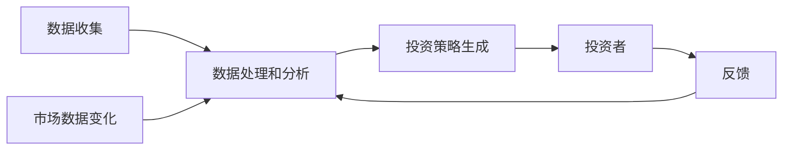

# 彼得林奇的"常识投资"在人工智能投顾时代的价值重估

> 关键词：彼得林奇、常识投资、人工智能投顾、价值重估、投资策略

> 摘要：本文旨在探讨彼得林奇的“常识投资”理念在人工智能投顾时代的价值。首先介绍了背景信息，包括研究目的、预期读者等。接着阐述了“常识投资”和人工智能投顾的核心概念及其联系。详细讲解了相关的核心算法原理、数学模型和公式。通过项目实战案例展示了“常识投资”在实际中的应用。分析了“常识投资”在不同场景下的实际应用。推荐了相关的学习资源、开发工具和论文著作。最后总结了未来发展趋势与挑战，并对常见问题进行了解答，还给出了扩展阅读和参考资料。彼得林奇的“常识投资”理念在人工智能投顾时代仍具有不可忽视的价值，能为投资者提供独特的视角和补充。

## 1. 背景介绍 
### 1.1 目的和范围
在当今金融市场，人工智能投顾逐渐兴起并成为热门话题。人工智能凭借其强大的数据处理和分析能力，为投资者提供了全新的投资建议和策略。然而，传统的投资理念也并未过时。彼得林奇作为投资界的传奇人物，他所倡导的“常识投资”理念以其简单易懂、贴近生活的特点，在过去帮助众多投资者取得了成功。本研究的目的在于深入探讨在人工智能投顾盛行的时代，彼得林奇的“常识投资”理念是否依然具有价值，以及如何重新评估其价值。研究范围涵盖了“常识投资”理念的核心内容、人工智能投顾的原理和应用，以及两者在实际投资场景中的结合与对比。

### 1.2 预期读者
本文预期读者包括对投资领域感兴趣的个人投资者、金融从业者、研究金融市场和投资策略的学者，以及对人工智能在金融领域应用有探索欲望的技术人员。对于个人投资者，希望能帮助他们在面对人工智能投顾的同时，更好地运用“常识投资”理念进行投资决策；金融从业者可以从中获取新的投资思路和方法，为客户提供更全面的投资建议；学者可以将其作为研究金融投资理念演变和融合的参考；技术人员则可以了解金融业务需求，为开发更完善的人工智能投顾系统提供灵感。

### 1.3 文档结构概述
本文将按照以下结构进行阐述：首先介绍核心概念，包括“常识投资”和人工智能投顾，以及它们之间的联系；接着讲解核心算法原理和具体操作步骤，用 Python 代码进行详细说明；然后介绍相关的数学模型和公式，并举例说明；通过项目实战展示“常识投资”在实际中的应用，包括开发环境搭建、源代码实现和代码解读；分析“常识投资”在不同场景下的实际应用；推荐学习资源、开发工具和相关论文著作；总结未来发展趋势与挑战；解答常见问题；最后给出扩展阅读和参考资料。

### 1.4 术语表
#### 1.4.1 核心术语定义
- **常识投资**：彼得林奇所倡导的投资理念，强调投资者可以利用日常生活中的常识和对周围事物的观察来发现具有投资价值的公司。例如，通过留意身边消费者对某种产品的喜爱程度、某个行业的发展趋势等，来判断相关公司的投资潜力。
- **人工智能投顾**：利用人工智能技术，通过对大量金融数据的分析和处理，为投资者提供个性化的投资建议和资产配置方案的服务。它结合了机器学习、大数据分析等技术，能够根据投资者的风险偏好、投资目标等因素进行智能化的投资决策。
- **资产配置**：指投资者将资金分配到不同类型的资产中，如股票、债券、基金等，以达到分散风险、实现投资目标的目的。

#### 1.4.2 相关概念解释
- **机器学习**：是人工智能的一个重要分支，它让计算机通过数据学习模式和规律，从而做出预测和决策。在人工智能投顾中，机器学习算法可以用于分析金融市场数据、预测资产价格走势等。
- **大数据分析**：对海量数据进行采集、存储、管理和分析的过程。在金融领域，大数据分析可以帮助获取更全面的市场信息，为投资决策提供更准确的依据。

#### 1.4.3 缩略词列表
- **AI**：Artificial Intelligence，人工智能
- **ML**：Machine Learning，机器学习
- **ETF**：Exchange - Traded Fund，交易型开放式指数基金

## 2. 核心概念与联系 

### 2.1 彼得林奇的“常识投资”理念
彼得林奇认为，普通投资者可以通过日常生活中的观察和常识来发现投资机会。他举例说，如果一个投资者注意到身边的人都热衷于购买某家公司的产品，那么这家公司很可能具有良好的发展前景。这种投资理念强调了投资者对生活细节的关注和对市场的直观感受。它不依赖于复杂的金融模型和高深的理论知识，而是基于普通人对世界的认知。例如，当你发现周围的小朋友都喜欢某款玩具，那么生产这款玩具的公司就值得关注。通过进一步了解该公司的财务状况、市场份额等信息，有可能发现一个潜在的投资标的。

### 2.2 人工智能投顾的原理和架构
人工智能投顾主要基于以下几个核心步骤来为投资者提供服务：
1. **数据收集**：收集各种金融数据，包括股票价格、债券收益率、宏观经济指标等，同时也会收集投资者的个人信息，如年龄、收入、风险偏好等。
2. **数据处理和分析**：运用机器学习算法对收集到的数据进行处理和分析，挖掘数据中的规律和模式。例如，使用回归分析预测资产价格走势，使用聚类分析对投资者进行分类。
3. **投资策略生成**：根据分析结果和投资者的个人信息，生成个性化的投资策略和资产配置方案。
4. **策略调整和优化**：随着市场情况的变化和投资者需求的改变，实时调整和优化投资策略。

以下是人工智能投顾的 Mermaid 流程图：


### 2.3 “常识投资”与人工智能投顾的联系
“常识投资”和人工智能投顾并非相互排斥，而是可以相互补充。人工智能投顾能够处理大量的数据和复杂的模型，为投资者提供科学、系统的投资建议。然而，它可能缺乏对市场的直观感受和对人性因素的考虑。而“常识投资”则可以弥补这一不足，投资者的常识和经验可以为人工智能投顾提供更全面的视角。例如，人工智能投顾可能根据历史数据推荐了某只股票，但投资者通过“常识投资”发现该公司的产品在市场上的口碑不佳，这就可以作为一个重要的参考因素，对投资决策进行调整。

## 3. 核心算法原理 & 具体操作步骤 

### 3.1 人工智能投顾中的核心算法
在人工智能投顾中，常用的算法包括线性回归、决策树、神经网络等。这里以线性回归为例进行讲解。线性回归是一种用于建立自变量和因变量之间线性关系的统计方法。在投资领域，我们可以使用线性回归来预测股票价格。假设我们有一组历史股票价格数据 $y_1, y_2, \cdots, y_n$，以及与之对应的自变量数据 $x_1, x_2, \cdots, x_n$（例如宏观经济指标），我们希望找到一个线性模型 $y = \beta_0 + \beta_1x$ 来拟合这些数据，其中 $\beta_0$ 和 $\beta_1$ 是待求解的参数。

### 3.2 Python 代码实现线性回归
```python
import numpy as np
from sklearn.linear_model import LinearRegression

# 示例数据
x = np.array([1, 2, 3, 4, 5]).reshape(-1, 1)
y = np.array([2, 4, 6, 8, 10])

# 创建线性回归模型
model = LinearRegression()

# 拟合数据
model.fit(x, y)

# 预测新数据
new_x = np.array([6]).reshape(-1, 1)
prediction = model.predict(new_x)

print("预测值:", prediction)
```
### 3.3 具体操作步骤
1. **数据准备**：收集和整理用于训练和预测的金融数据。确保数据的准确性和完整性。
2. **数据预处理**：对数据进行清洗、归一化等处理，以提高模型的性能。
3. **模型选择和训练**：根据问题的特点选择合适的算法模型，并使用训练数据对模型进行训练。
4. **模型评估**：使用测试数据对训练好的模型进行评估，检查模型的准确性和泛化能力。
5. **预测和决策**：使用训练好的模型对新的数据进行预测，并根据预测结果做出投资决策。

## 4. 数学模型和公式 & 详细讲解 & 举例说明 

### 4.1 线性回归的数学模型
线性回归的数学模型可以表示为：
$$y = \beta_0 + \beta_1x_1 + \beta_2x_2 + \cdots + \beta_nx_n + \epsilon$$
其中，$y$ 是因变量（如股票价格），$x_1, x_2, \cdots, x_n$ 是自变量（如宏观经济指标、公司财务指标等），$\beta_0, \beta_1, \cdots, \beta_n$ 是待求解的参数，$\epsilon$ 是误差项。

### 4.2 最小二乘法求解参数
为了求解参数 $\beta_0, \beta_1, \cdots, \beta_n$，我们通常使用最小二乘法。最小二乘法的目标是使预测值与实际值之间的误差平方和最小。误差平方和可以表示为：
$$S(\beta) = \sum_{i = 1}^{m}(y_i - \hat{y}_i)^2 = \sum_{i = 1}^{m}(y_i - (\beta_0 + \beta_1x_{i1} + \beta_2x_{i2} + \cdots + \beta_nx_{in}))^2$$
其中，$m$ 是样本数量，$y_i$ 是实际值，$\hat{y}_i$ 是预测值。

通过对 $S(\beta)$ 求偏导数并令其等于 0，可以得到参数的最优解。

### 4.3 举例说明
假设我们要预测某只股票的价格，我们选择了两个自变量：宏观经济增长率 $x_1$ 和公司的净利润增长率 $x_2$。我们收集了 10 个样本数据，如下表所示：

| 样本编号 | 宏观经济增长率 $x_1$ | 公司净利润增长率 $x_2$ | 股票价格 $y$ |
| ---- | ---- | ---- | ---- |
| 1 | 0.02 | 0.05 | 10 |
| 2 | 0.03 | 0.06 | 12 |
| 3 | 0.04 | 0.07 | 14 |
| 4 | 0.05 | 0.08 | 16 |
| 5 | 0.06 | 0.09 | 18 |
| 6 | 0.07 | 0.1 | 20 |
| 7 | 0.08 | 0.11 | 22 |
| 8 | 0.09 | 0.12 | 24 |
| 9 | 0.1 | 0.13 | 26 |
| 10 | 0.11 | 0.14 | 28 |

使用 Python 的 `sklearn` 库进行线性回归分析：
```python
import numpy as np
from sklearn.linear_model import LinearRegression

# 自变量数据
X = np.array([[0.02, 0.05], [0.03, 0.06], [0.04, 0.07], [0.05, 0.08], [0.06, 0.09],
              [0.07, 0.1], [0.08, 0.11], [0.09, 0.12], [0.1, 0.13], [0.11, 0.14]])
# 因变量数据
y = np.array([10, 12, 14, 16, 18, 20, 22, 24, 26, 28])

# 创建线性回归模型
model = LinearRegression()

# 拟合数据
model.fit(X, y)

# 输出参数
print("截距:", model.intercept_)
print("系数:", model.coef_)
```
通过上述代码，我们可以得到线性回归模型的参数，从而可以根据新的宏观经济增长率和公司净利润增长率来预测股票价格。

## 5. 项目实战：代码实际案例和详细解释说明 

### 5.1  开发环境搭建
1. **安装 Python**：从 Python 官方网站（https://www.python.org/downloads/）下载并安装适合你操作系统的 Python 版本。建议安装 Python 3.7 及以上版本。
2. **安装必要的库**：使用 `pip` 命令安装所需的库，包括 `numpy`、`pandas`、`scikit-learn` 等。
```sh
pip install numpy pandas scikit-learn
```
3. **选择开发工具**：可以选择使用 Jupyter Notebook 进行交互式开发，也可以使用 PyCharm 等集成开发环境。

### 5.2  源代码详细实现和代码解读
以下是一个结合“常识投资”和人工智能投顾的简单项目示例。假设我们根据“常识投资”发现某行业具有发展潜力，我们使用线性回归模型来预测该行业中某只股票的价格。

```python
import numpy as np
import pandas as pd
from sklearn.linear_model import LinearRegression
from sklearn.model_selection import train_test_split
from sklearn.metrics import mean_squared_error

# 读取数据
data = pd.read_csv('stock_data.csv')

# 提取自变量和因变量
X = data[['macro_growth_rate', 'company_profit_growth_rate']]
y = data['stock_price']

# 划分训练集和测试集
X_train, X_test, y_train, y_test = train_test_split(X, y, test_size=0.2, random_state=42)

# 创建线性回归模型
model = LinearRegression()

# 拟合训练数据
model.fit(X_train, y_train)

# 在测试集上进行预测
y_pred = model.predict(X_test)

# 计算均方误差
mse = mean_squared_error(y_test, y_pred)
print("均方误差:", mse)

# 预测新数据
new_data = np.array([[0.05, 0.08]])
prediction = model.predict(new_data)
print("预测价格:", prediction)
```
### 代码解读：
1. **数据读取**：使用 `pandas` 库的 `read_csv` 函数读取存储在 `stock_data.csv` 文件中的股票数据。
2. **数据划分**：使用 `train_test_split` 函数将数据划分为训练集和测试集，其中测试集占总数据的 20%。
3. **模型训练**：创建线性回归模型并使用训练集数据进行拟合。
4. **模型评估**：使用测试集数据进行预测，并计算预测值与实际值之间的均方误差，以评估模型的性能。
5. **新数据预测**：使用训练好的模型对新的数据进行预测。

### 5.3  代码解读与分析
- **数据质量**：数据的质量对模型的性能至关重要。在实际应用中，需要对数据进行清洗和预处理，去除缺失值、异常值等。
- **模型选择**：线性回归模型是一种简单而有效的模型，但在处理复杂的非线性关系时可能效果不佳。可以考虑使用更复杂的模型，如决策树、神经网络等。
- **过拟合和欠拟合**：需要注意模型是否存在过拟合或欠拟合的问题。可以通过交叉验证等方法来评估模型的泛化能力，并进行相应的调整。

## 6. 实际应用场景 
### 6.1 个人投资者
对于个人投资者来说，“常识投资”可以帮助他们在日常生活中发现投资机会。例如，当你发现身边的人都热衷于购买某家公司的产品时，你可以进一步了解该公司的情况。然后，结合人工智能投顾提供的数据分析和投资建议，做出更明智的投资决策。人工智能投顾可以帮助个人投资者进行资产配置，根据投资者的风险偏好和投资目标，提供个性化的投资方案。

### 6.2 金融机构
金融机构可以将“常识投资”理念融入到人工智能投顾系统中。通过对投资者的行为和偏好进行分析，结合市场常识，为客户提供更贴心的投资服务。例如，当市场出现某种热门趋势时，金融机构可以根据“常识投资”判断这种趋势是否具有可持续性，并通过人工智能投顾系统为客户提供相应的投资建议。同时，金融机构还可以利用人工智能投顾系统对大量客户的投资数据进行分析，发现潜在的投资机会和风险。

### 6.3 风险管理
在风险管理方面，“常识投资”和人工智能投顾也可以发挥重要作用。“常识投资”可以帮助投资者识别一些明显的风险因素，如公司的产品质量问题、市场竞争加剧等。人工智能投顾则可以通过对大量数据的分析，预测市场风险的变化趋势。例如，通过分析宏观经济数据、行业数据和公司财务数据，预测股票市场的波动风险。投资者可以根据这些信息调整自己的投资组合，降低风险。

## 7. 工具和资源推荐
### 7.1 学习资源推荐
#### 7.1.1 书籍推荐
- 《彼得林奇的成功投资》：彼得林奇本人撰写的经典投资书籍，详细阐述了他的“常识投资”理念和投资方法。
- 《聪明的投资者》：本杰明·格雷厄姆的著作，被誉为投资界的圣经，对价值投资和风险管理有深入的讲解。
- 《机器学习》：周志华编著的教材，系统介绍了机器学习的基本概念、算法和应用。

#### 7.1.2 在线课程
- Coursera 上的“机器学习”课程：由斯坦福大学的 Andrew Ng 教授授课，是学习机器学习的经典课程。
- edX 上的“金融科技”课程：介绍了金融科技的最新发展和应用，包括人工智能投顾。

#### 7.1.3 技术博客和网站
- Medium：上面有很多关于投资和人工智能的优质文章，作者来自不同的领域，可以提供不同的视角。
- Seeking Alpha：专注于金融市场分析和投资建议，有很多专业的投资者和分析师分享自己的观点。

### 7.2 开发工具框架推荐
#### 7.2.1 IDE和编辑器
- PyCharm：功能强大的 Python 集成开发环境，适合开发大型的 Python 项目。
- Jupyter Notebook：交互式的开发环境，适合进行数据分析和模型实验。

#### 7.2.2 调试和性能分析工具
- Py-Spy：用于分析 Python 程序的性能瓶颈，找出运行缓慢的代码部分。
-pdb：Python 自带的调试工具，可以帮助开发者调试代码中的错误。

#### 7.2.3 相关框架和库
- scikit-learn：Python 中常用的机器学习库，提供了丰富的机器学习算法和工具。
- TensorFlow：谷歌开发的深度学习框架，可用于构建复杂的神经网络模型。

### 7.3 相关论文著作推荐
#### 7.3.1 经典论文
- “Capital Asset Prices: A Theory of Market Equilibrium Under Conditions of Risk”：由 William F. Sharpe 撰写，提出了资本资产定价模型（CAPM），是现代金融理论的重要基础。
- “Efficient Capital Markets: A Review of Theory and Empirical Work”：由 Eugene F. Fama 撰写，对有效市场假说进行了系统的阐述。

#### 7.3.2 最新研究成果
- 关注顶级金融期刊，如《Journal of Finance》、《Review of Financial Studies》等，了解人工智能投顾和投资领域的最新研究动态。

#### 7.3.3 应用案例分析
- 一些金融科技公司会发布关于人工智能投顾应用的案例分析报告，可以通过它们的官方网站获取这些资料。

## 8. 总结：未来发展趋势与挑战
### 8.1 未来发展趋势
- **融合发展**：“常识投资”和人工智能投顾将进一步融合。人工智能投顾将不断吸收“常识投资”中的经验和智慧，同时，“常识投资”也可以借助人工智能技术进行更深入的分析和验证。
- **个性化服务**：随着技术的发展，人工智能投顾将能够提供更加个性化的投资服务。根据投资者的不同需求、偏好和风险承受能力，提供定制化的投资方案。
- **跨领域应用**：人工智能投顾将与其他领域进行更广泛的融合，如区块链、大数据等。例如，利用区块链技术提高投资数据的安全性和透明度。

### 8.2 挑战
- **数据安全和隐私**：人工智能投顾需要处理大量的投资者个人信息和金融数据，数据安全和隐私保护成为重要挑战。一旦数据泄露，可能会给投资者带来巨大的损失。
- **模型解释性**：一些复杂的人工智能模型，如深度学习模型，具有较高的预测精度，但缺乏解释性。投资者难以理解模型的决策过程，这可能会影响他们对投资建议的信任。
- **市场不确定性**：金融市场具有高度的不确定性，即使是最先进的人工智能投顾也难以准确预测市场的变化。“常识投资”虽然具有一定的灵活性，但也难以应对突发的市场事件。

## 9. 附录：常见问题与解答
### 9.1 “常识投资”是否适用于所有投资者？
“常识投资”相对简单易懂，适合大多数投资者。但对于一些专业的机构投资者来说，可能需要结合更复杂的金融模型和分析方法。同时，“常识投资”也需要投资者具备一定的观察力和分析能力。

### 9.2 人工智能投顾的投资建议一定准确吗？
人工智能投顾的投资建议是基于历史数据和模型分析得出的，但金融市场是复杂多变的，存在很多不确定性因素。因此，人工智能投顾的投资建议不能保证一定准确，投资者还需要结合自己的判断和其他信息进行决策。

### 9.3 如何判断人工智能投顾系统的优劣？
可以从以下几个方面判断：模型的准确性和稳定性、数据的质量和更新频率、投资建议的个性化程度、系统的安全性和可靠性等。同时，可以参考其他投资者的评价和专业机构的评测。

## 10. 扩展阅读 & 参考资料
### 10.1 扩展阅读
- 《金融炼金术》：乔治·索罗斯的著作，介绍了他的投资哲学和市场分析方法。
- 《黑天鹅》：纳西姆·尼古拉斯·塔勒布的作品，探讨了极端事件对金融市场的影响。

### 10.2 参考资料
- 彼得林奇的官方网站和相关采访记录。
- 金融科技公司的研究报告和白皮书。
- 相关学术期刊上的论文。

作者：AI天才研究院/AI Genius Institute & 禅与计算机程序设计艺术 /Zen And The Art of Computer Programming