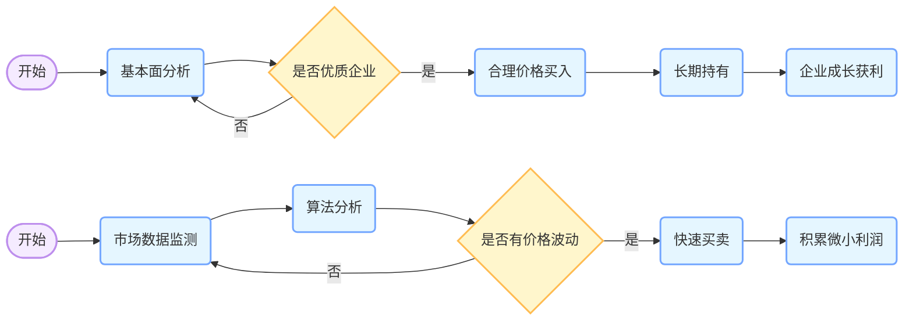

# 彼得林奇的“慢牛”投资在高频交易环境中的优势

> 关键词：彼得林奇、慢牛投资、高频交易、投资优势、长期价值

> 摘要：本文旨在深入探讨彼得林奇的“慢牛”投资策略在高频交易盛行的当下所具备的独特优势。通过对“慢牛”投资和高频交易核心概念的剖析，阐述“慢牛”投资的算法原理、数学模型，结合实际项目案例展示其应用，并分析其在不同场景下的适用性。同时，为读者推荐相关学习资源、开发工具和研究论文，最后对“慢牛”投资的未来发展趋势与挑战进行总结，帮助投资者更全面地认识这一投资策略。

## 1. 背景介绍 
### 1.1 目的和范围
在当今金融市场中，高频交易凭借其快速的交易速度和高频率的操作成为市场的一股重要力量。然而，彼得林奇所倡导的“慢牛”投资策略，强调长期投资和对企业内在价值的挖掘，与高频交易形成鲜明对比。本文的目的在于详细分析“慢牛”投资在高频交易环境中的优势，为投资者提供多元化的投资视角。研究范围涵盖“慢牛”投资和高频交易的基本概念、投资原理、实际应用场景等方面。

### 1.2 预期读者
本文预期读者包括金融投资领域的从业者，如基金经理、投资顾问等；对金融市场感兴趣的个人投资者；以及从事金融相关研究的学者和学生。通过阅读本文，读者能够深入了解“慢牛”投资策略在高频交易环境中的特点和优势，为其投资决策提供参考。

### 1.3 文档结构概述
本文将按照以下结构展开：首先介绍核心概念，包括“慢牛”投资和高频交易的定义及联系；接着阐述“慢牛”投资的核心算法原理和具体操作步骤，并给出相应的 Python 代码示例；然后介绍“慢牛”投资的数学模型和公式，并进行详细讲解和举例说明；之后通过项目实战展示“慢牛”投资的实际应用；再分析“慢牛”投资的实际应用场景；为读者推荐相关的工具和资源；最后总结“慢牛”投资的未来发展趋势与挑战，并提供常见问题解答和扩展阅读参考资料。

### 1.4 术语表
#### 1.4.1 核心术语定义
- **慢牛投资**：指投资者基于对企业基本面的深入研究，选择具有长期增长潜力的股票进行投资，并长期持有，以获取企业成长带来的收益。该策略更注重企业的内在价值和长期发展趋势，而非短期的市场波动。
- **高频交易**：利用高速计算机系统，在极短的时间内进行大量的交易操作，通过捕捉市场微小的价格波动来获取利润。高频交易通常依赖于复杂的算法和技术，对交易速度和市场数据的处理能力要求极高。
- **企业内在价值**：企业在未来持续经营过程中所能产生的现金流量的现值。它是评估企业投资价值的重要指标，不依赖于市场短期的价格波动。

#### 1.4.2 相关概念解释
- **基本面分析**：通过研究企业的财务状况、行业地位、管理层能力等基本因素，评估企业的内在价值和发展前景。基本面分析是“慢牛”投资的重要依据。
- **技术分析**：通过研究市场历史价格和交易量等数据，预测市场未来走势。高频交易中常运用技术分析来寻找交易机会。

#### 1.4.3 缩略词列表
- **ETF**：交易型开放式指数基金（Exchange Traded Fund），是一种在交易所上市交易的、基金份额可变的开放式基金。
- **MACD**：指数平滑异同移动平均线（Moving Average Convergence Divergence），是一种常用的技术分析指标。

## 2. 核心概念与联系 

### 2.1 “慢牛”投资的核心概念
“慢牛”投资的核心在于对企业内在价值的深入挖掘和长期持有。投资者通过基本面分析，筛选出具有良好财务状况、行业竞争优势和发展潜力的企业，在合理的价格买入并长期持有这些股票，等待企业成长带来的价值提升。其原理基于价值投资理论，认为市场价格会围绕企业内在价值波动，长期来看，市场价格会向企业内在价值回归。

### 2.2 高频交易的核心概念
高频交易是一种利用计算机算法和高速交易系统，在极短时间内进行大量交易的投资策略。高频交易员通过分析市场数据，捕捉微小的价格波动，进行快速的买卖操作，以获取利润。高频交易的成功依赖于交易速度、算法的精准性和对市场数据的实时处理能力。

### 2.3 “慢牛”投资与高频交易的联系
虽然“慢牛”投资和高频交易在投资理念、交易频率和时间跨度上存在显著差异，但它们并非完全相互排斥。在某些情况下，高频交易可以为市场提供流动性，有助于“慢牛”投资者在合适的价格买入或卖出股票。同时，“慢牛”投资所关注的企业基本面信息也可能影响高频交易的决策，例如企业的重大利好消息可能引发高频交易员的短期交易行为。

### 2.4 核心概念原理和架构的文本示意图
```plaintext
慢牛投资：基本面分析 -> 筛选优质企业 -> 合理价格买入 -> 长期持有 -> 企业成长获利
高频交易：市场数据监测 -> 算法分析 -> 捕捉价格波动 -> 快速买卖 -> 积累微小利润
```

### 2.5 Mermaid 流程图


## 3. 核心算法原理 & 具体操作步骤 

### 3.1 “慢牛”投资的核心算法原理
“慢牛”投资的核心算法原理基于对企业内在价值的评估。常见的方法是使用现金流折现模型（DCF），该模型通过预测企业未来的现金流量，并将其折现到当前时刻，得到企业的内在价值。具体公式为：

$$V = \sum_{t=1}^{n} \frac{CF_t}{(1 + r)^t} + \frac{TV}{(1 + r)^n}$$

其中，$V$ 表示企业的内在价值，$CF_t$ 表示第 $t$ 期的现金流量，$r$ 表示折现率，$n$ 表示预测期数，$TV$ 表示终值。

### 3.2 具体操作步骤
#### 3.2.1 数据收集
收集企业的财务报表、行业报告、宏观经济数据等信息，为基本面分析提供数据支持。

#### 3.2.2 基本面分析
- **财务分析**：分析企业的盈利能力、偿债能力、运营能力等财务指标，评估企业的财务状况。
- **行业分析**：研究企业所处行业的发展趋势、竞争格局等，判断企业的行业地位和发展前景。
- **管理层分析**：评估企业管理层的能力和信誉，了解企业的战略规划和发展方向。

#### 3.2.3 内在价值评估
使用现金流折现模型或其他估值方法，计算企业的内在价值。

#### 3.2.4 投资决策
当股票价格低于企业内在价值时，考虑买入股票；并长期持有，等待企业成长带来的价值提升。

### 3.3 Python 代码示例
```python
import numpy as np

def dcf_valuation(cash_flows, discount_rate, terminal_value):
    """
    现金流折现模型计算企业内在价值
    :param cash_flows: 未来各期现金流量列表
    :param discount_rate: 折现率
    :param terminal_value: 终值
    :return: 企业内在价值
    """
    n = len(cash_flows)
    present_values = []
    for t in range(n):
        present_value = cash_flows[t] / ((1 + discount_rate) ** (t + 1))
        present_values.append(present_value)
    terminal_present_value = terminal_value / ((1 + discount_rate) ** n)
    intrinsic_value = sum(present_values) + terminal_present_value
    return intrinsic_value

# 示例数据
cash_flows = [100, 120, 150, 180, 200]
discount_rate = 0.1
terminal_value = 1000

# 计算内在价值
intrinsic_value = dcf_valuation(cash_flows, discount_rate, terminal_value)
print(f"企业内在价值: {intrinsic_value}")
```

## 4. 数学模型和公式 & 详细讲解 & 举例说明 

### 4.1 现金流折现模型（DCF）
#### 4.1.1 公式详细讲解
$$V = \sum_{t=1}^{n} \frac{CF_t}{(1 + r)^t} + \frac{TV}{(1 + r)^n}$$

- $\sum_{t=1}^{n} \frac{CF_t}{(1 + r)^t}$：表示预测期内各期现金流量的现值之和。其中，$CF_t$ 是第 $t$ 期的现金流量，$r$ 是折现率，$t$ 是期数。折现率反映了资金的时间价值和投资风险，一般可以使用加权平均资本成本（WACC）来确定。
- $\frac{TV}{(1 + r)^n}$：表示终值的现值。终值是指预测期结束后企业的价值，通常可以使用永续增长模型来计算。

#### 4.1.2 举例说明
假设一家企业未来 5 年的现金流量分别为 100 万元、120 万元、150 万元、180 万元和 200 万元，折现率为 10%，预测期结束后企业的终值为 1000 万元。则该企业的内在价值计算如下：

第 1 年现金流量现值：$\frac{100}{(1 + 0.1)^1} \approx 90.91$（万元）
第 2 年现金流量现值：$\frac{120}{(1 + 0.1)^2} \approx 99.17$（万元）
第 3 年现金流量现值：$\frac{150}{(1 + 0.1)^3} \approx 112.69$（万元）
第 4 年现金流量现值：$\frac{180}{(1 + 0.1)^4} \approx 122.94$（万元）
第 5 年现金流量现值：$\frac{200}{(1 + 0.1)^5} \approx 124.18$（万元）
终值现值：$\frac{1000}{(1 + 0.1)^5} \approx 620.92$（万元）

企业内在价值：$90.91 + 99.17 + 112.69 + 122.94 + 124.18 + 620.92 = 1170.81$（万元）

### 4.2 市盈率（PE）估值模型
#### 4.2.1 公式详细讲解
市盈率（PE）是指股票价格与每股收益（EPS）的比率，计算公式为：

$$PE = \frac{P}{EPS}$$

其中，$P$ 表示股票价格，$EPS$ 表示每股收益。通过与同行业其他企业的市盈率进行比较，可以评估股票的相对估值水平。

#### 4.2.2 举例说明
假设一家企业的股票价格为 50 元，每股收益为 5 元，则该企业的市盈率为：

$PE = \frac{50}{5} = 10$

如果同行业其他企业的平均市盈率为 15，则该企业的股票可能被低估，具有投资价值。

## 5. 项目实战：代码实际案例和详细解释说明 

### 5.1 开发环境搭建
#### 5.1.1 安装 Python
从 Python 官方网站（https://www.python.org/downloads/）下载并安装 Python 3.x 版本。

#### 5.1.2 安装必要的库
使用 pip 命令安装所需的库，如 pandas、numpy、matplotlib 等。

```bash
pip install pandas numpy matplotlib
```

### 5.2 源代码详细实现和代码解读
```python
import pandas as pd
import numpy as np
import matplotlib.pyplot as plt

# 读取股票数据
def read_stock_data(file_path):
    data = pd.read_csv(file_path)
    data['Date'] = pd.to_datetime(data['Date'])
    data.set_index('Date', inplace=True)
    return data

# 计算股票收益率
def calculate_returns(data):
    returns = data['Close'].pct_change()
    return returns

# “慢牛”投资策略模拟
def slow_bull_investment(returns, initial_investment, holding_period):
    num_periods = len(returns)
    portfolio_value = [initial_investment]
    for i in range(1, num_periods):
        if i % holding_period == 0:
            portfolio_value.append(portfolio_value[-1] * (1 + returns[i]))
        else:
            portfolio_value.append(portfolio_value[-1])
    return portfolio_value

# 绘制投资组合价值变化曲线
def plot_portfolio_value(portfolio_value, returns):
    dates = returns.index
    plt.figure(figsize=(12, 6))
    plt.plot(dates, portfolio_value, label='Slow Bull Investment')
    plt.xlabel('Date')
    plt.ylabel('Portfolio Value')
    plt.title('Slow Bull Investment Portfolio Value')
    plt.legend()
    plt.show()

# 主函数
def main():
    file_path = 'stock_data.csv'
    data = read_stock_data(file_path)
    returns = calculate_returns(data)
    initial_investment = 10000
    holding_period = 252  # 一年的交易日数
    portfolio_value = slow_bull_investment(returns, initial_investment, holding_period)
    plot_portfolio_value(portfolio_value, returns)

if __name__ == "__main__":
    main()
```

### 5.3 代码解读与分析
#### 5.3.1 `read_stock_data` 函数
该函数用于读取股票数据文件，并将日期列转换为日期时间类型，设置为索引。

#### 5.3.2 `calculate_returns` 函数
该函数计算股票的每日收益率，使用 `pct_change` 方法计算相邻日期收盘价的百分比变化。

#### 5.3.3 `slow_bull_investment` 函数
该函数模拟“慢牛”投资策略，根据设定的持有期，在每个持有期末更新投资组合的价值。

#### 5.3.4 `plot_portfolio_value` 函数
该函数使用 `matplotlib` 库绘制投资组合价值随时间的变化曲线，直观展示“慢牛”投资策略的效果。

#### 5.3.5 `main` 函数
主函数调用上述函数，完成数据读取、收益率计算、投资策略模拟和结果可视化的整个流程。

## 6. 实际应用场景 
### 6.1 个人投资者
对于个人投资者来说，“慢牛”投资策略具有简单易懂、风险相对较低的特点。个人投资者可以通过深入研究企业基本面，选择具有长期增长潜力的股票进行投资，并长期持有，无需关注短期市场波动。例如，投资者可以选择一些消费、医药等行业的优质企业，如贵州茅台、恒瑞医药等，长期持有这些股票可以获得较为稳定的收益。

### 6.2 机构投资者
机构投资者如基金公司、保险公司等，通常管理着大量的资金，需要追求长期稳定的收益。“慢牛”投资策略符合机构投资者的投资目标，他们可以通过构建投资组合，分散投资风险，选择不同行业、不同规模的优质企业进行投资。例如，一些大型基金公司会采用价值投资策略，长期持有具有核心竞争力的企业股票，为投资者带来长期的回报。

### 6.3 市场波动较大的环境
在市场波动较大的环境中，高频交易可能会面临较大的风险，因为市场价格的剧烈波动可能导致高频交易策略失效。而“慢牛”投资策略注重企业的内在价值，不受短期市场波动的影响。例如，在金融危机期间，许多股票价格大幅下跌，但一些具有良好基本面的企业股票在危机过后仍能恢复并创出新高。投资者如果采用“慢牛”投资策略，在危机期间坚定持有这些股票，就可以避免在市场恐慌中抛售股票，从而获得长期的收益。

## 7. 工具和资源推荐
### 7.1 学习资源推荐
#### 7.1.1 书籍推荐
- 《彼得林奇的成功投资》：彼得林奇亲自撰写的投资著作，详细介绍了他的投资理念和方法，对“慢牛”投资策略有深入的阐述。
- 《聪明的投资者》：本杰明·格雷厄姆的经典著作，被誉为投资界的圣经，介绍了价值投资的基本原理和方法。
- 《巴菲特致股东的信：股份公司教程》：沃伦·巴菲特每年写给股东的信，包含了他的投资哲学、公司管理经验等内容，对投资者有很大的启发。

#### 7.1.2 在线课程
- Coursera 上的“投资学原理”：由知名高校教授授课，系统介绍投资学的基本理论和方法。
- 网易云课堂上的“价值投资实战课程”：结合实际案例，讲解价值投资的分析方法和操作技巧。

#### 7.1.3 技术博客和网站
- 雪球网：国内知名的投资社区，投资者可以在上面分享投资经验、交流投资观点。
- 东方财富网：提供丰富的金融资讯和数据，投资者可以获取股票、基金等市场信息。

### 7.2 开发工具框架推荐
#### 7.2.1 IDE和编辑器
- PyCharm：功能强大的 Python 集成开发环境，提供代码编辑、调试、版本控制等功能。
- Jupyter Notebook：交互式编程环境，适合进行数据分析和可视化，方便投资者进行投资策略的研究和验证。

#### 7.2.2 调试和性能分析工具
- pdb：Python 自带的调试工具，用于调试 Python 代码，查找程序中的错误。
- cProfile：Python 标准库中的性能分析工具，用于分析程序的性能瓶颈。

#### 7.2.3 相关框架和库
- pandas：强大的数据分析库，提供数据结构和数据处理功能，方便投资者处理和分析金融数据。
- numpy：用于科学计算的库，提供高效的数组操作和数学函数，在金融计算中广泛应用。
- matplotlib：用于数据可视化的库，能够绘制各种类型的图表，帮助投资者直观展示投资结果。

### 7.3 相关论文著作推荐
#### 7.3.1 经典论文
- Eugene F. Fama 和 Kenneth R. French 的“Common Risk Factors in the Returns on Stocks and Bonds”：提出了三因子模型，解释了股票和债券收益率的影响因素。
- Harry Markowitz 的“Portfolio Selection”：奠定了现代投资组合理论的基础，提出了通过分散投资降低风险的方法。

#### 7.3.2 最新研究成果
- 关注顶级金融学术期刊，如《Journal of Finance》、《Review of Financial Studies》等，了解最新的投资研究成果。

#### 7.3.3 应用案例分析
- 一些金融研究机构和咨询公司会发布投资策略的应用案例分析报告，投资者可以从中学习不同投资策略的实际应用和效果评估。

## 8. 总结：未来发展趋势与挑战
### 8.1 未来发展趋势
- **智能化和数字化**：随着人工智能和大数据技术的发展，“慢牛”投资也将越来越智能化和数字化。投资者可以利用机器学习算法对企业基本面数据进行分析和预测，提高投资决策的准确性。
- **多元化投资**：投资者将更加注重多元化投资，不仅投资于股票市场，还会涉足债券、基金、房地产等领域，以降低投资风险。
- **社会责任投资**：越来越多的投资者开始关注企业的社会责任，将环境、社会和治理（ESG）因素纳入投资决策中。“慢牛”投资策略可以更好地适应这一趋势，选择具有良好 ESG 表现的企业进行投资。

### 8.2 挑战
- **市场不确定性**：金融市场充满不确定性，宏观经济环境、政策变化等因素都会影响企业的发展和股票价格。投资者需要不断学习和研究，提高应对市场不确定性的能力。
- **信息过载**：在信息时代，投资者面临着大量的信息，如何筛选和分析有价值的信息是一个挑战。投资者需要掌握有效的信息处理方法，避免被无用信息干扰。
- **竞争激烈**：随着投资市场的发展，越来越多的投资者采用“慢牛”投资策略，市场竞争将更加激烈。投资者需要不断提高自己的投资能力和分析水平，才能在市场中获得超额收益。

## 9. 附录：常见问题与解答
### 9.1 “慢牛”投资需要多长时间才能获得收益？
“慢牛”投资是一种长期投资策略，收益的获得时间因人而异。一般来说，投资者需要持有股票数年甚至更长时间，才能充分享受企业成长带来的收益。具体的投资期限取决于企业的发展情况和市场环境。

### 9.2 “慢牛”投资是否适合所有投资者？
“慢牛”投资适合那些具有一定风险承受能力、愿意长期投资的投资者。对于那些追求短期高收益、对市场波动较为敏感的投资者来说，可能不太适合。

### 9.3 如何选择具有长期增长潜力的企业？
选择具有长期增长潜力的企业需要进行深入的基本面分析。投资者可以从企业的财务状况、行业地位、管理层能力、创新能力等方面进行评估。同时，还可以关注企业的发展战略和市场前景，选择具有竞争优势和发展潜力的企业。

## 10. 扩展阅读 & 参考资料
- 《金融市场与金融机构》，作者：弗雷德里克·S·米什金、斯坦利·G·埃金斯
- 《金融炼金术》，作者：乔治·索罗斯
- 财经网站：新浪财经、和讯网等

作者：AI天才研究院/AI Genius Institute & 禅与计算机程序设计艺术 /Zen And The Art of Computer Programming