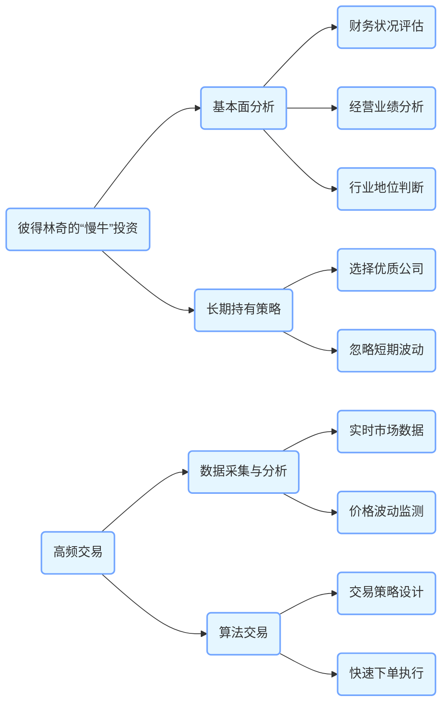

# 彼得林奇的“慢牛”投资在高频交易环境中的心理建设

> 关键词：彼得林奇、慢牛投资、高频交易、心理建设、投资策略

> 摘要：本文聚焦于彼得林奇的“慢牛”投资理念在高频交易环境下的心理建设问题。首先介绍了背景信息，包括目的、预期读者等内容。接着阐述核心概念，分析“慢牛”投资与高频交易的原理及联系。详细讲解核心算法原理并给出Python代码示例，同时运用数学模型和公式进行深入剖析。通过项目实战展示代码实现和解读。探讨实际应用场景，推荐相关工具和资源。最后总结未来发展趋势与挑战，解答常见问题并提供扩展阅读和参考资料，旨在帮助投资者在高频交易环境中运用“慢牛”投资理念时做好心理建设。

## 1. 背景介绍 
### 1.1 目的和范围
在当今金融市场中，高频交易以其快速的交易速度和大量的交易次数成为市场的一股重要力量。而彼得林奇所倡导的“慢牛”投资理念，强调对公司基本面的深入研究和长期持有。本文章的目的在于探讨在高频交易盛行的环境下，如何运用“慢牛”投资理念进行心理建设，帮助投资者在纷繁复杂的市场中保持冷静和理性。文章的范围涵盖了“慢牛”投资和高频交易的核心概念、相关算法原理、实际应用案例以及投资者所需的心理调整方法等方面。

### 1.2 预期读者
本文预期读者主要包括对金融投资有兴趣的个人投资者、金融从业者如股票分析师、基金经理等，以及相关专业的学生。对于那些希望在高频交易环境中运用“慢牛”投资理念的人群，本文将提供有价值的参考和指导。

### 1.3 文档结构概述
本文将按照以下结构进行阐述：首先介绍核心概念与联系，明确“慢牛”投资和高频交易的原理及两者之间的关系；接着讲解核心算法原理和具体操作步骤，通过Python代码进行详细说明；然后运用数学模型和公式对相关原理进行深入剖析并举例说明；再通过项目实战展示代码的实际应用和详细解读；之后探讨实际应用场景；推荐相关的工具和资源；最后总结未来发展趋势与挑战，解答常见问题并提供扩展阅读和参考资料。

### 1.4 术语表
#### 1.4.1 核心术语定义
- **彼得林奇的“慢牛”投资**：彼得林奇是美国著名的投资家，他的“慢牛”投资理念强调通过对公司基本面的深入研究，选择具有长期增长潜力的股票，并进行长期持有，以获取稳定的投资回报。
- **高频交易**：高频交易是指利用计算机算法和高速网络，在极短的时间内进行大量的交易，通过微小的价格波动获取利润。
- **心理建设**：在投资过程中，投资者通过调整自己的心态和思维方式，以应对市场的变化和不确定性，保持冷静和理性的决策能力。

#### 1.4.2 相关概念解释
- **公司基本面**：包括公司的财务状况、经营业绩、行业地位、管理团队等方面的信息，是评估公司价值和发展潜力的重要依据。
- **长期持有**：投资者在买入股票后，不被短期的市场波动所影响，持有股票较长时间，以分享公司的长期增长红利。
- **价格波动**：股票价格在市场交易过程中随时间的变化情况，是市场供求关系和投资者情绪等因素共同作用的结果。

#### 1.4.3 缩略词列表
- **HFT**：High - Frequency Trading，高频交易

## 2. 核心概念与联系 
### 核心概念原理
#### 彼得林奇的“慢牛”投资原理
彼得林奇认为，股票投资的核心是对公司的深入了解。他通过实地调研、分析公司财务报表等方式，寻找那些具有独特竞争优势、业绩持续增长的公司。一旦发现这样的公司，他会以合理的价格买入其股票，并长期持有。他相信，随着公司的不断发展壮大，其股票价格也会随之上涨，投资者可以获得丰厚的回报。这种投资方式注重公司的内在价值，而不是短期的市场波动。

#### 高频交易原理
高频交易利用计算机算法和高速网络，对市场数据进行实时分析和处理。交易系统能够在瞬间捕捉到微小的价格差异，并迅速下单进行交易。高频交易的盈利模式主要基于市场的流动性和价格的短期波动。通过大量的交易，即使每次交易的利润微薄，但累计起来也能获得可观的收益。高频交易通常依赖于先进的技术和高效的交易策略，对交易速度和数据处理能力要求极高。

### 架构的文本示意图
```plaintext
彼得林奇的“慢牛”投资
|-- 基本面分析
|   |-- 财务状况评估
|   |-- 经营业绩分析
|   |-- 行业地位判断
|-- 长期持有策略
|   |-- 选择优质公司
|   |-- 忽略短期波动

高频交易
|-- 数据采集与分析
|   |-- 实时市场数据
|   |-- 价格波动监测
|-- 算法交易
|   |-- 交易策略设计
|   |-- 快速下单执行
```

### Mermaid 流程图


## 3. 核心算法原理 & 具体操作步骤 
### 核心算法原理
在“慢牛”投资中，虽然不像高频交易那样依赖复杂的算法，但也可以运用一些简单的算法来辅助决策。例如，通过计算公司的市盈率（PE）、市净率（PB）等指标来评估公司的估值水平。

#### 市盈率（PE）算法
市盈率是指股票价格除以每股收益（EPS）的比率，公式为：
$$PE = \frac{P}{EPS}$$
其中，$P$ 表示股票价格，$EPS$ 表示每股收益。市盈率反映了投资者为获取公司每一元盈利所愿意支付的价格。一般来说，较低的市盈率可能表示股票被低估，具有投资价值；而较高的市盈率可能表示股票被高估，投资风险较大。

#### 市净率（PB）算法
市净率是指股票价格除以每股净资产（BVPS）的比率，公式为：
$$PB = \frac{P}{BVPS}$$
其中，$P$ 表示股票价格，$BVPS$ 表示每股净资产。市净率反映了股票价格与公司净资产的关系。较低的市净率可能表示股票被低估，具有一定的安全边际。

### 具体操作步骤
#### 步骤1：数据收集
收集公司的财务报表，包括利润表、资产负债表等，从中获取每股收益、每股净资产等数据。同时，获取当前的股票价格。

#### 步骤2：计算指标
根据上述公式计算市盈率和市净率。

#### 步骤3：分析评估
将计算得到的市盈率和市净率与同行业其他公司进行比较，评估该公司的估值水平。如果市盈率和市净率较低，且公司基本面良好，则可以考虑将该股票纳入投资组合。

### Python源代码示例
```python
# 定义计算市盈率和市净率的函数
def calculate_pe_pb(stock_price, eps, bvps):
    """
    计算市盈率和市净率
    :param stock_price: 股票价格
    :param eps: 每股收益
    :param bvps: 每股净资产
    :return: 市盈率和市净率
    """
    pe = stock_price / eps
    pb = stock_price / bvps
    return pe, pb

# 示例数据
stock_price = 50  # 股票价格
eps = 5  # 每股收益
bvps = 10  # 每股净资产

# 调用函数计算市盈率和市净率
pe, pb = calculate_pe_pb(stock_price, eps, bvps)

# 输出结果
print(f"市盈率 (PE): {pe}")
print(f"市净率 (PB): {pb}")
```
在上述代码中，我们定义了一个 `calculate_pe_pb` 函数，用于计算市盈率和市净率。然后，我们提供了示例数据，并调用该函数进行计算，最后输出计算结果。

## 4. 数学模型和公式 & 详细讲解 & 举例说明 
### 市盈率（PE）模型
#### 公式
$$PE = \frac{P}{EPS}$$
#### 详细讲解
市盈率是衡量股票估值的重要指标之一。它反映了市场对公司未来盈利的预期。如果市场对公司的未来发展前景看好，愿意为其支付较高的价格，那么市盈率就会较高；反之，如果市场对公司的前景不乐观，市盈率就会较低。

#### 举例说明
假设公司A的股票价格为 $P = 100$ 元，每股收益为 $EPS = 5$ 元，则该公司的市盈率为：
$$PE = \frac{100}{5} = 20$$
这意味着投资者为获取公司每一元盈利愿意支付20元的价格。如果同行业其他公司的平均市盈率为15，那么公司A的市盈率相对较高，可能表示该股票被高估。

### 市净率（PB）模型
#### 公式
$$PB = \frac{P}{BVPS}$$
#### 详细讲解
市净率反映了股票价格与公司净资产的关系。净资产是公司的总资产减去总负债后的余额，代表了公司的实际价值。较低的市净率可能表示股票价格低于公司的实际价值，具有一定的投资安全边际。

#### 举例说明
假设公司B的股票价格为 $P = 80$ 元，每股净资产为 $BVPS = 20$ 元，则该公司的市净率为：
$$PB = \frac{80}{20} = 4$$
如果同行业其他公司的平均市净率为3，那么公司B的市净率相对较高，可能需要进一步分析公司的财务状况和发展前景，判断其是否值得投资。

### 股票内在价值模型（基于股息折现模型）
#### 公式
$$V = \sum_{t = 1}^{n}\frac{D_t}{(1 + r)^t}+\frac{P_n}{(1 + r)^n}$$
其中，$V$ 表示股票的内在价值，$D_t$ 表示第 $t$ 期的股息，$r$ 表示折现率，$P_n$ 表示第 $n$ 期的股票价格。

#### 详细讲解
股息折现模型认为，股票的内在价值等于其未来各期股息的现值之和加上期末股票价格的现值。折现率 $r$ 反映了投资者对投资风险的要求，风险越高，折现率越大。

#### 举例说明
假设公司C预计未来三年每年的股息分别为 $D_1 = 2$ 元，$D_2 = 2.5$ 元，$D_3 = 3$ 元，三年后股票价格预计为 $P_3 = 120$ 元，投资者要求的折现率为 $r = 10\%$。则该股票的内在价值为：
$$V=\frac{2}{(1 + 0.1)^1}+\frac{2.5}{(1 + 0.1)^2}+\frac{3}{(1 + 0.1)^3}+\frac{120}{(1 + 0.1)^3}$$
$$V=\frac{2}{1.1}+\frac{2.5}{1.21}+\frac{3}{1.331}+\frac{120}{1.331}$$
$$V\approx1.818 + 2.066+2.254 + 90.158$$
$$V\approx96.296$$
如果当前股票价格低于96.296元，那么该股票可能被低估，具有投资价值。

## 5. 项目实战：代码实际案例和详细解释说明 
### 5.1  开发环境搭建
#### 操作系统
可以选择Windows、Linux或macOS等主流操作系统。

#### Python环境
建议安装Python 3.7及以上版本。可以从Python官方网站（https://www.python.org/downloads/）下载并安装。

#### 第三方库
需要安装一些常用的第三方库，如 `pandas` 用于数据处理，`numpy` 用于数值计算，`yfinance` 用于获取股票数据。可以使用以下命令进行安装：
```sh
pip install pandas numpy yfinance
```

### 5.2  源代码详细实现和代码解读
```python
import yfinance as yf
import pandas as pd
import numpy as np

# 定义获取股票数据的函数
def get_stock_data(ticker, start_date, end_date):
    """
    获取指定股票在指定日期范围内的数据
    :param ticker: 股票代码
    :param start_date: 开始日期
    :param end_date: 结束日期
    :return: 股票数据
    """
    data = yf.download(ticker, start=start_date, end=end_date)
    return data

# 定义计算市盈率和市净率的函数
def calculate_pe_pb(data, eps, bvps):
    """
    计算市盈率和市净率
    :param data: 股票数据
    :param eps: 每股收益
    :param bvps: 每股净资产
    :return: 包含市盈率和市净率的股票数据
    """
    data['PE'] = data['Close'] / eps
    data['PB'] = data['Close'] / bvps
    return data

# 主函数
def main():
    # 股票代码
    ticker = 'AAPL'
    # 开始日期
    start_date = '2020-01-01'
    # 结束日期
    end_date = '2021-01-01'
    # 每股收益
    eps = 3.28
    # 每股净资产
    bvps = 13.67

    # 获取股票数据
    stock_data = get_stock_data(ticker, start_date, end_date)

    # 计算市盈率和市净率
    stock_data = calculate_pe_pb(stock_data, eps, bvps)

    # 输出结果
    print(stock_data[['Close', 'PE', 'PB']])

if __name__ == "__main__":
    main()
```
### 5.3  代码解读与分析
#### 代码整体功能
该代码的主要功能是获取指定股票在指定日期范围内的数据，并计算该股票的市盈率和市净率。

#### 代码详细解读
1. **导入必要的库**：导入 `yfinance` 用于获取股票数据，`pandas` 用于数据处理，`numpy` 用于数值计算。
2. **定义 `get_stock_data` 函数**：该函数接受股票代码、开始日期和结束日期作为参数，使用 `yfinance.download` 方法获取指定股票在指定日期范围内的数据，并返回该数据。
3. **定义 `calculate_pe_pb` 函数**：该函数接受股票数据、每股收益和每股净资产作为参数，根据市盈率和市净率的计算公式，在股票数据中添加 `PE` 和 `PB` 两列，并返回更新后的数据。
4. **定义 `main` 函数**：在 `main` 函数中，首先设置股票代码、开始日期、结束日期、每股收益和每股净资产等参数。然后调用 `get_stock_data` 函数获取股票数据，再调用 `calculate_pe_pb` 函数计算市盈率和市净率。最后输出包含收盘价、市盈率和市净率的股票数据。
5. **主程序执行**：通过 `if __name__ == "__main__":` 语句确保代码作为脚本运行时，`main` 函数会被执行。

## 6. 实际应用场景 
### 个人投资者
对于个人投资者来说，在高频交易环境中运用彼得林奇的“慢牛”投资理念进行心理建设具有重要意义。个人投资者往往缺乏专业的交易技术和快速的信息处理能力，难以在高频交易中获利。而“慢牛”投资强调对公司基本面的研究和长期持有，个人投资者可以通过深入了解公司的业务模式、财务状况等，选择具有长期增长潜力的股票。在面对高频交易带来的市场短期波动时，投资者可以保持冷静，不被市场情绪所左右，坚持自己的投资策略。例如，个人投资者可以通过分析公司的年报、行业报告等资料，选择一家业绩稳定增长、具有竞争优势的公司股票，长期持有，分享公司的成长红利。

### 基金经理
基金经理在管理基金资产时，也可以借鉴“慢牛”投资理念。虽然基金可能会进行一定的短期交易，但长期来看，选择优质的股票并长期持有是实现基金资产增值的重要方式。在高频交易环境下，市场的短期波动可能会影响基金的净值表现，基金经理需要做好心理建设，坚持自己的投资判断。例如，基金经理可以通过建立严格的选股标准，筛选出具有良好基本面的股票，并将其纳入基金的投资组合。在市场出现短期波动时，不轻易卖出股票，而是通过深入分析公司的基本面变化，决定是否调整投资组合。

### 金融机构
金融机构如证券公司、银行等，在为客户提供投资建议和服务时，可以结合“慢牛”投资理念和高频交易环境的特点。一方面，向客户普及“慢牛”投资的理念，帮助客户树立正确的投资观念，避免盲目跟风参与高频交易。另一方面，利用自身的专业优势和技术资源，为客户提供更加全面的投资分析和建议。例如，证券公司可以为客户提供公司基本面分析报告，帮助客户了解股票的投资价值；银行可以推出基于“慢牛”投资理念的理财产品，为客户提供长期稳定的投资回报。

## 7. 工具和资源推荐
### 7.1 学习资源推荐
#### 7.1.1 书籍推荐
- 《彼得林奇的成功投资》：彼得林奇的经典著作，详细介绍了他的投资理念和方法，对于学习“慢牛”投资具有重要的参考价值。
- 《聪明的投资者》：本杰明·格雷厄姆的著作，被誉为投资界的圣经，强调了价值投资的重要性，与“慢牛”投资理念有相通之处。
- 《金融炼金术》：乔治·索罗斯的著作，书中探讨了金融市场的运行规律和投资者的心理因素，对于理解市场波动和心理建设有很大帮助。

#### 7.1.2 在线课程
- Coursera上的“投资学原理”课程：由知名大学教授授课，系统地介绍了投资学的基本原理和方法。
- edX上的“金融市场”课程：涵盖了金融市场的各个方面，包括股票市场、债券市场等，对于了解金融市场的运行机制有很大帮助。
- 中国大学MOOC上的“证券投资学”课程：国内高校教授授课，结合中国金融市场的实际情况，讲解证券投资的相关知识。

#### 7.1.3 技术博客和网站
- 雪球网：国内知名的投资社区，投资者可以在上面交流投资经验、分享研究报告，了解市场动态。
- 东方财富网：提供丰富的金融信息和数据，包括股票行情、公司公告、财经新闻等，是投资者获取信息的重要渠道。
- Seeking Alpha：国外知名的金融博客网站，汇聚了众多专业投资者和分析师的观点和研究报告，对于了解国际金融市场有很大帮助。

### 7.2 开发工具框架推荐
#### 7.2.1 IDE和编辑器
- PyCharm：一款功能强大的Python集成开发环境，提供代码编辑、调试、版本控制等功能，适合开发Python投资分析程序。
- Jupyter Notebook：交互式的开发环境，支持Python代码的编写和运行，并且可以实时展示代码的运行结果，方便进行数据分析和可视化。
- Visual Studio Code：轻量级的代码编辑器，支持多种编程语言，具有丰富的插件扩展功能，可用于开发投资分析脚本。

#### 7.2.2 调试和性能分析工具
- Py-Spy：用于分析Python程序的性能，找出程序中的性能瓶颈，帮助优化代码。
- cProfile：Python内置的性能分析工具，可以统计程序中各个函数的执行时间和调用次数，帮助开发者优化代码性能。
- PDB：Python内置的调试器，可用于调试Python程序，定位和解决代码中的问题。

#### 7.2.3 相关框架和库
- Pandas：用于数据处理和分析的Python库，提供了丰富的数据结构和函数，方便进行数据清洗、转换和分析。
- Numpy：用于数值计算的Python库，提供了高效的多维数组对象和数学函数，可用于实现投资分析中的各种算法。
- Matplotlib：用于数据可视化的Python库，可用于绘制各种图表，如折线图、柱状图、散点图等，帮助投资者直观地理解数据。

### 7.3 相关论文著作推荐
#### 7.3.1 经典论文
- Fama, E. F., & French, K. R. (1992). The cross - section of expected stock returns. The Journal of Finance, 47(2), 427 - 465. 该论文提出了著名的Fama - French三因子模型，对于理解股票收益率的影响因素具有重要意义。
- Sharpe, W. F. (1964). Capital asset prices: A theory of market equilibrium under conditions of risk. The Journal of Finance, 19(3), 425 - 442. 该论文提出了资本资产定价模型（CAPM），是现代金融理论的重要基石之一。

#### 7.3.2 最新研究成果
- 关注顶级金融学术期刊，如《Journal of Financial Economics》、《Review of Financial Studies》等，这些期刊会发表关于投资策略、市场效率等方面的最新研究成果。
- 参加金融学术会议，如美国金融协会（AFA）年会、西部金融协会（WFA）年会等，与国内外的金融学者和从业者交流最新的研究动态。

#### 7.3.3 应用案例分析
- 可以参考一些金融机构的研究报告，如证券公司的投资策略报告、基金公司的年度报告等，了解他们在实际投资中运用各种投资策略的案例和经验。
- 分析一些成功投资者的投资案例，如巴菲特、彼得林奇等，学习他们的投资思路和决策方法。

## 8. 总结：未来发展趋势与挑战
### 未来发展趋势
#### 技术融合趋势
随着科技的不断发展，高频交易技术和“慢牛”投资理念可能会出现更多的融合。例如，利用人工智能和机器学习技术对公司基本面进行更深入的分析，同时结合高频交易的技术手段，实现更加精准的投资决策。高频交易系统可以利用大数据分析挖掘潜在的投资机会，而“慢牛”投资可以为这些机会提供长期的价值支撑。

#### 投资者教育加强
未来，投资者教育将越来越受到重视。随着金融市场的不断发展和复杂化，投资者需要具备更多的知识和技能来应对市场的变化。金融机构和监管部门将加大对投资者教育的投入，帮助投资者树立正确的投资观念，提高投资者的风险意识和心理承受能力。

#### 国际化投资趋势
随着全球经济一体化的发展，投资者将越来越倾向于进行国际化投资。“慢牛”投资理念在不同国家和地区都有一定的适用性，投资者可以通过全球资产配置，分散投资风险，获取更稳定的投资回报。同时，高频交易也将在全球范围内更加活跃，不同市场之间的联动性将进一步增强。

### 挑战
#### 市场不确定性增加
高频交易的快速发展使得市场的波动性和不确定性增加。市场价格可能在瞬间发生大幅波动，这对于采用“慢牛”投资理念的投资者来说是一个巨大的挑战。投资者需要在市场的短期波动中保持冷静，坚持自己的投资策略，不被市场情绪所左右。

#### 技术更新换代快
高频交易依赖于先进的技术和算法，技术更新换代非常快。投资者和金融机构需要不断投入资源进行技术研发和创新，以跟上市场的发展步伐。同时，技术的发展也带来了新的风险，如网络安全风险、算法漏洞等，需要加强风险管理。

#### 监管难度加大
高频交易的复杂性和快速性给监管带来了很大的难度。监管部门需要不断完善监管制度和手段，加强对高频交易的监管，防止市场操纵和不公平交易行为的发生。同时，对于“慢牛”投资理念的推广和应用，也需要监管部门进行引导和规范，保护投资者的合法权益。

## 9. 附录：常见问题与解答
### 问题1：在高频交易环境下，“慢牛”投资还能有效吗？
解答：在高频交易环境下，“慢牛”投资仍然有效。高频交易主要关注市场的短期波动和微小的价格差异，而“慢牛”投资则注重公司的基本面和长期发展潜力。虽然高频交易可能会导致市场短期波动加剧，但从长期来看，公司的价值最终会反映在股票价格上。采用“慢牛”投资理念的投资者可以通过深入研究公司的基本面，选择具有长期增长潜力的股票，并长期持有，从而获得稳定的投资回报。

### 问题2：如何在高频交易环境中保持良好的投资心态？
解答：在高频交易环境中保持良好的投资心态需要做到以下几点：
1. **深入了解投资理念**：充分理解“慢牛”投资的原理和方法，相信长期投资的价值，不被市场的短期波动所影响。
2. **制定合理的投资计划**：根据自己的风险承受能力和投资目标，制定合理的投资计划，并严格按照计划执行。
3. **控制情绪**：避免贪婪和恐惧等情绪的影响，在市场上涨时不盲目追高，在市场下跌时不恐慌抛售。
4. **持续学习**：不断学习金融知识和投资技巧，提高自己的投资能力和分析水平，增强对市场的信心。

### 问题3：高频交易和“慢牛”投资可以结合吗？
解答：高频交易和“慢牛”投资可以结合。例如，投资者可以将一部分资金用于“慢牛”投资，选择优质的股票长期持有；另一部分资金用于高频交易，利用市场的短期波动获取利润。在结合过程中，需要注意控制风险，合理分配资金。同时，要确保高频交易的策略不会影响“慢牛”投资的长期规划。

## 10. 扩展阅读 & 参考资料
### 扩展阅读
- 《巴菲特致股东的信：股份公司教程》：深入了解巴菲特的投资理念和方法，对于理解“慢牛”投资有很大帮助。
- 《交易心理分析》：探讨投资者的心理因素对交易决策的影响，有助于投资者在高频交易环境中做好心理建设。
- 《量化投资：策略与技术》：介绍量化投资的方法和策略，对于了解高频交易和投资分析的技术手段有一定的参考价值。

### 参考资料
- 彼得林奇. 《彼得林奇的成功投资》. 机械工业出版社.
- 本杰明·格雷厄姆. 《聪明的投资者》. 人民邮电出版社.
- 乔治·索罗斯. 《金融炼金术》. 海南出版社.
- Fama, E. F., & French, K. R. (1992). The cross - section of expected stock returns. The Journal of Finance, 47(2), 427 - 465.
- Sharpe, W. F. (1964). Capital asset prices: A theory of market equilibrium under conditions of risk. The Journal of Finance, 19(3), 425 - 442.

作者：AI天才研究院/AI Genius Institute & 禅与计算机程序设计艺术 /Zen And The Art of Computer Programming