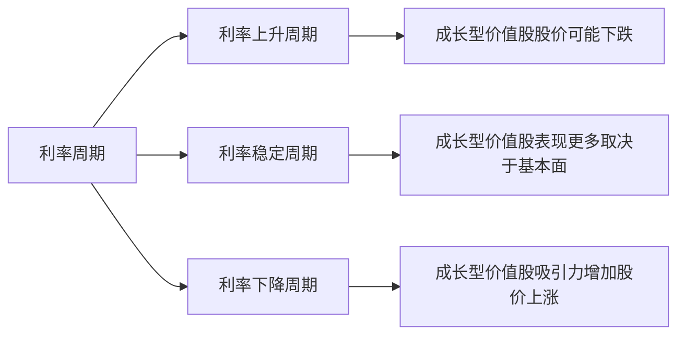

# 彼得林奇的"成长型价值股"在不同利率周期中的表现分析

> 关键词：彼得林奇、成长型价值股、利率周期、股票表现、投资分析

> 摘要：本文聚焦于彼得林奇所倡导的成长型价值股在不同利率周期中的表现。首先介绍了研究的背景、目的、预期读者等信息，详细阐述了成长型价值股和利率周期的核心概念及其联系。接着深入分析了相关核心算法原理，运用Python代码展示具体操作步骤，并给出了数学模型和公式进行详细讲解与举例说明。通过项目实战，搭建开发环境，实现并解读相关代码。探讨了成长型价值股在不同利率周期下的实际应用场景，推荐了学习、开发等方面的工具和资源。最后总结了成长型价值股的未来发展趋势与挑战，解答常见问题，并提供扩展阅读和参考资料，旨在为投资者深入理解成长型价值股在不同利率环境下的表现提供全面且专业的参考。

## 1. 背景介绍 
### 1.1 目的和范围
本研究旨在深入分析彼得林奇提出的成长型价值股在不同利率周期中的表现。通过对相关理论和实际数据的研究，揭示成长型价值股在利率上升、下降以及稳定等不同阶段的股价波动、收益情况等特征。研究范围涵盖了历史上多个不同的利率周期，选取具有代表性的成长型价值股样本进行分析，以确保研究结果具有普遍性和可靠性。

### 1.2 预期读者
本文的预期读者主要包括专业的投资者、金融分析师、股票研究人员以及对价值投资和利率周期影响感兴趣的个人。对于希望深入了解成长型价值股投资策略以及利率变化对股票市场影响的读者来说，本文将提供有价值的参考和分析。

### 1.3 文档结构概述
本文首先介绍成长型价值股和利率周期的核心概念，阐述它们之间的联系，并通过文本示意图和Mermaid流程图进行直观展示。接着详细讲解核心算法原理，使用Python代码说明具体操作步骤，同时给出相关的数学模型和公式并举例说明。然后通过项目实战，从开发环境搭建到源代码实现和解读，深入分析成长型价值股在不同利率周期中的表现。之后探讨其实际应用场景，推荐相关的学习、开发工具和资源。最后总结未来发展趋势与挑战，解答常见问题，并提供扩展阅读和参考资料。

### 1.4 术语表
#### 1.4.1 核心术语定义
- **成长型价值股**：彼得林奇所定义的成长型价值股是指那些既具有成长股特征（如较高的盈利增长率、广阔的市场前景等），又具备价值股属性（如相对较低的市盈率、市净率等）的股票。这类股票通常处于快速发展阶段，但市场对其价值的认知尚未完全体现，具有较大的投资潜力。
- **利率周期**：利率周期是指利率水平在一段时间内呈现出周期性的变化，包括利率上升周期、利率下降周期和利率稳定周期。利率的变化受到宏观经济政策、通货膨胀率、货币政策等多种因素的影响。

#### 1.4.2 相关概念解释
- **市盈率（P/E）**：市盈率是指股票价格除以每股收益（EPS）的比率，它反映了市场对公司盈利的预期和估值水平。较低的市盈率通常表示股票相对被低估。
- **市净率（P/B）**：市净率是指股票价格除以每股净资产的比率，它衡量了股票价格相对于公司净资产的倍数。较低的市净率可能意味着股票具有较高的投资价值。

#### 1.4.3 缩略词列表
- **EPS**：Earnings Per Share，每股收益
- **P/E**：Price-to-Earnings Ratio，市盈率
- **P/B**：Price-to-Book Ratio，市净率

## 2. 核心概念与联系 

### 成长型价值股的原理
成长型价值股的核心在于其成长与价值的双重属性。从成长角度来看，这类公司通常处于新兴行业或具有创新业务模式，能够实现较高的盈利增长。例如，一家科技公司通过不断推出新产品或拓展新市场，其销售额和利润持续上升。从价值角度来看，由于市场可能存在短期的认知偏差，这些公司的股票价格相对其内在价值被低估，表现为较低的市盈率和市净率。

### 利率周期的原理
利率周期主要受宏观经济环境和货币政策的影响。在经济繁荣时期，为了抑制通货膨胀，央行可能会提高利率，进入利率上升周期；而在经济衰退时期，为了刺激经济增长，央行通常会降低利率，形成利率下降周期。利率稳定周期则出现在经济相对平稳，通货膨胀率和经济增长率都较为稳定的时期。

### 两者的联系
利率的变化会对成长型价值股的表现产生重要影响。在利率上升周期，资金成本增加，投资者对股票的要求回报率也会提高。成长型价值股由于其未来现金流的不确定性相对较高，可能会受到较大的冲击，股价可能会出现下跌。在利率下降周期，资金成本降低，投资者更愿意承担风险追求较高的回报，成长型价值股的吸引力会增加，股价可能会上涨。在利率稳定周期，市场环境相对平稳，成长型价值股的表现更多地取决于公司自身的基本面和成长潜力。

### 文本示意图
```plaintext
              利率周期
            /    |    \
         上升  稳定  下降
         /        |        \
成长型价值股表现受影响  更多取决于基本面  吸引力增加股价上涨
  股价可能下跌
```

### Mermaid流程图


## 3. 核心算法原理 & 具体操作步骤 

### 核心算法原理
为了分析成长型价值股在不同利率周期中的表现，我们可以采用以下步骤：
1. 数据收集：收集成长型价值股的历史股价数据、财务数据以及对应的利率数据。
2. 利率周期划分：根据利率数据，将时间序列划分为不同的利率周期。
3. 计算股票收益率：在每个利率周期内，计算成长型价值股的收益率。
4. 统计分析：对不同利率周期内的股票收益率进行统计分析，比较其差异。

### 具体操作步骤（Python代码实现）
```python
import pandas as pd
import numpy as np
import matplotlib.pyplot as plt

# 步骤1：数据收集
# 假设我们已经有了成长型价值股的股价数据和利率数据
# 读取股价数据
stock_prices = pd.read_csv('stock_prices.csv', index_col='Date', parse_dates=True)
# 读取利率数据
interest_rates = pd.read_csv('interest_rates.csv', index_col='Date', parse_dates=True)

# 步骤2：利率周期划分
# 定义一个函数来划分利率周期
def divide_interest_cycles(interest_rates):
    cycles = []
    current_cycle = []
    prev_rate = interest_rates.iloc[0]['Rate']
    for i in range(1, len(interest_rates)):
        current_rate = interest_rates.iloc[i]['Rate']
        if (current_rate > prev_rate and len(current_cycle) > 0 and current_cycle[-1] == '下降') or \
           (current_rate < prev_rate and len(current_cycle) > 0 and current_cycle[-1] == '上升'):
            cycles.append(current_cycle)
            current_cycle = []
        if current_rate > prev_rate:
            current_cycle.append('上升')
        elif current_rate < prev_rate:
            current_cycle.append('下降')
        else:
            current_cycle.append('稳定')
        prev_rate = current_rate
    cycles.append(current_cycle)
    return cycles

cycles = divide_interest_cycles(interest_rates)

# 步骤3：计算股票收益率
# 计算每日收益率
stock_returns = stock_prices.pct_change()

# 步骤4：统计分析
# 按利率周期计算平均收益率
cycle_returns = []
start_index = 0
for cycle in cycles:
    end_index = start_index + len(cycle)
    cycle_stock_returns = stock_returns.iloc[start_index:end_index]
    average_return = cycle_stock_returns.mean()
    cycle_returns.append(average_return)
    start_index = end_index

# 绘制不同利率周期下的平均收益率柱状图
cycle_labels = ['上升', '稳定', '下降']
plt.bar(cycle_labels, cycle_returns)
plt.xlabel('利率周期')
plt.ylabel('平均收益率')
plt.title('成长型价值股在不同利率周期下的平均收益率')
plt.show()
```

## 4. 数学模型和公式 & 详细讲解 & 举例说明 

### 股票收益率计算
股票的简单收益率计算公式为：
$$R_t = \frac{P_t - P_{t-1}}{P_{t-1}}$$
其中，$R_t$ 表示第 $t$ 期的股票收益率，$P_t$ 表示第 $t$ 期的股票价格，$P_{t-1}$ 表示第 $t-1$ 期的股票价格。

### 平均收益率计算
在一个利率周期内，股票的平均收益率计算公式为：
$$\bar{R} = \frac{1}{n} \sum_{t=1}^{n} R_t$$
其中，$\bar{R}$ 表示平均收益率，$n$ 表示利率周期内的期数，$R_t$ 表示第 $t$ 期的股票收益率。

### 举例说明
假设某成长型价值股在一个利率周期内的股价数据如下：
| 日期 | 股价 |
| ---- | ---- |
| 第1天 | 100 |
| 第2天 | 102 |
| 第3天 | 105 |
| 第4天 | 103 |
| 第5天 | 106 |

根据股票收益率计算公式，计算每日收益率：
- 第2天收益率：$R_2 = \frac{102 - 100}{100} = 0.02$
- 第3天收益率：$R_3 = \frac{105 - 102}{102} \approx 0.0294$
- 第4天收益率：$R_4 = \frac{103 - 105}{105} \approx -0.019$
- 第5天收益率：$R_5 = \frac{106 - 103}{103} \approx 0.0291$

该利率周期内的平均收益率为：
$$\bar{R} = \frac{0.02 + 0.0294 - 0.019 + 0.0291}{4} \approx 0.0194$$

## 5. 项目实战：代码实际案例和详细解释说明 

### 5.1  开发环境搭建
#### 安装Python
首先，确保你已经安装了Python。可以从Python官方网站（https://www.python.org/downloads/）下载适合你操作系统的Python版本进行安装。

#### 安装必要的库
在命令行中使用以下命令安装所需的库：
```sh
pip install pandas numpy matplotlib
```

### 5.2  源代码详细实现和代码解读
```python
import pandas as pd
import numpy as np
import matplotlib.pyplot as plt

# 步骤1：数据收集
# 假设我们已经有了成长型价值股的股价数据和利率数据
# 读取股价数据
stock_prices = pd.read_csv('stock_prices.csv', index_col='Date', parse_dates=True)
# 读取利率数据
interest_rates = pd.read_csv('interest_rates.csv', index_col='Date', parse_dates=True)
```
这段代码导入了所需的库，并使用 `pandas` 库的 `read_csv` 函数读取成长型价值股的股价数据和利率数据。`index_col='Date'` 表示将日期列作为索引，`parse_dates=True` 表示将日期列解析为日期类型。

```python
# 步骤2：利率周期划分
# 定义一个函数来划分利率周期
def divide_interest_cycles(interest_rates):
    cycles = []
    current_cycle = []
    prev_rate = interest_rates.iloc[0]['Rate']
    for i in range(1, len(interest_rates)):
        current_rate = interest_rates.iloc[i]['Rate']
        if (current_rate > prev_rate and len(current_cycle) > 0 and current_cycle[-1] == '下降') or \
           (current_rate < prev_rate and len(current_cycle) > 0 and current_cycle[-1] == '上升'):
            cycles.append(current_cycle)
            current_cycle = []
        if current_rate > prev_rate:
            current_cycle.append('上升')
        elif current_rate < prev_rate:
            current_cycle.append('下降')
        else:
            current_cycle.append('稳定')
        prev_rate = current_rate
    cycles.append(current_cycle)
    return cycles

cycles = divide_interest_cycles(interest_rates)
```
这段代码定义了一个函数 `divide_interest_cycles` 来划分利率周期。通过比较相邻日期的利率，判断利率是上升、下降还是稳定，并将其添加到当前周期列表中。当利率变化趋势发生改变时，将当前周期列表添加到总周期列表中，并清空当前周期列表。

```python
# 步骤3：计算股票收益率
# 计算每日收益率
stock_returns = stock_prices.pct_change()
```
这段代码使用 `pandas` 库的 `pct_change` 函数计算成长型价值股的每日收益率。

```python
# 步骤4：统计分析
# 按利率周期计算平均收益率
cycle_returns = []
start_index = 0
for cycle in cycles:
    end_index = start_index + len(cycle)
    cycle_stock_returns = stock_returns.iloc[start_index:end_index]
    average_return = cycle_stock_returns.mean()
    cycle_returns.append(average_return)
    start_index = end_index

# 绘制不同利率周期下的平均收益率柱状图
cycle_labels = ['上升', '稳定', '下降']
plt.bar(cycle_labels, cycle_returns)
plt.xlabel('利率周期')
plt.ylabel('平均收益率')
plt.title('成长型价值股在不同利率周期下的平均收益率')
plt.show()
```
这段代码按利率周期计算成长型价值股的平均收益率，并使用 `matplotlib` 库绘制不同利率周期下的平均收益率柱状图，以便直观地比较不同利率周期下的股票表现。

### 5.3  代码解读与分析
通过上述代码，我们可以清晰地看到成长型价值股在不同利率周期中的表现。在利率上升周期，由于资金成本增加，成长型价值股的平均收益率可能较低；在利率下降周期，资金成本降低，股票的平均收益率可能较高；在利率稳定周期，股票的表现更多地取决于公司自身的基本面。通过对不同利率周期下平均收益率的比较，投资者可以更好地制定投资策略。

## 6. 实际应用场景 
### 投资决策
投资者可以根据利率周期的变化，调整对成长型价值股的投资比例。在利率下降周期，可以适当增加成长型价值股的投资，因为此时这类股票的吸引力增加，股价可能会上涨。在利率上升周期，可以适当减少投资，以降低风险。

### 资产配置
金融机构在进行资产配置时，可以考虑成长型价值股在不同利率周期中的表现。在利率稳定周期，可以将一定比例的资产配置到成长型价值股中，以获取较高的收益。同时，结合其他资产类别，如债券、现金等，实现资产的多元化配置，降低投资组合的风险。

### 风险管理
对于持有成长型价值股的投资者来说，了解利率周期对股票表现的影响，可以帮助他们更好地进行风险管理。在利率上升周期，投资者可以采取套期保值等措施，降低股票价格下跌带来的损失。

## 7. 工具和资源推荐
### 7.1 学习资源推荐
#### 7.1.1 书籍推荐
- 《彼得林奇的成功投资》：彼得林奇的经典著作，详细介绍了他的投资理念和方法，对于理解成长型价值股具有重要的指导意义。
- 《聪明的投资者》：本杰明·格雷厄姆的代表作，阐述了价值投资的基本原理和方法，是投资者必读的经典书籍。
- 《金融市场与金融机构》：全面介绍了金融市场和金融机构的基本知识，有助于投资者了解利率的形成机制和影响因素。

#### 7.1.2 在线课程
- Coursera上的“投资学原理”：由知名大学教授授课，系统地介绍了投资学的基本原理和方法。
- edX上的“金融市场分析”：提供了深入分析金融市场的理论和实践方法。

#### 7.1.3 技术博客和网站
- 雪球网：国内知名的投资社区，提供了丰富的股票分析和投资经验分享。
- Seeking Alpha：国外知名的金融投资网站，有大量的股票分析文章和研究报告。

### 7.2 开发工具框架推荐
#### 7.2.1 IDE和编辑器
- PyCharm：功能强大的Python集成开发环境，提供了代码编辑、调试、版本控制等一系列功能。
- Jupyter Notebook：交互式的开发环境，适合进行数据分析和可视化，方便代码的编写和展示。

#### 7.2.2 调试和性能分析工具
- pdb：Python自带的调试工具，可以帮助开发者定位和解决代码中的问题。
- cProfile：Python的性能分析工具，可以分析代码的运行时间和性能瓶颈。

#### 7.2.3 相关框架和库
- pandas：强大的数据处理和分析库，提供了丰富的数据结构和函数，方便进行数据清洗、转换和分析。
- numpy：Python的数值计算库，提供了高效的数组和矩阵运算功能。
- matplotlib：Python的绘图库，可以绘制各种类型的图表，用于数据可视化。

### 7.3 相关论文著作推荐
#### 7.3.1 经典论文
- “The Cross - Section of Expected Stock Returns”：Fama和French的经典论文，提出了三因子模型，对股票收益率的影响因素进行了深入分析。
- “Common Risk Factors in the Returns on Stocks and Bonds”：进一步扩展了三因子模型，考虑了债券市场的风险因素。

#### 7.3.2 最新研究成果
- 关注顶级金融学术期刊，如《Journal of Finance》《Review of Financial Studies》等，这些期刊会发表关于股票市场和利率周期的最新研究成果。

#### 7.3.3 应用案例分析
- 一些金融研究机构会发布关于成长型价值股在不同利率周期中表现的案例分析报告，可以通过这些报告了解实际应用中的投资策略和效果。

## 8. 总结：未来发展趋势与挑战
### 未来发展趋势
随着宏观经济环境的不断变化和金融市场的不断发展，成长型价值股在不同利率周期中的表现也会呈现出一些新的趋势。
- **科技驱动的成长型价值股将更受关注**：随着科技的快速发展，一些新兴科技行业的成长型价值股可能会在不同利率周期中表现出更强的韧性和增长潜力。例如，人工智能、新能源等领域的公司，其发展前景广阔，即使在利率上升周期，也可能凭借自身的技术优势和创新能力实现较好的业绩增长。
- **利率周期的不确定性增加**：全球经济的复杂性和不确定性使得利率周期的变化更加难以预测。未来，利率可能会受到更多因素的影响，如地缘政治、气候变化等，这将增加分析成长型价值股在不同利率周期中表现的难度。
- **投资者对成长型价值股的认知不断深化**：随着投资者教育的普及和投资经验的积累，投资者对成长型价值股的认知将更加深入。他们将更加注重公司的基本面分析和长期投资价值，而不仅仅关注短期的股价波动。

### 挑战
- **数据获取和分析的难度**：要准确分析成长型价值股在不同利率周期中的表现，需要大量的历史数据和实时数据。然而，数据的获取和清洗可能会面临一定的困难，同时，对海量数据的分析也需要具备专业的技能和工具。
- **市场情绪的影响**：股票市场容易受到市场情绪的影响，即使在相同的利率周期下，市场情绪的波动也可能导致成长型价值股的表现出现较大差异。投资者很难准确预测市场情绪的变化，这增加了投资决策的难度。
- **政策变化的不确定性**：宏观经济政策的变化对利率和股票市场都有着重要的影响。政府可能会出台一些新的政策来调节经济，这些政策的不确定性可能会打乱原有的利率周期和股票市场的运行规律，给投资者带来挑战。

## 9. 附录：常见问题与解答
### 问题1：如何确定一只股票是否为成长型价值股？
解答：可以从多个方面来判断。首先，分析公司的盈利增长率，如果公司的盈利在过去几年中保持较高的增长速度，且未来具有继续增长的潜力，那么它可能具有成长股的特征。其次，查看公司的市盈率和市净率，如果这些指标相对较低，说明股票可能被低估，具备价值股的属性。此外，还可以研究公司的行业前景、竞争优势、管理团队等因素。

### 问题2：利率周期的划分是否有统一的标准？
解答：目前并没有统一的标准来划分利率周期。常见的方法是根据利率的变化趋势，将其划分为上升、下降和稳定周期。在实际操作中，可以通过观察利率的历史数据，结合宏观经济环境和货币政策的变化来进行划分。不同的划分方法可能会导致不同的分析结果，因此需要根据具体情况选择合适的划分方法。

### 问题3：成长型价值股在利率上升周期一定表现不佳吗？
解答：不一定。虽然利率上升会增加资金成本，对成长型价值股产生一定的压力，但如果公司自身具有强大的竞争力和良好的基本面，能够在高利率环境下保持业绩增长，那么其股价也可能不受影响甚至上涨。此外，市场对公司的预期和估值也会影响股票的表现，即使在利率上升周期，一些具有独特优势的成长型价值股仍然可能受到投资者的青睐。

### 问题4：如何利用本文的分析结果进行投资？
解答：投资者可以根据不同利率周期下成长型价值股的表现，调整自己的投资组合。在利率下降周期，可以适当增加成长型价值股的投资比例；在利率上升周期，可以减少投资或者采取套期保值等措施降低风险。同时，还需要结合自己的风险承受能力、投资目标和投资期限等因素进行综合考虑，制定合理的投资策略。

## 10. 扩展阅读 & 参考资料
### 扩展阅读
- 《战胜华尔街》：彼得林奇的另一本经典著作，分享了他在投资实践中的经验和故事。
- 《金融炼金术》：乔治·索罗斯的代表作，探讨了金融市场的反身性原理和投资策略。

### 参考资料
- 相关金融数据库，如Wind、Bloomberg等，提供了丰富的股票数据和利率数据。
- 金融学术期刊，如《Journal of Financial Economics》《Journal of Financial and Quantitative Analysis》等，发表了大量关于股票市场和利率周期的研究论文。

作者：AI天才研究院/AI Genius Institute & 禅与计算机程序设计艺术 /Zen And The Art of Computer Programming