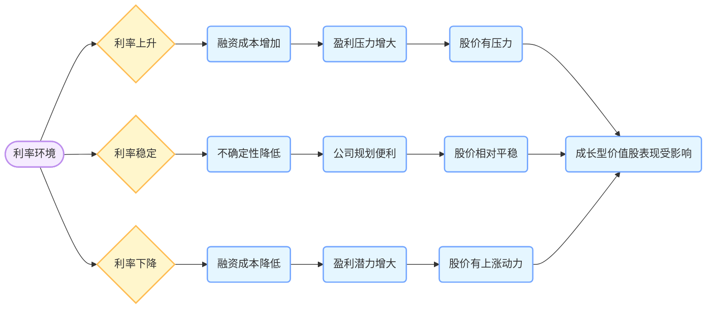

# 彼得林奇的"成长型价值股"在不同利率环境下的表现

> 关键词：彼得林奇、成长型价值股、利率环境、股票表现、投资策略

> 摘要：本文聚焦于彼得林奇所倡导的成长型价值股在不同利率环境下的表现。首先介绍了相关的背景知识，包括目的、预期读者、文档结构等内容。接着阐述了成长型价值股的核心概念与联系，详细讲解了其原理和架构，并通过Mermaid流程图进行展示。然后深入分析核心算法原理，结合Python源代码进行说明，同时给出相关的数学模型和公式并举例。通过项目实战，展示代码实际案例并详细解释。探讨了成长型价值股的实际应用场景，推荐了相关的工具和资源。最后总结未来发展趋势与挑战，解答常见问题，并提供扩展阅读和参考资料，旨在为投资者全面理解成长型价值股在不同利率环境下的表现提供有价值的参考。

## 1. 背景介绍 
### 1.1 目的和范围
本文的目的在于深入研究彼得林奇的成长型价值股在不同利率环境下的表现。利率作为宏观经济的重要指标，对股票市场有着广泛而深刻的影响。成长型价值股是彼得林奇投资理念中的重要组成部分，其兼具成长股的高增长潜力和价值股的相对低估特性。研究成长型价值股在不同利率环境下的表现，有助于投资者更好地把握投资机会，优化投资组合，提高投资收益。

本文的研究范围涵盖了不同利率环境，包括利率上升、利率下降和利率稳定三种主要情况。通过对历史数据的分析和理论探讨，分析成长型价值股在这些不同环境下的股价走势、财务指标变化以及市场表现等方面的特点。

### 1.2 预期读者
本文预期读者主要包括以下几类人群：
1. **投资者**：无论是个人投资者还是机构投资者，都希望通过了解成长型价值股在不同利率环境下的表现，制定更合理的投资策略，提高投资回报。
2. **金融从业者**：如证券分析师、基金经理等，他们需要深入研究股票市场的各种因素，为客户提供专业的投资建议和决策支持。
3. **学术研究人员**：对金融市场、投资理论等领域感兴趣的学者，希望通过本文的研究丰富相关理论知识，开展进一步的学术研究。
4. **财经爱好者**：对股票投资和宏观经济有一定兴趣，希望通过学习相关知识，增加对金融市场的了解和认识。

### 1.3 文档结构概述
本文将按照以下结构进行阐述：
1. **背景介绍**：介绍本文的目的、预期读者、文档结构概述和相关术语表。
2. **核心概念与联系**：阐述成长型价值股的核心概念、原理和架构，并通过Mermaid流程图展示其与利率环境的联系。
3. **核心算法原理 & 具体操作步骤**：讲解分析成长型价值股在不同利率环境下表现的核心算法原理，并使用Python源代码详细阐述具体操作步骤。
4. **数学模型和公式 & 详细讲解 & 举例说明**：给出相关的数学模型和公式，详细讲解其含义，并通过实际例子进行说明。
5. **项目实战：代码实际案例和详细解释说明**：介绍开发环境搭建，展示源代码的详细实现和代码解读，对代码进行分析。
6. **实际应用场景**：探讨成长型价值股在不同利率环境下的实际应用场景，为投资者提供参考。
7. **工具和资源推荐**：推荐相关的学习资源、开发工具框架和论文著作，帮助读者进一步深入学习和研究。
8. **总结：未来发展趋势与挑战**：总结成长型价值股在不同利率环境下的表现特点，分析未来发展趋势和面临的挑战。
9. **附录：常见问题与解答**：解答读者在阅读和理解本文过程中可能遇到的常见问题。
10. **扩展阅读 & 参考资料**：提供相关的扩展阅读材料和参考资料，方便读者进一步深入学习和研究。

### 1.4 术语表
#### 1.4.1 核心术语定义
1. **成长型价值股**：指那些既具有成长股的特征，即公司的营业收入、净利润等指标呈现出较高的增长速度，又具有价值股的特征，即股票价格相对其内在价值被低估的股票。
2. **利率环境**：指市场利率的总体水平和变化趋势，包括利率上升、利率下降和利率稳定三种主要情况。
3. **股价走势**：指股票价格在一段时间内的变化趋势，包括上涨、下跌或横盘等情况。
4. **财务指标**：反映公司财务状况和经营成果的一系列指标，如营业收入、净利润、每股收益、净资产收益率等。
5. **市场表现**：指股票在市场中的表现，包括股票的成交量、换手率、市场份额等指标。

#### 1.4.2 相关概念解释
1. **成长股**：通常是指那些处于快速发展阶段，具有较高的盈利增长潜力的公司股票。成长股的股价往往会随着公司的成长而上涨。
2. **价值股**：指那些股票价格相对其内在价值被低估的股票。价值股的投资者通常关注公司的基本面和估值，认为股票价格在未来会回归其内在价值。
3. **利率**：指一定时期内利息与本金的比率，是宏观经济的重要指标之一。利率的变化会影响企业的融资成本、投资者的投资决策和市场的资金供求关系。

#### 1.4.3 缩略词列表
1. **PE**：市盈率（Price Earnings Ratio），指股票价格与每股收益的比率，用于衡量股票的估值水平。
2. **PB**：市净率（Price to Book Ratio），指股票价格与每股净资产的比率，用于衡量股票的估值水平。
3. **ROE**：净资产收益率（Return on Equity），指净利润与净资产的比率，用于衡量公司的盈利能力。

## 2. 核心概念与联系 

### 成长型价值股的核心概念
成长型价值股是彼得林奇投资理念中的重要创新。它融合了成长股和价值股的优势。成长股通常具有较高的盈利增长速度，其背后的公司往往处于新兴行业或者具有独特的竞争优势，能够不断拓展市场份额，提高盈利能力。例如，一些科技公司在其发展的初期阶段，由于其创新性的产品或服务，能够吸引大量的客户，从而实现营业收入和净利润的快速增长。

价值股则强调股票的价格相对其内在价值被低估。这可能是由于市场的短期情绪、行业的周期性波动或者公司的暂时困境等原因导致的。价值股的投资者相信，随着时间的推移，市场会逐渐认识到公司的真实价值，股票价格会回归其内在价值。

成长型价值股就是在寻找那些既具有成长潜力，又被市场低估的股票。这类股票通常具有以下特点：
1. **盈利增长潜力**：公司的营业收入和净利润呈现出持续增长的趋势，且增长速度高于行业平均水平。
2. **估值优势**：股票的市盈率、市净率等估值指标相对较低，具有一定的安全边际。
3. **竞争优势**：公司具有独特的技术、品牌、渠道等竞争优势，能够在市场中保持领先地位。

### 成长型价值股与利率环境的联系
利率环境对成长型价值股的表现有着重要的影响。不同的利率环境会通过多种渠道影响股票的价格和公司的经营状况。

#### 利率上升环境
在利率上升的环境下，企业的融资成本会增加。对于成长型价值股公司来说，如果其业务发展需要大量的资金支持，那么融资成本的上升可能会对其盈利能力产生一定的压力。例如，一些需要进行大规模研发投入的科技公司，可能会因为利率上升而增加财务费用，从而降低净利润。

此外，利率上升会使得固定收益类投资产品的吸引力增加。投资者可能会将资金从股票市场转移到债券等固定收益类产品中，导致股票市场的资金供求关系发生变化，股票价格可能会受到一定的压制。

#### 利率下降环境
在利率下降的环境下，企业的融资成本会降低。这对于成长型价值股公司来说是一个利好因素，因为它们可以以更低的成本获取资金，用于扩大生产、研发投入等，从而进一步提高盈利能力。

同时，利率下降会使得固定收益类投资产品的收益率下降，股票市场的吸引力相对增加。投资者可能会将资金从债券等固定收益类产品转移到股票市场中，增加股票市场的资金供给，推动股票价格上涨。

#### 利率稳定环境
在利率稳定的环境下，市场的不确定性相对较低。成长型价值股公司可以更好地规划其业务发展，投资者也可以更准确地评估公司的价值。此时，股票价格的走势更多地取决于公司的基本面和市场的供求关系。

### 核心概念原理和架构的文本示意图
```plaintext
           利率环境
            /   |   \
           /    |    \
  利率上升  利率稳定  利率下降
     |        |        |
     v        v        v
  融资成本↑  不确定性↓  融资成本↓
     |        |        |
     v        v        v
  盈利压力↑  规划便利  盈利潜力↑
     |        |        |
     v        v        v
  股价压力↑  股价平稳  股价动力↑
     |        |        |
     v        v        v
  成长型价值股表现受影响
```

### Mermaid流程图


## 3. 核心算法原理 & 具体操作步骤 

### 核心算法原理
为了分析成长型价值股在不同利率环境下的表现，我们可以采用多因素回归分析的方法。多因素回归分析是一种统计方法，用于研究多个自变量与因变量之间的关系。在这个问题中，因变量可以是成长型价值股的股价收益率，自变量可以包括利率水平、公司的财务指标（如营业收入增长率、净利润增长率、市盈率等）以及市场整体的表现（如市场指数收益率）等。

具体来说，我们可以建立如下的回归模型：

$$R_{it}=\alpha+\beta_1r_t+\beta_2g_{it}^{sales}+\beta_3g_{it}^{profit}+\beta_4PE_{it}+\beta_5R_{mt}+\epsilon_{it}$$

其中：
- $R_{it}$ 表示第 $i$ 只成长型价值股在 $t$ 时期的股价收益率。
- $\alpha$ 是截距项。
- $r_t$ 是 $t$ 时期的利率水平。
- $g_{it}^{sales}$ 是第 $i$ 只股票在 $t$ 时期的营业收入增长率。
- $g_{it}^{profit}$ 是第 $i$ 只股票在 $t$ 时期的净利润增长率。
- $PE_{it}$ 是第 $i$ 只股票在 $t$ 时期的市盈率。
- $R_{mt}$ 是 $t$ 时期的市场指数收益率。
- $\epsilon_{it}$ 是随机误差项。

通过估计回归系数 $\beta_1,\beta_2,\beta_3,\beta_4,\beta_5$，我们可以分析各个自变量对因变量的影响程度。例如，$\beta_1$ 表示利率水平对成长型价值股股价收益率的影响，如果 $\beta_1$ 为负，则说明利率上升会导致成长型价值股股价收益率下降。

### 具体操作步骤及Python源代码

#### 步骤1：数据收集
首先，我们需要收集成长型价值股的股价数据、公司的财务数据、利率数据以及市场指数数据。可以使用Python的第三方库如`pandas-datareader`来获取这些数据。

```python
import pandas as pd
import pandas_datareader.data as web
import datetime

# 定义数据收集的时间范围
start_date = datetime.datetime(2010, 1, 1)
end_date = datetime.datetime(2023, 12, 31)

# 收集股票数据
stock_symbol = 'AAPL'  # 以苹果公司为例
stock_data = web.DataReader(stock_symbol, 'yahoo', start_date, end_date)

# 收集利率数据（以美国国债收益率为例）
interest_rate_data = web.DataReader('DGS10', 'fred', start_date, end_date)

# 收集市场指数数据（以标普500指数为例）
market_index_symbol = '^GSPC'
market_index_data = web.DataReader(market_index_symbol, 'yahoo', start_date, end_date)

# 假设财务数据从本地文件中读取
financial_data = pd.read_csv('financial_data.csv')
```

#### 步骤2：数据预处理
收集到的数据可能存在缺失值、异常值等问题，需要进行预处理。

```python
# 处理缺失值
stock_data = stock_data.dropna()
interest_rate_data = interest_rate_data.dropna()
market_index_data = market_index_data.dropna()
financial_data = financial_data.dropna()

# 计算股价收益率
stock_data['return'] = stock_data['Close'].pct_change()

# 计算市场指数收益率
market_index_data['market_return'] = market_index_data['Close'].pct_change()

# 合并数据
merged_data = pd.merge(stock_data, interest_rate_data, left_index=True, right_index=True)
merged_data = pd.merge(merged_data, market_index_data[['market_return']], left_index=True, right_index=True)
merged_data = pd.merge(merged_data, financial_data, on='date')

# 去除缺失值
merged_data = merged_data.dropna()
```

#### 步骤3：回归分析
使用`statsmodels`库进行回归分析。

```python
import statsmodels.api as sm

# 定义自变量和因变量
X = merged_data[['DGS10', 'sales_growth', 'profit_growth', 'PE', 'market_return']]
y = merged_data['return']

# 添加常数项
X = sm.add_constant(X)

# 进行回归分析
model = sm.OLS(y, X)
results = model.fit()

# 输出回归结果
print(results.summary())
```

#### 步骤4：结果分析
根据回归结果，分析各个自变量对因变量的影响程度。例如，查看回归系数的符号和显著性水平。如果回归系数为正且显著，则说明该自变量对因变量有正向影响；如果回归系数为负且显著，则说明该自变量对因变量有负向影响。

```python
# 查看回归系数
coefficients = results.params
print(coefficients)

# 查看显著性水平
p_values = results.pvalues
print(p_values)
```

## 4. 数学模型和公式 & 详细讲解 & 举例说明 

### 数学模型和公式
在前面的核心算法原理中，我们已经介绍了多因素回归模型：

$$R_{it}=\alpha+\beta_1r_t+\beta_2g_{it}^{sales}+\beta_3g_{it}^{profit}+\beta_4PE_{it}+\beta_5R_{mt}+\epsilon_{it}$$

下面对这个模型中的各个部分进行详细讲解。

### 详细讲解
1. **因变量 $R_{it}$**：表示第 $i$ 只成长型价值股在 $t$ 时期的股价收益率。股价收益率是衡量股票投资收益的重要指标，它反映了股票价格在一段时间内的变化情况。计算公式为：

$$R_{it}=\frac{P_{it}-P_{i,t - 1}}{P_{i,t - 1}}$$

其中 $P_{it}$ 是第 $i$ 只股票在 $t$ 时期的收盘价，$P_{i,t - 1}$ 是第 $i$ 只股票在 $t - 1$ 时期的收盘价。

2. **截距项 $\alpha$**：表示当所有自变量都为零时，因变量的取值。在实际应用中，截距项可能没有明确的经济意义，但它是回归模型的一个重要组成部分。

3. **自变量 $r_t$**：表示 $t$ 时期的利率水平。利率水平是宏观经济的重要指标，它会影响企业的融资成本、投资者的投资决策和市场的资金供求关系。

4. **自变量 $g_{it}^{sales}$**：表示第 $i$ 只股票在 $t$ 时期的营业收入增长率。营业收入增长率反映了公司的业务发展速度，是衡量公司成长能力的重要指标。计算公式为：

$$g_{it}^{sales}=\frac{S_{it}-S_{i,t - 1}}{S_{i,t - 1}}$$

其中 $S_{it}$ 是第 $i$ 只股票对应的公司在 $t$ 时期的营业收入，$S_{i,t - 1}$ 是第 $i$ 只股票对应的公司在 $t - 1$ 时期的营业收入。

5. **自变量 $g_{it}^{profit}$**：表示第 $i