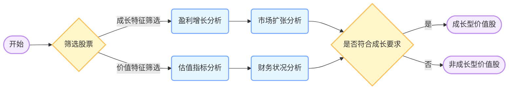

# 彼得林奇的“成长型价值股”在不同行业的表现

> 关键词：彼得林奇、成长型价值股、不同行业、股票表现、投资策略

> 摘要：本文深入探讨了彼得林奇所倡导的“成长型价值股”在不同行业的表现。首先介绍了相关背景知识，包括目的、预期读者、文档结构等。接着阐述了核心概念与联系，分析了成长型价值股的原理和架构。详细讲解了核心算法原理及具体操作步骤，并用数学模型和公式进行了理论支撑。通过项目实战给出代码实际案例和解释。探讨了其在不同行业的实际应用场景，推荐了学习、开发工具等资源，最后总结了未来发展趋势与挑战，解答了常见问题并提供扩展阅读和参考资料，旨在为投资者理解和应用成长型价值股投资策略提供全面的指导。

## 1. 背景介绍 
### 1.1 目的和范围
本研究的主要目的是深入剖析彼得林奇的“成长型价值股”投资理念在不同行业中的表现。彼得林奇作为投资界的传奇人物，他的投资策略对全球投资者产生了深远的影响。“成长型价值股”结合了成长股的高增长潜力和价值股的低估值特性，为投资者提供了一种独特的投资视角。本研究将涵盖多个主要行业，包括但不限于科技、金融、消费、医疗等，通过对这些行业中成长型价值股的表现进行分析，揭示其在不同行业环境下的特点和规律，为投资者在选择投资标的和制定投资策略时提供参考。

### 1.2 预期读者
本文预期读者主要包括专业投资者、个人投资者、金融分析师以及对股票投资感兴趣的学生和研究人员。对于专业投资者和金融分析师来说，本文可以为他们在资产配置和行业研究方面提供新的思路和方法；个人投资者可以通过了解不同行业中成长型价值股的表现，优化自己的投资组合；学生和研究人员则可以将本文作为研究股票投资和行业分析的参考资料，加深对相关理论和实践的理解。

### 1.3 文档结构概述
本文将按照以下结构展开：首先介绍相关背景知识，包括目的、预期读者和文档结构等；接着阐述核心概念与联系，包括成长型价值股的定义、原理和架构，并通过文本示意图和 Mermaid 流程图进行直观展示；详细讲解核心算法原理及具体操作步骤，并用 Python 源代码进行示例；运用数学模型和公式对成长型价值股的表现进行量化分析，并举例说明；通过项目实战给出代码实际案例和详细解释；探讨成长型价值股在不同行业的实际应用场景；推荐学习、开发工具等相关资源；总结未来发展趋势与挑战；解答常见问题并提供扩展阅读和参考资料。

### 1.4 术语表
#### 1.4.1 核心术语定义
- **成长型价值股**：指那些既具有成长股的特征，即公司具有较高的盈利增长速度和发展潜力，同时又具备价值股的特点，即股票价格相对其内在价值被低估的股票。
- **内在价值**：指股票所代表的公司的真实价值，通常通过对公司的财务状况、盈利能力、市场竞争力等因素进行综合分析来估算。
- **市盈率（P/E）**：指股票价格与每股盈利的比率，是衡量股票估值水平的常用指标之一。
- **市净率（P/B）**：指股票价格与每股净资产的比率，反映了股票价格相对于公司净资产的倍数。

#### 1.4.2 相关概念解释
- **成长股**：通常是指那些处于快速发展阶段，具有较高的盈利增长速度和市场份额扩张潜力的公司的股票。成长股的投资者更关注公司的未来发展前景，愿意为其较高的增长预期支付较高的价格。
- **价值股**：指那些股票价格相对其内在价值被低估的股票。价值股的投资者更注重公司的当前价值和财务状况，认为市场对这些股票的定价存在偏差，通过买入这些股票可以获得价值回归带来的收益。
- **行业轮动**：指在不同的经济周期和市场环境下，各个行业的表现会出现差异，投资者可以通过调整投资组合，将资金从表现不佳的行业转移到表现较好的行业，以获取更高的收益。

#### 1.4.3 缩略词列表
- **P/E**：市盈率（Price-to-Earnings Ratio）
- **P/B**：市净率（Price-to-Book Ratio）
- **EPS**：每股收益（Earnings Per Share）

## 2. 核心概念与联系 
### 核心概念原理
彼得林奇的“成长型价值股”投资理念基于对公司基本面的深入研究和分析。其核心原理在于寻找那些具有持续增长潜力，但目前市场价格尚未充分反映其价值的公司股票。成长型价值股的选择需要综合考虑多个因素，包括公司的盈利增长速度、盈利能力、市场竞争力、财务状况等。

从盈利增长角度来看，成长型价值股所在的公司通常具有较高的销售增长率和净利润增长率。这种增长可以来自于多个方面，如新产品的推出、市场份额的扩大、成本的降低等。例如，一家科技公司通过不断研发新的技术和产品，满足市场需求，从而实现销售额和利润的快速增长。

盈利能力也是评估成长型价值股的重要指标。公司的盈利能力可以通过毛利率、净利率等指标来衡量。较高的毛利率和净利率表明公司在产品定价和成本控制方面具有优势，能够为股东创造更多的价值。

市场竞争力是决定公司能否持续增长的关键因素。具有较强市场竞争力的公司通常拥有独特的技术、品牌、渠道等优势，能够在激烈的市场竞争中脱颖而出。例如，一家消费品牌公司通过长期的品牌建设和市场推广，建立了良好的品牌形象和消费者忠诚度，从而在市场中占据了领先地位。

财务状况是评估公司风险和可持续发展能力的重要依据。良好的财务状况包括合理的资产负债结构、充足的现金流等。一家财务状况健康的公司能够更好地应对市场波动和经营风险，为股东提供稳定的回报。

### 架构的文本示意图
```plaintext
成长型价值股
|-- 成长特征
|   |-- 盈利增长
|   |   |-- 销售增长率
|   |   |-- 净利润增长率
|   |-- 市场扩张
|   |   |-- 新产品推出
|   |   |-- 市场份额扩大
|-- 价值特征
|   |-- 估值指标
|   |   |-- 市盈率（P/E）
|   |   |-- 市净率（P/B）
|   |-- 财务状况
|   |   |-- 资产负债结构
|   |   |-- 现金流
```

### Mermaid 流程图


## 3. 核心算法原理 & 具体操作步骤 
### 核心算法原理
在筛选成长型价值股时，我们可以使用多因素模型来综合评估股票的成长和价值特征。以下是一个简化的多因素模型：

设 $S$ 为股票的综合评分，$G$ 为成长因子得分，$V$ 为价值因子得分，$w_G$ 和 $w_V$ 分别为成长因子和价值因子的权重，且 $w_G + w_V = 1$。则股票的综合评分计算公式为：

$S = w_G \times G + w_V \times V$

成长因子得分 $G$ 可以通过多个成长指标的加权平均来计算，例如：

$G = w_{GR1} \times GR_1 + w_{GR2} \times GR_2 + \cdots + w_{GRn} \times GR_n$

其中，$GR_i$ 为第 $i$ 个成长指标的值，$w_{GRi}$ 为第 $i$ 个成长指标的权重。常见的成长指标包括销售增长率、净利润增长率等。

价值因子得分 $V$ 可以通过多个价值指标的加权平均来计算，例如：

$V = w_{VR1} \times VR_1 + w_{VR2} \times VR_2 + \cdots + w_{VRm} \times VR_m$

其中，$VR_j$ 为第 $j$ 个价值指标的值，$w_{VRj}$ 为第 $j$ 个价值指标的权重。常见的价值指标包括市盈率、市净率等。

### 具体操作步骤
#### 步骤 1：数据收集
收集股票的相关数据，包括财务报表数据（如营业收入、净利润、净资产等）、市场数据（如股票价格、成交量等）。可以通过金融数据提供商（如东方财富、Wind 等）或证券交易所网站获取这些数据。

#### 步骤 2：指标计算
根据收集到的数据，计算成长指标和价值指标。例如，销售增长率可以通过以下公式计算：

$销售增长率 = \frac{本期营业收入 - 上期营业收入}{上期营业收入} \times 100\%$

净利润增长率可以通过以下公式计算：

$净利润增长率 = \frac{本期净利润 - 上期净利润}{上期净利润} \times 100\%$

市盈率可以通过以下公式计算：

$市盈率 = \frac{股票价格}{每股收益}$

市净率可以通过以下公式计算：

$市净率 = \frac{股票价格}{每股净资产}$

#### 步骤 3：因子得分计算
根据计算得到的成长指标和价值指标，计算成长因子得分 $G$ 和价值因子得分 $V$。可以根据历史数据或经验确定各指标的权重。

#### 步骤 4：综合评分计算
根据成长因子得分 $G$ 和价值因子得分 $V$，以及预先设定的权重 $w_G$ 和 $w_V$，计算股票的综合评分 $S$。

#### 步骤 5：股票筛选
根据综合评分 $S$ 对股票进行排序，选择综合评分较高的股票作为成长型价值股的候选标的。

### Python 源代码示例
```python
import pandas as pd

# 假设我们已经从数据提供商获取了以下数据
data = {
    '股票代码': ['000001', '000002', '000003'],
    '本期营业收入': [1000, 2000, 3000],
    '上期营业收入': [800, 1500, 2500],
    '本期净利润': [100, 200, 300],
    '上期净利润': [80, 150, 250],
    '股票价格': [10, 20, 30],
    '每股收益': [1, 2, 3],
    '每股净资产': [5, 10, 15]
}

df = pd.DataFrame(data)

# 计算成长指标
df['销售增长率'] = (df['本期营业收入'] - df['上期营业收入']) / df['上期营业收入'] * 100
df['净利润增长率'] = (df['本期净利润'] - df['上期净利润']) / df['上期净利润'] * 100

# 计算价值指标
df['市盈率'] = df['股票价格'] / df['每股收益']
df['市净率'] = df['股票价格'] / df['每股净资产']

# 设定成长指标和价值指标的权重
w_gr1 = 0.6  # 销售增长率权重
w_gr2 = 0.4  # 净利润增长率权重
w_vr1 = 0.5  # 市盈率权重
w_vr2 = 0.5  # 市净率权重

# 计算成长因子得分
df['成长因子得分'] = w_gr1 * df['销售增长率'] + w_gr2 * df['净利润增长率']

# 计算价值因子得分
df['价值因子得分'] = w_vr1 * df['市盈率'] + w_vr2 * df['市净率']

# 设定成长因子和价值因子的权重
w_G = 0.7
w_V = 0.3

# 计算综合评分
df['综合评分'] = w_G * df['成长因子得分'] + w_V * df['价值因子得分']

# 按综合评分排序
df = df.sort_values(by='综合评分', ascending=False)

print(df)
```

## 4. 数学模型和公式 & 详细讲解 & 举例说明 
### 成长因子模型
如前所述，成长因子得分 $G$ 可以通过多个成长指标的加权平均来计算。假设我们选择销售增长率 $GR_1$ 和净利润增长率 $GR_2$ 作为成长指标，其权重分别为 $w_{GR1}$ 和 $w_{GR2}$，则成长因子得分公式为：

$G = w_{GR1} \times GR_1 + w_{GR2} \times GR_2$

例如，某股票的销售增长率为 $20\%$，净利润增长率为 $30\%$，销售增长率的权重为 $0.6$，净利润增长率的权重为 $0.4$，则该股票的成长因子得分 $G$ 为：

$G = 0.6 \times 20 + 0.4 \times 30$
$= 12 + 12$
$= 24$

### 价值因子模型
价值因子得分 $V$ 可以通过多个价值指标的加权平均来计算。假设我们选择市盈率 $VR_1$ 和市净率 $VR_2$ 作为价值指标，其权重分别为 $w_{VR1}$ 和 $w_{VR2}$，则价值因子得分公式为：

$V = w_{VR1} \times VR_1 + w_{VR2} \times VR_2$

例如，某股票的市盈率为 $15$，市净率为 $2$，市盈率的权重为 $0.5$，市净率的权重为 $0.5$，则该股票的价值因子得分 $V$ 为：

$V = 0.5 \times 15 + 0.5 \times 2$
$= 7.5 + 1$
$= 8.5$

### 综合评分模型
综合评分 $S$ 是成长因子得分 $G$ 和价值因子得分 $V$ 的加权平均，公式为：

$S = w_G \times G + w_V \times V$

假设成长因子的权重 $w_G = 0.7$，价值因子的权重 $w_V = 0.3$，上述股票的成长因子得分 $G = 24$，价值因子得分 $V = 8.5$，则该股票的综合评分 $S$ 为：

$S = 0.7 \times 24 + 0.3 \times 8.5$
$= 16.8 + 2.55$
$= 19.35$

### 举例说明
假设我们有三只股票 A、B、C，它们的相关数据如下表所示：

| 股票 | 销售增长率 | 净利润增长率 | 市盈率 | 市净率 |
| ---- | ---- | ---- | ---- | ---- |
| A | 15% | 20% | 12 | 1.5 |
| B | 25% | 30% | 18 | 2 |
| C | 10% | 15% | 10 | 1.2 |

我们按照上述模型和公式进行计算，假设各指标的权重如下：

$w_{GR1} = 0.6$，$w_{GR2} = 0.4$，$w_{VR1} = 0.5$，$w_{VR2} = 0.5$，$w_G = 0.7$，$w_V = 0.3$

#### 计算成长因子得分
- 股票 A：
$G_A = 0.6 \times 15 + 0.4 \times 20$
$= 9 + 8$
$= 17$

- 股票 B：
$G_B = 0.6 \times 25 + 0.4 \times 30$
$= 15 + 12$
$= 27$

- 股票 C：
$G_C = 0.6 \times 10 + 0.4 \times 15$
$= 6 + 6$
$= 12$

#### 计算价值因子得分
- 股票 A：
$V_A = 0.5 \times 12 + 0.5 \times 1.5$
$= 6 + 0.75$
$= 6.75$

- 股票 B：
$V_B = 0.5 \times 18 + 0.5 \times 2$
$= 9 + 1$
$= 10$

- 股票 C：
$V_C = 0.5 \times 10 + 0.5 \times 1.2$
$= 5 + 0.6$
$= 5.6$

#### 计算综合评分
- 股票 A：
$S_A = 0.7 \times 17 + 0.3 \times 6.75$
$= 11.9 + 2.025$
$= 13.925$

- 股票 B：
$S_B = 0.7 \times 27 + 0.3 \times 10$
$= 18.9 + 3$
$= 21.9$

- 股票 C：
$S_C = 0.7 \times 12 + 0.3 \times 5.6$
$= 8.4 + 1.68$
$= 10.08$

从综合评分来看，股票 B 的得分最高，说明它在成长和价值方面的综合表现最好，可能是更具投资价值的成长型价值股。

## 5. 项目实战：代码实际案例和详细解释说明 
### 5.1  开发环境搭建
#### 安装 Python
首先需要安装 Python 环境，建议使用 Python 3.7 及以上版本。可以从 Python 官方网站（https://www.python.org/downloads/）下载对应操作系统的安装包，按照安装向导进行安装。

#### 安装必要的库
在本项目中，我们需要使用以下 Python 库：
- `pandas`：用于数据处理和分析。
- `numpy`：用于数值计算。

可以使用以下命令来安装这些库：
```sh
pip install pandas numpy
```

### 5.2  源代码详细实现和代码解读
```python
import pandas as pd
import numpy as np

# 模拟从数据提供商获取的数据
data = {
    '股票代码': ['000001', '000002', '000003', '000004', '000005'],
    '本期营业收入': [1000, 2000, 3000, 4000, 5000],
    '上期营业收入': [800, 1500, 2500, 3500, 4500],
    '本期净利润': [100, 200, 300, 400, 500],
    '上期净利润': [80, 150, 250, 350, 450],
    '股票价格': [10, 20, 30, 40, 50],
    '每股收益': [1, 2, 3, 4, 5],
    '每股净资产': [5, 10, 15, 20, 25]
}

# 将数据转换为 DataFrame
df = pd.DataFrame(data)

# 计算成长指标
df['销售增长率'] = (df['本期营业收入'] - df['上期营业收入']) / df['上期营业收入'] * 100
df['净利润增长率'] = (df['本期净利润'] - df['上期净利润']) / df['上期净利润'] * 100

# 计算价值指标
df['市盈率'] = df['股票价格'] / df['每股收益']
df['市净率'] = df['股票价格'] / df['每股净资产']

# 设定成长指标和价值指标的权重
w_gr1 = 0.6  # 销售增长率权重
w_gr2 = 0.4  # 净利润增长率权重
w_vr1 = 0.5  # 市盈率权重
w_vr2 = 0.5  # 市净率权重

# 计算成长因子得分
df['成长因子得分'] = w_gr1 * df['销售增长率'] + w_gr2 * df['净利润增长率']

# 计算价值因子得分
df['价值因子得分'] = w_vr1 * df['市盈率'] + w_vr2 * df['市净率']

# 设定成长因子和价值因子的权重
w_G = 0.7
w_V = 0.3

# 计算综合评分
df['综合评分'] = w_G * df['成长因子得分'] + w_V * df['价值因子得分']

# 按综合评分排序
df = df.sort_values(by='综合评分', ascending=False)

# 选择综合评分最高的前三只股票
top_stocks = df.head(3)

print(top_stocks)
```

### 5.3  代码解读与分析
#### 数据模拟与 DataFrame 创建
```python
data = {
    '股票代码': ['000001', '000002', '000003', '000004', '000005'],
    '本期营业收入': [1000, 2000, 3000, 4000, 5000],
    '上期营业收入': [800, 1500, 2500, 3500, 4500],
    '本期净利润': [100, 200, 300, 400, 500],
    '上期净利润': [80, 150, 250, 350, 450],
    '股票价格': [10, 20, 30, 40, 50],
    '每股收益': [1, 2, 3, 4, 5],
    '每股净资产': [5, 10, 15, 20, 25]
}

df = pd.DataFrame(data)
```
这部分代码模拟了从数据提供商获取的股票相关数据，并将其转换为 `pandas` 的 `DataFrame` 对象，方便后续的数据处理和分析。

#### 成长指标和价值指标计算
```python
df['销售增长率'] = (df['本期营业收入'] - df['上期营业收入']) / df['上期营业收入'] * 100
df['净利润增长率'] = (df['本期净利润'] - df['上期净利润']) / df['上期净利润'] * 100

df['市盈率'] = df['股票价格'] / df['每股收益']
df['市净率'] = df['股票价格'] / df['每股净资产']
```
通过对 `DataFrame` 中的数据进行计算，得到了销售增长率、净利润增长率、市盈率和市净率等指标。

#### 因子得分计算
```python
w_gr1 = 0.6  # 销售增长率权重
w_gr2 = 0.4  # 净利润增长率权重
w_vr1 = 0.5  # 市盈率权重
w_vr2 = 0.5  # 市净率权重

df['成长因子得分'] = w_gr1 * df['销售增长率'] + w_gr2 * df['净利润增长率']
df['价值因子得分'] = w_vr1 * df['市盈率'] + w_vr2 * df['市净率']
```
根据设定的权重，计算成长因子得分和价值因子得分。

#### 综合评分计算与排序
```python
w_G = 0.7
w_V = 0.3

df['综合评分'] = w_G * df['成长因子得分'] + w_V * df['价值因子得分']

df = df.sort_values(by='综合评分', ascending=False)
```
计算综合评分，并按综合评分从高到低对股票进行排序。

#### 选择前三只股票
```python
top_stocks = df.head(3)

print(top_stocks)
```
选择综合评分最高的前三只股票，并打印输出。

## 6. 实际应用场景 
### 科技行业
在科技行业中，成长型价值股往往具有较高的创新能力和技术实力。这些公司不断投入研发，推出新的产品和服务，以满足市场的需求。例如，一些人工智能、云计算、半导体等领域的公司，它们在技术上具有领先优势，能够实现快速的盈利增长。然而，由于科技行业的竞争激烈，市场对这些公司的估值波动较大。有时候，市场可能会过度悲观，导致这些公司的股票价格被低估。此时，投资者可以通过寻找具有成长潜力但估值合理的科技公司股票，来获取成长和价值回归带来的双重收益。

### 金融行业
金融行业中的成长型价值股主要包括银行、证券、保险等领域的公司。对于银行来说，一些具有良好风险管理能力和业务创新能力的银行，能够在经济增长的环境下实现资产规模的扩张和盈利的增长。同时，如果银行的股票价格相对其净资产和盈利能力被低估，那么它就可能成为成长型价值股。证券行业的公司则受益于市场交易活跃度的提升和业务多元化的发展。保险行业的成长型价值股通常具有较强的品牌影响力、良好的风险管理能力和多元化的产品线。

### 消费行业
消费行业是一个相对稳定的行业，成长型价值股在其中也有很好的表现。一些知名的消费品牌公司，通过不断拓展市场份额、推出新产品和优化营销策略，实现了持续的盈利增长。同时，由于消费行业的现金流稳定，这些公司的股票往往具有较高的股息率。当市场对消费行业的预期过于悲观时，这些公司的股票价格可能会被低估，投资者可以抓住机会买入，分享公司成长和价值回归的收益。

### 医疗行业
医疗行业是一个具有长期增长潜力的行业。随着人口老龄化的加剧和人们对健康的关注度不断提高，医疗需求持续增长。一些医疗科技公司、制药公司和医疗器械公司等，通过研发创新药物和先进的医疗设备，实现了快速的发展。然而，医疗行业的研发周期长、风险大，市场对这些公司的估值也存在一定的不确定性。当市场对某些医疗公司的短期业绩过于担忧时，可能会导致其股票价格被低估，此时投资者可以寻找具有成长潜力的医疗行业成长型价值股。

## 7. 工具和资源推荐
### 7.1 学习资源推荐
#### 7.1.1 书籍推荐
- 《彼得·林奇的成功投资》：彼得·林奇本人所著，详细阐述了他的投资理念和方法，是学习成长型价值股投资的经典之作。
- 《聪明的投资者》：本杰明·格雷厄姆的代表作，被誉为投资界的圣经，对价值投资的理论和实践进行了深入的探讨。
- 《怎样选择成长股》：菲利普·费雪的经典著作，介绍了如何寻找具有长期成长潜力的公司股票。

#### 7.1.2 在线课程
- Coursera 上的“投资学原理”：由知名大学教授授课，系统地介绍了投资学的基本原理和方法。
- 网易云课堂上的“股票投资实战课程”：结合实际案例，讲解股票投资的技巧和策略。

#### 7.1.3 技术博客和网站
- 雪球网：国内知名的投资社区，汇聚了众多投资者的经验和观点，可以了解到成长型价值股的最新动态和分析。
- 东方财富网：提供丰富的金融数据和资讯，方便投资者进行股票研究和分析。

### 7.2 开发工具框架推荐
#### 7.2.1 IDE和编辑器
- PyCharm：一款专业的 Python 集成开发环境，具有强大的代码编辑、调试和分析功能。
- Jupyter Notebook：交互式的开发环境，适合进行数据探索和分析，方便展示代码和结果。

#### 7.2.2 调试和性能分析工具
- `pdb`：Python 内置的调试器，可以帮助开发者定位代码中的问题。
- `cProfile`：Python 的性能分析工具，可以分析代码的运行时间和资源消耗情况。

#### 7.2.3 相关框架和库
- `pandas`：用于数据处理和分析，提供了丰富的数据结构和函数。
- `numpy`：用于数值计算，提供了高效的数组操作和数学函数。
- `scikit-learn`：用于机器学习和数据分析，提供了多种机器学习算法和工具。

### 7.3 相关论文著作推荐
#### 7.3.1 经典论文
- Fama, E. F., & French, K. R. (1992). The cross-section of expected stock returns. *Journal of Finance*, 47(2), 427-465. 该论文提出了著名的 Fama-French 三因子模型，对股票收益的影响因素进行了深入研究。
- Lakonishok, J., Shleifer, A., & Vishny, R. W. (1994). Contrarian investment, extrapolation, and risk. *Journal of Finance*, 49(5), 1541-1578. 探讨了逆向投资策略的有效性和风险。

#### 7.3.2 最新研究成果
可以关注《Journal of Financial Economics》、《Review of Financial Studies》等顶级金融学术期刊，了解关于成长型价值股的最新研究成果。

#### 7.3.3 应用案例分析
一些投资研究机构和券商的研究报告中会有关于成长型价值股的应用案例分析，可以参考这些报告了解实际投资中的应用情况。

## 8. 总结：未来发展趋势与挑战
### 未来发展趋势
#### 科技驱动的成长机会增加
随着科技的不断进步，新兴科技领域如人工智能、大数据、区块链等将为成长型价值股带来更多的投资机会。这些领域的公司具有较高的创新能力和成长潜力，有望在未来实现快速的发展。

#### 行业整合加剧
各行业的竞争将日益激烈，行业整合趋势将加剧。一些具有优势的成长型价值股公司可能会通过并购等方式扩大市场份额，提升自身的竞争力。

#### 全球市场联动增强
随着全球经济一体化的发展，全球股票市场的联动性将增强。成长型价值股的表现不仅受到国内经济和市场环境的影响，还将受到全球经济和市场的影响。

### 挑战
#### 市场不确定性增加
宏观经济环境的不确定性、政策变化、地缘政治风险等因素将增加市场的波动性，给成长型价值股的投资带来挑战。投资者需要更加谨慎地评估风险，制定合理的投资策略。

#### 科技迭代速度加快
科技行业的快速发展使得技术迭代速度加快，一些曾经具有成长潜力的公司可能会因为技术落后而失去竞争力。投资者需要不断跟踪科技发展趋势，及时调整投资组合。

#### 估值难度加大
随着市场的变化和公司的发展，成长型价值股的估值难度将加大。传统的估值方法可能无法准确反映公司的真实价值，投资者需要运用更加多元化的估值方法和工具。

## 9. 附录：常见问题与解答
### 问题 1：如何确定成长指标和价值指标的权重？
解答：成长指标和价值指标的权重可以根据投资者的投资目标、风险偏好和市场环境等因素来确定。一般来说，如果投资者更注重公司的成长潜力，可以适当提高成长指标的权重；如果投资者更注重股票的估值水平，可以适当提高价值指标的权重。也可以参考历史数据和行业经验来确定权重。

### 问题 2：成长型价值股的投资期限一般是多久？
解答：成长型价值股的投资期限通常较长，一般建议在 3 - 5 年以上。因为成长型价值股的成长需要时间来体现，短期的市场波动可能会影响股票价格，但从长期来看，公司的成长和价值回归将带来较好的投资回报。

### 问题 3：如何判断一只股票是否为成长型价值股？
解答：判断一只股票是否为成长型价值股需要综合考虑多个因素，包括公司的盈利增长速度、盈利能力、市场竞争力、财务状况、估值水平等。可以使用本文介绍的多因素模型来进行评估，也可以参考专业机构的研究报告和分析。

## 10. 扩展阅读 & 参考资料
### 扩展阅读
- 《金融炼金术》：乔治·索罗斯的著作，介绍了他的投资哲学和操作方法。
- 《金融市场技术分析》：约翰·墨菲的经典著作，讲解了股票市场的技术分析方法。

### 参考资料
- 彼得·林奇. 《彼得·林奇的成功投资》. 机械工业出版社.
- 本杰明·格雷厄姆. 《聪明的投资者》. 人民邮电出版社.
- 菲利普·费雪. 《怎样选择成长股》. 地震出版社.

作者：AI天才研究院/AI Genius Institute & 禅与计算机程序设计艺术 /Zen And The Art of Computer Programming