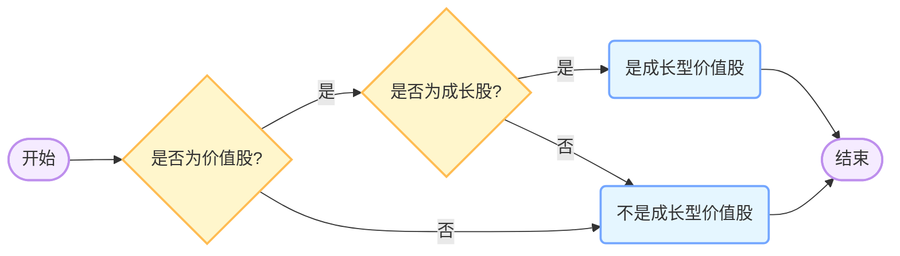

# 彼得林奇的"成长型价值股"定义

> 关键词：彼得林奇、成长型价值股、股票投资、价值分析、成长潜力

> 摘要：本文深入探讨彼得林奇提出的“成长型价值股”定义。详细介绍成长型价值股的背景，剖析其核心概念与联系，阐述相关算法原理及操作步骤，通过数学模型和公式进行理论支撑，结合项目实战案例加深理解，探讨其实际应用场景，推荐相关工具和资源，总结未来发展趋势与挑战，并提供常见问题解答和参考资料，旨在帮助投资者全面理解成长型价值股，提升投资决策的科学性和准确性。

## 1. 背景介绍 
### 1.1 目的和范围
本文的目的在于全面、深入地解析彼得林奇的“成长型价值股”定义。通过对这一概念的多维度剖析，为投资者提供系统的理论知识和实践指导，帮助他们在股票市场中识别和把握成长型价值股的投资机会。范围涵盖成长型价值股的理论基础、分析方法、实际应用以及未来发展趋势等方面。

### 1.2 预期读者
预期读者包括对股票投资有兴趣的初学者，希望通过学习相关理论和方法提升投资能力；有一定投资经验的投资者，期望深入了解成长型价值股的分析和选择策略，优化投资组合；金融专业的学生和研究人员，用于学术研究和案例分析；以及从事金融行业的从业人员，如证券分析师、投资顾问等，为其工作提供参考和理论支持。

### 1.3 文档结构概述
本文首先介绍“成长型价值股”定义的背景，包括目的、预期读者和文档结构概述等内容。接着阐述核心概念与联系，通过文本示意图和 Mermaid 流程图展示其原理和架构。然后详细讲解核心算法原理和具体操作步骤，结合 Python 源代码进行说明。之后介绍数学模型和公式，并举例说明。再通过项目实战案例，包括开发环境搭建、源代码实现和代码解读，加深对成长型价值股的理解。随后探讨实际应用场景，推荐相关的工具和资源。最后总结未来发展趋势与挑战，提供常见问题解答和参考资料。

### 1.4 术语表
#### 1.4.1 核心术语定义
- **成长型价值股**：指那些既具有价值股的特征，如较低的市盈率、市净率等，又具备成长股的特点，即公司未来具有较高的盈利增长潜力的股票。
- **价值股**：通常是指股价相对其内在价值被低估的股票，这类股票往往具有稳定的现金流、较高的股息率等特点。
- **成长股**：是指那些公司业务处于快速发展阶段，盈利增长速度较快，具有较大发展潜力的股票。

#### 1.4.2 相关概念解释
- **市盈率（P/E）**：是指股票价格除以每股收益的比率，反映了市场对公司盈利的预期和估值水平。较低的市盈率可能表示股票被低估，但也可能暗示公司的增长前景不佳。
- **市净率（P/B）**：是指股票价格与每股净资产的比率，衡量了市场对公司净资产的估值。市净率较低的股票可能具有一定的投资价值。
- **股息率**：是指股息与股票价格的比率，反映了公司向股东分配利润的能力和水平。较高的股息率通常表示公司具有稳定的现金流和盈利能力。

#### 1.4.3 缩略词列表
- **P/E**：市盈率（Price-to-Earnings Ratio）
- **P/B**：市净率（Price-to-Book Ratio）

## 2. 核心概念与联系 
### 核心概念原理
成长型价值股的核心原理在于将价值投资和成长投资的理念相结合。价值投资强调寻找被市场低估的股票，通过分析公司的财务报表、资产负债表等基本面信息，评估股票的内在价值，以较低的价格买入，等待市场对其价值的重新认可，从而获得投资收益。而成长投资则注重公司的未来发展潜力，关注公司的业务增长、创新能力、市场份额扩大等因素，投资于具有高成长潜力的公司，分享公司成长带来的股价上涨收益。

成长型价值股既要求股票具有一定的价值属性，如较低的市盈率、市净率，以保证投资的安全性和较低的风险；又要求公司具有良好的成长前景，如较高的盈利增长率、市场份额的不断扩大等，以实现投资的增值。这种结合可以在一定程度上平衡投资的风险和收益，提高投资的成功率。

### 架构的文本示意图
成长型价值股的架构可以用以下文本示意图表示：

```plaintext
成长型价值股
|-- 价值属性
|   |-- 低市盈率
|   |-- 低市净率
|   |-- 高股息率
|   |-- 稳定的现金流
|   |-- 良好的资产负债表
|-- 成长属性
|   |-- 高盈利增长率
|   |-- 市场份额扩大
|   |-- 创新能力强
|   |-- 行业前景广阔
|   |-- 优秀的管理团队
```

### Mermaid 流程图


## 3. 核心算法原理 & 具体操作步骤 
### 核心算法原理
在识别成长型价值股时，可以采用多因素综合评估的方法。通过对多个关键财务指标和非财务指标进行量化分析，计算出一个综合得分，根据得分来判断股票是否为成长型价值股。

以下是一个简化的算法原理，假设我们选取市盈率（P/E）、市净率（P/B）、盈利增长率（G）和股息率（D）这四个指标进行评估。首先，对每个指标进行标准化处理，将其转化为在 0 到 1 之间的数值，以消除不同指标量纲的影响。然后，为每个指标分配一个权重，根据指标的重要性程度确定权重大小。最后，将标准化后的指标值乘以相应的权重并求和，得到综合得分。

### 具体操作步骤
1. **数据收集**：收集目标股票的市盈率、市净率、盈利增长率和股息率等数据。可以从金融数据提供商、证券交易所网站或公司年报等渠道获取这些数据。
2. **指标标准化**：对每个指标进行标准化处理，公式如下：
   - 对于市盈率和市净率，采用逆序标准化，因为较低的值更优。
     - \(P/E_{norm}=\frac{\max(P/E)-P/E}{\max(P/E)-\min(P/E)}\)
     - \(P/B_{norm}=\frac{\max(P/B)-P/B}{\max(P/B)-\min(P/B)}\)
   - 对于盈利增长率和股息率，采用正序标准化，因为较高的值更优。
     - \(G_{norm}=\frac{G - \min(G)}{\max(G)-\min(G)}\)
     - \(D_{norm}=\frac{D - \min(D)}{\max(D)-\min(D)}\)
3. **权重分配**：根据指标的重要性程度，为每个指标分配权重。假设市盈率、市净率、盈利增长率和股息率的权重分别为 \(w_{P/E}\)、\(w_{P/B}\)、\(w_{G}\) 和 \(w_{D}\)，且 \(w_{P/E}+w_{P/B}+w_{G}+w_{D}=1\)。
4. **计算综合得分**：将标准化后的指标值乘以相应的权重并求和，得到综合得分 \(S\)。
   - \(S = w_{P/E} \times P/E_{norm}+w_{P/B} \times P/B_{norm}+w_{G} \times G_{norm}+w_{D} \times D_{norm}\)
5. **判断成长型价值股**：根据综合得分的大小，设定一个阈值 \(T\)。如果 \(S \geq T\)，则认为该股票是成长型价值股；否则，不是成长型价值股。

### Python 源代码实现
```python
import numpy as np

def standardize(data, reverse=False):
    """
    标准化函数
    :param data: 数据数组
    :param reverse: 是否逆序标准化
    :return: 标准化后的数据数组
    """
    max_val = np.max(data)
    min_val = np.min(data)
    if reverse:
        return (max_val - data) / (max_val - min_val)
    else:
        return (data - min_val) / (max_val - min_val)

def calculate_score(pe, pb, g, d, weights):
    """
    计算综合得分
    :param pe: 市盈率数组
    :param pb: 市净率数组
    :param g: 盈利增长率数组
    :param d: 股息率数组
    :param weights: 权重数组，顺序为 [w_pe, w_pb, w_g, w_d]
    :return: 综合得分数组
    """
    pe_norm = standardize(pe, reverse=True)
    pb_norm = standardize(pb, reverse=True)
    g_norm = standardize(g)
    d_norm = standardize(d)
    scores = weights[0] * pe_norm + weights[1] * pb_norm + weights[2] * g_norm + weights[3] * d_norm
    return scores

def is_growth_value_stock(scores, threshold):
    """
    判断是否为成长型价值股
    :param scores: 综合得分数组
    :param threshold: 阈值
    :return: 布尔数组，True 表示是成长型价值股，False 表示不是
    """
    return scores >= threshold

# 示例数据
pe = np.array([10, 15, 20, 25])
pb = np.array([1.5, 2.0, 2.5, 3.0])
g = np.array([0.1, 0.15, 0.2, 0.25])
d = np.array([0.03, 0.04, 0.05, 0.06])
weights = np.array([0.2, 0.2, 0.3, 0.3])
threshold = 0.6

# 计算综合得分
scores = calculate_score(pe, pb, g, d, weights)

# 判断是否为成长型价值股
result = is_growth_value_stock(scores, threshold)

print("综合得分:", scores)
print("是否为成长型价值股:", result)
```

## 4. 数学模型和公式 & 详细讲解 & 举例说明 
### 数学模型和公式
#### 标准化公式
- 逆序标准化公式：对于指标 \(x\)，其逆序标准化后的结果 \(x_{norm}\) 为：
  $$x_{norm}=\frac{\max(x)-x}{\max(x)-\min(x)}$$
  该公式用于处理市盈率和市净率等指标，因为较低的值更优。通过将最大值与当前值的差值除以最大值与最小值的差值，将指标值映射到 0 到 1 之间，值越大表示该指标越优。

- 正序标准化公式：对于指标 \(y\)，其正序标准化后的结果 \(y_{norm}\) 为：
  $$y_{norm}=\frac{y - \min(y)}{\max(y)-\min(y)}$$
  该公式用于处理盈利增长率和股息率等指标，因为较高的值更优。通过将当前值与最小值的差值除以最大值与最小值的差值，将指标值映射到 0 到 1 之间，值越大表示该指标越优。

#### 综合得分公式
综合得分 \(S\) 的计算公式为：
$$S = w_{P/E} \times P/E_{norm}+w_{P/B} \times P/B_{norm}+w_{G} \times G_{norm}+w_{D} \times D_{norm}$$
其中，\(w_{P/E}\)、\(w_{P/B}\)、\(w_{G}\) 和 \(w_{D}\) 分别为市盈率、市净率、盈利增长率和股息率的权重，且 \(w_{P/E}+w_{P/B}+w_{G}+w_{D}=1\)。\(P/E_{norm}\)、\(P/B_{norm}\)、\(G_{norm}\) 和 \(D_{norm}\) 分别为标准化后的市盈率、市净率、盈利增长率和股息率。

### 详细讲解
标准化的目的是消除不同指标量纲的影响，使各个指标在同一尺度下进行比较。逆序标准化适用于那些值越小越好的指标，如市盈率和市净率，通过这种方式可以将低市盈率和市净率的股票赋予较高的标准化值。正序标准化适用于那些值越大越好的指标，如盈利增长率和股息率，将高增长和高股息率的股票赋予较高的标准化值。

权重的分配反映了各个指标在评估成长型价值股时的重要性程度。例如，如果认为盈利增长率对成长型价值股的评估更为重要，可以适当提高 \(w_{G}\) 的权重。

综合得分 \(S\) 是各个指标标准化值的加权和，通过这个得分可以对不同股票进行排序和比较，得分越高的股票越有可能是成长型价值股。

### 举例说明
假设有三只股票 A、B、C，它们的市盈率、市净率、盈利增长率和股息率数据如下：

| 股票 | 市盈率（P/E） | 市净率（P/B） | 盈利增长率（G） | 股息率（D） |
| ---- | ------------- | ------------- | --------------- | ------------ |
| A    | 12            | 1.8           | 0.15            | 0.04         |
| B    | 18            | 2.2           | 0.2             | 0.03         |
| C    | 20            | 2.5           | 0.1            | 0.05         |

假设权重分配为 \(w_{P/E}=0.2\)，\(w_{P/B}=0.2\)，\(w_{G}=0.3\)，\(w_{D}=0.3\)。

1. **标准化处理**
   - 市盈率标准化：
     - \(\max(P/E)=20\)，\(\min(P/E)=12\)
     - \(P/E_{A_{norm}}=\frac{20 - 12}{20 - 12}=1\)
     - \(P/E_{B_{norm}}=\frac{20 - 18}{20 - 12}=0.25\)
     - \(P/E_{C_{norm}}=\frac{20 - 20}{20 - 12}=0\)
   - 市净率标准化：
     - \(\max(P/B)=2.5\)，\(\min(P/B)=1.8\)
     - \(P/B_{A_{norm}}=\frac{2.5 - 1.8}{2.5 - 1.8}=1\)
     - \(P/B_{B_{norm}}=\frac{2.5 - 2.2}{2.5 - 1.8}=0.43\)
     - \(P/B_{C_{norm}}=\frac{2.5 - 2.5}{2.5 - 1.8}=0\)
   - 盈利增长率标准化：
     - \(\max(G)=0.2\)，\(\min(G)=0.1\)
     - \(G_{A_{norm}}=\frac{0.15 - 0.1}{0.2 - 0.1}=0.5\)
     - \(G_{B_{norm}}=\frac{0.2 - 0.1}{0.2 - 0.1}=1\)
     - \(G_{C_{norm}}=\frac{0.1 - 0.1}{0.2 - 0.1}=0\)
   - 股息率标准化：
     - \(\max(D)=0.05\)，\(\min(D)=0.03\)
     - \(D_{A_{norm}}=\frac{0.04 - 0.03}{0.05 - 0.03}=0.5\)
     - \(D_{B_{norm}}=\frac{0.03 - 0.03}{0.05 - 0.03}=0\)
     - \(D_{C_{norm}}=\frac{0.05 - 0.03}{0.05 - 0.03}=1\)

2. **计算综合得分**
   - \(S_A = 0.2\times1 + 0.2\times1 + 0.3\times0.5 + 0.3\times0.5 = 0.7\)
   - \(S_B = 0.2\times0.25 + 0.2\times0.43 + 0.3\times1 + 0.3\times0 = 0.436\)
   - \(S_C = 0.2\times0 + 0.2\times0 +