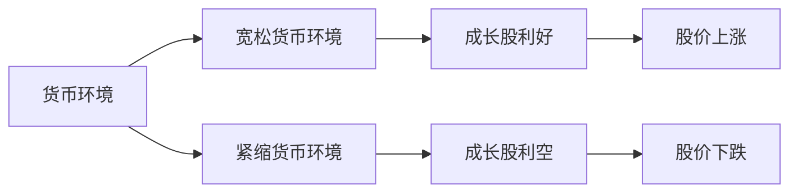

# 彼得林奇的"成长股"在不同货币环境下的表现

> 关键词：彼得林奇、成长股、货币环境、股市表现、投资策略

> 摘要：本文深入探讨了彼得林奇所倡导的成长股在不同货币环境下的表现。通过详细介绍成长股的核心概念、相关算法原理以及数学模型，结合实际项目案例和应用场景，分析成长股在宽松和紧缩等不同货币环境中的表现特征。同时，为读者推荐了学习成长股投资的相关工具和资源，最后对成长股投资的未来发展趋势与挑战进行总结，并提供常见问题解答和扩展阅读参考资料，旨在帮助投资者更好地理解和把握成长股在不同货币环境下的投资机会。

## 1. 背景介绍 
### 1.1 目的和范围
本文章的主要目的是深入剖析彼得林奇所推崇的成长股在不同货币环境下的表现。通过对成长股概念、算法、数学模型的研究，结合实际案例和应用场景，全面展示成长股在各种货币环境中的投资特性和规律。研究范围涵盖了不同货币环境的定义和分类，成长股的特征和评估方法，以及成长股在不同货币环境下的价格走势、收益情况等方面。

### 1.2 预期读者
本文预期读者包括对股票投资感兴趣的普通投资者、金融专业学生、投资机构从业者以及对宏观经济和股票市场有研究需求的人员。希望通过本文的内容，为他们在成长股投资决策和研究分析方面提供有价值的参考。

### 1.3 文档结构概述
本文将按照以下结构展开：首先介绍核心概念与联系，包括成长股和货币环境的定义及相互关系；接着阐述核心算法原理和具体操作步骤，通过Python代码进行详细说明；然后介绍相关的数学模型和公式，并举例说明；再通过项目实战展示成长股在不同货币环境下的实际表现和代码实现；之后分析实际应用场景；推荐学习成长股投资的工具和资源；最后总结未来发展趋势与挑战，提供常见问题解答和扩展阅读参考资料。

### 1.4 术语表
#### 1.4.1 核心术语定义
- **成长股**：指发行股票的上市公司销售额和利润额持续增长，且其增长速度快于整个国家和本行业的增长速度的股票。这类公司通常将大部分利润用于再投资，以支持公司的进一步扩张。
- **货币环境**：指宏观经济中货币的供应、流通、利率等方面的状况。常见的货币环境可分为宽松货币环境和紧缩货币环境。
- **宽松货币环境**：中央银行采取一系列货币政策，增加货币供应量，降低利率，以刺激经济增长的环境。例如，通过降低存款准备金率、进行公开市场操作买入债券等方式向市场注入资金。
- **紧缩货币环境**：中央银行采取措施减少货币供应量，提高利率，以抑制通货膨胀或经济过热的环境。例如，提高存款准备金率、在公开市场上卖出债券等。

#### 1.4.2 相关概念解释
- **市盈率（PE）**：指股票价格除以每股收益（EPS）的比率。它是衡量股票估值的常用指标，反映了投资者为获得公司每一元盈利所愿意支付的价格。
- **市净率（PB）**：指股票价格与每股净资产的比率。市净率可以反映公司的净资产价值与市场价格之间的关系，常用于评估公司的投资价值。
- **股息率**：指股息与股票价格的比率，反映了投资者从股票股息中获得的收益水平。

#### 1.4.3 缩略词列表
- **PE**：Price-to-Earnings Ratio，市盈率
- **PB**：Price-to-Book Ratio，市净率

## 2. 核心概念与联系 
### 2.1 成长股的核心概念
成长股是那些具有高增长潜力的公司所发行的股票。这些公司通常处于新兴行业或快速发展的阶段，具有独特的产品或服务、创新的技术、高效的管理团队等优势，能够在未来实现销售额和利润的持续增长。例如，科技行业中的一些新兴企业，如早期的苹果公司、亚马逊公司等，都被视为成长股的代表。

成长股的特点包括：
- **高增长性**：公司的销售额和利润增长速度通常远高于市场平均水平。
- **高市盈率**：由于投资者对公司未来增长的预期较高，愿意为其支付较高的价格，因此成长股的市盈率一般较高。
- **低股息率**：成长型公司通常将大部分利润用于再投资，以支持公司的扩张，因此股息分配较少，股息率相对较低。

### 2.2 货币环境的分类及特点
货币环境主要分为宽松货币环境和紧缩货币环境，其特点如下：
- **宽松货币环境**
    - **货币供应量增加**：中央银行通过降低存款准备金率、公开市场操作等方式向市场注入资金，导致市场上的货币供应量增加。
    - **利率下降**：资金供应增加会导致市场利率下降，企业的融资成本降低，有利于企业扩大投资和生产。
    - **经济刺激**：宽松的货币环境旨在刺激经济增长，提高就业率，促进消费和投资。
- **紧缩货币环境**
    - **货币供应量减少**：中央银行通过提高存款准备金率、在公开市场上卖出债券等方式回笼资金，减少市场上的货币供应量。
    - **利率上升**：资金供应减少会导致市场利率上升，企业的融资成本增加，抑制企业的投资和生产。
    - **抑制通货膨胀**：紧缩的货币环境通常用于抑制通货膨胀或经济过热，使经济增长保持在合理的范围内。

### 2.3 成长股与货币环境的联系
成长股的表现与货币环境密切相关。在宽松货币环境下，由于利率下降，企业的融资成本降低，成长型公司更容易获得资金支持其扩张计划，从而实现更快的增长。同时，投资者的风险偏好也会增加，更愿意投资于具有高增长潜力的成长股，推动成长股价格上涨。

相反，在紧缩货币环境下，利率上升，企业的融资成本增加，成长型公司的扩张计划可能受到限制，增长速度可能放缓。投资者的风险偏好也会降低，更倾向于投资于安全性较高的资产，导致成长股的需求下降，价格可能下跌。

### 2.4 核心概念原理和架构的文本示意图
```plaintext
           货币环境
         /           \
  宽松货币环境    紧缩货币环境
      |                |
  成长股利好         成长股利空
      |                |
  股价上涨            股价下跌
```

### 2.5 Mermaid 流程图


## 3. 核心算法原理 & 具体操作步骤 
### 3.1 成长股评估算法原理
评估成长股通常需要考虑多个因素，如公司的营业收入增长率、净利润增长率、市盈率等。以下是一个简单的成长股评估算法原理：
- **营业收入增长率**：反映公司业务的扩张速度。计算公式为：
  $营业收入增长率 = \frac{本期营业收入 - 上期营业收入}{上期营业收入} \times 100\%$
- **净利润增长率**：反映公司盈利能力的增长情况。计算公式为：
  $净利润增长率 = \frac{本期净利润 - 上期净利润}{上期净利润} \times 100\%$
- **综合评估**：通过综合考虑营业收入增长率和净利润增长率，以及市盈率等指标，对成长股进行评估。一般来说，营业收入增长率和净利润增长率较高，且市盈率相对合理的股票更有可能是成长股。

### 3.2 具体操作步骤及 Python 代码实现
以下是一个使用 Python 实现成长股评估的示例代码：

```python
import pandas as pd

# 定义一个函数来计算营业收入增长率
def calculate_revenue_growth_rate(revenue_current, revenue_previous):
    return ((revenue_current - revenue_previous) / revenue_previous) * 100

# 定义一个函数来计算净利润增长率
def calculate_net_income_growth_rate(net_income_current, net_income_previous):
    return ((net_income_current - net_income_previous) / net_income_previous) * 100

# 模拟公司财务数据
data = {
    '公司名称': ['A公司', 'B公司', 'C公司'],
    '本期营业收入': [1000, 1200, 800],
    '上期营业收入': [800, 1000, 700],
    '本期净利润': [200, 250, 150],
    '上期净利润': [150, 200, 120],
    '市盈率': [20, 25, 15]
}

df = pd.DataFrame(data)

# 计算营业收入增长率和净利润增长率
df['营业收入增长率'] = df.apply(lambda row: calculate_revenue_growth_rate(row['本期营业收入'], row['上期营业收入']), axis=1)
df['净利润增长率'] = df.apply(lambda row: calculate_net_income_growth_rate(row['本期净利润'], row['上期净利润']), axis=1)

# 筛选出营业收入增长率和净利润增长率较高，且市盈率相对合理的股票
growth_stocks = df[(df['营业收入增长率'] > 20) & (df['净利润增长率'] > 20) & (df['市盈率'] < 30)]

print("成长股筛选结果：")
print(growth_stocks)
```

### 3.3 代码解释
- **calculate_revenue_growth_rate 函数**：用于计算营业收入增长率，接受本期营业收入和上期营业收入作为参数，返回增长率。
- **calculate_net_income_growth_rate 函数**：用于计算净利润增长率，接受本期净利润和上期净利润作为参数，返回增长率。
- **模拟公司财务数据**：使用字典和 Pandas 数据框模拟公司的财务数据，包括公司名称、本期营业收入、上期营业收入、本期净利润、上期净利润和市盈率。
- **计算增长率**：使用 Pandas 的 apply 方法计算每个公司的营业收入增长率和净利润增长率。
- **筛选成长股**：根据营业收入增长率、净利润增长率和市盈率的条件筛选出成长股，并打印筛选结果。

## 4. 数学模型和公式 & 详细讲解 & 举例说明 
### 4.1 市盈率模型
市盈率（PE）是评估股票估值的常用指标，其计算公式为：
$$PE = \frac{P}{EPS}$$
其中，$P$ 表示股票价格，$EPS$ 表示每股收益。

市盈率模型的含义是投资者为获得公司每一元盈利所愿意支付的价格。一般来说，市盈率越高，说明投资者对公司未来的增长预期越高，但也可能意味着股票被高估；市盈率越低，说明股票可能被低估。

举例说明：假设某公司的股票价格为 50 元，每股收益为 2 元，则该公司的市盈率为：
$$PE = \frac{50}{2} = 25$$
这意味着投资者为获得该公司每一元盈利愿意支付 25 元。

### 4.2 市净率模型
市净率（PB）是衡量公司净资产价值与市场价格之间关系的指标，其计算公式为：
$$PB = \frac{P}{BVPS}$$
其中，$P$ 表示股票价格，$BVPS$ 表示每股净资产。

市净率模型的含义是股票价格相对于每股净资产的倍数。一般来说，市净率越低，说明股票的投资价值越高；市净率越高，说明股票可能被高估。

举例说明：假设某公司的股票价格为 30 元，每股净资产为 10 元，则该公司的市净率为：
$$PB = \frac{30}{10} = 3$$
这意味着该公司的股票价格是每股净资产的 3 倍。

### 4.3 股息折现模型
股息折现模型（DDM）是一种基于股息现金流的股票估值模型，其基本公式为：
$$P = \frac{D_1}{r - g}$$
其中，$P$ 表示股票价格，$D_1$ 表示下一期预计股息，$r$ 表示必要收益率，$g$ 表示股息增长率。

股息折现模型的含义是股票的价值等于其未来股息现金流的现值之和。该模型假设股息以固定的增长率 $g$ 增长。

举例说明：假设某公司下一期预计股息为 2 元，必要收益率为 10%，股息增长率为 5%，则该公司的股票价格为：
$$P = \frac{2}{0.1 - 0.05} = \frac{2}{0.05} = 40$$
这意味着根据股息折现模型，该公司的股票价值为 40 元。

### 4.4 多因素模型
多因素模型是一种综合考虑多个因素对股票收益影响的模型，其一般形式为：
$$R_i = \alpha_i + \beta_{i1}F_1 + \beta_{i2}F_2 + \cdots + \beta_{in}F_n + \epsilon_i$$
其中，$R_i$ 表示股票 $i$ 的收益率，$\alpha_i$ 表示股票 $i$ 的超额收益率，$\beta_{ij}$ 表示股票 $i$ 对因素 $j$ 的敏感度，$F_j$ 表示因素 $j$ 的收益率，$\epsilon_i$ 表示随机误差项。

多因素模型可以考虑的因素包括市场因素、行业因素、公司规模、市盈率等。通过分析这些因素对股票收益的影响，可以更全面地评估股票的投资价值。

举例说明：假设一个多因素模型考虑了市场因素和公司规模因素，某股票对市场因素的敏感度为 1.2，对公司规模因素的敏感度为 -0.5，市场因素的收益率为 10%，公司规模因素的收益率为 -5%，股票的超额收益率为 2%，则该股票的收益率为：
$$R = 2\% + 1.2 \times 10\% + (-0.5) \times (-5\%) = 2\% + 12\% + 2.5\% = 16.5\%$$

## 5. 项目实战：代码实际案例和详细解释说明 
### 5.1  开发环境搭建
为了实现成长股在不同货币环境下的表现分析，我们需要搭建以下开发环境：
- **Python 环境**：建议使用 Python 3.7 及以上版本。可以从 Python 官方网站（https://www.python.org/downloads/）下载并安装。
- **开发工具**：推荐使用 Jupyter Notebook 或 PyCharm 作为开发工具。Jupyter Notebook 可以方便地进行代码编写、调试和可视化展示；PyCharm 是一款功能强大的 Python 集成开发环境，提供了丰富的代码编辑和调试功能。
- **相关库安装**：需要安装 Pandas、Numpy、Matplotlib 等库。可以使用以下命令进行安装：
```bash
pip install pandas numpy matplotlib
```

### 5.2  源代码详细实现和代码解读
以下是一个模拟成长股在不同货币环境下表现的 Python 代码示例：

```python
import pandas as pd
import numpy as np
import matplotlib.pyplot as plt

# 模拟不同货币环境下的利率变化
def simulate_interest_rates(num_periods, initial_rate, rate_change):
    rates = [initial_rate]
    for i in range(1, num_periods):
        new_rate = rates[i - 1] + rate_change
        rates.append(new_rate)
    return rates

# 模拟成长股的收益情况
def simulate_growth_stock_returns(num_periods, initial_return, growth_rate, interest_rates):
    returns = [initial_return]
    for i in range(1, num_periods):
        # 考虑利率对成长股收益的影响
        if interest_rates[i] < interest_rates[i - 1]:
            # 宽松货币环境，收益增加
            new_return = returns[i - 1] * (1 + growth_rate + 0.02)
        else:
            # 紧缩货币环境，收益减少
            new_return = returns[i - 1] * (1 + growth_rate - 0.02)
        returns.append(new_return)
    return returns

# 模拟参数设置
num_periods = 10
initial_rate = 0.05
rate_change = 0.01
initial_return = 100
growth_rate = 0.1

# 模拟利率变化
interest_rates = simulate_interest_rates(num_periods, initial_rate, rate_change)

# 模拟成长股收益
growth_stock_returns = simulate_growth_stock_returns(num_periods, initial_return, growth_rate, interest_rates)

# 可视化结果
plt.figure(figsize=(10, 6))
plt.plot(interest_rates, label='利率')
plt.plot(growth_stock_returns, label='成长股收益')
plt.xlabel('周期')
plt.ylabel('数值')
plt.title('不同货币环境下成长股的表现')
plt.legend()
plt.show()
```

### 5.3  代码解读与分析
- **simulate_interest_rates 函数**：用于模拟不同货币环境下的利率变化。接受模拟周期数、初始利率和利率变化量作为参数，返回一个包含各周期利率的列表。
- **simulate_growth_stock_returns 函数**：用于模拟成长股的收益情况。接受模拟周期数、初始收益、成长率和利率列表作为参数，根据利率的变化情况计算成长股在不同周期的收益。在宽松货币环境（利率下降）下，成长股收益增加；在紧缩货币环境（利率上升）下，成长股收益减少。
- **模拟参数设置**：设置模拟周期数、初始利率、利率变化量、初始收益和成长率等参数。
- **模拟利率变化和成长股收益**：调用 `simulate_interest_rates` 和 `simulate_growth_stock_returns` 函数进行模拟。
- **可视化结果**：使用 Matplotlib 库绘制利率和成长股收益的折线图，直观展示不同货币环境下成长股的表现。

通过这个代码示例，我们可以看到在不同货币环境下，成长股的收益会受到利率变化的影响。在实际应用中，我们可以根据更复杂的模型和真实的市场数据进行更准确的分析。

## 6. 实际应用场景 
### 6.1 投资者决策
对于个人投资者和投资机构来说，了解成长股在不同货币环境下的表现可以帮助他们做出更明智的投资决策。在宽松货币环境下，投资者可以适当增加成长股的投资比例，以获取更高的收益；在紧缩货币环境下，投资者可以减少成长股的投资，增加债券等固定收益类资产的配置，降低投资风险。

### 6.2 基金管理
基金经理在管理成长型基金时，需要考虑货币环境对成长股的影响。在不同的货币环境下，调整基金的持仓结构，选择表现较好的成长股，以提高基金的业绩。例如，在宽松货币环境下，基金经理可以加大对科技、医疗等成长型行业的投资；在紧缩货币环境下，适当减少这些行业的持仓。

### 6.3 宏观经济分析
经济学家和政策制定者可以通过研究成长股在不同货币环境下的表现，了解货币政策对实体经济和股票市场的影响。成长股的表现可以作为宏观经济的一个重要指标，反映经济的增长动力和市场的预期。政策制定者可以根据成长股的表现调整货币政策，以实现经济的稳定增长和通货膨胀的控制。

### 6.4 企业融资决策
对于成长型企业来说，了解不同货币环境下成长股的表现可以帮助它们制定合理的融资策略。在宽松货币环境下，企业可以更容易地通过发行股票等方式获得融资，支持企业的扩张和发展；在紧缩货币环境下，企业可能需要寻找其他融资渠道，如银行贷款、债券发行等。

## 7. 工具和资源推荐
### 7.1 学习资源推荐
#### 7.1.1 书籍推荐
- 《彼得·林奇的成功投资》：彼得·林奇的经典著作，详细介绍了他的投资理念和方法，包括如何寻找成长股、如何评估公司价值等内容。
- 《聪明的投资者》：本杰明·格雷厄姆的代表作，被誉为投资界的圣经。书中阐述了价值投资的基本原理和方法，对成长股投资也有一定的指导意义。
- 《怎样选择成长股》：菲利普·费雪的经典著作，深入探讨了成长股的选择标准和分析方法，对投资者具有很高的参考价值。

#### 7.1.2 在线课程
- Coursera 上的“投资学原理”：该课程由知名大学的教授授课，系统介绍了投资学的基本原理和方法，包括股票投资、债券投资等内容。
- edX 上的“金融市场”：课程涵盖了金融市场的各个方面，包括股票市场、债券市场、衍生品市场等，对理解成长股在金融市场中的表现有很大帮助。

#### 7.1.3 技术博客和网站
- 雪球网：国内知名的投资社区，提供了丰富的股票投资信息和分析文章，投资者可以在上面交流投资经验和分享观点。
- Seeking Alpha：国外知名的投资研究网站，提供了大量的股票分析报告和投资策略建议，对研究成长股在不同货币环境下的表现有一定的参考价值。

### 7.2 开发工具框架推荐
#### 7.2.1 IDE和编辑器
- Jupyter Notebook：是一个开源的交互式开发环境，支持 Python、R 等多种编程语言，非常适合进行数据分析和可视化。
- PyCharm：是一款功能强大的 Python 集成开发环境，提供了丰富的代码编辑、调试和测试功能，适合专业的 Python 开发者。

#### 7.2.2 调试和性能分析工具
- IPython：是 Python 的一个交互式解释器，提供了强大的调试和分析功能，如代码自动补全、变量查看、错误调试等。
- cProfile：是 Python 标准库中的一个性能分析工具，可以帮助开发者找出代码中的性能瓶颈，优化代码性能。

#### 7.2.3 相关框架和库
- Pandas：是一个用于数据处理和分析的 Python 库，提供了高效的数据结构和数据操作方法，非常适合处理股票市场数据。
- Numpy：是 Python 的一个数值计算库，提供了高效的多维数组对象和数学函数，用于进行数值计算和数据分析。
- Matplotlib：是一个用于数据可视化的 Python 库，提供了丰富的绘图功能，可以绘制折线图、柱状图、散点图等多种图形，用于展示成长股在不同货币环境下的表现。

### 7.3 相关论文著作推荐
#### 7.3.1 经典论文
- 《资本资产定价模型：理论与实证》：该论文提出了资本资产定价模型（CAPM），为股票投资的风险和收益分析提供了重要的理论基础。
- 《有效市场假说》：该论文阐述了有效市场假说的基本原理，对理解股票市场的定价机制和投资策略有重要的启示作用。

#### 7.3.2 最新研究成果
- 《货币政策对股票市场的影响：基于不同行业的分析》：该研究分析了货币政策对不同行业股票市场的影响，为投资者在不同货币环境下选择投资行业提供了参考。
- 《成长股投资策略的有效性研究》：该研究通过实证分析验证了成长股投资策略的有效性，并探讨了影响成长股投资收益的因素。

#### 7.3.3 应用案例分析
- 《某成长型基金在不同货币环境下的投资策略调整案例分析》：该案例分析了某成长型基金在不同货币环境下如何调整投资策略，以适应市场变化，对基金管理具有一定的借鉴意义。
- 《某成长型企业在宽松货币环境下的融资与扩张案例分析》：该案例分析了某成长型企业在宽松货币环境下如何通过融资实现企业的扩张和发展，为成长型企业的融资决策提供了参考。

## 8. 总结：未来发展趋势与挑战
### 8.1 未来发展趋势
- **科技驱动的成长股持续增长**：随着科技的不断进步，人工智能、大数据、云计算、生物科技等领域的成长股有望继续保持较高的增长速度。这些行业的创新和发展将为成长股投资带来更多的机会。
- **绿色和可持续发展相关成长股崛起**：在全球关注气候变化和可持续发展的背景下，与绿色能源、环保、可持续农业等相关的成长股可能会受到更多投资者的关注。政府的政策支持和市场需求的增加将推动这些行业的发展。
- **全球经济一体化下的成长股投资机会**：随着全球经济一体化的深入，投资者可以更方便地投资于全球范围内的成长股。新兴市场国家的经济增长和发展将为成长股投资提供更广阔的空间。

### 8.2 挑战
- **宏观经济不确定性**：全球宏观经济形势的不确定性，如贸易摩擦、通货膨胀、利率波动等，将对成长股的表现产生影响。投资者需要密切关注宏观经济数据和政策变化，及时调整投资策略。
- **科技变革带来的风险**：科技行业的快速变革可能导致某些成长股的竞争优势迅速丧失。投资者需要具备较强的行业分析能力和风险识别能力，避免投资于那些可能被技术淘汰的成长股。
- **市场情绪和投资者行为**：股票市场的波动往往受到市场情绪和投资者行为的影响。投资者的恐慌和贪婪情绪可能导致成长股价格的过度波动，增加投资风险。投资者需要保持理性和冷静，避免盲目跟风投资。

## 9. 附录：常见问题与解答
### 9.1 成长股一定能带来高收益吗？
不一定。虽然成长股具有较高的增长潜力，但并不意味着它们一定能带来高收益。成长股的表现受到多种因素的影响，如公司的经营管理、行业竞争、宏观经济环境等。如果公司的发展不如预期，或者市场环境发生不利变化，成长股的价格可能会下跌，投资者可能会遭受损失。

### 9.2 如何判断货币环境是宽松还是紧缩？
可以通过以下几个指标来判断货币环境是宽松还是紧缩：
- **利率水平**：利率下降通常意味着宽松货币环境，利率上升则意味着紧缩货币环境。
- **货币供应量**：货币供应量增加表示宽松货币环境，货币供应量减少表示紧缩货币环境。
- **中央银行的货币政策声明**：中央银行的货币政策声明可以反映其货币政策的取向，如是否采取降息、降准等措施。

### 9.3 成长股和价值股有什么区别？
成长股和价值股是两种不同类型的股票，它们的区别主要体现在以下几个方面：
- **公司特征**：成长股通常是处于新兴行业或快速发展阶段的公司，具有高增长潜力；价值股则通常是成熟行业的公司，具有稳定的现金流和较低的市盈率。
- **估值指标**：成长股的市盈率和市净率通常较高，因为投资者对其未来增长的预期较高；价值股的市盈率和市净率相对较低。
- **股息政策**：成长股通常将大部分利润用于再投资，股息分配较少；价值股则通常有较高的股息率。

### 9.4 如何选择成长股？
选择成长股可以从以下几个方面入手：
- **行业前景**：选择具有良好发展前景的行业，如科技、医疗、消费等行业。
- **公司竞争力**：关注公司的产品或服务、技术创新能力、管理团队等方面的竞争力。
- **财务指标**：分析公司的营业收入增长率、净利润增长率、市盈率、市净率等财务指标，选择具有较高增长潜力和合理估值的股票。
- **市场情绪**：关注市场对公司的预期和评价，但不要盲目跟风，要进行独立的分析和判断。

## 10. 扩展阅读 & 参考资料
- 《金融炼金术》，乔治·索罗斯著
- 《非理性繁荣》，罗伯特·希勒著
- 中国证券监督管理委员会官方网站（https://www.csrc.gov.cn/）
- 美国证券交易委员会官方网站（https://www.sec.gov/）

作者：AI天才研究院/AI Genius Institute & 禅与计算机程序设计艺术 /Zen And The Art of Computer Programming