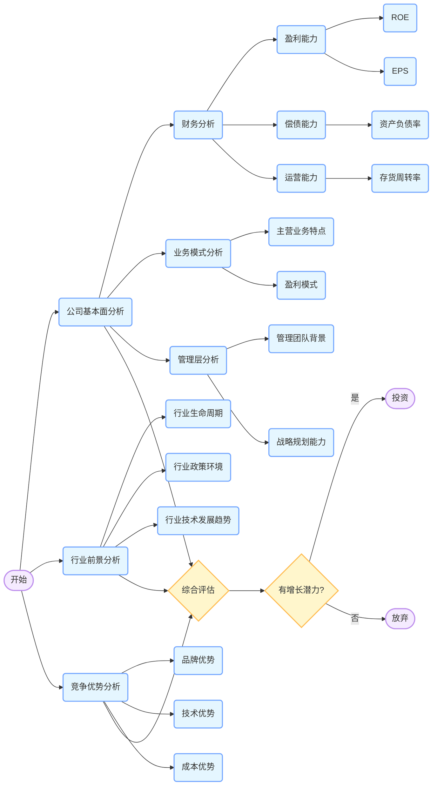

# 彼得林奇的“未来增长潜力”分析法

> 关键词：彼得林奇、未来增长潜力分析法、股票投资、财务分析、行业研究

> 摘要：本文深入探讨了彼得林奇的“未来增长潜力”分析法。彼得林奇作为投资界的传奇人物，其投资理念和方法影响深远。“未来增长潜力”分析法旨在通过对公司多方面的评估，挖掘具有高增长潜力的股票。文章详细介绍了该方法的背景，包括目的、预期读者等内容；阐述了核心概念与联系，用示意图和流程图展示其架构；深入讲解了核心算法原理和具体操作步骤，并结合 Python 代码；给出了相关数学模型和公式及实例；通过项目实战展示代码实现和解读；探讨了实际应用场景；推荐了学习该方法的工具和资源；最后总结了未来发展趋势与挑战，并对常见问题进行解答，为投资者运用该方法提供全面的指导。

## 1. 背景介绍 
### 1.1 目的和范围
彼得林奇的“未来增长潜力”分析法的目的在于帮助投资者识别那些在未来具有显著增长可能性的公司，从而在股票市场中做出更明智的投资决策。该方法不仅仅关注公司当前的财务状况，更侧重于对公司未来发展潜力的评估。其范围涵盖了对公司内部因素（如财务指标、管理层能力等）和外部因素（如行业趋势、市场竞争等）的综合分析，以预测公司在未来一段时间内的业绩增长情况。

### 1.2 预期读者
本文的预期读者主要包括股票投资者、金融分析师、投资顾问以及对价值投资和成长型投资感兴趣的人士。无论是专业的投资从业者还是业余的股票爱好者，都可以从彼得林奇的“未来增长潜力”分析法中获取有价值的信息，提升自己的投资分析能力。

### 1.3 文档结构概述
本文将按照以下结构进行阐述：首先介绍核心概念与联系，通过示意图和流程图清晰展示该分析法的架构；接着详细讲解核心算法原理和具体操作步骤，并辅以 Python 代码示例；然后给出相关的数学模型和公式，并举例说明其应用；之后通过项目实战，展示代码的实际案例和详细解释；再探讨该分析法在实际投资中的应用场景；推荐学习该方法所需的工具和资源；最后总结未来发展趋势与挑战，解答常见问题，并提供扩展阅读和参考资料。

### 1.4 术语表
#### 1.4.1 核心术语定义
- **未来增长潜力**：指公司在未来一段时间内，通过自身的业务发展、市场拓展、技术创新等因素，实现业绩（如营业收入、净利润等）持续增长的可能性和能力。
- **PEG 比率**：即市盈率相对盈利增长比率，是用公司的市盈率除以盈利增长率得出的数值，用于评估股票的估值是否合理，同时考虑了公司的盈利增长情况。
- **现金流**：指企业在一定会计期间按照现金收付实现制，通过一定经济活动（包括经营活动、投资活动、筹资活动和非经常性项目）而产生的现金流入、现金流出及其总量情况的总称。
- **ROE（净资产收益率）**：是净利润与平均股东权益的百分比，反映股东权益的收益水平，用以衡量公司运用自有资本的效率。

#### 1.4.2 相关概念解释
- **成长型公司**：是指那些具有良好的发展前景，业务不断扩张，市场份额逐步增加，盈利持续增长的公司。这类公司通常会将大部分利润用于再投资，以支持公司的进一步发展。
- **价值型公司**：是指那些股价相对其内在价值被低估的公司。这类公司可能具有稳定的现金流、较高的股息率，但由于市场对其关注不足或短期业绩不佳等原因，股价未能充分反映其真实价值。
- **行业生命周期**：包括初创期、成长期、成熟期和衰退期四个阶段。不同阶段的行业具有不同的特点和发展趋势，对公司的未来增长潜力也会产生重要影响。

#### 1.4.3 缩略词列表
- **PEG**：Price/Earnings to Growth Ratio（市盈率相对盈利增长比率）
- **ROE**：Return on Equity（净资产收益率）
- **EPS**：Earnings Per Share（每股收益）

## 2. 核心概念与联系 

### 核心概念原理
彼得林奇的“未来增长潜力”分析法的核心原理是通过对公司多个维度的综合分析，评估其在未来实现业绩增长的可能性和幅度。该方法主要考虑以下几个方面：
1. **公司基本面**：包括公司的财务状况、业务模式、管理层能力等。财务状况良好的公司通常具有更强的抗风险能力和发展潜力；独特的业务模式可以使公司在市场竞争中脱颖而出；优秀的管理层能够制定合理的发展战略，带领公司实现增长目标。
2. **行业前景**：行业的发展趋势对公司的未来增长至关重要。处于上升期的行业，其内部的公司往往具有更多的发展机会；而处于衰退期的行业，公司面临的挑战则相对较大。
3. **竞争优势**：公司是否具有独特的竞争优势，如品牌优势、技术优势、成本优势等，决定了其在市场中的地位和盈利能力。具有竞争优势的公司能够在市场竞争中获得更多的份额，从而实现业绩增长。

### 架构的文本示意图
```plaintext
未来增长潜力分析法
|-- 公司基本面分析
|   |-- 财务分析
|   |   |-- 盈利能力（ROE、EPS 等）
|   |   |-- 偿债能力（资产负债率等）
|   |   |-- 运营能力（存货周转率等）
|   |-- 业务模式分析
|   |   |-- 主营业务特点
|   |   |-- 盈利模式
|   |-- 管理层分析
|       |-- 管理团队背景
|       |-- 战略规划能力
|-- 行业前景分析
|   |-- 行业生命周期
|   |-- 行业政策环境
|   |-- 行业技术发展趋势
|-- 竞争优势分析
|   |-- 品牌优势
|   |-- 技术优势
|   |-- 成本优势
```

### Mermaid 流程图


## 3. 核心算法原理 & 具体操作步骤 

### 核心算法原理
彼得林奇的“未来增长潜力”分析法虽然没有严格意义上的单一算法，但可以通过一些关键指标和比率来辅助评估。其中，PEG 比率是一个重要的指标，其计算公式为：
$PEG = \frac{市盈率}{盈利增长率}$

一般来说，PEG 比率小于 1 表示股票可能被低估，具有较好的投资价值；PEG 比率大于 1 则可能表示股票被高估。此外，还可以结合 ROE、现金流等指标进行综合分析。

### 具体操作步骤
1. **收集数据**：收集公司的财务报表、行业研究报告、市场分析数据等相关信息。
2. **计算关键指标**：根据收集到的数据，计算公司的市盈率、盈利增长率、ROE、现金流等关键指标。
3. **评估公司基本面**：分析公司的财务状况、业务模式和管理层能力，判断公司的基本面是否良好。
4. **研究行业前景**：了解行业的发展趋势、政策环境和技术创新情况，评估行业的发展前景。
5. **分析竞争优势**：确定公司是否具有独特的竞争优势，如品牌、技术、成本等方面的优势。
6. **综合评估**：结合以上分析结果，对公司的未来增长潜力进行综合评估，判断是否值得投资。

### Python 代码实现
```python
import pandas as pd

# 假设已经有一个包含公司财务数据的 DataFrame
data = {
    '市盈率': [20, 30, 15],
    '盈利增长率': [0.2, 0.15, 0.3],
    'ROE': [0.15, 0.12, 0.2],
    '现金流': [1000000, 800000, 1200000]
}
df = pd.DataFrame(data)

# 计算 PEG 比率
df['PEG'] = df['市盈率'] / df['盈利增长率']

# 筛选出 PEG 小于 1 且 ROE 大于 0.15 的公司
selected_companies = df[(df['PEG'] < 1) & (df['ROE'] > 0.15)]

print(selected_companies)
```

## 4. 数学模型和公式 & 详细讲解 & 举例说明 

### 数学模型和公式
1. **PEG 比率**：
$PEG = \frac{市盈率}{盈利增长率}$

市盈率（PE）的计算公式为：
$PE = \frac{股票价格}{每股收益}$

盈利增长率可以通过以下公式计算：
$盈利增长率 = \frac{当前盈利 - 上一期盈利}{上一期盈利}$

2. **ROE（净资产收益率）**：
$ROE = \frac{净利润}{平均股东权益} \times 100\%$

平均股东权益的计算公式为：
$平均股东权益 = \frac{期初股东权益 + 期末股东权益}{2}$

### 详细讲解
- **PEG 比率**：PEG 比率综合考虑了公司的市盈率和盈利增长率。市盈率反映了市场对公司股票的估值水平，而盈利增长率则体现了公司的盈利增长能力。PEG 比率小于 1 表示公司的股票可能被低估，即公司的盈利增长潜力没有被市场充分认识；PEG 比率大于 1 则可能表示股票被高估。
- **ROE（净资产收益率）**：ROE 衡量了公司运用自有资本的效率，反映了股东权益的收益水平。ROE 越高，说明公司利用自有资本创造利润的能力越强。

### 举例说明
假设公司 A 的股票价格为 50 元，每股收益为 2 元，上一期每股收益为 1.8 元，期初股东权益为 1000 万元，期末股东权益为 1200 万元，净利润为 200 万元。

1. **计算市盈率**：
$PE = \frac{50}{2} = 25$

2. **计算盈利增长率**：
$盈利增长率 = \frac{2 - 1.8}{1.8} \approx 0.111$

3. **计算 PEG 比率**：
$PEG = \frac{25}{0.111} \approx 225.23$

4. **计算平均股东权益**：
$平均股东权益 = \frac{1000 + 1200}{2} = 1100$（万元）

5. **计算 ROE**：
$ROE = \frac{200}{1100} \times 100\% \approx 18.18\%$

从计算结果来看，公司 A 的 PEG 比率较高，可能表示股票被高估；而 ROE 为 18.18%，说明公司运用自有资本创造利润的能力较强。

## 5. 项目实战：代码实际案例和详细解释说明 

### 5.1  开发环境搭建
- **Python 环境**：建议使用 Python 3.7 及以上版本。可以从 Python 官方网站（https://www.python.org/downloads/）下载并安装。
- **开发工具**：推荐使用 PyCharm 或 Jupyter Notebook。PyCharm 是一款功能强大的 Python 集成开发环境，适合进行大型项目的开发；Jupyter Notebook 则更适合进行数据分析和代码演示。
- **必要的库**：需要安装 pandas、numpy 等库，用于数据处理和分析。可以使用以下命令进行安装：
```sh
pip install pandas numpy
```

### 5.2  源代码详细实现和代码解读
```python
import pandas as pd
import numpy as np

# 模拟公司财务数据
data = {
    '股票代码': ['000001', '000002', '000003'],
    '股票价格': [20, 30, 40],
    '每股收益': [1, 1.5, 2],
    '上一期每股收益': [0.8, 1.2, 1.8],
    '期初股东权益': [1000, 1500, 2000],
    '期末股东权益': [1200, 1600, 2200],
    '净利润': [200, 300, 400]
}
df = pd.DataFrame(data)

# 计算市盈率
df['市盈率'] = df['股票价格'] / df['每股收益']

# 计算盈利增长率
df['盈利增长率'] = (df['每股收益'] - df['上一期每股收益']) / df['上一期每股收益']

# 计算平均股东权益
df['平均股东权益'] = (df['期初股东权益'] + df['期末股东权益']) / 2

# 计算 ROE
df['ROE'] = df['净利润'] / df['平均股东权益']

# 计算 PEG 比率
df['PEG'] = df['市盈率'] / df['盈利增长率']

# 筛选出 PEG 小于 1 且 ROE 大于 0.15 的公司
selected_companies = df[(df['PEG'] < 1) & (df['ROE'] > 0.15)]

print(selected_companies)
```

### 代码解读与分析
1. **数据模拟**：使用字典 `data` 模拟了三家公司的财务数据，并将其转换为 Pandas 的 DataFrame 对象 `df`。
2. **指标计算**：
    - **市盈率**：通过股票价格除以每股收益计算得出。
    - **盈利增长率**：根据当前每股收益与上一期每股收益的差值除以上一期每股收益计算得出。
    - **平均股东权益**：由期初股东权益和期末股东权益的平均值计算得出。
    - **ROE**：净利润除以平均股东权益得到。
    - **PEG 比率**：市盈率除以盈利增长率得到。
3. **筛选公司**：使用布尔索引筛选出 PEG 小于 1 且 ROE 大于 0.15 的公司，并将结果存储在 `selected_companies` 中。
4. **结果输出**：打印筛选出的公司信息。

通过这个代码示例，我们可以看到如何使用 Python 和 Pandas 库对公司的财务数据进行处理和分析，从而筛选出具有潜在投资价值的公司。

## 6. 实际应用场景 
1. **个人股票投资**：个人投资者可以使用彼得林奇的“未来增长潜力”分析法来评估不同公司的股票，选择具有较高增长潜力的股票进行投资。通过对公司基本面、行业前景和竞争优势的分析，投资者可以降低投资风险，提高投资回报率。
2. **基金投资决策**：基金经理在构建投资组合时，可以运用该分析法对候选股票进行筛选和评估。选择具有良好未来增长潜力的股票纳入基金组合，有助于提高基金的业绩表现。
3. **企业战略规划**：企业管理者可以借鉴该分析法的思路，对自身企业的未来增长潜力进行评估。通过分析企业的财务状况、业务模式、竞争优势等方面，制定合理的发展战略，提升企业的竞争力和市场地位。
4. **行业研究与分析**：金融分析师和行业研究员可以使用该分析法对不同行业的公司进行比较和分析。了解行业内公司的未来增长潜力，有助于预测行业的发展趋势，为投资者和企业提供决策参考。

## 7. 工具和资源推荐
### 7.1 学习资源推荐
#### 7.1.1 书籍推荐
- 《彼得林奇的成功投资》：彼得林奇亲自撰写的投资经典著作，详细介绍了他的投资理念、方法和实践经验。
- 《战胜华尔街》：也是彼得林奇的重要著作，书中分享了他在富达麦哲伦基金的投资经历和选股策略。
- 《聪明的投资者》：本杰明·格雷厄姆的经典投资书籍，为价值投资奠定了理论基础，对理解公司基本面分析有很大帮助。

#### 7.1.2 在线课程
- Coursera 上的“投资学原理”课程：提供了系统的投资知识和分析方法，包括基本面分析、技术分析等内容。
- 网易云课堂上的“股票投资实战技巧”课程：结合实际案例，讲解股票投资的技巧和方法，适合初学者学习。

#### 7.1.3 技术博客和网站
- 雪球网：国内知名的投资社区，提供了丰富的股票分析文章、投资者交流和公司研究报告。
- 东方财富网：提供全面的金融信息和数据，包括股票行情、财务报表、行业研究等内容。

### 7.2 开发工具框架推荐
#### 7.2.1 IDE和编辑器
- PyCharm：功能强大的 Python 集成开发环境，具有代码编辑、调试、版本控制等功能，适合专业开发者使用。
- Jupyter Notebook：基于网页的交互式开发环境，支持代码、文本、图表等多种元素的展示，适合数据分析师和研究者使用。

#### 7.2.2 调试和性能分析工具
- PDB：Python 自带的调试工具，可以帮助开发者定位代码中的错误和问题。
- cProfile：Python 标准库中的性能分析工具，可以分析代码的运行时间和函数调用情况，帮助优化代码性能。

#### 7.2.3 相关框架和库
- Pandas：用于数据处理和分析的 Python 库，提供了丰富的数据结构和函数，方便进行数据清洗、转换和统计分析。
- NumPy：Python 的科学计算库，提供了高效的数组操作和数学函数，是很多数据分析和机器学习库的基础。

### 7.3 相关论文著作推荐
#### 7.3.1 经典论文
- “The Cross - Section of Expected Stock Returns”（《股票预期收益率的横截面分析》）：Fama 和 French 提出了著名的三因子模型，对股票收益率的影响因素进行了深入研究。
- “Efficient Capital Markets: A Review of Theory and Empirical Work”（《有效资本市场：理论与实证研究综述》）：Fama 对有效市场假说进行了系统阐述，对理解资本市场的效率和定价机制有重要意义。

#### 7.3.2 最新研究成果
- 关注顶级金融学术期刊，如《Journal of Finance》（《金融杂志》）、《Review of Financial Studies》（《金融研究评论》）等，这些期刊会发表关于投资分析和公司财务的最新研究成果。

#### 7.3.3 应用案例分析
- 可以查阅专业的金融研究报告和案例分析书籍，了解彼得林奇的“未来增长潜力”分析法在实际投资中的应用案例，学习如何运用该方法进行投资决策。

## 8. 总结：未来发展趋势与挑战
### 未来发展趋势
1. **数据驱动的分析**：随着信息技术的发展，投资者可以获取更多的公司数据和市场信息。未来，彼得林奇的“未来增长潜力”分析法将更加注重数据的挖掘和分析，利用大数据和人工智能技术，提高分析的准确性和效率。
2. **跨学科融合**：投资分析不再局限于金融领域，未来将与经济学、管理学、统计学等多学科进行深度融合。通过综合运用不同学科的知识和方法，更全面地评估公司的未来增长潜力。
3. **关注新兴行业**：随着科技的不断进步，新兴行业如人工智能、新能源、生物医药等将成为未来经济增长的重要动力。该分析法将更加关注这些新兴行业的公司，挖掘具有高增长潜力的投资机会。

### 挑战
1. **数据质量和可靠性**：数据的质量和可靠性是影响分析结果的关键因素。在实际应用中，可能会遇到数据不准确、不完整或滞后等问题，需要投资者具备较强的数据甄别和处理能力。
2. **市场不确定性**：股票市场受到多种因素的影响，如宏观经济环境、政策变化、突发事件等，具有较高的不确定性。即使通过分析筛选出具有增长潜力的公司，也不能保证其未来业绩一定能够实现增长。
3. **竞争加剧**：随着投资分析方法的普及，越来越多的投资者和机构开始运用类似的方法进行投资决策。这将导致市场竞争加剧，寻找被低估的优质股票变得更加困难。

## 9. 附录：常见问题与解答
### 问题 1：PEG 比率小于 1 就一定值得投资吗？
答：PEG 比率小于 1 只是一个参考指标，不能作为投资决策的唯一依据。PEG 比率只是考虑了市盈率和盈利增长率两个因素，而公司的未来增长潜力还受到很多其他因素的影响，如行业前景、竞争优势、管理层能力等。因此，在使用 PEG 比率进行评估时，还需要结合其他因素进行综合分析。

### 问题 2：如何获取准确的公司财务数据？
答：可以通过以下途径获取准确的公司财务数据：
- 公司官方网站：大多数上市公司会在其官方网站上公布定期报告和财务报表。
- 证券交易所网站：证券交易所会对上市公司的信息披露进行监管，投资者可以在证券交易所网站上查询到公司的财务报告。
- 金融数据提供商：如东方财富、同花顺等金融数据平台，提供了丰富的公司财务数据和分析工具。

### 问题 3：该分析法适用于所有行业的公司吗？
答：彼得林奇的“未来增长潜力”分析法适用于大多数行业的公司，但不同行业的特点和发展规律有所不同，在应用该方法时需要进行适当的调整。例如，对于新兴行业的公司，可能更注重其技术创新能力和市场份额的增长；而对于传统行业的公司，则更关注其财务稳定性和现金流状况。

## 10. 扩展阅读 & 参考资料
- 《金融市场与金融机构》，作者：弗雷德里克·S·米什金，机械工业出版社。
- 《证券分析》，作者：本杰明·格雷厄姆，海南出版社。
- 彼得林奇官方网站：[具体网址]（如果有）
- 雪球网相关讨论帖子：可以在雪球网上搜索“彼得林奇 未来增长潜力分析法”获取相关讨论内容。

作者：AI天才研究院/AI Genius Institute & 禅与计算机程序设计艺术 /Zen And The Art of Computer Programming