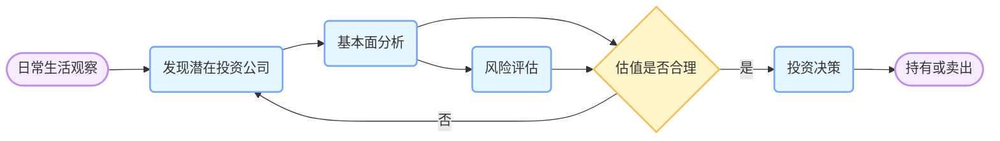

# 彼得林奇的"简单明了"投资哲学解读

> 关键词：彼得林奇、投资哲学、简单明了、股票投资、基本面分析

> 摘要：本文旨在深入解读彼得林奇“简单明了”的投资哲学。通过对彼得林奇投资理念核心概念的剖析，阐述其投资哲学的原理和架构。详细讲解相关核心算法和操作步骤，并以数学模型和公式加以说明。结合实际项目案例，分析其在股票投资中的具体应用。同时探讨该投资哲学的实际应用场景，推荐学习资源、开发工具和相关论文著作。最后总结其未来发展趋势与挑战，解答常见问题并提供扩展阅读和参考资料，帮助投资者更好地理解和运用这一投资哲学。

## 1. 背景介绍 
### 1.1 目的和范围
彼得林奇是投资界的传奇人物，他所管理的富达麦哲伦基金创造了惊人的业绩。本文的目的是全面解读他“简单明了”的投资哲学，深入剖析其核心思想、方法和应用。范围涵盖彼得林奇投资哲学的各个方面，包括选股策略、基本面分析、投资心态等，旨在为投资者提供系统而深入的理解，帮助他们在投资实践中借鉴和运用这些理念。

### 1.2 预期读者
本文预期读者主要包括各类投资者，无论是初入投资领域的新手，还是有一定经验的专业投资者。同时，对金融投资理论和实践感兴趣的学者、研究人员也可以从本文中获得有价值的信息。对于希望了解成功投资哲学和方法的人群，本文也具有一定的参考意义。

### 1.3 文档结构概述
本文将按照以下结构展开：首先介绍彼得林奇投资哲学的核心概念与联系，通过文本示意图和Mermaid流程图直观展示其架构；接着详细讲解核心算法原理和具体操作步骤，结合Python源代码进行说明；然后阐述相关的数学模型和公式，并举例说明；之后通过实际项目案例分析该投资哲学的具体应用；探讨其在不同场景下的实际应用；推荐学习资源、开发工具和相关论文著作；最后总结未来发展趋势与挑战，解答常见问题并提供扩展阅读和参考资料。

### 1.4 术语表
#### 1.4.1 核心术语定义
- **简单明了投资哲学**：彼得林奇倡导的一种投资理念，强调投资者应从日常生活中发现投资机会，关注公司的基本面，采用通俗易懂的方法进行投资决策，避免过度复杂的分析和理论。
- **基本面分析**：通过研究公司的财务状况、经营业绩、行业地位等基本因素，评估公司的内在价值和投资潜力。
- **PEG比率**：市盈率相对盈利增长比率，用于衡量股票的估值是否合理，计算公式为市盈率除以盈利增长率。

#### 1.4.2 相关概念解释
- **成长股**：指那些具有良好发展前景、盈利增长速度较快的公司股票。彼得林奇认为投资者应关注成长股，但要注意估值的合理性。
- **困境反转型公司**：处于困境中的公司，通过自身的改革或外部环境的改善，有可能实现业绩的反转。彼得林奇善于发现这类公司的投资机会。
- **消费垄断型企业**：拥有独特品牌、技术或市场地位，能够在市场上形成垄断或准垄断的企业。这类企业通常具有较强的盈利能力和抗风险能力。

#### 1.4.3 缩略词列表
- **PEG**：Price/Earnings to Growth Ratio（市盈率相对盈利增长比率）
- **EPS**：Earnings Per Share（每股收益）

## 2. 核心概念与联系 

### 核心概念原理
彼得林奇“简单明了”投资哲学的核心原理是从日常生活中寻找投资线索。他认为普通投资者可以通过观察身边的消费现象、产品口碑等，发现具有投资价值的公司。例如，如果一家餐厅总是人满为患，其菜品深受消费者喜爱，那么该餐厅所属的餐饮企业可能就具有投资潜力。

同时，他强调基本面分析的重要性。通过研究公司的财务报表、盈利情况、行业竞争等基本面因素，评估公司的内在价值。投资者应该关注公司的长期发展前景，而不是被短期的市场波动所左右。

### 架构的文本示意图
```plaintext
彼得林奇投资哲学
|-- 日常生活观察
|   |-- 消费现象
|   |-- 产品口碑
|-- 基本面分析
|   |-- 财务报表
|   |   |-- 资产负债表
|   |   |-- 利润表
|   |   |-- 现金流量表
|   |-- 盈利情况
|   |   |-- 每股收益
|   |   |-- 盈利增长率
|   |-- 行业竞争
|       |-- 市场份额
|       |-- 竞争优势
|-- 投资决策
|   |-- 估值判断
|   |   |-- PEG比率
|   |   |-- 市盈率
|   |-- 风险评估
|       |-- 行业风险
|       |-- 公司特定风险
```

### Mermaid流程图


## 3. 核心算法原理 & 具体操作步骤 

### 核心算法原理
彼得林奇投资哲学中的一个重要算法是PEG比率的计算和应用。PEG比率是衡量股票估值是否合理的重要指标，其原理是将市盈率与盈利增长率相结合。一般来说，PEG比率小于1表示股票可能被低估，具有投资价值；PEG比率大于1表示股票可能被高估。

### 具体操作步骤
#### 步骤1：收集数据
首先，需要收集目标公司的市盈率（P/E）和盈利增长率（g）数据。市盈率可以通过股票价格除以每股收益得到，盈利增长率可以通过公司过去几年的盈利数据计算得出。

#### 步骤2：计算PEG比率
使用以下Python代码计算PEG比率：
```python
def calculate_peg(pe_ratio, growth_rate):
    """
    计算PEG比率
    :param pe_ratio: 市盈率
    :param growth_rate: 盈利增长率
    :return: PEG比率
    """
    if growth_rate == 0:
        return float('inf')
    return pe_ratio / growth_rate

# 示例数据
pe_ratio = 20
growth_rate = 0.2

peg = calculate_peg(pe_ratio, growth_rate)
print(f"PEG比率: {peg}")
```

#### 步骤3：估值判断
根据计算得到的PEG比率进行估值判断。如果PEG比率小于1，说明股票可能被低估，可以进一步考虑投资；如果PEG比率大于1，说明股票可能被高估，需要谨慎投资。

#### 步骤4：综合分析
除了PEG比率，还需要综合考虑其他因素，如公司的基本面、行业前景、市场环境等。不能仅仅根据PEG比率来做出投资决策。

## 4. 数学模型和公式 & 详细讲解 & 举例说明 

### 数学模型和公式
#### PEG比率公式
$$PEG = \frac{P/E}{g}$$
其中，$PEG$ 表示市盈率相对盈利增长比率，$P/E$ 表示市盈率，$g$ 表示盈利增长率。

### 详细讲解
PEG比率的核心思想是将股票的估值与公司的盈利增长情况相结合。市盈率反映了市场对公司当前盈利的估值，而盈利增长率反映了公司未来的盈利增长潜力。通过将两者相除，可以更全面地评估股票的投资价值。

例如，如果一家公司的市盈率为20，盈利增长率为20%，则其PEG比率为：
$$PEG = \frac{20}{20\%} = 1$$
这意味着该股票的估值与盈利增长情况相匹配。如果PEG比率小于1，说明股票的估值相对较低，具有较好的投资价值；如果PEG比率大于1，说明股票的估值相对较高，投资风险较大。

### 举例说明
假设公司A的股票价格为50元，每股收益为2元，则其市盈率为：
$$P/E = \frac{50}{2} = 25$$
公司A过去几年的盈利增长率为30%，则其PEG比率为：
$$PEG = \frac{25}{30\%} \approx 0.83$$
由于PEG比率小于1，说明公司A的股票可能被低估，具有一定的投资价值。

再假设公司B的股票价格为30元，每股收益为1元，则其市盈率为：
$$P/E = \frac{30}{1} = 30$$
公司B过去几年的盈利增长率为10%，则其PEG比率为：
$$PEG = \frac{30}{10\%} = 3$$
由于PEG比率大于1，说明公司B的股票可能被高估，投资风险较大。

## 5. 项目实战：代码实际案例和详细解释说明 

### 5.1  开发环境搭建
#### 操作系统
可以选择Windows、Linux或macOS等常见的操作系统。

#### 编程语言
使用Python作为开发语言，Python具有丰富的数据分析和金融库，适合进行投资分析。

#### 安装必要的库
使用以下命令安装必要的Python库：
```sh
pip install pandas numpy yfinance matplotlib
```
- `pandas`：用于数据处理和分析。
- `numpy`：用于数值计算。
- `yfinance`：用于获取股票数据。
- `matplotlib`：用于数据可视化。

### 5.2  源代码详细实现和代码解读
```python
import yfinance as yf
import pandas as pd
import matplotlib.pyplot as plt

# 定义股票代码和时间范围
ticker = 'AAPL'
start_date = '2010-01-01'
end_date = '2023-12-31'

# 获取股票数据
data = yf.download(ticker, start=start_date, end=end_date)

# 计算每股收益（假设已知）
eps = 5.0

# 计算市盈率
pe_ratio = data['Close'] / eps

# 假设盈利增长率为15%
growth_rate = 0.15

# 计算PEG比率
peg = pe_ratio / growth_rate

# 可视化PEG比率
plt.figure(figsize=(12, 6))
plt.plot(peg, label='PEG Ratio')
plt.title(f'{ticker} PEG Ratio')
plt.xlabel('Date')
plt.ylabel('PEG Ratio')
plt.legend()
plt.show()
```
### 代码解读与分析
1. **数据获取**：使用`yfinance`库从雅虎财经获取指定股票（这里是苹果公司，股票代码为`AAPL`）在指定时间范围内的历史数据。
2. **计算市盈率**：假设已知每股收益`eps`，通过股票收盘价除以每股收益计算市盈率。
3. **计算PEG比率**：将计算得到的市盈率除以盈利增长率，得到PEG比率。
4. **可视化**：使用`matplotlib`库将PEG比率随时间的变化进行可视化展示，方便投资者观察和分析。

通过对PEG比率的分析，投资者可以判断股票的估值情况，从而做出合理的投资决策。

## 6. 实际应用场景 
### 个人投资者
对于个人投资者来说，彼得林奇的投资哲学非常实用。个人投资者可以从日常生活中发现投资机会，例如关注自己喜欢的品牌、经常使用的产品等。通过简单的基本面分析和估值判断，选择具有投资价值的股票进行投资。同时，个人投资者可以利用PEG比率等指标，避免投资被高估的股票，降低投资风险。

### 基金经理
基金经理在进行投资决策时，也可以借鉴彼得林奇的投资哲学。他们可以通过对不同行业和公司的深入研究，结合日常生活中的观察，发现具有潜力的投资标的。在构建投资组合时，考虑公司的基本面和估值情况，合理配置资产，提高投资组合的收益和风险控制能力。

### 企业战略投资
企业在进行战略投资时，也可以运用彼得林奇的投资哲学。企业可以关注行业内的竞争对手和潜在合作伙伴，通过对其基本面的分析，评估其投资价值和合作潜力。在进行并购或投资时，考虑目标公司的长期发展前景和估值合理性，避免盲目投资。

## 7. 工具和资源推荐
### 7.1 学习资源推荐
#### 7.1.1 书籍推荐
- 《彼得林奇的成功投资》：彼得林奇的经典著作，详细阐述了他的投资理念和方法，是投资者必读的书籍之一。
- 《战胜华尔街》：进一步介绍了彼得林奇的投资策略和实战经验，对投资者具有很高的参考价值。
- 《聪明的投资者》：本杰明·格雷厄姆的经典著作，强调了价值投资的重要性，与彼得林奇的投资哲学有一定的相通之处。

#### 7.1.2 在线课程
- Coursera上的“投资学原理”：由知名教授授课，系统介绍投资学的基本原理和方法，包括基本面分析、估值模型等内容。
- Udemy上的“股票投资实战课程”：通过实际案例讲解股票投资的技巧和策略，适合初学者和有一定经验的投资者。

#### 7.1.3 技术博客和网站
- 雪球网：国内知名的投资社区，提供股票分析、投资策略分享等内容，投资者可以在这里交流和学习。
- Seeking Alpha：国外的投资研究网站，提供专业的股票分析和投资建议，适合有一定英语基础的投资者。

### 7.2 开发工具框架推荐
#### 7.2.1 IDE和编辑器
- PyCharm：专业的Python集成开发环境，具有强大的代码编辑、调试和分析功能，适合Python开发者。
- Jupyter Notebook：交互式的开发环境，方便进行数据探索和分析，适合进行投资数据分析和可视化。

#### 7.2.2 调试和性能分析工具
- Py-Spy：用于分析Python程序的性能瓶颈，帮助开发者优化代码。
- PDB：Python自带的调试工具，用于调试Python程序中的错误。

#### 7.2.3 相关框架和库
- Pandas：用于数据处理和分析，提供了丰富的数据结构和函数，方便进行金融数据的处理和分析。
- Numpy：用于数值计算，提供了高效的数组和矩阵运算功能，是金融数据分析的基础库。
- Scikit-learn：用于机器学习和数据分析，提供了多种机器学习算法和工具，可用于投资模型的构建和预测。

### 7.3 相关论文著作推荐
#### 7.3.1 经典论文
- 《有效市场假说》：由尤金·法玛提出，阐述了市场有效性的概念和分类，对投资理论和实践产生了深远影响。
- 《资本资产定价模型》：由威廉·夏普等人提出，用于描述资产的预期收益率与风险之间的关系，是现代投资组合理论的重要基础。

#### 7.3.2 最新研究成果
- 关于PEG比率在不同市场环境下的有效性研究：探讨PEG比率在不同行业、不同市场周期中的应用效果和局限性。
- 基于机器学习的投资策略研究：利用机器学习算法构建投资模型，提高投资决策的准确性和效率。

#### 7.3.3 应用案例分析
- 彼得林奇投资案例分析：深入分析彼得林奇在不同时期的投资决策和操作，总结其成功经验和教训。
- 国内企业运用彼得林奇投资哲学的案例分析：研究国内企业在投资和战略决策中借鉴彼得林奇投资哲学的实践效果和启示。

## 8. 总结：未来发展趋势与挑战
### 未来发展趋势
- **数字化和智能化**：随着科技的不断发展，投资领域将越来越数字化和智能化。投资者可以利用大数据、人工智能等技术，更高效地获取和分析信息，做出更准确的投资决策。彼得林奇的投资哲学也可以与这些新技术相结合，提高投资分析的效率和准确性。
- **多元化投资**：未来投资者将更加注重多元化投资，不仅投资于股票，还会涉足债券、基金、房地产等多种资产类别。彼得林奇的投资哲学可以为投资者提供一种通用的分析方法，帮助他们在不同资产类别中寻找投资机会。
- **社会责任投资**：越来越多的投资者开始关注企业的社会责任和可持续发展。彼得林奇的投资哲学可以引导投资者关注那些具有良好社会形象和可持续发展能力的企业，实现经济效益和社会效益的双赢。

### 挑战
- **市场复杂性增加**：随着全球经济的发展和金融市场的全球化，市场的复杂性不断增加。投资者需要面对更多的不确定性和风险，如宏观经济波动、政策变化、国际形势等。如何在复杂的市场环境中运用彼得林奇的投资哲学，做出正确的投资决策，是投资者面临的一大挑战。
- **信息过载**：互联网的发展使得信息传播速度加快，投资者可以获取的信息越来越多。然而，信息过载也给投资者带来了困扰，如何筛选和分析有价值的信息，避免被虚假信息和噪音干扰，是投资者需要解决的问题。
- **竞争加剧**：随着投资市场的发展，越来越多的投资者和机构进入市场，竞争日益激烈。投资者需要不断提升自己的投资能力和水平，才能在竞争中脱颖而出。如何运用彼得林奇的投资哲学，形成自己的投资风格和优势，是投资者面临的挑战之一。

## 9. 附录：常见问题与解答
### 问题1：PEG比率是否适用于所有行业？
解答：PEG比率并不是适用于所有行业。一些新兴行业，如科技行业，由于其盈利增长速度较快，PEG比率可能会较高，但这并不一定意味着这些股票被高估。相反，一些传统行业，如公用事业行业，由于其盈利增长相对稳定，PEG比率可能会较低，但这也不意味着这些股票就具有投资价值。因此，在使用PEG比率时，需要结合行业特点和公司的具体情况进行综合分析。

### 问题2：如何准确计算盈利增长率？
解答：盈利增长率可以通过公司过去几年的盈利数据计算得出。一种常见的方法是计算复合年均增长率（CAGR），公式为：
$$CAGR = (\frac{Ending\ Value}{Beginning\ Value})^{\frac{1}{n}} - 1$$
其中，$Ending\ Value$ 表示期末盈利，$Beginning\ Value$ 表示期初盈利，$n$ 表示计算期间的年数。需要注意的是，盈利增长率的计算可能会受到多种因素的影响，如会计政策变更、一次性收益或损失等，因此在计算时需要对数据进行适当的调整。

### 问题3：彼得林奇的投资哲学是否适合短期投资？
解答：彼得林奇的投资哲学更侧重于长期投资。他认为投资者应该关注公司的长期发展前景，通过基本面分析选择具有投资价值的股票，并长期持有。短期投资往往受到市场情绪和短期波动的影响，难以准确判断公司的内在价值。因此，彼得林奇的投资哲学不太适合短期投资，但投资者可以根据自己的投资目标和风险承受能力，灵活运用其投资理念。

## 10. 扩展阅读 & 参考资料
### 扩展阅读
- 《金融炼金术》：乔治·索罗斯的著作，介绍了他的反身性理论和投资实践，对投资者有一定的启发。
- 《漫步华尔街》：伯顿·马尔基尔的著作，探讨了市场有效性和投资策略，与彼得林奇的投资哲学有一定的关联。

### 参考资料
- Lynch, Peter. *One Up on Wall Street*. Simon & Schuster, 1989.
- Lynch, Peter. *Beating the Street*. Simon & Schuster, 1993.
- Graham, Benjamin. *The Intelligent Investor*. HarperBusiness, 2003.

作者：AI天才研究院/AI Genius Institute & 禅与计算机程序设计艺术 /Zen And The Art of Computer Programming