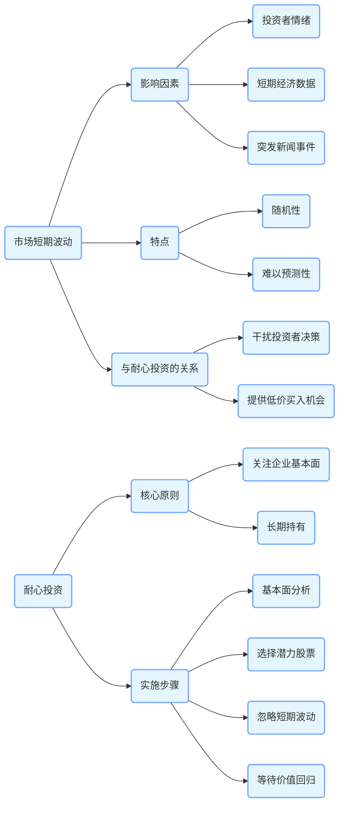

# 彼得林奇的"耐心投资"在市场短期波动中的执行策略

> 关键词：彼得林奇、耐心投资、市场短期波动、执行策略、投资理念

> 摘要：本文深入探讨了彼得林奇的“耐心投资”理念在市场短期波动中的执行策略。通过分析彼得林奇投资理念的背景，阐述了核心概念及联系，详细讲解了相关算法原理、数学模型，结合项目实战给出代码案例及解释，介绍了实际应用场景，推荐了学习工具和资源，最后总结了未来发展趋势与挑战，并对常见问题进行解答。旨在帮助投资者更好地理解和运用“耐心投资”策略应对市场短期波动。

## 1. 背景介绍 
### 1.1 目的和范围
本文的目的是深入剖析彼得林奇的“耐心投资”理念在市场短期波动环境下的具体执行策略。范围涵盖从彼得林奇投资思想的基本原理出发，探讨其如何应用于市场短期波动的场景中，包括策略的理论基础、实际操作方法、数学模型支持以及实际案例分析等多个方面。通过全面的研究，为投资者提供一套系统的应对市场短期波动的投资策略指导。

### 1.2 预期读者
预期读者主要包括对股票投资有兴趣的个人投资者，无论是新手投资者希望了解基本的投资理念和策略，还是有一定经验的投资者寻求优化自己的投资方法。同时，也适合金融专业的学生、研究人员以及从事金融行业的从业者，他们可以从本文中获取关于投资策略的理论和实践知识，为学术研究或实际工作提供参考。

### 1.3 文档结构概述
本文首先介绍背景信息，让读者了解研究的目的、对象和文档的整体结构。接着阐述核心概念与联系，明确“耐心投资”和市场短期波动的定义及相互关系。然后详细讲解核心算法原理和具体操作步骤，并给出相应的 Python 代码示例。之后介绍数学模型和公式，通过具体例子加深理解。再通过项目实战部分展示代码的实际应用和解读。随后说明实际应用场景，让读者了解该策略在现实中的应用方式。接着推荐相关的学习工具和资源，帮助读者进一步深入学习。最后总结未来发展趋势与挑战，解答常见问题，并提供扩展阅读和参考资料。

### 1.4 术语表
#### 1.4.1 核心术语定义
- **耐心投资**：彼得林奇所倡导的一种投资理念，强调投资者要有耐心，长期持有具有潜力的股票，不被市场短期波动所左右，通过企业的长期成长来获取投资收益。
- **市场短期波动**：指在较短时间内（通常为几天到几个月），股票市场价格由于各种因素（如宏观经济数据发布、政策变化、公司短期业绩波动等）而产生的上下变动。

#### 1.4.2 相关概念解释
- **基本面分析**：通过研究公司的财务状况、经营业绩、行业竞争力等基本因素，评估公司的内在价值，以此作为投资决策的依据。彼得林奇的“耐心投资”策略非常注重基本面分析，因为只有了解公司的真实价值，才能在市场短期波动时坚定持有。
- **价值投资**：一种投资策略，强调购买价格低于其内在价值的股票，等待市场发现其价值并实现价格回归。彼得林奇的“耐心投资”与价值投资有一定的关联，都是基于对公司价值的判断，但“耐心投资”更强调投资者的耐心和长期持有。

#### 1.4.3 缩略词列表
- **PE**：市盈率（Price-to-Earnings Ratio），是指股票价格除以每股收益（EPS）的比率，用于衡量股票的估值水平。
- **EPS**：每股收益（Earnings Per Share），是指公司净利润除以发行在外的普通股股数，反映了公司的盈利能力。

## 2. 核心概念与联系 

### 核心概念原理
彼得林奇的“耐心投资”理念基于对企业基本面的深入研究和对市场短期波动本质的认识。他认为，市场短期波动是由众多因素引起的，包括投资者情绪、短期经济数据变化、突发新闻事件等，这些因素往往是随机的、难以预测的。而企业的内在价值是由其长期的经营业绩、竞争优势和行业地位等基本面因素决定的，具有相对稳定性。

投资者应该关注企业的基本面，寻找那些具有良好发展前景但暂时被市场低估的股票。一旦发现这样的股票，就应该有耐心地长期持有，忽略市场的短期波动。因为从长期来看，企业的内在价值会逐渐在股票价格中得到体现，投资者可以通过分享企业的成长获得丰厚的回报。

### 架构的文本示意图
```plaintext
市场短期波动
|
|-- 影响因素
|   |-- 投资者情绪
|   |-- 短期经济数据
|   |-- 突发新闻事件
|
|-- 特点
|   |-- 随机性
|   |-- 难以预测性
|
|-- 与耐心投资的关系
|   |-- 干扰投资者决策
|   |-- 提供低价买入机会
|
耐心投资
|
|-- 核心原则
|   |-- 关注企业基本面
|   |-- 长期持有
|
|-- 实施步骤
|   |-- 基本面分析
|   |-- 选择潜力股票
|   |-- 忽略短期波动
|   |-- 等待价值回归
```

### Mermaid 流程图


## 3. 核心算法原理 & 具体操作步骤 

### 核心算法原理
在彼得林奇的“耐心投资”策略中，核心算法原理主要围绕对企业基本面的评估和对股票估值的判断。以下是一个简化的基于市盈率（PE）和每股收益（EPS）的算法原理示例，用于筛选具有投资价值的股票。

假设我们有一个股票列表，我们的目标是筛选出那些市盈率低于行业平均水平且每股收益具有增长潜力的股票。

```python
import pandas as pd

def screen_stocks(stocks_data, industry_avg_pe):
    """
    筛选具有投资价值的股票
    :param stocks_data: 包含股票信息的 DataFrame，列包括 'PE', 'EPS_growth'
    :param industry_avg_pe: 行业平均市盈率
    :return: 筛选后的股票 DataFrame
    """
    # 筛选出市盈率低于行业平均水平且每股收益增长为正的股票
    selected_stocks = stocks_data[(stocks_data['PE'] < industry_avg_pe) & (stocks_data['EPS_growth'] > 0)]
    return selected_stocks

# 示例数据
data = {
    'Stock': ['A', 'B', 'C', 'D'],
    'PE': [15, 20, 12, 25],
    'EPS_growth': [0.1, -0.05, 0.15, 0.08]
}
stocks_df = pd.DataFrame(data)
industry_avg_pe = 18

# 筛选股票
selected = screen_stocks(stocks_df, industry_avg_pe)
print(selected)
```

### 具体操作步骤
1. **数据收集**：收集股票的相关信息，包括市盈率（PE）、每股收益（EPS）及其增长率（EPS_growth）等。这些数据可以从金融数据提供商、证券交易所网站或专业的金融分析软件中获取。
2. **计算行业平均市盈率**：确定目标股票所在行业的平均市盈率。可以通过统计行业内所有上市公司的市盈率并求平均值得到。
3. **筛选股票**：使用上述算法，筛选出市盈率低于行业平均水平且每股收益具有增长潜力的股票。
4. **基本面分析**：对筛选出的股票进行更深入的基本面分析，包括研究公司的财务报表、行业竞争力、管理层能力等，以确定其是否真正具有投资价值。
5. **买入并持有**：选择具有投资价值的股票进行买入，并耐心持有，忽略市场的短期波动。定期对投资组合进行评估和调整，确保其仍然符合投资策略。

## 4. 数学模型和公式 & 详细讲解 & 举例说明 

### 数学模型和公式
在“耐心投资”策略中，常用的数学模型和公式主要用于评估股票的估值和企业的盈利能力。以下是一些常见的公式：

- **市盈率（PE）**：
$$PE = \frac{P}{EPS}$$
其中，$P$ 是股票价格，$EPS$ 是每股收益。市盈率反映了投资者为获取每一元收益所愿意支付的价格，是衡量股票估值水平的重要指标。

- **市净率（PB）**：
$$PB = \frac{P}{BVPS}$$
其中，$P$ 是股票价格，$BVPS$ 是每股净资产。市净率用于衡量股票价格相对于每股净资产的倍数，反映了股票的估值是否合理。

- **股息率（Dividend Yield）**：
$$Dividend\ Yield = \frac{D}{P}$$
其中，$D$ 是每股股息，$P$ 是股票价格。股息率反映了投资者从股票股息中获得的收益率。

### 详细讲解
- **市盈率（PE）**：市盈率是最常用的估值指标之一。一般来说，较低的市盈率意味着股票可能被低估，具有投资价值；而较高的市盈率可能表示股票被高估，存在投资风险。但需要注意的是，不同行业的市盈率水平可能存在较大差异，因此在使用市盈率进行估值时，需要与同行业的其他股票进行比较。
- **市净率（PB）**：市净率主要用于评估公司的净资产价值。当市净率小于 1 时，说明股票价格低于每股净资产，可能存在投资机会；但也需要考虑公司的资产质量和盈利能力等因素。
- **股息率（Dividend Yield）**：股息率反映了股票的分红情况。对于一些追求稳定收益的投资者来说，较高的股息率是一个重要的考虑因素。但股息率也受到公司盈利状况和分红政策的影响，需要综合考虑。

### 举例说明
假设某股票的价格为 $50$ 元，每股收益为 $2$ 元，每股净资产为 $10$ 元，每股股息为 $1$ 元。则该股票的市盈率、市净率和股息率分别为：

- 市盈率：
$$PE = \frac{50}{2} = 25$$

- 市净率：
$$PB = \frac{50}{10} = 5$$

- 股息率：
$$Dividend\ Yield = \frac{1}{50} = 0.02 = 2\%$$

如果该行业的平均市盈率为 20，平均市净率为 3，平均股息率为 3%，则从这些指标来看，该股票的市盈率和市净率高于行业平均水平，股息率低于行业平均水平，可能被认为是相对高估的股票。

## 5. 项目实战：代码实际案例和详细解释说明 

### 5.1  开发环境搭建
- **操作系统**：可以选择 Windows、Linux 或 macOS 操作系统。
- **Python 版本**：建议使用 Python 3.7 及以上版本。
- **开发工具**：可以使用 PyCharm、Jupyter Notebook 等集成开发环境（IDE）。
- **安装必要的库**：使用以下命令安装所需的 Python 库：
```sh
pip install pandas yfinance matplotlib
```
其中，`pandas` 用于数据处理和分析，`yfinance` 用于获取股票数据，`matplotlib` 用于数据可视化。

### 5.2  源代码详细实现和代码解读
以下是一个完整的 Python 代码示例，用于实现彼得林奇的“耐心投资”策略在市场短期波动中的应用。

```python
import yfinance as yf
import pandas as pd
import matplotlib.pyplot as plt

# 定义股票代码和时间范围
stock_symbol = 'AAPL'
start_date = '2020-01-01'
end_date = '2023-01-01'

# 获取股票数据
stock_data = yf.download(stock_symbol, start=start_date, end=end_date)

# 计算简单移动平均线（SMA）作为基本面参考
stock_data['SMA_50'] = stock_data['Close'].rolling(window=50).mean()
stock_data['SMA_200'] = stock_data['Close'].rolling(window=200).mean()

# 筛选出短期波动期间的数据
short_term_fluctuations = stock_data[(stock_data['Close'] < stock_data['SMA_50']) & (stock_data['Close'] > stock_data['SMA_200'])]

# 可视化股票价格和移动平均线
plt.figure(figsize=(12, 6))
plt.plot(stock_data['Close'], label='Close Price')
plt.plot(stock_data['SMA_50'], label='SMA 50')
plt.plot(stock_data['SMA_200'], label='SMA 200')
plt.scatter(short_term_fluctuations.index, short_term_fluctuations['Close'], color='red', label='Short Term Fluctuations')
plt.title(f'{stock_symbol} Stock Price with Short Term Fluctuations')
plt.xlabel('Date')
plt.ylabel('Price')
plt.legend()
plt.show()

# 模拟耐心投资策略
initial_investment = 10000
num_shares = initial_investment / stock_data['Close'].iloc[0]
final_value = num_shares * stock_data['Close'].iloc[-1]
print(f'Initial Investment: ${initial_investment}')
print(f'Final Value: ${final_value:.2f}')
print(f'Return on Investment: {((final_value - initial_investment) / initial_investment) * 100:.2f}%')
```

### 代码解读与分析
1. **数据获取**：使用 `yfinance` 库从雅虎财经获取指定股票（这里以苹果公司为例）在指定时间范围内的历史数据。
2. **计算移动平均线**：计算 50 日和 200 日的简单移动平均线（SMA），作为基本面的参考指标。移动平均线可以平滑股价的短期波动，反映股票的长期趋势。
3. **筛选短期波动数据**：筛选出股价低于 50 日移动平均线但高于 200 日移动平均线的时间段，作为短期波动期间的数据。
4. **数据可视化**：使用 `matplotlib` 库将股票价格、移动平均线和短期波动数据可视化，直观展示股票价格的走势和短期波动情况。
5. **模拟耐心投资策略**：假设初始投资为 10000 美元，计算可以购买的股票数量，并根据最后一天的股价计算最终投资价值和投资回报率。通过这个模拟，可以看到耐心投资策略在长期投资中的效果。

## 6. 实际应用场景 
### 个人投资者
对于个人投资者来说，彼得林奇的“耐心投资”策略在市场短期波动中具有重要的应用价值。个人投资者往往缺乏专业的投资知识和经验，容易受到市场情绪的影响。在市场短期波动时，投资者可能会因为恐慌而卖出股票，错过长期投资的机会。

采用“耐心投资”策略，个人投资者可以通过基本面分析选择具有潜力的股票，然后耐心持有，忽略市场的短期波动。例如，在 2020 年新冠疫情引发的市场暴跌中，许多优质股票的价格大幅下跌，但那些坚持“耐心投资”的投资者在市场反弹后获得了丰厚的回报。

### 机构投资者
机构投资者管理着大量的资金，需要在市场波动中保持稳定的投资回报。彼得林奇的“耐心投资”策略可以帮助机构投资者避免频繁交易带来的成本和风险。

机构投资者可以通过深入的基本面研究和分析，构建多元化的投资组合，并在市场短期波动时坚守投资策略。例如，一些养老基金和保险公司采用长期投资策略，投资于具有稳定现金流和良好业绩的公司股票，以实现资产的保值增值。

### 金融顾问
金融顾问在为客户提供投资建议时，可以引入彼得林奇的“耐心投资”理念。金融顾问可以帮助客户了解市场短期波动的本质，引导客户关注企业的基本面，避免客户因短期市场波动而做出错误的投资决策。

例如，金融顾问可以根据客户的风险承受能力和投资目标，为客户选择适合的股票，并建议客户长期持有。同时，金融顾问可以定期与客户沟通，帮助客户调整投资组合，确保投资策略的有效性。

## 7. 工具和资源推荐
### 7.1 学习资源推荐
#### 7.1.1 书籍推荐
- 《彼得·林奇的成功投资》（*One Up On Wall Street*）：彼得·林奇的经典著作，详细介绍了他的投资理念和方法，包括如何选择股票、如何进行基本面分析等。
- 《战胜华尔街》（*Beating the Street*）：彼得·林奇的另一本重要著作，分享了他在富达麦哲伦基金的投资经验和案例，对投资者有很大的启发。
- 《聪明的投资者》（*The Intelligent Investor*）：本杰明·格雷厄姆的经典投资书籍，强调了价值投资的重要性，是学习投资的必读之作。

#### 7.1.2 在线课程
- Coursera 上的“投资学原理”（*Principles of Investing*）课程：由知名教授授课，系统介绍了投资的基本原理和方法，包括股票投资、债券投资等。
- Udemy 上的“股票投资实战课程”（*Stock Investing for Beginners*）：适合初学者的课程，通过实际案例讲解股票投资的技巧和策略。

#### 7.1.3 技术博客和网站
- Seeking Alpha：一个专业的金融分析网站，提供大量的股票分析报告和投资建议，适合有一定投资基础的投资者。
- 雪球：国内知名的投资社区，投资者可以在上面交流投资经验、分享研究成果，了解市场动态。

### 7.2 开发工具框架推荐
#### 7.2.1 IDE和编辑器
- PyCharm：一款专业的 Python 集成开发环境，提供丰富的代码编辑、调试和分析功能，适合开发复杂的投资分析程序。
- Jupyter Notebook：一个交互式的开发环境，支持 Python、R 等多种编程语言，方便进行数据探索和可视化分析。

#### 7.2.2 调试和性能分析工具
- PDB：Python 自带的调试工具，可以帮助开发者定位代码中的问题。
- cProfile：Python 的性能分析工具，可以分析代码的运行时间和资源消耗情况，帮助优化代码性能。

#### 7.2.3 相关框架和库
- Pandas：一个强大的数据处理和分析库，提供了丰富的数据结构和函数，方便进行股票数据的处理和分析。
- Numpy：一个用于科学计算的 Python 库，提供了高效的数组操作和数学函数，是数据分析和机器学习的基础库。
- Matplotlib：一个用于数据可视化的 Python 库，可以绘制各种类型的图表，帮助投资者直观地展示股票数据和分析结果。

### 7.3 相关论文著作推荐
#### 7.3.1 经典论文
- Fama, E. F., & French, K. R. (1992). The cross-section of expected stock returns. *The Journal of Finance*, 47(2), 427-465. 该论文提出了著名的 Fama-French 三因子模型，对股票收益率的影响因素进行了深入研究。
- Markowitz, H. M. (1952). Portfolio selection. *The Journal of Finance*, 7(1), 77-91. 该论文奠定了现代投资组合理论的基础，提出了通过分散投资降低风险的方法。

#### 7.3.2 最新研究成果
- Pastor, L., & Stambaugh, R. F. (2012). Investing for the long run when returns are predictable. *Journal of Financial Economics*, 104(1), 129-149. 该研究探讨了在可预测的市场环境下长期投资的策略和效果。
- Barberis, N., & Huang, M. (2001). Mental accounting, loss aversion, and individual stock returns. *The Journal of Finance*, 56(4), 1247-1292. 该论文研究了投资者的心理因素对股票收益率的影响。

#### 7.3.3 应用案例分析
- Damodaran, A. (2012). Applied corporate finance: A user's manual. *John Wiley & Sons*. 该书通过大量的实际案例介绍了公司金融和投资分析的方法和应用。
- Greenwald, B. C., Kahn, J., Sonkin, P. D., & van Biema, M. (2001). Value investing: From Graham to Buffett and beyond. *John Wiley & Sons*. 该书通过分析巴菲特等价值投资者的案例，阐述了价值投资的理念和方法。

## 8. 总结：未来发展趋势与挑战
### 未来发展趋势
- **数字化和智能化**：随着科技的不断发展，投资领域将越来越数字化和智能化。投资者可以利用大数据、人工智能等技术进行更深入的基本面分析和市场预测，提高投资决策的准确性和效率。例如，通过机器学习算法对大量的财务数据和新闻信息进行分析，挖掘潜在的投资机会。
- **可持续投资**：越来越多的投资者开始关注企业的社会责任和可持续发展能力。未来，可持续投资将成为一种重要的投资趋势，投资者将更加倾向于投资那些具有良好环境、社会和治理（ESG）表现的企业。
- **全球化投资**：随着全球经济的一体化，投资者将有更多的机会进行全球化投资。通过投资不同国家和地区的股票和资产，可以实现投资组合的多元化，降低风险。

### 挑战
- **市场不确定性增加**：未来市场的不确定性可能会增加，包括宏观经济环境的变化、政策调整、地缘政治风险等。这些因素将导致市场短期波动更加频繁和剧烈，给投资者带来更大的挑战。投资者需要更加灵活地调整投资策略，应对市场的变化。
- **信息过载**：随着互联网和社交媒体的发展，投资者面临着大量的信息。如何从海量的信息中筛选出有价值的信息，避免被虚假信息和噪音干扰，是投资者需要解决的一个重要问题。
- **技术风险**：数字化和智能化投资虽然带来了很多便利和机会，但也存在一定的技术风险。例如，数据泄露、算法错误等问题可能会导致投资者的损失。投资者需要加强对技术风险的认识和管理，确保投资安全。

## 9. 附录：常见问题与解答
### 问题 1：如何判断股票是否被低估？
答：可以通过多种指标来判断股票是否被低估，如市盈率（PE）、市净率（PB）、股息率等。一般来说，较低的市盈率和市净率，较高的股息率可能表示股票被低估。但需要注意的是，不同行业的估值水平可能存在差异，因此需要与同行业的其他股票进行比较。同时，还需要结合公司的基本面情况，如财务状况、经营业绩、行业竞争力等进行综合分析。

### 问题 2：在市场短期波动时，如何保持耐心？
答：首先，要对自己的投资策略有信心，相信自己选择的股票是具有长期投资价值的。其次，要了解市场短期波动的本质，认识到短期波动是市场的正常现象，不要被情绪左右。可以通过定期回顾公司的基本面情况，了解公司的发展动态，增强自己的信心。此外，也可以设定合理的投资目标和止损点，避免过度关注短期市场波动。

### 问题 3：“耐心投资”策略是否适用于所有投资者？
答：“耐心投资”策略并不适用于所有投资者。该策略需要投资者有较强的耐心和长期投资的理念，能够承受市场的短期波动。对于一些短期投资者或风险承受能力较低的投资者来说，可能不太适合采用该策略。投资者应该根据自己的投资目标、风险承受能力和投资经验等因素，选择适合自己的投资策略。

## 10. 扩展阅读 & 参考资料
- Lynch, P., & Rothchild, J. (1989). *One Up On Wall Street*. Simon & Schuster.
- Lynch, P. (1993). *Beating the Street*. Simon & Schuster.
- Graham, B., & Dodd, D. L. (1934). *Security Analysis*. McGraw-Hill.
- Fama, E. F., & French, K. R. (1992). The cross-section of expected stock returns. *The Journal of Finance*, 47(2), 427-465.
- Markowitz, H. M. (1952). Portfolio selection. *The Journal of Finance*, 7(1), 77-91.
- 雪球网站：https://xueqiu.com/
- Seeking Alpha 网站：https://seekingalpha.com/

作者：AI天才研究院/AI Genius Institute & 禅与计算机程序设计艺术 /Zen And The Art of Computer Programming