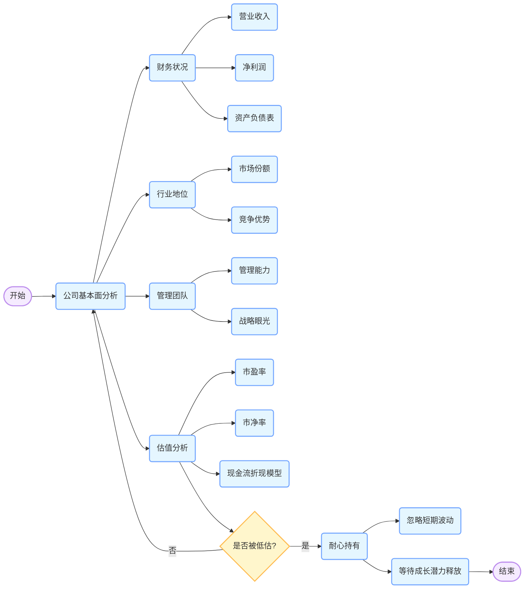

# 彼得林奇的“耐心资本”投资案例

> 关键词：彼得林奇、耐心资本、投资案例、股票投资、价值投资

> 摘要：本文深入探讨了彼得林奇的“耐心资本”投资理念及相关投资案例。首先介绍了彼得林奇投资理念产生的背景，包括目的、预期读者等内容。接着阐述了“耐心资本”的核心概念及其联系，通过流程图展示其投资决策流程。详细讲解了投资决策的核心算法原理和操作步骤，并用Python代码进行示例。给出了相关的数学模型和公式，辅以具体例子说明。通过实际项目案例，展示了如何运用“耐心资本”理念进行投资。分析了该理念在不同场景下的实际应用，推荐了学习相关知识的工具和资源。最后总结了“耐心资本”投资理念的未来发展趋势与挑战，并对常见问题进行了解答，提供了扩展阅读和参考资料。

## 1. 背景介绍 
### 1.1 目的和范围
彼得林奇是投资界的传奇人物，他管理的富达麦哲伦基金在13年间创造了年化收益率29%的惊人业绩。“耐心资本”投资理念是他成功的关键之一。本文的目的是深入剖析彼得林奇的“耐心资本”投资案例，揭示其投资策略的核心要点和操作方法。范围涵盖了该理念的理论基础、实际应用案例、相关数学模型以及对未来投资的启示等方面。

### 1.2 预期读者
本文预期读者包括对股票投资感兴趣的个人投资者、金融专业学生、投资机构从业者以及对价值投资理念有研究需求的人士。希望通过本文的阐述，能帮助读者更好地理解彼得林奇的投资思想，提升投资决策能力。

### 1.3 文档结构概述
本文首先介绍彼得林奇“耐心资本”投资理念产生的背景信息，包括目的、读者群体和文档结构。接着详细阐述“耐心资本”的核心概念和投资决策流程。然后讲解核心算法原理和具体操作步骤，给出相关数学模型和公式。通过实际项目案例展示该理念的应用。分析实际应用场景，推荐学习工具和资源。最后总结未来发展趋势与挑战，解答常见问题并提供扩展阅读和参考资料。

### 1.4 术语表
#### 1.4.1 核心术语定义
- **耐心资本**：指投资者愿意长期持有股票，给予企业足够的时间来实现其成长潜力，不被短期市场波动所影响的投资资金。
- **价值投资**：一种投资策略，通过分析股票的内在价值，寻找被低估的股票进行投资，期望在股票价格回归其内在价值时获得收益。
- **成长股**：指那些具有高成长潜力的公司的股票，通常表现为营业收入和净利润的快速增长。

#### 1.4.2 相关概念解释
- **内在价值**：股票的内在价值是指公司未来现金流的折现价值，它反映了公司的真实价值，不受市场短期波动的影响。
- **安全边际**：指股票的市场价格低于其内在价值的幅度，安全边际越大，投资的风险越低。

#### 1.4.3 缩略词列表
- **PE**：市盈率（Price-to-Earnings Ratio），指股票价格除以每股收益的比率，用于衡量股票的估值水平。
- **PB**：市净率（Price-to-Book Ratio），指股票价格除以每股净资产的比率，反映了股票价格相对于公司净资产的倍数。

## 2. 核心概念与联系 

### 核心概念原理
彼得林奇的“耐心资本”投资理念基于价值投资和成长投资的结合。他认为，投资者应该寻找那些具有成长潜力但目前被市场低估的公司，然后耐心持有这些公司的股票，等待其成长潜力的释放。在这个过程中，投资者需要有足够的耐心，不被短期的市场波动所左右。

### 架构的文本示意图
```plaintext
投资决策
|
|-- 公司基本面分析
|   |-- 财务状况
|   |   |-- 营业收入
|   |   |-- 净利润
|   |   |-- 资产负债表
|   |-- 行业地位
|   |   |-- 市场份额
|   |   |-- 竞争优势
|   |-- 管理团队
|       |-- 管理能力
|       |-- 战略眼光
|
|-- 估值分析
|   |-- 市盈率
|   |-- 市净率
|   |-- 现金流折现模型
|
|-- 耐心持有
|   |-- 忽略短期波动
|   |-- 等待成长潜力释放
```

### Mermaid 流程图


## 3. 核心算法原理 & 具体操作步骤 

### 核心算法原理
彼得林奇的投资决策主要基于对公司基本面和估值的分析。核心算法可以概括为以下几个步骤：
1. **数据收集**：收集公司的财务报表、行业数据、管理团队信息等。
2. **基本面分析**：对公司的财务状况、行业地位、管理团队等进行分析，评估公司的成长潜力。
3. **估值分析**：使用市盈率、市净率、现金流折现模型等方法，评估公司股票的内在价值。
4. **投资决策**：比较股票的市场价格和内在价值，如果市场价格低于内在价值，则认为股票被低估，考虑买入；如果市场价格高于内在价值，则认为股票被高估，考虑卖出。

### 具体操作步骤
1. **数据收集**：可以通过财经网站、公司年报、券商研究报告等渠道收集数据。
2. **基本面分析**：
    - **财务状况分析**：计算营业收入增长率、净利润增长率、资产负债率等指标，评估公司的盈利能力和偿债能力。
    - **行业地位分析**：分析公司的市场份额、竞争优势等，评估公司在行业中的地位。
    - **管理团队分析**：了解管理团队的背景、经验、战略眼光等，评估管理团队的能力。
3. **估值分析**：
    - **市盈率法**：计算公司的市盈率，并与同行业其他公司进行比较，判断公司股票的估值水平。
    - **市净率法**：计算公司的市净率，并与同行业其他公司进行比较，判断公司股票的估值水平。
    - **现金流折现模型**：预测公司未来的现金流，并将其折现到当前，计算公司股票的内在价值。
4. **投资决策**：根据估值分析的结果，做出投资决策。如果股票被低估，则考虑买入；如果股票被高估，则考虑卖出。

### Python源代码示例
```python
import pandas as pd
import numpy as np

# 模拟收集的公司财务数据
data = {
    '营业收入': [100, 120, 150, 180],
    '净利润': [10, 12, 15, 18],
    '每股收益': [1, 1.2, 1.5, 1.8],
    '每股净资产': [5, 6, 7, 8]
}
df = pd.DataFrame(data)

# 计算营业收入增长率
revenue_growth_rate = (df['营业收入'].iloc[-1] - df['营业收入'].iloc[-2]) / df['营业收入'].iloc[-2]
print(f"营业收入增长率: {revenue_growth_rate * 100:.2f}%")

# 计算净利润增长率
net_income_growth_rate = (df['净利润'].iloc[-1] - df['净利润'].iloc[-2]) / df['净利润'].iloc[-2]
print(f"净利润增长率: {net_income_growth_rate * 100:.2f}%")

# 计算市盈率
pe_ratio = df['每股收益'].iloc[-1] / 10  # 假设当前股价为10元
print(f"市盈率: {pe_ratio:.2f}")

# 计算市净率
pb_ratio = 10 / df['每股净资产'].iloc[-1]  # 假设当前股价为10元
print(f"市净率: {pb_ratio:.2f}")
```

## 4. 数学模型和公式 & 详细讲解 & 举例说明 

### 市盈率（PE）
市盈率是指股票价格除以每股收益的比率，计算公式为：
$$PE = \frac{P}{EPS}$$
其中，$P$ 表示股票价格，$EPS$ 表示每股收益。

市盈率反映了市场对公司盈利的预期。一般来说，市盈率越高，市场对公司的预期越高，但也可能意味着股票被高估；市盈率越低，市场对公司的预期越低，但也可能意味着股票被低估。

**举例说明**：假设某公司的股票价格为20元，每股收益为2元，则该公司的市盈率为：
$$PE = \frac{20}{2} = 10$$

### 市净率（PB）
市净率是指股票价格除以每股净资产的比率，计算公式为：
$$PB = \frac{P}{BVPS}$$
其中，$P$ 表示股票价格，$BVPS$ 表示每股净资产。

市净率反映了股票价格相对于公司净资产的倍数。一般来说，市净率越低，股票的投资价值越高。

**举例说明**：假设某公司的股票价格为15元，每股净资产为5元，则该公司的市净率为：
$$PB = \frac{15}{5} = 3$$

### 现金流折现模型（DCF）
现金流折现模型是一种通过预测公司未来的现金流，并将其折现到当前来计算公司内在价值的方法。其基本公式为：
$$V = \sum_{t=1}^{n} \frac{CF_t}{(1 + r)^t} + \frac{TV}{(1 + r)^n}$$
其中，$V$ 表示公司的内在价值，$CF_t$ 表示第 $t$ 期的现金流，$r$ 表示折现率，$TV$ 表示终值，$n$ 表示预测期数。

**举例说明**：假设某公司未来3年的现金流分别为100万元、120万元、150万元，折现率为10%，第3年末的终值为1000万元，则该公司的内在价值为：
$$V = \frac{100}{(1 + 0.1)^1} + \frac{120}{(1 + 0.1)^2} + \frac{150}{(1 + 0.1)^3} + \frac{1000}{(1 + 0.1)^3}$$
```python
import numpy as np

cf = [100, 120, 150]
r = 0.1
tv = 1000
n = 3

pv_cf = sum([cf[i] / (1 + r) ** (i + 1) for i in range(n)])
pv_tv = tv / (1 + r) ** n
v = pv_cf + pv_tv
print(f"公司内在价值: {v:.2f}万元")
```

## 5. 项目实战：代码实际案例和详细解释说明 

### 5.1 开发环境搭建
- **操作系统**：Windows、Linux或Mac OS均可。
- **Python环境**：建议使用Python 3.7及以上版本。
- **开发工具**：可以使用Jupyter Notebook、PyCharm等。
- **安装必要的库**：使用以下命令安装必要的库：
```bash
pip install pandas numpy matplotlib
```

### 5.2 源代码详细实现和代码解读
```python
import pandas as pd
import numpy as np
import matplotlib.pyplot as plt

# 模拟收集的公司财务数据
data = {
    '年份': [2018, 2019, 2020, 2021, 2022],
    '营业收入': [100, 120, 150, 180, 200],
    '净利润': [10, 12, 15, 18, 20],
    '每股收益': [1, 1.2, 1.5, 1.8, 2],
    '每股净资产': [5, 6, 7, 8, 9]
}
df = pd.DataFrame(data)

# 计算营业收入增长率
df['营业收入增长率'] = df['营业收入'].pct_change()

# 计算净利润增长率
df['净利润增长率'] = df['净利润'].pct_change()

# 假设当前股价为20元，计算市盈率和市净率
df['市盈率'] = 20 / df['每股收益']
df['市净率'] = 20 / df['每股净资产']

# 可视化营业收入和净利润的增长情况
plt.figure(figsize=(12, 6))
plt.subplot(1, 2, 1)
plt.plot(df['年份'], df['营业收入'], marker='o')
plt.title('营业收入增长情况')
plt.xlabel('年份')
plt.ylabel('营业收入')

plt.subplot(1, 2, 2)
plt.plot(df['年份'], df['净利润'], marker='o')
plt.title('净利润增长情况')
plt.xlabel('年份')
plt.ylabel('净利润')

plt.show()

# 打印计算结果
print(df)
```

### 代码解读与分析
1. **数据模拟**：使用字典模拟收集的公司财务数据，并将其转换为Pandas DataFrame。
2. **增长率计算**：使用 `pct_change()` 方法计算营业收入和净利润的增长率。
3. **估值计算**：假设当前股价为20元，计算市盈率和市净率。
4. **可视化**：使用Matplotlib库绘制营业收入和净利润的增长情况图。
5. **结果输出**：打印计算结果，方便分析。

通过这个案例，我们可以直观地看到公司的财务状况和估值水平的变化情况，为投资决策提供参考。

## 6. 实际应用场景 
### 个人投资者
个人投资者可以运用彼得林奇的“耐心资本”投资理念，寻找那些被市场低估的成长股，然后耐心持有。例如，投资者可以关注一些新兴行业的公司，这些公司可能具有较高的成长潜力，但目前市场对其认识不足，股价可能被低估。投资者可以通过深入研究公司的基本面和估值，选择合适的股票进行投资，并耐心等待其成长潜力的释放。

### 投资机构
投资机构可以将“耐心资本”投资理念应用于其投资组合管理中。投资机构可以通过大规模的研究和分析，筛选出具有成长潜力的公司，并进行长期投资。同时，投资机构可以利用其专业的团队和资源，对投资组合进行动态管理，以降低风险，提高收益。

### 企业战略投资
企业可以运用“耐心资本”投资理念进行战略投资。企业可以寻找那些与自身业务具有协同效应的公司进行投资，通过长期持有这些公司的股份，实现资源共享、优势互补，提升企业的竞争力。例如，一家科技公司可以投资一些具有创新技术的初创企业，为其提供资金和资源支持，帮助其发展壮大，同时也为自身的业务拓展提供新的机会。

## 7. 工具和资源推荐
### 7.1 学习资源推荐
#### 7.1.1 书籍推荐
- 《彼得·林奇的成功投资》：彼得·林奇的经典著作，详细阐述了他的投资理念和方法。
- 《战胜华尔街》：进一步深入介绍了彼得·林奇的投资实践和经验。
- 《聪明的投资者》：本杰明·格雷厄姆的经典著作，是价值投资的奠基之作。

#### 7.1.2 在线课程
- Coursera上的“投资学原理”课程，系统介绍了投资的基本理论和方法。
- edX上的“金融市场”课程，涵盖了金融市场的各个方面，包括股票投资。

#### 7.1.3 技术博客和网站
- 雪球网：国内知名的投资社区，提供了丰富的股票投资信息和讨论。
- Seeking Alpha：国外知名的投资分析网站，有很多专业的投资分析文章。

### 7.2 开发工具框架推荐
#### 7.2.1 IDE和编辑器
- Jupyter Notebook：适合进行数据分析和可视化，方便代码的编写和调试。
- PyCharm：专业的Python开发工具，功能强大，适合大型项目的开发。

#### 7.2.2 调试和性能分析工具
- pdb：Python自带的调试工具，可以帮助开发者定位代码中的问题。
- cProfile：Python的性能分析工具，可以分析代码的执行时间和内存使用情况。

#### 7.2.3 相关框架和库
- Pandas：用于数据处理和分析的Python库，功能强大，使用方便。
- Numpy：用于科学计算的Python库，提供了高效的数组操作功能。
- Matplotlib：用于数据可视化的Python库，可以绘制各种类型的图表。

### 7.3 相关论文著作推荐
#### 7.3.1 经典论文
- 《证券分析》（Security Analysis）：本杰明·格雷厄姆和大卫·多德的经典论文，奠定了价值投资的理论基础。
- 《有效市场假说》（Efficient Market Hypothesis）：尤金·法玛的经典论文，探讨了市场效率和投资策略的关系。

#### 7.3.2 最新研究成果
- 关注顶级金融学术期刊，如《Journal of Finance》《Review of Financial Studies》等，了解最新的投资研究成果。

#### 7.3.3 应用案例分析
- 可以通过阅读一些投资机构的研究报告和案例分析，了解“耐心资本”投资理念在实际应用中的效果和经验。

## 8. 总结：未来发展趋势与挑战
### 未来发展趋势
- **数字化和智能化**：随着科技的发展，投资领域将越来越数字化和智能化。投资者可以利用大数据、人工智能等技术，更高效地收集和分析信息，做出更准确的投资决策。
- **长期投资理念的普及**：“耐心资本”投资理念将得到更广泛的认可和应用。投资者将更加注重企业的长期发展潜力，而不是短期的市场波动。
- **社会责任投资的兴起**：投资者将越来越关注企业的社会责任和可持续发展。具有良好社会责任表现的企业将更容易获得投资者的青睐。

### 挑战
- **市场不确定性增加**：全球经济和政治环境的不确定性增加，市场波动加剧，给投资者带来了更大的挑战。投资者需要更加谨慎地进行投资决策，做好风险控制。
- **信息过载**：随着信息传播的速度加快，投资者面临着信息过载的问题。如何从海量的信息中筛选出有价值的信息，是投资者需要解决的难题。
- **竞争加剧**：投资领域的竞争越来越激烈，投资者需要不断提升自己的专业能力和投资水平，才能在市场中获得优势。

## 9. 附录：常见问题与解答
### 问题1：“耐心资本”投资理念是否适用于所有投资者？
解答：“耐心资本”投资理念更适合那些具有一定风险承受能力、愿意长期投资的投资者。对于短期投资者或风险承受能力较低的投资者来说，可能不太适合。

### 问题2：如何判断一家公司是否具有成长潜力？
解答：可以从公司的财务状况、行业地位、管理团队等方面进行分析。例如，公司的营业收入和净利润是否持续增长，市场份额是否扩大，管理团队是否具有创新能力和战略眼光等。

### 问题3：市盈率和市净率的合理范围是多少？
解答：市盈率和市净率的合理范围因行业而异。一般来说，新兴行业的市盈率和市净率可能会较高，而传统行业的市盈率和市净率可能会较低。投资者可以通过与同行业其他公司进行比较，来判断一家公司的市盈率和市净率是否合理。

### 问题4：现金流折现模型的预测期数和折现率如何确定？
解答：预测期数一般根据公司的发展阶段和行业特点来确定，通常为3 - 5年。折现率可以根据市场利率、公司的风险水平等因素来确定，一般使用加权平均资本成本（WACC）作为折现率。

## 10. 扩展阅读 & 参考资料
### 扩展阅读
- 《邓普顿教你逆向投资》：介绍了约翰·邓普顿的逆向投资理念和方法。
- 《巴菲特致股东的信》：沃伦·巴菲特写给股东的信，包含了他的投资哲学和经验。

### 参考资料
- 《投资学》（第10版），滋维·博迪等著
- 《金融市场与金融机构基础》（第5版），弗兰克·J·法博齐等著

作者：AI天才研究院/AI Genius Institute & 禅与计算机程序设计艺术 /Zen And The Art of Computer Programming