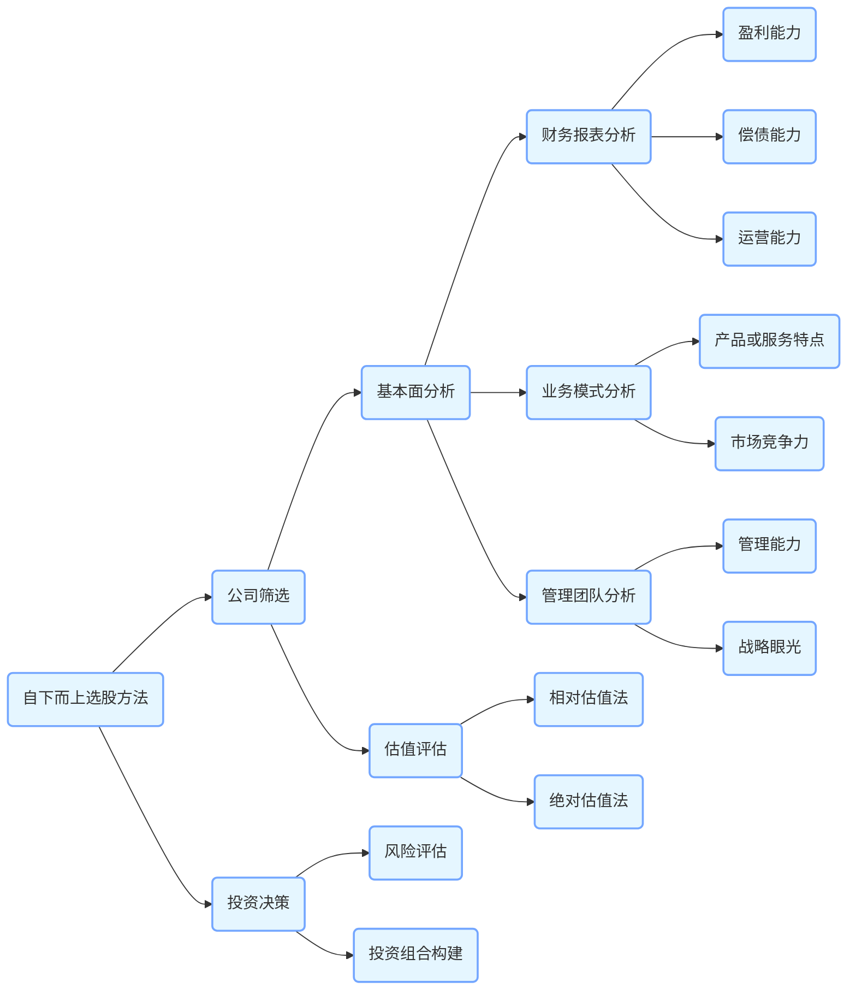

# 彼得林奇的"自下而上"选股方法

> 关键词：彼得林奇、自下而上选股方法、股票投资、基本面分析、选股策略

> 摘要：本文深入探讨了彼得林奇的“自下而上”选股方法。首先介绍了该方法提出的背景、适用范围和预期读者，对相关术语进行了详细解释。接着阐述了“自下而上”选股方法的核心概念、架构及内在联系，并通过Mermaid流程图进行直观展示。详细讲解了该方法的核心算法原理，结合Python代码说明具体操作步骤，同时给出了相关的数学模型和公式并举例说明。通过项目实战，展示了该选股方法在实际中的应用，包括开发环境搭建、源代码实现及解读分析。分析了该方法在不同场景下的实际应用，推荐了学习该方法的工具和资源，最后总结了其未来发展趋势与挑战，并提供常见问题解答和扩展阅读参考资料，帮助投资者更好地理解和运用这一经典选股方法。

## 1. 背景介绍 
### 1.1 目的和范围
彼得林奇是投资界的传奇人物，他所倡导的“自下而上”选股方法在投资领域有着广泛的影响。本文的目的在于深入剖析这一选股方法，让投资者能够全面了解其原理、操作步骤以及实际应用。范围涵盖了该方法的核心概念、算法原理、数学模型、实际案例分析等多个方面，旨在为投资者提供一套系统的学习和应用指南。

### 1.2 预期读者
本文的预期读者主要包括对股票投资感兴趣的个人投资者、金融专业的学生、投资机构的研究人员以及从事金融相关工作的从业者。无论是初涉投资领域的新手，还是有一定投资经验的专业人士，都能从本文中获得有价值的信息和启示。

### 1.3 文档结构概述
本文将按照以下结构进行阐述：首先介绍“自下而上”选股方法的核心概念与联系，包括其原理和架构；接着详细讲解核心算法原理和具体操作步骤，并给出Python代码示例；然后介绍相关的数学模型和公式，并举例说明；通过项目实战展示该方法在实际中的应用；分析该方法的实际应用场景；推荐学习该方法的工具和资源；最后总结其未来发展趋势与挑战，提供常见问题解答和扩展阅读参考资料。

### 1.4 术语表
#### 1.4.1 核心术语定义
- **自下而上选股方法**：一种选股策略，强调从具体的公司层面出发，通过对公司的基本面、业务模式、财务状况等进行深入分析，筛选出具有投资价值的股票，而不是先从宏观经济、行业趋势等宏观层面进行分析。
- **基本面分析**：通过对公司的财务报表、经营状况、行业地位等基本信息进行分析，评估公司的内在价值和投资潜力。
- **成长股**：指那些具有持续成长潜力的公司的股票，通常表现为营业收入和净利润的快速增长。
- **价值股**：指那些股价相对其内在价值被低估的股票，具有一定的安全边际。

#### 1.4.2 相关概念解释
- **行业分析**：对不同行业的发展趋势、市场规模、竞争格局等进行研究和分析，以了解行业的整体情况和发展前景。
- **宏观经济分析**：对宏观经济指标（如GDP、通货膨胀率、利率等）进行研究和分析，以了解宏观经济的运行状况和发展趋势，对股票市场的影响。

#### 1.4.3 缩略词列表
- **EPS**：Earnings Per Share，每股收益，指公司净利润与发行在外普通股股数的比值，反映了每股股票的盈利水平。
- **P/E**：Price-to-Earnings Ratio，市盈率，指股票价格与每股收益的比值，用于衡量股票的估值水平。
- **PEG**：Price/Earnings to Growth Ratio，市盈率相对盈利增长比率，综合考虑了股票的市盈率和盈利增长率，用于评估股票的性价比。

## 2. 核心概念与联系 
### 核心概念原理
“自下而上”选股方法的核心原理是聚焦于单个公司的基本面和发展前景，而不是先考虑宏观经济和行业趋势。彼得林奇认为，即使在整体经济不景气或行业表现不佳的情况下，仍然可能存在一些具有独特竞争优势和成长潜力的公司。通过深入研究这些公司的业务模式、产品或服务、管理团队、财务状况等方面，可以发现那些被市场低估的优质股票。

### 架构的文本示意图
```plaintext
自下而上选股方法
|-- 公司筛选
|   |-- 基本面分析
|   |   |-- 财务报表分析
|   |   |   |-- 盈利能力（如EPS、ROE等）
|   |   |   |-- 偿债能力（如资产负债率等）
|   |   |   |-- 运营能力（如存货周转率等）
|   |   |-- 业务模式分析
|   |   |   |-- 产品或服务特点
|   |   |   |-- 市场竞争力
|   |   |-- 管理团队分析
|   |       |-- 管理能力
|   |       |-- 战略眼光
|-- 估值评估
|   |-- 相对估值法（如P/E、PEG等）
|   |-- 绝对估值法（如DCF等）
|-- 投资决策
|   |-- 风险评估
|   |-- 投资组合构建
```

### Mermaid流程图


## 3. 核心算法原理 & 具体操作步骤 
### 核心算法原理
“自下而上”选股方法的核心算法原理是通过对公司的各项指标进行量化分析，筛选出具有投资价值的股票。主要步骤包括基本面分析、估值评估和风险评估。

### 具体操作步骤
#### 1. 数据收集
收集公司的财务报表、行业报告、新闻资讯等相关数据，为后续分析提供基础。

#### 2. 基本面分析
- **财务报表分析**：计算公司的盈利能力、偿债能力、运营能力等指标，评估公司的财务健康状况。
- **业务模式分析**：研究公司的产品或服务特点、市场竞争力、客户群体等，了解公司的业务模式和发展前景。
- **管理团队分析**：评估管理团队的管理能力、战略眼光和执行力，判断公司的管理水平。

#### 3. 估值评估
- **相对估值法**：使用市盈率（P/E）、市净率（P/B）、市盈率相对盈利增长比率（PEG）等指标，与同行业其他公司进行比较，评估股票的估值水平。
- **绝对估值法**：使用现金流折现模型（DCF）等方法，计算公司的内在价值，判断股票是否被低估或高估。

#### 4. 风险评估
考虑公司面临的各种风险，如市场风险、行业风险、公司自身风险等，评估投资的风险程度。

#### 5. 投资决策
根据基本面分析、估值评估和风险评估的结果，决定是否投资该股票，并确定投资的金额和比例。

### Python源代码示例
```python
import pandas as pd
import yfinance as yf

# 数据收集
def collect_data(ticker):
    stock = yf.Ticker(ticker)
    financials = stock.financials
    balance_sheet = stock.balance_sheet
    cashflow = stock.cashflow
    return financials, balance_sheet, cashflow

# 基本面分析
def fundamental_analysis(financials, balance_sheet, cashflow):
    # 计算盈利能力指标：每股收益（EPS）
    net_income = financials.loc['Net Income']
    shares_outstanding = balance_sheet.loc['Common Stock']
    eps = net_income / shares_outstanding
    # 计算偿债能力指标：资产负债率
    total_assets = balance_sheet.loc['Total Assets']
    total_liabilities = balance_sheet.loc['Total Liab']
    debt_ratio = total_liabilities / total_assets
    return eps, debt_ratio

# 估值评估
def valuation_analysis(stock, eps):
    current_price = stock.history(period='1d')['Close'].values[0]
    # 计算市盈率（P/E）
    pe_ratio = current_price / eps.iloc[0]
    return pe_ratio

# 主函数
def main(ticker):
    financials, balance_sheet, cashflow = collect_data(ticker)
    eps, debt_ratio = fundamental_analysis(financials, balance_sheet, cashflow)
    stock = yf.Ticker(ticker)
    pe_ratio = valuation_analysis(stock, eps)
    print(f"每股收益（EPS）: {eps.iloc[0]}")
    print(f"资产负债率: {debt_ratio.iloc[0]}")
    print(f"市盈率（P/E）: {pe_ratio}")

if __name__ == "__main__":
    ticker = 'AAPL'  # 以苹果公司为例
    main(ticker)
```

### 代码解释
- `collect_data` 函数：使用 `yfinance` 库收集指定股票的财务报表、资产负债表和现金流量表数据。
- `fundamental_analysis` 函数：计算公司的盈利能力指标（每股收益）和偿债能力指标（资产负债率）。
- `valuation_analysis` 函数：计算公司的市盈率（P/E），评估股票的估值水平。
- `main` 函数：调用上述函数，完成数据收集、基本面分析和估值评估，并打印相关指标。

## 4. 数学模型和公式 & 详细讲解 & 举例说明 
### 数学模型和公式
#### 1. 每股收益（EPS）
$$EPS = \frac{净利润}{发行在外普通股股数}$$
每股收益反映了每股股票的盈利水平，是衡量公司盈利能力的重要指标。

#### 2. 市盈率（P/E）
$$P/E = \frac{股票价格}{每股收益}$$
市盈率用于衡量股票的估值水平，反映了投资者为获得每股收益所愿意支付的价格。

#### 3. 市盈率相对盈利增长比率（PEG）
$$PEG = \frac{市盈率}{盈利增长率}$$
PEG综合考虑了股票的市盈率和盈利增长率，用于评估股票的性价比。一般来说，PEG小于1表示股票可能被低估。

#### 4. 资产负债率
$$资产负债率 = \frac{总负债}{总资产}$$
资产负债率反映了公司的偿债能力，即公司负债占总资产的比例。

### 详细讲解
- **每股收益（EPS）**：EPS越高，说明公司的盈利能力越强。投资者通常会关注公司的EPS增长率，以判断公司的盈利增长趋势。
- **市盈率（P/E）**：P/E值高可能表示市场对公司的未来增长预期较高，但也可能意味着股票被高估；P/E值低可能表示股票被低估，但也可能反映出公司的业绩不佳或市场前景不乐观。
- **市盈率相对盈利增长比率（PEG）**：PEG可以帮助投资者在考虑市盈率的同时，也考虑公司的盈利增长情况。例如，一个公司的P/E为20，盈利增长率为25%，则PEG为0.8，说明该股票可能具有较好的投资价值。
- **资产负债率**：资产负债率过高可能意味着公司面临较大的偿债压力，财务风险较高；资产负债率过低可能表示公司没有充分利用财务杠杆，盈利能力可能受到影响。

### 举例说明
假设一家公司的净利润为1000万元，发行在外普通股股数为500万股，则每股收益为：
$$EPS = \frac{1000}{500} = 2（元/股）$$
如果该公司的股票价格为40元，则市盈率为：
$$P/E = \frac{40}{2} = 20$$
若该公司的盈利增长率为30%，则市盈率相对盈利增长比率为：
$$PEG = \frac{20}{30} \approx 0.67$$
假设该公司的总负债为3000万元，总资产为5000万元，则资产负债率为：
$$资产负债率 = \frac{3000}{5000} = 0.6 = 60\%$$

## 5. 项目实战：代码实际案例和详细解释说明 
### 5.1  开发环境搭建
#### 1. 安装Python
可以从Python官方网站（https://www.python.org/downloads/）下载并安装Python 3.x版本。

#### 2. 安装必要的库
使用 `pip` 命令安装所需的库：
```sh
pip install pandas yfinance
```

### 5.2  源代码详细实现和代码解读
```python
import pandas as pd
import yfinance as yf

# 数据收集
def collect_data(ticker):
    stock = yf.Ticker(ticker)
    financials = stock.financials
    balance_sheet = stock.balance_sheet
    cashflow = stock.cashflow
    return financials, balance_sheet, cashflow

# 基本面分析
def fundamental_analysis(financials, balance_sheet, cashflow):
    # 计算盈利能力指标：每股收益（EPS）
    net_income = financials.loc['Net Income']
    shares_outstanding = balance_sheet.loc['Common Stock']
    eps = net_income / shares_outstanding
    # 计算偿债能力指标：资产负债率
    total_assets = balance_sheet.loc['Total Assets']
    total_liabilities = balance_sheet.loc['Total Liab']
    debt_ratio = total_liabilities / total_assets
    return eps, debt_ratio

# 估值评估
def valuation_analysis(stock, eps):
    current_price = stock.history(period='1d')['Close'].values[0]
    # 计算市盈率（P/E）
    pe_ratio = current_price / eps.iloc[0]
    return pe_ratio

# 主函数
def main(ticker):
    financials, balance_sheet, cashflow = collect_data(ticker)
    eps, debt_ratio = fundamental_analysis(financials, balance_sheet, cashflow)
    stock = yf.Ticker(ticker)
    pe_ratio = valuation_analysis(stock, eps)
    print(f"每股收益（EPS）: {eps.iloc[0]}")
    print(f"资产负债率: {debt_ratio.iloc[0]}")
    print(f"市盈率（P/E）: {pe_ratio}")

if __name__ == "__main__":
    ticker = 'AAPL'  # 以苹果公司为例
    main(ticker)
```

### 代码解读与分析
- **数据收集部分**：`collect_data` 函数使用 `yfinance` 库获取指定股票的财务报表、资产负债表和现金流量表数据。`yfinance` 是一个方便的Python库，可以直接从雅虎财经获取股票数据。
- **基本面分析部分**：`fundamental_analysis` 函数计算公司的每股收益（EPS）和资产负债率。通过从财务报表和资产负债表中提取相关数据，进行简单的数学计算得到这些指标。
- **估值评估部分**：`valuation_analysis` 函数计算公司的市盈率（P/E）。通过获取当前股票价格和每股收益，计算出市盈率。
- **主函数部分**：`main` 函数调用上述函数，完成数据收集、基本面分析和估值评估，并打印相关指标。在这个例子中，我们以苹果公司（股票代码：AAPL）为例进行分析。

通过这个项目实战，我们可以看到如何使用Python代码实现“自下而上”选股方法的基本流程，包括数据收集、基本面分析和估值评估。

## 6. 实际应用场景 
### 个人投资者
对于个人投资者来说，“自下而上”选股方法可以帮助他们在众多的股票中筛选出具有投资价值的股票。个人投资者可以通过深入研究公司的基本面，发现那些被市场低估的优质股票，从而获得更好的投资回报。例如，个人投资者可以关注日常生活中接触到的公司，通过观察其产品或服务的受欢迎程度、市场竞争力等方面，结合财务分析，选择合适的投资标的。

### 投资机构
投资机构通常会管理大量的资金，需要进行多元化的投资组合管理。“自下而上”选股方法可以帮助投资机构深入了解每家公司的情况，构建更加合理的投资组合。投资机构可以通过专业的研究团队，对大量公司进行基本面分析和估值评估，选择不同行业、不同规模的优质股票，降低投资风险，提高投资收益。

### 长期投资
“自下而上”选股方法适合长期投资。通过关注公司的基本面和成长潜力，投资者可以选择那些具有持续竞争优势和成长空间的公司进行长期投资。长期投资可以避免短期市场波动的影响，分享公司成长带来的红利。例如，一些优秀的科技公司、消费公司在过去几十年中实现了持续的增长，长期持有这些公司的股票可以获得丰厚的回报。

### 价值投资
价值投资强调寻找被市场低估的股票，通过长期持有实现价值回归。“自下而上”选股方法通过对公司的基本面分析和估值评估，可以帮助投资者发现那些具有较低市盈率、较高股息率等特征的价值股。投资者可以在市场低估时买入这些股票，等待市场对其价值的重新认可，从而获得投资收益。

## 7. 工具和资源推荐
### 7.1 学习资源推荐
#### 7.1.1 书籍推荐
- 《彼得·林奇的成功投资》：彼得·林奇本人所著，详细介绍了他的投资理念和选股方法，是学习“自下而上”选股方法的经典书籍。
- 《聪明的投资者》：本杰明·格雷厄姆所著，被誉为价值投资的圣经，对基本面分析和投资决策有深入的阐述。
- 《财务报表分析与证券定价》：斯蒂芬·佩因曼所著，系统介绍了财务报表分析的方法和应用，对于理解公司的基本面有很大帮助。

#### 7.1.2 在线课程
- Coursera上的“投资学原理”：由知名大学教授授课，涵盖了投资的基本理论和方法，包括选股策略、投资组合管理等内容。
- 网易云课堂上的“股票投资实战课程”：结合实际案例，讲解股票投资的技巧和方法，适合初学者学习。

#### 7.1.3 技术博客和网站
- 雪球网：一个专注于股票投资的社区，投资者可以在上面交流投资经验、分享研究报告和观点。
- 东方财富网：提供丰富的股票行情、财务数据、研究报告等信息，是投资者获取信息的重要渠道。
- Seeking Alpha：一个全球性的投资研究平台，提供专业的股票分析和投资建议。

### 7.2 开发工具框架推荐
#### 7.2.1 IDE和编辑器
- PyCharm：一款专业的Python集成开发环境，具有强大的代码编辑、调试和项目管理功能。
- Jupyter Notebook：一个交互式的开发环境，适合进行数据分析和代码演示，方便投资者进行数据探索和模型验证。

#### 7.2.2 调试和性能分析工具
- PDB：Python自带的调试工具，可以帮助开发者在代码中设置断点、查看变量值等，进行代码调试。
- cProfile：Python的性能分析工具，可以分析代码的执行时间和函数调用情况，帮助开发者优化代码性能。

#### 7.2.3 相关框架和库
- Pandas：一个强大的数据分析库，提供了高效的数据结构和数据处理方法，适合进行财务数据的分析和处理。
- NumPy：一个用于科学计算的库，提供了多维数组和矩阵运算功能，在数据分析和模型计算中广泛应用。
- Scikit-learn：一个机器学习库，提供了丰富的机器学习算法和工具，可用于股票预测和投资策略优化。

### 7.3 相关论文著作推荐
#### 7.3.1 经典论文
- “The Cross - Section of Expected Stock Returns”：Fama和French发表的经典论文，提出了三因子模型，对股票收益率的影响因素进行了深入研究。
- “Efficient Capital Markets: A Review of Theory and Empirical Work”：Eugene F. Fama发表的论文，系统阐述了有效市场假说，对股票市场的效率和定价机制进行了探讨。

#### 7.3.2 最新研究成果
- 关注顶尖金融学术期刊，如《Journal of Finance》、《Review of Financial Studies》等，这些期刊上经常发表关于股票投资和选股策略的最新研究成果。

#### 7.3.3 应用案例分析
- 可以参考一些投资机构或研究机构发布的投资报告和案例分析，了解“自下而上”选股方法在实际应用中的效果和经验教训。

## 8. 总结：未来发展趋势与挑战
### 未来发展趋势
#### 1. 数据驱动的决策
随着信息技术的不断发展，投资者可以获取更多的公司数据和市场信息。未来，“自下而上”选股方法将更加注重数据的收集、分析和挖掘，通过大数据、人工智能等技术，提高选股的准确性和效率。

#### 2. 跨学科融合
选股方法将不再局限于金融领域，而是与计算机科学、统计学、心理学等多个学科进行融合。例如，运用机器学习算法进行股票预测，结合行为金融学理论分析投资者的心理和行为，从而更好地把握市场机会。

#### 3. 社会责任投资
越来越多的投资者开始关注公司的社会责任和可持续发展。未来，“自下而上”选股方法可能会将公司的环境、社会和治理（ESG）因素纳入考虑范围，选择那些具有良好社会责任表现的公司进行投资。

### 挑战
#### 1. 数据质量和可靠性
虽然数据量不断增加，但数据的质量和可靠性也面临挑战。不准确或不完整的数据可能会导致错误的分析和决策。投资者需要具备辨别数据质量的能力，并采用合适的方法进行数据清洗和预处理。

#### 2. 市场不确定性
股票市场充满了不确定性，宏观经济环境、政策变化、突发事件等因素都可能对股票价格产生影响。即使通过“自下而上”选股方法选出了优质股票，也难以完全避免市场风险。投资者需要具备风险管理的能力，合理构建投资组合，降低市场不确定性带来的影响。

#### 3. 技术更新换代快
信息技术发展迅速，新的数据分析方法和工具不断涌现。投资者需要不断学习和更新知识，跟上技术发展的步伐，才能更好地运用“自下而上”选股方法。

## 9. 附录：常见问题与解答
### 问题1：“自下而上”选股方法是否适用于所有市场环境？
解答：“自下而上”选股方法在不同的市场环境中都有一定的适用性。在牛市中，通过该方法可以筛选出具有更高成长潜力的股票，获取超额收益；在熊市中，也可以找到那些被市场低估的优质股票，为未来的市场反弹做好准备。但在极端市场环境下，如市场大幅波动或系统性风险较高时，该方法可能需要结合宏观经济分析和风险管理来使用。

### 问题2：如何判断一家公司的管理团队是否优秀？
解答：可以从以下几个方面判断公司管理团队的优劣：管理团队的经验和背景，包括在行业内的工作年限、专业技能等；管理团队的业绩记录，如公司的历史业绩表现、市场份额变化等；管理团队的战略眼光和决策能力，是否能够制定合理的发展战略并有效执行；管理团队的沟通能力和团队协作精神，是否能够与员工、股东和其他利益相关者进行良好的沟通和合作。

### 问题3：市盈率（P/E）越低的股票是否越值得投资？
解答：市盈率（P/E）越低并不一定意味着股票越值得投资。低市盈率可能表示股票被低估，但也可能反映出公司的业绩不佳或市场前景不乐观。投资者需要综合考虑公司的基本面、盈利增长率、行业平均市盈率等因素，结合其他估值指标和分析方法，全面评估股票的投资价值。

### 问题4：如何进行风险评估？
解答：风险评估可以从以下几个方面进行：市场风险，考虑宏观经济环境、政策变化、市场波动等因素对股票价格的影响；行业风险，分析行业的竞争格局、发展趋势、技术变革等因素对公司的影响；公司自身风险，评估公司的财务状况、经营管理、产品或服务竞争力等方面的风险。可以使用风险评估模型和指标，如贝塔系数、波动率等，来量化风险程度。

## 10. 扩展阅读 & 参考资料
### 扩展阅读
- 《怎样选择成长股》：菲利普·费雪所著，介绍了寻找成长股的方法和技巧，与“自下而上”选股方法有一定的关联。
- 《金融炼金术》：乔治·索罗斯所著，阐述了他的投资哲学和市场理论，对投资者的思维方式有一定的启发。

### 参考资料
- 彼得·林奇的官方网站和相关采访记录，获取第一手的投资理念和经验。
- 各大金融数据库和研究机构发布的报告和数据，如Wind数据库、Bloomberg终端等。

作者：AI天才研究院/AI Genius Institute & 禅与计算机程序设计艺术 /Zen And The Art of Computer Programming