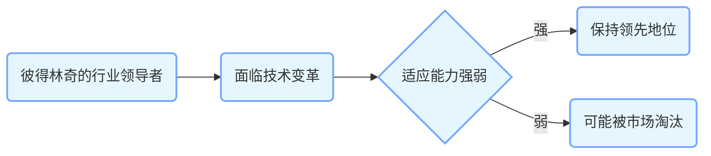

# 彼得林奇的"行业领导者"在技术变革中的适应能力评估

> 关键词：彼得林奇、行业领导者、技术变革、适应能力评估、企业竞争力

> 摘要：本文聚焦于彼得林奇所提出的“行业领导者”概念，深入探讨其在技术变革浪潮中的适应能力评估问题。首先介绍了研究的背景、目的、预期读者等内容，接着阐述了核心概念及其联系，详细分析了核心算法原理与操作步骤，并给出了相关数学模型和公式。通过项目实战案例，进一步说明如何评估行业领导者的适应能力。同时探讨了实际应用场景，推荐了相关学习资源、开发工具和论文著作。最后总结了未来发展趋势与挑战，解答了常见问题并提供扩展阅读和参考资料，旨在为评估行业领导者在技术变革中的适应能力提供全面且深入的指导。

## 1. 背景介绍 
### 1.1 目的和范围
在当今快速发展的科技时代，技术变革的速度不断加快，各个行业都面临着前所未有的挑战和机遇。彼得林奇作为投资领域的传奇人物，他所强调的“行业领导者”通常在市场中占据着重要地位，拥有强大的资源和广泛的影响力。然而，技术变革可能会打破原有的行业格局，使行业领导者面临诸多不确定性。本研究的目的在于建立一套科学的评估体系，来衡量彼得林奇所定义的“行业领导者”在技术变革中的适应能力，从而为投资者、企业管理者以及相关研究人员提供决策依据。研究范围涵盖了多个不同行业的行业领导者企业，分析其在面对不同类型技术变革时的表现和适应策略。

### 1.2 预期读者
本文的预期读者主要包括以下几类人群：
- **投资者**：希望通过了解行业领导者在技术变革中的适应能力，评估企业的投资价值，做出更明智的投资决策。
- **企业管理者**：借鉴评估方法和案例，了解自身企业在技术变革中的优势和不足，制定相应的战略以提高企业的适应能力和竞争力。
- **研究人员**：为相关领域的学术研究提供参考，推动关于企业适应技术变革能力的理论和实践研究。
- **行业分析师**：辅助进行行业分析和预测，评估行业领导者在技术变革背景下的发展趋势。

### 1.3 文档结构概述
本文将按照以下结构展开：
- 核心概念与联系：介绍彼得林奇的“行业领导者”概念以及技术变革和适应能力的相关定义，并阐述它们之间的联系。
- 核心算法原理 & 具体操作步骤：详细讲解用于评估适应能力的核心算法，包括数据收集、指标选取和计算方法，并给出Python代码示例。
- 数学模型和公式 & 详细讲解 & 举例说明：建立数学模型来描述适应能力评估过程，解释相关公式，并通过实际例子进行说明。
- 项目实战：通过一个具体的项目案例，展示如何进行适应能力评估，包括开发环境搭建、源代码实现和代码解读。
- 实际应用场景：探讨评估结果在不同场景下的应用，如投资决策、企业战略规划等。
- 工具和资源推荐：推荐相关的学习资源、开发工具和论文著作，帮助读者进一步深入研究。
- 总结：未来发展趋势与挑战：总结研究成果，分析行业领导者在技术变革中适应能力的未来发展趋势和面临的挑战。
- 附录：常见问题与解答：解答读者在阅读过程中可能遇到的常见问题。
- 扩展阅读 & 参考资料：提供相关的扩展阅读材料和参考资料，方便读者进一步探索。

### 1.4 术语表
#### 1.4.1 核心术语定义
- **彼得林奇的“行业领导者”**：指在某个行业中占据主导地位，具有较大市场份额、较强品牌影响力、先进的技术和管理水平的企业。这些企业通常在行业的发展中起到引领作用，是投资者关注的重点对象。
- **技术变革**：指由于科学技术的进步而导致的生产方式、产品或服务、商业模式等方面的重大变化。技术变革可以是渐进式的，也可以是颠覆性的，它会对企业的生存和发展产生深远影响。
- **适应能力**：指企业在面对技术变革时，能够及时调整自身战略、组织结构、技术能力等方面，以适应新的市场环境和竞争格局的能力。适应能力强的企业能够在技术变革中抓住机遇，实现持续发展；而适应能力弱的企业则可能面临被市场淘汰的风险。

#### 1.4.2 相关概念解释
- **市场份额**：指企业的产品或服务在市场中所占的比例，是衡量企业市场竞争力的重要指标之一。市场份额高的企业通常具有更强的定价能力和成本优势。
- **品牌影响力**：指品牌在消费者心目中的知名度、美誉度和忠诚度。具有强大品牌影响力的企业能够吸引更多的消费者，提高市场份额和盈利能力。
- **技术创新能力**：指企业在研发新产品、新技术方面的能力，包括研发投入、研发团队实力、专利数量等方面。技术创新能力是企业在技术变革中保持竞争力的关键因素。

#### 1.4.3 缩略词列表
- **R&D**：Research and Development，即研究与开发，指企业为了创新和改进产品、技术而进行的活动。
- **ROI**：Return on Investment，即投资回报率，指企业投资所获得的收益与投资成本的比率，是衡量投资效益的重要指标。

## 2. 核心概念与联系 

### 彼得林奇的“行业领导者”概念
彼得林奇认为，行业领导者是那些在特定行业中具有明显优势的企业。这些企业通常具有以下特点：
- **规模优势**：拥有较大的生产规模和市场份额，能够实现规模经济，降低生产成本。
- **品牌优势**：具有较高的品牌知名度和美誉度，消费者对其产品或服务具有较高的信任度和忠诚度。
- **技术优势**：在技术研发和应用方面处于领先地位，能够不断推出新产品和新技术，满足市场需求。
- **管理优势**：拥有优秀的管理团队和先进的管理理念，能够有效地组织和协调企业的资源，提高运营效率。

### 技术变革的类型和影响
技术变革可以分为不同的类型，如渐进式变革和颠覆性变革。渐进式变革是指在现有技术基础上进行的逐步改进和升级，通常不会对行业格局产生重大影响；而颠覆性变革则是指引入全新的技术或商业模式，打破原有的行业规则和竞争格局，对企业的生存和发展构成巨大挑战。

技术变革对行业领导者的影响主要体现在以下几个方面：
- **市场需求变化**：新技术的出现可能会导致市场需求发生变化，消费者对产品或服务的需求和偏好也会随之改变。行业领导者如果不能及时适应这种变化，可能会失去市场份额。
- **竞争格局改变**：颠覆性技术的出现可能会催生新的竞争对手，这些竞争对手可能具有更强的创新能力和成本优势，对行业领导者的地位构成威胁。
- **技术壁垒消失**：随着技术的普及和扩散，行业领导者原有的技术壁垒可能会逐渐消失，其他企业也能够采用相同或类似的技术，从而加剧市场竞争。

### 适应能力的内涵和重要性
企业的适应能力是指其在面对技术变革时，能够及时调整自身战略、组织结构、技术能力等方面，以适应新的市场环境和竞争格局的能力。适应能力包括以下几个方面：
- **战略适应能力**：能够准确判断技术变革的趋势和影响，及时调整企业的发展战略，制定相应的应对措施。
- **组织适应能力**：能够对企业的组织结构进行优化和调整，提高组织的灵活性和响应速度，以适应技术变革带来的变化。
- **技术适应能力**：能够加大研发投入，引进和培养技术人才，不断提升企业的技术水平和创新能力，以跟上技术变革的步伐。
- **市场适应能力**：能够敏锐地捕捉市场需求的变化，及时调整产品或服务的策略，满足消费者的新需求。

适应能力对于行业领导者来说至关重要。在技术变革的浪潮中，只有具备较强适应能力的企业才能在激烈的市场竞争中生存下来，并实现持续发展。

### 核心概念的联系
彼得林奇的“行业领导者”、技术变革和适应能力这三个核心概念之间存在着密切的联系。行业领导者在面对技术变革时，其适应能力的强弱将直接影响其在市场中的地位和竞争力。如果行业领导者能够及时适应技术变革，利用自身的优势抓住机遇，就能够继续保持领先地位；反之，如果不能适应技术变革，就可能会被市场淘汰。

以下是用Mermaid绘制的核心概念联系流程图：


## 3. 核心算法原理 & 具体操作步骤 

### 核心算法原理
为了评估行业领导者在技术变革中的适应能力，我们可以采用多指标综合评估法。该方法的基本原理是：选取多个与适应能力相关的指标，对每个指标进行量化评估，然后根据各个指标的重要性赋予相应的权重，最后将各个指标的得分加权求和，得到企业的适应能力综合得分。

### 具体操作步骤
#### 步骤1：确定评估指标
根据适应能力的内涵，我们可以选取以下几个方面的指标：
- **战略适应能力指标**：包括战略调整的及时性、战略规划的合理性等。
- **组织适应能力指标**：包括组织结构的灵活性、组织沟通的效率等。
- **技术适应能力指标**：包括研发投入强度、专利数量、技术创新成果转化率等。
- **市场适应能力指标**：包括市场份额变化率、新产品销售额占比等。

#### 步骤2：数据收集
通过企业年报、行业研究报告、政府统计数据等渠道，收集各个评估指标的数据。对于一些难以直接获取的数据，可以采用问卷调查、专家评估等方法进行收集。

#### 步骤3：指标量化
对每个评估指标进行量化处理，将其转化为可以进行比较和计算的数值。例如，对于研发投入强度指标，可以用研发投入占销售收入的比例来表示；对于市场份额变化率指标，可以用当前市场份额与上一年度市场份额的差值来表示。

#### 步骤4：确定指标权重
根据各个指标的重要性，采用层次分析法（AHP）等方法确定每个指标的权重。层次分析法是一种将定性分析与定量分析相结合的方法，通过构建判断矩阵，计算各个指标的相对重要性。

#### 步骤5：计算综合得分
将各个指标的量化得分乘以其相应的权重，然后将所有指标的加权得分相加，得到企业的适应能力综合得分。计算公式如下：
$$S = \sum_{i=1}^{n} w_i x_i$$
其中，$S$ 表示企业的适应能力综合得分，$w_i$ 表示第 $i$ 个指标的权重，$x_i$ 表示第 $i$ 个指标的量化得分，$n$ 表示评估指标的个数。

### Python源代码实现
```python
import numpy as np

# 定义评估指标的量化得分
# 假设我们有4个指标：战略适应能力、组织适应能力、技术适应能力、市场适应能力
scores = np.array([80, 75, 85, 90])

# 定义指标的权重
weights = np.array([0.2, 0.2, 0.3, 0.3])

# 计算综合得分
composite_score = np.dot(scores, weights)

print("企业的适应能力综合得分：", composite_score)
```
### 代码解释
- 首先，我们使用 `numpy` 库来进行数值计算。
- 定义了一个 `scores` 数组，用于存储各个评估指标的量化得分。
- 定义了一个 `weights` 数组，用于存储各个指标的权重。
- 使用 `np.dot()` 函数计算得分向量和权重向量的点积，得到企业的适应能力综合得分。
- 最后，打印出综合得分。

## 4. 数学模型和公式 & 详细讲解 & 举例说明 

### 数学模型
我们可以将企业的适应能力评估问题抽象为一个多指标决策问题。设企业的适应能力为 $S$，有 $n$ 个评估指标 $x_1, x_2, \cdots, x_n$，每个指标的权重为 $w_1, w_2, \cdots, w_n$，则企业的适应能力可以表示为：
$$S = \sum_{i=1}^{n} w_i x_i$$
其中，$\sum_{i=1}^{n} w_i = 1$，$0 \leq w_i \leq 1$。

### 公式详细讲解
- $S$：表示企业的适应能力综合得分，得分越高，说明企业在技术变革中的适应能力越强。
- $w_i$：表示第 $i$ 个评估指标的权重，反映了该指标在评估企业适应能力中的重要程度。权重的确定需要综合考虑多个因素，如指标的相关性、数据的可靠性等。
- $x_i$：表示第 $i$ 个评估指标的量化得分，通过对该指标进行数据收集和量化处理得到。

### 举例说明
假设我们要评估一家电子制造企业在技术变革中的适应能力，选取了以下4个评估指标：
- 战略适应能力（$x_1$）：通过专家评估得到量化得分 80 分。
- 组织适应能力（$x_2$）：根据企业组织结构调整的频率和效果，量化得分为 75 分。
- 技术适应能力（$x_3$）：以研发投入强度和专利数量为依据，量化得分为 85 分。
- 市场适应能力（$x_4$）：根据市场份额变化率和新产品销售额占比，量化得分为 90 分。

采用层次分析法确定各个指标的权重分别为：
- 战略适应能力权重（$w_1$）：0.2
- 组织适应能力权重（$w_2$）：0.2
- 技术适应能力权重（$w_3$）：0.3
- 市场适应能力权重（$w_4$）：0.3

将上述数据代入公式 $S = \sum_{i=1}^{n} w_i x_i$ 中，可得：
$$S = 0.2 \times 80 + 0.2 \times 75 + 0.3 \times 85 + 0.3 \times 90$$
$$S = 16 + 15 + 25.5 + 27$$
$$S = 83.5$$

因此，该电子制造企业在技术变革中的适应能力综合得分为 83.5 分，说明该企业具有较强的适应能力。

## 5. 项目实战：代码实际案例和详细解释说明 

### 5.1  开发环境搭建
为了实现行业领导者在技术变革中适应能力的评估，我们可以使用Python语言进行开发。以下是搭建开发环境的步骤：
- **安装Python**：从Python官方网站（https://www.python.org/downloads/）下载并安装Python 3.x版本。
- **安装必要的库**：使用 `pip` 命令安装 `numpy`、`pandas` 等必要的库。例如，在命令行中输入以下命令安装 `numpy`：
```sh
pip install numpy
```

### 5.2  源代码详细实现和代码解读
以下是一个完整的Python代码示例，用于评估一家企业在技术变革中的适应能力：
```python
import numpy as np
import pandas as pd

# 定义评估指标和权重
indicators = ['战略适应能力', '组织适应能力', '技术适应能力', '市场适应能力']
weights = np.array([0.2, 0.2, 0.3, 0.3])

# 模拟收集的企业指标数据
data = {
    '企业名称': ['企业A'],
    '战略适应能力': [80],
    '组织适应能力': [75],
    '技术适应能力': [85],
    '市场适应能力': [90]
}

# 创建DataFrame对象
df = pd.DataFrame(data)

# 提取指标数据
scores = df[indicators].values

# 计算综合得分
df['综合得分'] = np.dot(scores, weights)

# 输出结果
print(df[['企业名称', '综合得分']])
```
### 代码解读
- **导入必要的库**：导入 `numpy` 和 `pandas` 库，分别用于数值计算和数据处理。
- **定义评估指标和权重**：定义了4个评估指标和相应的权重。
- **模拟收集的企业指标数据**：使用字典 `data` 模拟收集到的企业指标数据，包括企业名称和各个指标的量化得分。
- **创建DataFrame对象**：使用 `pandas` 的 `DataFrame` 函数将字典数据转换为数据框。
- **提取指标数据**：从数据框中提取指标数据，存储在 `scores` 数组中。
- **计算综合得分**：使用 `np.dot()` 函数计算得分向量和权重向量的点积，得到企业的适应能力综合得分，并将结果添加到数据框中。
- **输出结果**：打印出企业名称和综合得分。

### 5.3  代码解读与分析
通过上述代码，我们可以方便地评估企业在技术变革中的适应能力。代码的主要优点包括：
- **灵活性**：可以根据需要添加或删除评估指标，调整指标的权重。
- **可扩展性**：可以通过修改数据收集方式，处理多个企业的指标数据，进行批量评估。
- **可视化**：可以使用 `pandas` 和 `matplotlib` 等库对评估结果进行可视化展示，更直观地比较不同企业的适应能力。

## 6. 实际应用场景 
### 投资决策
对于投资者来说，评估行业领导者在技术变革中的适应能力可以帮助他们做出更明智的投资决策。适应能力强的企业在技术变革中能够更好地应对挑战，抓住机遇，具有更高的投资价值。投资者可以根据企业的适应能力综合得分，筛选出具有潜力的投资标的，降低投资风险。

### 企业战略规划
企业管理者可以利用适应能力评估结果，制定相应的战略规划。对于适应能力较弱的企业，可以分析其在各个指标方面的不足之处，有针对性地采取措施进行改进，如加大研发投入、优化组织结构等。对于适应能力较强的企业，可以进一步巩固其优势，拓展市场份额，提高企业的竞争力。

### 行业分析
行业分析师可以通过对行业内领导者企业的适应能力评估，了解整个行业在技术变革中的发展趋势和竞争格局。评估结果可以为行业报告提供数据支持，帮助企业和投资者更好地了解行业动态，做出合理的决策。

### 政府政策制定
政府部门可以根据行业领导者的适应能力评估结果，制定相关的产业政策。对于适应能力较弱的行业，可以出台扶持政策，鼓励企业加大研发投入，提高技术创新能力；对于适应能力较强的行业，可以引导企业加强国际合作，提升行业的国际竞争力。

## 7. 工具和资源推荐
### 7.1 学习资源推荐
#### 7.1.1 书籍推荐
- 《彼得林奇的成功投资》：彼得林奇的经典著作，介绍了他的投资理念和方法，对于理解行业领导者的特点和投资价值具有重要意义。
- 《创新者的窘境》：探讨了企业在面对颠覆性技术变革时所面临的挑战和机遇，为企业管理者提供了应对技术变革的思路和方法。
- 《技术创新管理》：系统介绍了技术创新的理论和方法，包括技术创新的过程、管理策略等内容，对于提高企业的技术适应能力具有指导作用。

#### 7.1.2 在线课程
- Coursera上的“投资学原理”：由知名教授授课，讲解投资的基本原理和方法，帮助学习者掌握投资分析的技巧。
- edX上的“技术创新与创业”：介绍了技术创新的过程和商业模式创新的方法，培养学习者的创新思维和创业能力。
- Udemy上的“Python数据分析实战”：通过实际案例，教授Python在数据分析中的应用，提高学习者的数据处理和分析能力。

#### 7.1.3 技术博客和网站
- 36氪：关注科技创新和创业动态，提供最新的行业资讯和深度分析文章。
- 虎嗅网：聚焦商业、科技领域的热点话题，分享行业专家的观点和见解。
- 艾瑞网：专注于互联网行业的研究和分析，提供行业报告、数据统计等内容。

### 7.2 开发工具框架推荐
#### 7.2.1 IDE和编辑器
- PyCharm：一款专业的Python集成开发环境，具有代码编辑、调试、自动补全、版本控制等功能，适合Python开发。
- Jupyter Notebook：一个交互式的编程环境，支持Python、R等多种编程语言，方便进行数据分析和可视化。
- Visual Studio Code：一款轻量级的代码编辑器，支持多种编程语言和插件扩展，具有丰富的功能和良好的用户体验。

#### 7.2.2 调试和性能分析工具
- PySnooper：一个简单易用的Python调试工具，可以自动记录函数的执行过程和变量的值，方便调试代码。
- cProfile：Python标准库中的性能分析工具，可以统计函数的执行时间和调用次数，帮助优化代码性能。
- memory_profiler：用于分析Python程序内存使用情况的工具，可以找出内存泄漏和高内存占用的代码段。

#### 7.2.3 相关框架和库
- NumPy：用于科学计算的Python库，提供了高效的多维数组对象和各种数学函数，是数据分析和机器学习的基础库。
- Pandas：用于数据处理和分析的Python库，提供了数据结构和数据操作方法，方便进行数据清洗、转换和分析。
- Scikit-learn：一个开源的机器学习库，提供了各种机器学习算法和工具，如分类、回归、聚类等，适合进行数据挖掘和预测分析。

### 7.3 相关论文著作推荐
#### 7.3.1 经典论文
- Christensen, C. M. (1997). The innovator's dilemma: When new technologies cause great firms to fail. Harvard Business School Press. 该论文提出了“创新者的窘境”理论，深刻分析了企业在面对颠覆性技术变革时失败的原因。
- Teece, D. J., Pisano, G., & Shuen, A. (1997). Dynamic capabilities and strategic management. Strategic management journal, 18(7), 509-533. 提出了动态能力理论，强调企业在快速变化的环境中需要具备动态调整资源和能力的能力。

#### 7.3.2 最新研究成果
- 关注顶级学术期刊如《Management Science》、《Strategic Management Journal》等，这些期刊会发表关于企业战略、技术创新和适应能力等方面的最新研究成果。

#### 7.3.3 应用案例分析
- 可以参考一些商业案例集，如《哈佛商业评论案例集》，其中包含了许多企业在面对技术变革时的成功和失败案例，通过分析这些案例可以学习到实际的应对策略和经验教训。

## 8. 总结：未来发展趋势与挑战
### 未来发展趋势
- **技术变革加速**：随着科技的不断进步，技术变革的速度将越来越快，行业领导者需要更加敏锐地捕捉技术变革的趋势，及时调整战略和业务模式。
- **跨界融合加剧**：不同行业之间的界限将越来越模糊，行业领导者需要具备跨领域的创新能力和整合资源的能力，以应对跨界竞争的挑战。
- **数据驱动决策**：大数据、人工智能等技术的发展将为企业提供更多的数据支持，行业领导者需要加强数据管理和分析能力，实现数据驱动的决策。
- **可持续发展成为主流**：消费者对环境保护和社会责任的关注度不断提高，行业领导者需要将可持续发展纳入企业战略，推动绿色创新和可持续发展。

### 挑战
- **技术不确定性**：技术变革的方向和速度具有不确定性，行业领导者很难准确预测未来的技术发展趋势，这增加了企业决策的难度和风险。
- **人才短缺**：在技术变革的背景下，企业需要大量具备创新能力和跨领域知识的人才，但目前这类人才相对短缺，企业面临着人才竞争的压力。
- **组织文化变革困难**：企业的组织文化具有一定的惯性，要实现适应技术变革的组织文化变革并非易事，需要企业领导者具备坚定的决心和有效的变革管理能力。
- **竞争加剧**：技术变革将催生更多的竞争对手，行业领导者需要不断提升自身的竞争力，以应对激烈的市场竞争。

## 9. 附录：常见问题与解答
### 问题1：如何确定评估指标的权重？
答：可以采用层次分析法（AHP）等方法确定评估指标的权重。层次分析法是一种将定性分析与定量分析相结合的方法，通过构建判断矩阵，计算各个指标的相对重要性。也可以根据专家意见、行业经验等进行综合考虑，确定合理的权重。

### 问题2：评估指标的数据收集有哪些渠道？
答：评估指标的数据收集渠道主要包括企业年报、行业研究报告、政府统计数据等。对于一些难以直接获取的数据，可以采用问卷调查、专家评估等方法进行收集。

### 问题3：适应能力评估结果的准确性如何保证？
答：为了保证适应能力评估结果的准确性，需要注意以下几点：
- 选择合适的评估指标，确保指标能够全面、准确地反映企业的适应能力。
- 保证数据的真实性和可靠性，对收集到的数据进行严格的审核和验证。
- 合理确定指标的权重，避免权重分配不合理导致评估结果偏差。
- 可以采用多种评估方法进行验证，提高评估结果的可信度。

### 问题4：评估结果如何应用到企业的实际决策中？
答：评估结果可以应用到企业的战略规划、投资决策、组织调整等方面。例如，对于适应能力较弱的企业，可以分析其在各个指标方面的不足之处，有针对性地采取措施进行改进；对于适应能力较强的企业，可以进一步巩固其优势，拓展市场份额。同时，评估结果也可以为投资者提供参考，帮助他们做出更明智的投资决策。

## 10. 扩展阅读 & 参考资料
### 扩展阅读
- 《技术的本质》：深入探讨了技术的本质和发展规律，对于理解技术变革的内在机制具有重要意义。
- 《智能时代》：介绍了人工智能、大数据等新兴技术对社会和经济的影响，以及企业如何在智能时代实现转型和发展。
- 《未来简史》：从宏观的角度探讨了人类社会的未来发展趋势，包括技术变革对人类社会的影响，拓宽读者的视野。

### 参考资料
- Christensen, C. M. (1997). The innovator's dilemma: When new technologies cause great firms to fail. Harvard Business School Press.
- Teece, D. J., Pisano, G., & Shuen, A. (1997). Dynamic capabilities and strategic management. Strategic management journal, 18(7), 509-533.
- 彼得·林奇, 约翰·罗瑟查尔德. (2001). 彼得林奇的成功投资. 机械工业出版社.

作者：AI天才研究院/AI Genius Institute & 禅与计算机程序设计艺术 /Zen And The Art of Computer Programming