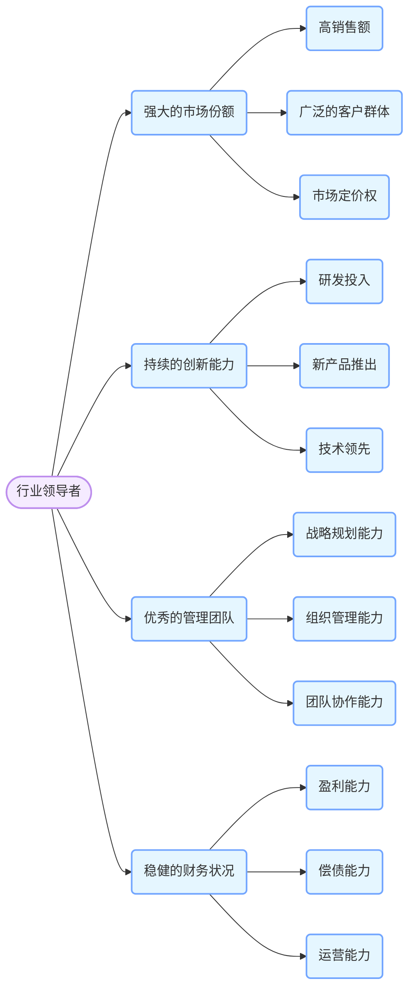

# 彼得林奇的“行业领导者”特征分析

> 关键词：彼得林奇、行业领导者、特征分析、投资策略、企业竞争力

> 摘要：本文聚焦于彼得林奇提出的“行业领导者”特征进行深入分析。彼得林奇作为投资界的传奇人物，其投资理念和方法影响深远。通过对行业领导者特征的剖析，有助于投资者更好地识别具有投资价值的企业，同时也为企业管理者提供提升企业竞争力的思路。文章首先介绍了相关背景知识，包括目的、预期读者等内容；接着阐述核心概念及联系，构建理论框架；详细讲解核心算法原理及操作步骤，结合 Python 代码示例；运用数学模型和公式进一步分析；通过项目实战案例加深理解；探讨实际应用场景；推荐学习和开发所需的工具与资源；最后总结未来发展趋势与挑战，并对常见问题进行解答，同时列出扩展阅读和参考资料。

## 1. 背景介绍 
### 1.1 目的和范围
本文章的目的在于全面、深入地分析彼得林奇所提出的“行业领导者”的特征。彼得林奇在投资领域取得了巨大的成功，他的投资策略和对企业的分析方法具有极高的参考价值。通过对“行业领导者”特征的研究，我们可以为投资者提供一套系统的分析框架，帮助他们在众多企业中筛选出具有潜力的投资标的。同时，对于企业管理者而言，了解这些特征也有助于他们明确企业的发展方向，提升企业在行业中的竞争力。

本文的范围主要涵盖彼得林奇所提及的“行业领导者”的各种特征，包括市场份额、创新能力、管理团队、财务状况等方面。我们将从理论和实践两个层面进行分析，结合具体的案例和数据，使读者能够更直观地理解这些特征的重要性和应用方法。

### 1.2 预期读者
本文的预期读者主要包括以下几类人群：
- **投资者**：无论是专业的机构投资者还是普通的个人投资者，都可以从本文中获取有关投资分析的方法和思路。通过了解“行业领导者”的特征，投资者可以更好地评估企业的投资价值，制定更合理的投资策略。
- **企业管理者**：企业管理者可以借鉴本文所分析的特征，审视企业自身的发展状况，找出存在的问题和不足，并制定相应的改进措施，以提升企业在行业中的地位和竞争力。
- **金融和经济领域的研究人员**：研究人员可以将本文作为参考资料，进一步深入研究彼得林奇的投资理论和企业竞争力的相关问题，为学术研究提供新的视角和思路。

### 1.3 文档结构概述
本文将按照以下结构进行组织：
- **核心概念与联系**：介绍彼得林奇“行业领导者”的核心概念，阐述各特征之间的联系，并通过文本示意图和 Mermaid 流程图进行直观展示。
- **核心算法原理 & 具体操作步骤**：讲解用于分析“行业领导者”特征的核心算法原理，并给出具体的操作步骤，同时使用 Python 源代码进行详细阐述。
- **数学模型和公式 & 详细讲解 & 举例说明**：运用数学模型和公式对“行业领导者”的特征进行量化分析，详细讲解公式的含义和应用，并通过具体的例子进行说明。
- **项目实战：代码实际案例和详细解释说明**：通过实际的项目案例，展示如何运用前面所学的知识进行“行业领导者”的特征分析，包括开发环境搭建、源代码实现和代码解读。
- **实际应用场景**：探讨“行业领导者”特征分析在投资决策、企业战略规划等实际场景中的应用。
- **工具和资源推荐**：推荐学习和开发所需的工具和资源，包括书籍、在线课程、技术博客、IDE 和编辑器、调试和性能分析工具、相关框架和库以及相关论文著作等。
- **总结：未来发展趋势与挑战**：总结“行业领导者”特征分析的发展趋势，并分析面临的挑战。
- **附录：常见问题与解答**：对读者可能关心的常见问题进行解答。
- **扩展阅读 & 参考资料**：提供扩展阅读的建议和参考资料的列表。

### 1.4 术语表
#### 1.4.1 核心术语定义
- **行业领导者**：在某个特定行业中，具有领先地位和竞争优势的企业。这些企业通常在市场份额、技术创新、品牌影响力等方面表现出色，能够引领行业的发展方向。
- **市场份额**：指企业的产品或服务在市场中所占的比例，是衡量企业市场竞争力的重要指标之一。
- **创新能力**：企业在技术、产品、管理等方面进行创新的能力，是企业保持竞争优势和持续发展的关键因素。
- **管理团队**：负责企业日常运营和决策的团队，其素质和能力直接影响企业的发展前景。
- **财务状况**：企业的财务健康状况，包括盈利能力、偿债能力、运营能力等方面，是评估企业投资价值的重要依据。

#### 1.4.2 相关概念解释
- **规模经济**：随着企业生产规模的扩大，单位产品的成本逐渐降低，从而提高企业的经济效益。行业领导者通常能够充分利用规模经济，降低成本，提高市场竞争力。
- **品牌溢价**：消费者由于对品牌的信任和认可，愿意为该品牌的产品或服务支付更高的价格。行业领导者往往具有较高的品牌知名度和美誉度，能够获得品牌溢价。
- **进入壁垒**：新企业进入某个行业所面临的障碍，如技术门槛、资金要求、政策限制等。行业领导者通常能够建立较高的进入壁垒，阻止竞争对手的进入，从而保持其市场地位。

#### 1.4.3 缩略词列表
- **ROE**：Return on Equity，净资产收益率，反映企业运用自有资本的效率。
- **PE**：Price-to-Earnings Ratio，市盈率，衡量股票价格与每股盈利之间的关系。
- **EPS**：Earnings Per Share，每股收益，反映企业每股股票的盈利水平。

## 2. 核心概念与联系 

### 核心概念原理
彼得林奇认为，“行业领导者”具有以下几个核心特征：
- **强大的市场份额**：行业领导者通常在市场中占据较大的份额，这意味着它们能够更好地控制市场价格、获取更多的利润，并具有更强的抗风险能力。
- **持续的创新能力**：在快速变化的市场环境中，创新是企业保持竞争优势的关键。行业领导者不断投入资源进行研发，推出新产品、新技术，满足消费者的需求，引领行业的发展方向。
- **优秀的管理团队**：一个优秀的管理团队能够制定正确的战略规划，有效地组织和管理企业的资源，提高企业的运营效率和竞争力。
- **稳健的财务状况**：良好的财务状况是企业持续发展的基础。行业领导者通常具有较高的盈利能力、偿债能力和运营能力，能够为企业的发展提供坚实的资金支持。

### 架构的文本示意图
```
行业领导者
|-- 强大的市场份额
|   |-- 高销售额
|   |-- 广泛的客户群体
|   |-- 市场定价权
|-- 持续的创新能力
|   |-- 研发投入
|   |-- 新产品推出
|   |-- 技术领先
|-- 优秀的管理团队
|   |-- 战略规划能力
|   |-- 组织管理能力
|   |-- 团队协作能力
|-- 稳健的财务状况
|   |-- 盈利能力
|   |-- 偿债能力
|   |-- 运营能力
```

### Mermaid 流程图


从这个流程图可以清晰地看到，“行业领导者”由强大的市场份额、持续的创新能力、优秀的管理团队和稳健的财务状况这四个核心特征构成，每个核心特征又包含多个子特征。这些特征相互关联、相互影响，共同决定了企业是否能够成为行业领导者。

## 3. 核心算法原理 & 具体操作步骤 

### 核心算法原理
为了分析企业是否具备“行业领导者”的特征，我们可以采用多指标综合评价的方法。具体来说，我们可以选取与市场份额、创新能力、管理团队和财务状况相关的多个指标，对每个指标进行量化评估，然后根据一定的权重将这些指标的得分进行加权求和，得到企业的综合得分。综合得分越高，说明企业越有可能是行业领导者。

### 具体操作步骤
#### 步骤 1：确定评价指标
我们选取以下指标作为评价企业是否为“行业领导者”的依据：
- **市场份额指标**：市场占有率、销售额增长率。
- **创新能力指标**：研发投入占比、新产品销售收入占比。
- **管理团队指标**：高管团队的平均工作经验、高管团队的学历水平。
- **财务状况指标**：净资产收益率（ROE）、市盈率（PE）、每股收益（EPS）。

#### 步骤 2：数据收集
通过公开的财务报表、行业研究报告、企业官网等渠道收集上述指标的数据。

#### 步骤 3：指标标准化
由于不同指标的量纲和取值范围可能不同，为了使各指标具有可比性，我们需要对数据进行标准化处理。常用的标准化方法有 Z-Score 标准化、Min-Max 标准化等。这里我们采用 Min-Max 标准化方法，其公式为：

$$X_{norm}=\frac{X - X_{min}}{X_{max}-X_{min}}$$

其中，$X$ 是原始数据，$X_{min}$ 是该指标的最小值，$X_{max}$ 是该指标的最大值，$X_{norm}$ 是标准化后的数据。

#### 步骤 4：确定指标权重
根据各指标的重要程度，确定其权重。权重的确定可以采用主观赋权法（如德尔菲法、层次分析法等）或客观赋权法（如主成分分析法、熵权法等）。这里我们采用主观赋权法，假设各指标的权重如下：
| 指标类别 | 指标名称 | 权重 |
| --- | --- | --- |
| 市场份额 | 市场占有率 | 0.2 |
|  | 销售额增长率 | 0.1 |
| 创新能力 | 研发投入占比 | 0.15 |
|  | 新产品销售收入占比 | 0.15 |
| 管理团队 | 高管团队的平均工作经验 | 0.1 |
|  | 高管团队的学历水平 | 0.1 |
| 财务状况 | 净资产收益率（ROE） | 0.1 |
|  | 市盈率（PE） | 0.05 |
|  | 每股收益（EPS） | 0.05 |

#### 步骤 5：计算综合得分
将标准化后的指标数据乘以相应的权重，然后求和，得到企业的综合得分。计算公式为：

$$S=\sum_{i = 1}^{n}w_{i}X_{norm_i}$$

其中，$S$ 是企业的综合得分，$w_{i}$ 是第 $i$ 个指标的权重，$X_{norm_i}$ 是第 $i$ 个指标标准化后的数据，$n$ 是指标的总数。

#### 步骤 6：判断企业是否为行业领导者
根据综合得分的高低，判断企业是否为行业领导者。一般来说，综合得分越高，企业越有可能是行业领导者。

### Python 源代码实现
```python
import pandas as pd
import numpy as np

# 步骤 1：确定评价指标
# 假设我们已经收集到了以下数据，存储在一个 DataFrame 中
data = {
    '企业名称': ['企业 A', '企业 B', '企业 C'],
    '市场占有率': [0.3, 0.2, 0.1],
    '销售额增长率': [0.1, 0.05, 0.02],
    '研发投入占比': [0.05, 0.03, 0.02],
    '新产品销售收入占比': [0.2, 0.15, 0.1],
    '高管团队的平均工作经验': [10, 8, 6],
    '高管团队的学历水平': [0.8, 0.6, 0.4],
    '净资产收益率（ROE）': [0.15, 0.1, 0.08],
    '市盈率（PE）': [20, 15, 10],
    '每股收益（EPS）': [0.5, 0.3, 0.2]
}
df = pd.DataFrame(data)

# 步骤 3：指标标准化
def min_max_normalize(df, columns):
    for col in columns:
        df[col] = (df[col] - df[col].min()) / (df[col].max() - df[col].min())
    return df

columns_to_normalize = ['市场占有率', '销售额增长率', '研发投入占比', '新产品销售收入占比',
                        '高管团队的平均工作经验', '高管团队的学历水平', '净资产收益率（ROE）',
                        '市盈率（PE）', '每股收益（EPS）']
df = min_max_normalize(df, columns_to_normalize)

# 步骤 4：确定指标权重
weights = {
    '市场占有率': 0.2,
    '销售额增长率': 0.1,
    '研发投入占比': 0.15,
    '新产品销售收入占比': 0.15,
    '高管团队的平均工作经验': 0.1,
    '高管团队的学历水平': 0.1,
    '净资产收益率（ROE）': 0.1,
    '市盈率（PE）': 0.05,
    '每股收益（EPS）': 0.05
}

# 步骤 5：计算综合得分
df['综合得分'] = 0
for col, weight in weights.items():
    df['综合得分'] += df[col] * weight

# 步骤 6：判断企业是否为行业领导者
df = df.sort_values(by='综合得分', ascending=False)
print(df)
```

在上述代码中，我们首先定义了一个包含企业各项指标数据的 DataFrame。然后，我们使用 `min_max_normalize` 函数对指标数据进行标准化处理。接着，我们定义了各指标的权重，并根据权重计算企业的综合得分。最后，我们按照综合得分对企业进行排序，综合得分越高的企业越有可能是行业领导者。

## 4. 数学模型和公式 & 详细讲解 & 举例说明 

### 数学模型和公式
#### 1. Min-Max 标准化公式
如前面所述，Min-Max 标准化公式为：

$$X_{norm}=\frac{X - X_{min}}{X_{max}-X_{min}}$$

这个公式的作用是将原始数据 $X$ 映射到 $[0, 1]$ 的区间内，使得不同指标的数据具有可比性。其中，$X_{min}$ 是该指标的最小值，$X_{max}$ 是该指标的最大值。

#### 2. 综合得分计算公式
综合得分计算公式为：

$$S=\sum_{i = 1}^{n}w_{i}X_{norm_i}$$

这个公式用于计算企业的综合得分。其中，$S$ 是企业的综合得分，$w_{i}$ 是第 $i$ 个指标的权重，$X_{norm_i}$ 是第 $i$ 个指标标准化后的数据，$n$ 是指标的总数。

### 详细讲解
#### Min-Max 标准化公式讲解
假设我们有一组数据 $X = [10, 20, 30, 40, 50]$，其中 $X_{min} = 10$，$X_{max} = 50$。对于数据点 $X_1 = 20$，使用 Min-Max 标准化公式进行计算：

$$X_{norm_1}=\frac{20 - 10}{50 - 10}=\frac{10}{40}=0.25$$

通过标准化处理，原始数据被映射到了 $[0, 1]$ 的区间内，方便后续的计算和比较。

#### 综合得分计算公式讲解
假设我们有三个指标 $X_1$、$X_2$、$X_3$，其标准化后的数据分别为 $X_{norm_1} = 0.8$、$X_{norm_2} = 0.6$、$X_{norm_3} = 0.4$，对应的权重分别为 $w_1 = 0.3$、$w_2 = 0.4$、$w_3 = 0.3$。则综合得分 $S$ 为：

$$S = 0.3\times0.8 + 0.4\times0.6 + 0.3\times0.4$$
$$S = 0.24 + 0.24 + 0.12$$
$$S = 0.6$$

### 举例说明
我们继续使用前面 Python 代码中的数据进行举例。假设我们要计算企业 A 的综合得分。

- **市场占有率**：原始数据为 $0.3$，标准化后的数据为：

$$X_{norm_1}=\frac{0.3 - 0.1}{0.3 - 0.1}=1$$

- **销售额增长率**：原始数据为 $0.1$，标准化后的数据为：

$$X_{norm_2}=\frac{0.1 - 0.02}{0.1 - 0.02}=1$$

- 以此类推，计算出其他指标标准化后的数据。

然后，根据各指标的权重，计算企业 A 的综合得分：

$$S = 0.2\times1 + 0.1\times1 + 0.15\times\frac{0.05 - 0.02}{0.05 - 0.02}+0.15\times\frac{0.2 - 0.1}{0.2 - 0.1}+0.1\times\frac{10 - 6}{10 - 6}+0.1\times\frac{0.8 - 0.4}{0.8 - 0.4}+0.1\times\frac{0.15 - 0.08}{0.15 - 0.08}+0.05\times\frac{20 - 10}{20 - 10}+0.05\times\frac{0.5 - 0.2}{0.5 - 0.2}$$

通过计算，可以得到企业 A 的综合得分，从而判断企业 A 是否为行业领导者。

## 5. 项目实战：代码实际案例和详细解释说明 

### 5.1  开发环境搭建
为了运行前面的 Python 代码，我们需要搭建相应的开发环境。以下是具体的步骤：

#### 安装 Python
首先，我们需要安装 Python 环境。可以从 Python 官方网站（https://www.python.org/downloads/）下载适合自己操作系统的 Python 安装包，并按照安装向导进行安装。

#### 安装必要的库
我们需要安装 `pandas` 和 `numpy` 这两个库。可以使用 `pip` 命令进行安装：

```sh
pip install pandas numpy
```

#### 选择开发工具
可以选择使用 Jupyter Notebook、PyCharm 等开发工具。这里我们以 Jupyter Notebook 为例，安装 Jupyter Notebook 的命令如下：

```sh
pip install jupyter
```

安装完成后，在命令行中输入 `jupyter notebook` 即可启动 Jupyter Notebook 服务器，然后在浏览器中打开相应的链接，创建一个新的 Notebook 文件，将前面的 Python 代码复制到 Notebook 中运行。

### 5.2  源代码详细实现和代码解读
```python
import pandas as pd
import numpy as np

# 步骤 1：确定评价指标
# 假设我们已经收集到了以下数据，存储在一个 DataFrame 中
data = {
    '企业名称': ['企业 A', '企业 B', '企业 C'],
    '市场占有率': [0.3, 0.2, 0.1],
    '销售额增长率': [0.1, 0.05, 0.02],
    '研发投入占比': [0.05, 0.03, 0.02],
    '新产品销售收入占比': [0.2, 0.15, 0.1],
    '高管团队的平均工作经验': [10, 8, 6],
    '高管团队的学历水平': [0.8, 0.6, 0.4],
    '净资产收益率（ROE）': [0.15, 0.1, 0.08],
    '市盈率（PE）': [20, 15, 10],
    '每股收益（EPS）': [0.5, 0.3, 0.2]
}
df = pd.DataFrame(data)

# 代码解读：
# 首先，我们导入了 pandas 和 numpy 库。
# 然后，我们定义了一个包含企业各项指标数据的字典 data，并使用 pd.DataFrame() 函数将其转换为 DataFrame 对象 df。

# 步骤 3：指标标准化
def min_max_normalize(df, columns):
    for col in columns:
        df[col] = (df[col] - df[col].min()) / (df[col].max() - df[col].min())
    return df

columns_to_normalize = ['市场占有率', '销售额增长率', '研发投入占比', '新产品销售收入占比',
                        '高管团队的平均工作经验', '高管团队的学历水平', '净资产收益率（ROE）',
                        '市盈率（PE）', '每股收益（EPS）']
df = min_max_normalize(df, columns_to_normalize)

# 代码解读：
# 我们定义了一个名为 min_max_normalize 的函数，用于对指定列的数据进行 Min-Max 标准化处理。
# 在函数内部，我们使用 for 循环遍历指定的列，对每一列的数据进行标准化计算。
# 最后，我们调用该函数对 df 中的指定列进行标准化处理。

# 步骤 4：确定指标权重
weights = {
    '市场占有率': 0.2,
    '销售额增长率': 0.1,
    '研发投入占比': 0.15,
    '新产品销售收入占比': 0.15,
    '高管团队的平均工作经验': 0.1,
    '高管团队的学历水平': 0.1,
    '净资产收益率（ROE）': 0.1,
    '市盈率（PE）': 0.05,
    '每股收益（EPS）': 0.05
}

# 代码解读：
# 我们定义了一个字典 weights，用于存储各指标的权重。

# 步骤 5：计算综合得分
df['综合得分'] = 0
for col, weight in weights.items():
    df['综合得分'] += df[col] * weight

# 代码解读：
# 我们首先在 df 中添加了一个新的列 '综合得分'，并将其初始值设为 0。
# 然后，我们使用 for 循环遍历 weights 字典，将每个指标的标准化数据乘以相应的权重，并累加到 '综合得分' 列中。

# 步骤 6：判断企业是否为行业领导者
df = df.sort_values(by='综合得分', ascending=False)
print(df)

# 代码解读：
# 我们使用 df.sort_values() 函数对 df 按照 '综合得分' 列进行降序排序。
# 最后，我们打印排序后的 df，综合得分越高的企业越有可能是行业领导者。
```

### 5.3  代码解读与分析
通过上述代码，我们实现了对企业是否为“行业领导者”的分析。代码的主要步骤包括数据准备、指标标准化、确定指标权重、计算综合得分和排序判断。

- **数据准备**：我们使用 `pandas` 库将企业的各项指标数据存储在一个 DataFrame 中，方便后续的处理和分析。
- **指标标准化**：使用 Min-Max 标准化方法将不同指标的数据映射到 $[0, 1]$ 的区间内，消除了量纲和取值范围的影响，使得各指标具有可比性。
- **确定指标权重**：通过定义一个字典，明确了各指标的权重，反映了各指标在评价企业是否为“行业领导者”中的重要程度。
- **计算综合得分**：将标准化后的指标数据乘以相应的权重，并求和得到企业的综合得分，综合得分越高，说明企业越有可能是行业领导者。
- **排序判断**：对企业按照综合得分进行降序排序，通过排序结果可以直观地判断哪些企业更有可能是行业领导者。

需要注意的是，在实际应用中，我们需要根据具体的行业和数据情况，选择合适的评价指标和权重，以提高分析结果的准确性和可靠性。

## 6. 实际应用场景 
### 投资决策
对于投资者来说，分析企业是否为“行业领导者”是投资决策的重要依据。通过识别行业领导者，投资者可以选择具有潜力的投资标的，降低投资风险，提高投资回报率。例如，当投资者发现某家企业在市场份额、创新能力、管理团队和财务状况等方面都表现出色，符合“行业领导者”的特征时，就可以考虑将其纳入投资组合。

### 企业战略规划
企业管理者可以运用“行业领导者”的特征分析方法，审视企业自身的发展状况，找出存在的问题和不足，并制定相应的战略规划。例如，如果企业发现自己在市场份额方面落后于竞争对手，就可以制定扩大市场份额的战略，如加强市场营销、拓展销售渠道等；如果在创新能力方面存在不足，就可以加大研发投入，培养创新人才，提高企业的创新能力。

### 行业研究
行业研究人员可以通过分析行业领导者的特征，了解行业的发展趋势和竞争格局。例如，通过研究行业领导者的创新方向和技术应用，可以预测行业未来的发展方向；通过比较不同行业领导者的市场份额和财务状况，可以评估行业的竞争激烈程度和盈利能力。

### 企业并购
在企业并购过程中，分析目标企业是否为“行业领导者”对于并购决策至关重要。如果目标企业是行业领导者，并购方可以借助其品牌、技术、市场渠道等优势，实现协同效应，提升自身的竞争力。同时，了解目标企业的特征也有助于并购方制定合理的并购价格和整合方案。

## 7. 工具和资源推荐
### 7.1 学习资源推荐
#### 7.1.1 书籍推荐
- 《彼得·林奇的成功投资》（*One Up On Wall Street*）：彼得·林奇的经典著作，详细介绍了他的投资理念和方法，对于理解“行业领导者”的特征和投资分析具有重要的参考价值。
- 《聪明的投资者》（*The Intelligent Investor*）：本杰明·格雷厄姆的代表作，被誉为投资界的“圣经”，书中阐述了价值投资的基本原理和方法，对于投资者培养正确的投资思维和分析能力具有重要的指导意义。
- 《财务报表分析与证券定价》（*Financial Statement Analysis and Security Valuation*）：本书详细介绍了如何通过财务报表分析评估企业的价值和风险，对于分析企业的财务状况和判断企业是否为“行业领导者”具有重要的帮助。

#### 7.1.2 在线课程
- Coursera 上的“投资学原理”（*Principles of Investing*）：该课程由知名教授授课，系统介绍了投资学的基本原理和方法，包括股票投资、债券投资、资产配置等内容，对于初学者来说是一个很好的入门课程。
- edX 上的“财务报表分析”（*Financial Statement Analysis*）：该课程重点讲解了如何解读企业的财务报表，分析企业的财务状况和经营成果，对于提高投资者的财务分析能力具有重要的作用。
- 网易云课堂上的“企业战略管理”（*Enterprise Strategic Management*）：该课程介绍了企业战略管理的基本理论和方法，包括战略分析、战略选择、战略实施等内容，对于企业管理者制定战略规划具有重要的参考价值。

#### 7.1.3 技术博客和网站
- 雪球网（https://xueqiu.com/）：国内知名的投资社区，提供股票、基金等投资品种的行情数据、分析报告和投资者交流平台，投资者可以在这里获取最新的市场信息和投资建议。
- 东方财富网（https://www.eastmoney.com/）：提供全面的金融信息和数据服务，包括股票行情、财经新闻、研究报告等内容，是投资者了解市场动态和企业信息的重要渠道。
- Seeking Alpha（https://seekingalpha.com/）：国外知名的投资研究网站，汇聚了众多投资专家和分析师的观点和研究报告，对于投资者进行国际市场的投资分析具有重要的参考价值。

### 7.2 开发工具框架推荐
#### 7.2.1 IDE和编辑器
- PyCharm：一款专业的 Python 集成开发环境（IDE），提供代码编辑、调试、版本控制等功能，具有强大的代码提示和自动补全功能，适合开发大型的 Python 项目。
- Jupyter Notebook：一个交互式的开发环境，支持 Python、R 等多种编程语言，适合进行数据探索、分析和可视化。用户可以在 Notebook 中编写代码、添加注释和文档，方便代码的分享和交流。
- Visual Studio Code：一款轻量级的代码编辑器，支持多种编程语言和插件扩展，具有丰富的主题和快捷键设置，适合快速开发和调试代码。

#### 7.2.2 调试和性能分析工具
- PDB：Python 自带的调试工具，可以在代码中设置断点，逐步执行代码，查看变量的值和程序的执行流程，帮助开发者找出代码中的错误。
- cProfile：Python 标准库中的性能分析工具，可以统计代码中各个函数的执行时间和调用次数，帮助开发者找出代码中的性能瓶颈。
- Py-Spy：一个跨平台的 Python 性能分析工具，可以实时监测 Python 程序的性能，生成火焰图，直观地展示函数的调用关系和执行时间。

#### 7.2.3 相关框架和库
- Pandas：一个强大的数据处理和分析库，提供了 DataFrame 和 Series 等数据结构，方便进行数据的读取、清洗、转换和分析。
- Numpy：Python 的科学计算基础库，提供了多维数组对象和各种数学函数，用于高效地进行数值计算和数据分析。
- Scikit-learn：一个常用的机器学习库，提供了各种机器学习算法和工具，如分类、回归、聚类等，可用于构建投资分析模型。

### 7.3 相关论文著作推荐
#### 7.3.1 经典论文
- Fama, E. F., & French, K. R. (1992). The cross-section of expected stock returns. *The Journal of Finance*, 47(2), 427-465. 该论文提出了著名的 Fama-French 三因子模型，用于解释股票收益率的横截面差异，对于投资组合的构建和资产定价具有重要的影响。
- Sharpe, W. F. (1964). Capital asset prices: A theory of market equilibrium under conditions of risk. *The Journal of Finance*, 19(3), 425-442. 该论文提出了资本资产定价模型（CAPM），阐述了资产的预期收益率与市场风险之间的关系，是现代金融理论的重要基础之一。

#### 7.3.2 最新研究成果
- Baker, M., & Wurgler, J. (2006). Investor sentiment and the cross-section of stock returns. *The Journal of Finance*, 61(4), 1645-1680. 该论文研究了投资者情绪对股票收益率横截面的影响，为投资分析提供了新的视角。
- Campbell, J. Y., & Shiller, R. J. (1988). The dividend-price ratio and expectations of future dividends and discount factors. *The Review of Financial Studies*, 1(3), 195-228. 该论文研究了股息价格比与未来股息和贴现因子预期之间的关系，对于股票估值和投资决策具有重要的参考价值。

#### 7.3.3 应用案例分析
- 李心丹, 等. (2018). 中国资本市场投资者行为研究. 该研究报告对中国资本市场投资者的行为特征进行了深入分析，包括投资者的交易行为、投资决策过程等内容，为投资者了解市场参与者的行为规律提供了重要的参考。
- 吴晓求. (2019). 中国金融改革的逻辑与路径. 该著作探讨了中国金融改革的历史背景、现状和未来发展方向，对于理解金融市场的变化和投资环境具有重要的意义。

## 8. 总结：未来发展趋势与挑战
### 未来发展趋势
#### 数据驱动的分析方法
随着信息技术的不断发展和数据的日益丰富，未来对于“行业领导者”的特征分析将更加依赖于数据驱动的方法。通过收集和分析大量的企业数据、市场数据和行业数据，运用机器学习、深度学习等先进技术，可以更准确地识别行业领导者的特征，提高投资决策的准确性和效率。

#### 跨行业融合与创新
在当今全球化和数字化的时代，行业之间的界限越来越模糊，跨行业融合与创新成为未来的发展趋势。行业领导者不仅需要在自身行业内保持领先地位，还需要具备跨行业整合资源和创新的能力。因此，未来对于“行业领导者”的特征分析将更加注重企业的跨行业竞争力和创新能力。

#### 可持续发展能力
随着社会对环境保护、社会责任等问题的关注度不断提高，企业的可持续发展能力将成为衡量其是否为行业领导者的重要指标之一。未来的行业领导者需要在经济、社会和环境三个方面实现可持续发展，积极履行社会责任，推动行业的绿色发展和可持续发展。

### 挑战
#### 数据质量和获取难度
数据是进行“行业领导者”特征分析的基础，但目前数据质量和获取难度仍然是面临的主要挑战之一。一方面，部分企业的数据可能存在不准确、不完整的问题，影响分析结果的可靠性；另一方面，一些关键数据可能受到保密协议、法律法规等限制，难以获取，增加了分析的难度。

#### 技术更新换代快
信息技术和分析方法不断发展和更新，要求分析人员具备不断学习和掌握新技术的能力。如果不能及时跟上技术的发展步伐，就可能导致分析方法和工具的落后，影响分析结果的准确性和有效性。

#### 市场环境变化复杂
市场环境是动态变化的，受到宏观经济、政策法规、行业竞争等多种因素的影响。行业领导者的地位也不是一成不变的，可能会随着市场环境的变化而发生改变。因此，在进行“行业领导者”特征分析时，需要充分考虑市场环境的变化，及时调整分析方法和策略。

## 9. 附录：常见问题与解答
### 问题 1：如何确定各指标的权重？
答：确定指标权重的方法有很多种，常见的有主观赋权法和客观赋权法。主观赋权法如德尔菲法、层次分析法等，是通过专家的经验和判断来确定指标的权重；客观赋权法如主成分分析法、熵权法等，是根据数据的内在特征和变异程度来确定指标的权重。在实际应用中，可以根据具体情况选择合适的方法，也可以将主观赋权法和客观赋权法相结合，以提高权重确定的准确性和合理性。

### 问题 2：除了文中提到的指标，还有哪些指标可以用于分析“行业领导者”？
答：除了文中提到的市场份额、创新能力、管理团队和财务状况相关的指标外，还可以考虑以下指标：
- **品牌影响力**：如品牌知名度、品牌美誉度、品牌忠诚度等，可以通过市场调研、社交媒体数据等方式进行评估。
- **客户满意度**：反映了企业产品或服务满足客户需求的程度，可以通过客户调查、投诉率等指标来衡量。
- **供应链管理能力**：包括供应商管理、物流配送、库存管理等方面，良好的供应链管理能力可以提高企业的运营效率和竞争力。
- **行业壁垒**：如技术专利、政府许可、规模经济等，行业壁垒越高，企业越容易保持其行业领导者的地位。

### 问题 3：如何处理数据缺失的情况？
答：处理数据缺失的方法有很多种，常见的方法包括：
- **删除缺失值**：如果缺失值的比例较小，可以直接删除包含缺失值的样本或变量。但这种方法可能会导致数据信息的丢失，影响分析结果的准确性。
- **插补法**：可以使用均值、中位数、众数等统计量来填充缺失值，也可以使用更复杂的插补方法，如回归插补、多重插补等。
- **模型法**：可以使用机器学习模型来预测缺失值，如决策树、随机森林等。

### 问题 4：“行业领导者”的特征分析方法是否适用于所有行业？
答：“行业领导者”的特征分析方法具有一定的通用性，但不同行业的特点和竞争环境可能存在差异，因此在应用时需要根据具体行业进行调整和优化。例如，对于科技行业，创新能力可能是更为重要的指标；而对于传统制造业，成本控制和生产效率可能更为关键。在进行分析时，需要结合行业的特点和发展趋势，选择合适的评价指标和权重，以提高分析结果的准确性和可靠性。

## 10. 扩展阅读 & 参考资料
### 扩展阅读
- 《战胜华尔街》（*Beating the Street*）：彼得·林奇的另一本经典著作，分享了他在投资实践中的经验和故事，对于深入理解他的投资理念和方法具有重要的帮助。
- 《穷查理宝典》（*Poor Charlie's Almanack*）：查理·芒格的智慧箴言录，书中介绍了芒格的多元思维模型和投资哲学，对于投资者培养全面的思维能力和投资眼光具有重要的启示。
- 《创新者的窘境》（*The Innovator's Dilemma*）：克莱顿·克里斯坦森的代表作，探讨了企业在创新过程中面临的困境和挑战，对于企业管理者理解创新的本质和规律具有重要的参考价值。

### 参考资料
- Lynch, P. (1989). *One Up On Wall Street*. Simon & Schuster.
- Graham, B. (2003). *The Intelligent Investor*. HarperBusiness.
- Penman, S. H. (2012). *Financial Statement Analysis and Security Valuation*. McGraw-Hill.

作者：AI天才研究院/AI Genius Institute & 禅与计算机程序设计艺术 /Zen And The Art of Computer Programming