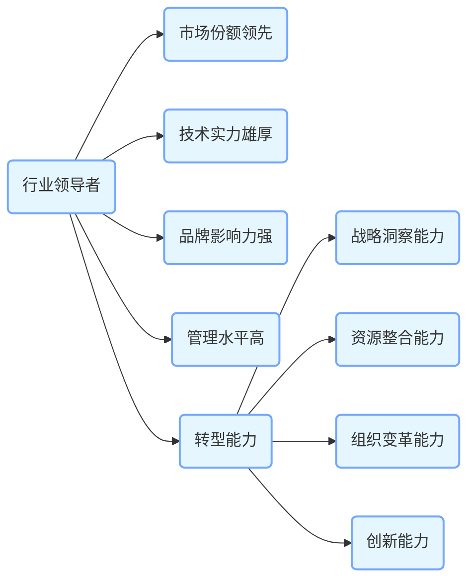

# 彼得林奇的"行业领导者"转型能力评估

> 关键词：彼得林奇、行业领导者、转型能力评估、投资分析、企业战略

> 摘要：本文围绕彼得林奇提出的“行业领导者”转型能力评估展开深入探讨。彼得林奇作为投资界的传奇人物，其对行业领导者的研究和评估方法具有重要的参考价值。文章首先介绍了研究的背景、目的、预期读者、文档结构及相关术语。接着阐述了核心概念与联系，包括行业领导者的定义、转型能力的内涵以及它们之间的关系，并通过示意图和流程图进行直观展示。详细讲解了评估转型能力的核心算法原理及具体操作步骤，给出了Python源代码示例。同时，运用数学模型和公式对评估方法进行了理论支持，并举例说明。通过项目实战，搭建开发环境，实现并解读了相关代码。分析了该评估方法在实际投资、企业战略规划等场景中的应用。推荐了学习、开发工具以及相关论文著作等资源。最后总结了未来发展趋势与挑战，解答了常见问题，并提供了扩展阅读和参考资料，旨在为投资者和企业管理者提供全面、深入的“行业领导者”转型能力评估的知识体系和实践指导。

## 1. 背景介绍 
### 1.1 目的和范围
彼得林奇是投资领域的杰出代表，他的投资理念和方法影响了无数投资者。“行业领导者”在市场中具有重要地位，其转型能力对于企业的持续发展和投资者的收益至关重要。本文的目的在于深入剖析彼得林奇关于“行业领导者”转型能力评估的方法和思路，为投资者提供一种有效的评估工具，帮助他们在投资决策中识别具有转型潜力的行业领导者企业。同时，也为企业管理者提供参考，使其能够更好地评估自身企业的转型能力，制定合理的战略规划。

本文的范围涵盖了“行业领导者”转型能力评估的各个方面，包括核心概念的阐述、评估算法的原理和实现、数学模型的建立、实际案例的分析以及在不同场景中的应用等。

### 1.2 预期读者
本文的预期读者主要包括以下几类人群：
1. **投资者**：无论是个人投资者还是机构投资者，都可以从本文中学习到如何评估行业领导者企业的转型能力，从而做出更明智的投资决策。
2. **企业管理者**：企业管理者可以借鉴本文的评估方法，对自身企业的转型能力进行评估，发现企业在转型过程中存在的问题，制定相应的战略和措施，提高企业的竞争力和可持续发展能力。
3. **金融分析师**：金融分析师可以将本文的评估方法应用到实际的研究工作中，为客户提供更专业的投资建议和分析报告。
4. **学术研究人员**：学术研究人员可以从本文中获取相关的研究思路和方法，开展更深入的学术研究。

### 1.3 文档结构概述
本文的文档结构如下：
1. **背景介绍**：介绍研究的目的、范围、预期读者和文档结构，以及相关术语的定义和解释。
2. **核心概念与联系**：阐述“行业领导者”和“转型能力”的核心概念，分析它们之间的联系，并通过示意图和流程图进行直观展示。
3. **核心算法原理 & 具体操作步骤**：详细讲解评估“行业领导者”转型能力的核心算法原理，给出具体的操作步骤，并提供Python源代码示例。
4. **数学模型和公式 & 详细讲解 & 举例说明**：建立评估“行业领导者”转型能力的数学模型，给出相关的公式，并通过具体的例子进行详细说明。
5. **项目实战：代码实际案例和详细解释说明**：通过一个实际的项目案例，介绍如何搭建开发环境，实现评估“行业领导者”转型能力的代码，并对代码进行详细解读和分析。
6. **实际应用场景**：分析评估“行业领导者”转型能力在实际投资、企业战略规划等场景中的应用。
7. **工具和资源推荐**：推荐学习、开发工具以及相关的论文著作等资源，帮助读者进一步深入学习和研究。
8. **总结：未来发展趋势与挑战**：总结本文的主要内容，分析“行业领导者”转型能力评估的未来发展趋势和面临的挑战。
9. **附录：常见问题与解答**：解答读者在阅读本文过程中可能遇到的常见问题。
10. **扩展阅读 & 参考资料**：提供相关的扩展阅读材料和参考资料，方便读者进一步深入学习和研究。

### 1.4 术语表
#### 1.4.1 核心术语定义
1. **行业领导者**：在某个特定行业中，具有领先的市场份额、技术实力、品牌影响力和管理水平的企业。行业领导者通常在行业中具有较强的竞争力和话语权，能够引领行业的发展方向。
2. **转型能力**：企业在面对市场环境变化、技术创新、竞争压力等因素时，能够及时调整战略、业务模式、组织结构等，实现企业的可持续发展的能力。转型能力包括战略转型能力、业务转型能力、技术转型能力等多个方面。
3. **评估指标**：用于衡量“行业领导者”转型能力的各项指标，如市场份额变化率、技术创新投入率、新产品销售额占比等。
4. **权重**：在评估“行业领导者”转型能力时，为每个评估指标赋予的相对重要性数值。权重的大小反映了该指标在评估中的重要程度。

#### 1.4.2 相关概念解释
1. **战略转型**：企业为了适应市场环境变化和自身发展需要，对企业的战略方向、目标、业务组合等进行重大调整的过程。战略转型通常涉及到企业的长期发展规划和资源配置。
2. **业务转型**：企业在战略转型的指导下，对企业的业务模式、产品或服务、客户群体等进行调整和优化的过程。业务转型旨在提高企业的市场竞争力和盈利能力。
3. **技术转型**：企业为了提高自身的技术水平和创新能力，对企业的技术研发、生产工艺、信息技术等进行升级和改造的过程。技术转型是企业实现可持续发展的重要保障。

#### 1.4.3 缩略词列表
1. **ROI**：Return on Investment，投资回报率。
2. **R&D**：Research and Development，研究与开发。
3. **M&A**：Mergers and Acquisitions，并购。

## 2. 核心概念与联系 
### 核心概念原理
#### 行业领导者
行业领导者是在特定行业中占据主导地位的企业。它们通常具有以下特点：
1. **市场份额领先**：在行业中拥有较大的市场份额，能够对市场价格、产品标准等产生重要影响。
2. **技术实力雄厚**：在技术研发、创新方面具有领先优势，能够不断推出新产品、新技术，提高企业的竞争力。
3. **品牌影响力强**：拥有知名的品牌，消费者对其品牌具有较高的认可度和忠诚度。
4. **管理水平高**：具备先进的管理理念和管理方法，能够有效地组织和协调企业的资源，提高企业的运营效率。

#### 转型能力
转型能力是企业在面对内外部环境变化时，能够及时调整战略、业务模式、组织结构等，实现企业可持续发展的能力。转型能力主要包括以下几个方面：
1. **战略洞察能力**：企业能够敏锐地洞察市场环境变化、技术发展趋势等，及时调整企业的战略方向。
2. **资源整合能力**：企业能够有效地整合内部和外部资源，为转型提供必要的支持。
3. **组织变革能力**：企业能够顺利地推进组织变革，调整组织结构、管理制度等，以适应转型的需要。
4. **创新能力**：企业能够不断地进行技术创新、产品创新、业务模式创新等，提高企业的核心竞争力。

### 核心概念联系
行业领导者的转型能力对于企业的持续发展至关重要。一方面，行业领导者由于其在市场中的领先地位，面临着更大的竞争压力和市场变化的挑战，需要不断地进行转型以保持其领先优势。另一方面，行业领导者具有较强的资源和能力优势，能够更好地实施转型战略。

例如，苹果公司作为智能手机行业的领导者，在面对市场需求变化和技术发展趋势时，不断地进行产品创新和业务模式转型。从最初的iPod音乐播放器到后来的iPhone智能手机，再到如今的Apple Watch智能手表等产品，苹果公司通过不断地转型，保持了其在行业中的领先地位。

### 文本示意图
```plaintext
行业领导者
|
|-- 市场份额领先
|-- 技术实力雄厚
|-- 品牌影响力强
|-- 管理水平高
|
|-- 转型能力
    |
    |-- 战略洞察能力
    |-- 资源整合能力
    |-- 组织变革能力
    |-- 创新能力
```

### Mermaid 流程图


## 3. 核心算法原理 & 具体操作步骤 
### 核心算法原理
评估“行业领导者”的转型能力可以采用多指标综合评估的方法。具体来说，就是选择一系列能够反映企业转型能力的评估指标，为每个指标赋予相应的权重，然后将各指标的得分乘以其权重并求和，得到企业转型能力的综合得分。

假设我们选择了 $n$ 个评估指标 $x_1, x_2, \cdots, x_n$，对应的权重分别为 $w_1, w_2, \cdots, w_n$，且 $\sum_{i=1}^{n} w_i = 1$。企业在第 $i$ 个指标上的得分记为 $s_i$，则企业转型能力的综合得分 $S$ 可以表示为：

$$S = \sum_{i=1}^{n} w_i s_i$$

### 具体操作步骤
1. **确定评估指标**：根据“行业领导者”转型能力的内涵，选择合适的评估指标。例如，可以选择市场份额变化率、技术创新投入率、新产品销售额占比、员工培训投入率等指标。
2. **确定指标权重**：采用专家打分法、层次分析法等方法，确定每个评估指标的权重。
3. **数据收集**：收集企业在各个评估指标上的数据。数据可以来源于企业的财务报表、年度报告、行业研究报告等。
4. **指标得分计算**：根据收集到的数据，计算企业在各个评估指标上的得分。得分的计算方法可以根据指标的性质和特点进行确定。例如，对于市场份额变化率，可以采用以下公式计算得分：

$$s_{市场份额变化率} = \frac{市场份额变化率}{最大市场份额变化率} \times 100$$

5. **综合得分计算**：将各指标的得分乘以其权重并求和，得到企业转型能力的综合得分。

### Python 源代码示例
```python
# 评估指标列表
indicators = ['市场份额变化率', '技术创新投入率', '新产品销售额占比', '员工培训投入率']

# 指标权重列表
weights = [0.3, 0.25, 0.2, 0.25]

# 企业在各指标上的得分列表
scores = [80, 70, 75, 85]

# 计算综合得分
def calculate_composite_score(weights, scores):
    composite_score = 0
    for i in range(len(weights)):
        composite_score += weights[i] * scores[i]
    return composite_score

# 调用函数计算综合得分
composite_score = calculate_composite_score(weights, scores)

print(f"企业转型能力的综合得分: {composite_score}")
```

## 4. 数学模型和公式 & 详细讲解 & 举例说明 
### 数学模型
我们可以将评估“行业领导者”转型能力的问题抽象为一个线性加权模型。设 $X = [x_1, x_2, \cdots, x_n]^T$ 为评估指标向量，$W = [w_1, w_2, \cdots, w_n]^T$ 为权重向量，$S$ 为企业转型能力的综合得分，则数学模型可以表示为：

$$S = W^T X = \sum_{i=1}^{n} w_i x_i$$

### 公式详细讲解
- $x_i$：表示企业在第 $i$ 个评估指标上的得分。得分的计算需要根据指标的具体含义和数据特点进行确定。例如，对于市场份额变化率指标，如果企业的市场份额变化率为 $5\%$，最大市场份额变化率为 $10\%$，则该指标的得分可以计算为：

$$x_{市场份额变化率} = \frac{5\%}{10\%} \times 100 = 50$$

- $w_i$：表示第 $i$ 个评估指标的权重。权重的确定需要综合考虑各指标在评估中的重要程度，可以采用专家打分法、层次分析法等方法进行确定。
- $S$：表示企业转型能力的综合得分。综合得分越高，说明企业的转型能力越强。

### 举例说明
假设我们选择了三个评估指标：市场份额变化率、技术创新投入率、新产品销售额占比，对应的权重分别为 $0.4$、$0.3$、$0.3$。某企业在这三个指标上的得分分别为 $60$、$70$、$80$。则该企业转型能力的综合得分可以计算为：

$$S = 0.4 \times 60 + 0.3 \times 70 + 0.3 \times 80$$
$$S = 24 + 21 + 24$$
$$S = 69$$

这表明该企业的转型能力综合得分为 $69$ 分，可以根据这个得分对该企业的转型能力进行评估和比较。

## 5. 项目实战：代码实际案例和详细解释说明 
### 5.1  开发环境搭建
#### 操作系统
可以选择 Windows、Linux 或 macOS 操作系统。

#### Python 环境
安装 Python 3.x 版本，可以从 Python 官方网站（https://www.python.org/downloads/） 下载并安装。

#### 开发工具
可以选择 PyCharm、Jupyter Notebook 等开发工具。这里以 Jupyter Notebook 为例，安装方法如下：
1. 打开命令行工具，输入以下命令安装 Jupyter Notebook：

```sh
pip install jupyter notebook
```

2. 安装完成后，在命令行中输入以下命令启动 Jupyter Notebook：

```sh
jupyter notebook
```

### 5.2  源代码详细实现和代码解读
```python
import pandas as pd

# 定义评估指标列表
indicators = ['市场份额变化率', '技术创新投入率', '新产品销售额占比', '员工培训投入率']

# 定义指标权重列表
weights = [0.3, 0.25, 0.2, 0.25]

# 模拟企业数据
data = {
    '企业名称': ['企业 A', '企业 B', '企业 C'],
    '市场份额变化率': [0.05, 0.03, 0.07],
    '技术创新投入率': [0.1, 0.08, 0.12],
    '新产品销售额占比': [0.2, 0.15, 0.25],
    '员工培训投入率': [0.05, 0.06, 0.04]
}

# 创建 DataFrame
df = pd.DataFrame(data)

# 计算各指标得分
max_values = df[indicators].max()
df[indicators] = df[indicators].apply(lambda x: (x / max_values) * 100)

# 计算综合得分
def calculate_composite_score(row):
    score = 0
    for i in range(len(indicators)):
        score += weights[i] * row[indicators[i]]
    return score

df['综合得分'] = df.apply(calculate_composite_score, axis=1)

# 输出结果
print(df[['企业名称', '综合得分']])
```

### 代码解读与分析
1. **导入必要的库**：使用 `import pandas as pd` 导入 Pandas 库，用于数据处理和分析。
2. **定义评估指标和权重**：定义了四个评估指标和对应的权重。
3. **模拟企业数据**：使用字典 `data` 模拟了三个企业在各评估指标上的数据，并创建了 Pandas DataFrame `df`。
4. **计算各指标得分**：通过 `max_values = df[indicators].max()` 计算各指标的最大值，然后使用 `df[indicators].apply(lambda x: (x / max_values) * 100)` 将各指标的数据转换为得分。
5. **计算综合得分**：定义了 `calculate_composite_score` 函数，用于计算每个企业的综合得分。通过 `df.apply(calculate_composite_score, axis=1)` 将该函数应用到 DataFrame 的每一行，得到每个企业的综合得分，并添加到 DataFrame 中。
6. **输出结果**：使用 `print(df[['企业名称', '综合得分']])` 输出每个企业的名称和综合得分。

通过这个项目实战，我们可以看到如何使用 Python 和 Pandas 库来实现“行业领导者”转型能力的评估。

## 6. 实际应用场景 
### 投资决策
投资者在选择投资标的时，可以使用“行业领导者”转型能力评估方法来筛选具有转型潜力的企业。对于转型能力较强的企业，其在未来市场竞争中更有可能保持领先地位，获得较高的投资回报率。例如，投资者可以关注那些在技术创新、业务模式转型等方面表现出色的行业领导者企业，将其纳入投资组合。

### 企业战略规划
企业管理者可以使用该评估方法对自身企业的转型能力进行评估，发现企业在转型过程中存在的问题和不足，制定相应的战略和措施。例如，如果企业在技术创新投入率方面得分较低，说明企业在技术研发方面可能存在不足，企业管理者可以加大技术研发投入，提高企业的技术创新能力。

### 行业研究
行业研究人员可以使用该评估方法对行业内的企业进行评估和比较，分析行业的发展趋势和竞争格局。通过对不同企业转型能力的评估，研究人员可以发现行业内的领先企业和具有潜力的企业，为行业发展提供参考和建议。

## 7. 工具和资源推荐
### 7.1 学习资源推荐
#### 7.1.1 书籍推荐
1. 《彼得林奇的成功投资》：彼得林奇的经典著作，介绍了他的投资理念和方法，对于理解“行业领导者”的评估具有重要的参考价值。
2. 《竞争战略》：迈克尔·波特的经典著作，阐述了企业竞争战略的基本理论和方法，对于理解企业转型能力的重要性和评估方法具有重要的启示作用。
3. 《创新者的窘境》：克莱顿·克里斯坦森的著作，探讨了企业在面对技术创新和市场变化时的转型问题，对于理解企业转型的挑战和机遇具有重要的参考价值。

#### 7.1.2 在线课程
1. Coursera 上的“投资学原理”课程：介绍了投资的基本原理和方法，包括股票投资、债券投资等，对于投资者和金融分析师具有重要的学习价值。
2. edX 上的“企业战略管理”课程：介绍了企业战略管理的基本理论和方法，包括战略分析、战略制定、战略实施等，对于企业管理者和行业研究人员具有重要的学习价值。

#### 7.1.3 技术博客和网站
1. 雪球网：国内知名的投资社区，提供了丰富的股票分析、投资策略等内容，对于投资者具有重要的参考价值。
2. 36氪：国内知名的科技媒体，提供了大量的科技行业动态、企业创新案例等内容，对于关注企业转型和创新的读者具有重要的参考价值。

### 7.2 开发工具框架推荐
#### 7.2.1 IDE和编辑器
1. PyCharm：一款专业的 Python 集成开发环境，具有代码编辑、调试、版本控制等功能，适合开发 Python 项目。
2. Jupyter Notebook：一款基于 Web 的交互式开发环境，支持 Python、R 等多种编程语言，适合进行数据分析和机器学习实验。

#### 7.2.2 调试和性能分析工具
1. PySnooper：一个简单易用的 Python 调试工具，可以自动记录函数的调用过程和变量的值，方便调试代码。
2. cProfile：Python 内置的性能分析工具，可以分析代码的运行时间和函数调用次数，帮助优化代码性能。

#### 7.2.3 相关框架和库
1. Pandas：一个强大的 Python 数据处理和分析库，提供了 DataFrame、Series 等数据结构，方便进行数据清洗、转换和分析。
2. NumPy：一个用于科学计算的 Python 库，提供了多维数组对象和各种数学函数，方便进行数值计算。

### 7.3 相关论文著作推荐
#### 7.3.1 经典论文
1. “Competitive Advantage: Creating and Sustaining Superior Performance” by Michael E. Porter：该论文阐述了企业竞争优势的来源和维持方法，对于理解企业转型和竞争战略具有重要的理论基础。
2. “The Innovator's Dilemma: When New Technologies Cause Great Firms to Fail” by Clayton M. Christensen：该论文提出了“颠覆性创新”的概念，探讨了企业在面对新技术时的转型困境和应对策略。

#### 7.3.2 最新研究成果
可以关注《Management Science》、《Strategic Management Journal》等顶级管理学期刊，了解关于企业转型能力评估的最新研究成果。

#### 7.3.3 应用案例分析
可以阅读《哈佛商业评论》、《麻省理工斯隆管理评论》等商业杂志，获取关于企业转型的实际案例分析，学习其他企业的成功经验和失败教训。

## 8. 总结：未来发展趋势与挑战
### 未来发展趋势
1. **数字化转型加速**：随着信息技术的快速发展，行业领导者将更加注重数字化转型，通过引入大数据、人工智能、区块链等技术，提高企业的运营效率和创新能力。
2. **跨界融合加剧**：行业领导者将越来越多地进行跨界融合，通过并购、合作等方式进入其他行业，拓展企业的业务领域和市场空间。
3. **可持续发展成为关键**：随着社会对环境保护、社会责任等问题的关注度不断提高，行业领导者将更加注重可持续发展，将可持续发展理念融入企业的战略和运营中。

### 挑战
1. **技术变革快速**：信息技术的快速发展使得技术变革的速度越来越快，行业领导者需要不断地进行技术创新和转型，以适应市场的变化。
2. **竞争加剧**：随着全球化的发展和市场竞争的加剧，行业领导者面临着来自国内外企业的激烈竞争，需要不断地提高自身的竞争力。
3. **人才短缺**：数字化转型和创新需要大量的高素质人才，行业领导者面临着人才短缺的问题，需要加强人才培养和引进。

## 9. 附录：常见问题与解答
### 问题 1：如何确定评估指标的权重？
答：可以采用专家打分法、层次分析法等方法确定评估指标的权重。专家打分法是邀请相关领域的专家对各指标的重要程度进行打分，然后取平均值作为权重。层次分析法是一种系统分析方法，通过构建层次结构模型，比较各指标之间的相对重要性，确定权重。

### 问题 2：评估指标的选择是否有固定的标准？
答：评估指标的选择没有固定的标准，需要根据具体的行业特点、企业情况和评估目的进行确定。一般来说，评估指标应该能够反映企业的转型能力，具有可操作性和可比性。

### 问题 3：该评估方法是否适用于所有行业？
答：该评估方法的基本原理适用于大多数行业，但在具体应用时需要根据行业特点进行调整。不同行业的市场环境、技术发展趋势、竞争格局等都有所不同，因此评估指标和权重的选择也会有所差异。

## 10. 扩展阅读 & 参考资料
### 扩展阅读
1. 《从0到1：开启商业与未来的秘密》：介绍了创业和创新的理念和方法，对于理解企业转型和创新具有重要的参考价值。
2. 《精益创业》：介绍了精益创业的理念和方法，帮助企业快速验证商业模式，提高创业成功率。

### 参考资料
1. Lynch, Peter. One Up on Wall Street: How to Use What You Already Know to Make Money in the Market. Simon & Schuster, 1989.
2. Porter, Michael E. Competitive Strategy: Techniques for Analyzing Industries and Competitors. Free Press, 1980.
3. Christensen, Clayton M. The Innovator's Dilemma: When New Technologies Cause Great Firms to Fail. Harvard Business School Press, 1997.

作者：AI天才研究院/AI Genius Institute & 禅与计算机程序设计艺术 /Zen And The Art of Computer Programming