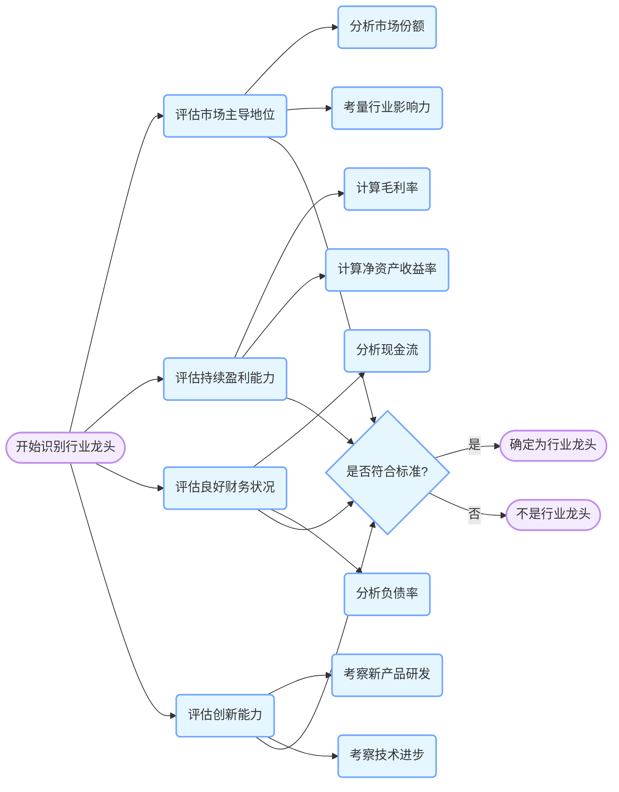

# 彼得林奇的"行业龙头"识别方法

> 关键词：彼得林奇、行业龙头、识别方法、财务指标、市场竞争力

> 摘要：本文深入探讨了彼得林奇的“行业龙头”识别方法。彼得林奇作为投资界的传奇人物，其识别行业龙头的方法对于投资者具有重要的指导意义。文章首先介绍了研究该方法的背景，包括目的、预期读者等内容。接着阐述了与行业龙头相关的核心概念及其联系，详细讲解了核心算法原理和具体操作步骤，并运用数学模型和公式进行深入分析，同时给出举例说明。通过项目实战部分的代码案例，让读者更直观地理解如何应用这些方法。此外，还介绍了该方法在实际中的应用场景，推荐了相关的学习资源、开发工具框架以及论文著作。最后对未来发展趋势与挑战进行总结，并给出常见问题解答和扩展阅读参考资料，旨在帮助读者全面掌握彼得林奇的“行业龙头”识别方法，提升投资决策能力。

## 1. 背景介绍 
### 1.1 目的和范围
彼得林奇是投资领域的杰出代表，他在投资生涯中取得了惊人的业绩。研究他的“行业龙头”识别方法，目的在于帮助投资者准确地识别各行业中的领先企业，为投资决策提供有力依据。本文章的范围涵盖了彼得林奇识别行业龙头所涉及的各个方面，包括相关概念、识别的算法原理、实际应用场景等内容，旨在全面且深入地剖析这一方法。

### 1.2 预期读者
本文的预期读者主要包括对股票投资感兴趣的个人投资者，他们希望通过学习专业的投资方法来提升自己的投资水平；金融行业的从业者，如分析师、基金经理等，他们需要不断更新知识体系，以更好地服务客户和进行投资管理；以及正在学习金融、投资相关专业的学生，为他们提供实际应用的案例和理论支持。

### 1.3 文档结构概述
本文将按照以下结构展开：首先介绍核心概念与联系，让读者对行业龙头及相关概念有清晰的认识；接着详细阐述核心算法原理和具体操作步骤，包括如何运用财务指标等进行分析；然后通过数学模型和公式对识别方法进行进一步的解释和举例说明；再通过项目实战部分，展示代码实际案例并进行详细解释；之后介绍该方法在实际中的应用场景；推荐相关的工具和资源；最后进行总结，探讨未来发展趋势与挑战，给出常见问题解答和扩展阅读参考资料。

### 1.4 术语表
#### 1.4.1 核心术语定义
- **行业龙头**：指在某个行业中，在市场份额、技术实力、品牌影响力、管理水平等方面处于领先地位，对行业的发展具有重要引领和示范作用的企业。
- **市场份额**：企业的产品或服务在市场同类产品或服务中所占的比例，反映了企业在市场中的竞争地位。
- **净资产收益率（ROE）**：净利润与平均股东权益的百分比，用以衡量公司运用自有资本的效率。
- **毛利率**：毛利与销售收入（或营业收入）的百分比，反映了企业产品或服务的盈利能力。

#### 1.4.2 相关概念解释
- **护城河**：这是巴菲特提出的概念，指企业具有的一种可持续的竞争优势，能够保护企业免受竞争对手的侵蚀，类似于城堡周围的护城河保护城堡一样。在识别行业龙头时，护城河是一个重要的考量因素，如品牌优势、技术专利、成本优势等都可以构成企业的护城河。
- **自由现金流**：企业经营活动产生的现金流量扣除资本性支出后的余额，它反映了企业实际可支配的现金数量，对于评估企业的财务健康状况和可持续发展能力具有重要意义。

#### 1.4.3 缩略词列表
- **ROE**：净资产收益率（Return on Equity）
- **EPS**：每股收益（Earnings Per Share）

## 2. 核心概念与联系 
### 核心概念原理
彼得林奇认为，行业龙头企业通常具有以下几个关键特征：
- **市场主导地位**：行业龙头企业往往占据较大的市场份额，能够在市场竞争中获得更多的资源和优势。例如，在智能手机行业，苹果公司凭借其强大的品牌影响力和创新能力，占据了高端智能手机市场的较大份额。
- **持续的盈利能力**：通过高毛利率和高净资产收益率等指标来体现。高毛利率意味着企业在产品或服务的定价上具有优势，能够获得较高的利润空间；高净资产收益率则表明企业能够有效地利用股东投入的资本创造利润。
- **良好的财务状况**：包括充足的现金流、较低的负债率等。充足的现金流可以保证企业在面临各种风险时能够维持正常的运营，而较低的负债率则降低了企业的财务风险。
- **创新能力**：能够不断推出新产品、新技术，满足市场需求的变化。例如，特斯拉在电动汽车领域不断进行技术创新，推动了整个行业的发展。

### 架构的文本示意图
```plaintext
行业龙头识别
|-- 市场主导地位
|   |-- 市场份额
|   |-- 行业影响力
|-- 持续盈利能力
|   |-- 毛利率
|   |-- 净资产收益率
|-- 良好财务状况
|   |-- 现金流
|   |-- 负债率
|-- 创新能力
|   |-- 新产品研发
|   |-- 技术进步
```

### Mermaid 流程图


## 3. 核心算法原理 & 具体操作步骤 
### 核心算法原理
彼得林奇识别行业龙头的核心算法原理是综合考虑多个财务指标和非财务指标，通过对这些指标的分析和比较，来判断企业是否具备行业龙头的特征。以下是主要指标的计算方法和原理：

#### 毛利率
毛利率的计算公式为：
$$毛利率 = \frac{销售收入 - 销售成本}{销售收入} \times 100\%$$
毛利率反映了企业产品或服务的初始盈利能力。较高的毛利率意味着企业在扣除成本后能够获得更多的利润，说明企业的产品或服务具有一定的竞争优势，可能是由于品牌、技术、成本控制等因素导致的。

#### 净资产收益率（ROE）
净资产收益率的计算公式为：
$$ROE = \frac{净利润}{平均股东权益} \times 100\%$$
ROE衡量了企业运用自有资本的效率，反映了股东权益的收益水平。较高的ROE表明企业能够有效地利用股东投入的资本创造利润，具有较强的盈利能力和管理水平。

#### 市场份额
市场份额的计算公式为：
$$市场份额 = \frac{企业的销售额}{行业总销售额} \times 100\%$$
市场份额反映了企业在市场中的竞争地位。较大的市场份额意味着企业在行业中具有更强的话语权和影响力，能够获得更多的资源和优势。

### 具体操作步骤
#### 步骤1：收集数据
收集目标企业和同行业其他企业的财务报表、市场数据等信息，包括销售收入、销售成本、净利润、股东权益、销售额等。

#### 步骤2：计算关键指标
根据上述公式，计算目标企业和同行业其他企业的毛利率、ROE、市场份额等指标。

#### 步骤3：比较分析
将目标企业的指标与同行业其他企业进行比较，分析目标企业在各指标上的表现。如果目标企业在多个指标上都表现优异，如毛利率高于行业平均水平、ROE较高、市场份额较大等，则说明目标企业具有成为行业龙头的潜力。

#### 步骤4：综合评估
除了财务指标外，还需要考虑企业的非财务指标，如创新能力、品牌影响力、管理水平等。综合考虑所有因素，对目标企业是否为行业龙头进行最终评估。

### Python源代码实现
```python
import pandas as pd

# 定义计算毛利率的函数
def calculate_gross_margin(revenue, cost_of_goods_sold):
    return ((revenue - cost_of_goods_sold) / revenue) * 100

# 定义计算净资产收益率的函数
def calculate_roe(net_income, average_shareholders_equity):
    return (net_income / average_shareholders_equity) * 100

# 定义计算市场份额的函数
def calculate_market_share(company_sales, industry_total_sales):
    return (company_sales / industry_total_sales) * 100

# 示例数据
data = {
    '公司名称': ['企业A', '企业B', '企业C'],
    '销售收入': [1000, 800, 600],
    '销售成本': [600, 500, 400],
    '净利润': [200, 150, 100],
    '平均股东权益': [1000, 800, 600],
    '公司销售额': [1000, 800, 600],
    '行业总销售额': [3000, 3000, 3000]
}

df = pd.DataFrame(data)

# 计算毛利率
df['毛利率'] = calculate_gross_margin(df['销售收入'], df['销售成本'])

# 计算净资产收益率
df['净资产收益率'] = calculate_roe(df['净利润'], df['平均股东权益'])

# 计算市场份额
df['市场份额'] = calculate_market_share(df['公司销售额'], df['行业总销售额'])

# 输出结果
print(df)
```
在上述代码中，首先定义了计算毛利率、净资产收益率和市场份额的函数。然后创建了一个包含示例数据的DataFrame，调用定义的函数计算各指标，并将结果添加到DataFrame中，最后输出结果。

## 4. 数学模型和公式 & 详细讲解 & 举例说明 
### 毛利率公式讲解
$$毛利率 = \frac{销售收入 - 销售成本}{销售收入} \times 100\%$$
毛利率反映了企业产品或服务在扣除直接成本后所剩余的利润空间。销售收入是企业通过销售产品或提供服务所获得的收入，销售成本则是生产或提供这些产品或服务所直接发生的成本，如原材料成本、生产工人工资等。

举例说明：假设企业A的销售收入为1000万元，销售成本为600万元，则该企业的毛利率为：
$$毛利率 = \frac{1000 - 600}{1000} \times 100\% = 40\%$$
这意味着企业A在扣除销售成本后，每销售100元的产品或服务，能够获得40元的毛利。

### 净资产收益率公式讲解
$$ROE = \frac{净利润}{平均股东权益} \times 100\%$$
ROE衡量了企业运用股东投入的资本创造利润的能力。净利润是企业在一定时期内的经营成果，平均股东权益是股东在企业中所拥有的权益的平均值。

举例说明：假设企业B的净利润为200万元，平均股东权益为1000万元，则该企业的ROE为：
$$ROE = \frac{200}{1000} \times 100\% = 20\%$$
这表明企业B每使用100元的股东权益，能够创造20元的净利润。

### 市场份额公式讲解
$$市场份额 = \frac{企业的销售额}{行业总销售额} \times 100\%$$
市场份额反映了企业在整个行业中的竞争地位。企业的销售额是企业在一定时期内销售产品或服务所获得的收入，行业总销售额则是整个行业在同一时期内的销售总收入。

举例说明：假设企业C的销售额为500万元，行业总销售额为2000万元，则该企业的市场份额为：
$$市场份额 = \frac{500}{2000} \times 100\% = 25\%$$
这说明企业C在该行业中占据了25%的市场份额。

### 综合分析举例
假设我们有三家企业A、B、C，相关数据如下表所示：

| 企业名称 | 销售收入（万元） | 销售成本（万元） | 净利润（万元） | 平均股东权益（万元） | 公司销售额（万元） | 行业总销售额（万元） |
| ---- | ---- | ---- | ---- | ---- | ---- | ---- |
| 企业A | 1000 | 600 | 200 | 1000 | 1000 | 3000 |
| 企业B | 800 | 500 | 150 | 800 | 800 | 3000 |
| 企业C | 600 | 400 | 100 | 600 | 600 | 3000 |

首先计算各企业的毛利率：
- 企业A：$$毛利率_A = \frac{1000 - 600}{1000} \times 100\% = 40\%$$
- 企业B：$$毛利率_B = \frac{800 - 500}{800} \times 100\% = 37.5\%$$
- 企业C：$$毛利率_C = \frac{600 - 400}{600} \times 100\% \approx 33.3\%$$

然后计算各企业的ROE：
- 企业A：$$ROE_A = \frac{200}{1000} \times 100\% = 20\%$$
- 企业B：$$ROE_B = \frac{150}{800} \times 100\% = 18.75\%$$
- 企业C：$$ROE_C = \frac{100}{600} \times 100\% \approx 16.67\%$$

最后计算各企业的市场份额：
- 企业A：$$市场份额_A = \frac{1000}{3000} \times 100\% \approx 33.3\%$$
- 企业B：$$市场份额_B = \frac{800}{3000} \times 100\% \approx 26.7\%$$
- 企业C：$$市场份额_C = \frac{600}{3000} \times 100\% = 20\%$$

从以上计算结果可以看出，企业A在毛利率、ROE和市场份额方面都表现最优，因此企业A更有可能是行业龙头。

## 5. 项目实战：代码实际案例和详细解释说明 
### 5.1  开发环境搭建
#### 安装Python
首先需要安装Python环境，建议使用Python 3.7及以上版本。可以从Python官方网站（https://www.python.org/downloads/）下载对应的安装包，按照安装向导进行安装。

#### 安装必要的库
在本项目中，需要使用`pandas`库进行数据处理和分析。可以使用以下命令进行安装：
```sh
pip install pandas
```

### 5.2  源代码详细实现和代码解读
```python
import pandas as pd

# 定义计算毛利率的函数
def calculate_gross_margin(revenue, cost_of_goods_sold):
    """
    该函数用于计算毛利率
    :param revenue: 销售收入
    :param cost_of_goods_sold: 销售成本
    :return: 毛利率
    """
    return ((revenue - cost_of_goods_sold) / revenue) * 100

# 定义计算净资产收益率的函数
def calculate_roe(net_income, average_shareholders_equity):
    """
    该函数用于计算净资产收益率
    :param net_income: 净利润
    :param average_shareholders_equity: 平均股东权益
    :return: 净资产收益率
    """
    return (net_income / average_shareholders_equity) * 100

# 定义计算市场份额的函数
def calculate_market_share(company_sales, industry_total_sales):
    """
    该函数用于计算市场份额
    :param company_sales: 企业的销售额
    :param industry_total_sales: 行业总销售额
    :return: 市场份额
    """
    return (company_sales / industry_total_sales) * 100

# 读取数据文件，假设数据存储在CSV文件中
data = pd.read_csv('industry_data.csv')

# 计算毛利率
data['毛利率'] = calculate_gross_margin(data['销售收入'], data['销售成本'])

# 计算净资产收益率
data['净资产收益率'] = calculate_roe(data['净利润'], data['平均股东权益'])

# 计算市场份额
data['市场份额'] = calculate_market_share(data['公司销售额'], data['行业总销售额'])

# 按照毛利率、净资产收益率和市场份额进行排序
sorted_data = data.sort_values(by=['毛利率', '净资产收益率', '市场份额'], ascending=False)

# 输出排名前五的企业
top_five = sorted_data.head(5)
print(top_five)
```

### 5.3  代码解读与分析
#### 函数定义部分
- `calculate_gross_margin`函数：接受销售收入和销售成本作为参数，根据毛利率的计算公式返回毛利率。
- `calculate_roe`函数：接受净利润和平均股东权益作为参数，根据净资产收益率的计算公式返回ROE。
- `calculate_market_share`函数：接受企业的销售额和行业总销售额作为参数，根据市场份额的计算公式返回市场份额。

#### 数据读取部分
使用`pandas`的`read_csv`函数读取存储在CSV文件中的数据，假设数据文件名为`industry_data.csv`。

#### 指标计算部分
调用定义的函数分别计算毛利率、净资产收益率和市场份额，并将结果添加到DataFrame中。

#### 排序和输出部分
使用`sort_values`函数按照毛利率、净资产收益率和市场份额进行排序，降序排列。然后使用`head`函数选取排名前五的企业并输出。

通过以上代码，我们可以对行业内的企业进行综合评估，找出在毛利率、ROE和市场份额方面表现较好的企业，这些企业更有可能是行业龙头。

## 6. 实际应用场景 
### 股票投资
投资者可以运用彼得林奇的“行业龙头”识别方法来筛选具有投资价值的股票。投资行业龙头企业通常具有较高的安全性和潜在的收益。因为行业龙头企业在市场竞争中具有优势，能够更好地抵御市场风险，并且随着行业的发展，它们往往能够获得更多的市场份额和利润增长。例如，在科技行业，苹果、微软等行业龙头企业的股票长期以来表现优异，为投资者带来了丰厚的回报。

### 行业研究
对于行业分析师来说，识别行业龙头企业有助于深入了解行业的竞争格局和发展趋势。通过对行业龙头企业的研究，可以发现行业的技术创新方向、市场需求变化等信息，为行业研究提供重要的参考。例如，通过研究特斯拉在电动汽车行业的发展，可以了解到电动汽车技术的发展趋势、消费者对电动汽车的需求特点等。

### 企业战略规划
企业在制定战略规划时，可以参考行业龙头企业的发展模式和竞争策略。学习行业龙头企业的成功经验，有助于企业提升自身的竞争力，制定更加合理的发展战略。例如，一些新兴的电商企业可以学习阿里巴巴、京东等行业龙头企业的运营模式、市场营销策略等，来提升自己在市场中的地位。

### 风险评估
金融机构在进行贷款、投资等业务时，可以运用该方法评估企业的风险。行业龙头企业通常具有较强的财务实力和市场竞争力，违约风险相对较低。因此，金融机构可以更倾向于为行业龙头企业提供贷款或进行投资，降低自身的风险。

## 7. 工具和资源推荐
### 7.1 学习资源推荐
#### 7.1.1 书籍推荐
- 《彼得林奇的成功投资》：彼得林奇的经典著作，详细介绍了他的投资理念和方法，包括如何识别行业龙头企业等内容。
- 《聪明的投资者》：本杰明·格雷厄姆的经典投资书籍，对价值投资理念进行了深入阐述，对于理解行业龙头企业的投资价值具有重要意义。
- 《财务报表分析与股票估值》：帮助读者掌握如何通过分析企业的财务报表来评估企业的价值，是运用彼得林奇方法进行投资分析的重要参考书籍。

#### 7.1.2 在线课程
- Coursera上的“投资学原理”课程：由知名大学的教授授课，系统地介绍了投资学的基本原理和方法，包括行业分析和企业估值等内容。
- 网易云课堂上的“股票投资实战技巧”课程：结合实际案例，讲解股票投资的技巧和方法，对于学习如何识别行业龙头企业有很大的帮助。

#### 7.1.3 技术博客和网站
- 雪球网：一个专注于股票投资的社区，汇聚了众多投资者和行业专家，提供了丰富的行业分析、企业研究等内容。
- 东方财富网：提供全面的金融信息和数据，包括股票行情、财务报表、行业分析等，是投资者进行研究的重要工具。

### 7.2 开发工具框架推荐
#### 7.2.1 IDE和编辑器
- PyCharm：一款专业的Python集成开发环境，提供了丰富的代码编辑、调试、代码分析等功能，适合用于开发与投资分析相关的Python程序。
- Jupyter Notebook：一种交互式的开发环境，非常适合进行数据探索和分析。可以方便地编写和运行Python代码，同时展示代码的运行结果和可视化图表。

#### 7.2.2 调试和性能分析工具
- pdb：Python自带的调试工具，可以帮助开发者逐行调试代码，找出代码中的错误。
- cProfile：Python的性能分析工具，可以分析代码的运行时间和函数调用情况，帮助开发者优化代码性能。

#### 7.2.3 相关框架和库
- pandas：用于数据处理和分析的强大库，提供了DataFrame等数据结构，方便进行数据的读取、清洗、计算和分析。
- numpy：用于科学计算的基础库，提供了高效的数组操作和数学函数，在数据处理和分析中经常使用。
- matplotlib：用于数据可视化的库，可以绘制各种类型的图表，如折线图、柱状图、散点图等，帮助开发者直观地展示数据。

### 7.3 相关论文著作推荐
#### 7.3.1 经典论文
- 《有效市场假说》：该论文提出了有效市场假说，对股票市场的有效性进行了深入探讨，对于理解行业龙头企业的股价表现具有重要意义。
- 《资本资产定价模型》：介绍了资本资产定价模型，用于评估资产的预期收益率和风险，是投资分析中的重要理论基础。

#### 7.3.2 最新研究成果
- 可以关注《金融研究》、《管理世界》等国内权威金融和管理期刊，以及《Journal of Finance》、《Review of Financial Studies》等国际知名金融期刊，获取关于行业龙头企业识别和投资分析的最新研究成果。

#### 7.3.3 应用案例分析
- 一些专业的金融研究机构和咨询公司会发布关于行业龙头企业的应用案例分析报告，可以通过它们的官方网站或相关数据库获取这些报告，学习实际案例中的分析方法和经验。

## 8. 总结：未来发展趋势与挑战
### 未来发展趋势
#### 科技驱动行业龙头的变革
随着科技的不断进步，新兴技术如人工智能、大数据、区块链等将对各行业产生深远影响。行业龙头企业需要不断投入研发，利用新技术提升自身的竞争力。例如，传统制造业的龙头企业可能会通过引入智能制造技术，提高生产效率和产品质量；金融行业的龙头企业可能会利用区块链技术改善支付结算、风险管理等业务流程。

#### 全球化竞争加剧
在全球化的背景下，行业龙头企业将面临来自全球范围内的竞争。企业需要拓展国际市场，加强国际合作，以应对日益激烈的竞争。同时，不同国家和地区的政策、文化、市场环境等差异也给企业带来了新的挑战和机遇。

#### 可持续发展成为重要考量
消费者和投资者对企业的可持续发展越来越关注。行业龙头企业需要在经济、社会和环境等方面实现可持续发展，才能赢得市场和社会的认可。例如，企业需要加强环境保护、推动社会责任实践、提高产品的可持续性等。

### 挑战
#### 技术创新压力
科技发展日新月异，行业龙头企业需要不断进行技术创新，以保持领先地位。然而，技术创新需要大量的资金投入和高素质的人才支持，这对企业来说是一个巨大的挑战。如果企业不能及时跟上技术发展的步伐，可能会被竞争对手超越。

#### 市场不确定性增加
全球经济形势的不确定性、政策法规的变化、市场需求的波动等因素都给行业龙头企业带来了市场风险。企业需要具备较强的市场敏感度和应对能力，及时调整战略，以适应市场的变化。

#### 人才竞争激烈
在知识经济时代，人才是企业最重要的资产。行业龙头企业需要吸引和留住优秀的人才，以支持企业的创新和发展。然而，人才市场的竞争非常激烈，企业需要提供有竞争力的薪酬待遇、良好的工作环境和发展机会，才能吸引到顶尖人才。

## 9. 附录：常见问题与解答
### 问题1：如何确定数据的准确性？
解答：在收集数据时，应尽量选择权威的数据源，如企业的官方财务报表、证券交易所公布的数据、专业的金融数据提供商等。同时，可以对不同数据源的数据进行交叉验证，以确保数据的准确性。此外，还可以关注数据的更新频率，及时获取最新的数据。

### 问题2：除了财务指标，还需要考虑哪些因素来识别行业龙头？
解答：除了财务指标外，还需要考虑企业的创新能力、品牌影响力、管理水平、市场渠道、客户资源等非财务因素。例如，企业的创新能力可以通过专利数量、研发投入等指标来衡量；品牌影响力可以通过品牌知名度、美誉度等指标来评估。

### 问题3：行业龙头企业是否永远具有投资价值？
解答：不是的。行业龙头企业虽然在市场竞争中具有一定的优势，但并不意味着它们永远具有投资价值。市场环境是不断变化的，行业龙头企业可能会面临来自竞争对手的挑战、技术变革的冲击、政策法规的变化等风险。因此，投资者需要持续关注企业的发展动态，及时调整投资策略。

### 问题4：如何比较不同行业的企业是否为行业龙头？
解答：不同行业的企业具有不同的特点和竞争环境，不能简单地进行直接比较。在比较不同行业的企业时，需要结合行业的特点和发展趋势，选择合适的指标进行分析。例如，对于科技行业，可能更注重企业的创新能力和研发投入；对于传统制造业，可能更关注企业的成本控制和生产效率。

## 10. 扩展阅读 & 参考资料
### 扩展阅读
- 《穷查理宝典》：查理·芒格的智慧箴言，介绍了多元思维模型和投资哲学，对于投资者拓展思维方式和提升投资能力具有重要的启发作用。
- 《巴菲特致股东的信》：巴菲特每年写给股东的信，包含了他的投资理念、企业管理经验等内容，是投资者学习价值投资的宝贵资料。

### 参考资料
- 彼得林奇. 《彼得林奇的成功投资》. 机械工业出版社.
- 本杰明·格雷厄姆. 《聪明的投资者》. 人民邮电出版社.
- 斯蒂芬·佩因曼. 《财务报表分析与股票估值》. 中国人民大学出版社.

作者：AI天才研究院/AI Genius Institute & 禅与计算机程序设计艺术 /Zen And The Art of Computer Programming