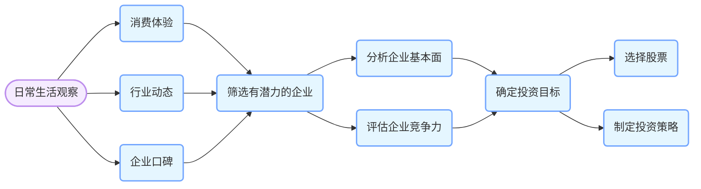

# 彼得林奇的"街头智慧"在投资中的运用

> 关键词：彼得林奇、街头智慧、投资运用、选股策略、市场观察

> 摘要：本文深入探讨了彼得林奇的“街头智慧”在投资领域的运用。首先介绍了彼得林奇及其“街头智慧”的背景，详细阐述了“街头智慧”的核心概念与投资联系。接着分析了基于“街头智慧”的核心选股算法原理及操作步骤，并给出相关数学模型和公式。通过项目实战展示了如何将“街头智慧”应用于实际投资案例。探讨了“街头智慧”在不同场景下的实际应用，推荐了相关学习资源、开发工具和论文著作。最后总结了其未来发展趋势与挑战，解答了常见问题并提供扩展阅读与参考资料，旨在帮助投资者更好地理解和运用“街头智慧”进行投资决策。

## 1. 背景介绍 
### 1.1 目的和范围
本文的目的在于全面剖析彼得林奇的“街头智慧”在投资中的具体运用，帮助投资者掌握一种贴近生活、易于实践的投资方法。通过深入研究“街头智慧”的原理、策略和实际案例，为投资者提供实用的投资思路和决策参考。范围涵盖了“街头智慧”的核心概念、选股算法、数学模型、实际应用场景等多个方面，旨在从理论到实践全方位展示其在投资领域的价值。

### 1.2 预期读者
本文预期读者为广大投资爱好者，包括初涉投资领域的新手，希望通过简单易懂的方法开启投资之旅；也包括有一定投资经验但寻求新投资思路和策略的投资者，以及对投资理论和实践有深入研究兴趣的专业人士。

### 1.3 文档结构概述
本文首先介绍彼得林奇及其“街头智慧”的背景知识，包括相关术语的定义和解释。接着阐述“街头智慧”的核心概念与投资的联系，通过文本示意图和Mermaid流程图进行直观展示。然后详细讲解基于“街头智慧”的核心选股算法原理和具体操作步骤，并给出相应的Python源代码。再介绍相关的数学模型和公式，并举例说明其在投资分析中的应用。通过项目实战，展示“街头智慧”在实际投资中的具体实现和代码解读。探讨“街头智慧”在不同投资场景下的实际应用。推荐学习“街头智慧”相关的工具和资源，包括书籍、在线课程、技术博客、开发工具、框架和论文著作等。最后总结“街头智慧”的未来发展趋势与挑战，解答常见问题并提供扩展阅读与参考资料。

### 1.4 术语表
#### 1.4.1 核心术语定义
- **街头智慧**：彼得林奇提出的一种投资理念，强调投资者可以从日常生活中获取投资线索，通过观察身边的消费趋势、产品需求、企业经营状况等实际情况来发现有潜力的投资机会。
- **成长股**：指发行股票的公司销售额和利润额持续增长，且增长速度快于整个国家及其行业的公司所发行的股票。这类公司通常具有较强的创新能力和市场竞争力，有望在未来实现较高的盈利增长。
- **价值股**：指股价相对于公司的盈利能力、资产价值等基本面指标被低估的股票。投资者购买价值股的目的是期望在公司价值被市场重新发现和认可后，股价能够上涨，从而获得投资收益。
- **PEG指标**：即市盈率相对盈利增长比率，是用公司的市盈率除以公司的盈利增长速度。该指标可以综合考虑公司的估值水平和盈利增长情况，用于评估股票是否具有投资价值。

#### 1.4.2 相关概念解释
- **消费趋势**：指消费者在一定时期内的消费行为和偏好的变化趋势。例如，随着人们健康意识的提高，对健康食品、健身器材等产品的需求可能会增加；随着科技的发展，对智能手机、智能家居等电子产品的需求也在不断增长。消费趋势的变化会影响相关企业的销售额和利润，从而对其股价产生影响。
- **企业经营状况**：包括企业的财务状况、市场份额、产品竞争力、管理水平等多个方面。良好的企业经营状况通常表现为销售收入增长、利润增加、资产负债结构合理、市场份额扩大等。投资者可以通过分析企业的财务报表、行业报告等资料来了解企业的经营状况。

#### 1.4.3 缩略词列表
- **PEG**：Price/Earnings to Growth Ratio（市盈率相对盈利增长比率）
- **PE**：Price-to-Earnings Ratio（市盈率）

## 2. 核心概念与联系 
### 核心概念原理
彼得林奇的“街头智慧”核心原理在于将投资与日常生活紧密结合。投资者作为消费者，每天都会接触到各种产品和服务，这些日常消费体验可以成为发现投资机会的重要线索。例如，当你在商场看到某家餐厅总是人满为患，这可能意味着该餐厅的经营状况良好，背后的餐饮企业可能具有投资价值；当你发现身边越来越多的人使用某品牌的智能手机，说明该品牌在市场上具有较高的受欢迎程度，其所属的科技公司可能值得关注。

这种投资理念的基础是相信普通投资者在日常生活中能够敏锐地察觉到消费趋势和市场变化，而这些信息往往是专业分析师可能忽略的。通过观察身边的事物，投资者可以提前发现具有潜力的企业，从而在股票市场中获得先机。

### 架构的文本示意图
```plaintext
日常生活观察
|
|-- 消费体验（产品受欢迎程度、服务质量等）
|-- 行业动态（新兴行业的出现、传统行业的变革等）
|-- 企业口碑（消费者对企业的评价、品牌知名度等）
|
|-- 筛选有潜力的企业
|   |-- 分析企业基本面（财务状况、市场份额等）
|   |-- 评估企业竞争力（产品优势、技术创新等）
|
|-- 确定投资目标
|   |-- 选择股票（成长股、价值股等）
|   |-- 制定投资策略（长期持有、短期交易等）
```

### Mermaid 流程图


## 3. 核心算法原理 & 具体操作步骤 
### 核心算法原理
基于“街头智慧”的投资选股算法核心在于通过日常生活观察筛选出有潜力的企业，然后运用基本面分析和估值方法对这些企业进行评估，最终确定投资目标。以下是一个简化的选股算法原理：

1. **日常生活观察筛选**：投资者根据自己的日常消费体验和观察，记录下那些产品或服务受欢迎、企业口碑良好的公司。例如，如果你发现某家咖啡店总是顾客盈门，那么这家咖啡店所属的企业就可以列入观察名单。
2. **基本面分析**：对筛选出的企业进行基本面分析，包括查看企业的财务报表，了解其营业收入、净利润、资产负债等情况；分析企业的市场份额、行业地位、竞争优势等。基本面分析的目的是评估企业的经营状况和发展潜力。
3. **估值评估**：运用估值指标对企业进行评估，常用的估值指标有市盈率（PE）、市净率（PB）、PEG等。通过比较企业的估值指标与同行业其他企业以及历史数据，判断企业的股票是否被低估或高估。
4. **综合评估与决策**：综合考虑企业的基本面和估值情况，对企业进行综合评估。如果企业基本面良好且估值合理，那么可以考虑将其作为投资目标；如果企业基本面不佳或估值过高，则应谨慎投资或放弃。

### 具体操作步骤
以下是基于上述算法原理的具体操作步骤：

#### 步骤1：日常生活观察记录
投资者在日常生活中要保持敏锐的观察力，记录下那些引起自己注意的企业。可以使用笔记本或电子表格记录企业的名称、产品或服务特点、观察到的现象等信息。例如：
| 企业名称 | 产品或服务 | 观察现象 |
| ---- | ---- | ---- |
| 星巴克 | 咖啡饮品 | 门店总是人满为患，顾客忠诚度高 |
| 苹果 | 智能手机 | 身边很多人都使用苹果手机，新品发布时关注度高 |

#### 步骤2：基本面分析
使用财经网站（如东方财富网、雪球网等）或证券交易软件，查找筛选出的企业的财务报表和相关信息。以下是一个简单的Python代码示例，用于获取某企业的财务数据：
```python
import pandas as pd
import requests

# 定义获取财务数据的函数
def get_financial_data(ticker):
    url = f"https://api.example.com/financials/{ticker}"  # 假设这是一个获取财务数据的API接口
    response = requests.get(url)
    if response.status_code == 200:
        data = response.json()
        df = pd.DataFrame(data)
        return df
    else:
        print(f"Failed to get financial data for {ticker}")
        return None

# 示例：获取苹果公司（AAPL）的财务数据
ticker = "AAPL"
financial_data = get_financial_data(ticker)
if financial_data is not None:
    print(financial_data)
```

#### 步骤3：估值评估
计算企业的估值指标，以下是计算市盈率和PEG指标的Python代码示例：
```python
# 假设已经获取了企业的净利润和市值数据
net_income = 100000000  # 净利润
market_cap = 10000000000  # 市值
earnings_growth_rate = 0.2  # 盈利增长速度

# 计算市盈率
pe_ratio = market_cap / net_income
print(f"市盈率: {pe_ratio}")

# 计算PEG指标
peg_ratio = pe_ratio / earnings_growth_rate
print(f"PEG指标: {peg_ratio}")
```

#### 步骤4：综合评估与决策
根据基本面分析和估值评估的结果，对企业进行综合评估。如果企业的净利润持续增长、市场份额扩大，且PEG指标小于1，说明企业具有较好的投资价值，可以考虑买入该企业的股票；反之，如果企业的财务状况不佳、估值过高，则应谨慎投资或放弃。

## 4. 数学模型和公式 & 详细讲解 & 举例说明 
### 市盈率（PE）
#### 公式
$$PE = \frac{市值}{净利润}$$
或
$$PE = \frac{每股股价}{每股收益}$$

#### 详细讲解
市盈率是最常用的估值指标之一，它反映了投资者为获取公司每一元净利润所愿意支付的价格。一般来说，市盈率越高，说明市场对公司的未来盈利预期越高，但也可能意味着股票被高估；市盈率越低，说明股票可能被低估，但也可能反映出公司的盈利前景不佳。

#### 举例说明
假设某公司的市值为100亿元，净利润为10亿元，则该公司的市盈率为：
$$PE = \frac{100}{10} = 10$$
这意味着投资者为获取该公司每一元净利润愿意支付10元的价格。

### 市净率（PB）
#### 公式
$$PB = \frac{市值}{净资产}$$
或
$$PB = \frac{每股股价}{每股净资产}$$

#### 详细讲解
市净率反映了公司的市值与净资产的关系，它衡量了投资者为获取公司每一元净资产所愿意支付的价格。市净率较低的股票可能被低估，但也可能暗示公司的资产质量不佳或盈利能力较弱；市净率较高的股票可能反映出公司具有较高的品牌价值、技术优势或成长潜力，但也可能存在估值泡沫。

#### 举例说明
假设某公司的市值为50亿元，净资产为20亿元，则该公司的市净率为：
$$PB = \frac{50}{20} = 2.5$$
这意味着投资者为获取该公司每一元净资产愿意支付2.5元的价格。

### 市盈率相对盈利增长比率（PEG）
#### 公式
$$PEG = \frac{PE}{盈利增长速度}$$

#### 详细讲解
PEG指标综合考虑了公司的市盈率和盈利增长速度，它可以更全面地评估公司的投资价值。一般来说，PEG指标小于1表示股票被低估，具有较好的投资价值；PEG指标大于1表示股票可能被高估。

#### 举例说明
假设某公司的市盈率为20，盈利增长速度为30%，则该公司的PEG指标为：
$$PEG = \frac{20}{30\%} \approx 0.67$$
由于PEG指标小于1，说明该公司的股票可能被低估，具有一定的投资价值。

## 5. 项目实战：代码实际案例和详细解释说明 
### 5.1  开发环境搭建
#### 安装Python
首先，你需要安装Python编程环境。可以从Python官方网站（https://www.python.org/downloads/）下载适合你操作系统的Python安装包，并按照安装向导进行安装。

#### 安装必要的库
在项目中，我们需要使用一些Python库来获取和处理数据，如`pandas`、`requests`等。可以使用以下命令来安装这些库：
```sh
pip install pandas requests
```

### 5.2  源代码详细实现和代码解读
以下是一个完整的基于“街头智慧”的投资选股项目的Python代码示例：
```python
import pandas as pd
import requests

# 定义获取财务数据的函数
def get_financial_data(ticker):
    url = f"https://api.example.com/financials/{ticker}"  # 假设这是一个获取财务数据的API接口
    response = requests.get(url)
    if response.status_code == 200:
        data = response.json()
        df = pd.DataFrame(data)
        return df
    else:
        print(f"Failed to get financial data for {ticker}")
        return None

# 定义计算市盈率和PEG指标的函数
def calculate_ratios(financial_data, earnings_growth_rate):
    market_cap = financial_data['market_cap'].values[0]
    net_income = financial_data['net_income'].values[0]
    
    # 计算市盈率
    pe_ratio = market_cap / net_income
    
    # 计算PEG指标
    peg_ratio = pe_ratio / earnings_growth_rate
    
    return pe_ratio, peg_ratio

# 定义选股函数
def select_stocks(tickers, growth_rates):
    selected_stocks = []
    for ticker, growth_rate in zip(tickers, growth_rates):
        financial_data = get_financial_data(ticker)
        if financial_data is not None:
            pe_ratio, peg_ratio = calculate_ratios(financial_data, growth_rate)
            if peg_ratio < 1:
                selected_stocks.append((ticker, pe_ratio, peg_ratio))
    return selected_stocks

# 示例：选股
tickers = ["AAPL", "MSFT", "GOOG"]
growth_rates = [0.2, 0.15, 0.18]
selected_stocks = select_stocks(tickers, growth_rates)
print("Selected stocks:")
for stock in selected_stocks:
    print(f"Ticker: {stock[0]}, PE Ratio: {stock[1]}, PEG Ratio: {stock[2]}")
```

### 5.3  代码解读与分析
#### 代码结构
- `get_financial_data`函数：用于从API接口获取指定股票的财务数据，并将数据转换为`pandas`的`DataFrame`对象。
- `calculate_ratios`函数：根据获取的财务数据计算市盈率和PEG指标。
- `select_stocks`函数：遍历输入的股票列表，对每只股票进行财务数据获取和指标计算，筛选出PEG指标小于1的股票。
- 主程序：定义了一个股票列表和对应的盈利增长速度列表，调用`select_stocks`函数进行选股，并输出筛选结果。

#### 代码分析
该代码通过模拟从API接口获取财务数据，计算市盈率和PEG指标，筛选出具有投资价值的股票。在实际应用中，你需要替换`url`为真实的财务数据API接口地址，并确保接口返回的数据格式正确。同时，盈利增长速度需要根据实际情况进行准确估算，可以参考公司的财报、分析师的预测等信息。

## 6. 实际应用场景 
### 消费行业投资
在消费行业，“街头智慧”有着广泛的应用。投资者可以通过观察日常生活中的消费行为来发现投资机会。例如，当你发现身边越来越多的人喜欢购买某品牌的运动鞋，说明该品牌在市场上具有较高的受欢迎程度，其所属的运动服饰企业可能具有较好的发展前景。你可以进一步研究该企业的财务状况、市场份额等基本面信息，评估其投资价值。

### 科技行业投资
科技行业发展迅速，新产品和新技术不断涌现。投资者可以通过关注日常生活中的科技产品使用情况来寻找投资线索。比如，如果你发现周围的人都开始使用某款新兴的智能家居设备，说明该产品具有较大的市场潜力，背后的科技公司可能值得关注。同时，你还可以观察科技企业的研发投入、创新能力等方面，判断其是否具有持续发展的动力。

### 服务行业投资
服务行业涵盖了餐饮、旅游、教育等多个领域。以餐饮行业为例，投资者可以通过亲身体验餐厅的服务质量、菜品口味等，以及观察餐厅的客流量、顾客满意度等情况，来评估餐饮企业的经营状况。如果某家餐厅生意火爆，且口碑良好，那么该餐厅所属的企业可能具有投资价值。在旅游行业，投资者可以关注旅游景点的游客数量、旅游公司的预订情况等，寻找潜在的投资机会。

## 7. 工具和资源推荐
### 7.1 学习资源推荐
#### 7.1.1 书籍推荐
- 《彼得林奇的成功投资》：彼得林奇的经典著作，详细介绍了他的投资理念和选股策略，包括“街头智慧”的具体应用方法，是投资者学习彼得林奇投资思想的必读之书。
- 《战胜华尔街》：彼得林奇的另一本重要著作，书中分享了他在投资实践中的经验和案例，对投资者理解和运用“街头智慧”具有重要的指导意义。
- 《聪明的投资者》：本杰明·格雷厄姆的经典投资著作，强调了价值投资的理念和方法，与彼得林奇的投资思想有一定的关联，有助于投资者建立坚实的投资基础。

#### 7.1.2 在线课程
- Coursera平台上的“投资学原理”课程：该课程系统地介绍了投资学的基本原理和方法，包括股票投资、债券投资等内容，适合初学者学习。
- 网易云课堂上的“股票投资实战技巧”课程：课程结合实际案例，讲解了股票投资的实战技巧和策略，对运用“街头智慧”进行投资有一定的帮助。

#### 7.1.3 技术博客和网站
- 雪球网：国内知名的投资社区，投资者可以在上面交流投资经验、分享投资观点，还可以获取上市公司的财务数据、研究报告等信息。
- 东方财富网：提供丰富的财经资讯、股票行情、数据分析等服务，是投资者了解市场动态和进行投资分析的重要工具。
- Seeking Alpha：国外知名的投资分析网站，汇集了众多专业投资者和分析师的文章和观点，对全球股票市场的分析和研究具有较高的参考价值。

### 7.2 开发工具框架推荐
#### 7.2.1 IDE和编辑器
- PyCharm：一款专业的Python集成开发环境，具有强大的代码编辑、调试、代码分析等功能，适合Python开发者使用。
- Jupyter Notebook：一个交互式的开发环境，支持Python、R等多种编程语言，方便进行数据探索、可视化和代码演示。

#### 7.2.2 调试和性能分析工具
- pdb：Python内置的调试器，可以帮助开发者在代码运行过程中进行调试，查找和解决问题。
- cProfile：Python标准库中的性能分析工具，可以统计代码中各个函数的执行时间和调用次数，帮助开发者优化代码性能。

#### 7.2.3 相关框架和库
- pandas：一个强大的数据处理和分析库，提供了丰富的数据结构和函数，方便进行数据清洗、转换和分析。
- requests：一个简洁易用的HTTP请求库，用于发送HTTP请求，获取网络数据。
- matplotlib：一个常用的数据可视化库，可以绘制各种类型的图表，如折线图、柱状图、散点图等，帮助开发者直观地展示数据。

### 7.3 相关论文著作推荐
#### 7.3.1 经典论文
- 《有效市场假说》：该论文提出了有效市场假说，认为在有效市场中，股票价格已经反映了所有可用的信息，投资者很难通过分析信息来获得超额收益。虽然彼得林奇的“街头智慧”与有效市场假说存在一定的冲突，但了解该理论有助于投资者更好地理解市场的运行机制。
- 《资本资产定价模型》：该论文提出了资本资产定价模型（CAPM），用于描述资产的预期收益率与风险之间的关系。CAPM模型在投资领域有着广泛的应用，投资者可以结合该模型和“街头智慧”来评估投资组合的风险和收益。

#### 7.3.2 最新研究成果
- 近年来，一些学者开始研究行为金融学对投资决策的影响。行为金融学认为，投资者的决策往往受到心理因素的影响，导致市场出现非理性行为。这些研究成果可以帮助投资者更好地理解市场的波动和投资者的行为，从而更有效地运用“街头智慧”进行投资决策。
- 关于大数据和人工智能在投资领域的应用也是当前的研究热点。通过利用大数据分析和人工智能算法，投资者可以更全面地了解市场信息和企业情况，提高投资决策的准确性。

#### 7.3.3 应用案例分析
- 一些投资机构和投资者分享了他们运用“街头智慧”进行投资的成功案例。这些案例详细介绍了他们如何从日常生活中发现投资机会，以及如何进行投资分析和决策。通过学习这些案例，投资者可以更好地掌握“街头智慧”的实际应用方法。

## 8. 总结：未来发展趋势与挑战
### 未来发展趋势
- **与科技融合加深**：随着科技的不断发展，“街头智慧”与大数据、人工智能等技术的融合将越来越深入。投资者可以利用大数据分析工具收集和分析更多的市场信息和消费者数据，通过人工智能算法对这些数据进行挖掘和处理，从而更准确地发现投资机会。
- **全球化应用**：“街头智慧”的应用将不再局限于本地市场，投资者可以通过互联网和社交媒体等渠道了解全球范围内的消费趋势和企业动态，将“街头智慧”应用于全球投资市场。
- **跨行业投资**：投资者将更加注重跨行业的投资机会，通过“街头智慧”发现不同行业之间的关联和趋势。例如，随着智能家居的发展，投资者可能会关注与之相关的家电、通信、软件等多个行业的投资机会。

### 挑战
- **信息过载**：在信息爆炸的时代，投资者面临着大量的信息，如何从海量信息中筛选出有价值的投资线索是一个挑战。同时，虚假信息和误导性信息也可能影响投资者的判断。
- **市场变化快速**：市场环境变化迅速，消费趋势和企业经营状况可能在短时间内发生较大变化。投资者需要及时调整投资策略，以适应市场的变化。
- **竞争加剧**：随着“街头智慧”被越来越多的投资者所了解和应用，市场竞争将加剧。投资者需要不断提高自己的分析能力和决策水平，才能在竞争中脱颖而出。

## 9. 附录：常见问题与解答
### 问题1：“街头智慧”适用于所有类型的投资者吗？
解答：“街头智慧”相对来说比较容易理解和实践，适合不同类型的投资者，包括新手和有经验的投资者。对于新手投资者来说，“街头智慧”可以帮助他们从日常生活中入手，建立投资意识和投资方法；对于有经验的投资者来说，“街头智慧”可以作为一种补充的投资思路，发现一些被市场忽视的投资机会。

### 问题2：如何判断日常生活中的观察是否具有投资价值？
解答：日常生活中的观察只是发现投资线索的第一步，还需要进一步对企业进行基本面分析和估值评估。投资者可以查看企业的财务报表，了解其营业收入、净利润、资产负债等情况；分析企业的市场份额、行业地位、竞争优势等。同时，运用估值指标（如市盈率、PEG等）判断企业的股票是否被低估或高估。综合考虑这些因素，才能判断观察到的企业是否具有投资价值。

### 问题3：“街头智慧”与专业的投资分析方法有冲突吗？
解答：“街头智慧”与专业的投资分析方法并不冲突，而是可以相互补充。“街头智慧”强调从日常生活中获取投资线索，具有直观、贴近实际的特点；而专业的投资分析方法则更注重数据和模型的运用，具有系统性和科学性。投资者可以将两者结合起来，先通过“街头智慧”发现投资机会，再运用专业的分析方法进行深入评估，从而提高投资决策的准确性。

### 问题4：使用“街头智慧”进行投资需要注意什么？
解答：使用“街头智慧”进行投资需要注意以下几点：
- 避免盲目跟风：不能仅仅因为看到身边的人都在使用某产品或服务，就盲目投资相关企业。要进行深入的分析和研究，了解企业的基本面和市场情况。
- 注意风险控制：任何投资都存在风险，使用“街头智慧”进行投资也不例外。投资者需要合理控制投资仓位，分散投资风险。
- 持续学习和更新知识：市场环境和消费趋势不断变化，投资者需要持续学习和更新知识，提高自己的投资分析能力和决策水平。

## 10. 扩展阅读 & 参考资料
### 扩展阅读
- 《巴菲特致股东的信》：沃伦·巴菲特是另一位著名的投资大师，他的投资理念和方法与彼得林奇有一定的差异，但也有很多值得学习的地方。阅读这本书可以帮助投资者拓宽投资视野，了解不同的投资风格。
- 《金融炼金术》：乔治·索罗斯的著作，书中介绍了他的反身性理论和投资实践经验。反身性理论强调市场参与者的认知和行为会影响市场的走势，与传统的有效市场假说有所不同。阅读这本书可以帮助投资者从不同的角度理解市场和投资。

### 参考资料
- 《彼得林奇的成功投资》，彼得·林奇著
- 《战胜华尔街》，彼得·林奇著
- 《聪明的投资者》，本杰明·格雷厄姆著
- 东方财富网、雪球网、Seeking Alpha等财经网站的相关文章和数据

作者：AI天才研究院/AI Genius Institute & 禅与计算机程序设计艺术 /Zen And The Art of Computer Programming