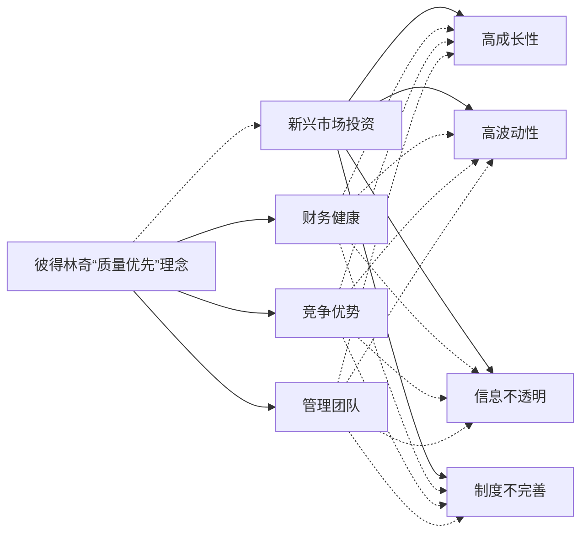

# 彼得林奇的“质量优先”在新兴市场投资中的实践挑战

> 关键词：彼得林奇、质量优先、新兴市场投资、实践挑战、投资策略

> 摘要：本文聚焦于彼得林奇“质量优先”投资理念在新兴市场投资中的应用情况。深入剖析了“质量优先”理念的核心要点，探讨新兴市场的特点及与发达市场的差异，进而详细阐述该理念在新兴市场投资实践中面临的挑战，包括市场信息不对称、企业治理问题、政策与政治风险等。同时，结合实际案例分析这些挑战对投资决策和收益的影响，并提出应对策略，为投资者在新兴市场运用“质量优先”理念提供有价值的参考。

## 1. 背景介绍 
### 1.1 目的和范围
彼得林奇作为投资界的传奇人物，其“质量优先”的投资理念影响深远。本研究旨在深入探讨这一理念在新兴市场投资实践中的具体情况。通过分析新兴市场的特性，明确该理念在新兴市场面临的独特挑战，为投资者在新兴市场的投资决策提供理论支持和实践指导。研究范围涵盖新兴市场的主要特征、“质量优先”理念的内涵、该理念在新兴市场应用中遇到的各种挑战以及可能的应对策略。

### 1.2 预期读者
本文预期读者主要包括专业投资者、金融分析师、投资领域的研究人员以及对新兴市场投资感兴趣的个人。对于专业投资者和金融分析师，文章可以为他们在新兴市场的投资决策提供新的视角和思路；对于研究人员，有助于他们深入了解“质量优先”理念在新兴市场的适应性和局限性；对于普通投资者，能帮助他们更好地理解新兴市场投资的复杂性和挑战。

### 1.3 文档结构概述
本文将按照以下结构展开：首先介绍“质量优先”理念的核心概念以及新兴市场的相关特征，阐述两者之间的联系；接着详细分析该理念在新兴市场投资中所涉及的核心算法原理和具体操作步骤；通过数学模型和公式进一步说明投资决策的依据和过程，并举例进行解释；然后结合实际项目案例，介绍开发环境搭建、源代码实现和代码解读；探讨该理念在新兴市场的实际应用场景；推荐相关的学习资源、开发工具框架以及论文著作；最后总结“质量优先”理念在新兴市场投资中的未来发展趋势与挑战，并对常见问题进行解答，同时提供扩展阅读和参考资料。

### 1.4 术语表
#### 1.4.1 核心术语定义
- **彼得林奇的“质量优先”**：指在投资过程中，优先选择具有高质量特征的企业进行投资，这些高质量特征包括良好的财务状况、优秀的管理团队、独特的竞争优势、稳定的现金流等。
- **新兴市场**：通常是指发展中国家或地区的金融市场，这些市场具有较高的经济增长率，但同时也伴随着较高的风险和不确定性，市场发展程度相对较低。
- **投资实践挑战**：在将某种投资理念应用于实际投资过程中所遇到的各种困难和问题，这些问题可能影响投资决策的准确性和投资收益的实现。

#### 1.4.2 相关概念解释
- **信息不对称**：在市场交易中，买卖双方所掌握的信息存在差异，一方拥有比另一方更多或更准确的信息。在新兴市场投资中，投资者可能难以获取企业真实、全面的信息，导致投资决策失误。
- **企业治理**：企业的组织架构、决策机制、监督机制等方面的制度安排，良好的企业治理有助于保障股东权益，提高企业的运营效率和竞争力。在新兴市场，部分企业可能存在治理结构不完善的问题。
- **政策与政治风险**：新兴市场国家的政策变化和政治局势不稳定可能对企业的经营和投资产生不利影响，如税收政策调整、贸易保护主义、政治动荡等。

#### 1.4.3 缩略词列表
本文在论述过程中暂不涉及缩略词。

## 2. 核心概念与联系 

### 彼得林奇“质量优先”理念核心原理
彼得林奇的“质量优先”投资理念强调在选择投资标的时，将企业的质量放在首位。企业的质量主要体现在以下几个方面：
- **财务健康**：企业应具备良好的财务状况，包括合理的资产负债结构、稳定的盈利能力和充足的现金流。例如，一个资产负债率较低、净利润持续增长且经营活动现金流为正的企业，说明其财务风险相对较低，具有较强的自我造血能力。
- **竞争优势**：拥有独特的竞争优势是企业质量的重要体现。这种竞争优势可以是技术领先、品牌优势、成本优势等。比如，一家掌握核心技术的科技企业，能够在市场上脱颖而出，获得更高的利润空间。
- **管理团队**：优秀的管理团队是企业成功的关键因素之一。管理团队的战略眼光、决策能力和执行能力直接影响企业的发展方向和运营效率。一个具有创新精神和高效执行力的管理团队，能够带领企业不断适应市场变化，实现持续发展。

### 新兴市场的特征
新兴市场具有以下显著特征：
- **高成长性**：新兴市场国家通常处于经济快速发展阶段，具有较高的经济增长率。随着基础设施的不断完善、消费市场的扩大和产业结构的升级，新兴市场蕴含着巨大的投资机会。
- **高波动性**：由于新兴市场的经济和金融体系相对脆弱，容易受到外部因素的影响，如全球经济形势、国际资本流动等。因此，新兴市场的股票价格、汇率等波动较大，投资风险相对较高。
- **信息不透明**：与发达市场相比，新兴市场的信息披露制度不够完善，企业的财务报表质量可能较低，投资者获取信息的难度较大。这增加了投资者评估企业质量的难度。
- **制度不完善**：新兴市场的法律法规和监管体系可能不够健全，企业治理水平参差不齐。一些企业可能存在内部人控制、关联交易等问题，损害股东利益。

### 两者联系的文本示意图
```plaintext
彼得林奇“质量优先”理念
|
|--财务健康
|--竞争优势
|--管理团队
|
|  新兴市场投资
|  |
|  |--高成长性
|  |--高波动性
|  |--信息不透明
|  |--制度不完善
|
|  联系：“质量优先”理念在新兴市场应用需适应其特征，面临挑战与机遇
```

### Mermaid 流程图


## 3. 核心算法原理 & 具体操作步骤 

### 核心算法原理
在新兴市场应用“质量优先”理念进行投资决策时，可以采用多因素综合评估模型。该模型通过对企业的多个关键指标进行量化评估，综合判断企业的质量。以下是一个简化的多因素综合评估模型的 Python 代码示例：

```python
import pandas as pd

# 定义各指标的权重
weights = {
    '财务健康': 0.4,
    '竞争优势': 0.3,
    '管理团队': 0.3
}

# 定义各指标的评估函数
def evaluate_financial_health(financial_data):
    # 假设财务健康通过资产负债率、净利润增长率和现金流比率来评估
    debt_ratio = financial_data['负债总额'] / financial_data['资产总额']
    net_profit_growth_rate = (financial_data['本期净利润'] - financial_data['上期净利润']) / financial_data['上期净利润']
    cash_flow_ratio = financial_data['经营活动现金流'] / financial_data['净利润']
    # 简单加权计算财务健康得分
    score = 0.3 * (1 - debt_ratio) + 0.4 * net_profit_growth_rate + 0.3 * cash_flow_ratio
    return score

def evaluate_competitive_advantage(market_data):
    # 假设竞争优势通过市场份额和研发投入占比来评估
    market_share = market_data['企业销售额'] / market_data['行业总销售额']
    r_d_ratio = market_data['研发投入'] / market_data['营业收入']
    score = 0.6 * market_share + 0.4 * r_d_ratio
    return score

def evaluate_management_team(management_data):
    # 假设管理团队通过团队经验和决策效率来评估
    experience_score = management_data['团队平均工作年限'] / 10
    decision_efficiency_score = management_data['决策执行时间'] / 10
    score = 0.5 * experience_score + 0.5 * (1 - decision_efficiency_score)
    return score

# 综合评估函数
def comprehensive_evaluation(financial_data, market_data, management_data):
    financial_score = evaluate_financial_health(financial_data)
    competitive_score = evaluate_competitive_advantage(market_data)
    management_score = evaluate_management_team(management_data)
    total_score = weights['财务健康'] * financial_score + weights['竞争优势'] * competitive_score + weights['管理团队'] * management_score
    return total_score

# 示例数据
financial_data = {
    '资产总额': 1000,
    '负债总额': 300,
    '本期净利润': 150,
    '上期净利润': 120,
    '经营活动现金流': 180
}
market_data = {
    '企业销售额': 200,
    '行业总销售额': 1000,
    '研发投入': 30,
    '营业收入': 250
}
management_data = {
    '团队平均工作年限': 8,
    '决策执行时间': 5
}

# 进行综合评估
score = comprehensive_evaluation(financial_data, market_data, management_data)
print(f"企业综合评估得分: {score}")
```

### 具体操作步骤
1. **数据收集**：收集企业的财务数据、市场数据和管理团队相关数据。财务数据包括资产负债表、利润表和现金流量表等；市场数据包括行业规模、企业市场份额、研发投入等；管理团队数据包括团队成员的工作经验、决策效率等。
2. **指标评估**：根据上述定义的评估函数，对企业的财务健康、竞争优势和管理团队进行评估，得到各指标的得分。
3. **综合计算**：将各指标的得分按照设定的权重进行加权计算，得到企业的综合评估得分。
4. **投资决策**：根据综合评估得分，筛选出得分较高的企业作为投资标的。同时，结合新兴市场的特点，对投资组合进行合理配置，降低投资风险。

## 4. 数学模型和公式 & 详细讲解 & 举例说明 

### 数学模型和公式
在上述多因素综合评估模型中，涉及以下数学公式：

#### 财务健康得分计算
设资产负债率为 $DR$，净利润增长率为 $NPGR$，现金流比率为 $CFR$，财务健康得分 $FHS$ 的计算公式为：
$$FHS = 0.3\times(1 - DR)+ 0.4\times NPGR+ 0.3\times CFR$$

#### 竞争优势得分计算
设市场份额为 $MS$，研发投入占比为 $RDR$，竞争优势得分 $CAS$ 的计算公式为：
$$CAS = 0.6\times MS+ 0.4\times RDR$$

#### 管理团队得分计算
设团队平均工作年限为 $AEW$，决策执行时间为 $DET$，管理团队得分 $MTS$ 的计算公式为：
$$MTS = 0.5\times\frac{AEW}{10}+ 0.5\times(1 - \frac{DET}{10})$$

#### 综合评估得分计算
设财务健康权重为 $W_{FH}$，竞争优势权重为 $W_{CA}$，管理团队权重为 $W_{MT}$，综合评估得分 $CES$ 的计算公式为：
$$CES = W_{FH}\times FHS+ W_{CA}\times CAS+ W_{MT}\times MTS$$

### 详细讲解
- **财务健康得分**：资产负债率越低，说明企业的财务风险越小，因此用 $1 - DR$ 来表示资产负债率对财务健康的正向影响；净利润增长率反映了企业的盈利能力，增长率越高，得分越高；现金流比率体现了企业的现金流状况，比率越高，说明企业的利润质量越高。
- **竞争优势得分**：市场份额越高，说明企业在行业中的竞争力越强；研发投入占比越高，表明企业越注重创新，未来发展潜力越大。
- **管理团队得分**：团队平均工作年限越长，说明团队经验越丰富；决策执行时间越短，说明决策效率越高。
- **综合评估得分**：通过将各指标的得分按照设定的权重进行加权计算，得到企业的综合评估得分，综合考虑了企业的财务、竞争和管理等多个方面的因素。

### 举例说明
假设一家企业的资产总额为 2000 万元，负债总额为 600 万元，本期净利润为 300 万元，上期净利润为 250 万元，经营活动现金流为 350 万元，企业销售额为 500 万元，行业总销售额为 2000 万元，研发投入为 80 万元，营业收入为 600 万元，团队平均工作年限为 9 年，决策执行时间为 4 年。

首先计算各指标：
- 资产负债率 $DR=\frac{600}{2000}=0.3$
- 净利润增长率 $NPGR=\frac{300 - 250}{250}=0.2$
- 现金流比率 $CFR=\frac{350}{300}\approx1.17$
- 市场份额 $MS=\frac{500}{2000}=0.25$
- 研发投入占比 $RDR=\frac{80}{600}\approx0.13$
- 团队平均工作年限得分 $\frac{9}{10}=0.9$
- 决策执行时间得分 $1-\frac{4}{10}=0.6$

然后计算各指标得分：
- 财务健康得分 $FHS = 0.3\times(1 - 0.3)+ 0.4\times 0.2+ 0.3\times 1.17=0.671$
- 竞争优势得分 $CAS = 0.6\times 0.25+ 0.4\times 0.13=0.202$
- 管理团队得分 $MTS = 0.5\times 0.9+ 0.5\times 0.6=0.75$

最后计算综合评估得分：
$CES = 0.4\times 0.671+ 0.3\times 0.202+ 0.3\times 0.75=0.561$

根据综合评估得分，可以对该企业的质量进行评估，并与其他企业进行比较，从而做出投资决策。

## 5. 项目实战：代码实际案例和详细解释说明 

### 5.1  开发环境搭建
为了实现上述多因素综合评估模型，我们需要搭建以下开发环境：
- **Python 环境**：建议使用 Python 3.7 及以上版本，可以从 Python 官方网站（https://www.python.org/downloads/）下载安装。
- **开发工具**：可以使用 PyCharm、Jupyter Notebook 等开发工具。PyCharm 是一款功能强大的 Python 集成开发环境，适合大型项目的开发；Jupyter Notebook 则适合交互式编程和数据分析，方便代码的调试和展示。
- **依赖库安装**：本项目需要使用 `pandas` 库进行数据处理，可以使用以下命令进行安装：
```sh
pip install pandas
```

### 5.2  源代码详细实现和代码解读
以下是完整的源代码：

```python
import pandas as pd

# 定义各指标的权重
weights = {
    '财务健康': 0.4,
    '竞争优势': 0.3,
    '管理团队': 0.3
}

# 定义各指标的评估函数
def evaluate_financial_health(financial_data):
    # 假设财务健康通过资产负债率、净利润增长率和现金流比率来评估
    debt_ratio = financial_data['负债总额'] / financial_data['资产总额']
    net_profit_growth_rate = (financial_data['本期净利润'] - financial_data['上期净利润']) / financial_data['上期净利润']
    cash_flow_ratio = financial_data['经营活动现金流'] / financial_data['净利润']
    # 简单加权计算财务健康得分
    score = 0.3 * (1 - debt_ratio) + 0.4 * net_profit_growth_rate + 0.3 * cash_flow_ratio
    return score

def evaluate_competitive_advantage(market_data):
    # 假设竞争优势通过市场份额和研发投入占比来评估
    market_share = market_data['企业销售额'] / market_data['行业总销售额']
    r_d_ratio = market_data['研发投入'] / market_data['营业收入']
    score = 0.6 * market_share + 0.4 * r_d_ratio
    return score

def evaluate_management_team(management_data):
    # 假设管理团队通过团队经验和决策效率来评估
    experience_score = management_data['团队平均工作年限'] / 10
    decision_efficiency_score = management_data['决策执行时间'] / 10
    score = 0.5 * experience_score + 0.5 * (1 - decision_efficiency_score)
    return score

# 综合评估函数
def comprehensive_evaluation(financial_data, market_data, management_data):
    financial_score = evaluate_financial_health(financial_data)
    competitive_score = evaluate_competitive_advantage(market_data)
    management_score = evaluate_management_team(management_data)
    total_score = weights['财务健康'] * financial_score + weights['竞争优势'] * competitive_score + weights['管理团队'] * management_score
    return total_score

# 示例数据
financial_data = {
    '资产总额': 1000,
    '负债总额': 300,
    '本期净利润': 150,
    '上期净利润': 120,
    '经营活动现金流': 180
}
market_data = {
    '企业销售额': 200,
    '行业总销售额': 1000,
    '研发投入': 30,
    '营业收入': 250
}
management_data = {
    '团队平均工作年限': 8,
    '决策执行时间': 5
}

# 进行综合评估
score = comprehensive_evaluation(financial_data, market_data, management_data)
print(f"企业综合评估得分: {score}")
```

### 代码解读与分析
- **权重定义**：`weights` 字典定义了各指标的权重，通过调整权重可以根据不同的投资偏好和市场情况进行灵活配置。
- **评估函数**：
  - `evaluate_financial_health` 函数根据资产负债率、净利润增长率和现金流比率计算财务健康得分。
  - `evaluate_competitive_advantage` 函数根据市场份额和研发投入占比计算竞争优势得分。
  - `evaluate_management_team` 函数根据团队平均工作年限和决策执行时间计算管理团队得分。
- **综合评估函数**：`comprehensive_evaluation` 函数将各指标的得分按照设定的权重进行加权计算，得到企业的综合评估得分。
- **示例数据**：通过定义 `financial_data`、`market_data` 和 `management_data` 字典，模拟企业的实际数据，并调用 `comprehensive_evaluation` 函数进行综合评估，最后输出评估得分。

在实际应用中，可以将上述代码进行扩展，实现对多个企业的评估，并根据评估得分进行排序和筛选，从而选择合适的投资标的。

## 6. 实际应用场景 
### 新兴市场股票投资
在新兴市场的股票投资中，投资者可以运用“质量优先”理念，通过多因素综合评估模型筛选出具有高质量特征的企业股票。例如，在某新兴市场国家的股票市场中，投资者可以收集上市公司的财务报表、行业数据和管理团队信息，对企业进行综合评估，选择得分较高的股票构建投资组合。这样可以在一定程度上降低投资风险，提高投资收益。

### 新兴市场私募股权投资
在新兴市场的私募股权投资中，“质量优先”理念同样具有重要意义。私募股权投资机构在选择投资项目时，可以对目标企业的财务状况、竞争优势和管理团队进行深入评估，优先投资那些具有高成长潜力和良好质量的企业。例如，一家私募股权投资机构在评估一家新兴科技企业时，通过分析其技术创新能力、市场份额和管理团队的经验，判断该企业具有较高的投资价值，从而进行投资。

### 新兴市场基金投资
对于投资新兴市场基金的投资者来说，也可以关注基金所投资的标的企业的质量。基金经理在构建投资组合时，可以运用“质量优先”理念，选择那些质量较高的企业进行投资。投资者在选择基金时，可以查看基金的持仓情况和投资策略，选择那些注重企业质量的基金进行投资。

## 7. 工具和资源推荐
### 7.1 学习资源推荐
#### 7.1.1 书籍推荐
- 《彼得·林奇的成功投资》：彼得·林奇本人所著，详细阐述了他的投资理念和方法，是投资者必读的经典书籍之一。
- 《聪明的投资者》：本杰明·格雷厄姆的经典著作，强调了价值投资和风险控制的重要性，对理解“质量优先”理念有很大帮助。
- 《新兴市场投资》：深入探讨了新兴市场的投资机会和风险，为投资者在新兴市场的投资提供了全面的指导。

#### 7.1.2 在线课程
- Coursera 平台上的“投资学原理”课程：由知名高校教授授课，系统介绍了投资学的基本原理和方法，包括股票投资、债券投资等。
- edX 平台上的“新兴市场金融”课程：专门针对新兴市场的金融特点和投资策略进行讲解，适合对新兴市场投资感兴趣的学习者。

#### 7.1.3 技术博客和网站
- 雪球网：国内知名的投资社区，提供了丰富的股票投资分析和讨论，投资者可以在这里学习其他投资者的经验和见解。
- Seeking Alpha：国外知名的投资研究网站，提供了大量的股票分析报告和投资策略文章，对新兴市场投资也有一定的覆盖。

### 7.2 开发工具框架推荐
#### 7.2.1 IDE和编辑器
- PyCharm：功能强大的 Python 集成开发环境，具有代码自动补全、调试、版本控制等功能，适合开发复杂的投资分析程序。
- Jupyter Notebook：交互式编程环境，方便代码的编写、调试和展示，适合进行数据分析和模型验证。

#### 7.2.2 调试和性能分析工具
- Py-Spy：一款轻量级的 Python 性能分析工具，可以帮助开发者找出代码中的性能瓶颈。
- pdb：Python 自带的调试器，用于调试 Python 代码，定位和解决代码中的问题。

#### 7.2.3 相关框架和库
- Pandas：用于数据处理和分析的 Python 库，提供了高效的数据结构和数据操作方法，方便处理企业的财务数据和市场数据。
- NumPy：Python 的数值计算库，提供了高效的多维数组对象和数学函数，用于进行数值计算和模型实现。

### 7.3 相关论文著作推荐
#### 7.3.1 经典论文
- Fama, E. F., & French, K. R. (1992). The cross-section of expected stock returns. The Journal of Finance, 47(2), 427-465. 该论文提出了著名的 Fama-French 三因子模型，对股票收益的影响因素进行了深入分析。
- Sharpe, W. F. (1964). Capital asset prices: A theory of market equilibrium under conditions of risk. The Journal of Finance, 19(3), 425-442. 该论文提出了资本资产定价模型（CAPM），为投资组合的定价和风险评估提供了理论基础。

#### 7.3.2 最新研究成果
- 近年来，关于新兴市场投资的研究不断涌现，许多学者关注新兴市场的经济增长、金融市场发展和投资策略等方面的问题。可以通过学术数据库如知网、万方、Web of Science 等搜索相关的最新研究论文。

#### 7.3.3 应用案例分析
- 一些金融机构和研究机构会发布关于新兴市场投资的应用案例分析报告，这些报告可以帮助投资者了解实际投资中的经验和教训。例如，麦肯锡公司、波士顿咨询公司等会定期发布相关的研究报告。

## 8. 总结：未来发展趋势与挑战
### 未来发展趋势
- **科技驱动投资决策**：随着人工智能、大数据等技术的不断发展，未来在新兴市场投资中，科技将发挥越来越重要的作用。投资者可以利用数据分析和机器学习算法，更准确地评估企业的质量和投资价值，提高投资决策的效率和准确性。
- **可持续投资理念的兴起**：越来越多的投资者开始关注企业的社会责任和可持续发展能力。在新兴市场，具有良好环境、社会和治理（ESG）表现的企业可能会获得更多的投资机会。未来，“质量优先”理念可能会与可持续投资理念相结合，成为新兴市场投资的新趋势。
- **新兴市场金融市场的不断完善**：随着新兴市场国家经济的发展和金融改革的推进，新兴市场的金融市场将不断完善。信息披露制度将更加健全，企业治理水平将逐步提高，这将为“质量优先”理念的应用提供更好的市场环境。

### 挑战
- **技术应用的挑战**：虽然科技为投资决策带来了便利，但也面临着数据质量、算法可靠性等问题。在新兴市场，数据的获取和准确性可能存在较大困难，如何有效利用技术进行投资分析是一个挑战。
- **可持续投资标准的统一**：目前，可持续投资的标准和评估方法尚未统一。在新兴市场，由于各国的经济和社会发展水平不同，可持续投资的标准和实践也存在差异。如何建立统一的可持续投资标准，是未来需要解决的问题。
- **国际政治经济环境的不确定性**：新兴市场容易受到国际政治经济环境的影响，如贸易摩擦、汇率波动等。这些不确定性因素增加了新兴市场投资的风险，对“质量优先”理念的应用提出了更高的要求。

## 9. 附录：常见问题与解答
### 问题 1：在新兴市场，如何获取准确的企业信息？
解答：可以通过以下途径获取企业信息：一是官方渠道，如企业的年报、季报、公告等；二是专业的金融数据提供商，如 Wind、Bloomberg 等；三是行业研究报告和新闻媒体报道。但需要注意的是，新兴市场的信息可能存在不透明和不准确的问题，投资者需要对获取的信息进行审慎分析和验证。

### 问题 2：多因素综合评估模型中的权重如何确定？
解答：权重的确定可以根据投资者的投资偏好、市场情况和投资目标等因素进行调整。一种常见的方法是根据历史数据和经验，通过回归分析等方法确定各指标对投资收益的影响程度，从而确定权重。此外，也可以参考专业机构的研究报告和建议。

### 问题 3：在新兴市场投资中，如何应对政策与政治风险？
解答：可以采取以下措施应对政策与政治风险：一是进行充分的风险评估，了解新兴市场国家的政策法规和政治局势；二是分散投资，降低单一市场和单一企业的风险；三是关注政策变化，及时调整投资策略；四是与当地的专业机构合作，获取更准确的信息和建议。

## 10. 扩展阅读 & 参考资料
### 扩展阅读
- 《金融炼金术》：乔治·索罗斯的著作，探讨了金融市场的不确定性和反射理论，对投资者理解市场波动和投资策略有一定的启示。
- 《非理性繁荣》：罗伯特·席勒的著作，分析了金融市场中的非理性行为和泡沫现象，有助于投资者避免盲目跟风和过度投资。

### 参考资料
- [1] 彼得·林奇. 彼得·林奇的成功投资[M]. 机械工业出版社, 2010.
- [2] 本杰明·格雷厄姆. 聪明的投资者[M]. 人民邮电出版社, 2016.
- [3] Fama, E. F., & French, K. R. (1992). The cross-section of expected stock returns. The Journal of Finance, 47(2), 427-465.
- [4] Sharpe, W. F. (1964). Capital asset prices: A theory of market equilibrium under conditions of risk. The Journal of Finance, 19(3), 425-442.

作者：AI天才研究院/AI Genius Institute & 禅与计算机程序设计艺术 /Zen And The Art of Computer Programming