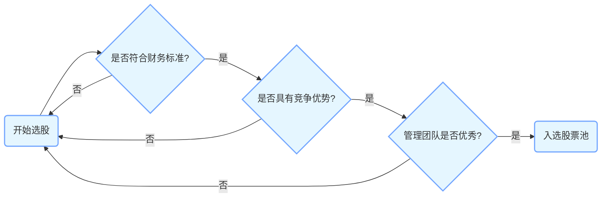

# 彼得林奇的“质量优先”选股标准

> 关键词：彼得林奇、质量优先、选股标准、股票投资、财务分析

> 摘要：本文深入探讨了彼得林奇的“质量优先”选股标准。从背景介绍入手，阐述了研究目的、预期读者等内容。详细解析了核心概念，包括相关原理和架构，并通过 Mermaid 流程图进行直观展示。深入讲解了基于此选股标准的核心算法原理及具体操作步骤，同时给出了数学模型和公式，并举例说明。结合项目实战，展示了代码实际案例并进行详细解释。分析了该选股标准在实际中的应用场景，推荐了学习资源、开发工具框架以及相关论文著作。最后总结了未来发展趋势与挑战，还提供了常见问题解答和扩展阅读参考资料，旨在帮助投资者更好地理解和运用彼得林奇的“质量优先”选股标准进行股票投资。

## 1. 背景介绍 
### 1.1 目的和范围
本研究的主要目的是全面、深入地剖析彼得林奇的“质量优先”选股标准。彼得林奇作为投资界的传奇人物，他的投资理念和选股方法影响深远。通过对其“质量优先”选股标准的研究，我们旨在帮助投资者更好地理解这一标准的内涵和应用方法，从而在股票投资中做出更明智的决策。

研究范围涵盖了“质量优先”选股标准的核心概念、算法原理、数学模型，以及在实际项目中的应用案例。同时，还会探讨该选股标准在不同市场环境下的适用性和局限性，为投资者提供全面的参考。

### 1.2 预期读者
本文的预期读者主要包括以下几类人群：
- **个人投资者**：希望学习专业的选股方法，提高投资收益的普通股民。
- **金融从业者**：如股票分析师、投资顾问等，需要深入了解不同的选股策略，为客户提供更优质的服务。
- **金融专业学生**：对股票投资感兴趣，希望通过学习经典的选股标准，加深对金融市场的理解。

### 1.3 文档结构概述
本文将按照以下结构进行阐述：
- 核心概念与联系：介绍“质量优先”选股标准的核心概念，包括其原理和架构，并通过示意图和流程图进行直观展示。
- 核心算法原理 & 具体操作步骤：详细讲解基于“质量优先”选股标准的核心算法原理，并给出具体的操作步骤，同时使用 Python 源代码进行阐述。
- 数学模型和公式 & 详细讲解 & 举例说明：建立数学模型，给出相关公式，并通过具体例子进行详细说明。
- 项目实战：代码实际案例和详细解释说明：通过实际项目案例，展示如何运用“质量优先”选股标准进行选股，并对代码进行详细解读。
- 实际应用场景：分析“质量优先”选股标准在不同市场环境下的实际应用场景。
- 工具和资源推荐：推荐学习资源、开发工具框架以及相关论文著作，帮助读者进一步深入学习。
- 总结：未来发展趋势与挑战：总结“质量优先”选股标准的未来发展趋势，并分析可能面临的挑战。
- 附录：常见问题与解答：解答读者在学习和应用过程中可能遇到的常见问题。
- 扩展阅读 & 参考资料：提供相关的扩展阅读材料和参考资料，方便读者进一步研究。

### 1.4 术语表
#### 1.4.1 核心术语定义
- **质量优先**：在选股过程中，优先考虑公司的质量因素，如财务状况、竞争优势、管理团队等，而不是仅仅关注股价的短期波动。
- **选股标准**：用于筛选股票的一系列规则和条件，根据这些标准可以从众多股票中选出具有投资价值的股票。
- **财务分析**：对公司的财务报表进行分析，评估公司的财务状况、盈利能力、偿债能力等，是“质量优先”选股标准的重要组成部分。
- **竞争优势**：公司在市场中相对于竞争对手所具有的优势，如品牌优势、技术优势、成本优势等，能够帮助公司获得持续的盈利。

#### 1.4.2 相关概念解释
- **PEG 指标**：市盈率相对盈利增长比率，是衡量股票估值和盈利增长的综合指标。PEG = 市盈率 / 盈利增长率。该指标可以帮助投资者判断股票是否被高估或低估。
- **ROE**：净资产收益率，是衡量公司盈利能力的重要指标。ROE = 净利润 / 净资产。ROE 越高，说明公司利用自有资本获取收益的能力越强。

#### 1.4.3 缩略词列表
- **PEG**：Price/Earnings to Growth Ratio
- **ROE**：Return on Equity

## 2. 核心概念与联系 

### 核心概念原理
彼得林奇的“质量优先”选股标准的核心原理是，通过对公司的多方面因素进行分析，筛选出具有高质量的公司股票进行投资。高质量的公司通常具有良好的财务状况、强大的竞争优势、优秀的管理团队等特点，这些因素能够保证公司在长期内保持稳定的盈利增长，从而为投资者带来丰厚的回报。

从财务角度来看，高质量的公司往往具有较高的净资产收益率（ROE）、稳定的现金流、较低的负债水平等。这些指标反映了公司的盈利能力、偿债能力和财务稳健性。

从竞争优势角度来看，公司可能拥有独特的技术、知名的品牌、庞大的客户群体等，这些优势能够帮助公司在市场中占据领先地位，抵御竞争对手的冲击。

从管理团队角度来看，优秀的管理团队能够制定合理的发展战略，有效地组织和管理公司的资源，推动公司不断发展壮大。

### 架构的文本示意图
```plaintext
质量优先选股标准
|-- 财务分析
|   |-- 盈利能力分析（ROE、毛利率等）
|   |-- 偿债能力分析（资产负债率、流动比率等）
|   |-- 现金流分析（经营现金流、自由现金流等）
|-- 竞争优势分析
|   |-- 技术优势
|   |-- 品牌优势
|   |-- 成本优势
|-- 管理团队分析
|   |-- 管理能力
|   |-- 战略眼光
|   |-- 诚信度
```

### Mermaid 流程图


## 3. 核心算法原理 & 具体操作步骤 

### 核心算法原理
基于“质量优先”选股标准的核心算法原理是，通过设定一系列的财务指标和非财务指标，对股票进行筛选和排序。具体来说，首先根据财务指标筛选出财务状况良好的公司，然后对这些公司进行竞争优势和管理团队分析，进一步筛选出具有高质量的公司。

在财务指标方面，我们可以使用 ROE、PEG、资产负债率等指标。ROE 反映了公司的盈利能力，PEG 综合考虑了股票的估值和盈利增长，资产负债率反映了公司的偿债能力。

在非财务指标方面，我们可以通过行业研究、实地调研等方式评估公司的竞争优势和管理团队。

### 具体操作步骤
#### 步骤 1：数据收集
收集股票的财务数据，包括资产负债表、利润表、现金流量表等。可以从金融数据提供商（如东方财富、同花顺等）获取这些数据。

#### 步骤 2：财务指标计算
计算每个股票的财务指标，如 ROE、PEG、资产负债率等。

#### 步骤 3：财务筛选
根据设定的财务指标阈值，筛选出财务状况良好的股票。例如，选择 ROE 大于 15%、PEG 小于 1、资产负债率小于 50% 的股票。

#### 步骤 4：竞争优势分析
对筛选出的股票进行竞争优势分析，可以通过查阅行业报告、分析公司的产品和市场份额等方式进行。

#### 步骤 5：管理团队分析
评估公司的管理团队，可以通过查阅公司的管理层背景资料、分析公司的战略决策等方式进行。

#### 步骤 6：综合排序
根据财务指标、竞争优势和管理团队的评估结果，对股票进行综合排序，选择排名靠前的股票作为投资标的。

### Python 源代码实现
```python
import pandas as pd

# 模拟获取股票财务数据
def get_stock_financial_data():
    data = {
        'stock_code': ['000001', '000002', '000003'],
        'ROE': [20, 12, 18],
        'PEG': [0.8, 1.2, 0.9],
        'asset_liability_ratio': [40, 60, 45]
    }
    df = pd.DataFrame(data)
    return df

# 财务筛选函数
def financial_screening(df):
    filtered_df = df[(df['ROE'] > 15) & (df['PEG'] < 1) & (df['asset_liability_ratio'] < 50)]
    return filtered_df

# 主函数
def main():
    # 获取财务数据
    financial_data = get_stock_financial_data()
    # 进行财务筛选
    filtered_stocks = financial_screening(financial_data)
    print("筛选后的股票：")
    print(filtered_stocks)

if __name__ == "__main__":
    main()
```
### 代码解释
- `get_stock_financial_data` 函数：模拟获取股票的财务数据，返回一个包含股票代码、ROE、PEG 和资产负债率的 DataFrame。
- `financial_screening` 函数：根据设定的财务指标阈值，对 DataFrame 进行筛选，返回筛选后的 DataFrame。
- `main` 函数：调用 `get_stock_financial_data` 函数获取财务数据，然后调用 `financial_screening` 函数进行财务筛选，最后打印筛选后的股票信息。

## 4. 数学模型和公式 & 详细讲解 & 举例说明 

### 数学模型和公式
#### ROE（净资产收益率）
$$ROE = \frac{净利润}{净资产} \times 100\%$$
ROE 反映了公司利用自有资本获取收益的能力，ROE 越高，说明公司的盈利能力越强。

#### PEG（市盈率相对盈利增长比率）
$$PEG = \frac{市盈率}{盈利增长率}$$
PEG 综合考虑了股票的估值和盈利增长，PEG 小于 1 通常被认为股票被低估，具有投资价值。

#### 资产负债率
$$资产负债率 = \frac{负债总额}{资产总额} \times 100\%$$
资产负债率反映了公司的偿债能力，资产负债率越低，说明公司的财务风险越小。

### 详细讲解
#### ROE
ROE 是评估公司盈利能力的重要指标。一个高 ROE 的公司通常意味着它能够有效地利用股东的资金创造利润。但是，需要注意的是，ROE 可能会受到会计政策、财务杠杆等因素的影响。因此，在分析 ROE 时，需要结合其他指标进行综合判断。

#### PEG
PEG 指标可以帮助投资者判断股票是否被高估或低估。当 PEG 小于 1 时，说明股票的估值相对其盈利增长较低，具有投资价值；当 PEG 大于 1 时，说明股票的估值相对其盈利增长较高，可能存在高估的风险。

#### 资产负债率
资产负债率反映了公司的负债水平和偿债能力。过高的资产负债率意味着公司面临较大的财务风险，可能会影响公司的稳定性和可持续发展。一般来说，资产负债率在 50% 以下被认为是比较合理的水平。

### 举例说明
假设公司 A 的净利润为 1000 万元，净资产为 5000 万元，则该公司的 ROE 为：
$$ROE = \frac{1000}{5000} \times 100\% = 20\%$$
这表明公司 A 利用自有资本获取收益的能力较强。

假设公司 B 的市盈率为 20，盈利增长率为 30%，则该公司的 PEG 为：
$$PEG = \frac{20}{30} \approx 0.67$$
由于 PEG 小于 1，说明公司 B 的股票可能被低估，具有投资价值。

假设公司 C 的负债总额为 3000 万元，资产总额为 5000 万元，则该公司的资产负债率为：
$$资产负债率 = \frac{3000}{5000} \times 100\% = 60\%$$
由于资产负债率较高，说明公司 C 面临较大的财务风险。

## 5. 项目实战：代码实际案例和详细解释说明 

### 5.1  开发环境搭建
#### 安装 Python
首先，需要安装 Python 环境。可以从 Python 官方网站（https://www.python.org/downloads/）下载适合自己操作系统的 Python 版本，并按照安装向导进行安装。

#### 安装必要的库
在项目中，我们需要使用 `pandas` 库进行数据处理。可以使用以下命令进行安装：
```sh
pip install pandas
```

### 5.2  源代码详细实现和代码解读
```python
import pandas as pd

# 模拟从文件中读取股票财务数据
def read_stock_financial_data(file_path):
    df = pd.read_csv(file_path)
    return df

# 财务指标计算函数
def calculate_financial_metrics(df):
    # 计算 ROE
    df['ROE'] = df['net_profit'] / df['net_assets'] * 100
    # 计算 PEG
    df['PEG'] = df['PE_ratio'] / df['earnings_growth_rate']
    # 计算资产负债率
    df['asset_liability_ratio'] = df['total_liabilities'] / df['total_assets'] * 100
    return df

# 财务筛选函数
def financial_screening(df):
    filtered_df = df[(df['ROE'] > 15) & (df['PEG'] < 1) & (df['asset_liability_ratio'] < 50)]
    return filtered_df

# 主函数
def main():
    # 读取财务数据
    file_path = 'stock_financial_data.csv'
    financial_data = read_stock_financial_data(file_path)
    # 计算财务指标
    financial_data = calculate_financial_metrics(financial_data)
    # 进行财务筛选
    filtered_stocks = financial_screening(financial_data)
    print("筛选后的股票：")
    print(filtered_stocks)

if __name__ == "__main__":
    main()
```
### 代码解读
- `read_stock_financial_data` 函数：从 CSV 文件中读取股票的财务数据，并返回一个 DataFrame。
- `calculate_financial_metrics` 函数：计算每个股票的 ROE、PEG 和资产负债率，并将计算结果添加到 DataFrame 中。
- `financial_screening` 函数：根据设定的财务指标阈值，对 DataFrame 进行筛选，返回筛选后的 DataFrame。
- `main` 函数：调用 `read_stock_financial_data` 函数读取财务数据，然后调用 `calculate_financial_metrics` 函数计算财务指标，最后调用 `financial_screening` 函数进行财务筛选，打印筛选后的股票信息。

### 5.3  代码解读与分析
- **数据读取**：使用 `pandas` 库的 `read_csv` 函数从 CSV 文件中读取股票的财务数据，这种方式方便快捷，适用于处理大量数据。
- **财务指标计算**：通过对 DataFrame 中的列进行数学运算，计算出每个股票的 ROE、PEG 和资产负债率。这种方式可以利用 `pandas` 库的向量化计算特性，提高计算效率。
- **财务筛选**：使用布尔索引对 DataFrame 进行筛选，根据设定的财务指标阈值选择符合条件的股票。这种方式简洁明了，易于理解和实现。

## 6. 实际应用场景 
### 长期投资
对于长期投资者来说，彼得林奇的“质量优先”选股标准非常适用。长期投资者更关注公司的基本面和长期发展潜力，而“质量优先”选股标准正是通过对公司的财务状况、竞争优势和管理团队进行分析，筛选出具有长期投资价值的股票。例如，巴菲特就是长期投资的代表人物，他非常注重公司的质量，通过长期持有高质量的股票获得了丰厚的回报。

### 价值投资
价值投资强调寻找被低估的股票，以低于其内在价值的价格买入。“质量优先”选股标准中的 PEG 指标可以帮助投资者判断股票是否被低估。当 PEG 小于 1 时，说明股票的估值相对其盈利增长较低，可能存在投资机会。投资者可以通过深入分析公司的基本面，结合 PEG 指标，寻找被低估的高质量股票进行投资。

### 基金投资
对于基金经理来说，“质量优先”选股标准可以作为构建投资组合的重要依据。基金经理可以根据该选股标准筛选出一批高质量的股票，然后根据基金的投资策略和风险偏好，合理配置这些股票，构建出具有较高收益和较低风险的投资组合。例如，一些价值型基金通常会采用“质量优先”的选股策略，以实现基金资产的长期稳定增值。

## 7. 工具和资源推荐
### 7.1 学习资源推荐
#### 7.1.1 书籍推荐
- 《彼得林奇的成功投资》：彼得林奇的经典著作，详细介绍了他的投资理念和选股方法，是学习“质量优先”选股标准的必读之书。
- 《聪明的投资者》：本杰明·格雷厄姆的经典著作，被誉为价值投资的圣经，书中阐述了价值投资的基本原理和方法，对理解“质量优先”选股标准有很大的帮助。
- 《财务报表分析与证券定价》：该书系统地介绍了财务报表分析的方法和技术，以及如何运用财务报表分析进行证券定价，对于深入理解“质量优先”选股标准中的财务分析部分非常有帮助。

#### 7.1.2 在线课程
- Coursera 上的“投资学原理”：该课程由知名大学的教授授课，涵盖了投资学的基本原理和方法，包括选股策略、投资组合管理等内容。
- 网易云课堂上的“股票投资实战技巧”：该课程结合实际案例，讲解了股票投资的实战技巧，包括如何选股、如何分析市场等内容。

#### 7.1.3 技术博客和网站
- 雪球网：国内知名的投资社区，汇聚了众多的投资者和投资专家，用户可以在上面交流投资经验、分享投资观点。
- 东方财富网：提供丰富的金融数据和资讯，包括股票行情、财务报表、研究报告等，是投资者获取信息的重要渠道。

### 7.2 开发工具框架推荐
#### 7.2.1 IDE和编辑器
- PyCharm：一款专业的 Python 集成开发环境，具有强大的代码编辑、调试、代码分析等功能，适合开发 Python 程序。
- Jupyter Notebook：一种交互式的开发环境，支持多种编程语言，尤其适合进行数据探索和分析。

#### 7.2.2 调试和性能分析工具
- `pdb`：Python 内置的调试工具，可以帮助开发者在程序运行过程中进行调试，查找问题。
- `cProfile`：Python 内置的性能分析工具，可以帮助开发者分析程序的性能瓶颈，优化程序性能。

#### 7.2.3 相关框架和库
- `pandas`：用于数据处理和分析的 Python 库，提供了高效的数据结构和数据操作方法，非常适合处理股票财务数据。
- `numpy`：用于科学计算的 Python 库，提供了高效的数组操作和数学函数，在财务指标计算中可以发挥重要作用。

### 7.3 相关论文著作推荐
#### 7.3.1 经典论文
- “The Cross - Section of Expected Stock Returns”：该论文提出了 Fama - French 三因子模型，对股票收益率的影响因素进行了深入研究，对于理解股票投资的风险和收益具有重要意义。
- “Capital Asset Pricing Model: Theory and Evidence”：该论文对资本资产定价模型（CAPM）进行了详细的阐述和实证研究，是投资学领域的经典论文之一。

#### 7.3.2 最新研究成果
- 关注顶级金融学术期刊，如《Journal of Finance》、《Review of Financial Studies》等，这些期刊会发表最新的金融研究成果，包括选股策略、市场效率等方面的研究。

#### 7.3.3 应用案例分析
- 可以参考一些知名投资机构的研究报告，了解他们在实际投资中如何运用“质量优先”选股标准进行选股和投资组合构建。

## 8. 总结：未来发展趋势与挑战
### 未来发展趋势
- **数据驱动的选股方法**：随着大数据和人工智能技术的发展，未来的选股方法将更加依赖于数据驱动。投资者可以利用海量的金融数据和先进的数据分析技术，更准确地评估公司的质量和投资价值。例如，通过自然语言处理技术分析新闻报道和社交媒体信息，获取公司的舆情信息，辅助选股决策。
- **多因素选股模型的应用**：单一的选股标准可能无法全面评估公司的投资价值，未来将更多地采用多因素选股模型。除了财务指标、竞争优势和管理团队等因素外，还会考虑宏观经济因素、行业发展趋势、技术创新等因素，构建更加全面、科学的选股模型。
- **ESG 投资的兴起**：ESG（环境、社会和治理）投资越来越受到投资者的关注。未来，“质量优先”选股标准可能会将 ESG 因素纳入考虑范围，筛选出在环境、社会和治理方面表现良好的公司股票进行投资。

### 挑战
- **数据质量和可靠性**：选股过程中需要大量的金融数据，数据的质量和可靠性直接影响选股结果的准确性。然而，金融数据可能存在误差、缺失或造假等问题，如何保证数据的质量和可靠性是一个挑战。
- **市场环境的变化**：股票市场是复杂多变的，市场环境的变化可能会导致原有的选股标准失效。例如，宏观经济形势的变化、行业竞争格局的改变等都可能影响公司的基本面和投资价值，投资者需要及时调整选股策略。
- **模型的复杂性和可解释性**：随着选股模型的不断发展，模型的复杂性也在增加。复杂的模型可能会导致过拟合问题，降低模型的泛化能力。同时，模型的可解释性也变得越来越重要，投资者需要理解模型的原理和决策过程，以便做出合理的投资决策。

## 9. 附录：常见问题与解答
### 问题 1：“质量优先”选股标准是否适用于所有市场环境？
解答：“质量优先”选股标准在大多数市场环境下都具有一定的适用性，但并不是适用于所有市场环境。在牛市中，市场整体上涨，即使是一些质量一般的股票也可能会有较好的表现；而在熊市中，市场整体下跌，高质量的股票可能也难以幸免。因此，在不同的市场环境下，需要结合其他因素进行综合判断。

### 问题 2：如何评估公司的竞争优势？
解答：评估公司的竞争优势可以从多个方面入手。可以分析公司的产品或服务的独特性、市场份额、品牌知名度、技术实力等。此外，还可以关注公司的成本结构、供应链管理、创新能力等方面。通过综合分析这些因素，可以对公司的竞争优势有一个较为全面的了解。

### 问题 3：财务指标的阈值应该如何设定？
解答：财务指标的阈值设定需要根据不同的行业和市场环境进行调整。一般来说，可以参考行业的平均水平和历史数据，同时结合自己的投资目标和风险偏好来设定。例如，对于一些高成长行业，ROE 的阈值可以适当提高；对于一些周期性行业，需要更加关注公司的偿债能力，资产负债率的阈值可以适当降低。

## 10. 扩展阅读 & 参考资料
### 扩展阅读
- 《投资最重要的事》：霍华德·马克斯的著作，书中分享了他在投资领域的经验和见解，对于理解投资的本质和风险控制有很大的帮助。
- 《金融炼金术》：乔治·索罗斯的著作，阐述了他的反身性理论和投资哲学，对于理解金融市场的运行机制和投资策略有一定的启发。

### 参考资料
- 彼得林奇. 《彼得林奇的成功投资》. 机械工业出版社.
- 本杰明·格雷厄姆. 《聪明的投资者》. 人民邮电出版社.
- 斯蒂芬·佩因曼. 《财务报表分析与证券定价》. 中国人民大学出版社.

作者：AI天才研究院/AI Genius Institute & 禅与计算机程序设计艺术 /Zen And The Art of Computer Programming