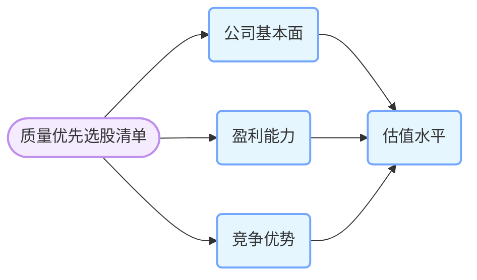

# 彼得林奇的"质量优先"选股清单

> 关键词：彼得林奇、质量优先、选股清单、投资策略、股票分析

> 摘要：本文深入探讨了彼得林奇的“质量优先”选股清单。从背景介绍入手，阐述目的、预期读者等内容。详细解析核心概念，通过示意图和流程图展示其内在联系。深入讲解核心算法原理，结合Python代码说明具体操作步骤。用数学模型和公式进行理论支撑，并举例说明。通过项目实战给出代码案例及解读。介绍实际应用场景，推荐相关工具和资源，包括学习资料、开发工具、论文著作等。最后总结未来发展趋势与挑战，提供常见问题解答及扩展阅读参考资料，旨在帮助投资者更好地理解和运用彼得林奇的选股方法。

## 1. 背景介绍 
### 1.1 目的和范围
本文的主要目的是全面且深入地解读彼得林奇的“质量优先”选股清单。彼得林奇是投资领域的传奇人物，他的选股方法具有极高的实践价值和理论意义。我们将详细剖析这一选股清单的各个要素，探讨其背后的原理和逻辑。范围涵盖从核心概念的理解到具体操作步骤的讲解，再到实际应用场景的分析，以及相关工具和资源的推荐，为投资者提供一个完整的知识体系，帮助他们更好地运用这一选股方法进行股票投资。

### 1.2 预期读者
预期读者主要包括对股票投资有兴趣的初学者，他们希望通过学习彼得林奇的选股方法，建立起正确的投资理念和基本的选股技巧；也包括有一定投资经验的投资者，他们希望从彼得林奇的方法中获取新的思路和灵感，优化自己的投资策略；同时，对于金融专业的学生和研究人员来说，本文也可以作为研究投资理论和实践的参考资料。

### 1.3 文档结构概述
本文将按照以下结构展开：首先介绍核心概念与联系，通过文本示意图和Mermaid流程图直观呈现选股清单的关键要素及其关系；接着阐述核心算法原理，并使用Python源代码详细说明具体操作步骤；然后给出数学模型和公式，结合实际例子进行详细讲解；之后进行项目实战，包括开发环境搭建、源代码实现和解读；再介绍实际应用场景；随后推荐相关的工具和资源，如学习资料、开发工具和论文著作等；最后总结未来发展趋势与挑战，提供常见问题解答和扩展阅读参考资料。

### 1.4 术语表
#### 1.4.1 核心术语定义
- **质量优先**：在选股过程中，将公司的质量因素放在首要位置进行考量，质量因素包括公司的盈利能力、竞争优势、管理团队等。
- **选股清单**：一系列用于筛选股票的标准和指标，帮助投资者从众多股票中挑选出具有投资价值的股票。
- **PEG比率**：市盈率相对盈利增长比率，是衡量公司股票估值和盈利增长能力的指标，计算公式为 $PEG = \frac{市盈率}{盈利增长率}$。
- **ROE**：净资产收益率，反映股东权益的收益水平，用以衡量公司运用自有资本的效率，计算公式为 $ROE = \frac{净利润}{净资产} \times 100\%$。

#### 1.4.2 相关概念解释
- **公司盈利能力**：指公司在一定时期内获取利润的能力，通常通过净利润、毛利率、净利率等指标来衡量。盈利能力强的公司更有可能为股东带来丰厚的回报。
- **竞争优势**：公司在市场竞争中相对于其他竞争对手所具有的独特优势，如品牌优势、技术优势、成本优势等。具有竞争优势的公司能够在市场中占据更有利的地位，获得更高的市场份额和利润。
- **管理团队**：负责公司日常运营和决策的核心人员，包括董事会成员、高级管理人员等。优秀的管理团队能够制定正确的战略规划，有效地组织和管理公司资源，推动公司持续发展。

#### 1.4.3 缩略词列表
- **PEG**：Price/Earnings to Growth Ratio，市盈率相对盈利增长比率
- **ROE**：Return on Equity，净资产收益率

## 2. 核心概念与联系 
彼得林奇的“质量优先”选股清单主要围绕几个核心概念展开，这些概念相互关联，共同构成了一个完整的选股体系。

### 核心概念原理
- **公司基本面**：这是选股的基础，包括公司的财务状况、业务模式、行业地位等。通过分析公司的基本面，投资者可以了解公司的经营状况和发展前景。例如，一家财务健康、业务模式清晰、在行业中具有领先地位的公司，通常具有较高的投资价值。
- **盈利能力**：是衡量公司质量的重要指标之一。持续稳定的盈利能力表明公司具有良好的经营能力和市场竞争力。可以通过净利润、毛利率、净利率等指标来评估公司的盈利能力。
- **竞争优势**：公司的竞争优势是其在市场中立足的关键。具有竞争优势的公司能够在市场竞争中脱颖而出，获得更高的利润和市场份额。竞争优势可以体现在品牌、技术、成本等多个方面。
- **估值水平**：合理的估值是投资成功的关键因素之一。即使公司的基本面和盈利能力都很好，如果估值过高，也可能存在投资风险。常用的估值指标包括市盈率、市净率等。

### 架构的文本示意图
```plaintext
                质量优先选股清单
                    |
        +-----------+-----------+
        |           |           |
    公司基本面   盈利能力   竞争优势
        |           |           |
        +-----------+           |
                    |           |
                 估值水平        |
                    |           |
                    +-----------+
```

### Mermaid流程图


从流程图可以看出，公司基本面、盈利能力和竞争优势是选股的重要因素，它们共同影响着公司的估值水平。投资者在选股时，需要综合考虑这些因素，选择具有合理估值的优质股票。

## 3. 核心算法原理 & 具体操作步骤 
### 核心算法原理
彼得林奇的“质量优先”选股算法主要基于对公司基本面、盈利能力、竞争优势和估值水平的综合评估。具体来说，通过设定一系列的指标和阈值，对股票进行筛选和排序，选出符合要求的优质股票。

### 具体操作步骤
#### 步骤1：收集数据
首先需要收集公司的财务数据、行业数据等信息。可以通过金融数据提供商、公司年报、证券交易所网站等渠道获取相关数据。

#### 步骤2：计算指标
根据收集到的数据，计算一系列的指标，如PEG比率、ROE、市盈率、市净率等。以下是使用Python代码计算这些指标的示例：

```python
import pandas as pd

# 示例数据
data = {
    '净利润': [1000, 1200, 1500],
    '净资产': [5000, 6000, 7000],
    '股价': [20, 25, 30],
    '每股收益': [2, 2.5, 3],
    '盈利增长率': [0.2, 0.25, 0.3]
}

df = pd.DataFrame(data)

# 计算ROE
df['ROE'] = df['净利润'] / df['净资产'] * 100

# 计算市盈率
df['市盈率'] = df['股价'] / df['每股收益']

# 计算PEG比率
df['PEG'] = df['市盈率'] / df['盈利增长率']

print(df)
```

#### 步骤3：筛选股票
根据计算得到的指标，设定筛选条件，筛选出符合要求的股票。例如，可以选择PEG比率小于1、ROE大于15%的股票。

```python
# 筛选条件
selected_stocks = df[(df['PEG'] < 1) & (df['ROE'] > 15)]

print(selected_stocks)
```

#### 步骤4：排序和评估
对筛选出的股票进行排序，可以按照PEG比率从小到大排序，或者按照ROE从大到小排序。然后对排序后的股票进行进一步的评估，结合公司的基本面、竞争优势等因素，选择最具投资价值的股票。

```python
# 按照PEG比率从小到大排序
sorted_stocks = selected_stocks.sort_values(by='PEG')

print(sorted_stocks)
```

## 4. 数学模型和公式 & 详细讲解 & 举例说明 
### 数学模型和公式
#### PEG比率
$PEG = \frac{市盈率}{盈利增长率}$

PEG比率是衡量公司股票估值和盈利增长能力的重要指标。一般来说，PEG比率小于1表示股票可能被低估，具有较高的投资价值；PEG比率大于1表示股票可能被高估，投资风险相对较高。

#### ROE
$ROE = \frac{净利润}{净资产} \times 100\%$

ROE反映了股东权益的收益水平，是衡量公司运用自有资本效率的重要指标。ROE越高，说明公司运用自有资本的效率越高，股东获得的回报也越高。

#### 市盈率
$市盈率 = \frac{股价}{每股收益}$

市盈率是最常用的估值指标之一，反映了投资者为获得公司每一元盈利所愿意支付的价格。市盈率越高，说明市场对公司的未来盈利预期越高，但同时也意味着投资风险相对较大。

### 详细讲解
- **PEG比率**：PEG比率综合考虑了公司的估值和盈利增长情况。例如，一家公司的市盈率为20，盈利增长率为25%，则其PEG比率为 $20 \div 25\% = 0.8$。这表明该公司的股票在考虑了盈利增长因素后，可能被低估，具有一定的投资价值。
- **ROE**：ROE反映了公司的盈利能力和股东权益的回报水平。如果一家公司的ROE长期保持在较高水平，说明该公司具有较强的盈利能力和良好的经营管理能力。例如，一家公司的净利润为1000万元，净资产为5000万元，则其ROE为 $1000 \div 5000 \times 100\% = 20\%$。这表明该公司每投入1元的净资产，能够获得0.2元的净利润，股东的回报水平较高。
- **市盈率**：市盈率是投资者评估股票估值的重要参考指标。不同行业的市盈率水平可能存在较大差异，一般来说，新兴行业的市盈率相对较高，而传统行业的市盈率相对较低。例如，一家公司的股价为20元，每股收益为2元，则其市盈率为 $20 \div 2 = 10$。这意味着投资者为获得该公司每一元的盈利，需要支付10元的价格。

### 举例说明
假设我们有两家公司A和B，相关数据如下：

| 公司 | 股价 | 每股收益 | 盈利增长率 | 净资产 | 净利润 |
| ---- | ---- | ---- | ---- | ---- | ---- |
| A | 30 | 3 | 0.3 | 10000 | 1500 |
| B | 25 | 2.5 | 0.2 | 8000 | 1200 |

#### 计算指标
- **PEG比率**：
  - 公司A的市盈率为 $30 \div 3 = 10$，PEG比率为 $10 \div 0.3 \approx 33.33$。
  - 公司B的市盈率为 $25 \div 2.5 = 10$，PEG比率为 $10 \div 0.2 = 50$。
- **ROE**：
  - 公司A的ROE为 $1500 \div 10000 \times 100\% = 15\%$。
  - 公司B的ROE为 $1200 \div 8000 \times 100\% = 15\%$。

#### 分析
从PEG比率来看，公司A的PEG比率相对较低，说明在考虑盈利增长因素后，公司A的股票可能更具投资价值。虽然两家公司的ROE相同，但结合PEG比率，我们可以初步判断公司A在当前情况下可能是更好的投资选择。

## 5. 项目实战：代码实际案例和详细解释说明 
### 5.1  开发环境搭建
#### 安装Python
首先需要安装Python，可以从Python官方网站（https://www.python.org/downloads/）下载适合自己操作系统的Python版本，并按照安装向导进行安装。

#### 安装必要的库
在Python环境中，需要安装一些必要的库，如pandas、numpy等。可以使用pip命令进行安装：

```bash
pip install pandas numpy
```

### 5.2  源代码详细实现和代码解读
```python
import pandas as pd

# 模拟收集到的股票数据
data = {
    '股票代码': ['000001', '000002', '000003'],
    '股价': [20, 25, 30],
    '每股收益': [2, 2.5, 3],
    '盈利增长率': [0.2, 0.25, 0.3],
    '净资产': [5000, 6000, 7000],
    '净利润': [1000, 1200, 1500]
}

# 创建DataFrame对象
df = pd.DataFrame(data)

# 计算ROE
df['ROE'] = df['净利润'] / df['净资产'] * 100

# 计算市盈率
df['市盈率'] = df['股价'] / df['每股收益']

# 计算PEG比率
df['PEG'] = df['市盈率'] / df['盈利增长率']

# 筛选条件
selected_stocks = df[(df['PEG'] < 1) & (df['ROE'] > 15)]

# 按照PEG比率从小到大排序
sorted_stocks = selected_stocks.sort_values(by='PEG')

print("筛选并排序后的股票数据：")
print(sorted_stocks)
```

### 代码解读与分析
1. **数据收集**：通过字典模拟收集到的股票数据，包括股票代码、股价、每股收益、盈利增长率、净资产和净利润等信息。
2. **数据处理**：使用pandas的DataFrame对象对数据进行处理。计算ROE、市盈率和PEG比率等指标。
3. **股票筛选**：根据设定的筛选条件（PEG比率小于1且ROE大于15%）筛选出符合要求的股票。
4. **排序**：对筛选出的股票按照PEG比率从小到大排序，以便投资者选择更具投资价值的股票。

## 6. 实际应用场景 
### 个人投资者
个人投资者可以使用彼得林奇的“质量优先”选股清单来构建自己的投资组合。通过筛选和评估股票，选择具有较高质量和合理估值的股票进行投资，以实现资产的增值。例如，一位普通的上班族可以在业余时间使用该选股方法，从众多股票中挑选出适合自己的投资标的，长期持有，分享公司成长带来的收益。

### 基金经理
基金经理在管理基金时，可以运用这一选股清单来筛选投资标的。通过对大量股票的分析和筛选，构建出符合基金投资策略的投资组合，为基金投资者创造良好的回报。例如，某只成长型基金的经理可以根据“质量优先”的原则，选择具有高盈利增长潜力和良好基本面的股票，以实现基金资产的快速增长。

### 金融研究机构
金融研究机构可以利用这一选股清单进行市场研究和分析。通过对不同行业、不同公司的股票进行评估和比较，为投资者提供专业的投资建议和研究报告。例如，一家证券公司的研究部门可以定期发布基于“质量优先”选股方法的股票推荐报告，帮助客户做出投资决策。

## 7. 工具和资源推荐
### 7.1 学习资源推荐
#### 7.1.1 书籍推荐
- 《彼得林奇的成功投资》：彼得林奇亲自撰写的经典投资著作，详细介绍了他的投资理念和选股方法，是投资者学习的必读之书。
- 《战胜华尔街》：继续深入阐述了彼得林奇的投资策略和实践经验，对于理解他的选股思路具有重要的参考价值。
- 《聪明的投资者》：本杰明·格雷厄姆的经典著作，被誉为投资界的圣经，为投资者提供了基本的投资原则和方法。

#### 7.1.2 在线课程
- Coursera上的“投资学原理”课程：该课程由知名高校的教授授课，系统地介绍了投资学的基本原理和方法，包括选股策略等内容。
- 网易云课堂上的“股票投资实战课程”：课程结合实际案例，详细讲解了股票投资的各个环节，对于初学者来说是一个很好的学习资源。

#### 7.1.3 技术博客和网站
- 雪球网：国内知名的投资社区，聚集了大量的投资者和投资专家，用户可以在上面分享和交流投资经验和选股思路。
- 东方财富网：提供丰富的金融资讯和股票数据，投资者可以通过该网站获取最新的市场信息和公司财务数据。

### 7.2 开发工具框架推荐
#### 7.2.1 IDE和编辑器
- PyCharm：一款专业的Python集成开发环境，具有强大的代码编辑、调试和自动补全功能，适合Python开发者使用。
- Jupyter Notebook：一个交互式的开发环境，支持Python代码的编写、运行和可视化展示，非常适合数据分析和机器学习项目。

#### 7.2.2 调试和性能分析工具
- pdb：Python自带的调试工具，可以帮助开发者定位和解决代码中的问题。
- cProfile：Python的性能分析工具，可以分析代码的运行时间和函数调用情况，帮助开发者优化代码性能。

#### 7.2.3 相关框架和库
- pandas：强大的数据处理和分析库，提供了丰富的数据结构和函数，方便开发者进行数据清洗、转换和分析。
- numpy：用于科学计算的基础库，提供了高效的数组和矩阵运算功能。

### 7.3 相关论文著作推荐
#### 7.3.1 经典论文
- 《资本资产定价模型：理论与实证》：该论文提出了资本资产定价模型（CAPM），为资产定价和投资组合理论奠定了基础。
- 《有效市场假说》：阐述了有效市场假说的基本概念和理论，对理解股票市场的效率和定价机制具有重要意义。

#### 7.3.2 最新研究成果
- 一些顶级金融学术期刊，如《Journal of Finance》《Review of Financial Studies》等，会发表关于股票投资和选股策略的最新研究成果，投资者可以关注这些期刊获取最新的学术动态。

#### 7.3.3 应用案例分析
- 一些金融研究机构和咨询公司会发布关于股票投资的应用案例分析报告，投资者可以通过阅读这些报告了解实际应用中的选股方法和策略。

## 8. 总结：未来发展趋势与挑战
### 未来发展趋势
- **智能化选股**：随着人工智能和机器学习技术的不断发展，选股方法将越来越智能化。通过大数据分析和深度学习算法，可以更准确地预测公司的未来业绩和股票价格走势，提高选股的准确性和效率。
- **多元化投资**：投资者将更加注重多元化投资，不仅关注股票的基本面和估值，还会考虑宏观经济环境、行业发展趋势等因素。同时，投资领域也将不断拓展，包括债券、基金、期货等多种金融产品。
- **绿色投资**：随着环保意识的增强，绿色投资将成为未来的发展趋势。投资者将更加关注公司的环境、社会和治理（ESG）表现，选择具有良好ESG表现的公司进行投资。

### 挑战
- **数据质量和准确性**：选股过程中需要大量的财务数据和市场信息，数据的质量和准确性直接影响选股的结果。然而，由于数据来源广泛、数据更新不及时等原因，数据质量和准确性可能存在问题。
- **市场不确定性**：股票市场受到宏观经济环境、政策变化、突发事件等多种因素的影响，具有较高的不确定性。即使采用了科学的选股方法，也无法完全避免市场风险。
- **技术更新换代快**：随着科技的不断发展，选股技术也在不断更新换代。投资者需要不断学习和掌握新的技术和方法，以适应市场的变化。

## 9. 附录：常见问题与解答
### 问题1：PEG比率小于1就一定是好的投资标的吗？
解答：PEG比率小于1只是一个参考指标，并不意味着该股票一定是好的投资标的。还需要综合考虑公司的基本面、竞争优势、行业前景等因素。例如，一家公司可能由于短期的业绩波动导致PEG比率小于1，但如果其长期发展前景不佳，那么也不适合投资。

### 问题2：ROE越高越好吗？
解答：一般来说，ROE越高说明公司的盈利能力越强，股东获得的回报也越高。但过高的ROE也可能存在问题，例如可能是通过高负债实现的，这会增加公司的财务风险。因此，在分析ROE时，需要结合公司的资产负债情况进行综合考虑。

### 问题3：如何获取准确的股票数据？
解答：可以通过金融数据提供商，如Wind、东方财富Choice等获取准确的股票数据。也可以直接从公司年报、证券交易所网站等官方渠道获取数据。同时，需要注意数据的更新频率和准确性，及时对数据进行核实和验证。

## 10. 扩展阅读 & 参考资料
### 扩展阅读
- 《金融炼金术》：乔治·索罗斯的著作，介绍了他的投资哲学和交易策略，对于理解金融市场的运行机制和投资心理具有重要的启示作用。
- 《黑天鹅》：纳西姆·尼古拉斯·塔勒布的作品，探讨了不可预测的重大事件对金融市场的影响，提醒投资者要关注市场中的不确定性。

### 参考资料
- 《彼得林奇的成功投资》，彼得·林奇著
- 《资本资产定价模型：理论与实证》，威廉·夏普等著
- 东方财富网、雪球网等金融网站提供的相关数据和资讯

作者：AI天才研究院/AI Genius Institute & 禅与计算机程序设计艺术 /Zen And The Art of Computer Programming