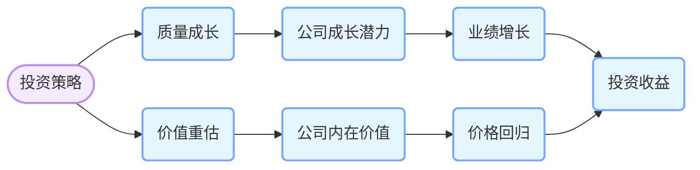

# 彼得林奇的"质量成长"vs"价值重估"

> 关键词：彼得林奇、质量成长、价值重估、投资策略、股票分析

> 摘要：本文深入探讨了彼得林奇提出的“质量成长”与“价值重估”两种投资理念。通过详细剖析这两种理念的核心概念、算法原理、数学模型，结合实际案例和应用场景进行对比分析。旨在帮助投资者更好地理解这两种策略的特点、适用情况以及面临的挑战，为投资决策提供有价值的参考。

## 1. 背景介绍 
### 1.1 目的和范围
彼得林奇作为投资界的传奇人物，其投资策略影响深远。“质量成长”和“价值重估”是他投资体系中的重要组成部分。本文的目的在于全面、深入地对比这两种投资理念，分析它们的原理、应用场景以及优缺点。范围涵盖从理论基础到实际案例的各个方面，帮助读者清晰地认识这两种策略在投资实践中的运用。

### 1.2 预期读者
本文预期读者主要包括对投资领域感兴趣的初学者，希望通过学习经典投资策略来提升自己投资能力；有一定投资经验的投资者，想要深入了解彼得林奇的投资理念并优化自己的投资组合；金融专业的学生和研究人员，可将本文作为研究投资策略的参考资料。

### 1.3 文档结构概述
本文将首先介绍相关的核心概念和它们之间的联系，通过文本示意图和 Mermaid 流程图进行直观展示。接着阐述核心算法原理和具体操作步骤，使用 Python 源代码详细说明。然后讲解数学模型和公式，并举例说明。之后通过项目实战，给出代码实际案例和详细解释。再探讨实际应用场景，推荐相关的工具和资源。最后总结未来发展趋势与挑战，提供常见问题解答和扩展阅读参考资料。

### 1.4 术语表
#### 1.4.1 核心术语定义
- **质量成长**：指投资于那些具有持续增长潜力、具备优秀基本面和竞争优势的公司，通过公司业绩的增长实现股票价值的提升。
- **价值重估**：是指寻找那些市场价格低于其内在价值的股票，随着市场对其价值的重新认识，股价有望回归合理水平，从而获得投资收益。

#### 1.4.2 相关概念解释
- **内在价值**：是指公司的真实价值，它基于公司的资产、盈利能力、现金流等基本面因素计算得出，是判断股票是否被低估或高估的重要依据。
- **成长股**：通常是指那些业绩增长速度较快、具有较大发展潜力的公司股票，是质量成长策略的主要投资对象。
- **价值股**：指那些股价相对较低、被市场低估的股票，是价值重估策略关注的重点。

#### 1.4.3 缩略词列表
- **PE**：市盈率（Price-to-Earnings Ratio），是指股票价格除以每股收益的比率，用于衡量股票的估值水平。
- **PB**：市净率（Price-to-Book Ratio），是指股票价格与每股净资产的比率，反映了市场对公司净资产的估值。

## 2. 核心概念与联系 

### 核心概念原理
#### 质量成长
质量成长策略的核心在于寻找那些具有高成长潜力的公司。这些公司通常具有以下特点：
- **优秀的管理层**：具备卓越的领导能力和战略眼光，能够带领公司在市场竞争中脱颖而出。
- **独特的竞争优势**：如品牌优势、技术壁垒、成本优势等，使其在行业中具有较强的竞争力。
- **良好的财务状况**：包括稳定的营收增长、高毛利率、低负债率等，为公司的持续发展提供坚实的基础。

投资者通过对这些公司的深入研究和分析，选择具有潜力的股票进行长期投资，随着公司业绩的增长，股票价格也会相应上涨，从而实现投资收益。

#### 价值重估
价值重估策略则侧重于寻找被市场低估的股票。市场可能由于各种原因，如行业不景气、短期负面消息等，导致某些股票的价格低于其内在价值。投资者通过对公司基本面的分析和估值模型的运用，发现这些被低估的股票。当市场逐渐认识到公司的真实价值时，股价会向内在价值回归，投资者从中获利。

### 架构的文本示意图
```plaintext
          投资策略
         /           \
  质量成长         价值重估
    |                 |
公司成长潜力       公司内在价值
    |                 |
业绩增长           价格回归
    |                 |
投资收益           投资收益
```

### Mermaid 流程图


## 3. 核心算法原理 & 具体操作步骤 

### 质量成长策略的核心算法原理与步骤
#### 原理
质量成长策略的核心在于评估公司的成长潜力。我们可以通过分析公司的营收增长率、净利润增长率等指标来衡量其成长能力。同时，考虑公司的行业地位、竞争优势等因素，综合判断其未来的发展前景。

#### 具体操作步骤
1. **数据收集**：收集公司的财务报表，包括资产负债表、利润表和现金流量表，获取营收、净利润等关键数据。
2. **计算增长率**：计算公司过去几年的营收增长率和净利润增长率。
3. **行业分析**：研究公司所处的行业，评估行业的发展趋势和竞争格局。
4. **竞争优势评估**：分析公司的品牌、技术、成本等竞争优势。
5. **综合评估**：根据以上分析结果，对公司的成长潜力进行综合评估，选择具有高成长潜力的股票。

#### Python 源代码实现
```python
import pandas as pd

# 示例数据：公司的营收和净利润
revenue = [100, 120, 150, 180]
net_income = [20, 25, 30, 35]

# 计算营收增长率
revenue_growth = [(revenue[i] - revenue[i - 1]) / revenue[i - 1] for i in range(1, len(revenue))]

# 计算净利润增长率
net_income_growth = [(net_income[i] - net_income[i - 1]) / net_income[i - 1] for i in range(1, len(net_income))]

# 输出结果
print("营收增长率：", revenue_growth)
print("净利润增长率：", net_income_growth)
```

### 价值重估策略的核心算法原理与步骤
#### 原理
价值重估策略的核心是计算公司的内在价值，并与当前股价进行比较。常用的估值方法有市盈率法、市净率法等。通过这些方法计算出公司的合理股价，判断股票是否被低估。

#### 具体操作步骤
1. **数据收集**：收集公司的财务数据，包括每股收益、每股净资产等。
2. **选择估值方法**：根据公司的特点和行业情况，选择合适的估值方法，如市盈率法、市净率法等。
3. **计算内在价值**：使用选定的估值方法计算公司的内在价值。
4. **比较价格**：将计算出的内在价值与当前股价进行比较，判断股票是否被低估。
5. **投资决策**：如果股票被低估，则考虑买入；否则，继续寻找其他投资机会。

#### Python 源代码实现
```python
# 示例数据：每股收益、每股净资产、行业平均市盈率、行业平均市净率
eps = 2
book_value_per_share = 10
industry_pe = 15
industry_pb = 2

# 使用市盈率法计算内在价值
pe_value = eps * industry_pe

# 使用市净率法计算内在价值
pb_value = book_value_per_share * industry_pb

# 输出结果
print("市盈率法计算的内在价值：", pe_value)
print("市净率法计算的内在价值：", pb_value)
```

## 4. 数学模型和公式 & 详细讲解 & 举例说明 

### 质量成长策略的数学模型和公式
#### 营收增长率公式
$$
\text{营收增长率} = \frac{\text{本期营收} - \text{上期营收}}{\text{上期营收}} \times 100\%
$$

#### 净利润增长率公式
$$
\text{净利润增长率} = \frac{\text{本期净利润} - \text{上期净利润}}{\text{上期净利润}} \times 100\%
$$

#### 详细讲解
营收增长率反映了公司业务的扩张速度，是衡量公司成长能力的重要指标之一。净利润增长率则体现了公司盈利能力的变化情况。通过计算这两个指标，可以直观地了解公司的成长趋势。

#### 举例说明
假设一家公司去年的营收为 1000 万元，今年的营收为 1200 万元，则其营收增长率为：
$$
\frac{1200 - 1000}{1000} \times 100\% = 20\%
$$
如果去年的净利润为 100 万元，今年的净利润为 120 万元，则净利润增长率为：
$$
\frac{120 - 100}{100} \times 100\% = 20\%
$$

### 价值重估策略的数学模型和公式
#### 市盈率法估值公式
$$
\text{内在价值} = \text{每股收益} \times \text{行业平均市盈率}
$$

#### 市净率法估值公式
$$
\text{内在价值} = \text{每股净资产} \times \text{行业平均市净率}
$$

#### 详细讲解
市盈率法是通过将公司的每股收益乘以行业平均市盈率来计算公司的内在价值。市净率法则是用每股净资产乘以行业平均市净率。这两种方法都是基于行业平均水平来评估公司的价值，适用于不同类型的公司。

#### 举例说明
假设一家公司的每股收益为 3 元，行业平均市盈率为 18 倍，则使用市盈率法计算的内在价值为：
$$
3 \times 18 = 54 \text{（元）}
$$
如果该公司的每股净资产为 15 元，行业平均市净率为 2 倍，则使用市净率法计算的内在价值为：
$$
15 \times 2 = 30 \text{（元）}
$$

## 5. 项目实战：代码实际案例和详细解释说明 

### 5.1  开发环境搭建
#### 操作系统
建议使用 Windows、Linux 或 macOS 操作系统。

#### 编程语言和工具
- **Python**：选择 Python 3.x 版本，Python 具有丰富的数据分析和科学计算库，非常适合用于投资分析。
- **Anaconda**：是一个 Python 发行版，包含了许多常用的数据分析库，如 Pandas、Numpy 等。可以从 Anaconda 官方网站下载并安装。
- **Jupyter Notebook**：是一个交互式的开发环境，方便编写和运行代码，同时可以添加文本说明和可视化图表。安装 Anaconda 后，Jupyter Notebook 会自动安装。

### 5.2  源代码详细实现和代码解读
#### 质量成长策略案例
```python
import pandas as pd
import matplotlib.pyplot as plt

# 读取公司财务数据
data = pd.read_csv('company_financial_data.csv')

# 计算营收增长率和净利润增长率
data['Revenue Growth'] = data['Revenue'].pct_change()
data['Net Income Growth'] = data['Net Income'].pct_change()

# 绘制营收增长率和净利润增长率折线图
plt.figure(figsize=(10, 6))
plt.plot(data['Year'], data['Revenue Growth'], label='Revenue Growth')
plt.plot(data['Year'], data['Net Income Growth'], label='Net Income Growth')
plt.xlabel('Year')
plt.ylabel('Growth Rate')
plt.title('Revenue and Net Income Growth Rate')
plt.legend()
plt.show()

# 筛选出营收增长率和净利润增长率均大于 10% 的年份
growth_years = data[(data['Revenue Growth'] > 0.1) & (data['Net Income Growth'] > 0.1)]
print("营收增长率和净利润增长率均大于 10% 的年份：")
print(growth_years[['Year', 'Revenue Growth', 'Net Income Growth']])
```

#### 代码解读
1. **数据读取**：使用 Pandas 库的 `read_csv` 函数读取公司的财务数据文件。
2. **增长率计算**：使用 `pct_change` 函数计算营收增长率和净利润增长率。
3. **可视化**：使用 Matplotlib 库绘制营收增长率和净利润增长率的折线图，直观展示公司的成长趋势。
4. **筛选数据**：筛选出营收增长率和净利润增长率均大于 10% 的年份，帮助投资者发现公司的高成长阶段。

#### 价值重估策略案例
```python
import pandas as pd

# 读取公司财务数据
data = pd.read_csv('company_financial_data.csv')

# 计算每股收益和每股净资产
data['EPS'] = data['Net Income'] / data['Shares Outstanding']
data['Book Value per Share'] = data['Total Equity'] / data['Shares Outstanding']

# 假设行业平均市盈率为 15，行业平均市净率为 2
industry_pe = 15
industry_pb = 2

# 使用市盈率法和市净率法计算内在价值
data['PE Value'] = data['EPS'] * industry_pe
data['PB Value'] = data['Book Value per Share'] * industry_pb

# 计算当前股价与内在价值的比值
data['PE Ratio'] = data['Stock Price'] / data['PE Value']
data['PB Ratio'] = data['Stock Price'] / data['PB Value']

# 筛选出被低估的股票（PE Ratio < 1 且 PB Ratio < 1）
undervalued_stocks = data[(data['PE Ratio'] < 1) & (data['PB Ratio'] < 1)]
print("被低估的股票：")
print(undervalued_stocks[['Year', 'Stock Price', 'PE Value', 'PB Value', 'PE Ratio', 'PB Ratio']])
```

#### 代码解读
1. **数据读取**：同样使用 Pandas 库的 `read_csv` 函数读取公司的财务数据文件。
2. **指标计算**：计算每股收益、每股净资产、市盈率法和市净率法计算的内在价值。
3. **比值计算**：计算当前股价与内在价值的比值，判断股票是否被低估。
4. **筛选数据**：筛选出 PE Ratio < 1 且 PB Ratio < 1 的股票，即被低估的股票。

### 5.3  代码解读与分析
#### 质量成长策略
通过计算营收增长率和净利润增长率，我们可以了解公司的成长趋势。绘制折线图可以直观地展示公司在不同年份的成长情况。筛选出高成长年份的数据，有助于投资者发现公司的成长潜力，选择在合适的时机进行投资。

#### 价值重估策略
通过计算每股收益、每股净资产和内在价值，我们可以评估公司的估值水平。计算当前股价与内在价值的比值，能够判断股票是否被低估。筛选出被低估的股票，为投资者提供了潜在的投资机会。

## 6. 实际应用场景 
### 质量成长策略的应用场景
#### 新兴行业
在新兴行业中，如科技、生物制药等，许多公司处于快速发展阶段，具有较高的成长潜力。投资者可以通过质量成长策略，寻找那些具有独特技术或商业模式的公司，进行长期投资。例如，在人工智能领域，一些初创公司凭借先进的算法和技术，有望在未来实现快速增长，投资者可以关注这些公司的发展动态，适时进行投资。

#### 成长型市场
在经济快速发展的国家或地区，整体市场呈现出成长型特征。此时，质量成长策略可以帮助投资者选择那些受益于经济增长的公司。例如，在新兴经济体中，消费、医疗等行业通常会随着经济的发展而迅速增长，投资者可以选择这些行业中的优质公司进行投资。

### 价值重估策略的应用场景
#### 行业低谷期
当某个行业处于低谷期时，由于市场情绪的影响，该行业内的许多股票价格可能会被低估。投资者可以通过价值重估策略，挖掘那些基本面良好但暂时被市场忽视的公司。例如，在钢铁行业产能过剩时期，钢铁企业的股价普遍下跌，但一些具有成本优势和技术实力的企业，其内在价值并未改变，投资者可以在此时进行价值重估，寻找投资机会。

#### 并购重组时期
在并购重组时期，一些公司的价值可能会被重新评估。例如，当一家公司被另一家更具实力的公司收购时，市场可能会对其价值进行重新定价。投资者可以通过分析并购重组的影响，判断公司的内在价值是否被低估，从而进行投资决策。

## 7. 工具和资源推荐
### 7.1 学习资源推荐
#### 7.1.1 书籍推荐
- 《彼得·林奇的成功投资》：彼得·林奇亲自撰写的投资经典著作，详细介绍了他的投资理念和方法，对“质量成长”和“价值重估”策略有深入的阐述。
- 《聪明的投资者》：本杰明·格雷厄姆的代表作，被誉为投资界的圣经，书中介绍了价值投资的基本原理和方法，对理解价值重估策略有很大帮助。
- 《怎样选择成长股》：菲利普·费雪的经典著作，重点探讨了如何寻找成长股，对质量成长策略的应用具有指导意义。

#### 7.1.2 在线课程
- Coursera 上的“投资学原理”课程：由知名大学的教授授课，系统介绍了投资学的基本理论和方法，包括股票投资策略的讲解。
- 网易云课堂上的“价值投资实战课程”：结合实际案例，深入讲解价值投资的理念和方法，对理解价值重估策略有很大帮助。

#### 7.1.3 技术博客和网站
- 雪球网：是一个投资社区，汇集了众多投资者的经验和观点，投资者可以在上面学习到不同的投资策略和方法。
- 东方财富网：提供丰富的财经资讯和股票数据，投资者可以通过该网站获取公司的财务报表、行业数据等信息，为投资分析提供支持。

### 7.2 开发工具框架推荐
#### 7.2.1 IDE和编辑器
- PyCharm：是一款专业的 Python 集成开发环境，具有强大的代码编辑、调试和自动补全功能，适合用于编写投资分析代码。
- Jupyter Notebook：是一个交互式的开发环境，方便编写和运行代码，同时可以添加文本说明和可视化图表，非常适合用于数据分析和投资研究。

#### 7.2.2 调试和性能分析工具
- PDB：是 Python 自带的调试工具，可以帮助开发者定位代码中的错误和问题。
- cProfile：是 Python 的性能分析工具，可以分析代码的运行时间和性能瓶颈，帮助开发者优化代码。

#### 7.2.3 相关框架和库
- Pandas：是一个强大的数据分析库，提供了丰富的数据结构和数据处理方法，适合用于处理和分析公司的财务数据。
- Numpy：是一个用于科学计算的库，提供了高效的数组操作和数学函数，在投资分析中经常用于数据计算和模型实现。
- Matplotlib：是一个用于数据可视化的库，可以绘制各种类型的图表，如折线图、柱状图、散点图等，帮助投资者直观地展示数据和分析结果。

### 7.3 相关论文著作推荐
#### 7.3.1 经典论文
- “The Capital Asset Pricing Model: Theory and Evidence”：该论文对资本资产定价模型进行了深入的研究和探讨，是投资领域的经典论文之一。
- “Efficient Capital Markets: A Review of Theory and Empirical Work”：提出了有效市场假说，对理解股票市场的定价机制和投资策略具有重要意义。

#### 7.3.2 最新研究成果
- 关注顶级金融学术期刊，如《Journal of Finance》、《Review of Financial Studies》等，这些期刊会发表投资领域的最新研究成果，包括对“质量成长”和“价值重估”策略的研究。

#### 7.3.3 应用案例分析
- 可以参考一些投资研究机构发布的报告，如高盛、摩根士丹利等，这些报告中会包含大量的投资案例分析，对理解“质量成长”和“价值重估”策略的实际应用具有参考价值。

## 8. 总结：未来发展趋势与挑战
### 未来发展趋势
#### 科技融合
随着科技的不断发展，人工智能、大数据等技术将与投资领域深度融合。在“质量成长”和“价值重估”策略中，这些技术可以帮助投资者更高效地收集和分析数据，提高投资决策的准确性。例如，通过人工智能算法可以对大量的公司财务数据和市场信息进行分析，挖掘潜在的投资机会。

#### 全球投资
随着全球经济一体化的发展，投资者的视野将更加全球化。“质量成长”和“价值重估”策略不再局限于国内市场，投资者可以在全球范围内寻找具有投资价值的公司。例如，新兴市场的快速发展为投资者提供了更多的成长机会，而一些发达国家的成熟市场则可能存在被低估的股票。

#### 可持续投资
越来越多的投资者开始关注企业的社会责任和可持续发展。在“质量成长”和“价值重估”策略中，企业的环境、社会和治理（ESG）因素将成为重要的考虑因素。具有良好 ESG 表现的公司可能具有更高的成长潜力和投资价值。

### 挑战
#### 市场不确定性
股票市场充满了不确定性，宏观经济环境、政策变化、行业竞争等因素都会对股票价格产生影响。投资者在运用“质量成长”和“价值重估”策略时，需要面对市场的不确定性，准确判断公司的成长潜力和内在价值并非易事。

#### 数据质量和分析能力
在科技融合的背景下，数据的质量和分析能力成为关键。投资者需要获取准确、及时的公司财务数据和市场信息，并具备较强的数据分析能力。然而，数据的准确性和完整性可能存在问题，同时投资者的分析能力也需要不断提升。

#### 投资者情绪影响
投资者情绪对股票市场的影响不可忽视。在市场波动较大时，投资者的情绪可能会导致股票价格偏离其内在价值。投资者在运用“质量成长”和“价值重估”策略时，需要克服情绪的影响，保持理性的投资决策。

## 9. 附录：常见问题与解答
### 问题 1：“质量成长”和“价值重估”策略可以同时使用吗？
答：可以。这两种策略并不是相互排斥的，投资者可以根据市场情况和自身的投资目标，同时运用这两种策略构建投资组合。例如，在成长型市场中，可以适当增加质量成长型股票的比例；在市场低迷时，可以关注价值重估型股票的投资机会。

### 问题 2：如何判断公司的竞争优势？
答：可以从多个方面判断公司的竞争优势，如品牌优势、技术壁垒、成本优势、市场份额等。品牌优势可以通过消费者的认知度和忠诚度来衡量；技术壁垒可以通过公司的专利数量、研发投入等指标来评估；成本优势可以通过比较公司与竞争对手的成本结构来判断；市场份额则反映了公司在行业中的地位。

### 问题 3：在使用估值方法时，如何选择合适的行业平均指标？
答：选择合适的行业平均指标需要考虑多个因素，如行业的发展阶段、竞争格局、盈利模式等。可以参考行业研究报告、专业机构的统计数据等，同时结合自己的分析和判断。一般来说，选择同行业中具有代表性的公司作为参考，计算其平均市盈率、市净率等指标。

### 问题 4：如何应对市场的不确定性？
答：应对市场的不确定性需要投资者具备一定的风险管理能力。可以通过分散投资、定期调整投资组合等方式降低风险。同时，要保持对市场的关注，及时了解宏观经济环境、政策变化等因素的影响，根据市场情况调整投资策略。

## 10. 扩展阅读 & 参考资料
### 扩展阅读
- 《金融炼金术》：乔治·索罗斯的著作，介绍了他的反身性理论和投资哲学，对理解市场的复杂性和投资决策有一定的启发。
- 《黑天鹅》：纳西姆·尼古拉斯·塔勒布的作品，探讨了极端事件对金融市场的影响，提醒投资者要关注市场中的不确定性。

### 参考资料
- 彼得·林奇的官方网站和相关访谈记录，获取第一手的投资理念和经验。
- 各大财经媒体和金融数据库，如 Wind 资讯、同花顺等，提供丰富的财经资讯和股票数据。

作者：AI天才研究院/AI Genius Institute & 禅与计算机程序设计艺术 /Zen And The Art of Computer Programming