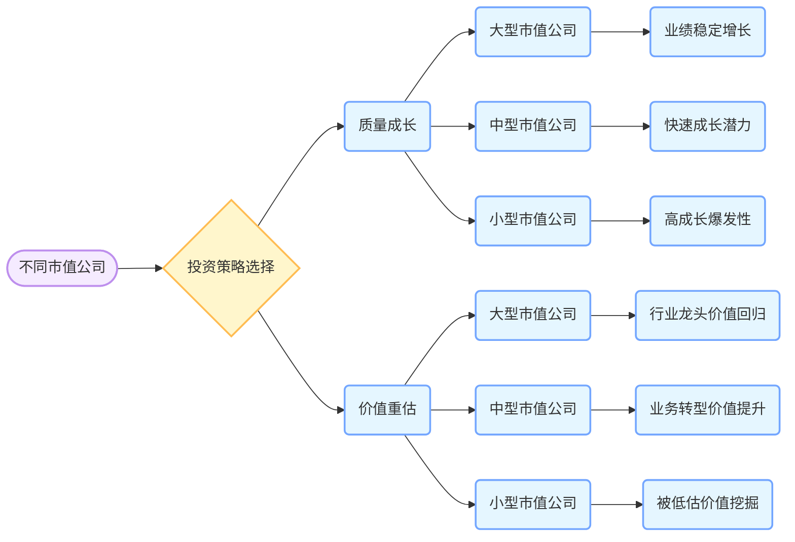

# 彼得林奇的“质量成长”vs“价值重估”在不同市值公司中的应用

> 关键词：彼得林奇、质量成长、价值重估、不同市值公司、投资策略

> 摘要：本文深入探讨了彼得林奇提出的“质量成长”和“价值重估”投资理念，并分析它们在不同市值公司中的应用。通过介绍相关核心概念、算法原理、数学模型，结合实际项目案例和应用场景，阐述这两种策略的特点与优势。同时，提供学习资源、开发工具和相关论文推荐，最后总结未来发展趋势与挑战，为投资者在不同市值公司投资中提供理论和实践参考。

## 1. 背景介绍 
### 1.1 目的和范围
本文章旨在全面剖析彼得林奇的“质量成长”和“价值重估”投资理念，并详细探讨它们在不同市值公司（包括大型市值公司、中型市值公司和小型市值公司）投资中的具体应用。通过深入研究这两种投资策略在不同规模企业中的适应性和有效性，帮助投资者更好地理解和运用这些策略，以提高投资决策的科学性和准确性，实现投资收益的最大化。

### 1.2 预期读者
本文主要面向对股票投资感兴趣的个人投资者，无论是初涉投资领域的新手，还是有一定投资经验但希望进一步提升投资能力的专业人士，都能从本文中获得有价值的信息和启示。同时，也适合金融专业的学生、研究人员以及从事投资咨询、金融分析等相关工作的从业者阅读参考。

### 1.3 文档结构概述
本文将按照以下结构展开：首先介绍核心概念与联系，阐述“质量成长”和“价值重估”的原理和架构；接着讲解核心算法原理及具体操作步骤，通过 Python 代码进行详细说明；然后介绍相关数学模型和公式，并举例说明；再通过项目实战展示代码实际案例并进行详细解释；之后分析实际应用场景；推荐学习资源、开发工具和相关论文；最后总结未来发展趋势与挑战，同时提供常见问题解答和扩展阅读参考资料。

### 1.4 术语表
#### 1.4.1 核心术语定义
- **质量成长**：指公司凭借自身优秀的产品或服务质量、高效的管理团队、强大的研发能力等内在因素，实现持续稳定的业绩增长和市场份额扩大，从而推动公司价值不断提升的一种成长模式。
- **价值重估**：是指由于市场环境变化、公司基本面发生重大改变、行业发展趋势调整等原因，导致市场对公司原有估值出现偏差，进而对公司价值进行重新评估和定价的过程。
- **市值**：指一家上市公司的发行股份按市场价格计算出来的股票总价值，其计算方法为每股股票的市场价格乘以发行总股数。

#### 1.4.2 相关概念解释
- **成长股**：通常是指那些销售额和利润额持续增长，并且其增长速度快于整个国家及其所在行业的公司所发行的股票。成长股具有较高的盈利增长潜力，往往受到投资者的青睐。
- **价值股**：是指相对于它们的现有业绩收益，股价被低估的一类股票。这类股票通常具有较低的市盈率、市净率等估值指标，公司可能具有稳定的现金流、较高的股息率等特点。

#### 1.4.3 缩略词列表
- **PE**：市盈率（Price Earnings Ratio），是指股票价格除以每股收益（EPS）的比率，反映了市场对公司盈利的预期和估值水平。
- **PB**：市净率（Price to Book Ratio），是指每股股价与每股净资产的比率，用于衡量股票的投资价值和风险程度。

## 2. 核心概念与联系 

### 2.1 “质量成长”原理
“质量成长”强调公司的内在品质和持续发展能力。具有高质量成长特征的公司通常具备以下特点：
- **优秀的产品或服务**：能够满足市场需求，具有较高的市场竞争力和客户忠诚度。例如，苹果公司凭借其创新的产品设计、卓越的用户体验和强大的品牌影响力，在全球智能手机市场占据重要地位，实现了持续的业绩增长。
- **高效的管理团队**：具备出色的战略眼光、决策能力和执行能力，能够合理配置资源，推动公司不断发展壮大。如亚马逊的创始人杰夫·贝索斯，以其独特的商业洞察力和创新精神，带领亚马逊从一家网上书店发展成为全球最大的电子商务和云计算服务提供商之一。
- **持续的创新能力**：不断投入研发，推出新产品、新服务或新的商业模式，以适应市场变化和竞争挑战。例如，特斯拉在电动汽车和自动驾驶技术领域的持续创新，使其成为全球电动汽车行业的领军企业。

### 2.2 “价值重估”原理
“价值重估”的触发因素多种多样，主要包括以下几个方面：
- **市场环境变化**：宏观经济形势、行业政策、利率水平等市场因素的变化，可能导致市场对公司的预期发生改变，从而引发价值重估。例如，随着环保政策的加强，新能源行业受到市场的关注和青睐，相关公司的估值也随之提升。
- **公司基本面改变**：公司的重大资产重组、业务转型、技术突破等基本面变化，会使市场重新评估公司的价值。比如，一家传统制造业公司通过收购新兴科技企业实现业务转型，市场可能会对其未来发展前景给予更高的估值。
- **行业发展趋势调整**：行业的技术创新、市场需求变化、竞争格局调整等因素，会影响公司在行业中的地位和价值。例如，随着互联网技术的发展，传统零售行业受到电商的冲击，一些传统零售企业的价值可能被重新评估。

### 2.3 两者联系
“质量成长”和“价值重估”并不是相互独立的，而是存在一定的联系。一方面，具有质量成长潜力的公司在成长过程中，可能会因为业绩的持续增长和市场地位的提升，引发市场对其价值的重新评估，从而实现价值重估。另一方面，价值重估也可能为公司的质量成长提供契机。例如，当公司的价值被低估时，可能会吸引战略投资者的关注，为公司带来资金、技术和管理经验等资源，促进公司的质量成长。

### 2.4 架构示意图
以下是“质量成长”和“价值重估”在不同市值公司中的应用架构示意图：



该示意图展示了在不同市值公司中，投资者可以选择“质量成长”或“价值重估”投资策略，并且每种策略在不同市值公司中具有不同的表现和应用重点。

## 3. 核心算法原理 & 具体操作步骤 

### 3.1 质量成长评估算法
#### 原理
质量成长评估主要通过分析公司的财务指标和非财务指标来判断公司的成长潜力。常用的财务指标包括营业收入增长率、净利润增长率、净资产收益率（ROE）等，非财务指标包括产品竞争力、管理团队能力、创新能力等。

#### Python 代码实现
```python
import pandas as pd

def quality_growth_evaluation(financial_data):
    """
    质量成长评估函数
    :param financial_data: 包含财务指标的 DataFrame
    :return: 质量成长评分
    """
    # 计算营业收入增长率
    revenue_growth_rate = (financial_data['revenue'][-1] - financial_data['revenue'][-2]) / financial_data['revenue'][-2]
    
    # 计算净利润增长率
    net_profit_growth_rate = (financial_data['net_profit'][-1] - financial_data['net_profit'][-2]) / financial_data['net_profit'][-2]
    
    # 计算净资产收益率
    roe = financial_data['net_profit'][-1] / financial_data['equity'][-1]
    
    # 设定各指标权重
    weights = {'revenue_growth_rate': 0.3, 'net_profit_growth_rate': 0.3, 'roe': 0.4}
    
    # 计算质量成长评分
    score = revenue_growth_rate * weights['revenue_growth_rate'] + \
            net_profit_growth_rate * weights['net_profit_growth_rate'] + \
            roe * weights['roe']
    
    return score

# 示例财务数据
financial_data = pd.DataFrame({
    'revenue': [100, 120, 150],
    'net_profit': [10, 12, 18],
    'equity': [50, 60, 70]
})

# 调用评估函数
score = quality_growth_evaluation(financial_data)
print(f"质量成长评分: {score}")
```

#### 具体操作步骤
1. 收集公司的财务数据，包括营业收入、净利润、净资产等。
2. 计算各项财务指标，如营业收入增长率、净利润增长率、净资产收益率等。
3. 设定各指标的权重，根据指标的重要性进行分配。
4. 计算质量成长评分，将各指标值乘以相应的权重并求和。

### 3.2 价值重估评估算法
#### 原理
价值重估评估主要通过比较公司的市场价值和内在价值来判断公司是否被低估或高估。常用的方法包括市盈率法、市净率法、现金流折现法等。

#### Python 代码实现
```python
def value_reassessment_evaluation(market_value, intrinsic_value):
    """
    价值重估评估函数
    :param market_value: 市场价值
    :param intrinsic_value: 内在价值
    :return: 价值重估评分
    """
    # 计算价值比率
    value_ratio = market_value / intrinsic_value
    
    # 根据价值比率判断价值重估情况
    if value_ratio < 1:
        score = 1  # 被低估
    elif value_ratio == 1:
        score = 0  # 合理估值
    else:
        score = -1  # 被高估
    
    return score

# 示例数据
market_value = 100
intrinsic_value = 120

# 调用评估函数
score = value_reassessment_evaluation(market_value, intrinsic_value)
if score == 1:
    print("公司价值被低估")
elif score == 0:
    print("公司价值合理估值")
else:
    print("公司价值被高估")
```

#### 具体操作步骤
1. 确定公司的市场价值，通常可以通过股票价格乘以发行总股数得到。
2. 估算公司的内在价值，可以采用市盈率法、市净率法、现金流折现法等方法。
3. 计算价值比率，即市场价值与内在价值的比值。
4. 根据价值比率判断公司的价值重估情况，若价值比率小于 1，则公司价值被低估；若等于 1，则为合理估值；若大于 1，则公司价值被高估。

## 4. 数学模型和公式 & 详细讲解 & 举例说明 

### 4.1 质量成长评估数学模型
#### 营业收入增长率公式
$$
\text{营业收入增长率} = \frac{\text{本期营业收入} - \text{上期营业收入}}{\text{上期营业收入}}
$$
详细讲解：营业收入增长率反映了公司业务规模的扩张速度。如果营业收入增长率为正且较高，说明公司的业务在不断增长，市场份额可能在扩大；反之，如果增长率为负，则表示公司的业务可能出现萎缩。

举例说明：假设某公司上一年度的营业收入为 1000 万元，本年度的营业收入为 1200 万元，则该公司的营业收入增长率为：
$$
\frac{1200 - 1000}{1000} = 0.2 = 20\%
$$

#### 净利润增长率公式
$$
\text{净利润增长率} = \frac{\text{本期净利润} - \text{上期净利润}}{\text{上期净利润}}
$$
详细讲解：净利润增长率衡量了公司盈利能力的变化情况。较高的净利润增长率表明公司的盈利能力在增强，可能是由于成本控制、产品提价、市场份额扩大等原因导致；而负的净利润增长率则意味着公司的盈利状况可能不佳。

举例说明：某公司上一年度的净利润为 100 万元，本年度的净利润为 120 万元，则该公司的净利润增长率为：
$$
\frac{120 - 100}{100} = 0.2 = 20\%
$$

#### 净资产收益率公式
$$
\text{净资产收益率} (ROE) = \frac{\text{净利润}}{\text{净资产}}
$$
详细讲解：净资产收益率反映了公司运用自有资本的效率。ROE 越高，说明公司利用自有资金创造利润的能力越强，股东权益的收益水平越高。

举例说明：某公司的净利润为 50 万元，净资产为 200 万元，则该公司的净资产收益率为：
$$
\frac{50}{200} = 0.25 = 25\%
$$

### 4.2 价值重估评估数学模型
#### 市盈率法
$$
\text{市盈率} (PE) = \frac{\text{股票价格}}{\text{每股收益}}
$$
详细讲解：市盈率是最常用的估值指标之一，它反映了市场对公司盈利的预期和估值水平。一般来说，较高的市盈率表示市场对公司的未来发展前景较为乐观，愿意为其支付较高的价格；而较低的市盈率则可能意味着公司被市场低估。

举例说明：某公司的股票价格为 20 元，每股收益为 2 元，则该公司的市盈率为：
$$
\frac{20}{2} = 10
$$

#### 市净率法
$$
\text{市净率} (PB) = \frac{\text{股票价格}}{\text{每股净资产}}
$$
详细讲解：市净率用于衡量股票的投资价值和风险程度。市净率较低的股票，可能具有较高的投资价值，因为其价格相对净资产较低；而市净率较高的股票，可能存在一定的泡沫风险。

举例说明：某公司的股票价格为 15 元，每股净资产为 10 元，则该公司的市净率为：
$$
\frac{15}{10} = 1.5
$$

#### 现金流折现法
$$
\text{内在价值} = \sum_{t=1}^{n} \frac{CF_t}{(1 + r)^t} + \frac{TV}{(1 + r)^n}
$$
其中，$CF_t$ 表示第 $t$ 期的现金流量，$r$ 表示折现率，$TV$ 表示终值，$n$ 表示预测期数。

详细讲解：现金流折现法是一种基于未来现金流量的估值方法，它将公司未来各期的现金流量折现到当前时点，以评估公司的内在价值。该方法考虑了资金的时间价值和公司的长期发展潜力，但需要对未来现金流量和折现率进行合理预测。

举例说明：假设某公司未来三年的现金流量分别为 100 万元、120 万元、150 万元，折现率为 10%，预测期结束后的终值为 1000 万元，则该公司的内在价值为：
$$
\begin{align*}
\text{内在价值} &= \frac{100}{(1 + 0.1)^1} + \frac{120}{(1 + 0.1)^2} + \frac{150}{(1 + 0.1)^3} + \frac{1000}{(1 + 0.1)^3}\\
&= \frac{100}{1.1} + \frac{120}{1.21} + \frac{150}{1.331} + \frac{1000}{1.331}\\
&\approx 90.91 + 99.17 + 112.69 + 751.31\\
&= 1054.08 \text{（万元）}
\end{align*}
$$

## 5. 项目实战：代码实际案例和详细解释说明 

### 5.1  开发环境搭建
#### 操作系统
可以选择 Windows、Mac OS 或 Linux 操作系统，建议使用最新版本以确保系统的稳定性和兼容性。

#### Python 环境
安装 Python 3.x 版本，推荐使用 Anaconda 发行版，它集成了许多常用的科学计算和数据分析库，方便开发和管理。

#### 安装必要的库
在命令行中使用以下命令安装所需的库：
```sh
pip install pandas numpy matplotlib yfinance
```
其中，`pandas` 用于数据处理和分析，`numpy` 用于数值计算，`matplotlib` 用于数据可视化，`yfinance` 用于获取股票数据。

### 5.2  源代码详细实现和代码解读
```python
import yfinance as yf
import pandas as pd
import matplotlib.pyplot as plt

# 定义获取股票数据的函数
def get_stock_data(ticker, start_date, end_date):
    """
    获取指定股票在指定日期范围内的数据
    :param ticker: 股票代码
    :param start_date: 开始日期
    :param end_date: 结束日期
    :return: 包含股票数据的 DataFrame
    """
    data = yf.download(ticker, start=start_date, end=end_date)
    return data

# 定义质量成长评估函数
def quality_growth_evaluation(financial_data):
    """
    质量成长评估函数
    :param financial_data: 包含财务指标的 DataFrame
    :return: 质量成长评分
    """
    # 计算营业收入增长率
    revenue_growth_rate = (financial_data['Revenue'][-1] - financial_data['Revenue'][-2]) / financial_data['Revenue'][-2]
    
    # 计算净利润增长率
    net_profit_growth_rate = (financial_data['Net Income'][-1] - financial_data['Net Income'][-2]) / financial_data['Net Income'][-2]
    
    # 计算净资产收益率
    roe = financial_data['Net Income'][-1] / financial_data['Total Equity'][-1]
    
    # 设定各指标权重
    weights = {'revenue_growth_rate': 0.3, 'net_profit_growth_rate': 0.3, 'roe': 0.4}
    
    # 计算质量成长评分
    score = revenue_growth_rate * weights['revenue_growth_rate'] + \
            net_profit_growth_rate * weights['net_profit_growth_rate'] + \
            roe * weights['roe']
    
    return score

# 定义价值重估评估函数
def value_reassessment_evaluation(market_value, intrinsic_value):
    """
    价值重估评估函数
    :param market_value: 市场价值
    :param intrinsic_value: 内在价值
    :return: 价值重估评分
    """
    # 计算价值比率
    value_ratio = market_value / intrinsic_value
    
    # 根据价值比率判断价值重估情况
    if value_ratio < 1:
        score = 1  # 被低估
    elif value_ratio == 1:
        score = 0  # 合理估值
    else:
        score = -1  # 被高估
    
    return score

# 主函数
def main():
    # 股票代码
    ticker = 'AAPL'
    # 开始日期
    start_date = '2020-01-01'
    # 结束日期
    end_date = '2023-01-01'
    
    # 获取股票数据
    stock_data = get_stock_data(ticker, start_date, end_date)
    
    # 模拟财务数据（实际应用中需要从财务报表获取）
    financial_data = pd.DataFrame({
        'Revenue': [100, 120, 150],
        'Net Income': [10, 12, 18],
        'Total Equity': [50, 60, 70]
    })
    
    # 进行质量成长评估
    quality_score = quality_growth_evaluation(financial_data)
    print(f"质量成长评分: {quality_score}")
    
    # 模拟市场价值和内在价值
    market_value = 100
    intrinsic_value = 120
    
    # 进行价值重估评估
    value_score = value_reassessment_evaluation(market_value, intrinsic_value)
    if value_score == 1:
        print("公司价值被低估")
    elif value_score == 0:
        print("公司价值合理估值")
    else:
        print("公司价值被高估")
    
    # 绘制股票价格走势图
    plt.figure(figsize=(10, 6))
    plt.plot(stock_data['Close'])
    plt.title(f"{ticker} Stock Price")
    plt.xlabel('Date')
    plt.ylabel('Price')
    plt.show()

if __name__ == "__main__":
    main()
```

### 5.3  代码解读与分析
#### 代码整体功能
该代码主要实现了获取指定股票的历史数据，对公司进行质量成长评估和价值重估评估，并绘制股票价格走势图的功能。

#### 代码详细解读
1. **获取股票数据**：使用 `yfinance` 库的 `download` 函数获取指定股票在指定日期范围内的历史数据。
2. **质量成长评估**：通过计算营业收入增长率、净利润增长率和净资产收益率，并根据设定的权重计算质量成长评分。
3. **价值重估评估**：比较市场价值和内在价值，根据价值比率判断公司是否被低估、合理估值或高估。
4. **绘制股票价格走势图**：使用 `matplotlib` 库绘制股票的收盘价走势图，方便直观地观察股票价格的变化趋势。

#### 代码分析
- 优点：代码结构清晰，模块化设计便于维护和扩展；使用了常用的库，实现了数据获取、分析和可视化的功能。
- 不足：财务数据是模拟的，实际应用中需要从公司的财务报表中获取真实数据；内在价值的估算方法较为简单，实际应用中需要采用更复杂的模型。

## 6. 实际应用场景 
### 6.1 大型市值公司
#### 质量成长应用
大型市值公司通常具有稳定的业绩和较强的市场竞争力，采用质量成长策略可以关注公司的持续创新能力和市场份额的巩固与扩大。例如，苹果公司通过不断推出新的产品和服务，如 iPhone、iPad、Apple Watch 等，持续提升用户体验和市场占有率，实现了业绩的稳定增长。投资者可以通过分析公司的研发投入、新产品推出计划、用户满意度等指标，评估公司的质量成长潜力。

#### 价值重估应用
大型市值公司由于其市场关注度高，估值相对较为合理，但在市场环境变化或公司基本面发生重大改变时，也可能出现价值重估的机会。例如，当行业竞争加剧导致公司业绩下滑，市场可能会过度反应，使公司股价下跌，从而出现价值低估的情况。此时，投资者可以通过深入分析公司的基本面和行业发展趋势，判断公司的内在价值是否被低估，从而寻找投资机会。

### 6.2 中型市值公司
#### 质量成长应用
中型市值公司具有一定的成长潜力和发展空间，采用质量成长策略可以关注公司的业务拓展和市场份额的提升。例如，一些中型市值的科技公司可能在某个细分领域具有独特的技术优势和市场竞争力，通过不断扩大业务规模和客户群体，实现业绩的快速增长。投资者可以通过分析公司的市场定位、产品创新能力、客户资源等指标，评估公司的质量成长潜力。

#### 价值重估应用
中型市值公司由于其市场关注度相对较低，信息披露可能不够充分，容易出现估值偏差。例如，当公司进行业务转型或资产重组时，市场可能对其未来发展前景存在疑虑，导致股价下跌。此时，投资者可以通过深入研究公司的转型计划和重组方案，评估公司的内在价值是否被低估，从而抓住价值重估的机会。

### 6.3 小型市值公司
#### 质量成长应用
小型市值公司通常具有较高的成长爆发性，但也伴随着较高的风险。采用质量成长策略可以关注公司的创新能力和团队执行力。例如，一些小型市值的生物医药公司可能在研发某种创新药物，一旦研发成功，将可能带来巨大的商业价值。投资者可以通过分析公司的研发管线、科研团队实力、临床试验进展等指标，评估公司的质量成长潜力。

#### 价值重估应用
小型市值公司由于其规模较小，市场流动性较差，容易受到市场情绪的影响，导致股价波动较大。当公司的业绩被市场忽视或误解时，可能会出现价值低估的情况。投资者可以通过深入研究公司的基本面和行业发展趋势，挖掘被低估的小型市值公司，实现价值重估的投资收益。

## 7. 工具和资源推荐
### 7.1 学习资源推荐
#### 7.1.1 书籍推荐
- 《彼得·林奇的成功投资》：彼得·林奇亲自撰写的投资经典著作，详细介绍了他的投资理念和方法，包括如何选择成长股、如何进行价值分析等内容，对投资者具有很高的参考价值。
- 《聪明的投资者》：本杰明·格雷厄姆的经典著作，被誉为投资界的“圣经”。书中强调了价值投资的重要性，介绍了如何进行基本面分析和风险控制，对投资者树立正确的投资理念具有重要意义。
- 《怎样选择成长股》：菲利普·费雪的代表作，阐述了成长股投资的基本原则和方法，包括如何寻找具有成长潜力的公司、如何评估公司的管理团队等内容，对投资者寻找成长股具有指导作用。

#### 7.1.2 在线课程
- Coursera 上的“投资学原理”课程：由知名高校的教授授课，系统介绍了投资学的基本原理和方法，包括资产定价、投资组合理论、风险管理等内容，适合初学者学习。
- 网易云课堂上的“股票投资实战技巧”课程：由资深投资专家授课，结合实际案例讲解股票投资的实战技巧，包括选股方法、买卖时机把握、风险控制等内容，对有一定投资经验的投资者有很大帮助。

#### 7.1.3 技术博客和网站
- 雪球网：国内知名的投资交流社区，汇聚了大量的投资者和投资专家，提供股票行情、公司公告、研究报告等信息，同时还有投资者的交流和分享，是投资者获取信息和交流经验的重要平台。
- 东方财富网：提供全面的金融信息服务，包括股票行情、财经新闻、研究报告、数据分析等内容，是投资者了解市场动态和进行投资分析的重要工具。

### 7.2 开发工具框架推荐
#### 7.2.1 IDE和编辑器
- PyCharm：一款专业的 Python 集成开发环境，具有代码编辑、调试、版本控制等功能，支持多种 Python 库和框架，适合 Python 开发人员使用。
- Jupyter Notebook：一种交互式的开发环境，支持代码、文本、图像等多种格式的展示，方便进行数据分析和可视化，适合数据科学家和分析师使用。

#### 7.2.2 调试和性能分析工具
- pdb：Python 自带的调试工具，可以帮助开发人员定位代码中的问题，进行单步调试、变量查看等操作。
- cProfile：Python 自带的性能分析工具，可以分析代码的运行时间和函数调用情况，帮助开发人员优化代码性能。

#### 7.2.3 相关框架和库
- pandas：用于数据处理和分析的 Python 库，提供了丰富的数据结构和函数，方便进行数据清洗、转换、统计分析等操作。
- numpy：用于数值计算的 Python 库，提供了高效的多维数组对象和数学函数，是科学计算和数据分析的基础库。
- scikit-learn：用于机器学习的 Python 库，提供了丰富的机器学习算法和工具，包括分类、回归、聚类、降维等算法，方便进行数据挖掘和预测分析。

### 7.3 相关论文著作推荐
#### 7.3.1 经典论文
- 《资本资产定价模型：市场均衡的理论》：由威廉·夏普（William Sharpe）发表的经典论文，提出了资本资产定价模型（CAPM），为资产定价和投资组合理论奠定了基础。
- 《有效资本市场：理论与实证研究回顾》：由尤金·法玛（Eugene F. Fama）发表的经典论文，提出了有效市场假说，对金融市场的效率和定价机制进行了深入研究。

#### 7.3.2 最新研究成果
- 《行为金融学：对金融市场的新视角》：探讨了投资者的心理和行为对金融市场的影响，为解释金融市场的异常现象提供了新的理论和方法。
- 《机器学习在金融领域的应用研究》：介绍了机器学习算法在金融领域的应用，包括风险评估、信用评分、投资组合优化等方面的研究成果。

#### 7.3.3 应用案例分析
- 《某大型基金公司的投资策略分析》：分析了某大型基金公司的投资策略和业绩表现，包括选股方法、资产配置、风险控制等方面的内容，为投资者提供了实际案例参考。
- 《某科技公司的成长路径和投资价值分析》：对某科技公司的发展历程、业务模式、技术创新等方面进行了深入分析，评估了公司的投资价值和成长潜力。

## 8. 总结：未来发展趋势与挑战
### 8.1 未来发展趋势
#### 科技驱动的质量成长
随着科技的不断进步，科技驱动的质量成长将成为未来公司发展的重要趋势。例如，人工智能、大数据、云计算、物联网等新兴技术的应用，将为公司带来更高效的运营管理、更精准的市场定位和更创新的产品服务，从而推动公司实现质量成长。投资者可以关注那些在科技领域具有领先优势和创新能力的公司，寻找投资机会。

#### 价值重估的多元化
未来价值重估的触发因素将更加多元化，除了市场环境变化和公司基本面改变外，还可能受到社会、环境、政策等因素的影响。例如，随着全球对环境保护的重视，一些环保相关的公司可能会得到市场的重新评估和定价；随着人口老龄化的加剧，医疗保健、养老服务等行业的公司也可能出现价值重估的机会。投资者需要更加关注宏观环境和行业趋势的变化，及时发现价值重估的投资机会。

#### 不同市值公司的差异化发展
不同市值公司将呈现出差异化的发展趋势。大型市值公司将更加注重创新和国际化发展，通过并购重组、技术合作等方式拓展业务领域和市场份额；中型市值公司将在细分领域深耕细作，通过提升产品质量和服务水平，实现快速成长；小型市值公司将更加注重创新和创业，通过技术突破和商业模式创新，寻找新的发展机遇。投资者需要根据不同市值公司的特点和发展趋势，制定相应的投资策略。

### 8.2 挑战
#### 信息获取和分析难度增加
随着市场信息的爆炸式增长，投资者获取和分析有效信息的难度不断增加。一方面，需要从海量的信息中筛选出有价值的信息；另一方面，需要对信息进行深入分析和解读，以准确判断公司的质量成长和价值重估情况。这对投资者的信息处理能力和分析能力提出了更高的要求。

#### 市场不确定性增大
未来市场的不确定性将增大，宏观经济形势、政策法规、行业竞争等因素的变化都可能对公司的发展和股价产生影响。投资者需要具备更强的风险意识和风险管理能力，合理配置资产，降低投资风险。

#### 技术创新带来的挑战
科技的快速发展和创新给投资者带来了新的机遇，但也带来了新的挑战。例如，新兴技术的发展可能导致一些传统行业的公司面临淘汰风险，投资者需要及时调整投资组合，避免投资损失。同时，技术创新也可能带来新的投资泡沫，投资者需要具备辨别能力，避免盲目跟风投资。

## 9. 附录：常见问题与解答
### 问题 1：如何判断一家公司是否具有质量成长潜力？
解答：可以从多个方面进行判断，包括公司的产品或服务质量、管理团队能力、创新能力、财务指标等。具体来说，可以分析公司的营业收入增长率、净利润增长率、净资产收益率等财务指标，评估公司的盈利能力和成长速度；关注公司的研发投入、新产品推出计划等，了解公司的创新能力；考察公司的管理团队背景和业绩，评估管理团队的决策能力和执行能力。

### 问题 2：价值重估的时机如何把握？
解答：价值重估的时机把握比较困难，需要综合考虑市场环境、公司基本面和行业发展趋势等因素。一般来说，可以关注以下几个方面：一是市场出现大幅波动时，可能会导致公司股价与内在价值出现偏差，此时可以寻找价值重估的机会；二是公司发生重大事件，如资产重组、业务转型、技术突破等，可能会引发市场对公司价值的重新评估；三是行业发展趋势发生变化时，一些符合新趋势的公司可能会被市场重新定价。

### 问题 3：在不同市值公司中，“质量成长”和“价值重估”策略的优先级如何确定？
解答：在不同市值公司中，“质量成长”和“价值重估”策略的优先级需要根据公司的具体情况和市场环境来确定。对于大型市值公司，由于其业绩相对稳定，市场关注度高，估值相对合理，因此可以更注重质量成长策略，寻找具有持续创新能力和市场份额扩大潜力的公司；对于中型市值公司，由于其具有一定的成长潜力和发展空间，但市场关注度相对较低，容易出现估值偏差，因此可以同时关注质量成长和价值重估策略；对于小型市值公司，由于其具有较高的成长爆发性，但也伴随着较高的风险，因此可以更注重价值重估策略，挖掘被低估的小型市值公司。

### 问题 4：如何估算公司的内在价值？
解答：估算公司内在价值的方法有很多种，常用的方法包括市盈率法、市净率法、现金流折现法等。市盈率法是通过比较公司的市盈率与行业平均市盈率或同类公司的市盈率，来评估公司的估值水平；市净率法是通过比较公司的市净率与行业平均市净率或同类公司的市净率，来评估公司的投资价值；现金流折现法是通过预测公司未来的现金流量，并将其折现到当前时点，来计算公司的内在价值。不同的方法适用于不同的公司和行业，投资者可以根据具体情况选择合适的方法进行估算。

## 10. 扩展阅读 & 参考资料
- 《金融市场与金融机构》，作者：弗雷德里克·S·米什金（Frederic S. Mishkin）
- 《投资中最简单的事》，作者：邱国鹭
- 财经杂志：《财新》《证券市场周刊》等
- 专业研究机构报告：如中金公司、中信证券等发布的研究报告

作者：AI天才研究院/AI Genius Institute & 禅与计算机程序设计艺术 /Zen And The Art of Computer Programming