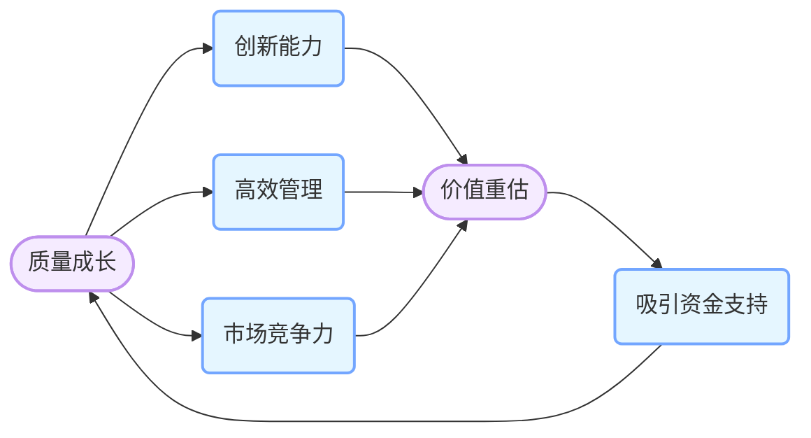

# 彼得林奇的“质量成长”vs“价值重估”在新经济中的平衡

> 关键词：彼得林奇、质量成长、价值重估、新经济、平衡策略

> 摘要：本文深入探讨了彼得林奇提出的“质量成长”和“价值重估”投资理念在新经济环境下的内涵、特点及相互关系。通过详细分析两者的核心概念、算法原理、数学模型，结合实际案例和应用场景，阐述了如何在新经济中实现两者的平衡。同时，提供了相关的学习资源、开发工具和研究论文推荐，最后总结了未来发展趋势与挑战，并对常见问题进行了解答，旨在为投资者和相关从业者在新经济背景下的投资决策提供全面且深入的参考。

## 1. 背景介绍 
### 1.1 目的和范围
在当今快速发展的新经济时代，各种新兴技术和商业模式不断涌现，传统的投资理念面临着新的挑战和机遇。彼得林奇作为投资界的传奇人物，其“质量成长”和“价值重估”的投资理念一直备受关注。本文的目的在于深入剖析这两种理念在新经济环境中的应用，探讨如何在两者之间找到平衡，以实现更有效的投资决策。文章的范围涵盖了对这两种理念的理论分析、算法原理、实际案例研究，以及在新经济各领域的应用场景等方面。

### 1.2 预期读者
本文预期读者包括专业的投资者、金融分析师、投资机构从业者、对投资领域感兴趣的学生以及关注新经济发展的相关人士。无论是希望深入了解投资理论的初学者，还是寻求在新经济环境下优化投资策略的专业人士，都能从本文中获得有价值的信息和启示。

### 1.3 文档结构概述
本文将按照以下结构展开：首先介绍核心概念与联系，明确“质量成长”和“价值重估”的定义和相互关系；接着阐述核心算法原理和具体操作步骤，通过Python代码详细说明；然后给出数学模型和公式，并进行详细讲解和举例；再通过项目实战，展示实际案例和代码解读；之后探讨实际应用场景；提供工具和资源推荐；最后总结未来发展趋势与挑战，解答常见问题，并列出扩展阅读和参考资料。

### 1.4 术语表
#### 1.4.1 核心术语定义
- **质量成长**：指企业通过持续的创新、高效的管理和良好的市场竞争力，实现业绩的稳定增长和质量的提升。在投资领域，关注具有质量成长潜力的企业，期望通过企业的成长获得投资回报。
- **价值重估**：是指由于市场环境变化、企业基本面改变或其他因素，导致市场对企业的价值评估发生变化。投资者通过发现被低估的企业价值，在价值重估过程中获取收益。
- **新经济**：是指在经济全球化背景下，由信息技术革命带动的、以高新技术产业为龙头的经济形态。新经济具有高创新性、高增长性、高风险性等特点，涵盖了互联网、人工智能、生物医药等多个新兴领域。

#### 1.4.2 相关概念解释
- **成长股**：是指那些销售额和利润额持续增长，且增长速度快于整个国家及其所在行业的公司所发行的股票。成长股通常具有较高的市盈率和市净率，投资者购买成长股是期望公司未来的盈利能够不断增加，从而推动股价上涨。
- **价值股**：是指相对于它们的现有收益，股价被低估的一类股票。这类股票通常具有较低的市盈率、市净率和较高的股息率，投资者认为市场对公司的价值评估过低，随着时间推移，市场会重新认识其价值，从而使股价上涨。

#### 1.4.3 缩略词列表
- **PE**：市盈率（Price-to-Earnings Ratio），是指股票价格除以每股收益（EPS）的比率，反映了市场对公司盈利的预期和估值水平。
- **PB**：市净率（Price-to-Book Ratio），是指股票价格与每股净资产的比率，用于衡量公司的市场价值与账面价值的关系。
- **ROE**：净资产收益率（Return on Equity），是指净利润与平均股东权益的百分比，反映了公司运用自有资本的效率和盈利能力。

## 2. 核心概念与联系 

### 2.1 “质量成长”的核心原理
“质量成长”强调企业的内在品质和长期增长潜力。具有质量成长特性的企业通常具备以下特点：
- **创新能力**：不断推出新产品、新服务或新的商业模式，以满足市场需求的变化。例如，苹果公司通过持续的技术创新，推出了iPhone、iPad等具有划时代意义的产品，引领了全球智能手机和平板电脑市场的发展。
- **高效管理**：拥有优秀的管理团队，能够合理配置资源，提高运营效率，降低成本。像亚马逊公司，通过先进的供应链管理和物流配送系统，实现了快速的商品交付和高效的运营，成为全球最大的电子商务公司之一。
- **市场竞争力**：在所在行业中具有较强的市场地位和竞争优势，能够抵御竞争对手的挑战。例如，腾讯公司在社交网络和游戏领域拥有强大的用户基础和品牌影响力，其旗下的微信和QQ成为全球知名的社交平台，腾讯游戏在全球游戏市场也占据重要份额。

### 2.2 “价值重估”的核心原理
“价值重估”基于市场对企业价值的错误定价。导致价值重估的因素主要包括：
- **行业周期变化**：某些行业可能会经历周期性的低谷和复苏，当行业处于低谷时，企业的股价可能被低估。例如，在石油行业低迷时期，石油公司的股价往往会大幅下跌，但随着行业的复苏，市场对这些公司的价值评估会重新调整，股价也会随之上涨。
- **企业基本面改善**：企业通过资产重组、业务转型、技术突破等方式，改善自身的基本面，从而提升市场对其价值的评估。比如，阿里巴巴通过拓展云计算、数字媒体等新业务领域，实现了业务的多元化和增长，市场对其价值的评估也不断提高。
- **宏观经济环境变化**：宏观经济政策的调整、利率变化、汇率波动等因素会影响市场对企业的预期和估值。例如，当央行降低利率时，市场资金成本下降，股票市场通常会受到提振，一些被低估的股票可能会迎来价值重估的机会。

### 2.3 两者的联系
“质量成长”和“价值重估”并不是相互独立的，而是相互关联、相互影响的。一方面，具有质量成长潜力的企业在成长过程中，其价值也会不断被市场重新评估。随着企业业绩的增长和市场竞争力的提升，市场会逐渐认识到其内在价值，从而推动股价上涨，实现价值重估。另一方面，价值重估也可能为企业的质量成长提供支持。当企业的价值被低估时，可能会吸引投资者的关注和资金流入，为企业的发展提供资金支持，促进企业的创新和成长。

### 2.4 文本示意图
```plaintext
         质量成长
         │      │
         │      │  推动价值重估
         │      ▼
    创新能力  高效管理  市场竞争力
         │      │
         │      │  吸引资金支持
         │      ▼
        价值重估
```

### 2.5 Mermaid 流程图


## 3. 核心算法原理 & 具体操作步骤 

### 3.1 “质量成长”评估算法原理
评估企业的质量成长潜力可以从多个维度进行，以下是一个简单的基于财务指标的评估算法：

```python
import pandas as pd

def quality_growth_evaluation(financial_data):
    """
    评估企业的质量成长潜力
    :param financial_data: 包含企业财务数据的DataFrame，列名包括 '营业收入增长率', '净利润增长率', 'ROE'
    :return: 质量成长评分
    """
    # 计算各指标得分
    revenue_growth_score = financial_data['营业收入增长率'].mean() * 0.3
    net_profit_growth_score = financial_data['净利润增长率'].mean() * 0.3
    roe_score = financial_data['ROE'].mean() * 0.4

    # 计算总得分
    total_score = revenue_growth_score + net_profit_growth_score + roe_score

    return total_score

# 示例数据
financial_data = pd.DataFrame({
    '营业收入增长率': [0.1, 0.15, 0.2],
    '净利润增长率': [0.12, 0.18, 0.22],
    'ROE': [0.15, 0.18, 0.2]
})

# 评估质量成长潜力
score = quality_growth_evaluation(financial_data)
print(f"质量成长评分: {score}")
```

### 3.2 “价值重估”评估算法原理
评估企业的价值重估潜力可以通过比较企业的市场价值和内在价值来进行。以下是一个简单的基于市盈率和市净率的评估算法：

```python
def value_reassessment_evaluation(market_price, eps, book_value_per_share):
    """
    评估企业的价值重估潜力
    :param market_price: 股票市场价格
    :param eps: 每股收益
    :param book_value_per_share: 每股净资产
    :return: 价值重估评分
    """
    # 计算市盈率和市净率
    pe_ratio = market_price / eps
    pb_ratio = market_price / book_value_per_share

    # 假设合理的市盈率和市净率范围
    reasonable_pe = 20
    reasonable_pb = 2

    # 计算得分
    pe_score = (reasonable_pe - pe_ratio) / reasonable_pe
    pb_score = (reasonable_pb - pb_ratio) / reasonable_pb

    # 计算总得分
    total_score = (pe_score + pb_score) / 2

    return total_score

# 示例数据
market_price = 50
eps = 2
book_value_per_share = 20

# 评估价值重估潜力
score = value_reassessment_evaluation(market_price, eps, book_value_per_share)
print(f"价值重估评分: {score}")
```

### 3.3 具体操作步骤
1. **数据收集**：收集企业的财务报表、市场数据等相关信息，包括营业收入、净利润、净资产、股价等。
2. **指标计算**：根据上述算法，计算企业的质量成长评分和价值重估评分。
3. **综合评估**：根据计算结果，对企业进行综合评估，判断其是否具有投资价值。可以设定一定的阈值，当质量成长评分和价值重估评分都达到一定水平时，认为该企业具有投资潜力。
4. **投资决策**：根据综合评估结果，制定投资策略，决定是否投资以及投资的金额和比例。

## 4. 数学模型和公式 & 详细讲解 & 举例说明 

### 4.1 “质量成长”数学模型
#### 4.1.1 评分公式
$$QGS = 0.3\times RGR_{avg} + 0.3\times NPGR_{avg} + 0.4\times ROE_{avg}$$
其中，$QGS$ 表示质量成长评分，$RGR_{avg}$ 表示营业收入增长率的平均值，$NPGR_{avg}$ 表示净利润增长率的平均值，$ROE_{avg}$ 表示净资产收益率的平均值。

#### 4.1.2 详细讲解
营业收入增长率反映了企业业务的扩张速度，净利润增长率体现了企业盈利能力的增长情况，净资产收益率则衡量了企业运用自有资本的效率。通过对这三个指标赋予不同的权重，综合评估企业的质量成长潜力。权重的设定可以根据不同的投资偏好和市场环境进行调整。

#### 4.1.3 举例说明
假设某企业过去三年的营业收入增长率分别为 10%、15%、20%，净利润增长率分别为 12%、18%、22%，净资产收益率分别为 15%、18%、20%。则：
$RGR_{avg} = \frac{0.1 + 0.15 + 0.2}{3} = 0.15$
$NPGR_{avg} = \frac{0.12 + 0.18 + 0.22}{3} \approx 0.173$
$ROE_{avg} = \frac{0.15 + 0.18 + 0.2}{3} \approx 0.177$
$QGS = 0.3\times 0.15 + 0.3\times 0.173 + 0.4\times 0.177 = 0.1695$

### 4.2 “价值重估”数学模型
#### 4.2.1 评分公式
$$VRS = \frac{1}{2}\times(\frac{RPE - PE}{RPE} + \frac{RPB - PB}{RPB})$$
其中，$VRS$ 表示价值重估评分，$RPE$ 表示合理的市盈率，$PE$ 表示当前的市盈率，$RPB$ 表示合理的市净率，$PB$ 表示当前的市净率。

#### 4.2.2 详细讲解
市盈率和市净率是衡量企业估值水平的重要指标。通过比较当前的市盈率和市净率与合理水平的差异，计算价值重估评分。评分越高，说明企业的价值被低估的程度越大，价值重估的潜力也就越大。

#### 4.2.3 举例说明
假设某企业的股票市场价格为 50 元，每股收益为 2 元，每股净资产为 20 元，合理的市盈率为 20，合理的市净率为 2。则：
$PE = \frac{50}{2} = 25$
$PB = \frac{50}{20} = 2.5$
$VRS = \frac{1}{2}\times(\frac{20 - 25}{20} + \frac{2 - 2.5}{2}) = \frac{1}{2}\times(-0.25 - 0.25) = -0.25$
由于评分小于 0，说明该企业的当前估值高于合理水平，价值重估的潜力较小。

## 5. 项目实战：代码实际案例和详细解释说明 

### 5.1  开发环境搭建
#### 5.1.1 安装Python
首先，确保你已经安装了Python。可以从Python官方网站（https://www.python.org/downloads/）下载适合你操作系统的Python版本，并按照安装向导进行安装。

#### 5.1.2 安装必要的库
在命令行中使用以下命令安装所需的库：
```sh
pip install pandas
```

### 5.2  源代码详细实现和代码解读
```python
import pandas as pd

# 定义质量成长评估函数
def quality_growth_evaluation(financial_data):
    """
    评估企业的质量成长潜力
    :param financial_data: 包含企业财务数据的DataFrame，列名包括 '营业收入增长率', '净利润增长率', 'ROE'
    :return: 质量成长评分
    """
    # 计算各指标得分
    revenue_growth_score = financial_data['营业收入增长率'].mean() * 0.3
    net_profit_growth_score = financial_data['净利润增长率'].mean() * 0.3
    roe_score = financial_data['ROE'].mean() * 0.4

    # 计算总得分
    total_score = revenue_growth_score + net_profit_growth_score + roe_score

    return total_score

# 定义价值重估评估函数
def value_reassessment_evaluation(market_price, eps, book_value_per_share):
    """
    评估企业的价值重估潜力
    :param market_price: 股票市场价格
    :param eps: 每股收益
    :param book_value_per_share: 每股净资产
    :return: 价值重估评分
    """
    # 计算市盈率和市净率
    pe_ratio = market_price / eps
    pb_ratio = market_price / book_value_per_share

    # 假设合理的市盈率和市净率范围
    reasonable_pe = 20
    reasonable_pb = 2

    # 计算得分
    pe_score = (reasonable_pe - pe_ratio) / reasonable_pe
    pb_score = (reasonable_pb - pb_ratio) / reasonable_pb

    # 计算总得分
    total_score = (pe_score + pb_score) / 2

    return total_score

# 示例数据
financial_data = pd.DataFrame({
    '营业收入增长率': [0.1, 0.15, 0.2],
    '净利润增长率': [0.12, 0.18, 0.22],
    'ROE': [0.15, 0.18, 0.2]
})
market_price = 50
eps = 2
book_value_per_share = 20

# 评估质量成长潜力
quality_score = quality_growth_evaluation(financial_data)
print(f"质量成长评分: {quality_score}")

# 评估价值重估潜力
value_score = value_reassessment_evaluation(market_price, eps, book_value_per_share)
print(f"价值重估评分: {value_score}")
```

### 5.3  代码解读与分析
#### 5.3.1 质量成长评估函数
`quality_growth_evaluation` 函数接受一个包含企业财务数据的 `DataFrame` 作为输入，计算并返回质量成长评分。函数内部首先计算营业收入增长率、净利润增长率和净资产收益率的平均值，并根据权重计算各指标的得分，最后将各指标得分相加得到总得分。

#### 5.3.2 价值重估评估函数
`value_reassessment_evaluation` 函数接受股票市场价格、每股收益和每股净资产作为输入，计算并返回价值重估评分。函数内部首先计算市盈率和市净率，然后与合理的市盈率和市净率进行比较，计算得分，最后将两个得分的平均值作为总得分。

#### 5.3.3 示例数据和评估
代码中提供了示例数据，包括企业的财务数据和股票市场数据。通过调用 `quality_growth_evaluation` 和 `value_reassessment_evaluation` 函数，分别评估企业的质量成长潜力和价值重估潜力，并打印出评分结果。

## 6. 实际应用场景 
### 6.1 股票投资
在股票投资中，投资者可以运用“质量成长”和“价值重估”的理念来筛选具有投资价值的股票。通过评估企业的质量成长潜力，选择那些具有持续增长能力的成长股；同时，通过评估企业的价值重估潜力，发现被市场低估的价值股。例如，投资者可以建立一个股票池，对池中的股票进行质量成长和价值重估评分，选择评分较高的股票进行投资。

### 6.2 基金投资
基金经理可以将“质量成长”和“价值重估”的理念融入基金的投资策略中。在构建基金组合时，既考虑具有质量成长潜力的股票，以获取长期的资本增值；又考虑具有价值重估潜力的股票，以降低投资风险并获取短期的超额收益。例如，一些混合型基金可能会同时投资于成长股和价值股，以实现资产的平衡配置。

### 6.3 企业并购
在企业并购过程中，收购方可以运用“质量成长”和“价值重估”的理念来评估目标企业的价值。通过分析目标企业的质量成长潜力，判断其未来的发展前景和协同效应；通过评估目标企业的价值重估潜力，确定合理的收购价格。例如，一家科技公司在收购另一家初创企业时，会关注其技术创新能力和市场增长潜力，同时也会考虑其当前的估值水平是否合理。

### 6.4 风险投资
风险投资机构在选择投资项目时，也可以参考“质量成长”和“价值重估”的理念。对于具有高成长潜力的初创企业，风险投资机构会关注其创新能力、团队素质和市场竞争力，评估其质量成长潜力；同时，也会根据市场环境和行业趋势，判断企业的价值是否被低估，寻找价值重估的机会。例如，风险投资机构在投资一家人工智能初创企业时，会评估其技术的创新性和市场应用前景，以及当前的估值是否合理。

## 7. 工具和资源推荐
### 7.1 学习资源推荐
#### 7.1.1 书籍推荐
- 《彼得·林奇的成功投资》：彼得·林奇的经典著作，详细介绍了他的投资理念和方法，包括如何寻找成长股和价值股，以及如何进行投资组合管理。
- 《聪明的投资者》：本杰明·格雷厄姆的投资圣经，阐述了价值投资的基本原理和方法，对理解“价值重估”理念具有重要的指导意义。
- 《怎样选择成长股》：菲利普·费雪的代表作，强调了寻找具有成长潜力的企业的重要性，对“质量成长”理念进行了深入探讨。

#### 7.1.2 在线课程
- Coursera上的“投资学原理”：由知名大学教授授课，系统介绍了投资学的基本理论和方法，包括股票投资、债券投资、投资组合管理等内容。
- edX上的“价值投资分析”：课程重点讲解了价值投资的分析方法和技巧，帮助学员掌握如何评估企业的内在价值和投资价值。
- 网易云课堂上的“成长股投资策略”：课程围绕成长股的投资策略展开，介绍了如何筛选成长股、评估成长潜力以及把握投资时机。

#### 7.1.3 技术博客和网站
- 雪球网：国内知名的投资社区，提供了丰富的股票分析、投资策略和市场动态等信息，投资者可以在上面交流经验和分享观点。
- 东方财富网：提供全面的金融信息和数据服务，包括股票行情、财务报表、研究报告等，是投资者获取信息的重要渠道。
- Seeking Alpha：国外知名的投资分析网站，汇聚了众多专业投资者和分析师的文章和观点，对全球股票市场和投资机会进行深入分析。

### 7.2 开发工具框架推荐
#### 7.2.1 IDE和编辑器
- PyCharm：一款功能强大的Python集成开发环境，提供了代码编辑、调试、版本控制等丰富的功能，适合开发Python投资分析程序。
- Jupyter Notebook：一个交互式的开发环境，支持Python、R等多种编程语言，方便进行数据探索、分析和可视化，是进行投资数据分析的理想工具。
- Visual Studio Code：一款轻量级的代码编辑器，支持多种编程语言和插件扩展，具有良好的代码编辑体验和调试功能，适合快速开发和调试投资分析脚本。

#### 7.2.2 调试和性能分析工具
- pdb：Python内置的调试器，可用于调试Python代码，帮助开发者定位和解决代码中的问题。
- cProfile：Python标准库中的性能分析工具，可用于分析Python代码的运行时间和性能瓶颈，帮助开发者优化代码性能。
- Py-Spy：一个跨平台的Python性能分析工具，可在不修改代码的情况下对Python程序进行性能分析，提供直观的性能分析报告。

#### 7.2.3 相关框架和库
- Pandas：一个强大的数据处理和分析库，提供了高效的数据结构和数据操作方法，适合处理和分析金融数据。
- NumPy：一个用于科学计算的Python库，提供了高性能的多维数组对象和各种数学函数，可用于金融数据的数值计算。
- Matplotlib：一个用于数据可视化的Python库，可用于绘制各种类型的图表，如折线图、柱状图、散点图等，帮助投资者直观地展示和分析金融数据。

### 7.3 相关论文著作推荐
#### 7.3.1 经典论文
- Fama, E. F., & French, K. R. (1992). The cross-section of expected stock returns. The Journal of Finance, 47(2), 427-465. 该论文提出了著名的Fama-French三因子模型，对股票收益率的影响因素进行了深入研究，为投资组合理论和资产定价提供了重要的理论基础。
- Sharpe, W. F. (1964). Capital asset prices: A theory of market equilibrium under conditions of risk. The Journal of Finance, 19(3), 425-442. 该论文提出了资本资产定价模型（CAPM），阐述了资产的预期收益率与市场风险之间的关系，是现代金融理论的重要基石之一。

#### 7.3.2 最新研究成果
- Hou, K., Xue, C., & Zhang, L. (2015). Digesting anomalies: An investment approach. The Review of Financial Studies, 28(3), 650-705. 该论文提出了一种基于投资组合构建的方法来解释股票市场中的异常现象，为投资者提供了新的投资策略和思路。
- Pastor, L., & Stambaugh, R. F. (2012). Are stocks really less volatile in the long run? The Journal of Finance, 67(2), 431-477. 该论文对股票市场的长期波动性进行了深入研究，挑战了传统观点中股票长期投资风险较低的看法，为投资者的长期投资决策提供了新的思考。

#### 7.3.3 应用案例分析
- Damodaran, A. (2012). Investment valuation: Tools and techniques for determining the value of any asset. Wiley. 该书通过大量的实际案例，详细介绍了各种资产估值方法的应用，包括股票估值、债券估值、企业估值等，对投资者进行投资分析和决策具有重要的参考价值。
- Greenwald, B. C. N., Kahn, J., Sonkin, P. D., & van Biema, M. (2001). Value investing: From Graham to Buffett and beyond. Wiley. 该书结合了价值投资大师格雷厄姆和巴菲特的投资理念和方法，通过实际案例分析了如何运用价值投资策略进行股票投资，为投资者提供了实用的投资指南。

## 8. 总结：未来发展趋势与挑战
### 8.1 未来发展趋势
#### 8.1.1 数字化转型加速
随着信息技术的快速发展，新经济企业将加速数字化转型，通过大数据、人工智能、区块链等技术提升企业的运营效率和创新能力。这将为“质量成长”带来新的机遇，具有数字化转型能力的企业将更具竞争优势，其价值也有望得到进一步提升。

#### 8.1.2 行业融合加深
新经济领域的行业边界将越来越模糊，不同行业之间的融合将不断加深。例如，互联网与金融、医疗、教育等行业的融合，将创造出更多的新业态和新模式。这将为投资者带来更多的投资机会，同时也需要投资者具备更广泛的知识和更敏锐的洞察力，以识别具有“质量成长”和“价值重估”潜力的企业。

#### 8.1.3 绿色可持续发展成为主流
随着全球对环境保护和可持续发展的关注度不断提高，绿色产业将迎来快速发展。具有绿色可持续发展理念和实践的企业将更受市场青睐，其价值也将得到重估。投资者将更加关注企业的环境、社会和治理（ESG）表现，将“质量成长”和“价值重估”的评估与ESG因素相结合。

### 8.2 挑战
#### 8.2.1 技术变革带来的不确定性
新经济领域的技术变革日新月异，新技术的出现可能会迅速颠覆现有的商业模式和市场格局。投资者难以准确预测技术的发展趋势和应用前景，这增加了评估企业“质量成长”和“价值重估”的难度。例如，人工智能、区块链等技术的发展速度和应用范围存在很大的不确定性，投资者需要不断学习和更新知识，以适应技术变革带来的挑战。

#### 8.2.2 市场波动加剧
新经济市场的波动性较大，股价容易受到市场情绪、政策变化等因素的影响。这使得“价值重估”的过程更加复杂和难以把握。投资者需要具备较强的风险承受能力和心理素质，同时要运用科学的投资方法和风险管理策略，以应对市场波动带来的挑战。

#### 8.2.3 数据质量和信息不对称问题
在评估企业的“质量成长”和“价值重估”时，需要大量的准确数据和信息。然而，新经济企业的财务数据和业务信息往往较为复杂，数据质量参差不齐，存在信息不对称的问题。投资者需要花费更多的时间和精力进行数据收集、整理和分析，以确保评估结果的准确性和可靠性。

## 9. 附录：常见问题与解答
### 9.1 如何确定合理的市盈率和市净率范围？
合理的市盈率和市净率范围可以参考行业平均水平、历史数据以及市场环境等因素。不同行业的市盈率和市净率水平存在较大差异，一般来说，新兴行业的市盈率和市净率相对较高，而传统行业的相对较低。投资者可以通过分析同行业其他企业的市盈率和市净率，结合目标企业的基本面和发展前景，来确定一个合理的范围。同时，也可以参考历史数据，了解目标企业在不同市场环境下的市盈率和市净率波动情况。

### 9.2 “质量成长”和“价值重估”哪个更重要？
“质量成长”和“价值重估”都非常重要，它们是相辅相成的关系。“质量成长”关注企业的长期发展潜力，是实现投资长期收益的基础；“价值重估”则关注市场对企业价值的错误定价，是获取短期超额收益的机会。在投资决策中，投资者应该综合考虑两者的因素，寻找那些既具有质量成长潜力又存在价值重估机会的企业。

### 9.3 如何运用“质量成长”和“价值重估”的理念进行投资组合管理？
在进行投资组合管理时，可以将具有不同“质量成长”和“价值重估”特征的股票进行合理配置。一方面，选择一定比例的具有高质量成长潜力的股票，以获取长期的资本增值；另一方面，选择一定比例的具有价值重估潜力的股票，以降低投资风险并获取短期的超额收益。同时，要根据市场环境和企业基本面的变化，及时调整投资组合的结构。

### 9.4 新经济企业的“质量成长”和“价值重估”评估有哪些特殊之处？
新经济企业通常具有高创新性、高增长性和高风险性等特点，其“质量成长”和“价值重估”评估也存在一些特殊之处。在评估“质量成长”时，除了关注传统的财务指标外，还需要关注企业的技术创新能力、市场份额、用户数量等非财务指标。在评估“价值重估”时，由于新经济企业的盈利模式和估值方法较为复杂，需要运用更加灵活和创新的方法，如基于用户价值、流量价值等进行估值。

## 10. 扩展阅读 & 参考资料
### 10.1 扩展阅读
- 《创新者的窘境》：克莱顿·克里斯坦森的著作，探讨了创新对企业发展的影响，以及企业如何应对颠覆性创新的挑战，对理解新经济企业的“质量成长”具有重要的启示作用。
- 《金融炼金术》：乔治·索罗斯的著作，介绍了他的投资哲学和方法，包括反身性理论，对投资者理解市场的复杂性和“价值重估”过程具有重要的参考价值。

### 10.2 参考资料
- Fama, E. F., & French, K. R. (1993). Common risk factors in the returns on stocks and bonds. Journal of Financial Economics, 33(1), 3-56.
- Markowitz, H. M. (1952). Portfolio selection. The Journal of Finance, 7(1), 77-91.
- 中国证券监督管理委员会官方网站：提供了大量的金融市场监管政策、法规和统计数据，是获取金融市场信息的重要来源。
- 各证券交易所官方网站：如上海证券交易所、深圳证券交易所、纽约证券交易所等，提供了上市公司的财务报表、公告等信息，是进行企业基本面分析的重要依据。

作者：AI天才研究院/AI Genius Institute & 禅与计算机程序设计艺术 /Zen And The Art of Computer Programming