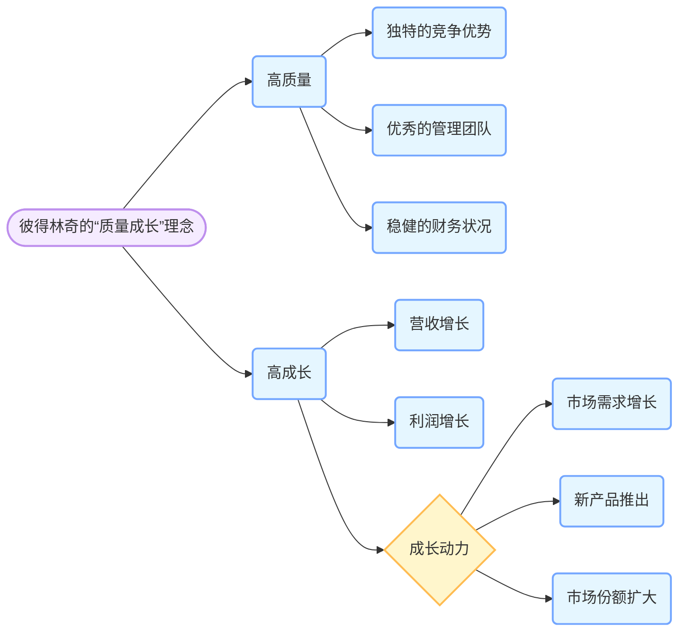

# 彼得林奇的"质量成长"在新经济公司中的应用

> 关键词：彼得林奇、质量成长、新经济公司、成长投资、价值评估

> 摘要：本文深入探讨了彼得林奇的“质量成长”理念在新经济公司中的应用。首先介绍了彼得林奇“质量成长”概念的背景，包括其目的、适用范围、预期读者等。接着阐述了核心概念及相互联系，分析了核心算法原理并给出具体操作步骤，同时运用数学模型和公式进行详细讲解与举例说明。通过项目实战案例展示了该理念在新经济公司中的实际应用，包括开发环境搭建、源代码实现与解读。此外，还探讨了“质量成长”理念在新经济公司中的实际应用场景，推荐了相关的学习资源、开发工具框架以及论文著作。最后总结了未来发展趋势与挑战，并提供了常见问题解答和扩展阅读参考资料，旨在为投资者和新经济公司管理者提供有价值的参考。

## 1. 背景介绍 
### 1.1 目的和范围
彼得林奇是投资领域的传奇人物，他的“质量成长”投资理念影响深远。本研究的目的在于深入剖析这一理念在新经济公司中的应用，帮助投资者更好地识别具有潜力的新经济公司，同时也为新经济公司的管理者提供战略决策参考。研究范围涵盖了各类新经济公司，包括互联网、科技、生物科技、新能源等新兴行业，旨在全面探讨“质量成长”理念在不同新经济领域的适应性和有效性。

### 1.2 预期读者
本文的预期读者主要包括投资者，无论是个人投资者还是机构投资者，都可以从中获取关于新经济公司投资的思路和方法；新经济公司的管理者，他们可以借鉴“质量成长”理念来制定公司的发展战略和经营策略；以及对投资和新经济领域感兴趣的研究人员和学生，为他们的学术研究和学习提供参考。

### 1.3 文档结构概述
本文将按照以下结构进行阐述：首先介绍核心概念与联系，明确“质量成长”理念的内涵和相关概念的关系；接着详细讲解核心算法原理和具体操作步骤，通过Python代码进行说明；然后运用数学模型和公式对“质量成长”进行量化分析，并举例说明；通过项目实战展示“质量成长”理念在新经济公司中的具体应用；探讨“质量成长”在新经济公司中的实际应用场景；推荐相关的学习资源、开发工具框架和论文著作；最后总结未来发展趋势与挑战，提供常见问题解答和扩展阅读参考资料。

### 1.4 术语表
#### 1.4.1 核心术语定义
- **彼得林奇的“质量成长”**：强调寻找具有高质量、高成长潜力的公司进行投资。高质量体现在公司具有独特的竞争优势、良好的管理团队、稳健的财务状况等；高成长则表现为公司的营收、利润等指标在未来具有持续增长的趋势。
- **新经济公司**：指在新的经济形态下，以信息技术、生物技术、新能源技术等新兴技术为基础，具有创新性、高成长性和高风险性的公司。

#### 1.4.2 相关概念解释
- **成长投资**：一种投资策略，主要关注公司的成长潜力，通过投资具有高成长预期的公司来获取资本增值。
- **价值评估**：对公司的内在价值进行评估，以确定其股票价格是否合理，常用的方法包括现金流折现法、市盈率法等。

#### 1.4.3 缩略词列表
- **PE**：市盈率（Price-to-Earnings Ratio），指股票价格除以每股收益的比率，用于衡量股票的估值水平。
- **EPS**：每股收益（Earnings Per Share），指公司净利润除以发行在外的普通股股数。

## 2. 核心概念与联系 
### 核心概念原理
彼得林奇的“质量成长”理念核心在于寻找那些既有高质量又有高成长潜力的公司。高质量意味着公司具有以下特征：
- **独特的竞争优势**：如技术专利、品牌优势、网络效应等，这些优势可以帮助公司在市场中脱颖而出，获得更高的市场份额和利润。
- **优秀的管理团队**：具备卓越的领导能力、战略眼光和执行能力，能够带领公司不断创新和发展。
- **稳健的财务状况**：包括合理的资产负债结构、充足的现金流和良好的盈利能力，能够保证公司在不同经济环境下的稳定运营。

高成长则体现在公司的营收、利润等指标在未来具有持续增长的趋势。成长的动力可以来自于市场需求的增长、新产品的推出、市场份额的扩大等。

### 架构的文本示意图
```plaintext
彼得林奇的“质量成长”理念
|
|-- 高质量
|   |-- 独特的竞争优势
|   |-- 优秀的管理团队
|   |-- 稳健的财务状况
|
|-- 高成长
|   |-- 营收增长
|   |-- 利润增长
|   |-- 成长动力（市场需求、新产品等）
```

### Mermaid 流程图


## 3. 核心算法原理 & 具体操作步骤 
### 核心算法原理
在应用彼得林奇的“质量成长”理念时，我们可以通过构建一个综合评估模型来筛选具有潜力的新经济公司。该模型主要考虑以下几个方面的指标：
- **财务指标**：如市盈率（PE）、每股收益（EPS）、营收增长率、净利润增长率等。
- **竞争优势指标**：如专利数量、市场份额、用户粘性等。
- **管理团队指标**：如管理团队的经验、学历、过往业绩等。

我们可以给每个指标赋予一定的权重，然后计算每个公司的综合得分，得分越高的公司越符合“质量成长”的标准。

### 具体操作步骤
以下是使用Python实现综合评估模型的具体步骤：

```python
import pandas as pd

# 定义指标权重
weights = {
    'PE': 0.2,
    'EPS': 0.2,
    'Revenue Growth': 0.2,
    'Net Profit Growth': 0.2,
    'Patent Count': 0.1,
    'Market Share': 0.1
}

# 示例数据
data = {
    'Company': ['Company A', 'Company B', 'Company C'],
    'PE': [20, 30, 25],
    'EPS': [2, 1.5, 1.8],
    'Revenue Growth': [0.2, 0.15, 0.18],
    'Net Profit Growth': [0.25, 0.2, 0.22],
    'Patent Count': [10, 5, 8],
    'Market Share': [0.3, 0.2, 0.25]
}

df = pd.DataFrame(data)

# 标准化数据
def normalize(df):
    result = df.copy()
    for feature_name in df.columns[1:]:
        max_value = df[feature_name].max()
        min_value = df[feature_name].min()
        result[feature_name] = (df[feature_name] - min_value) / (max_value - min_value)
    return result

normalized_df = normalize(df)

# 计算综合得分
def calculate_score(row):
    score = 0
    for key in weights:
        score += row[key] * weights[key]
    return score

normalized_df['Score'] = normalized_df.apply(calculate_score, axis=1)

# 按得分排序
sorted_df = normalized_df.sort_values(by='Score', ascending=False)

print(sorted_df)
```

### 代码解释
1. **定义指标权重**：根据各个指标的重要性，为每个指标分配相应的权重。
2. **示例数据**：创建一个包含多个新经济公司各项指标数据的DataFrame。
3. **标准化数据**：由于不同指标的取值范围不同，为了保证公平比较，需要对数据进行标准化处理。
4. **计算综合得分**：根据每个公司的各项指标值和对应的权重，计算综合得分。
5. **按得分排序**：将公司按照综合得分从高到低进行排序，得分越高的公司越符合“质量成长”的标准。

## 4. 数学模型和公式 & 详细讲解 & 举例说明 
### 数学模型和公式
综合评估模型的数学表达式如下：

$$
Score = \sum_{i=1}^{n} w_i \times x_i
$$

其中，$Score$ 表示公司的综合得分，$w_i$ 表示第 $i$ 个指标的权重，$x_i$ 表示第 $i$ 个指标的标准化值，$n$ 表示指标的数量。

### 详细讲解
- **权重 $w_i$**：反映了每个指标在综合评估中的重要性，权重之和为 1。不同的投资者可以根据自己的投资偏好和风险承受能力调整权重。
- **标准化值 $x_i$**：为了消除不同指标取值范围的差异，需要对原始数据进行标准化处理。常用的标准化方法是 min-max 标准化，公式如下：

$$
x_i = \frac{x_{i}^{raw} - \min(x^{raw})}{\max(x^{raw}) - \min(x^{raw})}
$$

其中，$x_{i}^{raw}$ 表示第 $i$ 个指标的原始值，$\min(x^{raw})$ 和 $\max(x^{raw})$ 分别表示该指标的最小值和最大值。

### 举例说明
假设我们有三家新经济公司 A、B、C，各项指标数据如下：

| 公司 | PE | EPS | 营收增长率 | 净利润增长率 | 专利数量 | 市场份额 |
|------|----|-----|------------|--------------|----------|----------|
| A    | 20 | 2   | 0.2        | 0.25         | 10       | 0.3      |
| B    | 30 | 1.5 | 0.15       | 0.2          | 5        | 0.2      |
| C    | 25 | 1.8 | 0.18       | 0.22         | 8        | 0.25     |

指标权重如下：

| 指标 | 权重 |
|------|------|
| PE   | 0.2  |
| EPS  | 0.2  |
| 营收增长率 | 0.2 |
| 净利润增长率 | 0.2 |
| 专利数量 | 0.1 |
| 市场份额 | 0.1 |

首先进行标准化处理：

- **PE**：
  - $\min(PE) = 20$，$\max(PE) = 30$
  - 公司 A 的标准化值：$x_{A,PE} = \frac{20 - 20}{30 - 20} = 0$
  - 公司 B 的标准化值：$x_{B,PE} = \frac{30 - 20}{30 - 20} = 1$
  - 公司 C 的标准化值：$x_{C,PE} = \frac{25 - 20}{30 - 20} = 0.5$

- **EPS**：
  - $\min(EPS) = 1.5$，$\max(EPS) = 2$
  - 公司 A 的标准化值：$x_{A,EPS} = \frac{2 - 1.5}{2 - 1.5} = 1$
  - 公司 B 的标准化值：$x_{B,EPS} = \frac{1.5 - 1.5}{2 - 1.5} = 0$
  - 公司 C 的标准化值：$x_{C,EPS} = \frac{1.8 - 1.5}{2 - 1.5} = 0.6$

以此类推，计算出所有指标的标准化值。

然后计算综合得分：

- 公司 A 的综合得分：
  - $Score_A = 0.2 \times 0 + 0.2 \times 1 + 0.2 \times 1 + 0.2 \times 1 + 0.1 \times 1 + 0.1 \times 1 = 0.8$

- 公司 B 的综合得分：
  - $Score_B = 0.2 \times 1 + 0.2 \times 0 + 0.2 \times 0 + 0.2 \times 0 + 0.1 \times 0 + 0.1 \times 0 = 0.2$

- 公司 C 的综合得分：
  - $Score_C = 0.2 \times 0.5 + 0.2 \times 0.6 + 0.2 \times 0.6 + 0.2 \times 0.6 + 0.1 \times 0.8 + 0.1 \times 0.5 = 0.59$

根据综合得分，公司 A 最符合“质量成长”的标准。

## 5. 项目实战：代码实际案例和详细解释说明 
### 5.1  开发环境搭建
- **Python 安装**：确保你已经安装了 Python 3.x 版本，可以从 Python 官方网站（https://www.python.org/downloads/）下载并安装。
- **依赖库安装**：本项目需要使用 `pandas` 库，可以使用以下命令进行安装：
```sh
pip install pandas
```

### 5.2  源代码详细实现和代码解读
```python
import pandas as pd

# 定义指标权重
weights = {
    'PE': 0.2,
    'EPS': 0.2,
    'Revenue Growth': 0.2,
    'Net Profit Growth': 0.2,
    'Patent Count': 0.1,
    'Market Share': 0.1
}

# 示例数据
data = {
    'Company': ['Company A', 'Company B', 'Company C'],
    'PE': [20, 30, 25],
    'EPS': [2, 1.5, 1.8],
    'Revenue Growth': [0.2, 0.15, 0.18],
    'Net Profit Growth': [0.25, 0.2, 0.22],
    'Patent Count': [10, 5, 8],
    'Market Share': [0.3, 0.2, 0.25]
}

df = pd.DataFrame(data)

# 标准化数据
def normalize(df):
    result = df.copy()
    for feature_name in df.columns[1:]:
        max_value = df[feature_name].max()
        min_value = df[feature_name].min()
        result[feature_name] = (df[feature_name] - min_value) / (max_value - min_value)
    return result

normalized_df = normalize(df)

# 计算综合得分
def calculate_score(row):
    score = 0
    for key in weights:
        score += row[key] * weights[key]
    return score

normalized_df['Score'] = normalized_df.apply(calculate_score, axis=1)

# 按得分排序
sorted_df = normalized_df.sort_values(by='Score', ascending=False)

print(sorted_df)
```

### 代码解读与分析
1. **导入库**：导入 `pandas` 库，用于数据处理和分析。
2. **定义指标权重**：根据不同指标的重要性，为每个指标分配相应的权重。
3. **示例数据**：创建一个包含多个新经济公司各项指标数据的字典，并将其转换为 `pandas` 的 DataFrame。
4. **标准化数据**：定义 `normalize` 函数，对 DataFrame 中的数据进行 min-max 标准化处理，消除不同指标取值范围的差异。
5. **计算综合得分**：定义 `calculate_score` 函数，根据每个公司的各项指标值和对应的权重，计算综合得分。
6. **按得分排序**：使用 `sort_values` 方法将公司按照综合得分从高到低进行排序。
7. **输出结果**：打印排序后的 DataFrame，显示每个公司的综合得分。

通过这个项目实战，我们可以看到如何使用 Python 和 `pandas` 库实现彼得林奇的“质量成长”理念在新经济公司中的应用，帮助我们筛选出具有潜力的投资标的。

## 6. 实际应用场景 
### 投资者选股
对于投资者来说，彼得林奇的“质量成长”理念可以作为选股的重要参考。通过综合评估新经济公司的财务状况、竞争优势和管理团队等方面，投资者可以筛选出具有高质量和高成长潜力的公司进行投资。例如，在互联网行业，投资者可以关注那些具有独特的商业模式、高用户粘性和快速增长的营收和利润的公司；在生物科技行业，投资者可以关注那些拥有核心技术专利、在研产品丰富且具有良好临床前景的公司。

### 新经济公司战略规划
新经济公司的管理者可以借鉴“质量成长”理念来制定公司的战略规划。公司可以通过提升自身的竞争优势，如加大研发投入、打造强大的品牌、优化用户体验等，来提高公司的质量；同时，通过开拓新市场、推出新产品、加强市场营销等方式，实现公司的高成长。例如，一家新能源汽车公司可以通过不断提升电池技术、降低成本、扩大生产规模等方式，提高公司的竞争力和市场份额，实现质量和成长的双提升。

### 风险投资机构评估项目
风险投资机构在评估新经济项目时，可以运用“质量成长”理念来判断项目的投资价值。风险投资机构可以关注项目的团队背景、技术创新能力、市场潜力等方面，评估项目的质量；同时，通过分析项目的商业模式、市场推广计划等，预测项目的成长潜力。例如，一家专注于人工智能领域的风险投资机构，在评估一个新的人工智能项目时，可以考察项目团队的技术实力、项目的应用场景和市场需求、项目的盈利模式等，从而决定是否进行投资。

## 7. 工具和资源推荐
### 7.1 学习资源推荐
#### 7.1.1 书籍推荐
- 《彼得林奇的成功投资》（One Up on Wall Street）：彼得林奇的经典著作，详细阐述了他的投资理念和方法，包括如何寻找成长股、如何分析公司基本面等。
- 《战胜华尔街》（Beating the Street）：彼得林奇的另一本重要著作，分享了他在富达麦哲伦基金的投资经验和案例，对投资者具有很高的参考价值。
- 《新经济新规则》（New Rules for the New Economy）：探讨了新经济时代的特点和规则，帮助读者了解新经济公司的发展趋势和商业模式。

#### 7.1.2 在线课程
- Coursera 上的“投资学原理”（Principles of Investing）：由知名教授授课，系统介绍了投资学的基本原理和方法，包括股票投资、债券投资等。
- edX 上的“金融市场”（Financial Markets）：耶鲁大学教授罗伯特·席勒（Robert Shiller）主讲，深入讲解了金融市场的运作机制和投资策略。
- 网易云课堂上的“新经济创业实战营”：聚焦新经济领域的创业和投资，邀请行业专家分享实战经验和案例。

#### 7.1.3 技术博客和网站
- Seeking Alpha：提供全球金融市场的分析和评论，包括股票、基金、债券等，有很多关于新经济公司的研究报告和投资建议。
- TechCrunch：专注于科技行业的新闻和分析，报道新经济公司的最新动态、产品发布和融资情况。
- 36氪：国内知名的新经济媒体，提供科技、创业、投资等领域的资讯和深度报道。

### 7.2 开发工具框架推荐
#### 7.2.1 IDE和编辑器
- PyCharm：一款专业的 Python 集成开发环境，具有代码编辑、调试、代码分析等功能，适合开发和调试与“质量成长”评估相关的 Python 代码。
- Jupyter Notebook：一个交互式的开发环境，支持 Python、R 等多种编程语言，适合进行数据探索、模型验证和可视化分析。
- Visual Studio Code：一款轻量级的代码编辑器，支持多种编程语言和插件扩展，可用于快速编写和调试代码。

#### 7.2.2 调试和性能分析工具
- PDB：Python 自带的调试工具，可以帮助开发者定位代码中的错误和问题。
- cProfile：Python 标准库中的性能分析工具，用于分析代码的运行时间和函数调用情况，帮助优化代码性能。
- Py-Spy：一个轻量级的 Python 性能分析工具，可以实时监控 Python 程序的运行状态和性能指标。

#### 7.2.3 相关框架和库
- Pandas：一个强大的数据处理和分析库，提供了高效的数据结构和数据操作方法，适合处理和分析新经济公司的财务数据和指标数据。
- NumPy：一个用于科学计算的 Python 库，提供了高效的数组操作和数学函数，可用于数据的数值计算和处理。
- Scikit-learn：一个机器学习库，提供了各种机器学习算法和工具，可用于构建和评估“质量成长”评估模型。

### 7.3 相关论文著作推荐
#### 7.3.1 经典论文
- “The Cross - Section of Expected Stock Returns” by Eugene F. Fama and Kenneth R. French：提出了著名的 Fama - French 三因子模型，用于解释股票收益率的差异，对投资领域产生了深远影响。
- “Efficient Capital Markets: A Review of Theory and Empirical Work” by Eugene F. Fama：对有效市场假说进行了系统的阐述和总结，是金融领域的经典论文之一。

#### 7.3.2 最新研究成果
- 关注顶尖学术期刊，如 The Journal of Finance、The Review of Financial Studies 等，这些期刊会发表关于新经济公司投资、成长估值等方面的最新研究成果。
- 参加国际金融学术会议，如 American Finance Association（AFA）年会等，了解行业内的前沿研究动态。

#### 7.3.3 应用案例分析
- 一些知名的咨询公司和研究机构会发布关于新经济公司的应用案例分析报告，如麦肯锡、波士顿咨询等，这些报告可以帮助读者了解“质量成长”理念在实际案例中的应用和效果。

## 8. 总结：未来发展趋势与挑战
### 未来发展趋势
- **数据驱动的投资决策**：随着大数据、人工智能等技术的发展，未来投资者将更加依赖数据来进行投资决策。通过收集和分析大量的新经济公司数据，包括财务数据、市场数据、用户数据等，可以更准确地评估公司的质量和成长潜力。
- **跨行业融合与创新**：新经济领域的行业边界将越来越模糊，不同行业之间的融合与创新将成为未来的发展趋势。例如，互联网与金融、医疗、教育等行业的融合，将催生出更多具有创新性和高成长潜力的新经济公司。
- **可持续发展投资**：投资者将越来越关注新经济公司的可持续发展能力，包括环境、社会和治理（ESG）等方面。具有良好 ESG 表现的新经济公司将更受投资者青睐，未来可持续发展投资将成为主流投资策略之一。

### 挑战
- **数据质量和可靠性**：在收集和分析新经济公司数据时，数据的质量和可靠性是一个重要的挑战。由于新经济公司的业务模式和数据特点较为复杂，数据的准确性和完整性可能存在问题，需要投资者和分析师具备较强的数据处理和分析能力。
- **技术变革带来的不确定性**：新经济领域的技术变革非常迅速，新技术的出现可能会导致现有公司的竞争优势丧失，或者催生新的竞争对手。投资者需要及时了解技术发展趋势，评估技术变革对新经济公司的影响，增加了投资决策的难度。
- **估值难题**：新经济公司的估值是一个长期以来的难题。由于新经济公司的盈利模式和成长路径与传统公司不同，传统的估值方法可能不再适用。如何准确评估新经济公司的价值，是投资者和分析师面临的一大挑战。

## 9. 附录：常见问题与解答
### 问题 1：“质量成长”理念是否适用于所有新经济公司？
解答：“质量成长”理念适用于大多数具有成长潜力的新经济公司，但并不是所有新经济公司都符合该理念。一些处于初创阶段的新经济公司可能还没有形成明显的竞争优势和稳定的财务状况，需要投资者根据具体情况进行评估。此外，不同行业的新经济公司具有不同的特点和发展规律，投资者需要结合行业特点来应用“质量成长”理念。

### 问题 2：如何确定指标的权重？
解答：指标的权重可以根据投资者的投资偏好、风险承受能力和对不同指标的重视程度来确定。一般来说，财务指标、竞争优势指标和管理团队指标都比较重要，可以根据实际情况进行分配。投资者也可以通过历史数据回测和敏感性分析等方法，优化指标权重，提高评估模型的准确性。

### 问题 3：“质量成长”评估模型是否需要不断更新？
解答：是的，“质量成长”评估模型需要不断更新。随着新经济公司的发展和市场环境的变化，公司的各项指标也会发生变化。此外，新的评估指标和方法可能会不断涌现，投资者需要及时更新评估模型，以保证评估结果的准确性和有效性。

## 10. 扩展阅读 & 参考资料
### 扩展阅读
- 《创新者的窘境》（The Innovator's Dilemma）：探讨了创新对企业的影响，以及企业如何应对创新带来的挑战，对理解新经济公司的发展具有重要启示。
- 《从 0 到 1》（Zero to One）：阐述了创业和创新的理念和方法，适合对新经济创业和投资感兴趣的读者阅读。
- 《金融炼金术》（The Alchemy of Finance）：乔治·索罗斯的著作，分享了他的投资哲学和市场分析方法，对投资者的思维方式和投资策略有很大的启发。

### 参考资料
- Lynch, Peter. One Up on Wall Street. Simon & Schuster, 1989.
- Lynch, Peter. Beating the Street. Simon & Schuster, 1993.
- Fama, Eugene F., and Kenneth R. French. “The Cross - Section of Expected Stock Returns.” The Journal of Finance 47.2 (1992): 427 - 465.
- Fama, Eugene F. “Efficient Capital Markets: A Review of Theory and Empirical Work.” The Journal of Finance 25.2 (1970): 383 - 417.

作者：AI天才研究院/AI Genius Institute & 禅与计算机程序设计艺术 /Zen And The Art of Computer Programming