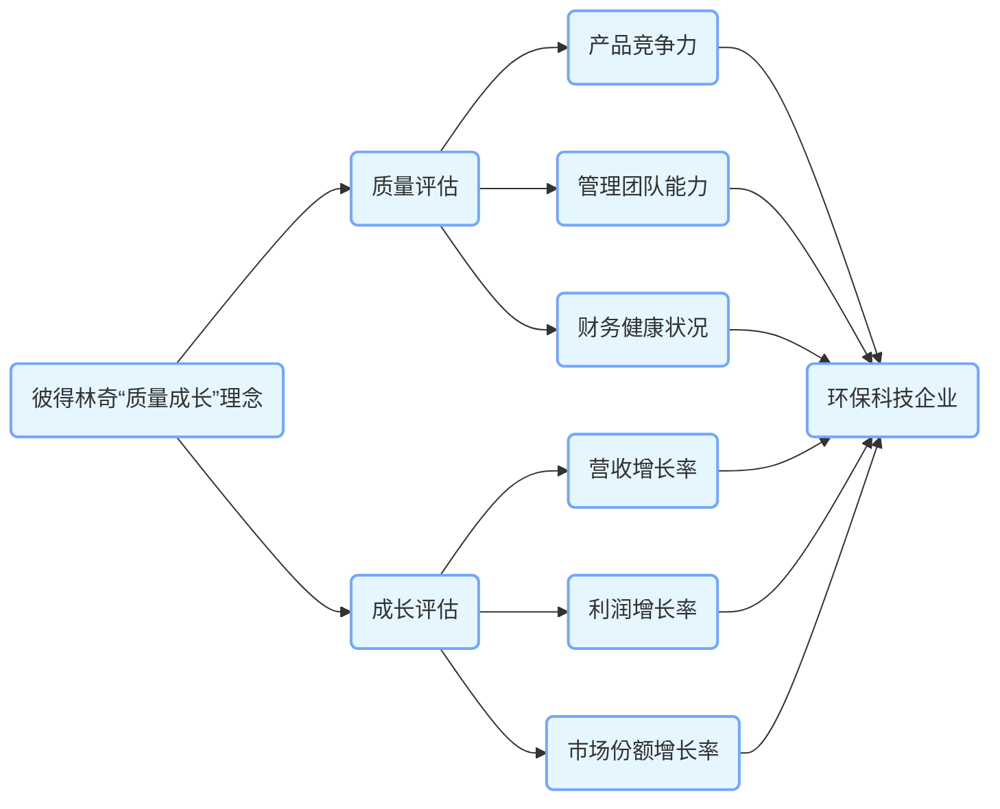

# 彼得林奇的“质量成长”在环保科技企业中的应用

> 关键词：彼得林奇；质量成长；环保科技企业；投资策略；企业发展

> 摘要：本文聚焦于彼得林奇的“质量成长”理念在环保科技企业中的应用。首先介绍了彼得林奇“质量成长”理念的背景及核心思想，接着详细阐述了该理念的核心概念、算法原理以及相关数学模型。通过实际案例展示了在环保科技企业中如何运用这一理念进行企业发展规划和投资分析。同时，探讨了该理念在环保科技领域的实际应用场景，推荐了相关的学习资源、开发工具和论文著作。最后总结了未来环保科技企业应用“质量成长”理念的发展趋势与挑战，并对常见问题进行了解答。

## 1. 背景介绍 
### 1.1 目的和范围
彼得林奇是投资领域的传奇人物，他的“质量成长”投资理念影响深远。本文章的目的在于探讨这一理念在环保科技企业中的具体应用，帮助环保科技企业管理者更好地规划企业发展战略，同时为投资者提供在该领域的投资决策参考。文章的范围涵盖了“质量成长”理念的核心概念、算法原理、数学模型，以及在环保科技企业中的实际应用案例等方面。

### 1.2 预期读者
本文的预期读者包括环保科技企业的管理者、投资者、金融分析师、相关领域的研究学者以及对环保科技和投资感兴趣的人士。通过阅读本文，读者可以深入了解“质量成长”理念在环保科技企业中的应用方法和价值。

### 1.3 文档结构概述
本文首先介绍“质量成长”理念的背景和相关术语，接着阐述其核心概念和联系，包括原理和架构的示意图与流程图。然后详细讲解核心算法原理和具体操作步骤，并给出相应的 Python 代码。之后介绍相关的数学模型和公式，并举例说明。通过实际案例展示在环保科技企业中的应用，包括开发环境搭建、源代码实现和解读。探讨该理念在环保科技领域的实际应用场景，推荐学习资源、开发工具和相关论文著作。最后总结未来发展趋势与挑战，解答常见问题，并提供扩展阅读和参考资料。

### 1.4 术语表
#### 1.4.1 核心术语定义
- **彼得林奇的“质量成长”**：强调寻找具有高质量且具备持续成长潜力的企业进行投资或企业自身发展注重质量与成长的结合。质量体现在企业的基本面，如产品或服务的竞争力、管理团队的能力等；成长则表现为企业的营收、利润等指标的持续增长。
- **环保科技企业**：指专注于环保领域的技术研发、产品生产和服务提供的企业，旨在解决环境问题，推动可持续发展。

#### 1.4.2 相关概念解释
- **质量评估指标**：用于衡量企业质量的一系列指标，如毛利率、净利率、资产负债率、研发投入占比等。这些指标可以反映企业的盈利能力、偿债能力和创新能力等。
- **成长评估指标**：衡量企业成长潜力的指标，如营收增长率、利润增长率、市场份额增长率等。通过这些指标可以判断企业在市场中的发展态势。

#### 1.4.3 缩略词列表
- **ROE**：Return on Equity，净资产收益率，反映股东权益的收益水平。
- **EPS**：Earnings Per Share，每股收益，是净利润与股本总数的比率。

## 2. 核心概念与联系 

### 2.1 彼得林奇“质量成长”理念的核心原理
彼得林奇认为，投资者应该关注那些具有高质量和成长潜力的企业。高质量体现在企业具有独特的竞争优势，如品牌优势、技术优势、成本优势等，这些优势能够保证企业在市场中获得较高的利润和市场份额。成长潜力则表现为企业的业务能够持续扩张，营收和利润不断增长。

在环保科技企业中，质量可以体现在其环保技术的先进性、产品的可靠性和服务的专业性上。例如，一家拥有自主研发的高效污水处理技术的企业，其技术优势就是质量的体现。成长则可以通过市场对环保产品和服务的需求增长来实现，随着环保意识的提高和环保法规的加强，环保科技企业的市场空间不断扩大。

### 2.2 架构示意图


### 2.3 核心概念联系解释
质量评估和成长评估是“质量成长”理念的两个核心方面。质量评估中的产品竞争力、管理团队能力和财务健康状况等因素相互影响，共同决定了企业的质量水平。例如，优秀的管理团队能够提高产品的竞争力，而良好的财务健康状况则为企业的研发和市场拓展提供支持。

成长评估中的营收增长率、利润增长率和市场份额增长率则反映了企业的成长态势。营收增长可能来自于市场需求的增加和企业市场份额的扩大，而利润增长则需要企业在控制成本的同时提高产品或服务的附加值。质量和成长之间也存在着密切的联系，高质量的企业往往更容易实现持续的成长，而成长又可以进一步提升企业的质量。

## 3. 核心算法原理 & 具体操作步骤 

### 3.1 核心算法原理
在应用彼得林奇的“质量成长”理念时，我们可以通过构建一个综合评估模型来评估环保科技企业的质量和成长潜力。该模型可以基于多个指标进行加权计算，每个指标的权重根据其重要性进行设定。

假设我们选择了 $n$ 个质量评估指标 $Q_1, Q_2, \cdots, Q_n$ 和 $m$ 个成长评估指标 $G_1, G_2, \cdots, G_m$。每个指标都有一个对应的权重 $w_{Q_i}$ 和 $w_{G_j}$，其中 $\sum_{i=1}^{n} w_{Q_i} = 1$，$\sum_{j=1}^{m} w_{G_j} = 1$。

企业的质量得分 $Q$ 可以通过以下公式计算：
$$Q = \sum_{i=1}^{n} w_{Q_i} \times Q_i$$

企业的成长得分 $G$ 可以通过以下公式计算：
$$G = \sum_{j=1}^{m} w_{G_j} \times G_j$$

综合得分 $S$ 可以通过质量得分和成长得分的加权平均得到，假设质量得分的权重为 $w_Q$，成长得分的权重为 $w_G$，且 $w_Q + w_G = 1$，则：
$$S = w_Q \times Q + w_G \times G$$

### 3.2 具体操作步骤
以下是使用 Python 实现上述算法的具体步骤：

```python
# 定义质量评估指标及其权重
quality_metrics = {
    "毛利率": 0.3,
    "研发投入占比": 0.3,
    "资产负债率": 0.2,
    "管理团队经验得分": 0.2
}

# 定义成长评估指标及其权重
growth_metrics = {
    "营收增长率": 0.4,
    "利润增长率": 0.3,
    "市场份额增长率": 0.3
}

# 定义质量得分和成长得分的权重
w_Q = 0.5
w_G = 0.5

def calculate_score(metrics, data):
    """
    计算得分
    :param metrics: 指标及其权重的字典
    :param data: 指标数据的字典
    :return: 得分
    """
    score = 0
    for metric, weight in metrics.items():
        score += weight * data.get(metric, 0)
    return score

def evaluate_company(quality_data, growth_data):
    """
    评估企业的综合得分
    :param quality_data: 质量评估指标数据的字典
    :param growth_data: 成长评估指标数据的字典
    :return: 综合得分
    """
    Q = calculate_score(quality_metrics, quality_data)
    G = calculate_score(growth_metrics, growth_data)
    S = w_Q * Q + w_G * G
    return S

# 示例数据
quality_data = {
    "毛利率": 0.4,
    "研发投入占比": 0.1,
    "资产负债率": 0.3,
    "管理团队经验得分": 0.8
}

growth_data = {
    "营收增长率": 0.2,
    "利润增长率": 0.15,
    "市场份额增长率": 0.1
}

# 计算综合得分
score = evaluate_company(quality_data, growth_data)
print(f"企业的综合得分: {score}")
```

### 3.3 代码解释
上述代码首先定义了质量评估指标和成长评估指标及其对应的权重，以及质量得分和成长得分的权重。`calculate_score` 函数用于计算单个评估维度的得分，它遍历指标及其权重的字典，将每个指标的权重乘以对应的数据值并求和。`evaluate_company` 函数则调用 `calculate_score` 函数分别计算质量得分和成长得分，然后根据权重计算综合得分。最后，使用示例数据调用 `evaluate_company` 函数计算企业的综合得分并输出。

## 4. 数学模型和公式 & 详细讲解 & 举例说明 

### 4.1 数学模型
如前文所述，我们构建的综合评估模型基于多个指标的加权计算。该模型可以表示为：

设质量评估指标集合为 $\{Q_1, Q_2, \cdots, Q_n\}$，权重集合为 $\{w_{Q_1}, w_{Q_2}, \cdots, w_{Q_n}\}$；成长评估指标集合为 $\{G_1, G_2, \cdots, G_m\}$，权重集合为 $\{w_{G_1}, w_{G_2}, \cdots, w_{G_m}\}$。

质量得分 $Q$ 的计算公式为：
$$Q = \sum_{i=1}^{n} w_{Q_i} \times Q_i$$

成长得分 $G$ 的计算公式为：
$$G = \sum_{j=1}^{m} w_{G_j} \times G_j$$

综合得分 $S$ 的计算公式为：
$$S = w_Q \times Q + w_G \times G$$

### 4.2 详细讲解
- **质量得分计算**：质量得分 $Q$ 是通过对各个质量评估指标进行加权求和得到的。每个指标的权重 $w_{Q_i}$ 反映了该指标在评估企业质量时的重要性。例如，毛利率是衡量企业盈利能力的重要指标，如果我们认为它在评估企业质量时比较重要，可以赋予较高的权重。
- **成长得分计算**：成长得分 $G$ 同理，是对各个成长评估指标进行加权求和。权重 $w_{G_j}$ 体现了每个成长指标的重要性。例如，营收增长率反映了企业业务的扩张速度，通常在评估企业成长潜力时具有较高的权重。
- **综合得分计算**：综合得分 $S$ 是质量得分和成长得分的加权平均。权重 $w_Q$ 和 $w_G$ 可以根据不同的投资或决策需求进行调整。如果更注重企业的质量，可以适当提高 $w_Q$ 的值；如果更看重企业的成长潜力，则可以提高 $w_G$ 的值。

### 4.3 举例说明
假设我们要评估一家环保科技企业 A。该企业的质量评估指标数据如下：毛利率为 0.4，研发投入占比为 0.1，资产负债率为 0.3，管理团队经验得分（满分 1 分）为 0.8。成长评估指标数据如下：营收增长率为 0.2，利润增长率为 0.15，市场份额增长率为 0.1。

根据前面定义的指标权重，质量得分 $Q$ 为：

$$
\begin{align*}
Q &= 0.3 \times 0.4 + 0.3 \times 0.1 + 0.2 \times 0.3 + 0.2 \times 0.8 \\
&= 0.12 + 0.03 + 0.06 + 0.16 \\
&= 0.37
\end{align*}
$$

成长得分 $G$ 为：

$$
\begin{align*}
G &= 0.4 \times 0.2 + 0.3 \times 0.15 + 0.3 \times 0.1 \\
&= 0.08 + 0.045 + 0.03 \\
&= 0.155
\end{align*}
$$

假设 $w_Q = 0.5$，$w_G = 0.5$，则综合得分 $S$ 为：

$$
\begin{align*}
S &= 0.5 \times 0.37 + 0.5 \times 0.155 \\
&= 0.185 + 0.0775 \\
&= 0.2625
\end{align*}
$$

通过这个综合得分，我们可以对企业 A 的质量和成长潜力进行综合评估，并与其他企业进行比较。

## 5. 项目实战：代码实际案例和详细解释说明 

### 5.1  开发环境搭建
为了运行前面的 Python 代码，我们需要搭建相应的开发环境。以下是具体步骤：

#### 安装 Python
首先，从 Python 官方网站（https://www.python.org/downloads/）下载并安装 Python 3.x 版本。安装过程中注意勾选“Add Python to PATH”选项，以便在命令行中可以直接使用 Python 命令。

#### 安装开发工具
可以选择使用 PyCharm、VS Code 等集成开发环境（IDE）。这里以 VS Code 为例，下载并安装 VS Code（https://code.visualstudio.com/），然后在 VS Code 中安装 Python 扩展，以便更好地编写和运行 Python 代码。

### 5.2  源代码详细实现和代码解读
```python
# 定义质量评估指标及其权重
quality_metrics = {
    "毛利率": 0.3,
    "研发投入占比": 0.3,
    "资产负债率": 0.2,
    "管理团队经验得分": 0.2
}

# 定义成长评估指标及其权重
growth_metrics = {
    "营收增长率": 0.4,
    "利润增长率": 0.3,
    "市场份额增长率": 0.3
}

# 定义质量得分和成长得分的权重
w_Q = 0.5
w_G = 0.5

def calculate_score(metrics, data):
    """
    计算得分
    :param metrics: 指标及其权重的字典
    :param data: 指标数据的字典
    :return: 得分
    """
    score = 0
    for metric, weight in metrics.items():
        score += weight * data.get(metric, 0)
    return score

def evaluate_company(quality_data, growth_data):
    """
    评估企业的综合得分
    :param quality_data: 质量评估指标数据的字典
    :param growth_data: 成长评估指标数据的字典
    :return: 综合得分
    """
    Q = calculate_score(quality_metrics, quality_data)
    G = calculate_score(growth_metrics, growth_data)
    S = w_Q * Q + w_G * G
    return S

# 示例数据
quality_data = {
    "毛利率": 0.4,
    "研发投入占比": 0.1,
    "资产负债率": 0.3,
    "管理团队经验得分": 0.8
}

growth_data = {
    "营收增长率": 0.2,
    "利润增长率": 0.15,
    "市场份额增长率": 0.1
}

# 计算综合得分
score = evaluate_company(quality_data, growth_data)
print(f"企业的综合得分: {score}")
```

### 代码解读
- **指标和权重定义**：`quality_metrics` 和 `growth_metrics` 分别定义了质量评估指标和成长评估指标及其对应的权重。这些权重可以根据实际情况进行调整，以反映不同指标的重要性。
- **`calculate_score` 函数**：该函数接受指标及其权重的字典 `metrics` 和指标数据的字典 `data` 作为输入，通过遍历 `metrics` 字典，将每个指标的权重乘以对应的数据值并求和，得到得分。
- **`evaluate_company` 函数**：该函数调用 `calculate_score` 函数分别计算质量得分 $Q$ 和成长得分 $G$，然后根据 `w_Q` 和 `w_G` 的权重计算综合得分 $S$。
- **示例数据和结果输出**：定义了示例的质量评估指标数据 `quality_data` 和成长评估指标数据 `growth_data`，调用 `evaluate_company` 函数计算综合得分并输出。

### 5.3  代码解读与分析
通过上述代码，我们可以方便地对环保科技企业的质量和成长潜力进行综合评估。代码的灵活性在于可以根据不同的需求调整指标及其权重，以适应不同的评估场景。

例如，如果我们认为在当前市场环境下，研发投入对环保科技企业的发展更为关键，可以提高“研发投入占比”指标的权重。同时，代码也可以扩展到处理更多的评估指标和更多的企业数据，只需要相应地修改指标字典和数据字典即可。

然而，该代码也存在一定的局限性。例如，指标数据的获取可能存在困难，且数据的准确性和可靠性会影响评估结果。此外，指标权重的设定是主观的，不同的人可能会有不同的看法。在实际应用中，需要结合更多的信息和专业知识进行综合判断。

## 6. 实际应用场景 
### 6.1 企业战略规划
对于环保科技企业的管理者来说，彼得林奇的“质量成长”理念可以帮助他们制定企业战略规划。通过对企业自身质量和成长潜力的评估，管理者可以明确企业的优势和劣势，从而有针对性地进行资源配置和业务拓展。

例如，如果企业的研发投入占比较低，而市场对环保新技术的需求不断增加，管理者可以加大研发投入，提高企业的技术竞争力，以实现企业的持续成长。同时，通过关注企业的财务健康状况和管理团队能力，管理者可以确保企业在发展过程中保持稳定。

### 6.2 投资决策
投资者在选择环保科技企业进行投资时，可以运用“质量成长”理念进行评估。通过分析企业的质量评估指标和成长评估指标，投资者可以筛选出具有潜力的企业。

例如，一家环保科技企业具有较高的毛利率、持续增长的营收和利润，以及优秀的管理团队，那么该企业可能具有较高的投资价值。投资者可以根据综合得分对不同的企业进行排序，选择得分较高的企业进行投资。

### 6.3 行业分析
行业分析师可以使用“质量成长”理念对环保科技行业进行分析。通过对行业内企业的质量和成长情况进行评估，分析师可以了解行业的整体发展态势，找出行业的领先企业和具有潜力的新兴企业。

例如，通过比较不同企业的综合得分，分析师可以发现行业内哪些企业在质量和成长方面表现突出，哪些企业存在问题。这有助于分析师为行业内企业提供发展建议，同时也为投资者提供行业投资参考。

## 7. 工具和资源推荐
### 7.1 学习资源推荐
#### 7.1.1 书籍推荐
- 《彼得林奇的成功投资》：彼得林奇的经典著作，详细介绍了他的投资理念和方法，包括“质量成长”理念的具体应用。
- 《聪明的投资者》：本杰明·格雷厄姆的著作，是价值投资领域的经典之作，对于理解企业的基本面分析和投资决策有很大帮助。
- 《环保产业发展战略与政策》：介绍了环保产业的发展现状、趋势和政策，对于了解环保科技企业的行业背景和发展环境有重要参考价值。

#### 7.1.2 在线课程
- Coursera 上的“投资学原理”：由知名高校教授授课，系统介绍了投资学的基本原理和方法，包括企业估值和投资分析。
- 网易云课堂上的“环保科技前沿”：课程涵盖了环保科技领域的最新技术和发展趋势，有助于了解环保科技企业的技术创新方向。

#### 7.1.3 技术博客和网站
- 雪球网：提供了丰富的企业财务数据和投资者交流平台，可以了解到投资者对环保科技企业的看法和分析。
- 环保在线：专注于环保行业的资讯和技术交流，提供了环保科技企业的最新动态和行业报告。

### 7.2 开发工具框架推荐
#### 7.2.1 IDE和编辑器
- PyCharm：功能强大的 Python 集成开发环境，提供了代码编辑、调试、自动完成等功能，适合开发 Python 程序。
- VS Code：轻量级的代码编辑器，支持多种编程语言，通过安装 Python 扩展可以方便地进行 Python 开发。

#### 7.2.2 调试和性能分析工具
- PySnooper：可以自动记录 Python 函数的执行过程和变量值，方便调试代码。
- cProfile：Python 内置的性能分析工具，可以分析代码的运行时间和函数调用情况，帮助优化代码性能。

#### 7.2.3 相关框架和库
- Pandas：用于数据处理和分析的 Python 库，可以方便地处理和分析企业的财务数据和指标数据。
- Numpy：提供了高效的数值计算功能，在处理大规模数据和进行数学计算时非常有用。

### 7.3 相关论文著作推荐
#### 7.3.1 经典论文
- 《价值投资的理论与实践》：探讨了价值投资的理论基础和实践方法，对于理解彼得林奇的“质量成长”理念有重要参考价值。
- 《环保科技企业的创新与发展》：研究了环保科技企业的创新模式和发展战略，为环保科技企业的发展提供了理论支持。

#### 7.3.2 最新研究成果
- 《基于机器学习的企业成长潜力评估模型》：提出了一种基于机器学习的企业成长潜力评估方法，对于改进“质量成长”评估模型有一定的启示。
- 《环保科技产业的可持续发展研究》：关注环保科技产业的可持续发展问题，为环保科技企业的长期发展提供了思路。

#### 7.3.3 应用案例分析
- 《某环保科技企业的成长路径分析》：通过具体案例分析了一家环保科技企业的成长过程和成功经验，对于其他环保科技企业具有借鉴意义。
- 《投资环保科技企业的风险与收益分析》：分析了投资环保科技企业的风险和收益情况，为投资者提供了决策参考。

## 8. 总结：未来发展趋势与挑战
### 8.1 未来发展趋势
- **技术创新驱动**：随着科技的不断进步，环保科技企业将更加注重技术创新。新的环保技术如新能源利用、污水处理新技术、大气污染治理技术等将不断涌现，推动企业的成长和行业的发展。
- **政策支持加强**：政府对环保问题的重视程度不断提高，将出台更多的政策支持环保科技企业的发展。例如，财政补贴、税收优惠、绿色金融政策等将为企业提供更多的发展机遇。
- **产业整合加速**：环保科技行业将迎来产业整合的浪潮，大型企业将通过并购、重组等方式扩大规模，提高市场竞争力。同时，小型企业也将通过合作、联盟等方式实现资源共享和优势互补。

### 8.2 挑战
- **技术研发难度大**：环保科技领域的技术研发需要大量的资金和人力投入，且研发周期长、风险大。企业需要不断提高自身的研发能力，以应对技术创新的挑战。
- **市场竞争激烈**：随着环保科技行业的发展，市场竞争将日益激烈。企业需要在产品质量、价格、服务等方面不断提升竞争力，以在市场中占据一席之地。
- **政策不确定性**：虽然政府对环保科技企业的支持力度不断加大，但政策的不确定性仍然存在。政策的调整可能会对企业的发展产生影响，企业需要密切关注政策变化，及时调整发展战略。

## 9. 附录：常见问题与解答
### 9.1 如何确定指标的权重？
指标的权重可以根据不同的评估目的和行业特点进行确定。一般来说，可以通过专家咨询、历史数据分析、层次分析法等方法来确定权重。在实际应用中，也可以根据经验和判断进行适当的调整。

### 9.2 如何获取准确的指标数据？
指标数据可以通过企业的财务报表、行业报告、政府统计数据等渠道获取。在获取数据时，需要注意数据的准确性和可靠性，尽量选择权威的数据源。同时，也可以通过实地调研、访谈等方式获取更多的一手数据。

### 9.3 综合得分的高低是否能完全代表企业的投资价值？
综合得分只是一个参考指标，不能完全代表企业的投资价值。在进行投资决策时，还需要考虑其他因素，如行业前景、市场风险、企业的战略规划等。综合得分可以帮助投资者筛选出具有潜力的企业，但最终的投资决策还需要结合更多的信息进行综合判断。

## 10. 扩展阅读 & 参考资料
### 扩展阅读
- 《创新者的窘境》：探讨了企业在创新过程中面临的挑战和机遇，对于环保科技企业的创新发展有一定的启示。
- 《从 0 到 1》：介绍了创业公司从无到有的发展过程和创新方法，对于环保科技企业的创业者有很大的帮助。

### 参考资料
- 彼得林奇. 《彼得林奇的成功投资》. 机械工业出版社.
- 本杰明·格雷厄姆. 《聪明的投资者》. 人民邮电出版社.
- 相关行业报告和研究论文。

作者：AI天才研究院/AI Genius Institute & 禅与计算机程序设计艺术 /Zen And The Art of Computer Programming