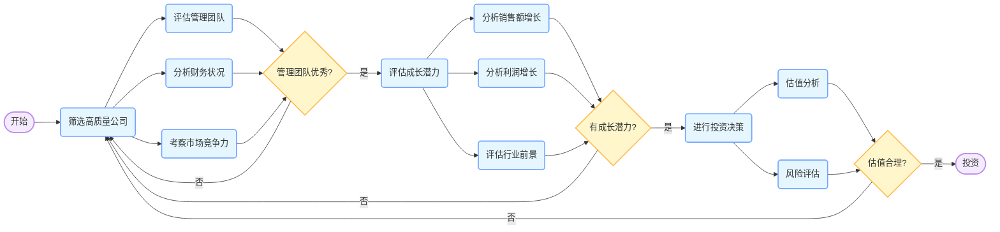

# 彼得林奇的“质量成长”投资案例

> 关键词：彼得林奇、质量成长投资、投资案例、成长股、投资策略

> 摘要：本文聚焦于彼得林奇的“质量成长”投资理念及相关案例。首先介绍彼得林奇投资理念的背景，包括目的、适用读者、文档结构等内容。接着阐述“质量成长”投资的核心概念，通过示意图和流程图进行直观展示。详细分析核心算法原理并给出Python代码示例，运用数学模型和公式进一步说明投资中的关键计算。以实际项目为例，展示开发环境搭建、源代码实现及代码解读。探讨“质量成长”投资在不同场景下的应用，推荐相关学习资源、开发工具框架以及论文著作。最后总结该投资理念的未来发展趋势与挑战，解答常见问题并提供扩展阅读和参考资料，旨在帮助投资者深入理解彼得林奇的“质量成长”投资策略。

## 1. 背景介绍 
### 1.1 目的和范围
彼得林奇是投资界的传奇人物，他在执掌富达麦哲伦基金期间，创造了惊人的投资业绩。“质量成长”投资是他投资理念的重要组成部分。本文的目的在于深入剖析彼得林奇的“质量成长”投资案例，通过详细讲解其投资理念、核心算法、数学模型等内容，让读者全面了解这一投资策略，并能够在实际投资中参考运用。范围涵盖从理论基础到实际应用的各个方面，包括核心概念的解释、投资算法的实现、实际案例的分析以及相关资源的推荐等。

### 1.2 预期读者
本文预期读者主要包括对投资领域感兴趣的个人投资者、金融专业学生、投资机构从业者等。对于想要学习投资知识、提升投资技能的初学者，本文可以作为入门的学习资料，帮助他们了解彼得林奇的投资理念和方法；对于有一定投资经验的投资者，本文可以提供新的思路和视角，启发他们在实际投资中进行创新和改进；对于金融专业学生，本文可以作为学习投资课程的补充材料，加深他们对投资理论和实践的理解。

### 1.3 文档结构概述
本文将按照以下结构进行组织：首先介绍“质量成长”投资的背景信息，包括目的、读者和文档结构等；接着阐述核心概念，通过示意图和流程图展示其原理和架构；然后详细讲解核心算法原理，并给出Python代码实现；运用数学模型和公式对投资中的关键计算进行说明；通过实际项目案例展示“质量成长”投资的具体应用，包括开发环境搭建、源代码实现和代码解读；探讨该投资策略在不同场景下的应用；推荐相关的学习资源、开发工具框架和论文著作；最后总结未来发展趋势与挑战，解答常见问题并提供扩展阅读和参考资料。

### 1.4 术语表
#### 1.4.1 核心术语定义
- **质量成长投资**：指投资者关注具有高质量和成长潜力的公司，通过分析公司的基本面、行业前景等因素，选择那些在业绩、市场竞争力等方面表现出色且具有持续增长潜力的公司进行投资。
- **成长股**：是指那些销售额和利润额持续增长，且增长速度快于整个国家及其所在行业的公司所发行的股票。
- **市盈率（P/E）**：是指股票价格除以每股收益（EPS）的比率，反映了市场对公司未来盈利的预期。
- **市净率（P/B）**：是指股票价格与每股净资产的比率，用于衡量公司的市场价值与账面价值之间的关系。

#### 1.4.2 相关概念解释
- **基本面分析**：通过对公司的财务状况、经营管理、行业竞争等方面进行分析，评估公司的内在价值和投资价值。
- **行业前景**：指某个行业在未来一段时间内的发展趋势和潜力，包括市场规模、增长速度、竞争格局等方面。
- **现金流**：是指企业在一定会计期间按照现金收付实现制，通过一定经济活动（包括经营活动、投资活动、筹资活动和非经常性项目）而产生的现金流入、现金流出及其总量情况的总称。

#### 1.4.3 缩略词列表
- **EPS**：Earnings Per Share，每股收益
- **P/E**：Price-to-Earnings Ratio，市盈率
- **P/B**：Price-to-Book Ratio，市净率

## 2. 核心概念与联系 

### 核心概念原理
彼得林奇的“质量成长”投资理念强调寻找具有高质量和成长潜力的公司进行投资。高质量体现在公司具有优秀的管理团队、良好的财务状况、强大的市场竞争力等方面；成长潜力则表现为公司的销售额、利润等指标能够持续增长。他认为，投资者应该关注公司的基本面，通过深入研究和分析，挖掘那些被市场低估的成长股。

### 架构的文本示意图
```plaintext
质量成长投资
|
|-- 高质量公司筛选
|   |-- 优秀管理团队
|   |-- 良好财务状况
|   |   |-- 稳定现金流
|   |   |-- 低负债水平
|   |-- 强大市场竞争力
|       |-- 独特产品或服务
|       |-- 高市场份额
|
|-- 成长潜力评估
|   |-- 销售额增长
|   |-- 利润增长
|   |-- 行业前景
|
|-- 投资决策
|   |-- 估值分析
|   |   |-- 市盈率
|   |   |-- 市净率
|   |-- 风险评估
```

### Mermaid 流程图


## 3. 核心算法原理 & 具体操作步骤 

### 核心算法原理
“质量成长”投资的核心算法原理在于通过一系列指标对公司进行评估和筛选，以确定具有投资价值的公司。主要指标包括市盈率、市净率、销售额增长率、利润增长率等。具体来说，首先根据基本面分析筛选出高质量的公司，然后对这些公司的成长潜力进行评估，最后通过估值分析和风险评估确定是否进行投资。

### 具体操作步骤
1. **数据收集**：收集公司的财务报表、行业报告等相关数据，包括销售额、利润、资产负债表等信息。
2. **高质量公司筛选**：根据公司的管理团队、财务状况、市场竞争力等因素，筛选出高质量的公司。可以通过分析公司的管理层背景、财务指标（如现金流、负债水平等）、市场份额等进行评估。
3. **成长潜力评估**：计算公司的销售额增长率、利润增长率等指标，评估公司的成长潜力。同时，分析行业前景，判断公司所处行业是否具有增长潜力。
4. **估值分析**：计算公司的市盈率、市净率等估值指标，与同行业其他公司进行比较，判断公司的估值是否合理。
5. **风险评估**：考虑公司面临的各种风险，如市场风险、行业风险、经营风险等，评估投资的风险水平。
6. **投资决策**：综合考虑以上因素，做出投资决策。如果公司具有高质量、成长潜力且估值合理，同时风险可控，则可以考虑进行投资。

### Python源代码实现
```python
import pandas as pd

# 数据收集（假设已经收集到以下数据）
data = {
    '公司名称': ['公司A', '公司B', '公司C'],
    '销售额': [1000, 2000, 1500],
    '利润': [100, 200, 150],
    '资产': [500, 1000, 800],
    '负债': [200, 300, 400],
    '销售额增长率': [0.1, 0.2, 0.15],
    '利润增长率': [0.12, 0.25, 0.18]
}
df = pd.DataFrame(data)

# 高质量公司筛选
# 假设高质量公司的负债资产比小于0.5
df['负债资产比'] = df['负债'] / df['资产']
high_quality_companies = df[df['负债资产比'] < 0.5]

# 成长潜力评估
# 假设成长潜力公司的销售额增长率和利润增长率都大于0.1
growth_companies = high_quality_companies[
    (high_quality_companies['销售额增长率'] > 0.1) &
    (high_quality_companies['利润增长率'] > 0.1)
]

# 估值分析（假设市盈率=股价/每股收益，这里简化计算，用利润代替每股收益）
# 假设股价都为100
df['市盈率'] = 100 / df['利润']
# 假设合理市盈率范围为10-20
reasonable_valuation_companies = growth_companies[
    (growth_companies['市盈率'] >= 10) &
    (growth_companies['市盈率'] <= 20)
]

print("具有投资价值的公司：")
print(reasonable_valuation_companies)
```

## 4. 数学模型和公式 & 详细讲解 & 举例说明 

### 市盈率（P/E）
#### 公式
$$P/E = \frac{股价}{每股收益}$$

#### 详细讲解
市盈率是衡量股票估值的重要指标之一，反映了市场对公司未来盈利的预期。较高的市盈率通常意味着市场对公司的未来发展前景较为乐观，愿意为其支付较高的价格；较低的市盈率则可能表示市场对公司的预期较低，或者公司被市场低估。

#### 举例说明
假设公司A的股价为50元，每股收益为5元，则其市盈率为：
$$P/E = \frac{50}{5} = 10$$
这意味着投资者为了获得公司A每股1元的收益，愿意支付10元的价格。

### 市净率（P/B）
#### 公式
$$P/B = \frac{股价}{每股净资产}$$

#### 详细讲解
市净率反映了公司的市场价值与账面价值之间的关系。市净率较低的公司可能被市场低估，具有一定的投资价值；而市净率较高的公司可能存在估值泡沫。

#### 举例说明
假设公司B的股价为80元，每股净资产为20元，则其市净率为：
$$P/B = \frac{80}{20} = 4$$
这表示公司B的市场价值是其账面价值的4倍。

### 销售额增长率
#### 公式
$$销售额增长率 = \frac{本期销售额 - 上期销售额}{上期销售额} \times 100\%$$

#### 详细讲解
销售额增长率反映了公司业务的扩张速度。较高的销售额增长率通常意味着公司的市场份额在扩大，业务发展良好；较低的销售额增长率则可能表示公司面临市场竞争压力或业务发展遇到瓶颈。

#### 举例说明
假设公司C去年的销售额为1000万元，今年的销售额为1200万元，则其销售额增长率为：
$$销售额增长率 = \frac{1200 - 1000}{1000} \times 100\% = 20\%$$
这表明公司C的销售额在过去一年中增长了20%。

### 利润增长率
#### 公式
$$利润增长率 = \frac{本期利润 - 上期利润}{上期利润} \times 100\%$$

#### 详细讲解
利润增长率反映了公司盈利能力的变化情况。较高的利润增长率意味着公司的盈利能力在增强，具有较好的发展前景；较低的利润增长率则可能表示公司的盈利能力受到挑战。

#### 举例说明
假设公司D去年的利润为200万元，今年的利润为250万元，则其利润增长率为：
$$利润增长率 = \frac{250 - 200}{200} \times 100\% = 25\%$$
这说明公司D的利润在过去一年中增长了25%。

## 5. 项目实战：代码实际案例和详细解释说明 

### 5.1  开发环境搭建
- **Python安装**：从Python官方网站（https://www.python.org/downloads/）下载并安装Python 3.x版本。
- **开发工具**：推荐使用PyCharm或Jupyter Notebook作为开发工具。PyCharm是一款功能强大的Python集成开发环境，提供了代码编辑、调试、版本控制等一系列功能；Jupyter Notebook则是一个交互式的开发环境，适合进行数据探索和分析。
- **必要库安装**：使用pip命令安装必要的Python库，如pandas、numpy等。
```bash
pip install pandas numpy
```

### 5.2  源代码详细实现和代码解读
```python
import pandas as pd

# 数据收集（假设已经收集到以下数据）
data = {
    '公司名称': ['公司A', '公司B', '公司C'],
    '销售额': [1000, 2000, 1500],
    '利润': [100, 200, 150],
    '资产': [500, 1000, 800],
    '负债': [200, 300, 400],
    '销售额增长率': [0.1, 0.2, 0.15],
    '利润增长率': [0.12, 0.25, 0.18]
}
df = pd.DataFrame(data)

# 高质量公司筛选
# 假设高质量公司的负债资产比小于0.5
df['负债资产比'] = df['负债'] / df['资产']
high_quality_companies = df[df['负债资产比'] < 0.5]

# 成长潜力评估
# 假设成长潜力公司的销售额增长率和利润增长率都大于0.1
growth_companies = high_quality_companies[
    (high_quality_companies['销售额增长率'] > 0.1) &
    (high_quality_companies['利润增长率'] > 0.1)
]

# 估值分析（假设市盈率=股价/每股收益，这里简化计算，用利润代替每股收益）
# 假设股价都为100
df['市盈率'] = 100 / df['利润']
# 假设合理市盈率范围为10-20
reasonable_valuation_companies = growth_companies[
    (growth_companies['市盈率'] >= 10) &
    (growth_companies['市盈率'] <= 20)
]

print("具有投资价值的公司：")
print(reasonable_valuation_companies)
```

### 代码解读与分析
1. **数据收集**：使用字典`data`模拟收集到的公司数据，包括公司名称、销售额、利润、资产、负债、销售额增长率和利润增长率等信息。然后使用`pandas`库的`DataFrame`函数将数据转换为数据框`df`。
2. **高质量公司筛选**：计算每个公司的负债资产比，即负债除以资产。然后筛选出负债资产比小于0.5的公司，将其存储在`high_quality_companies`数据框中。
3. **成长潜力评估**：从高质量公司中筛选出销售额增长率和利润增长率都大于0.1的公司，将其存储在`growth_companies`数据框中。
4. **估值分析**：假设所有公司的股价都为100，计算每个公司的市盈率，即股价除以利润。然后筛选出市盈率在10-20之间的公司，将其存储在`reasonable_valuation_companies`数据框中。
5. **结果输出**：打印出具有投资价值的公司信息。

## 6. 实际应用场景 
### 个人投资者
个人投资者可以运用彼得林奇的“质量成长”投资策略进行股票投资。通过分析公司的基本面和成长潜力，选择具有投资价值的股票，长期持有以获得资本增值。例如，个人投资者可以关注那些具有独特产品或服务、市场份额不断扩大、利润持续增长的公司，在合理的估值水平下买入其股票。

### 投资机构
投资机构可以将“质量成长”投资策略作为资产配置的一部分。通过深入研究和分析，筛选出一批高质量、高成长的公司进行投资组合，以实现资产的稳健增长。投资机构还可以利用专业的研究团队和数据分析工具，对投资组合进行动态调整，以适应市场变化。

### 基金管理
基金经理可以采用“质量成长”投资策略来管理基金。通过挖掘具有成长潜力的公司，构建基金的投资组合，为基金投资者创造良好的回报。例如，富达麦哲伦基金在彼得林奇的管理下，通过积极寻找成长股，取得了优异的业绩。

## 7. 工具和资源推荐
### 7.1 学习资源推荐
#### 7.1.1 书籍推荐
- 《彼得·林奇的成功投资》：彼得·林奇的经典著作，详细介绍了他的投资理念和方法，包括如何寻找成长股、如何进行基本面分析等内容。
- 《战胜华尔街》：也是彼得·林奇的重要著作，分享了他在投资实践中的经验和案例，对投资者具有很大的启发。
- 《聪明的投资者》：本杰明·格雷厄姆的经典投资著作，强调了价值投资的重要性，对理解投资的基本原理和方法有很大帮助。

#### 7.1.2 在线课程
- Coursera上的“投资学原理”：由知名教授授课，系统介绍了投资学的基本理论和方法，包括股票投资、债券投资、资产配置等内容。
- edX上的“金融市场”：讲解了金融市场的基本概念、运行机制和投资策略，适合对金融市场感兴趣的初学者。

#### 7.1.3 技术博客和网站
- 雪球网：国内知名的投资社区，提供了丰富的股票分析、投资策略分享和投资者交流的平台。
- 东方财富网：提供全面的金融信息和数据，包括股票行情、财经新闻、研究报告等，是投资者获取信息的重要渠道。

### 7.2 开发工具框架推荐
#### 7.2.1 IDE和编辑器
- PyCharm：功能强大的Python集成开发环境，提供了代码编辑、调试、版本控制等一系列功能，适合专业的Python开发者。
- Jupyter Notebook：交互式的开发环境，适合进行数据探索和分析，方便投资者快速验证投资策略和算法。

#### 7.2.2 调试和性能分析工具
- pdb：Python自带的调试工具，可以帮助开发者定位代码中的问题和错误。
- cProfile：Python的性能分析工具，可以分析代码的运行时间和资源消耗情况，帮助开发者优化代码性能。

#### 7.2.3 相关框架和库
- pandas：强大的数据处理和分析库，提供了丰富的数据结构和函数，方便投资者处理和分析金融数据。
- numpy：用于科学计算的基础库，提供了高效的数组操作和数学函数，在金融计算中广泛应用。

### 7.3 相关论文著作推荐
#### 7.3.1 经典论文
- “The Cross - Section of Expected Stock Returns”（Fama and French, 1992）：提出了著名的Fama - French三因子模型，对股票收益率的影响因素进行了深入研究。
- “Efficient Capital Markets: A Review of Theory and Empirical Work”（Fama, 1970）：对有效市场假说进行了系统的阐述和总结，是金融领域的经典论文之一。

#### 7.3.2 最新研究成果
- 关注顶尖金融学术期刊，如《Journal of Finance》《Review of Financial Studies》等，了解投资领域的最新研究动态和成果。

#### 7.3.3 应用案例分析
- 可以参考一些投资机构的研究报告和案例分析，了解“质量成长”投资策略在实际应用中的效果和经验教训。

## 8. 总结：未来发展趋势与挑战
### 未来发展趋势
- **数字化和智能化**：随着科技的不断发展，投资领域将越来越多地应用数字化和智能化技术。例如，利用大数据分析、人工智能算法等工具，可以更高效地筛选和分析具有投资价值的公司，提高投资决策的准确性和效率。
- **全球化投资**：全球经济一体化的趋势不断加强，投资者将有更多的机会参与全球市场的投资。“质量成长”投资策略可以帮助投资者在全球范围内寻找具有成长潜力的公司，实现资产的多元化配置。
- **可持续投资**：越来越多的投资者开始关注企业的社会责任和可持续发展。未来，具有良好环境、社会和治理（ESG）表现的成长型公司可能会受到更多投资者的青睐。

### 挑战
- **市场不确定性**：股票市场充满了不确定性，宏观经济环境、政策变化、行业竞争等因素都可能对公司的业绩和股价产生影响。投资者需要具备较强的风险意识和应对能力，及时调整投资策略。
- **信息过载**：在数字化时代，投资者可以获取的信息非常丰富，但同时也面临着信息过载的问题。如何从海量的信息中筛选出有价值的信息，进行准确的分析和判断，是投资者面临的一大挑战。
- **竞争加剧**：随着“质量成长”投资策略的普及，越来越多的投资者开始关注成长股。这将导致市场竞争加剧，优质成长股的估值可能会被推高，增加了投资者的投资难度和成本。

## 9. 附录：常见问题与解答
### 问题1：如何判断一个公司的管理团队是否优秀？
解答：可以从以下几个方面判断：管理团队的专业背景和经验、过往的业绩表现、战略规划能力、团队的稳定性等。此外，还可以关注管理团队在公司面临挑战时的应对能力和决策水平。

### 问题2：市盈率和市净率的合理范围是多少？
解答：市盈率和市净率的合理范围因行业、市场环境等因素而异。一般来说，不同行业的平均市盈率和市净率会有所不同。投资者可以参考同行业其他公司的估值水平，结合公司的成长潜力和盈利能力，来判断其市盈率和市净率是否合理。

### 问题3：“质量成长”投资策略是否适合短期投资？
解答：“质量成长”投资策略更适合长期投资。因为成长股的价值通常需要时间来体现，公司的业绩增长和市场竞争力的提升也需要一个过程。短期投资可能会受到市场波动的影响，难以实现投资目标。

## 10. 扩展阅读 & 参考资料
### 扩展阅读
- 《金融炼金术》：乔治·索罗斯的著作，介绍了他的投资哲学和交易策略，对投资者的思维方式有很大的启发。
- 《黑天鹅》：纳西姆·尼古拉斯·塔勒布的作品，探讨了不确定性和意外事件对金融市场的影响，帮助投资者更好地应对市场风险。

### 参考资料
- Peter Lynch. *One Up on Wall Street*. Simon & Schuster, 1989.
- Eugene F. Fama, Kenneth R. French. “The Cross - Section of Expected Stock Returns”. *Journal of Finance*, 1992.
- Eugene F. Fama. “Efficient Capital Markets: A Review of Theory and Empirical Work”. *Journal of Finance*, 1970.

作者：AI天才研究院/AI Genius Institute & 禅与计算机程序设计艺术 /Zen And The Art of Computer Programming