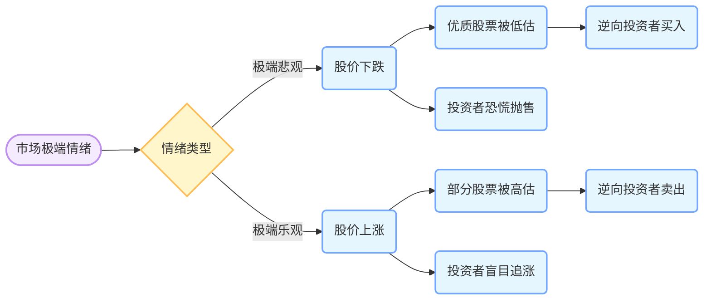

# 彼得林奇的"逆向投资"在市场极端情绪中的操作原则

> 关键词：彼得林奇、逆向投资、市场极端情绪、操作原则、投资策略

> 摘要：本文深入探讨了彼得林奇的“逆向投资”在市场极端情绪中的操作原则。首先介绍了相关背景，包括目的、预期读者、文档结构和术语表。接着阐述了逆向投资的核心概念及其联系，通过文本示意图和 Mermaid 流程图进行清晰展示。详细讲解了逆向投资所涉及的核心算法原理和具体操作步骤，并结合 Python 源代码进行说明。给出了逆向投资相关的数学模型和公式，同时举例说明。通过项目实战，展示了代码实际案例并进行详细解释。分析了逆向投资在实际中的应用场景，推荐了学习所需的工具和资源，包括书籍、在线课程、技术博客、开发工具框架以及相关论文著作等。最后总结了逆向投资的未来发展趋势与挑战，还设置了附录解答常见问题，并提供了扩展阅读和参考资料。

## 1. 背景介绍 
### 1.1 目的和范围
本文章的主要目的是深入剖析彼得林奇的“逆向投资”在市场极端情绪下的操作原则。我们将探讨这种投资策略在市场出现过度乐观或过度悲观情绪时的应用方法、原理以及实际操作步骤。通过研究彼得林奇的逆向投资理念，为投资者提供一种在复杂市场环境中获取收益的有效途径。范围涵盖逆向投资的核心概念、算法原理、数学模型、实际案例分析以及相关工具和资源的推荐等方面。

### 1.2 预期读者
本文预期读者包括各类投资者，无论是新手投资者希望学习基本的投资策略，还是有一定经验的投资者寻求优化自己的投资组合和应对市场极端情况的方法。同时，金融专业的学生、研究人员以及对投资领域感兴趣的人士也能从本文中获得有价值的信息。

### 1.3 文档结构概述
本文将按照以下结构展开：首先介绍逆向投资的背景知识，包括目的、读者群体和术语解释。接着阐述逆向投资的核心概念及其联系，通过示意图和流程图进行直观展示。详细讲解核心算法原理和操作步骤，并结合 Python 代码进行说明。给出逆向投资相关的数学模型和公式，并举例分析。通过项目实战展示代码实际案例和详细解释。分析逆向投资在实际中的应用场景，推荐相关的学习工具和资源。最后总结逆向投资的未来发展趋势与挑战，解答常见问题，并提供扩展阅读和参考资料。

### 1.4 术语表
#### 1.4.1 核心术语定义
- **逆向投资**：是一种与市场主流趋势相反的投资策略，投资者在市场普遍悲观时买入，在市场普遍乐观时卖出。
- **市场极端情绪**：指市场参与者由于各种因素导致的过度乐观或过度悲观的情绪状态，通常表现为股价的大幅上涨或下跌。
- **操作原则**：在逆向投资过程中，为了实现投资目标而遵循的一系列规则和方法。

#### 1.4.2 相关概念解释
- **价值投资**：强调寻找被低估的股票，关注公司的内在价值。逆向投资在一定程度上与价值投资有相似之处，都是在寻找价格与价值偏离的机会，但逆向投资更注重市场情绪的反向利用。
- **羊群效应**：在金融市场中，投资者往往会受到群体行为的影响，跟随大多数人的决策进行投资，导致市场出现过度波动。逆向投资正是针对这种羊群效应，采取相反的操作。

#### 1.4.3 缩略词列表
- **PE**：市盈率（Price-to-Earnings Ratio），是指股票价格除以每股收益的比率，用于衡量股票的估值水平。
- **PB**：市净率（Price-to-Book Ratio），是指股票价格除以每股净资产的比率，也是常用的估值指标之一。

## 2. 核心概念与联系 
逆向投资的核心思想是利用市场极端情绪所导致的股价与公司内在价值的偏离来获取投资收益。当市场处于极端悲观情绪时，投资者往往会过度抛售股票，导致股价大幅下跌，此时很多优质公司的股票可能被低估；而当市场处于极端乐观情绪时，投资者会过度买入股票，使股价大幅上涨，部分股票可能被高估。逆向投资者则在市场悲观时买入被低估的股票，在市场乐观时卖出被高估的股票。

### 文本示意图
```plaintext
市场极端情绪
    ├─ 极端悲观
    │   ├─ 股价下跌
    │   │   ├─ 优质股票被低估
    │   │   │   └─ 逆向投资者买入
    │   └─ 投资者恐慌抛售
    └─ 极端乐观
        ├─ 股价上涨
        │   ├─ 部分股票被高估
        │   │   └─ 逆向投资者卖出
        └─ 投资者盲目追涨
```

### Mermaid 流程图


## 3. 核心算法原理 & 具体操作步骤 
### 核心算法原理
逆向投资的核心算法原理可以简单概括为判断市场情绪状态和股票的估值水平。市场情绪可以通过一些指标来衡量，如市场成交量、投资者信心指数等。股票的估值水平可以使用市盈率（PE）、市净率（PB）等指标。当市场处于极端情绪，且股票的估值水平与公司的基本面严重偏离时，就可以考虑进行逆向投资操作。

### 具体操作步骤
1. **市场情绪监测**：通过分析市场成交量、新闻舆论、投资者情绪调查等数据，判断市场是处于极端乐观还是极端悲观情绪。
2. **股票筛选**：在市场极端情绪下，筛选出那些基本面良好，但由于市场情绪导致股价被低估或高估的股票。可以使用估值指标（如 PE、PB）和财务指标（如净利润增长率、净资产收益率等）进行筛选。
3. **投资决策**：如果市场处于极端悲观情绪，且筛选出的股票被低估，则考虑买入；如果市场处于极端乐观情绪，且筛选出的股票被高估，则考虑卖出。
4. **风险控制**：设置止损和止盈点，控制投资风险。同时，合理配置资产，避免过度集中投资。

### Python 源代码实现
```python
import pandas as pd
import yfinance as yf

# 市场情绪监测（简单示例，使用成交量变化来判断）
def monitor_market_sentiment(ticker, start_date, end_date):
    data = yf.download(ticker, start=start_date, end=end_date)
    volume_mean = data['Volume'].mean()
    latest_volume = data['Volume'][-1]
    if latest_volume > 1.5 * volume_mean:  # 假设成交量超过均值 1.5 倍为极端情绪
        if data['Close'][-1] < data['Close'][-2]:
            return 'extreme_pessimism'
        else:
            return 'extreme_optimism'
    return 'normal'

# 股票筛选（使用 PE 指标）
def screen_stocks(ticker, pe_threshold):
    stock = yf.Ticker(ticker)
    info = stock.info
    if 'trailingPE' in info and info['trailingPE'] < pe_threshold:
        return True
    return False

# 投资决策
def investment_decision(ticker, start_date, end_date, pe_threshold):
    sentiment = monitor_market_sentiment(ticker, start_date, end_date)
    is_undervalued = screen_stocks(ticker, pe_threshold)
    if sentiment == 'extreme_pessimism' and is_undervalued:
        return 'buy'
    elif sentiment == 'extreme_optimism' and not is_undervalued:
        return 'sell'
    return 'hold'

# 示例使用
ticker = 'AAPL'
start_date = '2020-01-01'
end_date = '2021-01-01'
pe_threshold = 20

decision = investment_decision(ticker, start_date, end_date, pe_threshold)
print(f"Investment decision for {ticker}: {decision}")
```

## 4. 数学模型和公式 & 详细讲解 & 举例说明 
### 数学模型和公式
#### 市盈率（PE）
市盈率是衡量股票估值的常用指标，公式为：
$$PE = \frac{P}{E}$$
其中，$P$ 为股票价格，$E$ 为每股收益。

#### 市净率（PB）
市净率也是常用的估值指标，公式为：
$$PB = \frac{P}{B}$$
其中，$P$ 为股票价格，$B$ 为每股净资产。

### 详细讲解
- **市盈率（PE）**：市盈率反映了投资者为了获得公司每一元的盈利所愿意支付的价格。一般来说，较低的市盈率可能表示股票被低估，而较高的市盈率可能表示股票被高估。但不同行业的市盈率水平可能存在较大差异，因此在使用市盈率进行估值时，需要与同行业的其他公司进行比较。
- **市净率（PB）**：市净率反映了股票价格与公司净资产的关系。较低的市净率可能表示股票被低估，尤其是对于一些资产密集型的行业，如金融、制造业等。但市净率也有其局限性，例如对于一些轻资产的科技公司，市净率可能不是一个很好的估值指标。

### 举例说明
假设某公司的股票价格为 $P = 50$ 元，每股收益为 $E = 5$ 元，每股净资产为 $B = 20$ 元。则该公司的市盈率为：
$$PE = \frac{50}{5} = 10$$
市净率为：
$$PB = \frac{50}{20} = 2.5$$
如果同行业的平均市盈率为 15，平均市净率为 3，则该公司的股票可能被低估。在市场极端情绪下，逆向投资者可以考虑买入该股票。

## 5. 项目实战：代码实际案例和详细解释说明 
### 5.1  开发环境搭建
#### 安装 Python
首先需要安装 Python 环境，建议使用 Python 3.7 及以上版本。可以从 Python 官方网站（https://www.python.org/downloads/）下载并安装。

#### 安装必要的库
使用以下命令安装所需的库：
```sh
pip install pandas yfinance
```
- `pandas`：用于数据处理和分析。
- `yfinance`：用于获取股票数据。

### 5.2  源代码详细实现和代码解读
```python
import pandas as pd
import yfinance as yf

# 市场情绪监测（简单示例，使用成交量变化来判断）
def monitor_market_sentiment(ticker, start_date, end_date):
    data = yf.download(ticker, start=start_date, end=end_date)
    volume_mean = data['Volume'].mean()
    latest_volume = data['Volume'][-1]
    if latest_volume > 1.5 * volume_mean:  # 假设成交量超过均值 1.5 倍为极端情绪
        if data['Close'][-1] < data['Close'][-2]:
            return 'extreme_pessimism'
        else:
            return 'extreme_optimism'
    return 'normal'

# 股票筛选（使用 PE 指标）
def screen_stocks(ticker, pe_threshold):
    stock = yf.Ticker(ticker)
    info = stock.info
    if 'trailingPE' in info and info['trailingPE'] < pe_threshold:
        return True
    return False

# 投资决策
def investment_decision(ticker, start_date, end_date, pe_threshold):
    sentiment = monitor_market_sentiment(ticker, start_date, end_date)
    is_undervalued = screen_stocks(ticker, pe_threshold)
    if sentiment == 'extreme_pessimism' and is_undervalued:
        return 'buy'
    elif sentiment == 'extreme_optimism' and not is_undervalued:
        return 'sell'
    return 'hold'

# 示例使用
ticker = 'AAPL'
start_date = '2020-01-01'
end_date = '2021-01-01'
pe_threshold = 20

decision = investment_decision(ticker, start_date, end_date, pe_threshold)
print(f"Investment decision for {ticker}: {decision}")
```
### 代码解读与分析
- **`monitor_market_sentiment` 函数**：该函数用于监测市场情绪。通过 `yfinance` 库获取指定股票在指定日期范围内的历史数据，计算成交量的均值。如果最新成交量超过均值的 1.5 倍，则判断市场处于极端情绪。根据收盘价的变化，进一步判断是极端悲观还是极端乐观情绪。
- **`screen_stocks` 函数**：该函数用于筛选被低估的股票。通过 `yfinance` 库获取股票的信息，检查是否存在 `trailingPE`（滚动市盈率）指标，并且该指标是否低于指定的阈值。如果满足条件，则认为股票被低估。
- **`investment_decision` 函数**：该函数综合考虑市场情绪和股票估值，做出投资决策。如果市场处于极端悲观情绪且股票被低估，则建议买入；如果市场处于极端乐观情绪且股票未被低估，则建议卖出；否则建议持有。

## 6. 实际应用场景 
### 熊市底部买入
在熊市中，市场普遍处于极端悲观情绪，投资者纷纷抛售股票，导致股价大幅下跌。此时，逆向投资者可以通过筛选那些基本面良好但被低估的股票，在熊市底部买入。例如，在 2008 年金融危机期间，很多优质公司的股票价格大幅下跌，逆向投资者如果能够抓住机会买入，在随后的市场反弹中可能获得丰厚的收益。

### 牛市顶部卖出
在牛市中，市场普遍处于极端乐观情绪，投资者盲目追涨，导致股价大幅上涨。此时，逆向投资者可以关注那些被高估的股票，在牛市顶部卖出。例如，在 2015 年中国股市的牛市顶部，很多股票的市盈率达到了极高的水平，逆向投资者如果能够及时卖出，就可以避免随后的市场暴跌带来的损失。

### 行业低谷投资
某些行业可能会因为周期性因素或突发事件而陷入低谷，市场对该行业的情绪极度悲观。逆向投资者可以在行业低谷时，寻找那些具有长期发展潜力的公司进行投资。例如，在新能源汽车行业发展初期，由于技术不成熟和市场认可度低，该行业的股票普遍不受市场青睐。但逆向投资者如果能够看到该行业的发展前景，在行业低谷时投资相关股票，可能会在行业崛起时获得巨大的收益。

## 7. 工具和资源推荐
### 7.1 学习资源推荐
#### 7.1.1 书籍推荐
- 《彼得·林奇的成功投资》：彼得·林奇本人所著，详细介绍了他的投资理念和方法，包括逆向投资的实践经验。
- 《聪明的投资者》：本杰明·格雷厄姆的经典著作，是价值投资和逆向投资的理论基础。
- 《金融炼金术》：乔治·索罗斯的著作，探讨了市场的反身性原理，对逆向投资有重要的启示。

#### 7.1.2 在线课程
- Coursera 上的“投资学原理”：由知名高校教授授课，系统介绍投资学的基本原理和方法，包括逆向投资策略。
- Udemy 上的“逆向投资实战课程”：结合实际案例，详细讲解逆向投资的操作技巧和风险控制。

#### 7.1.3 技术博客和网站
- 雪球网：国内知名的投资社区，有很多投资者分享逆向投资的经验和案例。
- Seeking Alpha：国外的金融投资网站，提供大量的股票分析和投资策略文章，包括逆向投资相关内容。

### 7.2 开发工具框架推荐
#### 7.2.1 IDE和编辑器
- PyCharm：功能强大的 Python 集成开发环境，适合开发和调试逆向投资相关的代码。
- Jupyter Notebook：交互式的开发环境，方便进行数据探索和分析，对于逆向投资策略的研究和测试非常有用。

#### 7.2.2 调试和性能分析工具
- pdb：Python 自带的调试工具，可以帮助开发者定位代码中的问题。
- cProfile：Python 的性能分析工具，可以分析代码的运行时间和资源消耗，优化逆向投资算法的性能。

#### 7.2.3 相关框架和库
- Pandas：用于数据处理和分析，在逆向投资中可以用于处理股票历史数据和财务数据。
- NumPy：提供高效的数值计算功能，对于逆向投资中的数学模型和公式计算非常有用。
- Scikit-learn：机器学习库，可以用于构建逆向投资的预测模型，如股价预测模型。

### 7.3 相关论文著作推荐
#### 7.3.1 经典论文
- 《逆向投资策略：战胜市场的心理学》：探讨了逆向投资的心理学原理，分析了投资者情绪对市场的影响。
- 《基于行为金融学的逆向投资策略研究》：结合行为金融学的理论，研究逆向投资策略的有效性和应用方法。

#### 7.3.2 最新研究成果
- 《大数据时代下逆向投资策略的创新与应用》：研究如何利用大数据技术改进逆向投资策略，提高投资决策的准确性。
- 《人工智能在逆向投资中的应用研究》：探讨人工智能算法在逆向投资中的应用，如深度学习模型在股价预测中的应用。

#### 7.3.3 应用案例分析
- 《逆向投资在新兴市场的实践与启示》：分析逆向投资策略在新兴市场的应用案例，总结经验教训。
- 《逆向投资在行业轮动中的应用研究》：研究逆向投资策略在行业轮动中的应用，如何把握不同行业的投资机会。

## 8. 总结：未来发展趋势与挑战
### 未来发展趋势
- **与科技融合加深**：随着大数据、人工智能等技术的不断发展，逆向投资将更多地借助这些技术进行市场情绪监测和股票估值分析。例如，利用自然语言处理技术分析新闻舆论和社交媒体数据，更准确地判断市场情绪；利用机器学习模型预测股价走势，提高投资决策的准确性。
- **全球化投资机会增加**：随着全球金融市场的互联互通，逆向投资可以在更广泛的范围内寻找投资机会。投资者可以关注不同国家和地区的市场极端情绪，挖掘被低估或高估的股票。
- **多元化投资策略**：逆向投资将与其他投资策略相结合，形成多元化的投资组合。例如，与价值投资、成长投资等策略相结合，降低投资风险，提高收益稳定性。

### 挑战
- **情绪判断难度加大**：市场情绪受到多种因素的影响，如宏观经济数据、政策变化、突发事件等，使得准确判断市场极端情绪变得越来越困难。而且，市场情绪的变化也越来越迅速，投资者需要及时做出决策。
- **数据质量和可靠性**：逆向投资依赖于大量的数据进行分析，数据的质量和可靠性直接影响投资决策的准确性。然而，数据可能存在误差、缺失或被操纵的情况，投资者需要对数据进行严格的筛选和验证。
- **市场有效性提高**：随着市场的发展和投资者的成熟，市场的有效性逐渐提高，股票价格更能反映公司的内在价值。这意味着逆向投资获取超额收益的难度可能会增加，投资者需要更加深入地研究公司基本面和市场情况。

## 9. 附录：常见问题与解答
### 问题 1：逆向投资是不是就是逆势而为，与市场对着干？
解答：逆向投资并不是简单地与市场对着干，而是在深入研究市场和公司基本面的基础上，利用市场极端情绪所导致的股价与价值的偏离来获取投资收益。逆向投资者需要有自己独立的判断，不能盲目地逆势操作。

### 问题 2：如何判断市场处于极端情绪？
解答：可以通过多种方法判断市场情绪，如分析市场成交量、投资者信心指数、新闻舆论等。当市场成交量大幅增加或减少，投资者信心指数出现极端值，新闻舆论普遍呈现乐观或悲观情绪时，可能意味着市场处于极端情绪。

### 问题 3：逆向投资的风险大吗？
解答：逆向投资存在一定的风险。如果对市场情绪和股票估值判断不准确，可能会导致投资失误。此外，市场极端情绪可能会持续较长时间，投资者需要有足够的耐心和资金实力来承受股价的波动。

### 问题 4：逆向投资适合所有投资者吗？
解答：逆向投资并不适合所有投资者。逆向投资需要投资者具备较强的分析能力、独立思考能力和风险承受能力。对于缺乏投资经验和专业知识的投资者来说，逆向投资可能会带来较大的风险。

## 10. 扩展阅读 & 参考资料
### 扩展阅读
- 《邓普顿教你逆向投资》：介绍了约翰·邓普顿的逆向投资理念和实践经验。
- 《投资最重要的事》：霍华德·马克斯的著作，强调了逆向投资和风险控制的重要性。

### 参考资料
- 彼得·林奇. 《彼得·林奇的成功投资》. 机械工业出版社.
- 本杰明·格雷厄姆. 《聪明的投资者》. 人民邮电出版社.
- 乔治·索罗斯. 《金融炼金术》. 海南出版社.

作者：AI天才研究院/AI Genius Institute & 禅与计算机程序设计艺术 /Zen And The Art of Computer Programming