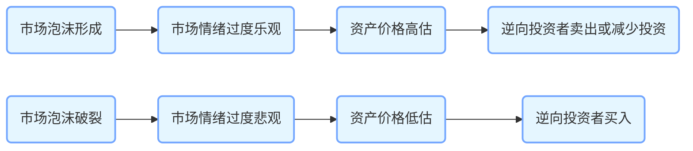

# 彼得林奇的"逆向投资"在市场泡沫中的操作策略

> 关键词：彼得林奇、逆向投资、市场泡沫、操作策略、股票投资

> 摘要：本文深入探讨了彼得林奇的“逆向投资”策略在市场泡沫环境下的具体应用。通过对相关核心概念的解析、算法原理的阐述、数学模型的分析以及实际案例的研究，详细介绍了在市场泡沫中运用逆向投资策略的具体步骤和方法。同时，探讨了该策略的实际应用场景，推荐了相关的学习资源、开发工具和论文著作，并对未来发展趋势与挑战进行了总结，最后以常见问题解答和扩展阅读作为补充，旨在为投资者在市场泡沫中运用逆向投资策略提供全面且深入的指导。

## 1. 背景介绍 
### 1.1 目的和范围
本文的主要目的是深入剖析彼得林奇的“逆向投资”策略在市场泡沫情境下的具体操作方式。市场泡沫是金融市场中常见的现象，它往往伴随着资产价格的过度高估，给投资者带来巨大的风险和机遇。彼得林奇作为投资界的传奇人物，其逆向投资策略以独特的视角和方法在市场中取得了显著的成绩。我们将研究在市场泡沫形成、膨胀和破裂的不同阶段，逆向投资策略如何发挥作用，为投资者提供应对市场泡沫的有效思路和方法。范围涵盖逆向投资策略的核心概念、操作原理、数学模型、实际案例以及相关的学习资源和工具等方面。

### 1.2 预期读者
本文预期读者主要包括对股票投资有兴趣的个人投资者，无论是新手还是有一定经验的投资者，都可以从本文中获取关于逆向投资策略在市场泡沫中应用的知识和启发。同时，金融专业的学生、研究人员以及从事金融投资行业的从业人员也可以将本文作为参考资料，进一步深入研究逆向投资策略和市场泡沫相关的问题。

### 1.3 文档结构概述
本文将按照以下结构展开：首先介绍核心概念与联系，阐述逆向投资和市场泡沫的基本原理以及它们之间的关系；接着讲解核心算法原理和具体操作步骤，通过Python代码详细说明如何运用逆向投资策略；然后分析数学模型和公式，结合具体例子进行讲解；之后通过项目实战，介绍开发环境搭建、源代码实现和代码解读；再探讨实际应用场景，说明逆向投资策略在不同市场环境中的应用；随后推荐相关的工具和资源，包括学习资源、开发工具框架和论文著作；接着总结未来发展趋势与挑战；最后设置附录，解答常见问题并提供扩展阅读和参考资料。

### 1.4 术语表
#### 1.4.1 核心术语定义
- **逆向投资**：是一种与市场主流趋势相反的投资策略，投资者在市场过度悲观时买入被低估的资产，在市场过度乐观时卖出被高估的资产。
- **市场泡沫**：指资产价格在市场投机行为的推动下，远远高于其内在价值的经济现象。当泡沫破裂时，资产价格会急剧下跌。
- **内在价值**：指资产本身所具有的价值，是基于资产的基本面因素，如公司的盈利能力、资产状况、行业前景等计算得出的价值。

#### 1.4.2 相关概念解释
- **市场情绪**：反映了投资者对市场的整体心理状态和预期，通常分为乐观和悲观两种情绪。在市场泡沫形成过程中，市场情绪往往过度乐观；而在泡沫破裂后，市场情绪则转为过度悲观。
- **估值指标**：用于衡量资产价格是否合理的指标，常见的有市盈率（P/E）、市净率（P/B）等。通过比较估值指标与历史数据或行业平均水平，可以判断资产是否被高估或低估。

#### 1.4.3 缩略词列表
- **P/E**：市盈率（Price-to-Earnings Ratio），是指股票价格除以每股收益的比率，反映了投资者为获取公司每一元盈利所愿意支付的价格。
- **P/B**：市净率（Price-to-Book Ratio），是指股票价格除以每股净资产的比率，用于评估公司的市场价值与账面价值之间的关系。

## 2. 核心概念与联系 
### 逆向投资原理
逆向投资的核心思想是基于市场的非理性行为。市场参与者往往会受到情绪的影响，在市场上涨时过度乐观，导致资产价格被高估；而在市场下跌时过度悲观，使得资产价格被低估。逆向投资者则利用这种市场的非理性，在大多数人恐惧时贪婪，在大多数人贪婪时恐惧。他们通过深入研究和分析，寻找那些被市场错误定价的资产，在价格低于其内在价值时买入，等待市场纠正错误，价格回归合理水平时卖出，从而获取投资收益。

### 市场泡沫原理
市场泡沫的形成通常是由于市场参与者的过度乐观情绪和投机行为。当市场出现一些积极的因素，如经济增长、政策利好等，投资者会对未来的市场前景产生过高的预期，纷纷涌入市场购买资产。随着购买需求的增加，资产价格不断上涨，进一步吸引更多的投资者加入，形成一种自我强化的循环。在这个过程中，资产价格逐渐偏离其内在价值，形成泡沫。当市场出现一些负面因素，如经济衰退、政策调整等，投资者的乐观情绪会迅速转变为悲观情绪，开始大量抛售资产，导致泡沫破裂，资产价格暴跌。

### 逆向投资与市场泡沫的联系
在市场泡沫形成和膨胀阶段，逆向投资者会保持冷静，不被市场的乐观情绪所左右。他们会通过分析估值指标、市场情绪等因素，判断市场是否存在泡沫以及泡沫的程度。如果发现市场存在泡沫，逆向投资者会减少对被高估资产的投资，甚至选择卖出部分或全部资产。而在市场泡沫破裂后，市场情绪极度悲观，资产价格大幅下跌，逆向投资者则会抓住机会，寻找那些被低估的资产进行买入。通过这种逆向操作，逆向投资者可以在市场泡沫中避免损失，并在市场恢复正常时获得丰厚的收益。

### 文本示意图
```plaintext
市场泡沫形成 --> 市场情绪过度乐观 --> 资产价格高估 --> 逆向投资者卖出或减少投资
市场泡沫破裂 --> 市场情绪过度悲观 --> 资产价格低估 --> 逆向投资者买入
```

### Mermaid 流程图


## 3. 核心算法原理 & 具体操作步骤 
### 核心算法原理
逆向投资的核心算法原理是基于对资产内在价值的评估和市场价格的比较。我们可以通过以下步骤来实现：
1. **确定评估指标**：选择合适的估值指标，如市盈率（P/E）、市净率（P/B）等，来评估资产的价值。
2. **计算内在价值**：根据历史数据、行业平均水平等因素，计算资产的合理估值范围。
3. **比较市场价格与内在价值**：将市场价格与计算得出的内在价值进行比较，如果市场价格低于内在价值，则认为资产被低估；反之，则认为资产被高估。
4. **制定投资决策**：根据比较结果，制定相应的投资决策。当资产被低估时，考虑买入；当资产被高估时，考虑卖出或减少投资。

### Python 代码实现
```python
import pandas as pd

# 模拟历史数据，包含市盈率和市净率
historical_data = {
    'P/E': [10, 12, 15, 18, 20],
    'P/B': [1.5, 1.8, 2.0, 2.2, 2.5]
}
df = pd.DataFrame(historical_data)

# 计算市盈率和市净率的平均值
average_pe = df['P/E'].mean()
average_pb = df['P/B'].mean()

# 假设当前股票的市盈率和市净率
current_pe = 8
current_pb = 1.2

# 判断股票是否被低估
if current_pe < average_pe and current_pb < average_pb:
    print("股票被低估，可以考虑买入")
else:
    print("股票未被低估，谨慎投资")
```
### 具体操作步骤
1. **数据收集**：收集相关资产的历史数据，包括估值指标（如P/E、P/B）、财务数据（如净利润、净资产）等。可以通过金融数据提供商、公司年报等渠道获取数据。
2. **数据处理**：对收集到的数据进行清洗和整理，去除异常值和缺失值。可以使用Python的pandas库进行数据处理。
3. **计算内在价值**：根据历史数据计算估值指标的平均值或中位数，作为资产的合理估值范围。
4. **实时监测**：实时获取资产的市场价格和当前估值指标，与计算得出的内在价值进行比较。
5. **决策制定**：根据比较结果，制定投资决策。如果资产被低估，且符合自己的投资标准，则可以考虑买入；如果资产被高估，则可以考虑卖出或减少投资。

## 4. 数学模型和公式 & 详细讲解 & 举例说明 
### 市盈率（P/E）模型
市盈率是最常用的估值指标之一，其计算公式为：
$$P/E = \frac{股票价格}{每股收益}$$
其中，股票价格是指当前股票的市场价格，每股收益是指公司每股股票的盈利。市盈率反映了投资者为获取公司每一元盈利所愿意支付的价格。一般来说，市盈率越低，说明股票越被低估；市盈率越高，说明股票越被高估。

例如，某公司的股票价格为20元，每股收益为2元，则该公司的市盈率为：
$$P/E = \frac{20}{2} = 10$$
假设该行业的平均市盈率为15，则该公司的股票相对被低估，可能具有投资价值。

### 市净率（P/B）模型
市净率也是常用的估值指标之一，其计算公式为：
$$P/B = \frac{股票价格}{每股净资产}$$
其中，每股净资产是指公司每股股票所对应的净资产价值。市净率反映了公司的市场价值与账面价值之间的关系。一般来说，市净率越低，说明公司的市场价值相对账面价值越低，股票越被低估；市净率越高，说明公司的市场价值相对账面价值越高，股票越被高估。

例如，某公司的股票价格为15元，每股净资产为5元，则该公司的市净率为：
$$P/B = \frac{15}{5} = 3$$
假设该行业的平均市净率为4，则该公司的股票相对被低估，可能具有投资价值。

### 综合估值模型
在实际应用中，我们可以综合考虑多个估值指标，以更准确地评估资产的价值。例如，可以使用加权平均的方法，将市盈率和市净率进行加权平均，得到一个综合估值指标。假设市盈率的权重为0.6，市净率的权重为0.4，则综合估值指标的计算公式为：
$$综合估值指标 = 0.6 \times P/E + 0.4 \times P/B$$

例如，某公司的市盈率为12，市净率为2.5，则该公司的综合估值指标为：
$$综合估值指标 = 0.6 \times 12 + 0.4 \times 2.5 = 7.2 + 1 = 8.2$$
假设该行业的平均综合估值指标为10，则该公司的股票相对被低估，可能具有投资价值。

## 5. 项目实战：代码实际案例和详细解释说明 
### 5.1  开发环境搭建
为了实现逆向投资策略的代码实践，我们需要搭建以下开发环境：
1. **Python 环境**：建议使用Python 3.7及以上版本。可以从Python官方网站（https://www.python.org/downloads/）下载并安装。
2. **开发工具**：推荐使用PyCharm或Jupyter Notebook作为开发工具。PyCharm是一款专业的Python集成开发环境，提供了丰富的代码编辑、调试和管理功能；Jupyter Notebook是一个交互式的开发环境，适合进行数据探索和代码演示。
3. **相关库的安装**：需要安装pandas、numpy等常用的Python库，用于数据处理和分析。可以使用以下命令进行安装：
```sh
pip install pandas numpy
```

### 5.2  源代码详细实现和代码解读
```python
import pandas as pd
import numpy as np

# 模拟历史数据，包含多只股票的市盈率和市净率
historical_data = {
    'Stock': ['A', 'B', 'C', 'D', 'E'],
    'P/E': [10, 12, 15, 18, 20],
    'P/B': [1.5, 1.8, 2.0, 2.2, 2.5]
}
df = pd.DataFrame(historical_data)

# 计算市盈率和市净率的平均值
average_pe = df['P/E'].mean()
average_pb = df['P/B'].mean()

# 模拟当前股票的市盈率和市净率
current_data = {
    'Stock': ['A', 'B', 'C', 'D', 'E'],
    'P/E': [8, 13, 16, 17, 22],
    'P/B': [1.2, 1.9, 2.1, 2.3, 2.6]
}
current_df = pd.DataFrame(current_data)

# 定义一个函数来判断股票是否被低估
def is_undervalued(pe, pb, avg_pe, avg_pb):
    return pe < avg_pe and pb < avg_pb

# 应用函数到当前数据
current_df['Undervalued'] = current_df.apply(lambda row: is_undervalued(row['P/E'], row['P/B'], average_pe, average_pb), axis=1)

# 筛选出被低估的股票
undervalued_stocks = current_df[current_df['Undervalued']]['Stock']

print("被低估的股票：", undervalued_stocks)
```
### 代码解读与分析
1. **数据模拟**：使用字典和pandas的DataFrame来模拟历史数据和当前数据，包含多只股票的市盈率和市净率。
2. **计算平均值**：使用pandas的mean()方法计算历史数据中市盈率和市净率的平均值。
3. **定义判断函数**：定义一个名为is_undervalued的函数，用于判断股票是否被低估。该函数接受股票的市盈率、市净率以及市盈率和市净率的平均值作为参数，返回一个布尔值。
4. **应用函数**：使用pandas的apply()方法将is_undervalued函数应用到当前数据的每一行，判断每只股票是否被低估，并将结果存储在一个新的列中。
5. **筛选股票**：使用布尔索引筛选出被低估的股票，并打印结果。

通过这个代码示例，我们可以看到如何使用Python和pandas库来实现逆向投资策略的基本逻辑，即通过比较当前股票的估值指标与历史平均值，筛选出被低估的股票。

## 6. 实际应用场景 
### 股票市场泡沫
在股票市场泡沫形成过程中，市场情绪高涨，投资者纷纷买入股票，导致股票价格大幅上涨，市盈率和市净率等估值指标也随之升高。逆向投资者会通过分析历史数据和行业平均水平，判断市场是否存在泡沫。如果发现市场存在泡沫，逆向投资者会减少对股票的投资，甚至选择卖出部分或全部股票。例如，在2000年的互联网泡沫时期，许多互联网公司的股票价格被炒得极高，市盈率达到了几百甚至上千倍。逆向投资者通过分析估值指标，发现这些股票被严重高估，纷纷卖出股票，从而避免了泡沫破裂带来的巨大损失。

### 房地产市场泡沫
房地产市场也经常会出现泡沫现象。当房地产市场过热时，房价会不断上涨，开发商和投资者会大量涌入市场，导致房地产市场供应过剩。逆向投资者会关注房地产市场的供需关系、房价收入比等指标，判断市场是否存在泡沫。如果发现市场存在泡沫，逆向投资者会减少对房地产的投资，或者选择在泡沫破裂后再进入市场。例如，在2008年美国次贷危机之前，美国房地产市场出现了严重的泡沫，房价持续上涨，房贷市场过度宽松。逆向投资者通过分析市场数据，发现房地产市场存在巨大风险，纷纷抛售房产，从而避免了次贷危机带来的损失。

### 大宗商品市场泡沫
大宗商品市场如原油、黄金等也会出现泡沫现象。当大宗商品价格受到市场情绪和投机行为的影响而大幅上涨时，逆向投资者会关注大宗商品的供需基本面、库存水平等因素，判断市场是否存在泡沫。如果发现市场存在泡沫，逆向投资者会减少对大宗商品的投资，或者选择做空大宗商品。例如，在2008年国际原油价格达到历史高位时，逆向投资者通过分析全球原油供需情况，发现原油价格被高估，纷纷做空原油，从而在原油价格下跌时获得了丰厚的收益。

## 7. 工具和资源推荐
### 7.1 学习资源推荐
#### 7.1.1 书籍推荐
- 《彼得林奇的成功投资》：彼得林奇亲自撰写的投资经典著作，详细介绍了他的投资理念和方法，包括逆向投资策略。
- 《聪明的投资者》：本杰明·格雷厄姆的经典著作，被誉为投资界的圣经，阐述了价值投资和逆向投资的基本原理。
- 《金融炼金术》：乔治·索罗斯的著作，介绍了他的反身性理论和在金融市场中的投资实践，对逆向投资有一定的启发。

#### 7.1.2 在线课程
- Coursera上的“投资学原理”课程：由知名大学教授授课，系统介绍了投资学的基本原理和方法，包括逆向投资策略。
- 网易云课堂上的“股票投资实战技巧”课程：结合实际案例，讲解股票投资的实战技巧，包括逆向投资的应用。

#### 7.1.3 技术博客和网站
- 雪球网：国内知名的投资社区，汇聚了众多投资者和投资专家，提供了丰富的投资资讯和分析文章，包括逆向投资的案例和讨论。
- 东方财富网：提供全面的金融市场数据和资讯，包括股票、基金、期货等，同时也有一些投资分析和研究报告，对逆向投资有一定的参考价值。

### 7.2 开发工具框架推荐
#### 7.2.1 IDE和编辑器
- PyCharm：专业的Python集成开发环境，提供了丰富的代码编辑、调试和管理功能，适合开发逆向投资策略的Python代码。
- Jupyter Notebook：交互式的开发环境，适合进行数据探索和代码演示，方便对逆向投资策略进行实验和验证。

#### 7.2.2 调试和性能分析工具
- Py-Spy：一个轻量级的Python性能分析工具，可以实时监控Python程序的性能，帮助优化逆向投资策略的代码。
- PDB：Python自带的调试器，可以帮助开发者定位和解决代码中的问题。

#### 7.2.3 相关框架和库
- pandas：用于数据处理和分析的Python库，提供了丰富的数据结构和函数，方便对金融数据进行处理和分析。
- numpy：用于科学计算的Python库，提供了高效的数组和矩阵运算功能，在逆向投资策略的计算中经常会用到。

### 7.3 相关论文著作推荐
#### 7.3.1 经典论文
- “The Cross - Section of Expected Stock Returns” by Eugene F. Fama and Kenneth R. French：提出了著名的Fama - French三因子模型，对股票收益的横截面进行了深入研究，对逆向投资策略的理论基础有一定的贡献。
- “Contrarian Investment, Extrapolation, and Risk” by Josef Lakonishok, Andrei Shleifer, and Robert W. Vishny：研究了逆向投资策略的有效性和风险，为逆向投资策略提供了实证支持。

#### 7.3.2 最新研究成果
- 近年来，随着人工智能和机器学习技术的发展，一些研究开始将这些技术应用于逆向投资策略的研究中。例如，使用深度学习模型预测市场泡沫的形成和破裂，以及优化逆向投资策略的决策过程。
- 关于行为金融学的研究也为逆向投资策略提供了新的视角。行为金融学研究投资者的心理和行为偏差，解释了市场泡沫和逆向投资策略有效性的原因。

#### 7.3.3 应用案例分析
- 一些金融研究机构和投资公司会发布逆向投资策略的应用案例分析报告，通过实际案例展示逆向投资策略在不同市场环境中的应用效果和操作方法。这些案例分析可以帮助投资者更好地理解和应用逆向投资策略。

## 8. 总结：未来发展趋势与挑战
### 未来发展趋势
- **技术融合**：随着人工智能、机器学习和大数据技术的不断发展，逆向投资策略将与这些技术更加紧密地融合。例如，使用深度学习模型对市场数据进行分析和预测，更准确地判断市场泡沫的形成和破裂，优化逆向投资策略的决策过程。
- **全球化投资**：随着全球金融市场的一体化程度不断提高，逆向投资策略将越来越多地应用于全球市场。投资者可以通过跨境投资，在不同国家和地区的市场中寻找被低估的资产，分散投资风险。
- **多元化资产配置**：除了股票市场，逆向投资策略将逐渐应用于更多的资产类别，如债券、基金、房地产、大宗商品等。投资者可以通过多元化的资产配置，进一步提高逆向投资策略的收益和风险控制能力。

### 挑战
- **市场复杂性增加**：随着金融市场的不断发展和创新，市场的复杂性不断增加。新的金融产品和交易策略不断涌现，市场信息的传播速度和数量也大幅增加。这使得逆向投资者更难准确地判断市场泡沫的形成和破裂，以及寻找被低估的资产。
- **投资者情绪难以预测**：投资者情绪是影响市场泡沫和逆向投资策略有效性的重要因素之一。然而，投资者情绪往往受到多种因素的影响，如宏观经济环境、政策变化、社会事件等，难以准确预测。这给逆向投资者带来了一定的挑战。
- **监管政策变化**：金融市场的监管政策不断变化，可能会对逆向投资策略的实施产生影响。例如，一些监管政策可能会限制某些投资行为或交易方式，增加逆向投资的难度和成本。

## 9. 附录：常见问题与解答
### 逆向投资策略适合所有投资者吗？
逆向投资策略并不适合所有投资者。逆向投资需要投资者具备较强的独立思考能力、耐心和风险承受能力。因为逆向投资往往需要在市场情绪低迷时买入资产，这可能需要等待较长的时间才能获得收益，并且在等待过程中资产价格可能会继续下跌。对于那些缺乏耐心和风险承受能力较低的投资者来说，逆向投资策略可能并不适合。

### 如何判断市场是否存在泡沫？
判断市场是否存在泡沫可以从多个方面进行分析：
1. **估值指标**：如市盈率、市净率等。如果估值指标远高于历史平均水平或行业平均水平，则可能存在泡沫。
2. **市场情绪**：观察市场参与者的情绪，如果市场情绪过度乐观，投资者普遍追涨买入，则可能存在泡沫。
3. **基本面因素**：分析市场的基本面因素，如经济增长、企业盈利等。如果市场价格的上涨与基本面因素不匹配，则可能存在泡沫。

### 逆向投资策略的风险有哪些？
逆向投资策略的风险主要包括以下几个方面：
1. **价值陷阱**：逆向投资者买入被低估的资产，但这些资产可能由于基本面恶化等原因，价值继续下降，导致投资者遭受损失。
2. **市场持续下跌**：即使资产被低估，但市场可能由于宏观经济环境、政策变化等原因持续下跌，导致逆向投资者的投资组合价值不断缩水。
3. **错误判断**：逆向投资者可能由于信息不足或分析失误，错误地判断市场和资产的价值，导致投资决策失误。

## 10. 扩展阅读 & 参考资料
### 扩展阅读
- 《非理性繁荣》：作者罗伯特·席勒深入探讨了金融市场中的泡沫现象和投资者的非理性行为，对逆向投资策略有一定的启示。
- 《投资最重要的事》：霍华德·马克斯的著作，介绍了投资中的关键原则和方法，包括逆向投资的思维方式。

### 参考资料
- 彼得林奇的官方网站和相关访谈记录，获取他的投资理念和实践经验。
- 金融数据提供商如Wind、Bloomberg等，获取准确的金融市场数据和分析报告。
- 学术数据库如CNKI、Web of Science等，查阅关于逆向投资和市场泡沫的学术研究论文。

作者：AI天才研究院/AI Genius Institute & 禅与计算机程序设计艺术 /Zen And The Art of Computer Programming