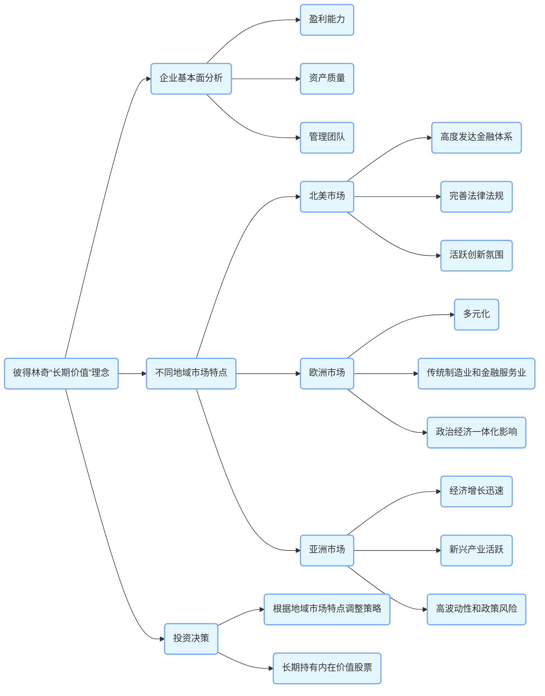

# 彼得林奇的“长期价值”在不同地域市场的体现

> 关键词：彼得林奇、长期价值、地域市场、投资策略、市场差异

> 摘要：本文聚焦于彼得林奇所倡导的“长期价值”投资理念，深入剖析该理念在不同地域市场的具体体现。通过对背景知识的介绍，明确研究的目的、范围和预期读者。详细阐述核心概念及联系，分析核心算法原理和操作步骤，运用数学模型和公式进行理论支撑，并结合具体案例说明。进行项目实战，展示代码实现和解读。探讨该理念在不同地域市场的实际应用场景，推荐相关的学习资源、开发工具和论文著作。最后总结未来发展趋势与挑战，解答常见问题，并提供扩展阅读和参考资料，旨在为投资者全面理解和应用“长期价值”投资理念提供深入且全面的指导。

## 1. 背景介绍 
### 1.1 目的和范围
彼得林奇作为投资界的传奇人物，其“长期价值”投资理念影响深远。本研究的目的在于探究这一理念在不同地域市场中的具体表现和差异，帮助投资者更好地理解和运用该理念进行投资决策。研究范围涵盖全球主要地域市场，包括北美、欧洲、亚洲等，分析不同市场的经济、政治、文化等因素对“长期价值”投资的影响。

### 1.2 预期读者
本文预期读者主要包括专业投资者、金融从业者、投资学研究者以及对投资领域感兴趣的普通大众。专业投资者可以从不同地域市场的对比中获取新的投资思路和策略；金融从业者能更好地为客户提供投资建议；投资学研究者可将本文作为研究参考；普通大众则可以借此了解投资理念和市场特点，提升自身的投资素养。

### 1.3 文档结构概述
本文首先介绍背景知识，明确研究目的、范围、预期读者和文档结构。接着阐述核心概念与联系，包括“长期价值”的定义、相关理论以及不同地域市场的特点。然后详细讲解核心算法原理和具体操作步骤，运用数学模型和公式进行理论分析，并通过举例说明。之后进行项目实战，展示代码实现和解读。探讨“长期价值”在不同地域市场的实际应用场景，推荐相关的学习资源、开发工具和论文著作。最后总结未来发展趋势与挑战，解答常见问题，并提供扩展阅读和参考资料。

### 1.4 术语表
#### 1.4.1 核心术语定义
- **长期价值**：指企业在较长时间内持续创造价值的能力，包括稳定的盈利能力、良好的资产质量、优秀的管理团队等因素。
- **地域市场**：根据地理位置、经济发展水平、政治制度等因素划分的不同市场区域，如北美市场、欧洲市场、亚洲市场等。
- **投资组合**：投资者将资金分散投资于不同资产的组合，以降低风险和提高收益。

#### 1.4.2 相关概念解释
- **价值投资**：一种投资策略，强调通过分析企业的基本面，寻找被低估的股票进行投资，以获取长期收益。
- **市场有效性**：指市场价格能够充分反映所有可用信息的程度。有效市场假说认为，在有效市场中，投资者无法通过分析公开信息获得超额收益。

#### 1.4.3 缩略词列表
- **PE**：市盈率（Price-to-Earnings Ratio），指股票价格与每股收益的比率，用于衡量股票的估值水平。
- **ROE**：净资产收益率（Return on Equity），指净利润与净资产的比率，用于衡量企业的盈利能力。

## 2. 核心概念与联系 

### 彼得林奇“长期价值”的核心原理
彼得林奇的“长期价值”投资理念基于对企业基本面的深入研究。他认为，投资者应该关注企业的内在价值，而不是短期的市场波动。企业的内在价值取决于其盈利能力、资产质量、管理团队等因素。通过长期持有具有内在价值的股票，投资者可以分享企业成长带来的收益。

### 不同地域市场的特点
- **北美市场**：以美国为代表，是全球最大的金融市场之一。具有高度发达的金融体系、完善的法律法规、活跃的创新氛围和大量的优质企业。市场有效性较高，投资者较为理性。
- **欧洲市场**：欧洲市场具有多元化的特点，不同国家的经济发展水平和市场环境存在差异。一些欧洲国家拥有传统的制造业和金融服务业，市场相对稳定。同时，欧洲市场也受到政治和经济一体化进程的影响。
- **亚洲市场**：亚洲市场包括中国、日本、韩国等国家和地区。经济增长迅速，新兴产业发展活跃。不同国家的市场特点和投资环境差异较大，一些市场存在较高的波动性和政策风险。

### 核心概念的联系
“长期价值”投资理念在不同地域市场的应用需要考虑市场的特点和差异。在北美市场，由于市场有效性较高，投资者可以通过深入研究企业基本面，寻找被低估的股票。在欧洲市场，投资者需要关注政治和经济一体化进程对企业的影响。在亚洲市场，投资者需要应对较高的波动性和政策风险，同时抓住新兴产业发展带来的机会。

### 文本示意图
```plaintext
彼得林奇“长期价值”投资理念
|
|-- 企业基本面分析
|   |-- 盈利能力
|   |-- 资产质量
|   |-- 管理团队
|
|-- 不同地域市场特点
|   |-- 北美市场
|   |   |-- 高度发达金融体系
|   |   |-- 完善法律法规
|   |   |-- 活跃创新氛围
|   |
|   |-- 欧洲市场
|   |   |-- 多元化
|   |   |-- 传统制造业和金融服务业
|   |   |-- 政治经济一体化影响
|   |
|   |-- 亚洲市场
|       |-- 经济增长迅速
|       |-- 新兴产业活跃
|       |-- 高波动性和政策风险
|
|-- 投资决策
|   |-- 根据地域市场特点调整投资策略
|   |-- 长期持有具有内在价值的股票
```

### Mermaid 流程图


## 3. 核心算法原理 & 具体操作步骤 

### 核心算法原理
在应用彼得林奇的“长期价值”投资理念时，我们可以通过一些量化指标来评估企业的内在价值。以下是一个简单的基于市盈率（PE）和净资产收益率（ROE）的算法原理。

假设我们有一个股票列表，我们可以根据以下步骤筛选出具有长期价值的股票：
1. 计算每只股票的市盈率（PE）和净资产收益率（ROE）。
2. 设定一个合理的市盈率范围和最低净资产收益率阈值。
3. 筛选出市盈率在合理范围内且净资产收益率高于阈值的股票。

### Python 源代码实现
```python
import pandas as pd

# 假设我们有一个包含股票信息的 DataFrame
# 列名为 'stock_name' 股票名称, 'PE' 市盈率, 'ROE' 净资产收益率
stocks = pd.DataFrame({
    'stock_name': ['Stock1', 'Stock2', 'Stock3', 'Stock4', 'Stock5'],
    'PE': [15, 20, 25, 10, 30],
    'ROE': [0.15, 0.2, 0.12, 0.25, 0.18]
})

# 设定合理的市盈率范围和最低净资产收益率阈值
reasonable_pe_range = (10, 20)
min_roe = 0.15

# 筛选股票
selected_stocks = stocks[
    (stocks['PE'] >= reasonable_pe_range[0]) &
    (stocks['PE'] <= reasonable_pe_range[1]) &
    (stocks['ROE'] >= min_roe)
]

print("筛选出的具有长期价值的股票：")
print(selected_stocks)
```

### 具体操作步骤
1. **数据收集**：收集不同地域市场中股票的相关数据，包括市盈率、净资产收益率、营业收入、净利润等。可以通过金融数据提供商（如 Bloomberg、Wind 等）或证券交易所网站获取数据。
2. **数据预处理**：对收集到的数据进行清洗和整理，去除缺失值和异常值。可以使用 Python 的 Pandas 库进行数据预处理。
3. **指标计算**：根据收集到的数据计算市盈率、净资产收益率等指标。
4. **筛选股票**：根据设定的合理市盈率范围和最低净资产收益率阈值，筛选出具有长期价值的股票。
5. **投资组合构建**：将筛选出的股票构建成投资组合，可以根据不同的投资目标和风险偏好进行权重分配。

## 4. 数学模型和公式 & 详细讲解 & 举例说明 

### 市盈率（PE）
市盈率是股票价格与每股收益的比率，用于衡量股票的估值水平。计算公式为：
$$PE = \frac{P}{EPS}$$
其中，$P$ 为股票价格，$EPS$ 为每股收益。

举例说明：假设某股票的价格为 $50$ 元，每股收益为 $2$ 元，则该股票的市盈率为：
$$PE = \frac{50}{2} = 25$$

### 净资产收益率（ROE）
净资产收益率是净利润与净资产的比率，用于衡量企业的盈利能力。计算公式为：
$$ROE = \frac{Net\ Income}{Shareholders'\ Equity}$$
其中，$Net\ Income$ 为净利润，$Shareholders'\ Equity$ 为股东权益。

举例说明：假设某企业的净利润为 $1000$ 万元，股东权益为 $5000$ 万元，则该企业的净资产收益率为：
$$ROE = \frac{1000}{5000} = 0.2 = 20\%$$

### 内在价值评估模型
一种简单的内在价值评估模型是基于股息折现模型（Dividend Discount Model, DDM）。假设股票的股息以固定增长率 $g$ 增长，必要收益率为 $r$，则股票的内在价值 $V$ 可以通过以下公式计算：
$$V = \frac{D_1}{r - g}$$
其中，$D_1$ 为下一期的股息。

举例说明：假设某股票下一期的股息为 $2$ 元，股息增长率为 $5\%$，必要收益率为 $10\%$，则该股票的内在价值为：
$$V = \frac{2}{0.1 - 0.05} = \frac{2}{0.05} = 40$$

## 5. 项目实战：代码实际案例和详细解释说明 

### 5.1  开发环境搭建
- **操作系统**：可以选择 Windows、Linux 或 macOS。
- **Python 环境**：建议使用 Python 3.7 及以上版本。可以通过 Anaconda 或官方网站下载安装。
- **开发工具**：推荐使用 PyCharm 或 Jupyter Notebook。
- **相关库**：需要安装 Pandas、Numpy 等库，可以使用以下命令进行安装：
```sh
pip install pandas numpy
```

### 5.2  源代码详细实现和代码解读
```python
import pandas as pd
import numpy as np

# 模拟不同地域市场的股票数据
# 假设我们有三个地域市场：北美、欧洲、亚洲
# 每个市场有 10 只股票
# 列名：'market' 市场名称, 'stock_name' 股票名称, 'PE' 市盈率, 'ROE' 净资产收益率
data = {
    'market': ['North America'] * 10 + ['Europe'] * 10 + ['Asia'] * 10,
    'stock_name': [f'Stock{i}' for i in range(1, 11)] * 3,
    'PE': np.random.randint(10, 30, 30),
    'ROE': np.random.uniform(0.1, 0.3, 30)
}

stocks = pd.DataFrame(data)

# 设定合理的市盈率范围和最低净资产收益率阈值
reasonable_pe_range = (10, 20)
min_roe = 0.15

# 筛选每个地域市场中具有长期价值的股票
selected_stocks = {}
for market in stocks['market'].unique():
    market_stocks = stocks[stocks['market'] == market]
    selected = market_stocks[
        (market_stocks['PE'] >= reasonable_pe_range[0]) &
        (market_stocks['PE'] <= reasonable_pe_range[1]) &
        (market_stocks['ROE'] >= min_roe)
    ]
    selected_stocks[market] = selected

# 输出每个地域市场中筛选出的股票
for market, stocks in selected_stocks.items():
    print(f"{market} 市场中筛选出的具有长期价值的股票：")
    print(stocks)
```

### 代码解读与分析
1. **数据模拟**：使用 `numpy` 和 `pandas` 模拟了不同地域市场的股票数据，包括市场名称、股票名称、市盈率和净资产收益率。
2. **参数设定**：设定了合理的市盈率范围和最低净资产收益率阈值。
3. **筛选股票**：通过循环遍历每个地域市场，筛选出市盈率在合理范围内且净资产收益率高于阈值的股票。
4. **结果输出**：输出每个地域市场中筛选出的具有长期价值的股票。

通过这个项目实战，我们可以看到如何应用彼得林奇的“长期价值”投资理念在不同地域市场中筛选股票。同时，我们也可以根据实际情况调整参数和指标，以适应不同的市场环境。

## 6. 实际应用场景 
### 北美市场
在北美市场，由于市场有效性较高，投资者可以利用公开信息进行深入的企业基本面分析。例如，通过分析企业的财务报表、行业竞争格局等因素，寻找被低估的股票。同时，投资者可以关注新兴产业的发展机会，如科技、医疗等领域。由于北美市场的投资者较为理性，长期价值投资策略在该市场具有较好的应用前景。

### 欧洲市场
欧洲市场的投资者需要关注政治和经济一体化进程对企业的影响。例如，英国脱欧等事件可能会对欧洲企业的经营和市场表现产生影响。投资者可以选择具有稳定盈利能力和良好资产质量的传统企业进行投资，同时关注新兴产业的发展趋势。在欧洲市场，长期价值投资需要考虑宏观经济和政治因素的影响。

### 亚洲市场
亚洲市场具有较高的波动性和政策风险，投资者需要具备较强的风险承受能力。在亚洲市场，新兴产业发展迅速，如中国的互联网、新能源等领域。投资者可以关注这些新兴产业的发展机会，同时注意防范政策风险。例如，政府的产业政策调整可能会对相关企业的发展产生重大影响。在亚洲市场，长期价值投资需要结合市场特点和政策环境进行决策。

## 7. 工具和资源推荐
### 7.1 学习资源推荐
#### 7.1.1 书籍推荐
- 《彼得林奇的成功投资》：彼得林奇的经典著作，详细阐述了他的投资理念和方法。
- 《聪明的投资者》：本杰明·格雷厄姆的著作，是价值投资领域的经典之作。
- 《金融炼金术》：乔治·索罗斯的著作，探讨了金融市场的运作规律和投资策略。

#### 7.1.2 在线课程
- Coursera 上的“投资学原理”：由知名大学教授授课，系统介绍投资学的基本原理和方法。
- Udemy 上的“价值投资实战课程”：结合实际案例，讲解价值投资的具体操作方法。

#### 7.1.3 技术博客和网站
- Seeking Alpha：提供全球金融市场的分析和评论，包括股票、债券、基金等领域。
- Bloomberg：全球知名的金融信息提供商，提供实时的金融数据和市场分析。

### 7.2 开发工具框架推荐
#### 7.2.1 IDE和编辑器
- PyCharm：专业的 Python 开发工具，具有强大的代码编辑、调试和项目管理功能。
- Jupyter Notebook：交互式的开发环境，适合进行数据分析和可视化。

#### 7.2.2 调试和性能分析工具
- PDB：Python 内置的调试工具，可以帮助开发者定位代码中的问题。
- cProfile：Python 标准库中的性能分析工具，可以分析代码的运行时间和性能瓶颈。

#### 7.2.3 相关框架和库
- Pandas：用于数据处理和分析的 Python 库，提供了高效的数据结构和数据操作方法。
- Numpy：用于科学计算的 Python 库，提供了高效的数组操作和数学函数。

### 7.3 相关论文著作推荐
#### 7.3.1 经典论文
- Eugene F. Fama 和 Kenneth R. French 的“Common Risk Factors in the Returns on Stocks and Bonds”：提出了著名的三因子模型，对资产定价理论产生了深远影响。
- Burton G. Malkiel 的“A Random Walk Down Wall Street”：阐述了有效市场假说和随机漫步理论。

#### 7.3.2 最新研究成果
- 关注顶级金融学术期刊，如《Journal of Finance》、《Review of Financial Studies》等，了解最新的投资理论和研究成果。

#### 7.3.3 应用案例分析
- 阅读知名投资机构的研究报告和案例分析，了解他们在不同地域市场的投资策略和实践经验。

## 8. 总结：未来发展趋势与挑战
### 未来发展趋势
- **全球化趋势加强**：随着全球经济一体化的发展，不同地域市场之间的联系越来越紧密。投资者可以更加容易地进行跨境投资，获取全球市场的投资机会。
- **科技驱动投资变革**：人工智能、大数据、区块链等技术的发展将对投资领域产生深远影响。投资者可以利用这些技术进行更加精准的市场分析和投资决策。
- **新兴产业发展迅速**：新兴产业如科技、医疗、新能源等将继续保持快速发展的态势。投资者可以关注这些新兴产业的发展机会，寻找具有长期价值的投资标的。

### 挑战
- **市场不确定性增加**：全球政治、经济形势的不确定性增加，如贸易摩擦、地缘政治冲突等，将对市场产生较大影响。投资者需要具备较强的风险承受能力和应对不确定性的能力。
- **技术应用难度较大**：虽然科技的发展为投资带来了新的机遇，但技术的应用也面临一定的难度。投资者需要不断学习和掌握新的技术和方法，以适应市场的变化。
- **竞争加剧**：随着投资市场的发展，投资者数量不断增加，竞争也越来越激烈。投资者需要具备独特的投资策略和优势，才能在市场中获得超额收益。

## 9. 附录：常见问题与解答
### 问题 1：如何确定合理的市盈率范围和最低净资产收益率阈值？
解答：合理的市盈率范围和最低净资产收益率阈值可以根据不同的市场环境和行业特点进行调整。一般来说，可以参考同行业的平均水平和历史数据。同时，也需要考虑企业的成长前景和风险因素。

### 问题 2：长期价值投资是否意味着长期持有一只股票？
解答：长期价值投资并不意味着长期持有一只股票。投资者需要定期对投资组合进行评估和调整，根据企业的基本面变化和市场情况进行买卖决策。

### 问题 3：在不同地域市场投资需要注意哪些问题？
解答：在不同地域市场投资需要注意以下问题：
- 了解当地的政治、经济、文化等环境，以及相关的法律法规和政策。
- 关注当地市场的特点和风险，如市场波动性、政策风险等。
- 选择合适的投资标的和投资策略，根据当地市场的情况进行调整。

## 10. 扩展阅读 & 参考资料
### 扩展阅读
- 《投资最重要的事》：霍华德·马克斯的著作，分享了他的投资经验和智慧。
- 《巴菲特致股东的信》：沃伦·巴菲特每年写给股东的信，包含了他的投资理念和策略。

### 参考资料
- 彼得林奇的官方网站和相关演讲视频。
- 金融数据提供商（如 Bloomberg、Wind 等）的研究报告和数据。
- 各大证券交易所的官方网站和公告。

作者：AI天才研究院/AI Genius Institute & 禅与计算机程序设计艺术 /Zen And The Art of Computer Programming