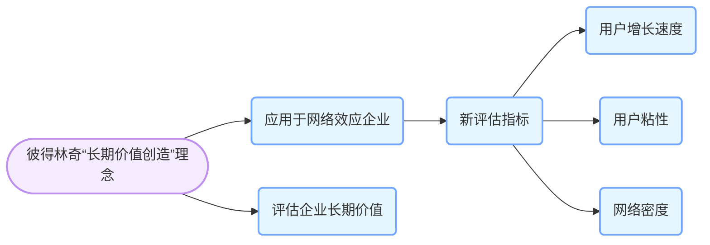

# 彼得林奇的"长期价值创造"在网络效应企业中的新指标

> 关键词：彼得林奇、长期价值创造、网络效应企业、新指标、价值评估

> 摘要：本文聚焦于彼得林奇的“长期价值创造”理念在网络效应企业中的应用，深入探讨了适用于此类企业的新评估指标。通过对网络效应企业的特点、核心概念的剖析，阐述了相关核心算法原理、数学模型及公式，并结合实际项目案例进行详细分析。同时，介绍了网络效应企业在不同场景的实际应用，推荐了学习、开发相关的工具和资源，最后总结了未来发展趋势与挑战，解答了常见问题，为投资者和企业管理者在评估网络效应企业长期价值时提供全面且深入的参考。

## 1. 背景介绍 
### 1.1 目的和范围
彼得林奇作为投资界的传奇人物，其“长期价值创造”的投资理念影响深远。然而，随着互联网和科技的发展，网络效应企业逐渐崛起，这类企业具有与传统企业不同的特点和价值创造模式。本文章旨在探索将彼得林奇的“长期价值创造”理念应用于网络效应企业时，需要引入哪些新的评估指标，以更准确地评估这类企业的长期价值。文章将涵盖网络效应企业的核心概念、评估指标的算法原理、数学模型，以及通过实际项目案例进行验证，同时探讨其在不同场景下的应用和未来发展趋势。

### 1.2 预期读者
本文的预期读者包括投资者、企业管理者、金融分析师、研究学者以及对网络效应企业和投资理念感兴趣的人士。投资者可以从中获取评估网络效应企业长期价值的新视角和方法；企业管理者能够了解如何运用这些新指标来提升企业的长期竞争力；金融分析师可将其作为分析网络效应企业的参考框架；研究学者可以在此基础上进行更深入的学术研究；而对相关领域感兴趣的人士则能通过本文了解网络效应企业的独特价值和评估方式。

### 1.3 文档结构概述
本文将按照以下结构展开：首先介绍相关的核心概念和它们之间的联系，包括网络效应企业的定义、特点以及彼得林奇“长期价值创造”理念的内涵；接着阐述适用于网络效应企业的核心算法原理和具体操作步骤，并通过 Python 代码进行详细说明；然后介绍相关的数学模型和公式，并举例说明其应用；之后通过一个实际项目案例，详细介绍开发环境搭建、源代码实现和代码解读；再探讨网络效应企业在不同场景下的实际应用；推荐学习、开发相关的工具和资源；最后总结未来发展趋势与挑战，解答常见问题，并提供扩展阅读和参考资料。

### 1.4 术语表
#### 1.4.1 核心术语定义
- **彼得林奇的“长期价值创造”**：指通过深入研究企业的基本面，寻找具有持续竞争优势和增长潜力的企业，进行长期投资以实现价值增长。
- **网络效应企业**：是指那些随着用户数量的增加，产品或服务的价值呈指数级增长的企业。例如社交网络、电商平台等，用户之间的互动和连接产生了额外的价值。
- **网络效应**：是指一个产品或服务的价值随着使用该产品或服务的用户数量的增加而增加的现象。可以分为直接网络效应和间接网络效应。直接网络效应是指用户数量的增加直接提高了产品或服务对其他用户的价值，如社交网络；间接网络效应是指一种产品或服务的用户数量增加会带动与之互补的产品或服务的需求增加，从而提高整个生态系统的价值，如操作系统和应用程序。
- **长期价值评估指标**：用于衡量企业在较长时间内创造价值能力的指标，在网络效应企业中，可能包括用户增长速度、用户粘性、网络密度等。

#### 1.4.2 相关概念解释
- **用户增长速度**：指在一定时间内企业用户数量的增长比例，反映了企业吸引新用户的能力。较高的用户增长速度通常意味着企业具有较强的市场竞争力和发展潜力。
- **用户粘性**：衡量用户对企业产品或服务的依赖程度和忠诚度。可以通过用户的使用频率、留存率等指标来衡量。用户粘性高的企业，用户更愿意长期使用其产品或服务，为企业带来持续的收入。
- **网络密度**：指网络中节点（用户）之间的连接程度。在网络效应企业中，网络密度越高，用户之间的互动和价值创造就越频繁，企业的价值也就越大。

#### 1.4.3 缩略词列表
- **MAU**：Monthly Active Users，月活跃用户数，用于衡量企业产品或服务在一个月内的活跃用户数量。
- **DAU**：Daily Active Users，日活跃用户数，反映了企业产品或服务在一天内的活跃用户情况。
- **ARPU**：Average Revenue Per User，每用户平均收入，计算企业从每个用户身上获得的平均收入。

## 2. 核心概念与联系 

### 核心概念原理
彼得林奇的“长期价值创造”理念强调对企业基本面的深入研究，寻找那些具有持续竞争优势和增长潜力的企业进行长期投资。在传统企业中，常用的评估指标包括市盈率、市净率、净资产收益率等。然而，网络效应企业具有独特的价值创造模式，其价值主要来源于用户之间的互动和连接所产生的网络效应。

网络效应企业的核心特点是用户数量的增加会带来产品或服务价值的指数级增长。例如，社交网络平台上的用户越多，用户之间的交流和互动就越频繁，平台的价值也就越大。因此，评估网络效应企业的长期价值需要引入一些新的指标，如用户增长速度、用户粘性和网络密度等。

用户增长速度反映了企业吸引新用户的能力，是网络效应企业发展的重要动力。如果企业能够持续保持较高的用户增长速度，随着用户数量的积累，网络效应将逐渐显现，企业的价值也会不断提升。

用户粘性衡量了用户对企业产品或服务的依赖程度和忠诚度。高用户粘性意味着用户更愿意长期使用企业的产品或服务，为企业带来持续的收入。同时，高粘性的用户还会通过口碑传播吸引更多的新用户，进一步促进企业的发展。

网络密度则反映了网络中节点（用户）之间的连接程度。在网络效应企业中，网络密度越高，用户之间的互动和价值创造就越频繁，企业的价值也就越大。例如，在一个社交网络中，如果用户之间的好友关系非常紧密，信息传播速度快，那么这个社交网络的价值就会更高。

### 架构的文本示意图
```plaintext
彼得林奇“长期价值创造”理念
|
|-- 应用于网络效应企业
|   |
|   |-- 新评估指标
|       |
|       |-- 用户增长速度
|       |-- 用户粘性
|       |-- 网络密度
|
|-- 评估企业长期价值
```

### Mermaid 流程图


## 3. 核心算法原理 & 具体操作步骤 

### 核心算法原理
#### 用户增长速度计算
用户增长速度可以通过计算一定时间内用户数量的增长率来衡量。计算公式为：
$$用户增长速度 = \frac{当前用户数量 - 上一时期用户数量}{上一时期用户数量} \times 100\%$$

#### 用户粘性计算
用户粘性可以通过用户留存率来衡量。用户留存率是指在某一时期开始使用产品或服务的用户，在经过一段时间后仍然继续使用的用户比例。计算公式为：
$$用户留存率 = \frac{留存用户数量}{初始用户数量} \times 100\%$$

#### 网络密度计算
网络密度是指网络中实际存在的连接数与理论上可能存在的最大连接数的比值。对于一个具有 $n$ 个节点的网络，理论上最大连接数为 $\frac{n(n - 1)}{2}$。假设实际存在的连接数为 $m$，则网络密度的计算公式为：
$$网络密度 = \frac{m}{\frac{n(n - 1)}{2}}$$

### 具体操作步骤
#### 步骤 1：数据收集
收集企业的用户数据，包括不同时期的用户数量、用户的使用记录等。可以从企业的数据库、统计报表或第三方数据平台获取这些数据。

#### 步骤 2：计算用户增长速度
根据上述用户增长速度的计算公式，计算不同时期的用户增长速度。可以按年、季度或月来计算，以便观察用户增长的趋势。

#### 步骤 3：计算用户粘性
根据用户的使用记录，确定初始用户数量和留存用户数量，然后按照用户留存率的计算公式计算用户粘性。可以计算不同时间段的用户留存率，如次日留存率、7 日留存率、30 日留存率等。

#### 步骤 4：计算网络密度
确定网络中的节点数量 $n$ 和实际存在的连接数 $m$，然后根据网络密度的计算公式计算网络密度。在实际应用中，需要根据企业的具体业务场景来定义节点和连接。例如，在社交网络中，节点可以是用户，连接可以是好友关系；在电商平台中，节点可以是商家和用户，连接可以是交易关系。

### Python 代码实现
```python
# 用户增长速度计算函数
def user_growth_rate(current_users, previous_users):
    if previous_users == 0:
        return 0
    return ((current_users - previous_users) / previous_users) * 100

# 用户留存率计算函数
def user_retention_rate(retained_users, initial_users):
    if initial_users == 0:
        return 0
    return (retained_users / initial_users) * 100

# 网络密度计算函数
def network_density(actual_connections, num_nodes):
    if num_nodes < 2:
        return 0
    max_connections = num_nodes * (num_nodes - 1) / 2
    return actual_connections / max_connections

# 示例数据
current_users = 1000
previous_users = 800
retained_users = 700
initial_users = 1000
actual_connections = 200
num_nodes = 50

# 计算用户增长速度
growth_rate = user_growth_rate(current_users, previous_users)
print(f"用户增长速度: {growth_rate:.2f}%")

# 计算用户留存率
retention_rate = user_retention_rate(retained_users, initial_users)
print(f"用户留存率: {retention_rate:.2f}%")

# 计算网络密度
density = network_density(actual_connections, num_nodes)
print(f"网络密度: {density:.4f}")
```

在上述代码中，定义了三个函数分别用于计算用户增长速度、用户留存率和网络密度。然后使用示例数据调用这些函数进行计算，并输出计算结果。

## 4. 数学模型和公式 & 详细讲解 & 举例说明 

### 用户增长速度模型
用户增长速度的数学模型为：
$$r = \frac{U_t - U_{t-1}}{U_{t-1}} \times 100\%$$
其中，$r$ 表示用户增长速度，$U_t$ 表示当前时期的用户数量，$U_{t-1}$ 表示上一时期的用户数量。

详细讲解：该公式通过计算用户数量的变化量与上一时期用户数量的比值，得到用户增长的百分比。如果 $r > 0$，表示用户数量在增加；如果 $r < 0$，表示用户数量在减少。

举例说明：假设某网络效应企业在第一个月的用户数量为 1000 人，第二个月的用户数量为 1200 人。则第二个月的用户增长速度为：
$$r = \frac{1200 - 1000}{1000} \times 100\% = 20\%$$

### 用户留存率模型
用户留存率的数学模型为：
$$R = \frac{R_t}{I} \times 100\%$$
其中，$R$ 表示用户留存率，$R_t$ 表示在经过一段时间 $t$ 后仍然留存的用户数量，$I$ 表示初始用户数量。

详细讲解：该公式用于衡量用户在一段时间后继续使用产品或服务的比例。留存率越高，说明用户对产品或服务的粘性越强。

举例说明：某网络应用在月初有 1000 个新用户注册，一个月后仍然有 600 个用户继续使用该应用。则该应用的月留存率为：
$$R = \frac{600}{1000} \times 100\% = 60\%$$

### 网络密度模型
网络密度的数学模型为：
$$D = \frac{m}{\frac{n(n - 1)}{2}}$$
其中，$D$ 表示网络密度，$m$ 表示网络中实际存在的连接数，$n$ 表示网络中的节点数量。

详细讲解：该公式通过计算实际连接数与理论最大连接数的比值，来衡量网络中节点之间的连接紧密程度。网络密度的取值范围在 0 到 1 之间，值越接近 1，表示网络中节点之间的连接越紧密。

举例说明：假设有一个社交网络，其中有 10 个用户（节点），用户之间的好友关系（连接）共有 20 条。则该社交网络的网络密度为：
$$D = \frac{20}{\frac{10\times(10 - 1)}{2}} = \frac{20}{45} \approx 0.44$$

## 5. 项目实战：代码实际案例和详细解释说明 

### 5.1  开发环境搭建
#### 安装 Python
首先需要安装 Python 开发环境。可以从 Python 官方网站（https://www.python.org/downloads/）下载适合自己操作系统的 Python 版本进行安装。安装完成后，打开命令行工具，输入 `python --version` 命令，验证 Python 是否安装成功。

#### 安装必要的库
在本项目中，主要使用 Python 的基本库进行数据处理和计算，无需安装额外的第三方库。如果需要进行数据可视化，可以安装 `matplotlib` 库，使用以下命令进行安装：
```sh
pip install matplotlib
```

### 5.2  源代码详细实现和代码解读
```python
import matplotlib.pyplot as plt

# 用户增长速度计算函数
def user_growth_rate(current_users, previous_users):
    if previous_users == 0:
        return 0
    return ((current_users - previous_users) / previous_users) * 100

# 用户留存率计算函数
def user_retention_rate(retained_users, initial_users):
    if initial_users == 0:
        return 0
    return (retained_users / initial_users) * 100

# 网络密度计算函数
def network_density(actual_connections, num_nodes):
    if num_nodes < 2:
        return 0
    max_connections = num_nodes * (num_nodes - 1) / 2
    return actual_connections / max_connections

# 模拟数据
months = [1, 2, 3, 4, 5, 6]
user_numbers = [1000, 1200, 1500, 1800, 2200, 2500]
retained_users = [800, 900, 1100, 1300, 1600, 1800]
actual_connections = [200, 300, 400, 500, 600, 700]
num_nodes = [100, 120, 150, 180, 220, 250]

# 计算用户增长速度、用户留存率和网络密度
growth_rates = []
retention_rates = []
densities = []

for i in range(1, len(months)):
    growth_rate = user_growth_rate(user_numbers[i], user_numbers[i - 1])
    growth_rates.append(growth_rate)
    
    retention_rate = user_retention_rate(retained_users[i], user_numbers[i - 1])
    retention_rates.append(retention_rate)
    
    density = network_density(actual_connections[i], num_nodes[i])
    densities.append(density)

# 绘制用户增长速度、用户留存率和网络密度的折线图
plt.figure(figsize=(12, 8))

plt.subplot(3, 1, 1)
plt.plot(months[1:], growth_rates, marker='o')
plt.title('用户增长速度')
plt.xlabel('月份')
plt.ylabel('增长速度 (%)')

plt.subplot(3, 1, 2)
plt.plot(months[1:], retention_rates, marker='o')
plt.title('用户留存率')
plt.xlabel('月份')
plt.ylabel('留存率 (%)')

plt.subplot(3, 1, 3)
plt.plot(months[1:], densities, marker='o')
plt.title('网络密度')
plt.xlabel('月份')
plt.ylabel('网络密度')

plt.tight_layout()
plt.show()
```

### 5.3  代码解读与分析
#### 代码功能概述
该代码模拟了一个网络效应企业在 6 个月内的用户数据，包括用户数量、留存用户数量、实际连接数和节点数量。然后使用之前定义的函数计算每个月的用户增长速度、用户留存率和网络密度，并使用 `matplotlib` 库绘制折线图来直观展示这些指标的变化趋势。

#### 代码详细解读
1. **导入必要的库**：导入 `matplotlib.pyplot` 库用于数据可视化。
2. **定义计算函数**：定义了 `user_growth_rate`、`user_retention_rate` 和 `network_density` 三个函数，分别用于计算用户增长速度、用户留存率和网络密度。
3. **模拟数据**：使用列表 `months`、`user_numbers`、`retained_users`、`actual_connections` 和 `num_nodes` 模拟了 6 个月内的用户数据。
4. **计算指标**：使用循环遍历每个月的数据，调用计算函数计算用户增长速度、用户留存率和网络密度，并将结果存储在相应的列表中。
5. **绘制折线图**：使用 `plt.subplot` 函数将三个指标的折线图绘制在同一个画布上，分别展示用户增长速度、用户留存率和网络密度的变化趋势。

#### 代码分析
通过观察绘制的折线图，可以直观地了解该网络效应企业在不同时间段内的用户增长情况、用户粘性和网络连接紧密程度。如果用户增长速度持续上升，说明企业吸引新用户的能力较强；如果用户留存率较高且稳定，说明用户对产品或服务的粘性较好；如果网络密度逐渐增加，说明网络中节点之间的连接越来越紧密，企业的网络效应在不断增强。

## 6. 实际应用场景 
### 投资决策
对于投资者来说，在评估网络效应企业的投资价值时，传统的财务指标可能无法全面反映企业的真实价值。引入用户增长速度、用户粘性和网络密度等新指标，可以更准确地评估企业的长期发展潜力。例如，如果一个社交网络平台的用户增长速度持续保持在较高水平，用户留存率也很高，同时网络密度不断增加，那么该平台具有较强的网络效应，未来的盈利能力和市场竞争力可能会很强，是一个值得投资的对象。

### 企业战略规划
企业管理者可以利用这些新指标来制定战略规划。通过分析用户增长速度，了解市场对企业产品或服务的接受程度，确定市场推广策略和目标用户群体。例如，如果用户增长速度较慢，可能需要加大市场推广力度或优化产品功能以吸引更多用户。通过监测用户留存率，评估产品或服务的质量和用户满意度，及时发现问题并进行改进。例如，如果用户留存率下降，可能需要分析是产品功能、用户体验还是竞争对手的影响，然后采取相应的措施来提高用户粘性。通过计算网络密度，了解用户之间的连接程度和互动情况，优化产品的社交功能或业务模式，进一步增强网络效应。

### 市场竞争分析
在市场竞争中，企业可以通过比较自身和竞争对手的用户增长速度、用户粘性和网络密度等指标，了解自己在市场中的地位和竞争优势。如果企业的用户增长速度高于竞争对手，说明企业在吸引新用户方面更具优势；如果用户留存率更高，说明企业的产品或服务更受用户青睐；如果网络密度更大，说明企业的网络效应更强，具有更高的市场壁垒。通过对这些指标的分析，企业可以制定针对性的竞争策略，如差异化竞争、成本领先等，以提高市场份额和竞争力。

### 产品优化
产品开发团队可以根据这些指标来优化产品。例如，通过分析用户增长速度和留存率，了解哪些功能受到用户欢迎，哪些功能需要改进。如果某个新功能推出后用户增长速度明显提高，说明该功能满足了用户的需求，可以进一步加强和优化；如果某个功能导致用户留存率下降，可能需要对该功能进行调整或删除。同时，通过观察网络密度的变化，了解用户之间的互动模式，优化产品的社交功能和用户推荐算法，提高用户之间的连接和互动效率。

## 7. 工具和资源推荐
### 7.1 学习资源推荐
#### 7.1.1 书籍推荐
- 《彼得林奇的成功投资》：彼得林奇的经典著作，详细介绍了他的投资理念和方法，对于理解“长期价值创造”理念具有重要的参考价值。
- 《网络、群体与市场：揭示高度互联世界的行为原理与效应机制》：这本书深入探讨了网络效应的原理和应用，对于理解网络效应企业的特点和价值创造模式非常有帮助。
- 《增长黑客：如何低成本实现爆发式增长》：介绍了通过数据分析和实验来实现用户增长的方法和策略，对于网络效应企业的用户增长和市场推广具有实际指导意义。

#### 7.1.2 在线课程
- Coursera 上的“Networks, Crowds, and Markets”：由康奈尔大学的教授授课，系统地介绍了网络、群体和市场的相关理论和模型，包括网络效应的原理和应用。
- edX 上的“Data Science MicroMasters Program”：涵盖了数据科学的各个方面，包括数据处理、数据分析和机器学习等，对于使用数据来评估网络效应企业的价值非常有帮助。
- Udemy 上的“Growth Hacking for Startups”：专门针对初创企业的用户增长和市场推广，介绍了各种增长黑客的方法和技巧。

#### 7.1.3 技术博客和网站
- Medium：上面有很多关于投资、网络效应和数据分析的优质文章，作者来自不同的领域和背景，可以获取到最新的行业动态和观点。
- Hacker News：是一个科技社区，用户可以分享和讨论最新的科技新闻、创业项目和技术文章，对于了解网络效应企业的发展趋势和创新模式非常有帮助。
- Towards Data Science：专注于数据科学和机器学习领域的技术博客，提供了很多关于数据分析和建模的实用教程和案例。

### 7.2 开发工具框架推荐
#### 7.2.1 IDE和编辑器
- PyCharm：是一款专业的 Python 集成开发环境，具有代码自动补全、调试、版本控制等功能，适合开发 Python 程序。
- Jupyter Notebook：是一个交互式的开发环境，支持 Python、R 等多种编程语言，非常适合进行数据分析和模型实验。
- Visual Studio Code：是一款轻量级的代码编辑器，支持多种编程语言和插件扩展，具有丰富的代码编辑和调试功能。

#### 7.2.2 调试和性能分析工具
- pdb：是 Python 自带的调试工具，可以在代码中设置断点，逐步执行代码，查看变量的值和程序的执行流程。
- cProfile：是 Python 的性能分析工具，可以分析代码的运行时间和函数调用次数，找出性能瓶颈。
- Memory Profiler：可以分析 Python 程序的内存使用情况，帮助优化内存占用。

#### 7.2.3 相关框架和库
- Pandas：是一个强大的数据处理和分析库，提供了高效的数据结构和数据操作方法，适合处理和分析用户数据。
- NumPy：是 Python 的数值计算库，提供了高效的数组和矩阵运算功能，对于数学模型的实现非常有帮助。
- Matplotlib：是一个数据可视化库，可以绘制各种类型的图表，如折线图、柱状图、散点图等，用于直观展示数据和分析结果。

### 7.3 相关论文著作推荐
#### 7.3.1 经典论文
- “Network Externalities, Competition, and Compatibility” by Michael L. Katz and Carl Shapiro：这篇经典论文首次提出了网络外部性的概念，并分析了网络效应在市场竞争和兼容性方面的影响。
- “The Economics of Networks” by Nicholas Economides：对网络经济的理论和应用进行了系统的阐述，包括网络效应的原理、市场结构和定价策略等。
- “Platform Competition in Two-Sided Markets” by Jean-Charles Rochet and Jean Tirole：研究了双边市场中的平台竞争问题，对于理解网络效应企业的商业模式和竞争策略具有重要的参考价值。

#### 7.3.2 最新研究成果
- 关注顶级学术期刊如 *Management Science*、*Journal of Marketing* 和 *Information Systems Research* 上发表的关于网络效应、用户行为和企业价值评估的最新研究论文，了解该领域的前沿动态和研究方法。
- 参加相关的学术会议，如 ACM SIGKDD（知识发现与数据挖掘会议）、WWW（万维网会议）等，获取最新的研究成果和行业趋势。

#### 7.3.3 应用案例分析
- 可以参考一些知名网络效应企业的案例分析报告，如 Facebook、Amazon、阿里巴巴等，了解它们在用户增长、用户粘性和网络效应增强方面的策略和实践经验。
- 一些咨询公司和研究机构也会发布关于网络效应企业的研究报告和案例分析，如麦肯锡、波士顿咨询集团等，可以从中获取有价值的信息和启示。

## 8. 总结：未来发展趋势与挑战
### 未来发展趋势
#### 多领域融合
网络效应将不再局限于传统的互联网领域，而是会与金融、医疗、教育等多个行业深度融合。例如，金融科技企业通过构建网络平台，连接投资者、借款人和金融机构，实现资金的高效配置；医疗领域的在线医疗平台将患者、医生和医疗机构连接起来，提供便捷的医疗服务。这种多领域融合将创造出更多具有网络效应的商业模式和企业。

#### 人工智能与网络效应的结合
人工智能技术将在网络效应企业中发挥越来越重要的作用。通过人工智能算法，可以更好地分析用户数据，了解用户需求和行为模式，从而实现精准的用户推荐和个性化服务。同时，人工智能还可以优化网络效应企业的运营效率，如自动化客户服务、智能物流等。例如，电商平台利用人工智能算法为用户推荐商品，提高用户的购买转化率和满意度。

#### 区块链技术的应用
区块链技术具有去中心化、不可篡改、安全可信等特点，将为网络效应企业带来新的发展机遇。区块链可以用于构建可信的网络环境，解决用户信任和数据安全问题。例如，在共享经济领域，区块链可以实现用户之间的直接交易和信任机制，降低交易成本和风险。同时，区块链还可以用于激励用户参与网络建设和价值创造，如通过代币经济模式，激励用户贡献数据和资源。

### 挑战
#### 数据隐私和安全问题
随着网络效应企业收集和处理的用户数据越来越多，数据隐私和安全问题成为了一个重要的挑战。一旦用户数据泄露，不仅会损害用户的利益，还会影响企业的声誉和信任度。因此，网络效应企业需要加强数据安全保护措施，遵守相关的法律法规，确保用户数据的隐私和安全。

#### 市场竞争加剧
网络效应企业的发展吸引了越来越多的参与者，市场竞争日益激烈。企业需要不断创新和提升自身的竞争力，以吸引和留住用户。同时，随着市场的成熟，行业集中度可能会逐渐提高，头部企业将占据更大的市场份额，中小网络效应企业面临着更大的生存压力。

#### 监管政策的不确定性
网络效应企业的发展带来了一些新的问题和挑战，如垄断、不正当竞争等，需要政府加强监管。然而，监管政策的制定和实施需要一定的时间和过程，存在一定的不确定性。企业需要密切关注监管政策的变化，及时调整自身的发展策略，以适应监管要求。

#### 技术更新换代快
网络效应企业依赖于先进的技术和创新，技术更新换代非常快。企业需要不断投入研发资源，跟上技术发展的步伐，否则可能会被市场淘汰。例如，随着 5G、物联网等新技术的发展，网络效应企业需要及时应用这些技术，提升用户体验和服务质量。

## 9. 附录：常见问题与解答
### 问题 1：如何准确收集网络效应企业的用户数据？
解答：可以通过以下几种方式收集网络效应企业的用户数据：
- 企业自身的数据库：企业在运营过程中会记录用户的各种信息，如注册信息、登录记录、交易记录等，可以从企业的数据库中提取这些数据。
- 第三方数据平台：一些第三方数据平台提供了网络效应企业的相关数据，如用户规模、市场份额等。可以通过购买这些数据或与第三方数据平台合作来获取所需的数据。
- 问卷调查：可以通过在线问卷、电话访谈等方式向用户收集数据，了解用户的需求、行为和满意度等信息。
- 日志文件：企业的服务器会记录用户的访问日志，包括访问时间、访问页面、操作行为等，可以通过分析日志文件来获取用户的行为数据。

### 问题 2：用户增长速度和用户留存率哪个更重要？
解答：用户增长速度和用户留存率都非常重要，它们在不同的阶段对网络效应企业的发展起着不同的作用。

在企业的初创阶段，用户增长速度更为重要。快速增长的用户数量可以使企业迅速扩大市场份额，形成网络效应。随着用户数量的增加，产品或服务的价值会不断提升，吸引更多的用户加入。

在企业的发展成熟阶段，用户留存率更为关键。高用户留存率意味着用户对产品或服务的满意度和忠诚度较高，能够为企业带来持续的收入。同时，留存用户还会通过口碑传播吸引新用户，进一步促进企业的发展。

因此，企业需要在不同的阶段平衡好用户增长速度和用户留存率，既要不断吸引新用户，又要努力提高用户留存率。

### 问题 3：网络密度的计算是否适用于所有类型的网络效应企业？
解答：网络密度的计算方法适用于大多数具有网络结构的网络效应企业，但在不同类型的企业中，节点和连接的定义可能会有所不同。

对于社交网络、在线社区等以用户互动为主要特征的企业，节点可以定义为用户，连接可以定义为用户之间的好友关系、互动记录等。

对于电商平台、共享经济平台等以交易为主要特征的企业，节点可以定义为商家和用户，连接可以定义为交易关系、评价关系等。

对于一些技术平台、开源社区等以知识共享和合作开发为主要特征的企业，节点可以定义为开发者、用户或项目，连接可以定义为代码贡献、协作关系、引用关系等。

在实际应用中，需要根据企业的具体业务场景和数据特点，合理定义节点和连接，以确保网络密度的计算能够准确反映企业的网络结构和价值创造能力。

### 问题 4：如何根据这些新指标来评估网络效应企业的长期价值？
解答：可以从以下几个方面综合考虑这些新指标来评估网络效应企业的长期价值：
- 用户增长速度：持续较高的用户增长速度表明企业具有较强的市场竞争力和发展潜力。可以观察用户增长速度的趋势，如果增长速度逐渐加快，说明企业的市场推广和产品吸引力在不断增强；如果增长速度逐渐放缓，需要分析原因，是否是市场饱和、竞争对手挤压等因素导致的。
- 用户留存率：高用户留存率意味着用户对产品或服务的满意度和忠诚度较高，能够为企业带来持续的收入。可以关注不同时间段的用户留存率，如次日留存率、7 日留存率、30 日留存率等，了解用户在不同阶段的留存情况。同时，还可以分析留存用户的行为特征，如使用频率、消费金额等，评估留存用户的价值。
- 网络密度：网络密度反映了网络中节点之间的连接紧密程度，网络密度越高，用户之间的互动和价值创造就越频繁，企业的价值也就越大。可以比较不同企业或同一企业不同时期的网络密度，了解企业的网络效应强弱和发展趋势。
- 综合分析：除了以上三个指标外，还需要结合企业的财务状况、商业模式、市场竞争等因素进行综合分析。例如，企业的盈利能力、现金流状况、成本控制能力等都会影响企业的长期价值。同时，要关注企业的商业模式是否具有可持续性，是否能够适应市场的变化和竞争。

## 10. 扩展阅读 & 参考资料
### 扩展阅读
- 《创新者的窘境》：探讨了企业在面对技术创新和市场变化时的挑战和机遇，对于理解网络效应企业的发展和竞争具有一定的启示作用。
- 《从零到一：开启商业与未来的秘密》：介绍了创业公司如何从无到有，创造出具有独特价值的产品和服务，对于网络效应企业的创业和发展提供了有益的思路。
- 《数字化转型：企业的必由之路》：讲述了企业如何利用数字技术进行转型和创新，适应数字化时代的发展需求，对于网络效应企业的数字化转型具有参考价值。

### 参考资料
- Peter Lynch. *One Up on Wall Street*. Simon & Schuster, 1989.
- Michael L. Katz and Carl Shapiro. “Network Externalities, Competition, and Compatibility.” *The American Economic Review*, Vol. 75, No. 3 (Jun., 1985), pp. 424-440.
- Nicholas Economides. “The Economics of Networks.” *International Journal of Industrial Organization*, Vol. 14, No. 6 (1996), pp. 673-699.
- Jean-Charles Rochet and Jean Tirole. “Platform Competition in Two-Sided Markets.” *Journal of the European Economic Association*, Vol. 1, No. 4 (Jun., 2003), pp. 990-1029.

作者：AI天才研究院/AI Genius Institute & 禅与计算机程序设计艺术 /Zen And The Art of Computer Programming