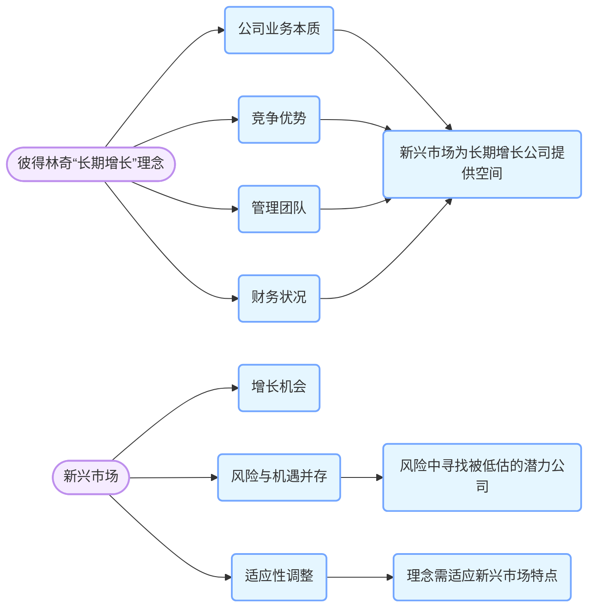

# 彼得林奇的"长期增长"潜力在新兴市场的识别

> 关键词：彼得林奇、长期增长、新兴市场、潜力识别、投资策略

> 摘要：本文聚焦于彼得林奇的“长期增长”理念在新兴市场中的应用。通过深入剖析彼得林奇投资思想的核心概念，详细阐述了在新兴市场中识别具有长期增长潜力的方法和策略。文章涵盖了核心算法原理、数学模型、项目实战案例等方面，旨在为投资者和相关从业者提供全面且实用的指导，帮助他们在新兴市场中准确捕捉具有长期增长潜力的投资机会，同时探讨了该领域的实际应用场景、推荐了相关工具和资源，并对未来发展趋势与挑战进行了总结。

## 1. 背景介绍 
### 1.1 目的和范围
彼得林奇作为投资界的传奇人物，其“长期增长”投资理念在全球范围内产生了深远影响。新兴市场以其高增长、高潜力的特点吸引了众多投资者的目光，但同时也伴随着较高的风险和不确定性。本文章的目的在于将彼得林奇的“长期增长”理念引入新兴市场，深入探讨如何在新兴市场中准确识别具有长期增长潜力的投资标的。范围涵盖了新兴市场的各个行业和领域，包括但不限于科技、金融、消费等，旨在为投资者提供一套系统的、可操作的识别方法和策略。

### 1.2 预期读者
本文预期读者主要包括以下几类人群：
1. **投资者**：无论是个人投资者还是机构投资者，希望在新兴市场中寻找长期投资机会，获取稳定收益的人群。
2. **金融从业者**：如基金经理、分析师、投资顾问等，需要深入了解新兴市场投资策略，为客户提供专业建议的人员。
3. **研究人员**：从事金融、投资领域研究的学者和研究人员，对新兴市场投资理论和实践感兴趣的人群。
4. **创业者**：在新兴市场中创业的企业家，希望了解市场趋势和投资机会，为企业发展提供参考的人群。

### 1.3 文档结构概述
本文将按照以下结构进行阐述：
1. **核心概念与联系**：介绍彼得林奇“长期增长”理念的核心概念，以及这些概念与新兴市场的联系，并通过文本示意图和 Mermaid 流程图进行直观展示。
2. **核心算法原理 & 具体操作步骤**：详细讲解识别新兴市场中具有长期增长潜力的核心算法原理，并给出具体的操作步骤，同时使用 Python 源代码进行详细阐述。
3. **数学模型和公式 & 详细讲解 & 举例说明**：建立数学模型和公式，对识别过程进行量化分析，并通过具体的例子进行详细说明。
4. **项目实战：代码实际案例和详细解释说明**：通过实际的项目案例，展示如何运用上述方法和策略在新兴市场中识别具有长期增长潜力的投资标的，并对代码进行详细解读和分析。
5. **实际应用场景**：探讨彼得林奇的“长期增长”理念在新兴市场中的实际应用场景，包括不同行业和领域的应用案例。
6. **工具和资源推荐**：推荐一些学习资源、开发工具框架和相关论文著作，帮助读者进一步深入学习和研究。
7. **总结：未来发展趋势与挑战**：总结本文的主要内容，分析新兴市场中“长期增长”潜力识别的未来发展趋势和面临的挑战。
8. **附录：常见问题与解答**：对读者可能关心的常见问题进行解答，提供更全面的信息。
9. **扩展阅读 & 参考资料**：提供一些扩展阅读的建议和参考资料，方便读者进一步深入研究。

### 1.4 术语表
#### 1.4.1 核心术语定义
1. **彼得林奇的“长期增长”理念**：彼得林奇认为，投资者应该关注那些具有长期增长潜力的公司，通过长期持有这些公司的股票，分享公司成长带来的收益。这种理念强调对公司基本面的深入研究，寻找那些具有独特竞争优势、良好管理团队和持续创新能力的公司。
2. **新兴市场**：指的是发展中国家或地区的金融市场，这些市场通常具有较高的经济增长率、较低的市场饱和度和较大的发展潜力，但同时也伴随着较高的风险和不确定性。
3. **长期增长潜力**：指的是公司在未来较长一段时间内（通常为 5 - 10 年或更长）具有持续增长的可能性和能力，包括营收增长、利润增长、市场份额扩大等方面。

#### 1.4.2 相关概念解释
1. **基本面分析**：通过对公司的财务报表、经营状况、行业竞争等方面进行分析，评估公司的内在价值和发展潜力。
2. **行业生命周期**：指的是一个行业从诞生、成长、成熟到衰退的整个过程，不同阶段的行业具有不同的特点和投资机会。
3. **竞争优势**：指的是公司在市场竞争中相对于竞争对手所具有的独特优势，如品牌优势、技术优势、成本优势等。

#### 1.4.3 缩略词列表
1. **PE**：市盈率（Price - Earnings Ratio），指的是股票价格与每股收益的比率，用于衡量股票的估值水平。
2. **PB**：市净率（Price - Book Ratio），指的是股票价格与每股净资产的比率，用于衡量股票的估值水平。
3. **ROE**：净资产收益率（Return on Equity），指的是公司净利润与股东权益的比率，用于衡量公司的盈利能力和股东回报水平。

## 2. 核心概念与联系 

### 彼得林奇“长期增长”理念核心概念
彼得林奇的“长期增长”理念核心在于寻找那些具有持续成长能力的公司。这涉及到多个关键概念：
1. **公司的业务本质**：了解公司究竟是做什么的，其产品或服务是否具有实际需求，是否能够解决用户的痛点。例如，一家科技公司开发的软件能够显著提高企业的办公效率，那么该软件就有市场需求。
2. **竞争优势**：公司在市场中必须具有独特的竞争优势，这种优势可以是品牌、技术、成本等方面。比如可口可乐，其强大的品牌影响力使其在饮料市场具有很强的竞争力。
3. **管理团队**：优秀的管理团队是公司持续发展的关键。他们需要具备战略眼光、决策能力和执行能力，能够带领公司在市场竞争中取得优势。
4. **财务状况**：健康的财务状况是公司长期增长的基础。包括稳定的营收增长、合理的利润水平、良好的现金流等。

### 与新兴市场的联系
新兴市场具有高增长、高潜力的特点，但也伴随着较高的风险和不确定性。彼得林奇的“长期增长”理念在新兴市场中具有重要的应用价值：
1. **新兴市场的增长机会**：新兴市场的经济快速发展，为具有长期增长潜力的公司提供了广阔的发展空间。例如，随着新兴市场国家的城市化进程加速，房地产、基础设施建设等行业将迎来巨大的发展机遇。
2. **风险与机遇并存**：新兴市场的不确定性较高，包括政治风险、经济波动、市场监管不完善等。但正是这种不确定性，也为投资者提供了寻找被低估的具有长期增长潜力公司的机会。
3. **适应性调整**：在新兴市场中应用彼得林奇的理念，需要根据新兴市场的特点进行适当的调整。例如，新兴市场的行业发展阶段可能与成熟市场不同，需要更加关注行业的发展趋势和前景。

### 文本示意图
```plaintext
彼得林奇“长期增长”理念
|
|-- 公司业务本质
|   |-- 产品或服务需求
|   |-- 解决用户痛点
|
|-- 竞争优势
|   |-- 品牌优势
|   |-- 技术优势
|   |-- 成本优势
|
|-- 管理团队
|   |-- 战略眼光
|   |-- 决策能力
|   |-- 执行能力
|
|-- 财务状况
|   |-- 营收增长
|   |-- 利润水平
|   |-- 现金流

新兴市场
|
|-- 增长机会
|   |-- 经济快速发展
|   |-- 行业发展机遇
|
|-- 风险与机遇并存
|   |-- 政治风险
|   |-- 经济波动
|   |-- 市场监管不完善
|
|-- 适应性调整
|   |-- 关注行业发展趋势
|   |-- 结合新兴市场特点

联系
|
|-- 新兴市场为长期增长公司提供空间
|-- 风险中寻找被低估的潜力公司
|-- 理念需适应新兴市场特点
```

### Mermaid 流程图


## 3. 核心算法原理 & 具体操作步骤 

### 核心算法原理
在新兴市场中识别具有长期增长潜力的公司，核心算法原理基于多维度的数据分析和综合评估。主要从以下几个方面进行考虑：
1. **财务指标分析**：通过分析公司的财务报表，计算关键财务指标，如市盈率（PE）、市净率（PB）、净资产收益率（ROE）、营收增长率、利润增长率等，评估公司的估值水平和盈利能力。
2. **行业竞争力评估**：分析公司在所在行业中的市场份额、竞争地位、技术创新能力等，评估公司的行业竞争力。
3. **宏观经济和政策分析**：考虑新兴市场的宏观经济环境、政策法规等因素对公司发展的影响。

### 具体操作步骤
#### 步骤 1：数据收集
收集新兴市场中目标公司的财务报表、行业研究报告、宏观经济数据等相关信息。可以通过金融数据提供商、公司官网、行业协会等渠道获取数据。

#### 步骤 2：财务指标计算
使用 Python 代码计算目标公司的关键财务指标。以下是一个简单的示例代码：
```python
import pandas as pd

# 假设我们有一个包含公司财务数据的 CSV 文件
file_path = 'company_financial_data.csv'
df = pd.read_csv(file_path)

# 计算市盈率（PE）
df['PE'] = df['股票价格'] / df['每股收益']

# 计算市净率（PB）
df['PB'] = df['股票价格'] / df['每股净资产']

# 计算净资产收益率（ROE）
df['ROE'] = df['净利润'] / df['股东权益']

# 计算营收增长率
df['营收增长率'] = (df['当期营收'] - df['上期营收']) / df['上期营收']

# 计算利润增长率
df['利润增长率'] = (df['当期利润'] - df['上期利润']) / df['上期利润']

print(df[['公司名称', 'PE', 'PB', 'ROE', '营收增长率', '利润增长率']])
```

#### 步骤 3：行业竞争力评估
根据收集到的行业研究报告和市场数据，对目标公司在所在行业中的市场份额、竞争地位、技术创新能力等进行评估。可以使用定性和定量相结合的方法，例如通过市场调研、专家访谈等方式获取相关信息。

#### 步骤 4：宏观经济和政策分析
分析新兴市场的宏观经济环境，如 GDP 增长率、通货膨胀率、利率等，以及政策法规对目标公司所在行业的影响。可以参考政府发布的经济数据、政策文件等资料。

#### 步骤 5：综合评估
综合考虑财务指标、行业竞争力和宏观经济政策因素，对目标公司的长期增长潜力进行评估。可以使用加权平均的方法，为每个因素分配一定的权重，计算综合得分。

### 步骤 6：筛选和决策
根据综合得分，筛选出具有较高长期增长潜力的公司，并结合自身的投资目标和风险承受能力，做出投资决策。

## 4. 数学模型和公式 & 详细讲解 & 举例说明 

### 数学模型
为了更准确地评估新兴市场中公司的长期增长潜力，我们可以建立一个综合评估模型。假设我们考虑以下几个因素：财务指标（$F$）、行业竞争力（$I$）、宏观经济和政策因素（$M$），并为每个因素分配相应的权重 $w_F$、$w_I$、$w_M$，且 $w_F + w_I + w_M = 1$。则综合得分 $S$ 的计算公式为：

$$S = w_F \times F + w_I \times I + w_M \times M$$

### 详细讲解
1. **财务指标（$F$）**：可以通过多个财务指标进行综合评估，例如将市盈率（$PE$）、市净率（$PB$）、净资产收益率（$ROE$）、营收增长率（$GR$）、利润增长率（$PR$）等指标进行标准化处理后，再进行加权平均。假设这些指标的权重分别为 $w_{PE}$、$w_{PB}$、$w_{ROE}$、$w_{GR}$、$w_{PR}$，且 $w_{PE} + w_{PB} + w_{ROE} + w_{GR} + w_{PR} = 1$，则财务指标得分 $F$ 的计算公式为：

$$F = w_{PE} \times \text{标准化}(PE) + w_{PB} \times \text{标准化}(PB) + w_{ROE} \times \text{标准化}(ROE) + w_{GR} \times \text{标准化}(GR) + w_{PR} \times \text{标准化}(PR)$$

其中，标准化处理可以使用 z - score 方法，公式为：

$$\text{标准化}(x) = \frac{x - \mu}{\sigma}$$

其中，$x$ 为原始指标值，$\mu$ 为该指标的均值，$\sigma$ 为该指标的标准差。

2. **行业竞争力（$I$）**：可以通过市场份额、技术创新能力、品牌影响力等指标进行评估。同样，可以对这些指标进行标准化处理后，再进行加权平均。

3. **宏观经济和政策因素（$M$）**：可以根据宏观经济数据和政策法规对目标公司的影响程度进行打分，然后进行标准化处理。

### 举例说明
假设我们要评估新兴市场中两家公司 A 和 B 的长期增长潜力。我们为各因素分配的权重如下：$w_F = 0.6$，$w_I = 0.3$，$w_M = 0.1$。

对于财务指标，我们为各子指标分配的权重如下：$w_{PE} = 0.2$，$w_{PB} = 0.2$，$w_{ROE} = 0.2$，$w_{GR} = 0.2$，$w_{PR} = 0.2$。

通过收集数据和计算，得到两家公司的相关指标如下：

| 公司 | PE | PB | ROE | 营收增长率 | 利润增长率 | 行业竞争力得分 | 宏观经济和政策因素得分 |
| ---- | ---- | ---- | ---- | ---- | ---- | ---- | ---- |
| A | 20 | 2.5 | 0.15 | 0.2 | 0.18 | 70 | 60 |
| B | 15 | 2 | 0.18 | 0.25 | 0.22 | 80 | 70 |

首先，对财务指标进行标准化处理。假设所有公司的 PE 均值为 18，标准差为 3；PB 均值为 2.2，标准差为 0.3；ROE 均值为 0.16，标准差为 0.02；营收增长率均值为 0.22，标准差为 0.03；利润增长率均值为 0.2，标准差为 0.02。

对于公司 A：
- $\text{标准化}(PE_A) = \frac{20 - 18}{3} \approx 0.67$
- $\text{标准化}(PB_A) = \frac{2.5 - 2.2}{0.3} = 1$
- $\text{标准化}(ROE_A) = \frac{0.15 - 0.16}{0.02} = - 0.5$
- $\text{标准化}(GR_A) = \frac{0.2 - 0.22}{0.03} \approx - 0.67$
- $\text{标准化}(PR_A) = \frac{0.18 - 0.2}{0.02} = - 1$

则公司 A 的财务指标得分 $F_A$ 为：

$$F_A = 0.2 \times 0.67 + 0.2 \times 1 + 0.2 \times (-0.5) + 0.2 \times (-0.67) + 0.2 \times (-1) \approx -0.07$$

公司 A 的行业竞争力得分标准化后为 $\frac{70 - 50}{20} = 1$（假设行业竞争力得分均值为 50，标准差为 20），宏观经济和政策因素得分标准化后为 $\frac{60 - 50}{10} = 1$（假设宏观经济和政策因素得分均值为 50，标准差为 10）。

则公司 A 的综合得分 $S_A$ 为：

$$S_A = 0.6 \times (-0.07) + 0.3 \times 1 + 0.1 \times 1 \approx 0.36$$

对于公司 B：
- $\text{标准化}(PE_B) = \frac{15 - 18}{3} = - 1$
- $\text{标准化}(PB_B) = \frac{2 - 2.2}{0.3} \approx - 0.67$
- $\text{标准化}(ROE_B) = \frac{0.18 - 0.16}{0.02} = 1$
- $\text{标准化}(GR_B) = \frac{0.25 - 0.22}{0.03} = 1$
- $\text{标准化}(PR_B) = \frac{0.22 - 0.2}{0.02} = 1$

则公司 B 的财务指标得分 $F_B$ 为：

$$F_B = 0.2 \times (-1) + 0.2 \times (-0.67) + 0.2 \times 1 + 0.2 \times 1 + 0.2 \times 1 \approx 0.07$$

公司 B 的行业竞争力得分标准化后为 $\frac{80 - 50}{20} = 1.5$，宏观经济和政策因素得分标准化后为 $\frac{70 - 50}{10} = 2$。

则公司 B 的综合得分 $S_B$ 为：

$$S_B = 0.6 \times 0.07 + 0.3 \times 1.5 + 0.1 \times 2 \approx 0.79$$

通过比较综合得分，公司 B 的长期增长潜力相对较高。

## 5. 项目实战：代码实际案例和详细解释说明 

### 5.1  开发环境搭建
#### 安装 Python
首先，需要安装 Python 环境。可以从 Python 官方网站（https://www.python.org/downloads/）下载适合自己操作系统的 Python 版本，并按照安装向导进行安装。

#### 安装必要的库
在识别新兴市场中具有长期增长潜力的公司的项目中，需要使用一些 Python 库，如 Pandas、Numpy、Scikit - learn 等。可以使用以下命令进行安装：
```sh
pip install pandas numpy scikit-learn
```

### 5.2  源代码详细实现和代码解读
以下是一个完整的 Python 代码示例，用于在新兴市场中识别具有长期增长潜力的公司：

```python
import pandas as pd
import numpy as np
from sklearn.preprocessing import StandardScaler

# 步骤 1：数据收集
# 假设我们有一个包含公司财务数据和其他相关信息的 CSV 文件
file_path = 'emerging_market_company_data.csv'
df = pd.read_csv(file_path)

# 步骤 2：财务指标计算
# 计算市盈率（PE）
df['PE'] = df['股票价格'] / df['每股收益']

# 计算市净率（PB）
df['PB'] = df['股票价格'] / df['每股净资产']

# 计算净资产收益率（ROE）
df['ROE'] = df['净利润'] / df['股东权益']

# 计算营收增长率
df['营收增长率'] = (df['当期营收'] - df['上期营收']) / df['上期营收']

# 计算利润增长率
df['利润增长率'] = (df['当期利润'] - df['上期利润']) / df['上期利润']

# 步骤 3：数据标准化
# 选择需要标准化的财务指标
financial_features = ['PE', 'PB', 'ROE', '营收增长率', '利润增长率']
scaler = StandardScaler()
df[financial_features] = scaler.fit_transform(df[financial_features])

# 步骤 4：计算财务指标得分
# 为各财务指标分配权重
weights_financial = {
    'PE': 0.2,
    'PB': 0.2,
    'ROE': 0.2,
    '营收增长率': 0.2,
    '利润增长率': 0.2
}

df['财务指标得分'] = 0
for feature, weight in weights_financial.items():
    df['财务指标得分'] += df[feature] * weight

# 步骤 5：处理行业竞争力和宏观经济政策因素
# 假设行业竞争力得分和宏观经济政策因素得分已经在数据集中
industry_competitiveness = '行业竞争力得分'
macro_economic_policy = '宏观经济政策得分'

# 对行业竞争力得分和宏观经济政策因素得分进行标准化
scaler_industry = StandardScaler()
scaler_macro = StandardScaler()
df[industry_competitiveness] = scaler_industry.fit_transform(df[[industry_competitiveness]])
df[macro_economic_policy] = scaler_macro.fit_transform(df[[macro_economic_policy]])

# 步骤 6：综合评估
# 为各因素分配权重
weights = {
    '财务指标得分': 0.6,
    '行业竞争力得分': 0.3,
    '宏观经济政策得分': 0.1
}

df['综合得分'] = (
    df['财务指标得分'] * weights['财务指标得分'] +
    df[industry_competitiveness] * weights['行业竞争力得分'] +
    df[macro_economic_policy] * weights['宏观经济政策得分']
)

# 步骤 7：筛选和排序
# 按照综合得分降序排序
df = df.sort_values(by='综合得分', ascending=False)

# 选择综合得分最高的前 10 家公司
top_10_companies = df.head(10)[['公司名称', '综合得分']]
print(top_10_companies)
```

### 5.3  代码解读与分析
1. **数据收集**：通过 `pandas` 库的 `read_csv` 函数读取包含公司财务数据和其他相关信息的 CSV 文件。
2. **财务指标计算**：根据财务数据计算市盈率（PE）、市净率（PB）、净资产收益率（ROE）、营收增长率和利润增长率等关键财务指标。
3. **数据标准化**：使用 `sklearn` 库的 `StandardScaler` 对财务指标进行标准化处理，以消除不同指标之间的量纲差异。
4. **计算财务指标得分**：为各财务指标分配权重，计算财务指标得分。
5. **处理行业竞争力和宏观经济政策因素**：假设行业竞争力得分和宏观经济政策因素得分已经在数据集中，对这些得分进行标准化处理。
6. **综合评估**：为财务指标得分、行业竞争力得分和宏观经济政策因素得分分配权重，计算综合得分。
7. **筛选和排序**：按照综合得分降序排序，选择综合得分最高的前 10 家公司。

通过以上代码，我们可以在新兴市场中筛选出具有较高长期增长潜力的公司。

## 6. 实际应用场景 
### 新兴科技行业
在新兴市场的科技行业中，彼得林奇的“长期增长”理念可以帮助投资者识别那些具有创新能力和市场潜力的科技公司。例如，在人工智能、大数据、云计算等领域，一些新兴的科技公司可能具有独特的技术和商业模式，但在初期可能并不被市场充分认可。通过深入研究公司的业务本质、竞争优势和管理团队，投资者可以发现这些具有长期增长潜力的公司，并在其成长过程中获得丰厚的回报。

### 消费行业
新兴市场的消费行业通常具有巨大的增长潜力。随着新兴市场国家居民收入水平的提高和消费观念的转变，消费升级成为趋势。投资者可以运用彼得林奇的理念，寻找那些具有品牌优势、产品创新能力和良好渠道布局的消费公司。例如，一些高端消费品公司、互联网消费平台等，可能会在新兴市场的消费升级过程中实现长期增长。

### 金融行业
新兴市场的金融行业也存在着很多投资机会。一些新兴的金融科技公司，通过运用新技术，如区块链、人工智能等，提供更加便捷、高效的金融服务，可能会在市场竞争中脱颖而出。同时，传统金融机构也在不断进行创新和改革，以适应市场的变化。投资者可以通过分析金融公司的财务状况、业务模式和市场竞争力，识别具有长期增长潜力的金融公司。

### 基础设施建设行业
新兴市场国家通常需要大量的基础设施建设来支持经济的发展。基础设施建设行业，如交通、能源、通信等领域，具有长期稳定的需求。投资者可以关注那些在基础设施建设领域具有技术实力、项目经验和良好政府关系的公司。这些公司在新兴市场的基础设施建设浪潮中，有望实现长期增长。

## 7. 工具和资源推荐
### 7.1 学习资源推荐
#### 7.1.1 书籍推荐
1. 《彼得·林奇的成功投资》：彼得·林奇的经典著作，详细阐述了他的投资理念和方法，对于理解“长期增长”理念具有重要的指导意义。
2. 《聪明的投资者》：本杰明·格雷厄姆的经典投资书籍，强调价值投资和长期投资的重要性，为投资者提供了坚实的理论基础。
3. 《穷查理宝典》：收录了查理·芒格的演讲和文章，介绍了他的多元思维模型和投资哲学，对于培养投资者的综合分析能力具有很大的帮助。

#### 7.1.2 在线课程
1. Coursera 上的“投资学原理”课程：由知名大学教授授课，系统介绍了投资学的基本原理和方法，包括股票投资、债券投资等方面的内容。
2. edX 上的“金融市场”课程：提供了关于金融市场的全面知识，包括市场结构、投资策略、风险管理等方面的内容，有助于投资者深入了解金融市场的运行机制。
3. 中国大学 MOOC 上的“证券投资学”课程：结合中国金融市场的实际情况，介绍了证券投资的基本理论和方法，对于国内投资者具有较强的针对性。

#### 7.1.3 技术博客和网站
1. 雪球网：国内知名的投资社区，提供了丰富的股票分析、投资策略分享和投资者交流的平台。
2. Seeking Alpha：国外知名的投资研究网站，汇聚了众多投资专家和分析师的文章和观点，对于了解全球市场的投资机会具有很大的帮助。
3. 东方财富网：国内综合性的金融信息服务平台，提供了股票、基金、债券等多种金融产品的行情数据、研究报告和财经新闻等内容。

### 7.2 开发工具框架推荐
#### 7.2.1 IDE和编辑器
1. PyCharm：一款专业的 Python 集成开发环境，具有强大的代码编辑、调试和项目管理功能，适合开发复杂的数据分析和投资模型。
2. Jupyter Notebook：一个交互式的编程环境，支持 Python、R 等多种编程语言，方便进行数据探索、模型开发和结果展示。
3. Visual Studio Code：一款轻量级的代码编辑器，支持多种编程语言和插件扩展，具有丰富的代码编辑和调试功能。

#### 7.2.2 调试和性能分析工具
1. PDB：Python 自带的调试工具，可以帮助开发者在代码运行过程中进行单步调试、查看变量值等操作，定位和解决代码中的问题。
2. cProfile：Python 标准库中的性能分析工具，可以统计代码中各个函数的执行时间和调用次数，帮助开发者找出代码中的性能瓶颈。
3. Py-Spy：一个用于分析 Python 程序性能的工具，可以实时查看 Python 程序的 CPU 使用情况和函数调用栈，帮助开发者快速定位性能问题。

#### 7.2.3 相关框架和库
1. Pandas：一个强大的数据分析库，提供了高效的数据结构和数据处理工具，适合进行金融数据的分析和处理。
2. Numpy：Python 的数值计算库，提供了高效的多维数组对象和数学函数，是进行金融计算和建模的基础库。
3. Scikit - learn：一个常用的机器学习库，提供了丰富的机器学习算法和工具，可用于构建投资模型和进行预测分析。

### 7.3 相关论文著作推荐
#### 7.3.1 经典论文
1. Fama, E. F., & French, K. R. (1992). The cross - section of expected stock returns. The Journal of Finance, 47(2), 427 - 465. 该论文提出了著名的 Fama - French 三因子模型，对于理解股票收益率的影响因素具有重要的意义。
2. Sharpe, W. F. (1964). Capital asset prices: A theory of market equilibrium under conditions of risk. The Journal of Finance, 19(3), 425 - 442. 该论文提出了资本资产定价模型（CAPM），为资产定价和投资组合理论奠定了基础。
3. Markowitz, H. M. (1952). Portfolio selection. The Journal of Finance, 7(1), 77 - 91. 该论文提出了现代投资组合理论，强调了资产组合的分散化和风险 - 收益权衡的重要性。

#### 7.3.2 最新研究成果
1. Campbell, J. Y., & Thompson, S. B. (2008). Predicting excess stock returns out of sample: Can anything beat the historical average? The Review of Financial Studies, 21(4), 1509 - 1531. 该论文探讨了股票收益率的预测问题，提出了一些新的预测方法和模型。
2. Ang, A., & Bekaert, G. (2007). Stock return predictability: Is it there? Review of Financial Studies, 20(3), 651 - 707. 该论文对股票收益率的可预测性进行了深入研究，分析了不同预测方法的有效性和局限性。
3. Pastor, L., & Stambaugh, R. F. (2003). Liquidity risk and expected stock returns. Journal of Political Economy, 111(3), 642 - 685. 该论文研究了流动性风险对股票收益率的影响，提出了流动性风险溢价的概念。

#### 7.3.3 应用案例分析
1. Damodaran, A. (2012). Investment valuation: Tools and techniques for determining the value of any asset. John Wiley & Sons. 该著作提供了大量的投资估值案例和方法，包括股票估值、债券估值、企业估值等方面的内容，对于投资者进行实际的投资决策具有很大的参考价值。
2. Greenwald, B. C., Kahn, J., Sonkin, P. D., & van Biema, M. (2001). Value investing: From Graham to Buffett and beyond. John Wiley & Sons. 该著作介绍了价值投资的理论和实践，通过多个实际案例分析了如何运用价值投资理念寻找被低估的股票。
3. Mauboussin, M. J. (2012). The success equation: Untangling skill and luck in business, sports, and investing. Harvard Business Review Press. 该著作探讨了在商业、体育和投资领域中，技能和运气对成功的影响，并通过实际案例分析了如何提高投资成功的概率。

## 8. 总结：未来发展趋势与挑战
### 未来发展趋势
1. **数据驱动的投资决策**：随着信息技术的不断发展，金融数据的获取和分析变得更加便捷和高效。未来，投资者将更加依赖数据驱动的投资决策方法，通过大数据分析、机器学习和人工智能等技术，深入挖掘新兴市场中具有长期增长潜力的公司。
2. **跨行业融合与创新**：新兴市场中的行业边界将越来越模糊，跨行业融合与创新将成为未来的发展趋势。例如，科技与金融的融合催生了金融科技行业，科技与消费的融合推动了互联网消费的发展。投资者需要关注这些跨行业融合的机会，寻找具有创新能力和发展潜力的公司。
3. **可持续投资的兴起**：随着全球对环境保护、社会责任和公司治理（ESG）的关注度不断提高，可持续投资将成为未来的重要发展方向。在新兴市场中，投资者将更加注重公司的 ESG 表现，选择那些具有良好社会形象和可持续发展能力的公司进行投资。
4. **国际化投资的增加**：新兴市场的开放程度不断提高，国际化投资将成为未来的趋势。投资者将有更多的机会参与全球新兴市场的投资，通过多元化的投资组合降低风险，提高收益。

### 挑战
1. **数据质量和可靠性**：新兴市场的金融数据质量和可靠性可能存在一定的问题，数据的准确性和完整性会影响投资决策的正确性。投资者需要加强对数据的验证和分析，提高数据的质量和可靠性。
2. **政策和监管风险**：新兴市场的政策和监管环境相对不稳定，政策的变化和监管的加强可能会对投资产生不利影响。投资者需要密切关注政策和监管的变化，及时调整投资策略。
3. **市场波动和不确定性**：新兴市场的市场波动较大，不确定性较高。投资者需要具备较强的风险承受能力和风险管理能力，通过合理的资产配置和风险控制措施，降低市场波动对投资组合的影响。
4. **文化和语言障碍**：在进行国际化投资时，投资者可能会面临文化和语言障碍。不同国家和地区的文化差异和语言不通可能会影响投资者对市场和公司的理解和分析。投资者需要加强对不同文化和语言的学习和了解，提高跨文化交流和投资的能力。

## 9. 附录：常见问题与解答
### 问题 1：如何确定各因素的权重？
确定各因素的权重需要综合考虑多个因素，包括市场环境、行业特点、投资者的风险偏好等。可以采用主观判断和客观分析相结合的方法。例如，可以参考历史数据和经验，对各因素的重要性进行评估，然后根据评估结果分配权重。也可以使用一些统计方法，如主成分分析、层次分析法等，来确定各因素的权重。

### 问题 2：如何处理缺失数据？
处理缺失数据的方法有多种，常见的方法包括删除含有缺失值的记录、用均值或中位数填充缺失值、使用插值法进行填充、建立模型预测缺失值等。具体选择哪种方法需要根据数据的特点和分析的目的来决定。例如，如果缺失值较少，可以考虑删除含有缺失值的记录；如果缺失值较多，可以使用均值或中位数填充缺失值。

### 问题 3：如何评估行业竞争力？
评估行业竞争力可以从多个方面进行考虑，包括市场份额、技术创新能力、品牌影响力、成本优势、客户满意度等。可以通过收集行业研究报告、市场调研数据、公司年报等资料，对目标公司在所在行业中的竞争地位进行评估。也可以使用一些定量指标，如市场份额增长率、研发投入占比等，来衡量公司的行业竞争力。

### 问题 4：新兴市场的投资风险是否较高？
新兴市场的投资风险相对较高，主要原因包括政治风险、经济波动、市场监管不完善、货币汇率波动等。但同时，新兴市场也具有较高的增长潜力和投资机会。投资者可以通过合理的资产配置、风险控制措施和深入的研究分析，降低新兴市场投资的风险，提高投资收益。

### 问题 5：如何选择合适的投资标的？
选择合适的投资标的需要综合考虑多个因素，包括公司的基本面、行业前景、估值水平、风险因素等。可以使用本文介绍的方法和模型，对新兴市场中的公司进行综合评估，筛选出具有较高长期增长潜力的公司。同时，投资者还需要根据自己的投资目标、风险承受能力和投资期限等因素，选择适合自己的投资标的。

## 10. 扩展阅读 & 参考资料
### 扩展阅读
1. 《金融炼金术》：乔治·索罗斯的著作，介绍了他的投资哲学和交易策略，对于理解金融市场的运行机制和投资决策具有重要的启示作用。
2. 《非理性繁荣》：罗伯特·席勒的著作，探讨了金融市场中的非理性行为和泡沫现象，对于投资者认识市场风险和避免盲目投资具有重要的意义。
3. 《投资中最简单的事》：邱国鹭的著作，结合中国市场的实际情况，介绍了价值投资的理念和方法，对于国内投资者具有较强的指导作用。

### 参考资料
1. Fama, E. F., & French, K. R. (1993). Common risk factors in the returns on stocks and bonds. Journal of Financial Economics, 33(1), 3 - 56.
2. Sharpe, W. F. (1994). The Sharpe ratio. The Journal of Portfolio Management, 21(1), 49 - 58.
3. Markowitz, H. M. (1991). Portfolio selection: Efficient diversification of investments. Blackwell Publishers.
4. Damodaran, A. (2018). Narrative and numbers: The value of stories in business. Columbia Business School Publishing.
5. Mauboussin, M. J. (2019). The power of mathematical thinking in investing. Columbia Business School Publishing.

作者：AI天才研究院/AI Genius Institute & 禅与计算机程序设计艺术 /Zen And The Art of Computer Programming