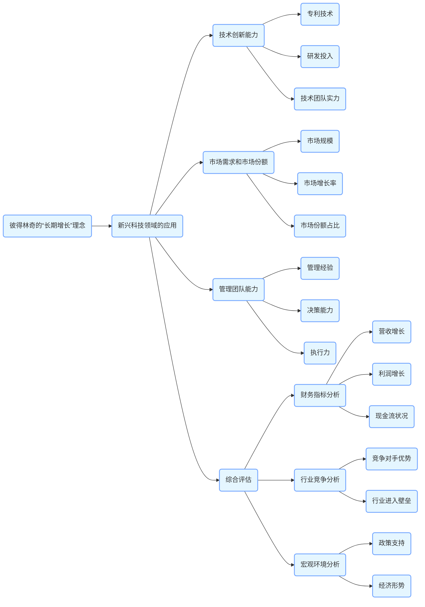

# 彼得林奇的“长期增长”潜力在新兴科技领域的识别方法

> 关键词：彼得林奇、长期增长、新兴科技领域、识别方法、投资分析

> 摘要：本文旨在探讨如何运用彼得林奇的投资理念来识别新兴科技领域的长期增长潜力。彼得林奇以其卓越的投资业绩和独特的投资方法闻名于世，他强调从基本面出发，关注公司的实际业务和长期发展前景。在新兴科技领域，由于其快速变化和高不确定性，准确识别具有长期增长潜力的公司尤为重要。文章将详细介绍相关核心概念、算法原理、数学模型，并结合实际案例进行分析，同时提供实用的工具和资源推荐，最后对未来发展趋势与挑战进行总结。

## 1. 背景介绍 
### 1.1 目的和范围
本文的主要目的是深入研究并阐述如何将彼得林奇的“长期增长”投资理念应用于新兴科技领域。通过系统地分析和总结相关方法，帮助投资者、分析师以及对新兴科技投资感兴趣的人士更好地识别该领域中具有长期增长潜力的公司和项目。范围涵盖新兴科技的多个领域，如人工智能、生物技术、新能源、区块链等，并结合彼得林奇的投资原则和现代投资分析方法进行探讨。

### 1.2 预期读者
预期读者包括专业投资者、金融分析师、科技行业从业者、投资爱好者以及对新兴科技领域投资有兴趣的学生和研究人员。这些读者希望通过本文了解如何运用彼得林奇的思想来评估新兴科技公司的长期增长潜力，从而做出更明智的投资决策。

### 1.3 文档结构概述
本文将首先介绍核心概念与联系，明确彼得林奇“长期增长”理念以及新兴科技领域的相关定义和关系。接着阐述核心算法原理和具体操作步骤，结合Python代码进行详细说明。然后引入数学模型和公式，并通过举例进行详细讲解。之后通过项目实战，展示代码实际案例并进行详细解释。再探讨实际应用场景，说明该识别方法在不同情况下的应用。随后推荐相关的工具和资源，包括学习资源、开发工具框架和论文著作等。最后进行总结，分析未来发展趋势与挑战，并提供常见问题解答和扩展阅读参考资料。

### 1.4 术语表
#### 1.4.1 核心术语定义
- **彼得林奇的“长期增长”理念**：彼得林奇认为，投资者应关注那些具有持续增长潜力的公司，通过深入研究公司的基本面、业务模式、市场竞争力等因素，寻找能够在较长时间内实现业绩增长和股价上升的投资机会。
- **新兴科技领域**：指那些处于快速发展阶段、具有创新性和高增长潜力的科技行业，如人工智能、生物技术、新能源、区块链等。这些领域通常伴随着新技术的不断涌现和应用，对传统产业产生深远影响。
- **长期增长潜力**：指公司或项目在未来较长时间内（通常为数年甚至数十年）具有持续增长的可能性，包括营收、利润、市场份额等方面的增长。

#### 1.4.2 相关概念解释
- **基本面分析**：通过研究公司的财务报表、业务模式、管理团队、市场竞争力等基本因素，评估公司的内在价值和发展潜力。
- **成长股投资**：专注于投资那些具有高增长潜力的公司股票，通常这些公司处于快速发展阶段，其业绩增长速度高于市场平均水平。
- **行业生命周期**：新兴科技行业通常经历萌芽期、成长期、成熟期和衰退期四个阶段。不同阶段的行业特点和投资机会有所不同。

#### 1.4.3 缩略词列表
- **AI**：人工智能（Artificial Intelligence）
- **Biotech**：生物技术（Biotechnology）
- **NEV**：新能源汽车（New Energy Vehicle）
- **BTC**：比特币（Bitcoin）

## 2. 核心概念与联系 
### 核心概念原理
彼得林奇的“长期增长”理念核心在于寻找那些具有内在价值和持续增长动力的公司。在新兴科技领域，这一理念同样适用，但需要结合该领域的特点进行调整。新兴科技公司通常具有高创新性、高风险性和快速变化的特点，其增长潜力不仅取决于公司自身的技术实力和业务模式，还受到行业发展趋势、政策环境等因素的影响。

识别新兴科技领域的长期增长潜力需要综合考虑多个方面的因素。首先是技术创新能力，包括公司拥有的专利技术、研发投入、技术团队实力等。技术创新是新兴科技公司发展的核心驱动力，只有具备领先的技术，才能在激烈的市场竞争中脱颖而出。其次是市场需求和市场份额，新兴科技产品或服务必须有足够的市场需求支撑，并且公司能够在市场中占据一定的份额。此外，管理团队的能力和执行力也是关键因素，优秀的管理团队能够有效地组织资源、推动公司发展。

### 架构的文本示意图
```plaintext
彼得林奇的“长期增长”理念
|
|-- 新兴科技领域的应用
|   |
|   |-- 技术创新能力
|   |   |-- 专利技术
|   |   |-- 研发投入
|   |   |-- 技术团队实力
|   |
|   |-- 市场需求和市场份额
|   |   |-- 市场规模
|   |   |-- 市场增长率
|   |   |-- 市场份额占比
|   |
|   |-- 管理团队能力
|   |   |-- 管理经验
|   |   |-- 决策能力
|   |   |-- 执行力
|
|-- 综合评估
|   |
|   |-- 财务指标分析
|   |   |-- 营收增长
|   |   |-- 利润增长
|   |   |-- 现金流状况
|   |
|   |-- 行业竞争分析
|   |   |-- 竞争对手优势
|   |   |-- 行业进入壁垒
|   |
|   |-- 宏观环境分析
|   |   |-- 政策支持
|   |   |-- 经济形势
```

### Mermaid 流程图


## 3. 核心算法原理 & 具体操作步骤 
### 核心算法原理
我们可以构建一个基于多因素加权评分的算法来评估新兴科技公司的长期增长潜力。该算法的核心思想是对影响公司长期增长的各个因素进行量化评分，并根据其重要性赋予相应的权重，最后将各因素的评分乘以权重后相加，得到公司的综合评分。综合评分越高，说明公司的长期增长潜力越大。

### 具体操作步骤
1. **确定评估因素和权重**：根据彼得林奇的“长期增长”理念和新兴科技领域的特点，确定评估因素，如技术创新能力、市场需求和市场份额、管理团队能力等，并为每个因素赋予相应的权重。例如，技术创新能力权重为 0.3，市场需求和市场份额权重为 0.3，管理团队能力权重为 0.2，财务指标分析权重为 0.1，行业竞争分析权重为 0.05，宏观环境分析权重为 0.05。
2. **量化评分**：对每个评估因素进行量化评分。例如，对于技术创新能力，可以根据公司的专利数量、研发投入占比、技术团队的学历和经验等指标进行评分；对于市场需求和市场份额，可以根据市场规模、市场增长率、公司的市场份额占比等指标进行评分。评分范围可以设定为 0 - 10 分。
3. **计算综合评分**：将每个评估因素的评分乘以其权重，然后相加得到公司的综合评分。计算公式为：

$$综合评分 = \sum_{i=1}^{n} 因素_i评分 \times 因素_i权重$$

其中，$n$ 为评估因素的数量。

### Python 源代码实现
```python
# 定义评估因素和权重
factors = ['技术创新能力', '市场需求和市场份额', '管理团队能力', '财务指标分析', '行业竞争分析', '宏观环境分析']
weights = [0.3, 0.3, 0.2, 0.1, 0.05, 0.05]

# 定义公司的各因素评分
company_scores = {
    '技术创新能力': 8,
    '市场需求和市场份额': 7,
    '管理团队能力': 7,
    '财务指标分析': 6,
    '行业竞争分析': 5,
    '宏观环境分析': 6
}

# 计算综合评分
total_score = 0
for i in range(len(factors)):
    factor = factors[i]
    weight = weights[i]
    score = company_scores[factor]
    total_score += score * weight

print(f"公司的综合评分为: {total_score}")
```

### 代码解释
- 首先，我们定义了评估因素和对应的权重，存储在 `factors` 和 `weights` 列表中。
- 然后，我们创建了一个字典 `company_scores`，存储了公司在各个评估因素上的评分。
- 最后，我们使用一个循环遍历每个评估因素，将其评分乘以权重并累加到 `total_score` 中，得到公司的综合评分。

## 4. 数学模型和公式 & 详细讲解 & 举例说明 
### 数学模型和公式
如前文所述，我们使用的数学模型是基于多因素加权评分的模型，其公式为：

$$综合评分 = \sum_{i=1}^{n} 因素_i评分 \times 因素_i权重$$

其中，$因素_i评分$ 表示公司在第 $i$ 个评估因素上的评分，$因素_i权重$ 表示第 $i$ 个评估因素的权重，$n$ 为评估因素的数量。

### 详细讲解
该公式的核心思想是将各个评估因素的重要性通过权重进行体现，然后将公司在每个因素上的表现（评分）进行加权求和，得到一个综合的评估结果。权重的确定需要根据具体的行业和投资目标进行调整，一般来说，对于新兴科技领域，技术创新能力和市场需求等因素的权重可能会相对较高。

### 举例说明
假设我们要评估一家人工智能公司的长期增长潜力，评估因素和权重如下：
| 评估因素 | 权重 |
| --- | --- |
| 技术创新能力 | 0.3 |
| 市场需求和市场份额 | 0.3 |
| 管理团队能力 | 0.2 |
| 财务指标分析 | 0.1 |
| 行业竞争分析 | 0.05 |
| 宏观环境分析 | 0.05 |

该公司在各个评估因素上的评分如下：
| 评估因素 | 评分 |
| --- | --- |
| 技术创新能力 | 8 |
| 市场需求和市场份额 | 7 |
| 管理团队能力 | 7 |
| 财务指标分析 | 6 |
| 行业竞争分析 | 5 |
| 宏观环境分析 | 6 |

根据公式计算综合评分：

$$
\begin{align*}
综合评分 &= 8 \times 0.3 + 7 \times 0.3 + 7 \times 0.2 + 6 \times 0.1 + 5 \times 0.05 + 6 \times 0.05 \\
&= 2.4 + 2.1 + 1.4 + 0.6 + 0.25 + 0.3 \\
&= 7.05
\end{align*}
$$

因此，该人工智能公司的综合评分为 7.05 分。通过比较不同公司的综合评分，我们可以初步判断它们的长期增长潜力大小。

## 5. 项目实战：代码实际案例和详细解释说明 
### 5.1  开发环境搭建
为了运行我们的代码，需要搭建以下开发环境：
- **Python 环境**：建议使用 Python 3.7 及以上版本。可以从 Python 官方网站（https://www.python.org/downloads/）下载并安装。
- **开发工具**：推荐使用 PyCharm 或 Jupyter Notebook。PyCharm 是一款功能强大的 Python 集成开发环境，适合大型项目的开发；Jupyter Notebook 则是一个交互式的开发环境，适合进行数据分析和代码演示。

### 5.2  源代码详细实现和代码解读
以下是一个完整的 Python 代码示例，用于评估多个新兴科技公司的长期增长潜力：

```python
# 定义评估因素和权重
factors = ['技术创新能力', '市场需求和市场份额', '管理团队能力', '财务指标分析', '行业竞争分析', '宏观环境分析']
weights = [0.3, 0.3, 0.2, 0.1, 0.05, 0.05]

# 定义多个公司的各因素评分
companies_scores = {
    '公司A': {
        '技术创新能力': 8,
        '市场需求和市场份额': 7,
        '管理团队能力': 7,
        '财务指标分析': 6,
        '行业竞争分析': 5,
        '宏观环境分析': 6
    },
    '公司B': {
        '技术创新能力': 7,
        '市场需求和市场份额': 8,
        '管理团队能力': 6,
        '财务指标分析': 7,
        '行业竞争分析': 6,
        '宏观环境分析': 7
    },
    '公司C': {
        '技术创新能力': 9,
        '市场需求和市场份额': 6,
        '管理团队能力': 8,
        '财务指标分析': 5,
        '行业竞争分析': 4,
        '宏观环境分析': 5
    }
}

# 计算每个公司的综合评分
company_scores = {}
for company, scores in companies_scores.items():
    total_score = 0
    for i in range(len(factors)):
        factor = factors[i]
        weight = weights[i]
        score = scores[factor]
        total_score += score * weight
    company_scores[company] = total_score

# 按综合评分排序
sorted_companies = sorted(company_scores.items(), key=lambda item: item[1], reverse=True)

# 输出结果
for company, score in sorted_companies:
    print(f"{company} 的综合评分为: {score}")
```

### 代码解读与分析
1. **评估因素和权重定义**：首先，我们定义了评估因素和对应的权重，存储在 `factors` 和 `weights` 列表中。这些因素和权重可以根据实际情况进行调整。
2. **公司评分数据**：我们创建了一个字典 `companies_scores`，存储了多个公司在各个评估因素上的评分。每个公司对应一个子字典，包含该公司在各个评估因素上的评分。
3. **计算综合评分**：使用一个循环遍历每个公司，对于每个公司，再遍历每个评估因素，将其评分乘以权重并累加到 `total_score` 中，得到该公司的综合评分。将每个公司的综合评分存储在 `company_scores` 字典中。
4. **排序并输出结果**：使用 `sorted` 函数对 `company_scores` 字典按综合评分进行降序排序，然后输出每个公司的综合评分。

通过这个代码示例，我们可以对多个新兴科技公司的长期增长潜力进行评估和比较，从而为投资决策提供参考。

## 6. 实际应用场景 
### 投资决策
在新兴科技领域进行投资时，投资者可以使用本文介绍的方法来评估不同公司的长期增长潜力。通过综合考虑技术创新能力、市场需求、管理团队等因素，投资者可以筛选出具有较高潜力的公司进行投资。例如，在人工智能领域，投资者可以对多家人工智能公司进行评估，选择综合评分较高的公司进行股票投资或风险投资。

### 行业研究
行业分析师可以使用该方法对新兴科技行业进行研究和分析。通过对行业内多家公司的评估，可以了解行业的整体发展状况和竞争格局，发现行业中的领军企业和潜在的黑马。同时，还可以分析行业发展的趋势和瓶颈，为行业的发展提供建议。

### 企业战略规划
新兴科技公司自身也可以使用该方法进行自我评估和战略规划。通过对自身在各个评估因素上的表现进行分析，公司可以发现自身的优势和不足，制定相应的发展战略。例如，如果公司在技术创新能力方面得分较低，可以加大研发投入，提升技术水平；如果在市场份额方面存在不足，可以加强市场营销和拓展渠道。

## 7. 工具和资源推荐
### 7.1 学习资源推荐
#### 7.1.1 书籍推荐
- 《彼得林奇的成功投资》：彼得林奇的经典著作，详细介绍了他的投资理念和方法，对于理解“长期增长”投资理念具有重要的参考价值。
- 《聪明的投资者》：本杰明·格雷厄姆的经典投资书籍，强调价值投资和基本面分析，对投资新兴科技领域也有一定的指导意义。
- 《创新者的窘境》：克莱顿·克里斯坦森的著作，探讨了新兴技术对传统企业的冲击和机遇，对于理解新兴科技行业的发展规律有很大帮助。

#### 7.1.2 在线课程
- Coursera 上的“投资学原理”课程：由知名教授授课，系统介绍了投资学的基本原理和方法，包括基本面分析、技术分析等内容。
- edX 上的“人工智能投资”课程：专门针对人工智能领域的投资进行讲解，介绍了人工智能技术的发展趋势和投资机会。

#### 7.1.3 技术博客和网站
- Seeking Alpha：一个知名的金融投资博客网站，提供了大量关于新兴科技领域的投资分析和研究报告。
- TechCrunch：专注于科技行业的新闻和分析网站，及时报道新兴科技领域的最新动态和发展趋势。

### 7.2 开发工具框架推荐
#### 7.2.1 IDE和编辑器
- PyCharm：功能强大的 Python 集成开发环境，提供了代码编辑、调试、版本控制等一系列功能，适合开发大型的 Python 项目。
- Jupyter Notebook：交互式的开发环境，支持 Python、R 等多种编程语言，适合进行数据分析和代码演示。

#### 7.2.2 调试和性能分析工具
- Py-Spy：一个轻量级的 Python 性能分析工具，可以帮助开发者找出 Python 代码中的性能瓶颈。
- pdb：Python 内置的调试器，可以在代码中设置断点，逐行调试代码，方便查找和解决问题。

#### 7.2.3 相关框架和库
- Pandas：用于数据处理和分析的 Python 库，提供了高效的数据结构和数据操作方法，适合处理和分析新兴科技公司的财务数据和市场数据。
- Scikit-learn：用于机器学习的 Python 库，提供了丰富的机器学习算法和工具，可用于构建预测模型和评估公司的增长潜力。

### 7.3 相关论文著作推荐
#### 7.3.1 经典论文
- “The Capital Asset Pricing Model: Theory and Evidence”：介绍了资本资产定价模型（CAPM），是现代投资理论的重要基础。
- “Efficient Capital Markets: A Review of Theory and Empirical Work”：探讨了有效市场假说，对于理解股票市场的效率和投资策略有重要意义。

#### 7.3.2 最新研究成果
- 关注顶级学术期刊如《Journal of Financial Economics》、《Review of Financial Studies》等，这些期刊经常发表关于新兴科技领域投资和金融市场的最新研究成果。

#### 7.3.3 应用案例分析
- 可以参考一些知名投资机构的研究报告和案例分析，如高盛、摩根士丹利等，了解它们在新兴科技领域的投资策略和实践经验。

## 8. 总结：未来发展趋势与挑战
### 未来发展趋势
- **技术融合加速**：未来新兴科技领域将呈现出更加明显的技术融合趋势，如人工智能与生物技术、新能源与物联网等的融合。这种融合将创造出更多的创新机会和商业模式，也为具有跨领域技术能力的公司带来更大的发展空间。
- **行业集中度提高**：随着市场竞争的加剧，新兴科技行业的集中度将逐渐提高。一些具有技术优势、市场优势和资金优势的大型公司将占据更大的市场份额，而小型公司则需要通过创新和差异化竞争来生存和发展。
- **政策支持力度加大**：由于新兴科技领域对国家经济发展和竞争力的重要性，各国政府将加大对该领域的政策支持力度，包括资金投入、税收优惠、人才培养等方面。这将为新兴科技公司的发展提供更加有利的政策环境。

### 挑战
- **技术更新换代快**：新兴科技领域的技术更新换代速度非常快，公司需要不断投入大量的研发资源来保持技术领先。如果公司不能及时跟上技术发展的步伐，就可能面临被市场淘汰的风险。
- **市场不确定性高**：新兴科技产品和服务的市场需求具有较高的不确定性，消费者对新产品的接受程度和市场规模难以准确预测。此外，行业竞争格局也容易受到技术创新和政策变化的影响，增加了市场的不确定性。
- **人才竞争激烈**：新兴科技领域的发展需要大量的高素质人才，如技术研发人才、管理人才、市场营销人才等。然而，目前该领域的人才供给相对不足，导致人才竞争非常激烈。公司需要通过提供优厚的待遇和良好的发展空间来吸引和留住人才。

## 9. 附录：常见问题与解答
### 问题 1：如何确定评估因素的权重？
评估因素的权重需要根据具体的行业和投资目标进行调整。一般来说，可以通过以下方法确定权重：
- **专家意见法**：咨询行业专家、投资专家等，听取他们的意见和建议，确定各评估因素的相对重要性。
- **历史数据分析法**：分析历史上成功和失败的新兴科技公司案例，找出影响公司长期增长的关键因素，并根据这些因素在案例中的表现确定权重。
- **主观判断法**：投资者根据自己的经验和判断，对各评估因素的重要性进行主观赋值。

### 问题 2：评分的准确性如何保证？
评分的准确性主要依赖于数据的准确性和评估标准的合理性。为了保证评分的准确性，可以采取以下措施：
- **收集可靠的数据**：尽可能收集准确、全面的数据，如公司的财务报表、市场调研数据、技术专利信息等。
- **制定合理的评估标准**：根据行业特点和公司实际情况，制定合理的评估标准，确保评分的客观性和可比性。
- **多维度评估**：从多个角度对公司进行评估，避免单一因素的片面性。例如，对于技术创新能力，可以从专利数量、研发投入、技术团队实力等多个方面进行评估。

### 问题 3：该方法是否适用于所有新兴科技领域？
该方法的基本原理适用于大多数新兴科技领域，但在具体应用时需要根据不同领域的特点进行调整。例如，在人工智能领域，技术创新能力和数据资源可能更为重要；而在新能源领域，政策支持和市场需求则可能是关键因素。因此，在应用该方法时，需要结合具体领域的特点，对评估因素和权重进行适当的调整。

## 10. 扩展阅读 & 参考资料
- 《金融市场与金融机构》，弗雷德里克·S·米什金著
- 《投资中最简单的事》，邱国鹭著
- “The Future of Artificial Intelligence in Finance”，发表于《Journal of Financial Technology》
- 各新兴科技公司的官方网站和财务报表
- 各大金融媒体和研究机构的相关报道和研究报告

作者：AI天才研究院/AI Genius Institute & 禅与计算机程序设计艺术 /Zen And The Art of Computer Programming