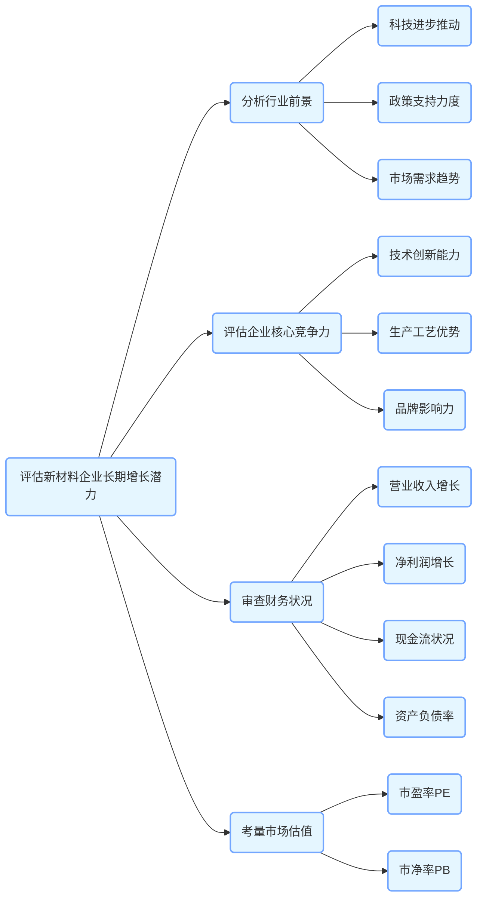

# 彼得林奇的"长期增长"潜力在新材料行业的识别方法

> 关键词：彼得林奇、长期增长潜力、新材料行业、识别方法、投资分析

> 摘要：本文旨在探讨如何运用彼得林奇的投资理念来识别新材料行业的长期增长潜力。通过对彼得林奇投资理论的核心概念剖析，结合新材料行业的特点，详细阐述识别该行业长期增长潜力的具体方法。文章涵盖背景介绍、核心概念与联系、核心算法原理及操作步骤、数学模型和公式、项目实战案例、实际应用场景、工具和资源推荐等内容，最后总结未来发展趋势与挑战，并提供常见问题解答和扩展阅读参考资料，为投资者和行业研究者提供全面而深入的指导。

## 1. 背景介绍 
### 1.1 目的和范围
本研究的目的是将彼得林奇著名的投资策略应用于新材料行业，以确定该行业内具有长期增长潜力的企业和投资机会。新材料行业是一个快速发展且充满创新的领域，对全球经济的未来发展具有重要影响。通过识别该行业中的长期增长潜力，投资者可以做出更明智的投资决策，而企业和行业从业者也可以更好地了解自身在市场中的定位和发展方向。本研究的范围涵盖了各种类型的新材料，包括但不限于高性能复合材料、先进半导体材料、新型能源材料等，以及与这些材料相关的生产、研发和应用企业。

### 1.2 预期读者
本文的预期读者包括对新材料行业投资感兴趣的个人投资者、专业投资机构的分析师和基金经理、新材料行业的企业管理者和创业者、以及相关领域的学术研究人员。对于投资者来说，本文提供了一种系统的方法来评估新材料企业的长期增长潜力，帮助他们筛选出有价值的投资标的。企业管理者和创业者可以从本文中了解市场对长期增长潜力的评估标准，从而调整企业的发展战略和经营方向。学术研究人员则可以将本文作为研究新材料行业投资和发展的参考资料。

### 1.3 文档结构概述
本文将按照以下结构进行组织：首先介绍彼得林奇投资理念和新材料行业的背景知识，明确研究的目的和范围。接着阐述识别新材料行业长期增长潜力的核心概念和它们之间的联系，通过文本示意图和Mermaid流程图进行直观展示。然后详细讲解核心算法原理，并给出具体的操作步骤，同时使用Python源代码进行说明。之后介绍相关的数学模型和公式，并通过举例进行详细讲解。在项目实战部分，提供代码实际案例并进行详细的解释说明，包括开发环境搭建、源代码实现和代码解读。随后探讨该识别方法在实际中的应用场景。再推荐一些学习资源、开发工具框架和相关论文著作。最后总结新材料行业长期增长潜力识别的未来发展趋势与挑战，提供常见问题解答和扩展阅读参考资料。

### 1.4 术语表
#### 1.4.1 核心术语定义
- **彼得林奇投资理念**：彼得林奇是美国著名的投资家，他强调通过深入研究公司的基本面、行业前景和市场趋势，寻找具有长期增长潜力的公司进行投资。他主张投资者关注自己熟悉的领域，通过实地调研和对公司业务的了解来做出投资决策。
- **长期增长潜力**：指企业或行业在未来较长一段时间内（通常为5 - 10年或更长）能够持续实现收入、利润和市场份额增长的能力。这种增长潜力通常基于企业的核心竞争力、创新能力、市场需求和行业发展趋势等因素。
- **新材料行业**：指那些具有优异性能和特殊功能，或采用新技术、新工艺制备的新型材料，包括高性能结构材料、先进复合材料、新型功能材料等。新材料行业是高新技术产业的重要基础，对推动经济发展和社会进步具有重要作用。

#### 1.4.2 相关概念解释
- **核心竞争力**：企业在市场竞争中所具有的独特优势，能够使其在产品或服务的质量、成本、创新等方面优于竞争对手。对于新材料企业来说，核心竞争力可能包括先进的研发技术、高效的生产工艺、优质的客户服务等。
- **市场需求**：指消费者或企业对某种产品或服务的需求数量和意愿。在新材料行业中，市场需求受到多种因素的影响，如科技发展、经济增长、政策法规等。了解市场需求对于识别新材料企业的长期增长潜力至关重要。
- **行业生命周期**：指一个行业从诞生、成长、成熟到衰退的整个过程。不同阶段的行业具有不同的特点和发展趋势，投资者需要根据行业所处的生命周期阶段来评估企业的长期增长潜力。

#### 1.4.3 缩略词列表
- **PE**：市盈率（Price - Earnings Ratio），是指股票价格除以每股收益的比率，用于衡量股票的估值水平。
- **ROE**：净资产收益率（Return on Equity），是指净利润与平均股东权益的百分比，反映了股东权益的收益水平。
- **R&D**：研究与开发（Research and Development），指企业为了创新和改进产品或服务而进行的研究和实验活动。

## 2. 核心概念与联系 

### 核心概念原理
彼得林奇的投资理念强调从多个维度评估企业的长期增长潜力，在新材料行业中，这些维度主要包括以下几个核心概念：

- **行业前景**：新材料行业的发展受到科技进步、政策支持和市场需求等因素的影响。具有广阔前景的行业通常意味着企业有更多的发展机会和增长空间。例如，随着新能源汽车的快速发展，对动力电池材料的需求大幅增加，相关的新材料企业就有更大的增长潜力。
- **企业核心竞争力**：包括技术创新能力、生产工艺优势、品牌影响力等。在新材料行业，技术创新是企业保持竞争力的关键。拥有先进研发技术的企业能够不断推出新产品，满足市场需求，从而实现长期增长。例如，某些企业在高性能碳纤维的制备技术上具有独特优势，就能够在市场中占据领先地位。
- **财务状况**：良好的财务状况是企业长期发展的基础。主要指标包括营业收入、净利润、现金流、资产负债率等。稳定增长的营业收入和净利润表明企业的经营状况良好，有足够的资金进行研发和扩张。例如，一家新材料企业连续多年实现营业收入和净利润的两位数增长，说明其具有较强的盈利能力和发展潜力。
- **市场估值**：合理的市场估值是投资的重要考虑因素。常用的估值指标有市盈率（PE）、市净率（PB）等。对于具有长期增长潜力的新材料企业，虽然可能短期内估值较高，但如果其增长速度能够持续，那么高估值也可能是合理的。

### 文本示意图
```plaintext
彼得林奇投资理念在新材料行业的应用
|-- 行业前景
|   |-- 科技进步推动
|   |-- 政策支持力度
|   |-- 市场需求趋势
|-- 企业核心竞争力
|   |-- 技术创新能力
|   |-- 生产工艺优势
|   |-- 品牌影响力
|-- 财务状况
|   |-- 营业收入增长
|   |-- 净利润增长
|   |-- 现金流状况
|   |-- 资产负债率
|-- 市场估值
|   |-- 市盈率（PE）
|   |-- 市净率（PB）
```

### Mermaid流程图


## 3. 核心算法原理 & 具体操作步骤 

### 核心算法原理
我们可以通过构建一个综合评估模型来识别新材料行业的长期增长潜力。该模型将行业前景、企业核心竞争力、财务状况和市场估值等因素进行量化，并赋予不同的权重，最终得到一个综合得分。得分越高，说明企业的长期增长潜力越大。

### 具体操作步骤

#### 步骤1：数据收集
收集新材料企业的相关数据，包括行业数据（如市场规模、增长率、政策信息等）、企业数据（如研发投入、专利数量、营业收入、净利润等）和市场数据（如股票价格、市盈率等）。

#### 步骤2：指标量化
将各个评估因素转化为具体的指标，并进行量化。例如：
- 行业前景：可以用行业的年增长率、政策支持指数等指标来衡量。
- 企业核心竞争力：用研发投入占比、专利数量等指标来衡量。
- 财务状况：用营业收入增长率、净利润增长率、资产负债率等指标来衡量。
- 市场估值：用市盈率、市净率等指标来衡量。

#### 步骤3：权重分配
根据各个因素对企业长期增长潜力的重要程度，分配不同的权重。例如，行业前景的权重可以设为30%，企业核心竞争力的权重设为30%，财务状况的权重设为20%，市场估值的权重设为20%。

#### 步骤4：计算得分
根据量化后的指标和分配的权重，计算每个企业的综合得分。计算公式如下：

$$综合得分 = 行业前景得分 \times 0.3 + 企业核心竞争力得分 \times 0.3 + 财务状况得分 \times 0.2 + 市场估值得分 \times 0.2$$

#### 步骤5：筛选企业
根据综合得分，筛选出得分较高的企业，这些企业具有较大的长期增长潜力。

### Python源代码实现
```python
import pandas as pd

# 定义数据
data = {
    '企业名称': ['企业A', '企业B', '企业C'],
    '行业前景得分': [80, 70, 60],
    '企业核心竞争力得分': [75, 85, 70],
    '财务状况得分': [85, 75, 65],
    '市场估值得分': [70, 80, 75]
}

# 创建DataFrame
df = pd.DataFrame(data)

# 定义权重
weights = {
    '行业前景得分': 0.3,
    '企业核心竞争力得分': 0.3,
    '财务状况得分': 0.2,
    '市场估值得分': 0.2
}

# 计算综合得分
df['综合得分'] = df['行业前景得分'] * weights['行业前景得分'] + \
                 df['企业核心竞争力得分'] * weights['企业核心竞争力得分'] + \
                 df['财务状况得分'] * weights['财务状况得分'] + \
                 df['市场估值得分'] * weights['市场估值得分']

# 按照综合得分降序排序
df = df.sort_values(by='综合得分', ascending=False)

# 输出结果
print(df)
```

### 代码解释
1. 首先，我们使用`pandas`库创建一个包含企业名称和各个评估指标得分的DataFrame。
2. 然后，定义各个评估因素的权重。
3. 接着，根据计算公式计算每个企业的综合得分，并将结果添加到DataFrame中。
4. 最后，按照综合得分降序排序，并输出结果。

## 4. 数学模型和公式 & 详细讲解 & 举例说明 

### 数学模型和公式
#### 综合评估模型
$$S = \sum_{i=1}^{n} w_i \times x_i$$

其中，$S$ 表示综合得分，$w_i$ 表示第 $i$ 个评估因素的权重，$x_i$ 表示第 $i$ 个评估因素的得分，$n$ 表示评估因素的数量。

#### 指标得分计算
不同的评估指标可以根据具体情况采用不同的计算方法。例如：

- **营业收入增长率**：
$$营业收入增长率 = \frac{本期营业收入 - 上期营业收入}{上期营业收入} \times 100\%$$

- **净利润增长率**：
$$净利润增长率 = \frac{本期净利润 - 上期净利润}{上期净利润} \times 100\%$$

### 详细讲解
综合评估模型通过将各个评估因素的得分乘以相应的权重，然后求和得到综合得分。权重的分配反映了各个因素对企业长期增长潜力的重要程度。指标得分的计算则根据具体的指标含义进行，如营业收入增长率和净利润增长率可以直观地反映企业的经营增长情况。

### 举例说明
假设我们要评估一家新材料企业的长期增长潜力，具体数据如下：

| 评估因素 | 权重 | 得分 |
| ---- | ---- | ---- |
| 行业前景 | 0.3 | 80 |
| 企业核心竞争力 | 0.3 | 75 |
| 财务状况 | 0.2 | 85 |
| 市场估值 | 0.2 | 70 |

根据综合评估模型，该企业的综合得分计算如下：

$$S = 0.3 \times 80 + 0.3 \times 75 + 0.2 \times 85 + 0.2 \times 70$$
$$S = 24 + 22.5 + 17 + 14$$
$$S = 77.5$$

这表明该企业具有一定的长期增长潜力，综合得分越高，潜力越大。

## 5. 项目实战：代码实际案例和详细解释说明 

### 5.1  开发环境搭建
#### 安装Python
首先，需要安装Python编程语言。可以从Python官方网站（https://www.python.org/downloads/）下载适合自己操作系统的Python版本，并按照安装向导进行安装。

#### 安装必要的库
在项目中，我们使用了`pandas`库进行数据处理。可以使用以下命令安装`pandas`：
```sh
pip install pandas
```

### 5.2  源代码详细实现和代码解读
```python
import pandas as pd

# 模拟收集到的新材料企业数据
data = {
    '企业名称': ['新材料企业1', '新材料企业2', '新材料企业3'],
    '行业前景得分': [85, 70, 65],
    '企业核心竞争力得分': [78, 82, 70],
    '财务状况得分': [82, 75, 68],
    '市场估值得分': [72, 78, 70]
}

# 创建DataFrame对象
df = pd.DataFrame(data)

# 定义各个评估因素的权重
weights = {
    '行业前景得分': 0.3,
    '企业核心竞争力得分': 0.3,
    '财务状况得分': 0.2,
    '市场估值得分': 0.2
}

# 计算综合得分
df['综合得分'] = df['行业前景得分'] * weights['行业前景得分'] + \
                 df['企业核心竞争力得分'] * weights['企业核心竞争力得分'] + \
                 df['财务状况得分'] * weights['财务状况得分'] + \
                 df['市场估值得分'] * weights['市场估值得分']

# 按照综合得分降序排序
df = df.sort_values(by='综合得分', ascending=False)

# 输出排名结果
print("新材料企业长期增长潜力排名：")
print(df[['企业名称', '综合得分']])
```

### 代码解读与分析
1. **数据模拟**：使用字典`data`模拟收集到的新材料企业数据，包括企业名称和各个评估指标的得分。
2. **创建DataFrame**：使用`pandas`的`DataFrame`函数将字典数据转换为DataFrame对象，方便进行数据处理和分析。
3. **定义权重**：使用字典`weights`定义各个评估因素的权重，反映了它们在综合评估中的重要程度。
4. **计算综合得分**：通过对每个企业的各个评估指标得分乘以相应的权重并求和，计算出综合得分，并将结果添加到DataFrame中。
5. **排序和输出**：使用`sort_values`方法按照综合得分降序排序，然后输出企业名称和综合得分，得到新材料企业长期增长潜力的排名结果。

## 6. 实际应用场景 
### 投资者决策
个人投资者和专业投资机构可以使用该识别方法来筛选具有长期增长潜力的新材料企业进行投资。通过对企业的综合评估，投资者可以更准确地判断企业的价值和发展前景，从而做出更明智的投资决策。例如，投资者可以根据综合得分选择得分较高的企业进行长期投资，以获取更高的回报。

### 企业战略规划
新材料企业自身可以运用该方法进行自我评估，了解自己在行业中的地位和优势，发现存在的问题和不足。企业可以根据评估结果调整战略规划，加大在研发、市场拓展等方面的投入，提升自身的核心竞争力和长期增长潜力。例如，如果企业在行业前景方面得分较高，但在市场估值方面得分较低，可能需要加强品牌建设和市场推广，提高市场对企业的认可度。

### 行业研究和分析
行业研究机构和分析师可以使用该方法对新材料行业进行全面的研究和分析。通过对大量企业的评估和比较，了解行业的整体发展趋势和竞争格局，为行业政策制定、产业升级等提供参考依据。例如，研究机构可以根据评估结果分析哪些细分领域具有更大的发展潜力，为政府部门制定相关政策提供建议。

## 7. 工具和资源推荐
### 7.1 学习资源推荐
#### 7.1.1 书籍推荐
- 《彼得·林奇的成功投资》：彼得·林奇的经典著作，详细介绍了他的投资理念和方法，对于理解如何识别企业的长期增长潜力具有重要的指导意义。
- 《聪明的投资者》：本杰明·格雷厄姆的投资经典，强调了价值投资的重要性，为投资者提供了基本的投资原则和方法。
- 《新材料概论》：系统介绍了新材料的分类、性能、制备方法和应用领域，有助于读者了解新材料行业的基本知识。

#### 7.1.2 在线课程
- Coursera上的“投资学原理”课程：由知名高校的教授授课，涵盖了投资的基本理论和方法，包括如何评估企业的价值和增长潜力。
- edX上的“新材料技术前沿”课程：介绍了新材料领域的最新研究成果和发展趋势，帮助学员了解行业的前沿动态。

#### 7.1.3 技术博客和网站
- 雪球网：国内知名的投资交流社区，有大量关于股票投资和行业分析的文章和讨论，投资者可以在这里获取新材料行业的相关信息和投资建议。
- 新材料在线：专注于新材料行业的资讯平台，提供行业新闻、技术动态、企业信息等内容，是了解新材料行业的重要渠道。

### 7.2 开发工具框架推荐
#### 7.2.1 IDE和编辑器
- PyCharm：一款专业的Python集成开发环境，具有代码编辑、调试、版本控制等功能，适合进行Python数据分析和开发。
- Jupyter Notebook：一个交互式的开发环境，支持Python等多种编程语言，方便进行数据探索和可视化分析。

#### 7.2.2 调试和性能分析工具
- PDB：Python自带的调试工具，可以帮助开发者定位和解决代码中的问题。
- cProfile：Python的性能分析工具，可以分析代码的运行时间和函数调用情况，帮助开发者优化代码性能。

#### 7.2.3 相关框架和库
- Pandas：用于数据处理和分析的Python库，提供了高效的数据结构和数据操作方法，方便进行数据清洗、转换和分析。
- NumPy：Python的数值计算库，提供了高效的多维数组对象和数学函数，是进行科学计算和数据分析的基础库。
- Matplotlib：Python的绘图库，可以绘制各种类型的图表，如折线图、柱状图、散点图等，用于数据可视化。

### 7.3 相关论文著作推荐
#### 7.3.1 经典论文
- “The Capital Asset Pricing Model: Theory and Evidence”：该论文介绍了资本资产定价模型（CAPM），是现代投资理论的重要基础，对于理解资产定价和风险评估具有重要意义。
- “Efficient Capital Markets: A Review of Theory and Empirical Work”：有效市场假说的经典论文，探讨了市场效率与投资策略的关系，为投资者提供了理论指导。

#### 7.3.2 最新研究成果
- 关注顶级学术期刊如《Nature Materials》、《Advanced Materials》等，这些期刊发表了新材料领域的最新研究成果和前沿技术，有助于了解行业的发展趋势和创新方向。
- 参加国际学术会议如MRS（Materials Research Society）年会等，与行业内的专家和学者交流，获取最新的研究动态和学术信息。

#### 7.3.3 应用案例分析
- 分析一些成功的新材料企业案例，如特斯拉在动力电池材料方面的创新应用、苹果在新型显示材料方面的技术突破等。通过研究这些案例，了解企业如何通过技术创新和市场策略实现长期增长。

## 8. 总结：未来发展趋势与挑战
### 未来发展趋势
- **技术创新加速**：随着科技的不断进步，新材料行业将迎来更多的技术创新。例如，纳米技术、量子材料等领域的研究将为新材料的开发和应用带来新的突破，推动行业的快速发展。
- **市场需求增长**：新能源、电子信息、航空航天等领域的快速发展将带动对新材料的需求持续增长。例如，随着新能源汽车的普及，对高性能动力电池材料的需求将大幅增加。
- **产业整合加剧**：为了提高市场竞争力和规模效益，新材料行业将出现更多的企业并购和产业整合。大型企业将通过整合资源、优化产业链来提升自身的实力。

### 挑战
- **技术研发难度大**：新材料的研发需要大量的资金和时间投入，而且技术难度较高。一些关键材料的制备技术仍然掌握在少数国家和企业手中，我国在部分领域还存在技术瓶颈。
- **市场竞争激烈**：随着新材料行业的发展，市场竞争将日益激烈。企业需要不断提升自身的核心竞争力，降低成本，提高产品质量，以在市场中占据一席之地。
- **政策不确定性**：新材料行业的发展受到政策的影响较大。政策的变化可能会对企业的生产经营和市场需求产生不确定性，增加企业的经营风险。

## 9. 附录：常见问题与解答
### 问题1：如何确定各个评估因素的权重？
答：评估因素的权重可以根据个人的投资理念、行业特点和市场情况进行调整。一般来说，可以通过专家咨询、历史数据分析和经验判断等方法来确定权重。例如，如果认为行业前景对企业的长期增长潜力影响较大，可以适当提高行业前景的权重。

### 问题2：综合得分的计算是否考虑了指标之间的相关性？
答：在本模型中，综合得分的计算没有考虑指标之间的相关性。在实际应用中，如果指标之间存在较强的相关性，可以采用主成分分析等方法进行降维处理，以消除相关性的影响。

### 问题3：该识别方法是否适用于所有类型的新材料企业？
答：该识别方法具有一定的通用性，但不同类型的新材料企业可能具有不同的特点和发展规律。在应用该方法时，需要根据企业的具体情况进行适当的调整和补充，以提高评估的准确性。

## 10. 扩展阅读 & 参考资料
### 扩展阅读
- 《创新者的窘境》：探讨了企业在面对技术创新和市场变革时的困境和应对策略，对于理解新材料企业的发展具有一定的启示作用。
- 《从0到1》：介绍了创业公司如何从无到有地创造价值，对于新材料行业的创业者和投资者具有参考价值。

### 参考资料
- 彼得·林奇. 《彼得·林奇的成功投资》. 机械工业出版社.
- 本杰明·格雷厄姆. 《聪明的投资者》. 人民邮电出版社.
- 相关学术期刊和研究报告，如《Nature Materials》、《Advanced Materials》等。

作者：AI天才研究院/AI Genius Institute & 禅与计算机程序设计艺术 /Zen And The Art of Computer Programming