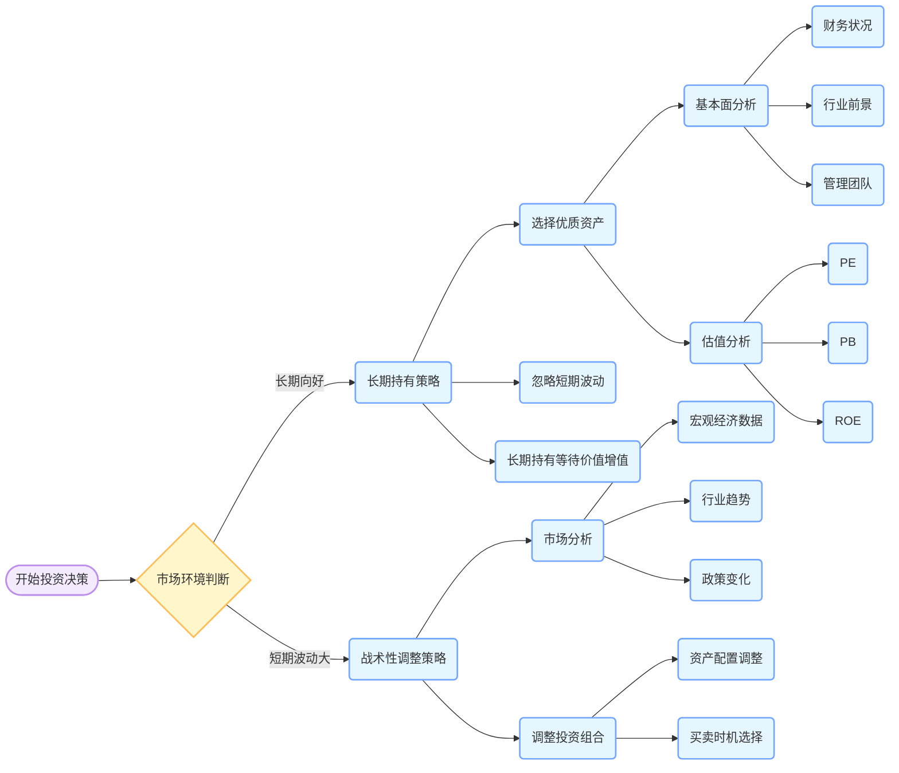

# 彼得林奇的"长期持有"vs"战术性调整"的决策框架

> 关键词：彼得林奇、长期持有、战术性调整、决策框架、投资策略

> 摘要：本文围绕彼得林奇的“长期持有”与“战术性调整”两种投资策略展开深入探讨，构建了相应的决策框架。详细分析了两种策略的核心概念、算法原理、数学模型，通过实际案例展示如何在投资中运用这些策略进行决策。同时介绍了相关的学习资源、开发工具以及论文著作，最后对未来投资策略的发展趋势与挑战进行总结，并解答常见问题。

## 1. 背景介绍 
### 1.1 目的和范围
彼得林奇是投资界的传奇人物，他的投资理念和策略对全球投资者产生了深远影响。“长期持有”和“战术性调整”是其投资策略中的两个重要方面，但在实际应用中，投资者往往难以抉择。本文旨在构建一个决策框架，帮助投资者根据不同的市场环境、投资目标和资产状况，合理选择“长期持有”或“战术性调整”策略，以实现投资收益的最大化。本文的范围涵盖了对两种策略的理论分析、实际案例研究以及相关工具和资源的推荐。

### 1.2 预期读者
本文预期读者为广大投资者，包括个人投资者、机构投资者以及对投资领域感兴趣的研究人员。无论是初涉投资领域的新手，还是经验丰富的专业投资者，都能从本文中获取有价值的信息，提升自己的投资决策能力。

### 1.3 文档结构概述
本文将按照以下结构展开：首先介绍相关的核心概念和它们之间的联系，包括“长期持有”和“战术性调整”的原理和架构；接着阐述核心算法原理和具体操作步骤，并使用Python代码进行详细说明；然后给出数学模型和公式，并结合具体例子进行讲解；通过项目实战，展示代码实际案例并进行详细解释；分析实际应用场景；推荐相关的工具和资源；总结未来发展趋势与挑战；提供常见问题解答；最后列出扩展阅读和参考资料。

### 1.4 术语表
#### 1.4.1 核心术语定义
- **长期持有**：指投资者在买入资产后，长期保留该资产，不轻易因短期市场波动而卖出，相信资产的价值会随着时间的推移而增长。
- **战术性调整**：投资者根据市场短期变化、宏观经济形势、行业动态等因素，对投资组合进行适时的调整，以获取更好的投资回报或降低风险。
- **决策框架**：一套系统的方法和原则，用于帮助投资者在“长期持有”和“战术性调整”之间做出合理的决策。

#### 1.4.2 相关概念解释
- **基本面分析**：通过对公司的财务状况、行业前景、管理团队等基本面因素进行分析，评估公司的内在价值。
- **技术分析**：通过研究市场的历史价格和交易量等数据，预测市场未来的走势。
- **投资组合**：投资者持有的多种资产的集合，旨在通过分散投资降低风险。

#### 1.4.3 缩略词列表
- **PE**：市盈率（Price-to-Earnings Ratio），衡量股票估值的常用指标。
- **PB**：市净率（Price-to-Book Ratio），反映股票价格与每股净资产的比率。
- **ROE**：净资产收益率（Return on Equity），衡量公司盈利能力的重要指标。

## 2. 核心概念与联系 

### 2.1 “长期持有”策略原理
“长期持有”策略的核心思想是基于对优质资产的深入研究和价值判断，相信这些资产在长期内会随着经济的增长和公司的发展而实现价值增值。该策略忽略短期市场波动，注重资产的长期投资价值。例如，一些具有强大品牌、稳定现金流和持续创新能力的公司，其股票在长期内往往能够给投资者带来丰厚的回报。

### 2.2 “战术性调整”策略原理
“战术性调整”策略则强调根据市场的短期变化灵活调整投资组合。投资者通过对宏观经济数据、行业趋势、政策变化等因素的分析，判断市场的短期走势，适时买入或卖出资产。例如，当市场出现明显的下跌趋势时，投资者可以减少股票持仓，增加债券等防御性资产的配置；当某个行业出现利好消息时，加大对该行业相关资产的投资。

### 2.3 两种策略的联系
“长期持有”和“战术性调整”并不是相互排斥的，而是可以相互补充的。在长期投资的过程中，适时的战术性调整可以帮助投资者降低风险、提高收益。例如，在市场处于牛市时，投资者可以坚持长期持有优质资产；而当市场出现泡沫或系统性风险时，进行适当的战术性调整，如减仓或调整资产配置比例，可以避免损失。反之，战术性调整也需要建立在对资产长期价值的判断基础上，不能仅仅因为短期市场波动而盲目买卖。

### 2.4 核心概念架构的文本示意图
```plaintext
投资决策
├── 长期持有
│   ├── 选择优质资产
│   │   ├── 基本面分析
│   │   │   ├── 财务状况
│   │   │   ├── 行业前景
│   │   │   ├── 管理团队
│   │   ├── 估值分析
│   │   │   ├── PE
│   │   │   ├── PB
│   │   │   ├── ROE
│   ├── 忽略短期波动
│   ├── 长期持有等待价值增值
├── 战术性调整
│   ├── 市场分析
│   │   ├── 宏观经济数据
│   │   ├── 行业趋势
│   │   ├── 政策变化
│   ├── 调整投资组合
│   │   ├── 资产配置调整
│   │   ├── 买卖时机选择
```

### 2.5 Mermaid 流程图


## 3. 核心算法原理 & 具体操作步骤 

### 3.1 算法原理
#### 3.1.1 长期持有策略算法原理
长期持有策略的核心是选择具有长期投资价值的资产，并在持有过程中忽略短期市场波动。其算法原理可以概括为以下几个步骤：
1. **数据收集**：收集目标资产的基本面数据，包括财务报表、行业报告、公司公告等。
2. **基本面分析**：对收集到的数据进行分析，评估公司的盈利能力、偿债能力、成长潜力等。常用的指标包括PE、PB、ROE等。
3. **估值判断**：根据基本面分析的结果，结合市场情况，判断资产的估值是否合理。如果估值合理且公司具有长期竞争优势，则可以考虑买入并长期持有。
4. **持有监控**：在持有过程中，定期对公司的基本面进行跟踪和评估，确保公司的经营状况没有发生重大变化。如果公司的基本面依然良好，则继续持有；如果出现问题，则需要重新评估投资决策。

#### 3.1.2 战术性调整策略算法原理
战术性调整策略的核心是根据市场的短期变化及时调整投资组合。其算法原理可以概括为以下几个步骤：
1. **数据收集**：收集宏观经济数据、行业数据、政策信息等，以及市场的历史价格和交易量数据。
2. **市场分析**：运用基本面分析和技术分析方法，对市场的短期走势进行预测。基本面分析主要关注宏观经济形势、行业发展趋势等因素；技术分析则通过研究市场的历史价格和交易量数据，寻找市场的趋势和规律。
3. **决策制定**：根据市场分析的结果，制定相应的投资策略。如果预测市场将上涨，则可以增加股票等风险资产的配置；如果预测市场将下跌，则可以减少股票持仓，增加债券等防御性资产的配置。
4. **执行与监控**：按照制定的投资策略进行操作，并实时监控市场的变化。如果市场情况发生变化，需要及时调整投资策略。

### 3.2 具体操作步骤
#### 3.2.1 长期持有策略操作步骤
```python
import pandas as pd
import numpy as np

# 步骤1：数据收集
def collect_fundamental_data(ticker):
    # 这里假设从数据库或API获取数据
    # 实际应用中需要根据具体情况实现
    # 示例数据
    data = {
        'PE': [20, 22, 21],
        'PB': [2.5, 2.6, 2.4],
        'ROE': [0.15, 0.16, 0.17]
    }
    df = pd.DataFrame(data)
    return df

# 步骤2：基本面分析
def fundamental_analysis(df):
    avg_pe = np.mean(df['PE'])
    avg_pb = np.mean(df['PB'])
    avg_roe = np.mean(df['ROE'])
    print(f"平均PE: {avg_pe}")
    print(f"平均PB: {avg_pb}")
    print(f"平均ROE: {avg_roe}")
    return avg_pe, avg_pb, avg_roe

# 步骤3：估值判断
def valuation_judgment(avg_pe, avg_pb, avg_roe):
    # 假设合理PE范围为15-25，合理PB范围为2-3，合理ROE大于0.1
    if 15 <= avg_pe <= 25 and 2 <= avg_pb <= 3 and avg_roe > 0.1:
        print("估值合理，可以考虑长期持有")
        return True
    else:
        print("估值不合理，不建议长期持有")
        return False

# 步骤4：持有监控
def holding_monitoring(ticker):
    # 定期收集新的基本面数据进行评估
    new_df = collect_fundamental_data(ticker)
    new_avg_pe, new_avg_pb, new_avg_roe = fundamental_analysis(new_df)
    if valuation_judgment(new_avg_pe, new_avg_pb, new_avg_roe):
        print("公司基本面依然良好，继续持有")
    else:
        print("公司基本面出现问题，重新评估投资决策")

# 示例使用
ticker = 'ABC'
df = collect_fundamental_data(ticker)
avg_pe, avg_pb, avg_roe = fundamental_analysis(df)
if valuation_judgment(avg_pe, avg_pb, avg_roe):
    holding_monitoring(ticker)
```

#### 3.2.2 战术性调整策略操作步骤
```python
import pandas as pd
import numpy as np
import matplotlib.pyplot as plt
from sklearn.linear_model import LinearRegression

# 步骤1：数据收集
def collect_market_data():
    # 这里假设从数据库或API获取数据
    # 实际应用中需要根据具体情况实现
    # 示例数据
    data = {
        'Date': pd.date_range(start='2020-01-01', periods=100, freq='D'),
        'Price': np.random.randn(100).cumsum() + 100
    }
    df = pd.DataFrame(data)
    df.set_index('Date', inplace=True)
    return df

# 步骤2：市场分析
def market_analysis(df):
    # 简单的线性回归预测
    X = np.array(range(len(df))).reshape(-1, 1)
    y = df['Price'].values
    model = LinearRegression()
    model.fit(X, y)
    last_date_index = len(df)
    next_date_index = last_date_index + 1
    predicted_price = model.predict([[next_date_index]])
    if predicted_price > df['Price'].iloc[-1]:
        print("预测市场将上涨")
        return 'up'
    else:
        print("预测市场将下跌")
        return 'down'

# 步骤3：决策制定
def decision_making(market_trend):
    if market_trend == 'up':
        print("增加股票等风险资产的配置")
        return 'increase_stocks'
    else:
        print("减少股票持仓，增加债券等防御性资产的配置")
        return 'decrease_stocks'

# 步骤4：执行与监控
def execution_and_monitoring(decision):
    # 模拟执行决策
    print(f"执行决策: {decision}")
    # 实时监控市场变化
    new_df = collect_market_data()
    new_trend = market_analysis(new_df)
    new_decision = decision_making(new_trend)
    print(f"市场情况变化，新决策: {new_decision}")

# 示例使用
df = collect_market_data()
market_trend = market_analysis(df)
decision = decision_making(market_trend)
execution_and_monitoring(decision)
```

## 4. 数学模型和公式 & 详细讲解 & 举例说明 

### 4.1 长期持有策略数学模型
#### 4.1.1 市盈率（PE）模型
市盈率是衡量股票估值的常用指标，其计算公式为：
$$PE = \frac{P}{E}$$
其中，$P$ 为股票的当前价格，$E$ 为公司的每股收益。

**详细讲解**：市盈率反映了投资者为获取公司每一元盈利所愿意支付的价格。一般来说，市盈率越低，股票的估值越便宜；市盈率越高，股票的估值越贵。但不同行业的市盈率水平可能存在较大差异，因此在使用市盈率进行估值时，需要与同行业的其他公司进行比较。

**举例说明**：假设某公司的股票当前价格为 $50$ 元，每股收益为 $2$ 元，则该公司的市盈率为：
$$PE = \frac{50}{2} = 25$$
如果同行业的平均市盈率为 $20$，则该公司的股票可能被高估；如果同行业的平均市盈率为 $30$，则该公司的股票可能被低估。

#### 4.1.2 市净率（PB）模型
市净率是反映股票价格与每股净资产的比率，其计算公式为：
$$PB = \frac{P}{B}$$
其中，$P$ 为股票的当前价格，$B$ 为公司的每股净资产。

**详细讲解**：市净率衡量了股票价格相对于公司净资产的倍数。市净率越低，说明股票的价格越接近公司的净资产，投资价值可能越高；市净率越高，说明股票的价格相对于公司的净资产越高，投资风险可能越大。

**举例说明**：假设某公司的股票当前价格为 $30$ 元，每股净资产为 $10$ 元，则该公司的市净率为：
$$PB = \frac{30}{10} = 3$$
如果同行业的平均市净率为 $2$，则该公司的股票可能被高估；如果同行业的平均市净率为 $4$，则该公司的股票可能被低估。

#### 4.1.3 净资产收益率（ROE）模型
净资产收益率是衡量公司盈利能力的重要指标，其计算公式为：
$$ROE = \frac{Net Income}{Shareholders' Equity}$$
其中，$Net Income$ 为公司的净利润，$Shareholders' Equity$ 为公司的股东权益。

**详细讲解**：净资产收益率反映了公司运用自有资本获取收益的能力。ROE 越高，说明公司的盈利能力越强，股东权益的回报越高。

**举例说明**：假设某公司的净利润为 $1000$ 万元，股东权益为 $5000$ 万元，则该公司的净资产收益率为：
$$ROE = \frac{1000}{5000} = 0.2 = 20\%$$
如果同行业的平均 ROE 为 $15\%$，则该公司的盈利能力较强。

### 4.2 战术性调整策略数学模型
#### 4.2.1 线性回归模型
线性回归是一种常用的预测模型，其基本形式为：
$$y = \beta_0 + \beta_1x + \epsilon$$
其中，$y$ 为因变量，$x$ 为自变量，$\beta_0$ 为截距，$\beta_1$ 为斜率，$\epsilon$ 为误差项。

**详细讲解**：在战术性调整策略中，我们可以使用线性回归模型来预测市场的走势。假设我们使用时间作为自变量 $x$，市场价格作为因变量 $y$，通过历史数据拟合线性回归模型，得到 $\beta_0$ 和 $\beta_1$ 的估计值，然后根据这些估计值预测未来的市场价格。

**举例说明**：假设我们收集了过去 $100$ 天的市场价格数据，使用线性回归模型进行拟合，得到 $\beta_0 = 100$，$\beta_1 = 0.5$。如果今天是第 $101$ 天，则预测的市场价格为：
$$y = 100 + 0.5 \times 101 = 150.5$$

## 5. 项目实战：代码实际案例和详细解释说明 

### 5.1  开发环境搭建
#### 5.1.1 安装Python
首先，需要安装 Python 环境。可以从 Python 官方网站（https://www.python.org/downloads/）下载适合自己操作系统的 Python 安装包，并按照安装向导进行安装。

#### 5.1.2 安装必要的库
在命令行中使用以下命令安装必要的库：
```sh
pip install pandas numpy matplotlib scikit-learn
```

### 5.2  源代码详细实现和代码解读
#### 5.2.1 长期持有策略代码实现与解读
```python
import pandas as pd
import numpy as np

# 步骤1：数据收集
def collect_fundamental_data(ticker):
    # 这里假设从数据库或API获取数据
    # 实际应用中需要根据具体情况实现
    # 示例数据
    data = {
        'PE': [20, 22, 21],
        'PB': [2.5, 2.6, 2.4],
        'ROE': [0.15, 0.16, 0.17]
    }
    df = pd.DataFrame(data)
    return df

# 步骤2：基本面分析
def fundamental_analysis(df):
    avg_pe = np.mean(df['PE'])
    avg_pb = np.mean(df['PB'])
    avg_roe = np.mean(df['ROE'])
    print(f"平均PE: {avg_pe}")
    print(f"平均PB: {avg_pb}")
    print(f"平均ROE: {avg_roe}")
    return avg_pe, avg_pb, avg_roe

# 步骤3：估值判断
def valuation_judgment(avg_pe, avg_pb, avg_roe):
    # 假设合理PE范围为15-25，合理PB范围为2-3，合理ROE大于0.1
    if 15 <= avg_pe <= 25 and 2 <= avg_pb <= 3 and avg_roe > 0.1:
        print("估值合理，可以考虑长期持有")
        return True
    else:
        print("估值不合理，不建议长期持有")
        return False

# 步骤4：持有监控
def holding_monitoring(ticker):
    # 定期收集新的基本面数据进行评估
    new_df = collect_fundamental_data(ticker)
    new_avg_pe, new_avg_pb, new_avg_roe = fundamental_analysis(new_df)
    if valuation_judgment(new_avg_pe, new_avg_pb, new_avg_roe):
        print("公司基本面依然良好，继续持有")
    else:
        print("公司基本面出现问题，重新评估投资决策")

# 示例使用
ticker = 'ABC'
df = collect_fundamental_data(ticker)
avg_pe, avg_pb, avg_roe = fundamental_analysis(df)
if valuation_judgment(avg_pe, avg_pb, avg_roe):
    holding_monitoring(ticker)
```
**代码解读**：
- `collect_fundamental_data` 函数：用于收集目标资产的基本面数据。在实际应用中，需要根据具体情况从数据库或 API 获取数据。这里使用示例数据进行演示。
- `fundamental_analysis` 函数：对收集到的基本面数据进行分析，计算平均 PE、PB 和 ROE，并打印结果。
- `valuation_judgment` 函数：根据计算得到的平均 PE、PB 和 ROE，判断资产的估值是否合理。如果合理，则建议长期持有；否则，不建议长期持有。
- `holding_monitoring` 函数：定期收集新的基本面数据，重新进行基本面分析和估值判断。如果公司的基本面依然良好，则继续持有；否则，重新评估投资决策。

#### 5.2.2 战术性调整策略代码实现与解读
```python
import pandas as pd
import numpy as np
import matplotlib.pyplot as plt
from sklearn.linear_model import LinearRegression

# 步骤1：数据收集
def collect_market_data():
    # 这里假设从数据库或API获取数据
    # 实际应用中需要根据具体情况实现
    # 示例数据
    data = {
        'Date': pd.date_range(start='2020-01-01', periods=100, freq='D'),
        'Price': np.random.randn(100).cumsum() + 100
    }
    df = pd.DataFrame(data)
    df.set_index('Date', inplace=True)
    return df

# 步骤2：市场分析
def market_analysis(df):
    # 简单的线性回归预测
    X = np.array(range(len(df))).reshape(-1, 1)
    y = df['Price'].values
    model = LinearRegression()
    model.fit(X, y)
    last_date_index = len(df)
    next_date_index = last_date_index + 1
    predicted_price = model.predict([[next_date_index]])
    if predicted_price > df['Price'].iloc[-1]:
        print("预测市场将上涨")
        return 'up'
    else:
        print("预测市场将下跌")
        return 'down'

# 步骤3：决策制定
def decision_making(market_trend):
    if market_trend == 'up':
        print("增加股票等风险资产的配置")
        return 'increase_stocks'
    else:
        print("减少股票持仓，增加债券等防御性资产的配置")
        return 'decrease_stocks'

# 步骤4：执行与监控
def execution_and_monitoring(decision):
    # 模拟执行决策
    print(f"执行决策: {decision}")
    # 实时监控市场变化
    new_df = collect_market_data()
    new_trend = market_analysis(new_df)
    new_decision = decision_making(new_trend)
    print(f"市场情况变化，新决策: {new_decision}")

# 示例使用
df = collect_market_data()
market_trend = market_analysis(df)
decision = decision_making(market_trend)
execution_and_monitoring(decision)
```
**代码解读**：
- `collect_market_data` 函数：用于收集市场的历史价格数据。在实际应用中，需要根据具体情况从数据库或 API 获取数据。这里使用示例数据进行演示。
- `market_analysis` 函数：使用线性回归模型对市场的走势进行预测。根据预测结果判断市场将上涨还是下跌，并返回相应的趋势信息。
- `decision_making` 函数：根据市场趋势信息制定相应的投资策略。如果市场将上涨，则增加股票等风险资产的配置；如果市场将下跌，则减少股票持仓，增加债券等防御性资产的配置。
- `execution_and_monitoring` 函数：模拟执行决策，并实时监控市场变化。如果市场情况发生变化，重新进行市场分析和决策制定。

### 5.3  代码解读与分析
#### 5.3.1 长期持有策略代码分析
- **优点**：代码结构清晰，将长期持有策略的各个步骤封装成独立的函数，便于理解和维护。通过基本面分析和估值判断，能够筛选出具有长期投资价值的资产。
- **缺点**：示例数据为模拟数据，实际应用中需要从可靠的数据源获取数据。代码中使用的估值标准较为简单，实际应用中需要根据不同行业和市场情况进行调整。

#### 5.3.2 战术性调整策略代码分析
- **优点**：使用线性回归模型进行市场预测，简单易懂。代码实现了市场分析、决策制定和执行监控的完整流程，具有一定的实用性。
- **缺点**：线性回归模型的预测能力有限，实际市场情况可能更加复杂。代码中没有考虑到交易成本和风险控制等因素，实际应用中需要进行完善。

## 6. 实际应用场景 
### 6.1 长期持有策略应用场景
#### 6.1.1 优质蓝筹股投资
对于一些具有强大品牌、稳定现金流和持续创新能力的优质蓝筹股，适合采用长期持有策略。例如，茅台、腾讯等公司，其股票在长期内往往能够给投资者带来丰厚的回报。投资者可以通过深入研究公司的基本面，选择在合理的估值水平买入并长期持有。
#### 6.1.2 指数基金投资
指数基金是一种跟踪特定指数的基金，其投资组合包含了指数中的所有成分股。由于指数基金具有分散投资、成本低等优点，适合长期投资。投资者可以通过定期定额投资的方式，长期持有指数基金，分享市场的长期增长。

### 6.2 战术性调整策略应用场景
#### 6.2.1 宏观经济形势变化
当宏观经济形势发生变化时，如经济衰退、通货膨胀等，市场往往会出现较大的波动。此时，投资者可以采用战术性调整策略，根据宏观经济数据和政策变化，适时调整投资组合。例如，在经济衰退期间，投资者可以减少股票持仓，增加债券等防御性资产的配置；在通货膨胀期间，投资者可以增加黄金、房地产等抗通胀资产的投资。
#### 6.2.2 行业轮动
不同行业在不同的经济周期中表现不同，投资者可以通过研究行业轮动规律，采用战术性调整策略，适时调整投资组合。例如，在经济复苏初期，周期类行业如钢铁、煤炭等往往表现较好；在经济繁荣期，消费类行业如食品饮料、家电等往往表现较好。投资者可以根据行业轮动规律，在不同行业之间进行切换，获取更好的投资回报。

## 7. 工具和资源推荐
### 7.1 学习资源推荐
#### 7.1.1 书籍推荐
- 《彼得林奇的成功投资》：彼得林奇的经典著作，详细介绍了他的投资理念和策略，对于投资者具有很高的参考价值。
- 《聪明的投资者》：本杰明·格雷厄姆的著作，被誉为投资界的圣经，书中阐述了价值投资的基本原理和方法。
- 《金融炼金术》：乔治·索罗斯的著作，介绍了他的反身性理论和投资实践，对于理解市场的复杂性和不确定性具有重要意义。

#### 7.1.2 在线课程
- Coursera 上的“投资学原理”课程：由知名教授授课，系统介绍了投资学的基本原理和方法。
- 网易云课堂上的“股票投资实战教程”：结合实际案例，讲解股票投资的技巧和策略。

#### 7.1.3 技术博客和网站
- 雪球网：国内知名的投资社区，提供丰富的股票分析、投资策略和市场动态等信息。
- 东方财富网：提供全面的金融信息和数据服务，包括股票行情、基金净值、财经新闻等。

### 7.2 开发工具框架推荐
#### 7.2.1 IDE和编辑器
- PyCharm：专业的 Python 集成开发环境，具有代码编辑、调试、自动补全、版本控制等功能。
- Jupyter Notebook：交互式的编程环境，适合进行数据分析和模型开发，支持 Python、R 等多种编程语言。

#### 7.2.2 调试和性能分析工具
- pdb：Python 内置的调试工具，可以帮助开发者定位代码中的错误。
- cProfile：Python 内置的性能分析工具，可以分析代码的运行时间和函数调用情况。

#### 7.2.3 相关框架和库
- pandas：强大的数据分析库，提供了高效的数据结构和数据处理功能。
- numpy：用于科学计算的基础库，提供了高效的数组操作和数学函数。
- scikit-learn：机器学习库，提供了丰富的机器学习算法和工具，如线性回归、逻辑回归、决策树等。

### 7.3 相关论文著作推荐
#### 7.3.1 经典论文
- Eugene F. Fama, Kenneth R. French. "Common Risk Factors in the Returns on Stocks and Bonds". Journal of Financial Economics, 1993. 该论文提出了著名的 Fama-French 三因子模型，对资产定价理论产生了深远影响。
- Robert J. Shiller. "Do Stock Prices Move Too Much to Be Justified by Subsequent Changes in Dividends?". American Economic Review, 1981. 该论文研究了股票价格的波动是否能够由未来股息的变化来解释，对有效市场假说提出了挑战。

#### 7.3.2 最新研究成果
- 关注顶级金融学术期刊，如 Journal of Finance、Review of Financial Studies 等，及时了解投资领域的最新研究成果。

#### 7.3.3 应用案例分析
- 阅读一些知名投资机构的研究报告和案例分析，了解他们在实际投资中如何运用不同的策略和方法。

## 8. 总结：未来发展趋势与挑战
### 8.1 未来发展趋势
#### 8.1.1 量化投资的发展
随着信息技术的不断发展和数据的日益丰富，量化投资将成为未来投资领域的重要发展趋势。量化投资通过运用数学模型和计算机算法，对大量的历史数据进行分析和挖掘，寻找投资机会，实现投资决策的自动化和科学化。
#### 8.1.2 智能化投资顾问的兴起
智能化投资顾问利用人工智能技术，根据投资者的风险偏好、投资目标和资产状况，为投资者提供个性化的投资建议和资产配置方案。智能化投资顾问具有成本低、效率高、个性化等优点，将逐渐成为投资者的重要选择。
#### 8.1.3 绿色投资和社会责任投资的普及
随着社会对环境保护和社会责任的关注度不断提高，绿色投资和社会责任投资将逐渐普及。投资者将更加注重企业的环境、社会和治理（ESG）表现，选择具有良好 ESG 表现的企业进行投资。

### 8.2 挑战
#### 8.2.1 市场的不确定性
市场的不确定性是投资领域面临的最大挑战之一。尽管我们可以运用各种方法和模型对市场进行分析和预测，但市场的走势仍然受到许多不可预测因素的影响，如政治事件、自然灾害、突发事件等。投资者需要具备较强的风险意识和应对能力，以应对市场的不确定性。
#### 8.2.2 数据质量和隐私问题
在量化投资和智能化投资顾问中，数据的质量和隐私问题至关重要。如果数据存在错误或偏差，将影响投资决策的准确性；如果数据泄露，将给投资者带来损失。因此，投资者需要选择可靠的数据来源，并加强数据安全和隐私保护。
#### 8.2.3 技术更新换代快
信息技术的发展日新月异，投资领域的技术也在不断更新换代。投资者需要不断学习和掌握新的技术和方法，以适应市场的变化。同时，技术的应用也需要遵循一定的法律法规和道德规范，避免出现技术滥用和违规行为。

## 9. 附录：常见问题与解答
### 9.1 长期持有策略是否适用于所有股票？
不是。长期持有策略适用于具有长期投资价值的优质股票，如具有强大品牌、稳定现金流和持续创新能力的公司。对于一些业绩不佳、前景不明朗的股票，不适合采用长期持有策略。

### 9.2 战术性调整策略的调整频率应该如何确定？
战术性调整策略的调整频率应该根据市场情况和个人投资目标来确定。如果市场波动较大，调整频率可以适当提高；如果市场相对稳定，调整频率可以适当降低。同时，投资者也需要考虑交易成本和风险控制等因素。

### 9.3 如何判断市场是否处于长期向好或短期波动大的状态？
可以通过分析宏观经济数据、行业趋势、政策变化等因素来判断市场的状态。例如，当宏观经济数据向好、行业前景乐观、政策支持力度大时，市场可能处于长期向好的状态；当宏观经济数据不佳、行业竞争激烈、政策收紧时，市场可能处于短期波动大的状态。此外，也可以运用技术分析方法，如均线系统、相对强弱指标等，来判断市场的走势。

### 9.4 长期持有策略和战术性调整策略可以同时使用吗？
可以。长期持有策略和战术性调整策略并不是相互排斥的，而是可以相互补充的。在长期投资的过程中，适时的战术性调整可以帮助投资者降低风险、提高收益。例如，在市场处于牛市时，投资者可以坚持长期持有优质资产；而当市场出现泡沫或系统性风险时，进行适当的战术性调整，如减仓或调整资产配置比例，可以避免损失。

## 10. 扩展阅读 & 参考资料
- 彼得林奇. 《彼得林奇的成功投资》. 机械工业出版社.
- 本杰明·格雷厄姆. 《聪明的投资者》. 人民邮电出版社.
- 乔治·索罗斯. 《金融炼金术》. 海南出版社.
- Eugene F. Fama, Kenneth R. French. "Common Risk Factors in the Returns on Stocks and Bonds". Journal of Financial Economics, 1993.
- Robert J. Shiller. "Do Stock Prices Move Too Much to Be Justified by Subsequent Changes in Dividends?". American Economic Review, 1981.
- 雪球网. https://xueqiu.com/
- 东方财富网. https://www.eastmoney.com/

作者：AI天才研究院/AI Genius Institute & 禅与计算机程序设计艺术 /Zen And The Art of Computer Programming