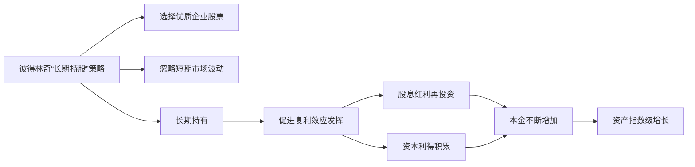

# 彼得林奇的“长期持股”收益复利效应

> 关键词：彼得林奇、长期持股、复利效应、投资收益、股票投资

> 摘要：本文深入探讨了彼得林奇所倡导的“长期持股”策略及其带来的收益复利效应。通过对核心概念的阐释、算法原理的分析、数学模型的构建、项目实战案例的展示、实际应用场景的探讨，以及相关工具和资源的推荐，全面剖析了这一投资理念的原理和实践价值。旨在帮助投资者理解长期持股复利效应的重要性，并为他们在股票投资领域提供有价值的参考和指导。

## 1. 背景介绍 

### 1.1 目的和范围
本文的目的是详细解读彼得林奇“长期持股”收益复利效应这一投资理念。通过系统地分析，帮助投资者理解长期持股的意义、复利效应的原理以及如何在实际投资中运用这一策略来实现资产的增值。范围涵盖了从理论层面的概念阐述、数学模型构建，到实践层面的项目实战案例分析和实际应用场景探讨，同时还会推荐相关的学习资源、开发工具和研究论文。

### 1.2 预期读者
本文预期读者主要包括对股票投资感兴趣的个人投资者，无论是初涉投资领域的新手，还是有一定投资经验但希望深入了解长期投资策略的投资者；也适用于金融专业的学生和研究人员，他们可以从本文中获取关于投资理论和实践的详细资料；此外，对于从事金融投资咨询、理财规划等相关工作的专业人士，本文也能为他们提供有价值的参考和启示。

### 1.3 文档结构概述
本文将按照以下结构进行阐述：首先介绍核心概念与联系，包括彼得林奇“长期持股”策略和复利效应的定义、原理及两者之间的关系，并通过文本示意图和 Mermaid 流程图进行直观展示；接着讲解核心算法原理和具体操作步骤，使用 Python 源代码详细阐述复利计算的过程；然后构建数学模型和公式，对复利效应进行详细讲解并举例说明；再通过项目实战，展示代码实际案例并进行详细解释；之后探讨实际应用场景；推荐相关的工具和资源；最后总结未来发展趋势与挑战，提供常见问题与解答，并列出扩展阅读和参考资料。

### 1.4 术语表

#### 1.4.1 核心术语定义
- **彼得林奇**：美国著名的投资家、基金经理，以其卓越的投资业绩和独特的投资理念而闻名。他管理的富达麦哲伦基金在 13 年间创造了年化收益率 29% 的惊人业绩。
- **长期持股**：指投资者买入股票后，持有较长的时间周期，不被短期的市场波动所影响，旨在分享企业长期发展带来的价值增长。
- **复利效应**：是指在每一个计息期后，将所生利息加入本金再计利息，俗称“利滚利”。随着时间的推移，复利会使资产呈现指数级增长。
- **年化收益率**：把当前收益率（日收益率、周收益率、月收益率）换算成年收益率来计算的，是一种理论收益率，并不是真正的已取得的收益率。

#### 1.4.2 相关概念解释
- **股票投资**：是指企业或个人用积累起来的货币购买股票，借以获得收益的行为。股票投资的收益主要来自于股息红利和资本利得。
- **资产增值**：指通过投资、经营等手段，使资产的价值在原有基础上得到增加。在股票投资中，长期持股和复利效应是实现资产增值的重要方式。

#### 1.4.3 缩略词列表
无

## 2. 核心概念与联系 

### 2.1 彼得林奇的“长期持股”策略
彼得林奇认为，股票市场短期波动是难以预测的，而且充满了各种不确定性和噪音。相比之下，优秀的企业在长期发展过程中，会不断创造价值，其业绩会持续增长，从而推动股价上升。因此，投资者应该选择具有良好基本面、成长潜力大的企业股票，并长期持有，忽略短期的市场波动。

例如，彼得林奇在管理富达麦哲伦基金期间，发掘了许多具有潜力的公司，如克莱斯勒汽车公司。当时克莱斯勒面临困境，但彼得林奇通过深入研究，发现其具有扭亏为盈的潜力，于是大量买入并长期持有。随着公司业绩的改善，股价大幅上涨，为基金带来了丰厚的回报。

### 2.2 复利效应
复利效应是一种强大的数学现象。假设初始投资为 $P$，年利率为 $r$，投资期限为 $n$ 年，每年复利一次，那么 $n$ 年后的本利和 $A$ 可以用公式 $A = P(1 + r)^n$ 表示。

例如，初始投资 10000 元，年利率为 10%，投资期限为 10 年。按照复利计算，10 年后的本利和为 $A = 10000\times(1 + 0.1)^{10} \approx 25937.42$ 元。可以看到，随着时间的推移，复利的效果越来越明显，资产呈现指数级增长。

### 2.3 两者的联系
彼得林奇的“长期持股”策略与复利效应密切相关。长期持股为复利效应的发挥提供了时间基础。通过长期持有优质股票，投资者可以获得企业成长带来的股息红利和资本利得，这些收益会不断加入本金，实现复利增长。例如，一家公司每年的股息率为 5%，同时股价每年上涨 10%，如果投资者长期持有该股票，不仅每年能获得股息收入，而且股价的上涨也会使本金不断增加，从而在复利的作用下，资产实现快速增长。

### 2.4 文本示意图
```plaintext
彼得林奇“长期持股”策略
|
|--选择优质企业股票
|--忽略短期市场波动
|--长期持有
|
|--促进复利效应发挥
|   |
|   |--股息红利再投资
|   |--资本利得积累
|   |--本金不断增加
|   |
|   |--资产指数级增长
```

### 2.5 Mermaid 流程图


## 3. 核心算法原理 & 具体操作步骤 

### 3.1 复利计算的核心算法原理
复利计算的核心是将每一期的利息加入本金，再计算下一期的利息。其基本公式为 $A = P(1 + r)^n$，其中 $A$ 是最终的本利和，$P$ 是初始本金，$r$ 是年利率，$n$ 是投资期限（年数）。

### 3.2 Python 代码实现复利计算
```python
def compound_interest(principal, rate, years):
    """
    计算复利
    :param principal: 初始本金
    :param rate: 年利率
    :param years: 投资期限（年数）
    :return: 最终的本利和
    """
    amount = principal * (1 + rate) ** years
    return amount

# 示例
initial_principal = 10000
annual_rate = 0.1
investment_years = 10

final_amount = compound_interest(initial_principal, annual_rate, investment_years)
print(f"初始本金为 {initial_principal} 元，年利率为 {annual_rate * 100}%，投资 {investment_years} 年后的本利和为 {final_amount:.2f} 元。")
```

### 3.3 具体操作步骤
1. **确定初始本金**：投资者需要明确自己用于投资的初始资金，即公式中的 $P$。
2. **确定年利率**：根据历史数据、市场分析等方法，预估投资的年化收益率 $r$。需要注意的是，年利率是一个估计值，实际投资中可能会有所波动。
3. **确定投资期限**：根据自己的投资目标和规划，确定投资的时间长度 $n$。
4. **使用公式计算**：将确定好的初始本金、年利率和投资期限代入复利计算公式 $A = P(1 + r)^n$，计算出最终的本利和。
5. **分析结果**：根据计算结果，评估投资的收益情况，判断是否符合自己的投资目标。

## 4. 数学模型和公式 & 详细讲解 & 举例说明 

### 4.1 基本复利公式
基本复利公式为 $A = P(1 + r)^n$，其中：
- $A$：表示最终的本利和，即投资结束时投资者拥有的总金额。
- $P$：表示初始本金，也就是投资者开始投资时投入的资金。
- $r$：表示年利率，是每年投资获得的收益率。
- $n$：表示投资期限，单位为年。

### 4.2 公式推导
假设初始本金为 $P$，年利率为 $r$。

第 1 年末的本利和为 $P_1 = P + Pr = P(1 + r)$；

第 2 年末的本利和为 $P_2 = P_1 + P_1r = P_1(1 + r) = P(1 + r)(1 + r) = P(1 + r)^2$；

以此类推，第 $n$ 年末的本利和为 $P_n = P(1 + r)^n$，即 $A = P(1 + r)^n$。

### 4.3 考虑多次复利的情况
如果一年复利 $m$ 次，那么每次的利率为 $\frac{r}{m}$，投资期限 $n$ 年总共复利的次数为 $mn$ 次。此时复利公式变为 $A = P(1 + \frac{r}{m})^{mn}$。

例如，初始本金 $P = 10000$ 元，年利率 $r = 10\%$，投资期限 $n = 1$ 年，如果一年复利 4 次（即按季度复利），则 $m = 4$。

$A = 10000\times(1 + \frac{0.1}{4})^{4\times1} \approx 11038.13$ 元。

### 4.4 连续复利公式
当复利的次数 $m$ 趋近于无穷大时，就得到了连续复利公式 $A = Pe^{rn}$，其中 $e$ 是自然常数，约等于 2.71828。

例如，初始本金 $P = 10000$ 元，年利率 $r = 10\%$，投资期限 $n = 1$ 年，使用连续复利公式计算：

$A = 10000\times e^{0.1\times1} \approx 11051.71$ 元。

### 4.5 举例说明
假设投资者小李初始投资 50000 元购买某只股票，预计该股票的年化收益率为 12%，投资期限为 20 年。

使用基本复利公式计算：

$A = 50000\times(1 + 0.12)^{20} \approx 482314.72$ 元。

这意味着经过 20 年的投资，小李的初始投资 50000 元将增值到约 482314.72 元，复利效应使得资产大幅增长。

## 5. 项目实战：代码实际案例和详细解释说明 

### 5.1 开发环境搭建
- **Python 安装**：首先需要安装 Python 编程语言。可以从 Python 官方网站（https://www.python.org/downloads/）下载适合自己操作系统的 Python 版本，并按照安装向导进行安装。
- **开发工具选择**：推荐使用 PyCharm 作为开发工具。PyCharm 是一款专业的 Python 集成开发环境（IDE），具有代码编辑、调试、自动补全、代码分析等强大功能。可以从 JetBrains 官方网站（https://www.jetbrains.com/pycharm/download/）下载并安装。

### 5.2 源代码详细实现和代码解读
以下是一个更复杂的 Python 代码示例，用于模拟不同投资策略下的复利增长情况，并绘制可视化图表。

```python
import matplotlib.pyplot as plt

def compound_interest_strategy(principal, rate, years, strategy):
    """
    模拟不同投资策略下的复利增长情况
    :param principal: 初始本金
    :param rate: 年利率
    :param years: 投资期限（年数）
    :param strategy: 投资策略，0 表示一次性投资，1 表示每年等额追加投资
    :return: 每年的本利和列表
    """
    amounts = []
    if strategy == 0:
        for year in range(years + 1):
            amount = principal * (1 + rate) ** year
            amounts.append(amount)
    elif strategy == 1:
        annual_investment = principal / years
        current_principal = principal
        for year in range(years + 1):
            amount = current_principal * (1 + rate) ** year
            amounts.append(amount)
            if year < years:
                current_principal += annual_investment
    return amounts

# 初始参数设置
initial_principal = 10000
annual_rate = 0.1
investment_years = 20

# 模拟一次性投资策略
single_investment_amounts = compound_interest_strategy(initial_principal, annual_rate, investment_years, 0)

# 模拟每年等额追加投资策略
annual_investment_amounts = compound_interest_strategy(initial_principal, annual_rate, investment_years, 1)

# 绘制可视化图表
years = range(investment_years + 1)
plt.plot(years, single_investment_amounts, label='一次性投资')
plt.plot(years, annual_investment_amounts, label='每年等额追加投资')
plt.xlabel('投资年限')
plt.ylabel('本利和')
plt.title('不同投资策略下的复利增长情况')
plt.legend()
plt.grid(True)
plt.show()
```

### 5.3 代码解读与分析
- **`compound_interest_strategy` 函数**：该函数接受初始本金、年利率、投资期限和投资策略作为参数。根据不同的投资策略，计算每年的本利和并存储在列表中返回。
    - 当 `strategy` 为 0 时，表示一次性投资，直接使用复利公式 $A = P(1 + r)^n$ 计算每年的本利和。
    - 当 `strategy` 为 1 时，表示每年等额追加投资。每年除了原有本金产生的复利收益外，还会追加一定金额的投资，然后再计算本利和。
- **主程序部分**：设置初始参数，分别调用 `compound_interest_strategy` 函数模拟一次性投资和每年等额追加投资两种策略下的复利增长情况。
- **可视化部分**：使用 `matplotlib` 库绘制折线图，直观展示两种投资策略下本利和随时间的变化情况。

通过这个代码示例，投资者可以更直观地比较不同投资策略的复利效果，从而选择更适合自己的投资方式。

## 6. 实际应用场景 
### 6.1 个人养老规划
对于个人投资者来说，长期持股的复利效应可以在养老规划中发挥重要作用。例如，一个年轻人在 25 岁时开始每月投资 2000 元购买优质股票基金，假设年化收益率为 10%，到 60 岁退休时，经过 35 年的复利增长，他的资产将达到相当可观的规模。

使用 Python 代码计算：
```python
monthly_investment = 2000
annual_rate = 0.1
years = 35
monthly_rate = annual_rate / 12
months = years * 12

total_amount = 0
for month in range(months):
    total_amount = (total_amount + monthly_investment) * (1 + monthly_rate)

print(f"35 年后的资产总额约为 {total_amount:.2f} 元。")
```

### 6.2 子女教育基金
为子女储备教育基金也是长期持股复利效应的一个重要应用场景。家长可以在孩子出生时就开始进行股票投资，长期持有优质股票或基金，利用复利的力量为孩子积累教育资金。

### 6.3 企业年金投资
企业年金是企业及其职工在依法参加基本养老保险的基础上，自愿建立的补充养老保险制度。企业年金的投资管理可以采用长期持股策略，通过复利效应实现资产的增值，为员工提供更丰厚的退休福利。

### 6.4 慈善基金运作
慈善基金需要保证资金的长期稳定增值，以持续支持慈善事业的发展。长期持股的复利效应可以帮助慈善基金实现这一目标。通过合理选择投资标的，长期持有优质资产，慈善基金可以在保证资金安全的前提下，实现资产的不断增长，为慈善事业提供更坚实的资金支持。

## 7. 工具和资源推荐
### 7.1 学习资源推荐
#### 7.1.1 书籍推荐
- 《彼得林奇的成功投资》：彼得林奇本人所著，详细介绍了他的投资理念、选股方法和投资策略，是学习长期投资的经典之作。
- 《聪明的投资者》：本杰明·格雷厄姆的著作，被誉为投资界的“圣经”，书中阐述了价值投资的基本原理和方法，对理解长期持股的理念有很大帮助。
- 《财务自由之路》：博多·舍费尔的作品，从个人理财规划的角度，介绍了如何通过长期投资实现财务自由，其中包含了复利效应的详细讲解和应用案例。

#### 7.1.2 在线课程
- Coursera 上的“投资学原理”课程：由知名大学教授授课，系统介绍了投资学的基本理论和方法，包括股票投资、复利计算等内容。
- 网易云课堂的“股票投资实战课程”：结合实际案例，讲解股票投资的技巧和策略，帮助学习者掌握长期持股的方法。

#### 7.1.3 技术博客和网站
- 雪球网：是一个投资者社区，汇聚了众多投资高手和专业人士。在雪球网上可以看到各种投资分析文章、投资策略分享和股票讨论，对学习长期投资有很大帮助。
- 东方财富网：提供丰富的金融资讯、股票行情和数据分析工具。投资者可以通过东方财富网了解市场动态、研究公司基本面，为长期持股决策提供参考。

### 7.2 开发工具框架推荐
#### 7.2.1 IDE和编辑器
- PyCharm：如前文所述，是一款功能强大的 Python 集成开发环境，适合进行复利计算和投资模拟等 Python 代码的开发和调试。
- Jupyter Notebook：是一个交互式的开发环境，支持多种编程语言，尤其适合进行数据分析和可视化。在研究复利效应和投资策略时，可以使用 Jupyter Notebook 进行数据处理和图表绘制。

#### 7.2.2 调试和性能分析工具
- PySnooper：是一个简单易用的 Python 调试工具，可以在不修改代码的情况下，输出函数的执行过程和变量的值，方便调试复利计算等复杂的 Python 代码。
- cProfile：是 Python 内置的性能分析工具，可以分析代码的运行时间和函数调用情况，帮助优化复利计算程序的性能。

#### 7.2.3 相关框架和库
- Pandas：是一个强大的数据分析库，提供了高效的数据结构和数据处理方法。在处理投资数据、计算复利等方面，Pandas 可以大大提高开发效率。
- Matplotlib：是 Python 中常用的可视化库，可以绘制各种类型的图表，如折线图、柱状图、饼图等。在展示复利增长情况和投资策略对比时，Matplotlib 可以直观地呈现数据。

### 7.3 相关论文著作推荐
#### 7.3.1 经典论文
- 《资本资产定价模型：理论与实证》：该论文系统阐述了资本资产定价模型（CAPM），是现代金融理论的重要基石。理解 CAPM 模型对于评估股票投资的风险和收益，以及制定长期持股策略具有重要意义。
- 《有效市场假说》：提出了有效市场假说，探讨了市场效率与股票价格的关系。了解有效市场假说可以帮助投资者正确认识市场的有效性和局限性，从而更好地实施长期持股策略。

#### 7.3.2 最新研究成果
- 《人工智能在股票投资中的应用研究》：随着人工智能技术的发展，越来越多的研究将人工智能应用于股票投资领域。该研究成果探讨了如何利用人工智能算法进行股票选股、风险预测和投资决策，为长期持股策略提供了新的思路和方法。
- 《可持续投资的发展趋势与实践》：关注可持续投资的发展动态和实践经验。在长期持股过程中，考虑企业的可持续发展能力和社会责任表现，可以降低投资风险，提高投资回报。

#### 7.3.3 应用案例分析
- 《巴菲特的投资案例分析》：巴菲特是长期价值投资的典范，该案例分析深入研究了巴菲特的投资理念、选股方法和投资组合管理策略。通过学习巴菲特的投资案例，投资者可以更好地理解长期持股的实践应用。
- 《国内长期投资成功案例研究》：分析了国内一些成功的长期投资案例，如某些知名基金经理的投资策略和业绩表现。这些案例结合了国内市场的特点，对国内投资者具有更强的借鉴意义。

## 8. 总结：未来发展趋势与挑战
### 8.1 未来发展趋势
- **科技与投资的深度融合**：随着人工智能、大数据、区块链等技术的不断发展，它们将与股票投资领域深度融合。例如，人工智能算法可以通过分析海量的市场数据和企业信息，帮助投资者更精准地选择投资标的；区块链技术可以提高投资交易的透明度和安全性。
- **可持续投资的兴起**：投资者越来越关注企业的可持续发展能力和社会责任表现。未来，可持续投资将成为长期持股策略的重要方向，那些在环境保护、社会责任和公司治理方面表现优秀的企业将更受投资者青睐。
- **全球资产配置的普及**：随着全球经济一体化的发展，投资者将更加注重全球资产配置。通过投资不同国家和地区的股票，分散投资风险，获取更广泛的投资机会。长期持股策略也将在全球范围内得到更广泛的应用。

### 8.2 挑战
- **市场不确定性增加**：全球政治、经济环境的不确定性不断增加，如贸易摩擦、地缘政治冲突、经济衰退等，这些因素都会对股票市场产生影响，增加了长期持股的风险。投资者需要具备更强的风险识别和应对能力。
- **科技变革带来的挑战**：虽然科技的发展为投资带来了机遇，但也带来了挑战。例如，人工智能算法的复杂性和不透明性可能导致投资决策的失误；科技公司的快速发展和竞争加剧，使得股票的估值和投资风险难以准确评估。
- **投资者心理考验**：长期持股需要投资者具备坚定的信念和耐心，能够承受市场的短期波动。然而，大多数投资者往往难以克服贪婪和恐惧的心理，容易在市场波动时做出错误的决策。因此，如何培养投资者的良好心理素质，是长期持股策略面临的一个重要挑战。

## 9. 附录：常见问题与解答
### 9.1 长期持股是不是意味着一直不卖出股票？
不是的。长期持股并不意味着一直持有某只股票不变。虽然长期持股的核心是忽略短期市场波动，但如果企业的基本面发生了重大变化，如业绩大幅下滑、出现重大违规行为等，投资者应该及时卖出股票。此外，当股票的估值过高，超过了其内在价值时，也可以考虑适当减仓或卖出。

### 9.2 如何选择适合长期持股的股票？
选择适合长期持股的股票需要综合考虑多个因素：
- **企业基本面**：包括企业的盈利能力、财务状况、市场竞争力等。可以通过分析企业的财务报表、行业地位、产品优势等方面来评估企业的基本面。
- **行业前景**：选择具有良好发展前景的行业，如科技、医疗、消费等。这些行业通常具有较高的增长潜力，能够为企业的长期发展提供支撑。
- **管理层能力**：优秀的管理层是企业成功的关键。可以通过了解管理层的背景、经营理念、战略规划等方面来评估管理层的能力。

### 9.3 复利效应真的有那么强大吗？
复利效应在长期投资中确实非常强大。从数学公式 $A = P(1 + r)^n$ 可以看出，随着时间 $n$ 的增加，本利和 $A$ 会呈现指数级增长。例如，初始投资 10000 元，年利率为 10%，投资 30 年后的本利和将达到约 174494 元。但需要注意的是，复利效应的发挥需要时间和稳定的收益率作为前提。

### 9.4 长期持股过程中遇到市场大跌怎么办？
在长期持股过程中遇到市场大跌是正常现象。投资者首先要保持冷静，分析市场大跌的原因。如果是市场短期的非理性波动，而企业的基本面没有发生变化，那么可以继续持有股票，甚至可以考虑在低位适当加仓。但如果是企业自身出现了问题导致股价下跌，就需要重新评估企业的投资价值，决定是否继续持有。

## 10. 扩展阅读 & 参考资料
- 《金融市场学》，张亦春主编，高等教育出版社
- 《投资分析与组合管理》，弗兰克·K·赖利著，机械工业出版社
- 彼得林奇官方网站：https://www.peterlynch.com/
- 雪球网：https://xueqiu.com/
- 东方财富网：https://www.eastmoney.com/

作者：AI天才研究院/AI Genius Institute & 禅与计算机程序设计艺术 /Zen And The Art of Computer Programming