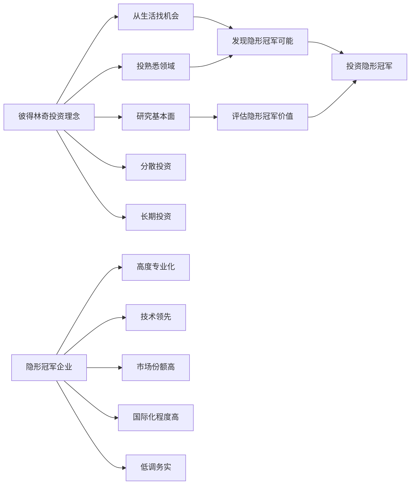

# 彼得林奇的“隐形冠军”在工业4.0背景下的发掘方法

> 关键词：彼得林奇、隐形冠军、工业4.0、发掘方法、企业分析

> 摘要：本文聚焦于在工业4.0的时代背景下，探讨如何运用彼得林奇的相关理念来发掘“隐形冠军”企业。首先介绍了研究的背景、目的、预期读者等基础信息，接着阐述了“隐形冠军”与彼得林奇投资理念的核心概念及联系，详细讲解了发掘“隐形冠军”的核心算法原理和具体操作步骤，引入相关数学模型和公式进行说明。通过实际的项目实战案例，展示了发掘过程中的代码实现和分析。同时，列举了“隐形冠军”在工业4.0中的实际应用场景，推荐了相关的学习资源、开发工具框架以及论文著作。最后对未来发展趋势与挑战进行总结，并提供常见问题解答和扩展阅读参考资料，旨在为投资者和企业研究者提供全面且深入的指导。

## 1. 背景介绍 
### 1.1 目的和范围
在工业4.0的浪潮下，全球制造业正经历着深刻的变革。信息技术与制造业的深度融合，催生了大量新兴的商业模式和技术创新。“隐形冠军”企业作为各个细分领域的佼佼者，它们在市场中占据着重要地位，但往往由于低调行事而不被大众熟知。彼得林奇作为投资界的传奇人物，他的投资理念和方法对于发掘具有潜力的企业具有重要的指导意义。

本文的目的在于探讨如何结合彼得林奇的投资理念，在工业4.0的背景下发掘“隐形冠军”企业。具体范围涵盖了“隐形冠军”企业的特征分析、发掘方法的构建、实际案例的研究以及相关资源的推荐等方面，旨在为投资者、企业管理者和研究者提供一套系统的发掘“隐形冠军”企业的思路和方法。

### 1.2 预期读者
本文的预期读者主要包括以下几类人群：
1. **投资者**：希望通过发掘“隐形冠军”企业，获取长期稳定的投资回报。
2. **企业管理者**：借鉴“隐形冠军”企业的成功经验，提升自身企业的竞争力。
3. **研究者**：对工业4.0背景下的企业发展和投资策略感兴趣，进行学术研究和案例分析。
4. **行业分析师**：深入了解各个细分行业的发展动态，为客户提供专业的分析报告。

### 1.3 文档结构概述
本文将按照以下结构进行阐述：
1. **背景介绍**：介绍研究的目的、范围、预期读者和文档结构，以及相关术语的定义和解释。
2. **核心概念与联系**：阐述“隐形冠军”和彼得林奇投资理念的核心概念，以及它们之间的联系，并通过文本示意图和Mermaid流程图进行展示。
3. **核心算法原理 & 具体操作步骤**：详细讲解发掘“隐形冠军”企业的核心算法原理，并给出具体的操作步骤，同时使用Python源代码进行说明。
4. **数学模型和公式 & 详细讲解 & 举例说明**：引入相关的数学模型和公式，对发掘过程进行量化分析，并通过具体的例子进行说明。
5. **项目实战：代码实际案例和详细解释说明**：通过实际的项目案例，展示发掘“隐形冠军”企业的代码实现和详细解释。
6. **实际应用场景**：列举“隐形冠军”企业在工业4.0中的实际应用场景。
7. **工具和资源推荐**：推荐相关的学习资源、开发工具框架和论文著作。
8. **总结：未来发展趋势与挑战**：对工业4.0背景下“隐形冠军”企业的未来发展趋势进行总结，并分析面临的挑战。
9. **附录：常见问题与解答**：解答读者在阅读过程中可能遇到的常见问题。
10. **扩展阅读 & 参考资料**：提供相关的扩展阅读材料和参考资料。

### 1.4 术语表
#### 1.4.1 核心术语定义
1. **隐形冠军**：指那些在某个细分领域占据领先地位，但不为大众所熟知的企业。这些企业通常具有高度专业化、技术领先、市场份额高、盈利能力强等特点。
2. **工业4.0**：是德国政府提出的一个高科技战略计划，旨在通过信息技术与制造业的深度融合，实现智能制造和工业互联网。工业4.0的核心特征包括智能化、数字化、网络化和柔性化。
3. **彼得林奇投资理念**：彼得林奇是美国著名的投资家，他的投资理念强调通过深入研究企业的基本面，寻找具有成长潜力的企业进行投资。他主张投资于自己熟悉的领域，关注企业的业绩增长、现金流、资产负债表等指标。

#### 1.4.2 相关概念解释
1. **细分市场**：指将整个市场按照一定的标准划分为若干个具有不同需求和特征的子市场。每个细分市场都有其独特的客户群体、竞争格局和市场机会。
2. **市场份额**：指企业在某个市场中所占的销售额或销售量的比例。市场份额是衡量企业市场竞争力的重要指标之一。
3. **盈利能力**：指企业通过经营活动获取利润的能力。盈利能力的常用指标包括毛利率、净利率、净资产收益率等。

#### 1.4.3 缩略词列表
1. **IoT**：Internet of Things，物联网
2. **AI**：Artificial Intelligence，人工智能
3. **ML**：Machine Learning，机器学习
4. **ERP**：Enterprise Resource Planning，企业资源计划
5. **MES**：Manufacturing Execution System，制造执行系统

## 2. 核心概念与联系 
### 2.1 核心概念原理
#### 2.1.1 隐形冠军
“隐形冠军”这一概念由德国管理学家赫尔曼·西蒙提出。他通过对大量中小企业的研究发现，在全球各个细分市场中，存在着许多不为人知但却具有强大竞争力的企业。这些企业通常专注于某一特定的产品或服务领域，通过不断创新和提高产品质量，在全球市场上占据了较高的市场份额。

隐形冠军企业具有以下几个特点：
1. **高度专业化**：专注于某一细分领域，将产品或服务做到极致。
2. **技术领先**：拥有先进的技术和研发能力，不断推出新产品和解决方案。
3. **市场份额高**：在其所在的细分市场中占据主导地位，甚至是全球领先地位。
4. **国际化程度高**：积极拓展国际市场，产品和服务出口到多个国家和地区。
5. **低调务实**：不追求知名度，注重企业的实际业绩和长期发展。

#### 2.1.2 彼得林奇投资理念
彼得林奇是美国富达基金公司的传奇基金经理，他在1977年至1990年期间管理麦哲伦基金，创造了年化收益率29%的惊人业绩。彼得林奇的投资理念主要包括以下几个方面：
1. **从生活中发现投资机会**：关注日常生活中的消费趋势和企业动态，寻找那些具有成长潜力的企业。
2. **深入研究企业基本面**：分析企业的业绩增长、现金流、资产负债表等指标，评估企业的内在价值。
3. **投资于自己熟悉的领域**：只投资于自己了解和熟悉的行业和企业，避免盲目跟风。
4. **分散投资**：通过投资多只股票，降低投资风险。
5. **长期投资**：相信优秀企业的长期发展潜力，持有股票的时间较长。

### 2.2 核心概念联系
彼得林奇的投资理念与“隐形冠军”企业的发掘有着密切的联系。彼得林奇强调从生活中发现投资机会，而“隐形冠军”企业往往在某个细分领域中占据主导地位，它们的产品或服务可能在日常生活中被广泛使用，但由于企业低调行事，不为大众所熟知。因此，通过关注日常生活中的消费趋势和企业动态，有可能发现这些“隐形冠军”企业。

此外，彼得林奇注重深入研究企业的基本面，而“隐形冠军”企业通常具有高度专业化、技术领先、市场份额高、盈利能力强等特点。通过对企业的业绩增长、现金流、资产负债表等指标进行分析，可以评估企业的内在价值，判断其是否为“隐形冠军”企业。

### 2.3 文本示意图
```plaintext
彼得林奇投资理念
|
|--从生活中发现投资机会
|--深入研究企业基本面
|--投资于自己熟悉的领域
|--分散投资
|--长期投资

隐形冠军企业
|
|--高度专业化
|--技术领先
|--市场份额高
|--国际化程度高
|--低调务实

联系：通过彼得林奇的投资方法发现隐形冠军企业，依据隐形冠军企业特点评估投资价值
```

### 2.4 Mermaid流程图


## 3. 核心算法原理 & 具体操作步骤 
### 3.1 核心算法原理
发掘“隐形冠军”企业的核心算法原理是基于彼得林奇的投资理念，结合工业4.0的特点，通过对企业的多个维度进行分析和评估，筛选出具有潜力的“隐形冠军”企业。具体来说，算法主要考虑以下几个方面的因素：
1. **市场份额**：企业在其所在细分市场中的市场份额是衡量其竞争力的重要指标。市场份额越高，说明企业在该领域的地位越稳固，越有可能成为“隐形冠军”企业。
2. **技术创新能力**：在工业4.0时代，技术创新是企业发展的核心驱动力。具有较强技术创新能力的企业能够不断推出新产品和解决方案，满足市场需求，从而在竞争中脱颖而出。
3. **盈利能力**：盈利能力是企业生存和发展的基础。具有较高盈利能力的企业能够更好地抵御市场风险，实现可持续发展。
4. **国际化程度**：随着经济全球化的发展，国际化程度高的企业能够更好地利用全球资源，拓展市场空间，增强企业的竞争力。
5. **行业发展趋势**：关注行业的发展趋势，选择那些处于上升期的行业中的企业，能够提高发掘“隐形冠军”企业的成功率。

### 3.2 具体操作步骤
#### 3.2.1 确定细分市场
首先，需要确定要研究的细分市场。可以根据行业分类标准、市场需求和竞争格局等因素，将整个市场划分为若干个细分市场。例如，在制造业中，可以将其细分为机械制造、电子制造、汽车制造等细分市场。

#### 3.2.2 收集企业数据
在确定了细分市场后，需要收集该细分市场中企业的相关数据。数据来源可以包括企业年报、财务报表、行业研究报告、新闻媒体报道等。收集的数据主要包括企业的市场份额、营业收入、净利润、研发投入、国际化程度等指标。

#### 3.2.3 建立评估指标体系
根据核心算法原理，建立评估指标体系。评估指标体系可以包括市场份额、技术创新能力、盈利能力、国际化程度等多个指标。每个指标可以根据其重要性赋予不同的权重。

#### 3.2.4 计算企业得分
根据收集到的企业数据和建立的评估指标体系，计算每个企业的得分。得分越高，说明企业在该细分市场中的竞争力越强，越有可能成为“隐形冠军”企业。

#### 3.2.5 筛选“隐形冠军”企业
根据企业的得分，筛选出得分较高的企业作为“隐形冠军”企业的候选名单。然后，对候选名单中的企业进行进一步的深入研究和分析，确定最终的“隐形冠军”企业。

### 3.3 Python源代码实现
```python
import pandas as pd

# 假设已经收集到了企业数据，存储在一个DataFrame中
# 列名分别为：企业名称、市场份额、研发投入占比、净利率、国际化收入占比
data = {
    '企业名称': ['企业A', '企业B', '企业C', '企业D'],
    '市场份额': [0.3, 0.2, 0.4, 0.1],
    '研发投入占比': [0.1, 0.15, 0.08, 0.2],
    '净利率': [0.12, 0.1, 0.15, 0.08],
    '国际化收入占比': [0.2, 0.3, 0.1, 0.4]
}
df = pd.DataFrame(data)

# 建立评估指标体系，设定各指标的权重
weights = {
    '市场份额': 0.3,
    '研发投入占比': 0.2,
    '净利率': 0.3,
    '国际化收入占比': 0.2
}

# 计算企业得分
def calculate_score(row):
    score = 0
    for key, value in weights.items():
        score += row[key] * value
    return score

df['得分'] = df.apply(calculate_score, axis=1)

# 筛选得分较高的企业作为“隐形冠军”企业的候选名单
candidate_list = df[df['得分'] > df['得分'].mean()]['企业名称'].tolist()

print("隐形冠军企业候选名单：", candidate_list)
```

## 4. 数学模型和公式 & 详细讲解 & 举例说明 
### 4.1 数学模型和公式
设企业 $i$ 在 $n$ 个评估指标下的取值分别为 $x_{i1}, x_{i2}, \cdots, x_{in}$，各评估指标的权重分别为 $w_1, w_2, \cdots, w_n$，其中 $\sum_{j=1}^{n} w_j = 1$。则企业 $i$ 的综合得分 $S_i$ 可以通过以下公式计算：

$$S_i = \sum_{j=1}^{n} w_j x_{ij}$$

### 4.2 详细讲解
上述公式中，$x_{ij}$ 表示企业 $i$ 在第 $j$ 个评估指标下的取值，$w_j$ 表示第 $j$ 个评估指标的权重。通过将各评估指标的取值乘以其对应的权重，并将结果相加，得到企业的综合得分。综合得分越高，说明企业在各个评估指标下的表现越好，越有可能成为“隐形冠军”企业。

### 4.3 举例说明
假设我们要评估三家企业（企业A、企业B、企业C）在四个评估指标（市场份额、研发投入占比、净利率、国际化收入占比）下的表现。各企业的指标取值和指标权重如下表所示：

| 企业名称 | 市场份额 | 研发投入占比 | 净利率 | 国际化收入占比 |
| ---- | ---- | ---- | ---- | ---- |
| 企业A | 0.3 | 0.1 | 0.12 | 0.2 |
| 企业B | 0.2 | 0.15 | 0.1 | 0.3 |
| 企业C | 0.4 | 0.08 | 0.15 | 0.1 |

| 评估指标 | 权重 |
| ---- | ---- |
| 市场份额 | 0.3 |
| 研发投入占比 | 0.2 |
| 净利率 | 0.3 |
| 国际化收入占比 | 0.2 |

根据上述公式，计算各企业的综合得分：

企业A的综合得分：

$$S_A = 0.3\times0.3 + 0.2\times0.1 + 0.3\times0.12 + 0.2\times0.2 = 0.09 + 0.02 + 0.036 + 0.04 = 0.186$$

企业B的综合得分：

$$S_B = 0.3\times0.2 + 0.2\times0.15 + 0.3\times0.1 + 0.2\times0.3 = 0.06 + 0.03 + 0.03 + 0.06 = 0.18$$

企业C的综合得分：

$$S_C = 0.3\times0.4 + 0.2\times0.08 + 0.3\times0.15 + 0.2\times0.1 = 0.12 + 0.016 + 0.045 + 0.02 = 0.191$$

比较各企业的综合得分，$S_C > S_A > S_B$，因此企业C的综合表现最好，最有可能成为“隐形冠军”企业。

## 5. 项目实战：代码实际案例和详细解释说明 
### 5.1  开发环境搭建
#### 5.1.1 安装Python
首先，需要安装Python开发环境。可以从Python官方网站（https://www.python.org/downloads/）下载适合自己操作系统的Python安装包，并按照安装向导进行安装。

#### 5.1.2 安装必要的库
在本项目中，需要使用到 `pandas` 库进行数据处理。可以使用以下命令安装 `pandas` 库：

```sh
pip install pandas
```

### 5.2  源代码详细实现和代码解读
```python
import pandas as pd

# 模拟收集到的企业数据
data = {
    '企业名称': ['企业A', '企业B', '企业C', '企业D', '企业E'],
    '市场份额': [0.25, 0.3, 0.15, 0.2, 0.1],
    '研发投入占比': [0.12, 0.15, 0.08, 0.1, 0.05],
    '净利率': [0.1, 0.12, 0.08, 0.09, 0.06],
    '国际化收入占比': [0.15, 0.2, 0.1, 0.12, 0.08]
}
df = pd.DataFrame(data)

# 建立评估指标体系，设定各指标的权重
weights = {
    '市场份额': 0.3,
    '研发投入占比': 0.2,
    '净利率': 0.3,
    '国际化收入占比': 0.2
}

# 定义计算企业得分的函数
def calculate_score(row):
    score = 0
    for key, value in weights.items():
        score += row[key] * value
    return score

# 计算每个企业的得分
df['得分'] = df.apply(calculate_score, axis=1)

# 按照得分降序排序
df = df.sort_values(by='得分', ascending=False)

# 筛选得分前两名的企业作为“隐形冠军”企业
top_two = df.head(2)['企业名称'].tolist()

print("隐形冠军企业：", top_two)
```

### 5.3  代码解读与分析
1. **数据模拟**：使用字典 `data` 模拟收集到的企业数据，并将其转换为 `pandas` 的 `DataFrame` 对象 `df`。
2. **评估指标体系**：定义字典 `weights` 来存储各评估指标的权重。
3. **得分计算函数**：定义函数 `calculate_score` 来计算每个企业的得分。该函数接受一个 `DataFrame` 的行作为输入，通过遍历各评估指标及其权重，计算出企业的综合得分。
4. **得分计算**：使用 `apply` 方法将 `calculate_score` 函数应用到 `df` 的每一行，计算出每个企业的得分，并将结果存储在新的列 `得分` 中。
5. **排序和筛选**：使用 `sort_values` 方法按照得分降序排序 `df`，然后使用 `head(2)` 方法筛选出得分前两名的企业，并将其名称存储在列表 `top_two` 中。
6. **结果输出**：打印出筛选出的“隐形冠军”企业的名称。

通过这个项目实战，我们可以看到如何使用Python和 `pandas` 库来实现发掘“隐形冠军”企业的算法。在实际应用中，可以根据需要调整评估指标和权重，以适应不同的行业和市场环境。

## 6. 实际应用场景 
### 6.1 智能制造领域
在智能制造领域，“隐形冠军”企业往往专注于某一特定的智能制造技术或设备，如工业机器人、传感器、自动化生产线等。这些企业通过不断创新和提高产品质量，在全球市场上占据了较高的市场份额。例如，德国的库卡机器人公司是全球领先的工业机器人制造商，其产品广泛应用于汽车制造、电子制造等行业。

### 6.2 工业互联网领域
工业互联网是工业4.0的核心内容之一，它通过将设备、生产线、工厂、供应商、产品和客户紧密连接起来，实现工业生产的智能化和网络化。在工业互联网领域，“隐形冠军”企业通常提供工业互联网平台、工业软件、大数据分析等解决方案。例如，美国的通用电气公司推出的Predix工业互联网平台，为全球制造业企业提供了设备监控、预测性维护、生产优化等服务。

### 6.3 新能源汽车领域
随着全球对环境保护和能源可持续发展的重视，新能源汽车市场呈现出快速增长的趋势。在新能源汽车领域，“隐形冠军”企业主要集中在电池技术、电机技术、电控技术等核心零部件领域。例如，中国的宁德时代新能源科技股份有限公司是全球领先的动力电池制造商，其产品广泛应用于新能源汽车、储能等领域。

### 6.4 高端装备制造领域
高端装备制造是制造业的核心和关键，它代表了一个国家的制造业水平和综合实力。在高端装备制造领域，“隐形冠军”企业通常具有先进的技术和研发能力，能够生产出高精度、高性能、高可靠性的装备产品。例如，日本的发那科公司是全球领先的数控机床制造商，其产品在航空航天、汽车制造、电子制造等行业得到了广泛应用。

## 7. 工具和资源推荐
### 7.1 学习资源推荐
#### 7.1.1 书籍推荐
1. 《彼得林奇的成功投资》：彼得林奇的经典著作，详细介绍了他的投资理念和方法。
2. 《隐形冠军：未来全球化的先锋》：赫尔曼·西蒙的代表作，深入研究了“隐形冠军”企业的特点和成功经验。
3. 《工业4.0：即将来袭的第四次工业革命》：全面介绍了工业4.0的概念、技术和应用场景。

#### 7.1.2 在线课程
1. Coursera上的“Investment Management Specialization”：由哥伦比亚大学教授授课，涵盖了投资管理的各个方面。
2. edX上的“Industry 4.0: The Fourth Industrial Revolution”：介绍了工业4.0的核心技术和应用案例。
3. 中国大学MOOC上的“智能制造技术基础”：讲解了智能制造的基本概念、技术和发展趋势。

#### 7.1.3 技术博客和网站
1. 36氪：提供了大量关于科技、创业、投资等方面的资讯和分析。
2. 虎嗅网：聚焦于互联网、科技、商业等领域的深度报道和分析。
3. 工业4.0产业联盟官网：发布了工业4.0领域的最新政策、技术和应用案例。

### 7.2 开发工具框架推荐
#### 7.2.1 IDE和编辑器
1. PyCharm：一款专业的Python集成开发环境，提供了代码编辑、调试、版本控制等功能。
2. Jupyter Notebook：一个交互式的开发环境，适合进行数据探索和分析。
3. Visual Studio Code：一款轻量级的代码编辑器，支持多种编程语言和插件扩展。

#### 7.2.2 调试和性能分析工具
1. PDB：Python自带的调试工具，用于调试Python代码。
2. cProfile：Python的性能分析工具，用于分析代码的执行时间和性能瓶颈。
3. Py-Spy：一个用于分析Python程序性能的工具，可以实时查看函数调用栈和CPU使用率。

#### 7.2.3 相关框架和库
1. Pandas：一个强大的数据处理和分析库，提供了高效的数据结构和数据操作方法。
2. Numpy：一个用于科学计算的Python库，提供了多维数组和矩阵运算的功能。
3. Scikit-learn：一个用于机器学习的Python库，提供了各种机器学习算法和工具。

### 7.3 相关论文著作推荐
#### 7.3.1 经典论文
1. Simon, H. (1996). Hidden champions: Lessons from 500 of the world's best unknown companies. Harvard Business School Press.
2. Porter, M. E. (1980). Competitive strategy: Techniques for analyzing industries and competitors. Free Press.
3. Christensen, C. M. (1997). The innovator's dilemma: When new technologies cause great firms to fail. Harvard Business School Press.

#### 7.3.2 最新研究成果
1. Manyika, J., Chui, M., Bughin, J., Dobbs, R., Bisson, P., & Marrs, A. (2011). Big data: The next frontier for innovation, competition, and productivity. McKinsey Global Institute.
2. Schwab, K. (2016). The fourth industrial revolution. World Economic Forum.
3. Lasi, H., Fettke, P., Kemper, H.-G., Feld, T., & Hoffmann, M. (2014). Industry 4.0. Business & Information Systems Engineering, 6(4), 239-242.

#### 7.3.3 应用案例分析
1. 通用电气公司Predix工业互联网平台案例分析
2. 库卡机器人公司在汽车制造行业的应用案例分析
3. 宁德时代新能源科技股份有限公司动力电池技术案例分析

## 8. 总结：未来发展趋势与挑战
### 8.1 未来发展趋势
#### 8.1.1 技术创新加速
在工业4.0的推动下，“隐形冠军”企业将加大在技术创新方面的投入，不断推出新产品和解决方案。人工智能、物联网、大数据、云计算等新兴技术将与制造业深度融合，推动制造业向智能化、数字化、网络化方向发展。

#### 8.1.2 国际化程度提高
随着经济全球化的发展，“隐形冠军”企业将更加积极地拓展国际市场，加强与全球客户和合作伙伴的合作。通过建立全球生产基地、销售网络和研发中心，提高企业的国际化程度和全球竞争力。

#### 8.1.3 服务化转型加快
“隐形冠军”企业将从单纯的产品制造商向综合解决方案提供商转型，为客户提供更加全面、优质的服务。通过提供设备维护、技术支持、数据分析等服务，增加客户的粘性和满意度，提高企业的附加值和盈利能力。

#### 8.1.4 产业生态化发展
“隐形冠军”企业将加强与产业链上下游企业的合作，形成产业生态系统。通过共享资源、技术和市场，实现优势互补，共同推动产业的发展。

### 8.2 挑战
#### 8.2.1 技术创新压力
在工业4.0时代，技术创新速度加快，“隐形冠军”企业需要不断投入大量的研发资源，以保持技术领先地位。同时，新兴技术的应用也带来了新的技术风险和挑战，如数据安全、隐私保护等问题。

#### 8.2.2 人才短缺
工业4.0的发展需要大量既懂技术又懂管理的复合型人才。然而，目前市场上这类人才相对短缺，“隐形冠军”企业在吸引和留住人才方面面临着较大的挑战。

#### 8.3.3 市场竞争加剧
随着工业4.0的推进，越来越多的企业将进入智能制造、工业互联网等领域，市场竞争将更加激烈。“隐形冠军”企业需要不断提高自身的竞争力，以应对市场竞争的挑战。

#### 8.4.4 政策法规变化
工业4.0的发展涉及到多个领域的政策法规，如数据保护、知识产权、税收等。政策法规的变化可能会对“隐形冠军”企业的发展产生影响，企业需要及时了解和适应政策法规的变化。

## 9. 附录：常见问题与解答
### 9.1 什么是“隐形冠军”企业？
“隐形冠军”企业是指那些在某个细分领域占据领先地位，但不为大众所熟知的企业。这些企业通常具有高度专业化、技术领先、市场份额高、盈利能力强等特点。

### 9.2 彼得林奇的投资理念对发掘“隐形冠军”企业有什么帮助？
彼得林奇的投资理念强调从生活中发现投资机会，深入研究企业基本面，投资于自己熟悉的领域等。这些理念可以帮助我们关注日常生活中的消费趋势和企业动态，通过对企业的业绩增长、现金流、资产负债表等指标进行分析，发现那些具有潜力的“隐形冠军”企业。

### 9.3 如何确定评估“隐形冠军”企业的指标和权重？
评估“隐形冠军”企业的指标和权重可以根据行业特点、市场环境和投资目标等因素来确定。一般来说，可以考虑市场份额、技术创新能力、盈利能力、国际化程度等指标。各指标的权重可以根据其重要性进行调整，例如，对于技术密集型行业，可以适当提高技术创新能力指标的权重。

### 9.4 在工业4.0背景下，“隐形冠军”企业面临哪些机遇和挑战？
在工业4.0背景下，“隐形冠军”企业面临的机遇包括技术创新加速、国际化程度提高、服务化转型加快、产业生态化发展等。同时，也面临着技术创新压力、人才短缺、市场竞争加剧、政策法规变化等挑战。

### 9.5 如何进一步深入研究“隐形冠军”企业？
可以通过阅读相关的书籍、论文和研究报告，参加行业研讨会和培训课程，与“隐形冠军”企业的管理人员和专家进行交流等方式，进一步深入研究“隐形冠军”企业的特点、成功经验和发展趋势。

## 10. 扩展阅读 & 参考资料
### 10.1 扩展阅读
1. 《创新者的解答》：克莱顿·克里斯坦森的另一部经典著作，探讨了企业如何应对颠覆性创新的挑战。
2. 《精益创业》：埃里克·莱斯的代表作，介绍了一种快速验证商业模式的方法。
3. 《从零到一》：彼得·蒂尔的著作，阐述了创业公司如何从无到有，创造出独特的价值。

### 10.2 参考资料
1. Simon, H. (2009). Hidden champions of the 21st century: Success strategies of unknown world market leaders. Springer.
2. Lynch, P. (1989). One up on Wall Street: How to use what you already know to make money in the market. Simon & Schuster.
3. Schwab, K. (2017). Shaping the future of the fourth industrial revolution. World Economic Forum.

作者：AI天才研究院/AI Genius Institute & 禅与计算机程序设计艺术 /Zen And The Art of Computer Programming