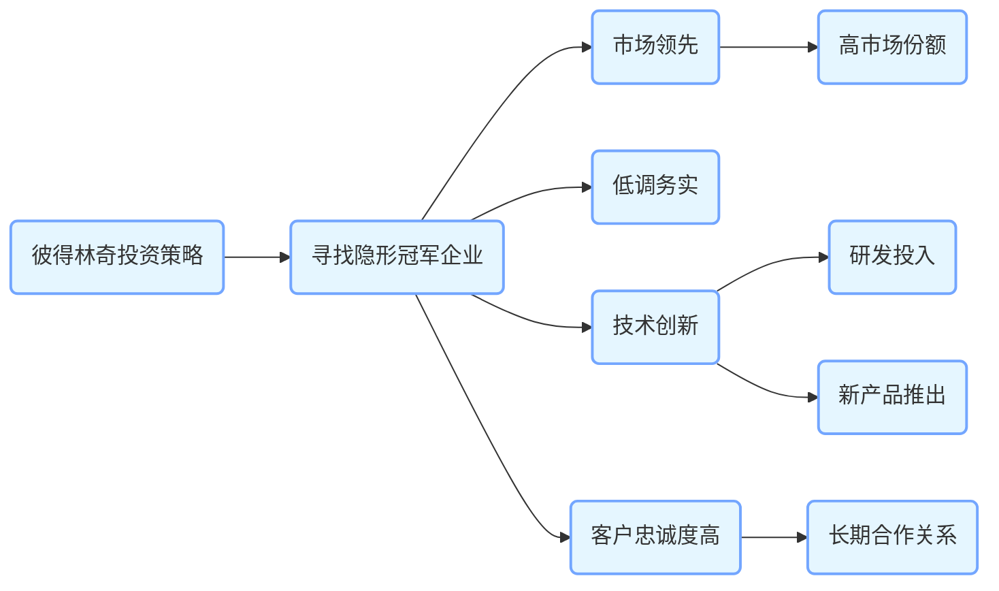

# 彼得林奇的“隐形冠军”投资案例分析

> 关键词：彼得林奇；隐形冠军；投资案例；投资策略；股票分析

> 摘要：本文聚焦于彼得林奇的“隐形冠军”投资理念与实践。深入剖析“隐形冠军”的核心概念、形成机制及特征，详细阐述彼得林奇投资“隐形冠军”所运用的核心算法原理与具体操作步骤。通过数学模型和公式解读其投资决策的依据，结合实际项目案例分析投资过程中的策略运用和代码实现。探讨“隐形冠军”在不同领域的实际应用场景，推荐相关学习资源、开发工具及研究论文。最后总结“隐形冠军”投资的未来发展趋势与挑战，解答常见问题并提供扩展阅读与参考资料，旨在为投资者深入理解和运用这一投资策略提供全面且深入的指导。

## 1. 背景介绍 
### 1.1 目的和范围
本文章旨在深入剖析彼得林奇的“隐形冠军”投资案例，全面揭示其投资策略的精髓与实际应用。通过对相关概念、算法、数学模型的详细解读，结合具体项目实战和实际应用场景的分析，为投资者提供系统且实用的投资指导。研究范围涵盖“隐形冠军”企业的特征、彼得林奇的投资决策过程、投资策略在不同行业的应用以及相关工具和资源的推荐等方面。

### 1.2 预期读者
本文预期读者主要包括对股票投资感兴趣的个人投资者、金融专业的学生和研究人员、投资机构的从业人员等。无论是初涉投资领域的新手，还是具有一定投资经验的专业人士，都能从本文中获取有价值的信息和启示。

### 1.3 文档结构概述
本文将按照以下结构展开：首先介绍核心概念与联系，明确“隐形冠军”的定义和特征；接着阐述核心算法原理和具体操作步骤，以 Python 代码详细说明投资决策的过程；然后通过数学模型和公式进一步解释投资决策的依据，并举例说明；之后结合项目实战，分析实际案例中的代码实现和策略运用；再探讨“隐形冠军”的实际应用场景；推荐相关的学习资源、开发工具和研究论文；最后总结未来发展趋势与挑战，解答常见问题并提供扩展阅读与参考资料。

### 1.4 术语表
#### 1.4.1 核心术语定义
- **隐形冠军**：指那些在某个细分领域占据领先地位，但却不为大众所熟知的企业。这些企业通常具有较高的市场份额、强大的技术实力和稳定的盈利能力。
- **彼得林奇投资策略**：彼得林奇是美国著名的投资家，他主张通过深入研究企业的基本面，寻找具有成长潜力的“隐形冠军”企业进行投资。其投资策略注重对企业的实地考察、对行业趋势的把握以及对财务数据的分析。
- **市场份额**：指企业的产品或服务在特定市场中的销售额占该市场总销售额的比例。市场份额是衡量企业市场竞争力的重要指标之一。

#### 1.4.2 相关概念解释
- **细分领域**：指在一个大的行业中，根据产品、服务、客户群体等因素划分出来的较小的市场领域。例如，在汽车行业中，新能源汽车、豪华汽车等都可以看作是细分领域。
- **成长潜力**：指企业在未来一段时间内实现业务增长和盈利能力提升的可能性。成长潜力通常与企业的技术创新能力、市场需求、管理团队等因素有关。

#### 1.4.3 缩略词列表
- **PE**：市盈率（Price Earnings Ratio），指股票价格与每股收益的比率，用于衡量股票的估值水平。
- **ROE**：净资产收益率（Return on Equity），指企业净利润与净资产的比率，反映企业运用自有资本的效率。

## 2. 核心概念与联系 

### 2.1 “隐形冠军”的定义和特征
“隐形冠军”这一概念由德国管理学家赫尔曼·西蒙提出，彼得林奇在投资实践中对这类企业表现出了浓厚的兴趣。“隐形冠军”企业通常具有以下特征：
- **市场领先**：在其所处的细分领域中占据较高的市场份额，往往是行业的领导者。
- **低调务实**：相较于大型知名企业，“隐形冠军”企业通常不追求广泛的媒体曝光，更注重专注于自身的业务发展。
- **技术创新**：拥有强大的技术研发能力，不断推出具有竞争力的产品或服务，以保持在市场中的领先地位。
- **客户忠诚度高**：凭借优质的产品和服务，与客户建立了长期稳定的合作关系，客户忠诚度较高。

### 2.2 彼得林奇的投资理念与“隐形冠军”的契合点
彼得林奇主张通过自下而上的投资方法，深入研究企业的基本面，寻找具有成长潜力的股票。“隐形冠军”企业恰好符合他的投资理念，这些企业虽然不为大众所熟知，但在细分领域具有强大的竞争力和成长潜力。彼得林奇认为，投资“隐形冠军”企业可以获得超额收益，因为市场往往低估了这些企业的价值。

### 2.3 核心概念的架构示意图


该示意图展示了彼得林奇投资策略与“隐形冠军”企业特征之间的关系。彼得林奇通过寻找具有市场领先、低调务实、技术创新和客户忠诚度高的“隐形冠军”企业进行投资。市场领先表现为高市场份额，技术创新体现在研发投入和新产品推出，客户忠诚度高则表现为与客户建立长期合作关系。

## 3. 核心算法原理 & 具体操作步骤 

### 3.1 核心算法原理
彼得林奇在投资“隐形冠军”企业时，主要基于对企业基本面的分析，通过评估企业的盈利能力、成长潜力、财务状况等因素来做出投资决策。以下是一个简化的投资决策算法原理：

#### 步骤 1：筛选潜在“隐形冠军”企业
首先，从各个行业中筛选出在细分领域具有一定市场份额和竞争力的企业。可以通过市场调研、行业报告等方式获取相关信息。

#### 步骤 2：评估企业基本面
对筛选出的企业进行基本面分析，主要包括以下几个方面：
- **盈利能力**：通过分析企业的净利润、毛利率、净利率等指标，评估企业的盈利能力。
- **成长潜力**：关注企业的营业收入增长率、净利润增长率等指标，判断企业的成长潜力。
- **财务状况**：分析企业的资产负债率、流动比率、速动比率等指标，评估企业的财务状况是否健康。

#### 步骤 3：计算投资价值
根据企业的基本面分析结果，计算企业的投资价值。可以使用市盈率（PE）、市净率（PB）等估值指标来评估企业的股票价格是否合理。

#### 步骤 4：做出投资决策
根据企业的投资价值和市场情况，做出投资决策。如果企业的投资价值被低估，且市场前景良好，则可以考虑买入该企业的股票；反之，则可以选择观望或卖出。

### 3.2 具体操作步骤的 Python 代码实现
```python
import pandas as pd

# 步骤 1：筛选潜在“隐形冠军”企业
def filter_potential_champions(industry_data):
    # 假设 industry_data 是一个包含企业信息的 DataFrame
    # 这里简单以市场份额大于 20% 作为筛选条件
    potential_champions = industry_data[industry_data['market_share'] > 0.2]
    return potential_champions

# 步骤 2：评估企业基本面
def evaluate_fundamentals(companies):
    evaluation_results = []
    for index, company in companies.iterrows():
        # 计算盈利能力指标
        net_profit_margin = company['net_profit'] / company['revenue']
        gross_profit_margin = company['gross_profit'] / company['revenue']
        
        # 计算成长潜力指标
        revenue_growth_rate = (company['revenue'] - company['previous_revenue']) / company['previous_revenue']
        net_profit_growth_rate = (company['net_profit'] - company['previous_net_profit']) / company['previous_net_profit']
        
        # 计算财务状况指标
        debt_ratio = company['total_debt'] / company['total_assets']
        current_ratio = company['current_assets'] / company['current_liabilities']
        
        evaluation = {
            'company_name': company['company_name'],
            'net_profit_margin': net_profit_margin,
            'gross_profit_margin': gross_profit_margin,
            'revenue_growth_rate': revenue_growth_rate,
            'net_profit_growth_rate': net_profit_growth_rate,
            'debt_ratio': debt_ratio,
            'current_ratio': current_ratio
        }
        evaluation_results.append(evaluation)
    
    evaluation_df = pd.DataFrame(evaluation_results)
    return evaluation_df

# 步骤 3：计算投资价值
def calculate_investment_value(evaluation_df):
    investment_values = []
    for index, company in evaluation_df.iterrows():
        # 简单假设使用市盈率（PE）来评估投资价值
        pe_ratio = company['stock_price'] / company['earnings_per_share']
        investment_value = {
            'company_name': company['company_name'],
            'pe_ratio': pe_ratio
        }
        investment_values.append(investment_value)
    
    investment_value_df = pd.DataFrame(investment_values)
    return investment_value_df

# 步骤 4：做出投资决策
def make_investment_decision(investment_value_df):
    investment_decisions = []
    for index, company in investment_value_df.iterrows():
        if company['pe_ratio'] < 15:  # 假设 PE 小于 15 为低估
            decision = 'Buy'
        else:
            decision = 'Hold'
        investment_decisions.append({
            'company_name': company['company_name'],
            'decision': decision
        })
    
    decision_df = pd.DataFrame(investment_decisions)
    return decision_df

# 示例数据
industry_data = pd.DataFrame({
    'company_name': ['Company A', 'Company B', 'Company C'],
    'market_share': [0.25, 0.15, 0.3],
    'revenue': [1000, 800, 1200],
    'previous_revenue': [900, 750, 1100],
    'net_profit': [100, 80, 150],
    'previous_net_profit': [90, 70, 130],
    'total_debt': [200, 150, 300],
    'total_assets': [500, 400, 600],
    'current_assets': [300, 250, 400],
    'current_liabilities': [150, 120, 200],
    'stock_price': [20, 15, 25],
    'earnings_per_share': [2, 1.5, 2.5]
})

# 执行投资决策流程
potential_champions = filter_potential_champions(industry_data)
evaluation_df = evaluate_fundamentals(potential_champions)
investment_value_df = calculate_investment_value(evaluation_df)
decision_df = make_investment_decision(investment_value_df)

print("潜在隐形冠军企业：")
print(potential_champions)
print("\n企业基本面评估结果：")
print(evaluation_df)
print("\n投资价值计算结果：")
print(investment_value_df)
print("\n投资决策结果：")
print(decision_df)
```

### 3.3 代码解释
- `filter_potential_champions` 函数：根据市场份额筛选出潜在的“隐形冠军”企业。
- `evaluate_fundamentals` 函数：对筛选出的企业进行基本面分析，计算盈利能力、成长潜力和财务状况等指标。
- `calculate_investment_value` 函数：根据企业的基本面分析结果，计算企业的投资价值，这里使用市盈率（PE）作为评估指标。
- `make_investment_decision` 函数：根据企业的投资价值做出投资决策，如果市盈率小于 15，则建议买入；否则建议持有。

## 4. 数学模型和公式 & 详细讲解 & 举例说明 

### 4.1 盈利能力指标
#### 净利率（Net Profit Margin）
净利率是指企业净利润与营业收入的比率，反映了企业每一元营业收入所赚取的净利润。计算公式为：
$$Net\ Profit\ Margin = \frac{Net\ Profit}{Revenue}$$
例如，某企业的净利润为 100 万元，营业收入为 1000 万元，则该企业的净利率为：
$$Net\ Profit\ Margin = \frac{100}{1000} = 0.1 = 10\%$$

#### 毛利率（Gross Profit Margin）
毛利率是指企业毛利与营业收入的比率，反映了企业产品或服务的基本盈利能力。计算公式为：
$$Gross\ Profit\ Margin = \frac{Gross\ Profit}{Revenue}$$
其中，毛利等于营业收入减去营业成本。例如，某企业的营业收入为 1000 万元，营业成本为 600 万元，则该企业的毛利为 400 万元，毛利率为：
$$Gross\ Profit\ Margin = \frac{400}{1000} = 0.4 = 40\%$$

### 4.2 成长潜力指标
#### 营业收入增长率（Revenue Growth Rate）
营业收入增长率是指企业本期营业收入相对于上期营业收入的增长幅度，反映了企业业务的增长速度。计算公式为：
$$Revenue\ Growth\ Rate = \frac{Revenue_{current} - Revenue_{previous}}{Revenue_{previous}}$$
例如，某企业本期营业收入为 1000 万元，上期营业收入为 900 万元，则该企业的营业收入增长率为：
$$Revenue\ Growth\ Rate = \frac{1000 - 900}{900} \approx 0.111 = 11.1\%$$

#### 净利润增长率（Net Profit Growth Rate）
净利润增长率是指企业本期净利润相对于上期净利润的增长幅度，反映了企业盈利能力的增长速度。计算公式为：
$$Net\ Profit\ Growth\ Rate = \frac{Net\ Profit_{current} - Net\ Profit_{previous}}{Net\ Profit_{previous}}$$
例如，某企业本期净利润为 100 万元，上期净利润为 90 万元，则该企业的净利润增长率为：
$$Net\ Profit\ Growth\ Rate = \frac{100 - 90}{90} \approx 0.111 = 11.1\%$$

### 4.3 财务状况指标
#### 资产负债率（Debt Ratio）
资产负债率是指企业总负债与总资产的比率，反映了企业的负债水平和偿债能力。计算公式为：
$$Debt\ Ratio = \frac{Total\ Debt}{Total\ Assets}$$
例如，某企业的总负债为 200 万元，总资产为 500 万元，则该企业的资产负债率为：
$$Debt\ Ratio = \frac{200}{500} = 0.4 = 40\%$$

#### 流动比率（Current Ratio）
流动比率是指企业流动资产与流动负债的比率，反映了企业短期偿债能力。计算公式为：
$$Current\ Ratio = \frac{Current\ Assets}{Current\ Liabilities}$$
例如，某企业的流动资产为 300 万元，流动负债为 150 万元，则该企业的流动比率为：
$$Current\ Ratio = \frac{300}{150} = 2$$

### 4.4 估值指标
#### 市盈率（Price Earnings Ratio）
市盈率是指股票价格与每股收益的比率，反映了市场对企业盈利能力的预期。计算公式为：
$$PE\ Ratio = \frac{Stock\ Price}{Earnings\ Per\ Share}$$
例如，某股票的价格为 20 元，每股收益为 2 元，则该股票的市盈率为：
$$PE\ Ratio = \frac{20}{2} = 10$$

## 5. 项目实战：代码实际案例和详细解释说明 

### 5.1  开发环境搭建
为了运行上述 Python 代码，需要搭建以下开发环境：
- **Python 环境**：建议使用 Python 3.7 及以上版本。可以从 Python 官方网站（https://www.python.org/downloads/）下载并安装。
- **开发工具**：可以使用 PyCharm、Jupyter Notebook 等开发工具。PyCharm 是一款专业的 Python 集成开发环境，功能强大；Jupyter Notebook 则适合进行交互式编程和数据分析。
- **必要的库**：代码中使用了 `pandas` 库进行数据处理和分析，需要安装该库。可以使用以下命令进行安装：
```sh
pip install pandas
```

### 5.2  源代码详细实现和代码解读
以下是对上述 Python 代码的详细解读：

```python
import pandas as pd

# 步骤 1：筛选潜在“隐形冠军”企业
def filter_potential_champions(industry_data):
    # 假设 industry_data 是一个包含企业信息的 DataFrame
    # 这里简单以市场份额大于 20% 作为筛选条件
    potential_champions = industry_data[industry_data['market_share'] > 0.2]
    return potential_champions
```
- 导入 `pandas` 库，用于数据处理和分析。
- `filter_potential_champions` 函数接受一个包含企业信息的 `DataFrame` 作为输入，通过筛选市场份额大于 20% 的企业，得到潜在的“隐形冠军”企业。

```python
# 步骤 2：评估企业基本面
def evaluate_fundamentals(companies):
    evaluation_results = []
    for index, company in companies.iterrows():
        # 计算盈利能力指标
        net_profit_margin = company['net_profit'] / company['revenue']
        gross_profit_margin = company['gross_profit'] / company['revenue']
        
        # 计算成长潜力指标
        revenue_growth_rate = (company['revenue'] - company['previous_revenue']) / company['previous_revenue']
        net_profit_growth_rate = (company['net_profit'] - company['previous_net_profit']) / company['previous_net_profit']
        
        # 计算财务状况指标
        debt_ratio = company['total_debt'] / company['total_assets']
        current_ratio = company['current_assets'] / company['current_liabilities']
        
        evaluation = {
            'company_name': company['company_name'],
            'net_profit_margin': net_profit_margin,
            'gross_profit_margin': gross_profit_margin,
            'revenue_growth_rate': revenue_growth_rate,
            'net_profit_growth_rate': net_profit_growth_rate,
            'debt_ratio': debt_ratio,
            'current_ratio': current_ratio
        }
        evaluation_results.append(evaluation)
    
    evaluation_df = pd.DataFrame(evaluation_results)
    return evaluation_df
```
- `evaluate_fundamentals` 函数对筛选出的企业进行基本面分析。
- 计算盈利能力指标（净利率、毛利率）、成长潜力指标（营业收入增长率、净利润增长率）和财务状况指标（资产负债率、流动比率）。
- 将每个企业的评估结果存储在一个字典中，并添加到 `evaluation_results` 列表中。
- 最后将 `evaluation_results` 列表转换为 `DataFrame` 并返回。

```python
# 步骤 3：计算投资价值
def calculate_investment_value(evaluation_df):
    investment_values = []
    for index, company in evaluation_df.iterrows():
        # 简单假设使用市盈率（PE）来评估投资价值
        pe_ratio = company['stock_price'] / company['earnings_per_share']
        investment_value = {
            'company_name': company['company_name'],
            'pe_ratio': pe_ratio
        }
        investment_values.append(investment_value)
    
    investment_value_df = pd.DataFrame(investment_values)
    return investment_value_df
```
- `calculate_investment_value` 函数根据企业的基本面分析结果，计算企业的投资价值。
- 这里使用市盈率（PE）作为评估指标，将每个企业的市盈率存储在一个字典中，并添加到 `investment_values` 列表中。
- 最后将 `investment_values` 列表转换为 `DataFrame` 并返回。

```python
# 步骤 4：做出投资决策
def make_investment_decision(investment_value_df):
    investment_decisions = []
    for index, company in investment_value_df.iterrows():
        if company['pe_ratio'] < 15:  # 假设 PE 小于 15 为低估
            decision = 'Buy'
        else:
            decision = 'Hold'
        investment_decisions.append({
            'company_name': company['company_name'],
            'decision': decision
        })
    
    decision_df = pd.DataFrame(investment_decisions)
    return decision_df
```
- `make_investment_decision` 函数根据企业的投资价值做出投资决策。
- 如果市盈率小于 15，则建议买入；否则建议持有。
- 将每个企业的投资决策存储在一个字典中，并添加到 `investment_decisions` 列表中。
- 最后将 `investment_decisions` 列表转换为 `DataFrame` 并返回。

```python
# 示例数据
industry_data = pd.DataFrame({
    'company_name': ['Company A', 'Company B', 'Company C'],
    'market_share': [0.25, 0.15, 0.3],
    'revenue': [1000, 800, 1200],
    'previous_revenue': [900, 750, 1100],
    'net_profit': [100, 80, 150],
    'previous_net_profit': [90, 70, 130],
    'total_debt': [200, 150, 300],
    'total_assets': [500, 400, 600],
    'current_assets': [300, 250, 400],
    'current_liabilities': [150, 120, 200],
    'stock_price': [20, 15, 25],
    'earnings_per_share': [2, 1.5, 2.5]
})

# 执行投资决策流程
potential_champions = filter_potential_champions(industry_data)
evaluation_df = evaluate_fundamentals(potential_champions)
investment_value_df = calculate_investment_value(evaluation_df)
decision_df = make_investment_decision(investment_value_df)

print("潜在隐形冠军企业：")
print(potential_champions)
print("\n企业基本面评估结果：")
print(evaluation_df)
print("\n投资价值计算结果：")
print(investment_value_df)
print("\n投资决策结果：")
print(decision_df)
```
- 定义示例数据，包含企业的基本信息、财务数据和股票价格等。
- 依次调用 `filter_potential_champions`、`evaluate_fundamentals`、`calculate_investment_value` 和 `make_investment_decision` 函数，执行投资决策流程。
- 打印潜在隐形冠军企业、企业基本面评估结果、投资价值计算结果和投资决策结果。

### 5.3  代码解读与分析
通过上述代码，我们可以看到整个投资决策流程的实现。首先，从行业数据中筛选出潜在的“隐形冠军”企业；然后对这些企业进行基本面分析，评估其盈利能力、成长潜力和财务状况；接着计算企业的投资价值，使用市盈率作为评估指标；最后根据投资价值做出投资决策。

需要注意的是，这只是一个简化的示例，实际的投资决策需要考虑更多的因素，如行业竞争态势、宏观经济环境等。此外，代码中的筛选条件和评估指标可以根据实际情况进行调整和优化。

## 6. 实际应用场景 
### 6.1 制造业
在制造业中，“隐形冠军”企业通常专注于某个细分领域的零部件或设备制造。例如，德国的伍尔特集团是全球最大的装配和紧固件供应商之一，虽然它在大众中知名度不高，但在紧固件行业占据着主导地位。彼得林奇可能会关注这类企业，通过分析其市场份额、技术实力和财务状况，判断其投资价值。

### 6.2 科技行业
科技行业中的“隐形冠军”企业往往在某个特定的技术领域具有领先优势。比如，英伟达在图形处理单元（GPU）领域处于全球领先地位，虽然普通消费者可能对其了解不多，但在游戏、人工智能等领域，英伟达的产品具有极高的市场份额。投资者可以借鉴彼得林奇的投资策略，挖掘这类具有成长潜力的科技“隐形冠军”企业。

### 6.3 消费行业
消费行业中的“隐形冠军”企业可能是某个细分品类的领导者。例如，好丽友在派类零食市场具有较高的市场份额，是该细分领域的“隐形冠军”。通过对其品牌影响力、销售渠道和财务数据的分析，投资者可以评估其投资价值。

## 7. 工具和资源推荐
### 7.1 学习资源推荐
#### 7.1.1 书籍推荐
- 《彼得林奇的成功投资》：彼得林奇的经典著作，详细介绍了他的投资理念和方法，对于理解“隐形冠军”投资策略具有重要的参考价值。
- 《隐形冠军：未来全球化的先锋》：赫尔曼·西蒙的著作，深入探讨了“隐形冠军”企业的特点和成功之道。
- 《聪明的投资者》：本杰明·格雷厄姆的经典投资书籍，强调了价值投资的重要性，为投资者提供了基本的投资原则和方法。

#### 7.1.2 在线课程
- Coursera 上的“投资学原理”：由知名教授授课，系统介绍了投资学的基本原理和方法。
- 网易云课堂上的“股票投资实战课程”：结合实际案例，讲解股票投资的技巧和策略。

#### 7.1.3 技术博客和网站
- 雪球网：国内知名的投资社区，提供丰富的股票分析和投资讨论内容。
- Seeking Alpha：国外知名的金融分析网站，有大量专业的投资分析文章。

### 7.2 开发工具框架推荐
#### 7.2.1 IDE和编辑器
- PyCharm：专业的 Python 集成开发环境，功能强大，适合进行大型项目的开发。
- Jupyter Notebook：交互式编程环境，适合进行数据分析和模型验证。

#### 7.2.2 调试和性能分析工具
- PDB：Python 自带的调试工具，可以帮助开发者定位代码中的问题。
- cProfile：Python 性能分析工具，可以分析代码的运行时间和性能瓶颈。

#### 7.2.3 相关框架和库
- Pandas：用于数据处理和分析的 Python 库，提供了丰富的数据结构和函数。
- NumPy：用于科学计算的 Python 库，支持高效的数组操作和数学运算。

### 7.3 相关论文著作推荐
#### 7.3.1 经典论文
- “The Capital Asset Pricing Model: Theory and Evidence”：介绍了资本资产定价模型（CAPM），是投资学领域的经典论文。
- “Efficient Capital Markets: A Review of Theory and Empirical Work”：探讨了有效市场假说，对理解股票市场的定价机制具有重要意义。

#### 7.3.2 最新研究成果
- 关注顶级金融学术期刊，如《Journal of Finance》《Review of Financial Studies》等，了解投资领域的最新研究成果。

#### 7.3.3 应用案例分析
- 一些投资研究机构会发布关于“隐形冠军”企业的投资案例分析报告，可以通过相关机构的官网获取这些报告。

## 8. 总结：未来发展趋势与挑战
### 8.1 未来发展趋势
- **数字化转型加速**：随着科技的不断发展，“隐形冠军”企业将加速数字化转型，通过引入人工智能、大数据等技术，提升生产效率和产品质量。
- **全球化拓展**：“隐形冠军”企业将进一步拓展全球市场，加强国际合作，提高在全球产业链中的地位。
- **可持续发展**：越来越多的“隐形冠军”企业将关注可持续发展，推动绿色生产和社会责任，以适应社会和市场的需求。

### 8.2 挑战
- **市场竞争加剧**：随着市场的发展，“隐形冠军”企业面临的竞争将越来越激烈，需要不断创新和提升竞争力。
- **技术变革风险**：科技的快速发展可能导致企业的技术优势迅速消失，“隐形冠军”企业需要密切关注技术变革，及时调整战略。
- **宏观经济不确定性**：宏观经济环境的不确定性，如经济衰退、贸易摩擦等，可能对“隐形冠军”企业的经营和发展产生不利影响。

## 9. 附录：常见问题与解答
### 9.1 如何寻找“隐形冠军”企业？
可以通过以下途径寻找“隐形冠军”企业：
- 行业研究报告：关注专业机构发布的行业研究报告，了解各个细分领域的市场竞争格局和领先企业。
- 实地调研：亲自走访企业，了解其生产经营情况、技术实力和市场份额。
- 财务数据分析：通过分析企业的财务报表，筛选出具有良好盈利能力和成长潜力的企业。

### 9.2 “隐形冠军”企业一定具有投资价值吗？
不一定。虽然“隐形冠军”企业在细分领域具有一定的优势，但投资决策还需要考虑企业的估值水平、行业前景、宏观经济环境等因素。投资者需要进行全面的分析和评估，才能做出合理的投资决策。

### 9.3 如何评估“隐形冠军”企业的成长潜力？
可以从以下几个方面评估“隐形冠军”企业的成长潜力：
- 技术创新能力：关注企业的研发投入和新产品推出情况，判断其是否具有持续创新的能力。
- 市场需求：分析企业所处行业的市场需求增长趋势，以及企业产品或服务的市场份额变化情况。
- 管理团队：评估企业管理团队的能力和经验，以及其战略规划和执行能力。

## 10. 扩展阅读 & 参考资料
- 彼得林奇. 《彼得林奇的成功投资》. 机械工业出版社.
- 赫尔曼·西蒙. 《隐形冠军：未来全球化的先锋》. 机械工业出版社.
- 本杰明·格雷厄姆. 《聪明的投资者》. 人民邮电出版社.
- 雪球网. https://xueqiu.com/
- Seeking Alpha. https://seekingalpha.com/
- 《Journal of Finance》. https://onlinelibrary.wiley.com/journal/15406261
- 《Review of Financial Studies》. https://academic.oup.com/rfs

作者：AI天才研究院/AI Genius Institute & 禅与计算机程序设计艺术 /Zen And The Art of Computer Programming