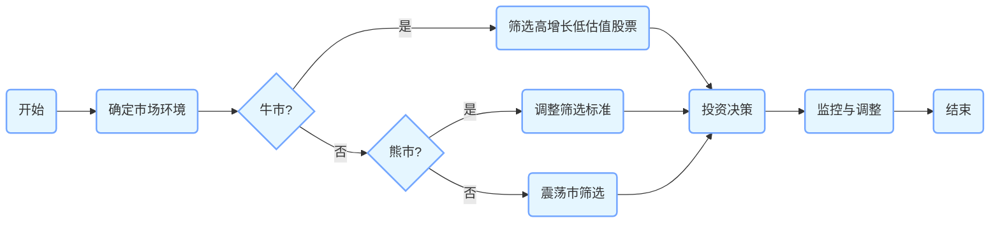

# 彼得林奇的"高增长低估值"在不同市场环境下的筛选

> 关键词：彼得林奇、高增长低估值、市场环境、筛选策略、股票投资

> 摘要：本文深入探讨了彼得林奇“高增长低估值”投资理念在不同市场环境下的筛选方法。首先介绍了相关背景知识，包括目的、预期读者、文档结构和术语表。接着阐述了核心概念及其联系，通过示意图和流程图进行清晰展示。详细讲解了核心算法原理和具体操作步骤，并结合Python代码示例。同时给出了数学模型和公式，辅以实际案例说明。通过项目实战，展示了代码的实际应用和详细解读。分析了该理念在不同市场环境下的实际应用场景，推荐了相关的学习资源、开发工具和论文著作。最后总结了未来发展趋势与挑战，提供了常见问题解答和扩展阅读参考资料，旨在为投资者在不同市场环境下运用“高增长低估值”策略提供全面而深入的指导。

## 1. 背景介绍 
### 1.1 目的和范围
彼得林奇是投资界的传奇人物，他的“高增长低估值”投资策略影响深远。本文章的目的在于深入剖析该策略在不同市场环境（如牛市、熊市、震荡市等）下的筛选方法，帮助投资者更好地运用这一策略进行股票投资决策。文章的范围涵盖了从核心概念的讲解到实际应用案例的分析，以及相关工具和资源的推荐，旨在为读者提供一个全面且深入的学习和实践指南。

### 1.2 预期读者
本文预期读者主要包括对股票投资感兴趣的个人投资者、金融从业者、投资研究人员等。无论是初学者希望了解基本的投资理念和筛选方法，还是有一定经验的投资者想要优化自己的投资策略，都能从本文中获得有价值的信息。

### 1.3 文档结构概述
本文将按照以下结构展开：首先介绍核心概念与联系，通过示意图和流程图直观呈现“高增长低估值”的原理和架构；接着详细讲解核心算法原理和具体操作步骤，并给出Python代码示例；然后阐述相关的数学模型和公式，结合实际例子加深理解；通过项目实战展示代码的实际应用和详细解读；分析该策略在不同市场环境下的实际应用场景；推荐相关的学习资源、开发工具和论文著作；最后总结未来发展趋势与挑战，提供常见问题解答和扩展阅读参考资料。

### 1.4 术语表
#### 1.4.1 核心术语定义
- **高增长低估值**：指公司具有较高的盈利增长速度，同时其股票价格相对其内在价值被低估，具有较高的投资性价比。
- **市盈率（PE）**：股票价格除以每股收益的比率，反映了市场对公司盈利的预期和估值水平。
- **市净率（PB）**：股票价格除以每股净资产的比率，用于衡量公司的市场价值与账面价值的关系。
- **净利润增长率**：公司净利润在一定时期内的增长比例，反映了公司的盈利能力和发展潜力。

#### 1.4.2 相关概念解释
- **市场环境**：包括牛市、熊市和震荡市等不同的市场状态。牛市是指市场整体上涨，投资者情绪乐观；熊市则是市场整体下跌，投资者情绪悲观；震荡市是指市场价格在一定区间内波动，没有明显的上涨或下跌趋势。
- **估值指标**：除了市盈率和市净率，还包括市销率（PS）、企业价值倍数（EV/EBITDA）等，用于评估公司的市场价值和投资价值。
- **增长指标**：除了净利润增长率，还包括营业收入增长率、净资产收益率（ROE）等，用于衡量公司的增长能力和盈利能力。

#### 1.4.3 缩略词列表
- **PE**：市盈率（Price-to-Earnings Ratio）
- **PB**：市净率（Price-to-Book Ratio）
- **PS**：市销率（Price-to-Sales Ratio）
- **EV/EBITDA**：企业价值倍数（Enterprise Value to Earnings Before Interest, Taxes, Depreciation and Amortization）
- **ROE**：净资产收益率（Return on Equity）

## 2. 核心概念与联系 

### 核心概念原理
“高增长低估值”策略的核心思想是寻找那些具有较高盈利增长潜力，同时股票价格相对较低的公司。高增长意味着公司的业务处于快速发展阶段，未来有望创造更多的利润；低估值则表示市场对公司的价值存在低估，股票价格具有上涨的空间。通过投资这类公司，投资者可以在获得公司成长收益的同时，享受估值修复带来的股价上涨。

### 架构的文本示意图
```plaintext
高增长低估值策略
|
|-- 增长指标
|   |-- 净利润增长率
|   |-- 营业收入增长率
|   |-- 净资产收益率
|
|-- 估值指标
|   |-- 市盈率
|   |-- 市净率
|   |-- 市销率
|
|-- 市场环境因素
|   |-- 牛市
|   |-- 熊市
|   |-- 震荡市
```

### Mermaid 流程图


## 3. 核心算法原理 & 具体操作步骤 

### 核心算法原理
核心算法的目标是根据增长指标和估值指标筛选出符合“高增长低估值”条件的股票。具体步骤如下：
1. 收集公司的财务数据，包括净利润、营业收入、净资产等。
2. 计算增长指标和估值指标，如净利润增长率、市盈率、市净率等。
3. 根据市场环境设定筛选标准，如在牛市中可以适当提高增长指标的要求，在熊市中可以降低估值指标的要求。
4. 筛选出符合标准的股票。

### 具体操作步骤及 Python 代码示例
```python
import pandas as pd

# 模拟收集公司财务数据
data = {
    '公司名称': ['A公司', 'B公司', 'C公司', 'D公司'],
    '净利润': [100, 200, 150, 300],
    '营业收入': [1000, 2000, 1500, 3000],
    '净资产': [500, 1000, 750, 1500],
    '股价': [10, 20, 15, 30]
}
df = pd.DataFrame(data)

# 计算增长指标和估值指标
# 假设上一年净利润数据
last_year_net_profit = [80, 150, 120, 250]
df['净利润增长率'] = (df['净利润'] - last_year_net_profit) / last_year_net_profit
df['市盈率'] = df['股价'] / (df['净利润'] / len(df))
df['市净率'] = df['股价'] / (df['净资产'] / len(df))

# 设定筛选标准
# 假设在牛市中，净利润增长率大于 20%，市盈率小于 20
bull_market_condition = (df['净利润增长率'] > 0.2) & (df['市盈率'] < 20)
bull_market_stocks = df[bull_market_condition]

print("牛市筛选结果：")
print(bull_market_stocks)
```

### 代码解释
1. 首先，使用`pandas`库模拟收集公司的财务数据，包括净利润、营业收入、净资产和股价。
2. 计算净利润增长率、市盈率和市净率等指标。
3. 根据牛市的筛选标准，即净利润增长率大于 20%，市盈率小于 20，筛选出符合条件的股票。
4. 最后打印出筛选结果。

## 4. 数学模型和公式 & 详细讲解 & 举例说明 

### 增长指标公式
- **净利润增长率**：
$$净利润增长率 = \frac{本期净利润 - 上期净利润}{上期净利润}$$
例如，某公司上期净利润为 100 万元，本期净利润为 120 万元，则净利润增长率为：
$$\frac{120 - 100}{100} = 0.2 = 20\%$$

- **营业收入增长率**：
$$营业收入增长率 = \frac{本期营业收入 - 上期营业收入}{上期营业收入}$$
假设某公司上期营业收入为 500 万元，本期营业收入为 600 万元，则营业收入增长率为：
$$\frac{600 - 500}{500} = 0.2 = 20\%$$

- **净资产收益率（ROE）**：
$$ROE = \frac{净利润}{净资产} \times 100\%$$
若某公司净利润为 200 万元，净资产为 1000 万元，则 ROE 为：
$$\frac{200}{1000} \times 100\% = 20\%$$

### 估值指标公式
- **市盈率（PE）**：
$$PE = \frac{股价}{每股收益}$$
假设某股票股价为 20 元，每股收益为 2 元，则市盈率为：
$$\frac{20}{2} = 10$$

- **市净率（PB）**：
$$PB = \frac{股价}{每股净资产}$$
若某股票股价为 15 元，每股净资产为 5 元，则市净率为：
$$\frac{15}{5} = 3$$

- **市销率（PS）**：
$$PS = \frac{股价}{每股营业收入}$$
假设某股票股价为 30 元，每股营业收入为 10 元，则市销率为：
$$\frac{30}{10} = 3$$

### 举例说明
以 A 公司为例，假设其股价为 25 元，每股收益为 2 元，每股净资产为 10 元，每股营业收入为 15 元，上期净利润为 1000 万元，本期净利润为 1200 万元。则：
- 净利润增长率：
$$\frac{1200 - 1000}{1000} = 0.2 = 20\%$$
- 市盈率：
$$\frac{25}{2} = 12.5$$
- 市净率：
$$\frac{25}{10} = 2.5$$
- 市销率：
$$\frac{25}{15} \approx 1.67$$

从这些指标可以看出，A 公司具有一定的增长潜力（净利润增长率为 20%），同时估值相对较低（市盈率为 12.5，市净率为 2.5），可能符合“高增长低估值”的筛选标准。

## 5. 项目实战：代码实际案例和详细解释说明 

### 5.1 开发环境搭建
- **操作系统**：Windows、Linux 或 macOS 均可。
- **Python 版本**：建议使用 Python 3.7 及以上版本。
- **安装必要的库**：使用`pip`安装`pandas`、`numpy`等库。
```bash
pip install pandas numpy
```

### 5.2 源代码详细实现和代码解读
```python
import pandas as pd
import numpy as np

# 从 CSV 文件中读取公司财务数据
def read_financial_data(file_path):
    df = pd.read_csv(file_path)
    return df

# 计算增长指标和估值指标
def calculate_metrics(df):
    # 假设上一年数据在新列中
    df['净利润增长率'] = (df['净利润'] - df['上一年净利润']) / df['上一年净利润']
    df['市盈率'] = df['股价'] / (df['净利润'] / len(df))
    df['市净率'] = df['股价'] / (df['净资产'] / len(df))
    return df

# 根据市场环境筛选股票
def screen_stocks(df, market_environment):
    if market_environment == '牛市':
        condition = (df['净利润增长率'] > 0.3) & (df['市盈率'] < 25)
    elif market_environment == '熊市':
        condition = (df['净利润增长率'] > 0.1) & (df['市盈率'] < 15)
    elif market_environment == '震荡市':
        condition = (df['净利润增长率'] > 0.2) & (df['市盈率'] < 20)
    else:
        print("无效的市场环境")
        return pd.DataFrame()
    screened_stocks = df[condition]
    return screened_stocks

# 主函数
def main():
    file_path = 'financial_data.csv'
    df = read_financial_data(file_path)
    df = calculate_metrics(df)
    market_environment = '牛市'
    result = screen_stocks(df, market_environment)
    print("筛选结果：")
    print(result)

if __name__ == "__main__":
    main()
```

### 代码解读与分析
1. **`read_financial_data`函数**：从 CSV 文件中读取公司的财务数据，包括净利润、上一年净利润、股价、净资产等。
2. **`calculate_metrics`函数**：计算净利润增长率、市盈率和市净率等指标。
3. **`screen_stocks`函数**：根据不同的市场环境（牛市、熊市、震荡市）设定不同的筛选标准，筛选出符合条件的股票。
4. **`main`函数**：调用上述函数，完成数据读取、指标计算和股票筛选，并打印筛选结果。

## 6. 实际应用场景 

### 牛市环境
在牛市中，市场整体上涨，投资者情绪乐观，资金大量涌入股市。此时，“高增长低估值”策略可以帮助投资者筛选出那些具有较高增长潜力，但估值相对较低的股票。这些股票在牛市中往往有更大的上涨空间，因为随着市场的上涨，其估值会逐渐得到修复，同时公司的高增长也会推动股价进一步上涨。例如，在科技股牛市中，一些新兴科技公司虽然具有较高的净利润增长率，但由于市场对其未来发展存在一定的不确定性，其市盈率可能相对较低。通过“高增长低估值”策略筛选出这些公司的股票，投资者可以在牛市中获得较高的收益。

### 熊市环境
在熊市中，市场整体下跌，投资者情绪悲观，资金大量流出股市。此时，“高增长低估值”策略的重点是寻找那些具有较强抗风险能力和稳定增长的公司。由于市场整体估值下降，一些优质公司的股票价格也会受到影响，但这些公司的基本面并没有发生实质性变化，仍然具有较高的盈利增长潜力。通过降低估值指标的要求，筛选出那些净利润增长率稳定且市盈率较低的股票，投资者可以在熊市中找到相对安全的投资标的，等待市场反转时获得收益。例如，一些消费类公司在熊市中往往具有较强的抗风险能力，其业绩相对稳定，通过“高增长低估值”策略筛选出这些公司的股票，可以在一定程度上降低投资风险。

### 震荡市环境
在震荡市中，市场价格在一定区间内波动，没有明显的上涨或下跌趋势。此时，“高增长低估值”策略可以帮助投资者筛选出那些具有独立行情的股票。这些股票不受市场整体波动的影响，其股价主要由公司的基本面决定。通过筛选出净利润增长率较高且估值合理的股票，投资者可以在震荡市中获得超额收益。例如，一些细分行业的龙头公司在震荡市中往往能够凭借其强大的竞争力和稳定的业绩实现股价的上涨，通过“高增长低估值”策略筛选出这些公司的股票，可以在震荡市中获得较好的投资回报。

## 7. 工具和资源推荐

### 7.1 学习资源推荐
#### 7.1.1 书籍推荐
- 《彼得林奇的成功投资》：彼得林奇的经典著作，详细介绍了他的投资理念和方法，包括“高增长低估值”策略的应用。
- 《聪明的投资者》：本杰明·格雷厄姆的著作，被誉为投资界的圣经，阐述了价值投资的基本原理和方法，对理解“高增长低估值”策略有很大帮助。
- 《财务报表分析与股票估值》：介绍了如何通过分析公司的财务报表来评估公司的价值，为运用“高增长低估值”策略提供了重要的工具和方法。

#### 7.1.2 在线课程
- Coursera 上的“投资学原理”：由知名大学教授授课，系统介绍了投资学的基本原理和方法，包括股票投资策略的讲解。
- 网易云课堂上的“财务报表分析实战”：通过实际案例讲解如何分析公司的财务报表，帮助投资者更好地理解公司的基本面。

#### 7.1.3 技术博客和网站
- 雪球网：国内知名的投资社区，汇聚了众多投资者和投资专家，提供了丰富的股票分析和投资策略分享。
- 东方财富网：提供全面的财经信息和股票数据，包括公司财务报表、估值指标等，方便投资者进行数据查询和分析。

### 7.2 开发工具框架推荐
#### 7.2.1 IDE和编辑器
- PyCharm：一款专业的 Python 集成开发环境，提供了丰富的代码编辑、调试和项目管理功能，适合开发股票筛选程序。
- Jupyter Notebook：一个交互式的开发环境，支持 Python 代码的编写和运行，方便进行数据探索和分析。

#### 7.2.2 调试和性能分析工具
- pdb：Python 自带的调试工具，可以帮助开发者定位代码中的错误。
- cProfile：Python 内置的性能分析工具，可以分析代码的运行时间和资源消耗情况，帮助优化代码性能。

#### 7.2.3 相关框架和库
- pandas：用于数据处理和分析的 Python 库，提供了丰富的数据结构和数据操作方法，方便处理公司财务数据。
- numpy：用于科学计算的 Python 库，提供了高效的数组操作和数学函数，支持数据的快速计算。

### 7.3 相关论文著作推荐
#### 7.3.1 经典论文
- 《有效市场假说》：阐述了市场效率的概念和分类，对理解股票市场的定价机制有重要意义。
- 《资本资产定价模型》：提出了资产定价的基本模型，为股票投资的风险和收益分析提供了理论基础。

#### 7.3.2 最新研究成果
- 关注顶尖金融学术期刊，如《Journal of Finance》《Review of Financial Studies》等，了解关于股票投资策略和市场环境分析的最新研究成果。

#### 7.3.3 应用案例分析
- 一些金融研究机构和咨询公司会发布关于股票投资策略的应用案例分析报告，通过阅读这些报告可以了解“高增长低估值”策略在实际应用中的效果和方法。

## 8. 总结：未来发展趋势与挑战

### 未来发展趋势
- **数据驱动的投资决策**：随着信息技术的发展，投资者可以获取更多的公司财务数据和市场信息。未来，“高增长低估值”策略将更加依赖于数据的分析和挖掘，通过大数据和人工智能技术，投资者可以更准确地筛选出符合条件的股票。
- **跨市场和跨资产类别的应用**：“高增长低估值”策略不仅可以应用于股票市场，还可以扩展到其他金融市场和资产类别，如债券、期货、基金等。通过跨市场和跨资产类别的投资，可以降低投资风险，提高投资收益。
- **与可持续投资的结合**：随着社会对可持续发展的关注度不断提高，投资者越来越注重公司的环境、社会和治理（ESG）表现。未来，“高增长低估值”策略可能会与可持续投资相结合，筛选出那些具有高增长潜力、低估值且 ESG 表现良好的公司。

### 挑战
- **数据质量和可靠性**：准确的财务数据是运用“高增长低估值”策略的基础，但数据质量和可靠性可能存在问题。一些公司可能会进行财务造假，导致数据失真，影响投资者的决策。
- **市场环境的复杂性**：市场环境是复杂多变的，不同的市场环境对“高增长低估值”策略的筛选标准和效果有不同的影响。投资者需要不断调整策略，以适应市场环境的变化。
- **竞争激烈**：“高增长低估值”策略是一种被广泛应用的投资策略，市场上存在大量的投资者采用该策略进行投资。这导致符合条件的股票可能会被过度追捧，从而导致估值上升，降低投资收益。

## 9. 附录：常见问题与解答

### 问题 1：如何确定市场环境是牛市、熊市还是震荡市？
答：可以通过观察市场指数的走势、成交量、投资者情绪等因素来判断市场环境。一般来说，当市场指数持续上涨，成交量放大，投资者情绪乐观时，可能处于牛市；当市场指数持续下跌，成交量萎缩，投资者情绪悲观时，可能处于熊市；当市场指数在一定区间内波动，成交量不稳定时，可能处于震荡市。

### 问题 2：筛选标准是否可以根据个人风险偏好进行调整？
答：可以。筛选标准可以根据个人的风险偏好、投资目标和投资经验进行调整。例如，风险偏好较高的投资者可以适当提高增长指标的要求，降低估值指标的要求；风险偏好较低的投资者可以降低增长指标的要求，提高估值指标的要求。

### 问题 3：如何获取准确的公司财务数据？
答：可以通过证券交易所的官方网站、公司的官方网站、金融数据提供商（如东方财富、同花顺等）获取公司的财务数据。在使用数据时，要注意数据的来源和准确性，避免使用不可靠的数据。

### 问题 4：“高增长低估值”策略是否适用于所有类型的股票？
答：不是。“高增长低估值”策略更适用于那些具有稳定盈利增长和合理估值的股票，如蓝筹股、成长股等。对于一些业绩不稳定、估值过高或过低的股票，该策略可能不适用。

## 10. 扩展阅读 & 参考资料
- 《证券分析》，本杰明·格雷厄姆著
- 《战胜华尔街》，彼得林奇著
- 东方财富网：https://www.eastmoney.com/
- 雪球网：https://xueqiu.com/

作者：AI天才研究院/AI Genius Institute & 禅与计算机程序设计艺术 /Zen And The Art of Computer Programming