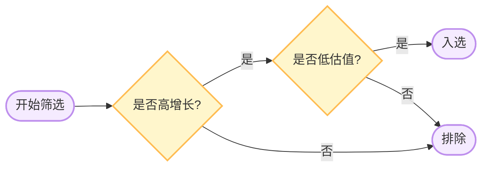

# 彼得林奇的"高增长低估值"在不同行业周期中的筛选

> 关键词：彼得林奇、高增长低估值、行业周期、筛选策略、股票投资

> 摘要：本文围绕彼得林奇的“高增长低估值”理念，深入探讨其在不同行业周期中的筛选方法。首先介绍了相关背景知识，包括目的范围、预期读者等内容。接着阐述核心概念及联系，详细讲解核心算法原理与操作步骤，并运用数学模型和公式进行说明。通过项目实战给出代码案例及解读，分析实际应用场景。同时推荐了学习工具和资源，最后总结未来发展趋势与挑战，解答常见问题并提供扩展阅读和参考资料，旨在为投资者在不同行业周期中运用该策略筛选优质股票提供全面且深入的指导。

## 1. 背景介绍 
### 1.1 目的和范围
本文章的主要目的是深入研究彼得林奇提出的“高增长低估值”投资理念，并详细探讨如何在不同的行业周期中运用这一理念进行股票筛选。通过系统的分析和实际案例的讲解，帮助投资者更好地理解和应用该策略，提高投资决策的准确性和成功率。

文章的范围涵盖了对“高增长低估值”概念的解释、不同行业周期的特点分析、筛选策略的具体实施步骤、数学模型的构建以及实际项目中的代码实现和应用场景分析。同时，还会推荐相关的学习工具、资源和研究论文，为读者提供全面的知识体系。

### 1.2 预期读者
本文预期的读者主要包括以下几类人群：
- **个人投资者**：希望通过学习专业的投资策略，提高自己的投资水平，在股票市场中获取更好的收益。
- **金融从业者**：如股票分析师、基金经理等，需要深入了解不同的投资理念和筛选方法，为客户提供更优质的投资建议。
- **金融专业学生**：通过阅读本文，加深对投资学理论和实践的理解，为未来的职业发展打下坚实的基础。
- **对金融投资感兴趣的爱好者**：想要了解股票投资的基本原理和方法，丰富自己的金融知识。

### 1.3 文档结构概述
本文将按照以下结构进行组织：
- **核心概念与联系**：介绍“高增长低估值”的核心概念、原理和架构，并通过文本示意图和 Mermaid 流程图进行直观展示。
- **核心算法原理 & 具体操作步骤**：详细讲解筛选策略的核心算法原理，并使用 Python 源代码进行阐述。
- **数学模型和公式 & 详细讲解 & 举例说明**：构建数学模型和公式，对筛选策略进行量化分析，并通过具体例子进行说明。
- **项目实战：代码实际案例和详细解释说明**：给出实际项目中的代码案例，对代码进行详细解读和分析。
- **实际应用场景**：分析“高增长低估值”策略在不同行业周期中的实际应用场景。
- **工具和资源推荐**：推荐相关的学习工具、资源和研究论文。
- **总结：未来发展趋势与挑战**：总结“高增长低估值”策略的未来发展趋势和面临的挑战。
- **附录：常见问题与解答**：解答读者在学习和应用过程中常见的问题。
- **扩展阅读 & 参考资料**：提供相关的扩展阅读材料和参考资料。

### 1.4 术语表
#### 1.4.1 核心术语定义
- **高增长低估值**：指公司的业绩具有较高的增长速度，同时其股票价格相对其内在价值被低估。
- **行业周期**：指一个行业从诞生、成长、成熟到衰退的整个过程，通常分为初创期、成长期、成熟期和衰退期四个阶段。
- **市盈率（PE）**：指股票价格除以每股收益的比率，反映了市场对公司盈利的预期。
- **市净率（PB）**：指股票价格除以每股净资产的比率，反映了市场对公司净资产的估值。
- **净利润增长率**：指公司净利润在一定时期内的增长幅度，反映了公司的盈利能力和发展潜力。

#### 1.4.2 相关概念解释
- **成长股**：指那些业绩具有较高增长速度的股票，通常处于行业的成长期。
- **价值股**：指那些股票价格相对其内在价值被低估的股票，通常具有稳定的现金流和较高的股息率。
- **行业轮动**：指在不同的经济周期和市场环境下，不同行业的表现会出现轮动现象，投资者可以通过把握行业轮动的规律来获取超额收益。

#### 1.4.3 缩略词列表
- **PE**：市盈率（Price-to-Earnings Ratio）
- **PB**：市净率（Price-to-Book Ratio）
- **EPS**：每股收益（Earnings Per Share）

## 2. 核心概念与联系 
### 核心概念原理
彼得林奇的“高增长低估值”理念基于这样一个基本原理：在股票市场中，存在一些公司，它们的业绩具有较高的增长速度，但由于市场的短期波动或其他因素，其股票价格相对其内在价值被低估。这些公司往往具有较大的投资价值，因为随着公司业绩的不断增长，其股票价格最终会回归到其内在价值，从而为投资者带来丰厚的回报。

### 核心概念架构
核心概念架构可以用以下文本示意图表示：

```plaintext
高增长低估值
|-- 高增长
|   |-- 净利润增长率高
|   |-- 营业收入增长率高
|-- 低估值
|   |-- 市盈率低
|   |-- 市净率低
```

### Mermaid 流程图


该流程图展示了“高增长低估值”筛选的基本流程：首先判断公司是否具有高增长的特征，如果是，则进一步判断是否具有低估值的特征。如果同时满足高增长和低估值的条件，则入选；否则，排除。

## 3. 核心算法原理 & 具体操作步骤 
### 核心算法原理
“高增长低估值”筛选策略的核心算法原理是通过对公司的财务指标进行分析，筛选出那些具有高增长和低估值特征的公司。具体来说，主要考虑以下几个财务指标：
- **净利润增长率**：反映了公司的盈利能力和发展潜力，净利润增长率越高，说明公司的业绩增长越快。
- **营业收入增长率**：反映了公司的市场份额和业务拓展能力，营业收入增长率越高，说明公司的业务发展越好。
- **市盈率（PE）**：反映了市场对公司盈利的预期，市盈率越低，说明市场对公司的估值越低。
- **市净率（PB）**：反映了市场对公司净资产的估值，市净率越低，说明市场对公司的净资产估值越低。

### 具体操作步骤
以下是使用 Python 实现“高增长低估值”筛选策略的具体操作步骤和代码示例：

```python
import pandas as pd

# 假设我们有一个包含公司财务数据的 DataFrame
data = {
    '公司名称': ['公司A', '公司B', '公司C', '公司D'],
    '净利润增长率': [0.2, 0.3, 0.1, 0.4],
    '营业收入增长率': [0.15, 0.25, 0.1, 0.3],
    '市盈率': [10, 15, 20, 8],
    '市净率': [1.5, 2, 2.5, 1]
}

df = pd.DataFrame(data)

# 设定筛选条件
净利润增长率阈值 = 0.2
营业收入增长率阈值 = 0.2
市盈率阈值 = 15
市净率阈值 = 2

# 筛选出满足条件的公司
筛选结果 = df[
    (df['净利润增长率'] >= 净利润增长率阈值) &
    (df['营业收入增长率'] >= 营业收入增长率阈值) &
    (df['市盈率'] <= 市盈率阈值) &
    (df['市净率'] <= 市净率阈值)
]

print(筛选结果)
```

### 代码解释
1. **数据准备**：首先，我们创建了一个包含公司财务数据的 DataFrame，其中包括公司名称、净利润增长率、营业收入增长率、市盈率和市净率。
2. **设定筛选条件**：根据“高增长低估值”的理念，我们设定了净利润增长率、营业收入增长率、市盈率和市净率的阈值。
3. **筛选操作**：使用 Pandas 的布尔索引功能，筛选出满足所有条件的公司。
4. **输出结果**：打印筛选结果，即那些同时满足高增长和低估值条件的公司。

## 4. 数学模型和公式 & 详细讲解 & 举例说明 
### 数学模型和公式
为了更准确地评估公司的“高增长低估值”特征，我们可以构建以下数学模型和公式：

#### 综合评分公式
我们可以为每个财务指标赋予一定的权重，然后计算综合评分。假设净利润增长率、营业收入增长率、市盈率和市净率的权重分别为 $w_1$、$w_2$、$w_3$ 和 $w_4$，且 $w_1 + w_2 + w_3 + w_4 = 1$。则综合评分 $S$ 的计算公式为：

$$S = w_1 \times \frac{净利润增长率}{最大净利润增长率} + w_2 \times \frac{营业收入增长率}{最大营业收入增长率} - w_3 \times \frac{市盈率}{最大市盈率} - w_4 \times \frac{市净率}{最大市净率}$$

#### 筛选阈值
设定一个综合评分阈值 $T$，当公司的综合评分 $S$ 大于等于 $T$ 时，认为该公司符合“高增长低估值”的条件。

### 详细讲解
- **权重分配**：权重的分配可以根据投资者的偏好和市场情况进行调整。例如，如果投资者更注重公司的盈利能力，可以适当提高净利润增长率的权重；如果更注重公司的市场估值，可以适当提高市盈率和市净率的权重。
- **归一化处理**：为了消除不同财务指标之间的量纲差异，我们将每个财务指标除以其最大值，进行归一化处理。
- **综合评分计算**：综合评分 $S$ 越高，说明公司的“高增长低估值”特征越明显。

### 举例说明
假设我们有以下三家公司的财务数据：

| 公司名称 | 净利润增长率 | 营业收入增长率 | 市盈率 | 市净率 |
| ---- | ---- | ---- | ---- | ---- |
| 公司 X | 0.2 | 0.15 | 10 | 1.5 |
| 公司 Y | 0.3 | 0.25 | 15 | 2 |
| 公司 Z | 0.1 | 0.1 | 20 | 2.5 |

假设权重分配为 $w_1 = 0.3$，$w_2 = 0.2$，$w_3 = 0.3$，$w_4 = 0.2$，最大净利润增长率为 0.3，最大营业收入增长率为 0.25，最大市盈率为 20，最大市净率为 2.5。

则三家公司的综合评分计算如下：

- **公司 X**：
  - 净利润增长率得分：$0.3 \times \frac{0.2}{0.3} = 0.2$
  - 营业收入增长率得分：$0.2 \times \frac{0.15}{0.25} = 0.12$
  - 市盈率得分：$-0.3 \times \frac{10}{20} = -0.15$
  - 市净率得分：$-0.2 \times \frac{1.5}{2.5} = -0.12$
  - 综合评分：$0.2 + 0.12 - 0.15 - 0.12 = 0.05$

- **公司 Y**：
  - 净利润增长率得分：$0.3 \times \frac{0.3}{0.3} = 0.3$
  - 营业收入增长率得分：$0.2 \times \frac{0.25}{0.25} = 0.2$
  - 市盈率得分：$-0.3 \times \frac{15}{20} = -0.225$
  - 市净率得分：$-0.2 \times \frac{2}{2.5} = -0.16$
  - 综合评分：$0.3 + 0.2 - 0.225 - 0.16 = 0.115$

- **公司 Z**：
  - 净利润增长率得分：$0.3 \times \frac{0.1}{0.3} = 0.1$
  - 营业收入增长率得分：$0.2 \times \frac{0.1}{0.25} = 0.08$
  - 市盈率得分：$-0.3 \times \frac{20}{20} = -0.3$
  - 市净率得分：$-0.2 \times \frac{2.5}{2.5} = -0.2$
  - 综合评分：$0.1 + 0.08 - 0.3 - 0.2 = -0.32$

假设筛选阈值 $T = 0.1$，则只有公司 Y 符合“高增长低估值”的条件。

## 5. 项目实战：代码实际案例和详细解释说明 
### 5.1  开发环境搭建
在进行项目实战之前，我们需要搭建相应的开发环境。以下是具体的步骤：

#### 安装 Python
首先，需要安装 Python 环境。可以从 Python 官方网站（https://www.python.org/downloads/）下载适合自己操作系统的 Python 版本，并按照安装向导进行安装。

#### 安装必要的库
我们需要安装一些必要的 Python 库，如 Pandas、Numpy 等。可以使用以下命令进行安装：

```sh
pip install pandas numpy
```

### 5.2  源代码详细实现和代码解读
以下是一个完整的 Python 代码示例，用于实现“高增长低估值”筛选策略：

```python
import pandas as pd
import numpy as np

# 模拟获取公司财务数据
def get_financial_data():
    data = {
        '公司名称': ['公司A', '公司B', '公司C', '公司D', '公司E'],
        '净利润增长率': [0.2, 0.3, 0.1, 0.4, 0.25],
        '营业收入增长率': [0.15, 0.25, 0.1, 0.3, 0.2],
        '市盈率': [10, 15, 20, 8, 12],
        '市净率': [1.5, 2, 2.5, 1, 1.8]
    }
    return pd.DataFrame(data)

# 计算综合评分
def calculate_score(df, weights):
    max_净利润增长率 = df['净利润增长率'].max()
    max_营业收入增长率 = df['营业收入增长率'].max()
    max_市盈率 = df['市盈率'].max()
    max_市净率 = df['市净率'].max()

    df['综合评分'] = (
        weights[0] * (df['净利润增长率'] / max_净利润增长率) +
        weights[1] * (df['营业收入增长率'] / max_营业收入增长率) -
        weights[2] * (df['市盈率'] / max_市盈率) -
        weights[3] * (df['市净率'] / max_市净率)
    )
    return df

# 筛选符合条件的公司
def filter_companies(df, threshold):
    return df[df['综合评分'] >= threshold]

# 主函数
def main():
    # 获取财务数据
    df = get_financial_data()

    # 设定权重
    weights = [0.3, 0.2, 0.3, 0.2]

    # 计算综合评分
    df = calculate_score(df, weights)

    # 设定筛选阈值
    threshold = 0.1

    # 筛选符合条件的公司
    result = filter_companies(df, threshold)

    print("筛选结果：")
    print(result[['公司名称', '综合评分']])

if __name__ == "__main__":
    main()
```

### 代码解读
1. **获取财务数据**：`get_financial_data` 函数模拟获取公司的财务数据，并返回一个 Pandas DataFrame。
2. **计算综合评分**：`calculate_score` 函数根据前面介绍的综合评分公式，计算每个公司的综合评分，并将结果添加到 DataFrame 中。
3. **筛选符合条件的公司**：`filter_companies` 函数根据设定的筛选阈值，筛选出综合评分大于等于阈值的公司。
4. **主函数**：`main` 函数调用上述函数，完成数据获取、综合评分计算和筛选操作，并打印筛选结果。

### 5.3  代码解读与分析
- **数据处理**：使用 Pandas 库进行数据处理，方便进行数据的读取、存储和分析。
- **评分计算**：通过归一化处理和加权求和的方式，计算每个公司的综合评分，避免了不同财务指标之间的量纲差异。
- **筛选操作**：根据设定的筛选阈值，筛选出符合“高增长低估值”条件的公司，提高了筛选的准确性和效率。

## 6. 实际应用场景 
### 初创期行业
在初创期行业中，大部分公司处于业务探索和市场开拓阶段，盈利能力和市场估值都相对较低。此时，“高增长低估值”策略的应用需要更加谨慎。可以关注那些具有独特技术或创新商业模式的公司，虽然它们可能目前的业绩增长不明显，但具有较大的发展潜力。例如，在人工智能、区块链等新兴技术领域，一些初创公司可能处于亏损状态，但如果其技术具有领先优势，未来有望实现高速增长，就可以纳入筛选范围。

### 成长期行业
成长期行业是“高增长低估值”策略的理想应用场景。在这个阶段，行业整体呈现出快速发展的态势，公司的业绩增长迅速。投资者可以通过筛选那些净利润增长率和营业收入增长率较高，同时市盈率和市净率相对较低的公司，获取较高的投资回报。例如，在新能源汽车行业的成长期，一些具有核心技术和市场份额的企业，其业绩增长强劲，但由于市场竞争激烈，部分公司的估值可能被低估，此时运用该策略进行筛选可以发现优质的投资标的。

### 成熟期行业
在成熟期行业中，行业增长速度放缓，市场竞争激烈，公司的业绩增长相对稳定。此时，“高增长低估值”策略的重点可以放在那些具有稳定现金流和较高股息率的公司上。这些公司虽然业绩增长可能不如成长期公司，但由于其估值较低，具有一定的安全边际。例如，在传统制造业、公用事业等行业，一些大型企业具有稳定的盈利能力和较低的估值，适合采用该策略进行筛选。

### 衰退期行业
衰退期行业的整体发展趋势向下，公司的业绩和估值都面临较大的压力。在这个阶段，“高增长低估值”策略的应用难度较大。不过，也可以关注那些正在进行业务转型或重组的公司，它们有可能通过变革实现业绩的反转。例如，一些传统煤炭企业通过向新能源领域转型，有可能重新获得增长动力，投资者可以通过筛选寻找这类具有转型潜力的公司。

## 7. 工具和资源推荐
### 7.1 学习资源推荐
#### 7.1.1 书籍推荐
- 《彼得·林奇的成功投资》：彼得·林奇的经典著作，详细介绍了他的投资理念和方法，对于理解“高增长低估值”策略具有重要的指导意义。
- 《聪明的投资者》：本杰明·格雷厄姆的代表作，被誉为投资界的圣经，书中阐述了价值投资的基本原理和方法。
- 《财务报表分析与证券定价》：全面介绍了财务报表分析的方法和技巧，对于理解公司的财务状况和估值具有重要的帮助。

#### 7.1.2 在线课程
- Coursera 上的“投资学原理”：由知名高校教授授课，系统介绍了投资学的基本理论和方法。
- 网易云课堂上的“股票投资实战技巧”：结合实际案例，讲解股票投资的实战技巧和策略。

#### 7.1.3 技术博客和网站
- 雪球网：国内知名的投资交流社区，提供丰富的股票分析和投资观点。
- 东方财富网：提供全面的金融信息和数据，包括股票行情、财务报表等。

### 7.2 开发工具框架推荐
#### 7.2.1 IDE和编辑器
- PyCharm：一款专业的 Python 集成开发环境，具有强大的代码编辑、调试和项目管理功能。
- Jupyter Notebook：一个交互式的编程环境，适合进行数据探索和分析。

#### 7.2.2 调试和性能分析工具
- pdb：Python 自带的调试工具，可以帮助开发者定位代码中的问题。
- cProfile：Python 标准库中的性能分析工具，可以分析代码的运行时间和性能瓶颈。

#### 7.2.3 相关框架和库
- Pandas：用于数据处理和分析的 Python 库，提供了丰富的数据结构和函数。
- Numpy：用于科学计算的 Python 库，提供了高效的数组操作和数学函数。

### 7.3 相关论文著作推荐
#### 7.3.1 经典论文
- Fama, Eugene F., and Kenneth R. French. "The Cross-Section of Expected Stock Returns." The Journal of Finance 47.2 (1992): 427-465. 该论文提出了著名的 Fama-French 三因子模型，对于理解股票收益率的影响因素具有重要的意义。
- Sharpe, William F. "Capital Asset Prices: A Theory of Market Equilibrium under Conditions of Risk." The Journal of Finance 19.3 (1964): 425-442. 该论文提出了资本资产定价模型（CAPM），为资产定价提供了重要的理论基础。

#### 7.3.2 最新研究成果
- 在 SSRN（社会科学研究网络）上可以搜索到关于股票投资策略和行业周期研究的最新论文。例如，一些研究探讨了在不同经济环境下“高增长低估值”策略的有效性和优化方法。

#### 7.3.3 应用案例分析
- 《金融研究》《证券市场导报》等学术期刊上经常发表关于股票投资策略应用案例的文章，可以从中了解“高增长低估值”策略在实际投资中的应用情况和效果。

## 8. 总结：未来发展趋势与挑战
### 未来发展趋势
- **智能化筛选**：随着人工智能和机器学习技术的发展，未来的筛选策略将更加智能化。可以利用深度学习算法对大量的财务数据和市场信息进行分析，挖掘出更有价值的投资机会。
- **多维度分析**：除了传统的财务指标，未来的筛选策略将更加注重多维度分析。例如，考虑公司的创新能力、社会责任、行业竞争力等因素，综合评估公司的投资价值。
- **跨行业应用**：“高增长低估值”策略将不仅仅局限于股票市场，还将在其他金融领域得到更广泛的应用。例如，在债券市场、基金市场等领域，也可以运用该策略进行投资筛选。

### 挑战
- **数据质量问题**：筛选策略的有效性依赖于准确的财务数据和市场信息。然而，数据质量问题可能会影响筛选结果的准确性。例如，财务报表造假、数据缺失等问题都需要投资者进行仔细的甄别和处理。
- **市场不确定性**：股票市场具有高度的不确定性，行业周期的变化也难以准确预测。即使筛选出了符合“高增长低估值”条件的公司，也不能保证其未来的业绩和股价表现一定符合预期。
- **竞争加剧**：随着“高增长低估值”策略的普及，越来越多的投资者开始采用该策略进行投资筛选。这将导致市场竞争加剧，优质投资标的的估值可能会上升，从而降低投资回报。

## 9. 附录：常见问题与解答
### 问题 1：如何确定财务指标的阈值？
解答：财务指标的阈值可以根据市场情况、行业特点和投资者的风险偏好进行调整。一般来说，可以参考历史数据和行业平均水平来确定合理的阈值。例如，净利润增长率的阈值可以设定为行业平均增长率的 1.5 倍或 2 倍。

### 问题 2：综合评分的权重如何分配？
解答：综合评分的权重分配需要根据投资者的投资目标和偏好进行调整。如果投资者更注重公司的盈利能力，可以适当提高净利润增长率的权重；如果更注重公司的市场估值，可以适当提高市盈率和市净率的权重。一般来说，可以通过回测和优化的方法来确定最优的权重分配。

### 问题 3：“高增长低估值”策略在熊市中是否有效？
解答：在熊市中，市场整体下跌，大部分股票的估值都会下降。此时，“高增长低估值”策略仍然具有一定的有效性。因为具有高增长潜力的公司在市场复苏时往往能够更快地恢复业绩和股价，为投资者带来更高的回报。不过，在熊市中筛选时需要更加谨慎，注意公司的抗风险能力和现金流状况。

### 问题 4：如何获取准确的财务数据？
解答：可以通过以下途径获取准确的财务数据：
- 上市公司的官方网站：可以下载公司的年报、季报等财务报告。
- 金融数据提供商：如东方财富网、同花顺等，提供全面的金融数据和财务报表。
- 证券交易所网站：可以查询上市公司的公告和财务信息。

## 10. 扩展阅读 & 参考资料
### 扩展阅读
- 《巴菲特致股东的信》：沃伦·巴菲特的经典著作，深入阐述了他的投资理念和方法。
- 《金融炼金术》：乔治·索罗斯的代表作，介绍了他的反身性理论和投资实践。
- 《漫步华尔街》：伯顿·马尔基尔的经典著作，对股票市场的各种投资理论和策略进行了全面的分析和评价。

### 参考资料
- 彼得·林奇. 《彼得·林奇的成功投资》. 机械工业出版社.
- 本杰明·格雷厄姆. 《聪明的投资者》. 人民邮电出版社.
- Fama, Eugene F., and Kenneth R. French. "The Cross-Section of Expected Stock Returns." The Journal of Finance 47.2 (1992): 427-465.
- Sharpe, William F. "Capital Asset Prices: A Theory of Market Equilibrium under Conditions of Risk." The Journal of Finance 19.3 (1964): 425-442.

作者：AI天才研究院/AI Genius Institute & 禅与计算机程序设计艺术 /Zen And The Art of Computer Programming