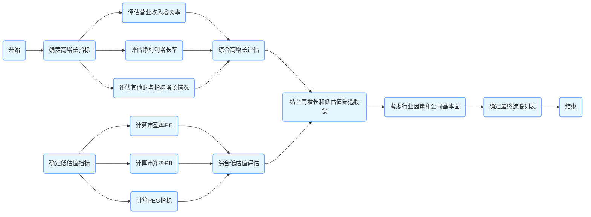

# 彼得林奇的“高增长低估值”选股策略

> 关键词：彼得林奇、高增长低估值、选股策略、财务分析、股票投资

> 摘要：本文深入探讨了彼得林奇的“高增长低估值”选股策略。详细介绍了该策略的背景、核心概念，阐述了其背后的核心算法原理与操作步骤，运用数学模型和公式进行了理论剖析，并通过实际案例进行说明。同时，提供了项目实战的开发环境搭建、源代码实现与解读。此外，还介绍了该策略的实际应用场景，推荐了相关的学习资源、开发工具框架以及论文著作。最后，对该策略的未来发展趋势与挑战进行了总结，并解答了常见问题，提供了扩展阅读和参考资料，旨在为投资者理解和运用这一经典选股策略提供全面且深入的指导。

## 1. 背景介绍 
### 1.1 目的和范围
本博客的主要目的是全面解析彼得林奇的“高增长低估值”选股策略。通过深入研究这一策略的原理、操作方法以及实际应用，帮助投资者更好地理解和运用该策略进行股票投资。范围涵盖了该策略的理论基础、具体实施步骤、数学模型分析、实际案例验证，以及相关的学习资源和工具推荐等方面。

### 1.2 预期读者
本文预期读者包括对股票投资感兴趣的初学者、有一定投资经验但希望优化选股策略的投资者、金融专业的学生以及从事金融研究和分析的专业人士。

### 1.3 文档结构概述
本文将按照以下结构展开：首先介绍核心概念与联系，包括该选股策略的基本原理和架构；接着阐述核心算法原理和具体操作步骤，并通过 Python 代码进行详细说明；然后运用数学模型和公式对策略进行分析，并举例说明；再通过项目实战展示代码的实际应用和详细解读；之后介绍该策略的实际应用场景；随后推荐相关的工具和资源；最后对策略的未来发展趋势与挑战进行总结，解答常见问题，并提供扩展阅读和参考资料。

### 1.4 术语表
#### 1.4.1 核心术语定义
- **高增长**：指公司的营业收入、净利润等关键财务指标在一定时期内呈现出持续且较高速度的增长态势。通常可以用增长率来衡量，如净利润增长率、营业收入增长率等。
- **低估值**：表示股票的市场价格相对于其内在价值被低估。常见的估值指标有市盈率（PE）、市净率（PB）等，低估值意味着这些指标处于相对较低的水平。
- **PEG 指标**：即市盈率相对盈利增长比率，是用公司的市盈率除以盈利增长率得到的数值。它综合考虑了公司的估值和增长情况，用于评估股票是否具有投资价值。

#### 1.4.2 相关概念解释
- **财务报表分析**：通过对公司的资产负债表、利润表和现金流量表等财务报表进行分析，了解公司的财务状况、经营成果和现金流量情况，从而评估公司的投资价值。
- **行业分析**：研究不同行业的发展趋势、竞争格局、政策环境等因素，判断行业的发展前景和投资机会，以便筛选出具有潜力的行业中的股票。
- **内在价值**：股票的内在价值是指股票所代表的公司的真实价值，它基于公司的基本面、盈利能力、资产状况等因素计算得出。

#### 1.4.3 缩略词列表
- **PE**：市盈率（Price-to-Earnings Ratio），是指股票价格除以每股收益的比率，反映了市场对公司盈利的预期。
- **PB**：市净率（Price-to-Book Ratio），是指股票价格除以每股净资产的比率，用于衡量股票的估值水平。
- **PEG**：市盈率相对盈利增长比率（Price/Earnings to Growth Ratio）。

## 2. 核心概念与联系 
### 核心概念原理
彼得林奇的“高增长低估值”选股策略基于这样一个核心思想：寻找那些具有较高盈利增长速度，但市场估值相对较低的股票。从理论上来说，高增长的公司未来有望创造更多的利润，从而推动股票价格上涨；而低估值则意味着股票在当前市场价格下具有更高的性价比，投资风险相对较低。

例如，一家公司的净利润每年以 30%的速度增长，而其市盈率仅为 15 倍，相比同行业其他增长速度较慢且市盈率较高的公司，该公司就符合“高增长低估值”的特征。这种情况下，投资者可以以相对较低的价格买入具有高增长潜力的股票，随着公司业绩的增长，股票价格有望实现较大幅度的上涨，从而获得丰厚的投资回报。

### 架构的文本示意图
```plaintext
高增长低估值选股策略
|-- 高增长评估
|   |-- 营业收入增长率
|   |-- 净利润增长率
|   |-- 其他财务指标增长情况
|-- 低估值评估
|   |-- 市盈率（PE）
|   |-- 市净率（PB）
|   |-- PEG 指标
|-- 综合筛选
|   |-- 结合高增长和低估值指标筛选股票
|   |-- 考虑行业因素和公司基本面
```

### Mermaid 流程图


## 3. 核心算法原理 & 具体操作步骤 
### 核心算法原理
“高增长低估值”选股策略的核心算法主要围绕高增长和低估值指标的计算和筛选。

#### 高增长指标计算
- **营业收入增长率**：计算公式为 $营业收入增长率 = \frac{本期营业收入 - 上期营业收入}{上期营业收入} \times 100\%$。该指标反映了公司业务规模的扩张速度。
- **净利润增长率**：计算公式为 $净利润增长率 = \frac{本期净利润 - 上期净利润}{上期净利润} \times 100\%$。它体现了公司盈利能力的增长情况。

#### 低估值指标计算
- **市盈率（PE）**：计算公式为 $PE = \frac{股票价格}{每股收益}$。市盈率是衡量股票估值的常用指标，较低的市盈率通常表示股票被低估。
- **市净率（PB）**：计算公式为 $PB = \frac{股票价格}{每股净资产}$。市净率反映了股票价格与公司净资产的关系，低市净率可能意味着股票具有投资价值。
- **PEG 指标**：计算公式为 $PEG = \frac{PE}{净利润增长率}$。PEG 指标综合考虑了市盈率和净利润增长率，当 PEG 小于 1 时，通常认为股票具有较好的投资价值。

### 具体操作步骤
#### 步骤 1：数据收集
收集股票的相关财务数据，包括营业收入、净利润、每股收益、每股净资产、股票价格等。这些数据可以从金融数据库、公司年报、财经网站等渠道获取。

#### 步骤 2：计算指标
根据上述公式计算营业收入增长率、净利润增长率、市盈率、市净率和 PEG 指标。

#### 步骤 3：筛选股票
设定高增长和低估值的筛选标准。例如，选择营业收入增长率和净利润增长率均大于 20%，市盈率小于 20，市净率小于 2，PEG 小于 1 的股票。

#### 步骤 4：综合评估
考虑行业因素和公司基本面，对筛选出的股票进行进一步评估。例如，分析公司所处行业的发展前景、竞争优势、管理团队等因素。

### Python 代码实现
```python
import pandas as pd

# 模拟股票数据
data = {
    '股票代码': ['000001', '000002', '000003'],
    '上期营业收入': [100, 200, 300],
    '本期营业收入': [120, 240, 360],
    '上期净利润': [10, 20, 30],
    '本期净利润': [15, 25, 35],
    '每股收益': [1, 2, 3],
    '每股净资产': [5, 10, 15],
    '股票价格': [15, 30, 45]
}

df = pd.DataFrame(data)

# 计算营业收入增长率
df['营业收入增长率'] = (df['本期营业收入'] - df['上期营业收入']) / df['上期营业收入'] * 100

# 计算净利润增长率
df['净利润增长率'] = (df['本期净利润'] - df['上期净利润']) / df['上期净利润'] * 100

# 计算市盈率
df['PE'] = df['股票价格'] / df['每股收益']

# 计算市净率
df['PB'] = df['股票价格'] / df['每股净资产']

# 计算 PEG 指标
df['PEG'] = df['PE'] / df['净利润增长率']

# 筛选股票
growth_threshold = 20
pe_threshold = 20
pb_threshold = 2
peg_threshold = 1

selected_stocks = df[
    (df['营业收入增长率'] > growth_threshold) &
    (df['净利润增长率'] > growth_threshold) &
    (df['PE'] < pe_threshold) &
    (df['PB'] < pb_threshold) &
    (df['PEG'] < peg_threshold)
]

print(selected_stocks)
```
### 代码解释
1. **数据模拟**：使用 `pandas` 库创建一个包含股票相关财务数据的 DataFrame。
2. **指标计算**：根据上述公式计算营业收入增长率、净利润增长率、市盈率、市净率和 PEG 指标，并将结果添加到 DataFrame 中。
3. **股票筛选**：设定筛选标准，使用布尔索引筛选出符合高增长低估值条件的股票。
4. **结果输出**：打印筛选出的股票信息。

## 4. 数学模型和公式 & 详细讲解 & 举例说明 
### 数学模型和公式
#### 高增长指标
- **营业收入增长率**：$g_{revenue} = \frac{R_{current} - R_{previous}}{R_{previous}} \times 100\%$，其中 $g_{revenue}$ 表示营业收入增长率，$R_{current}$ 表示本期营业收入，$R_{previous}$ 表示上期营业收入。
- **净利润增长率**：$g_{profit} = \frac{P_{current} - P_{previous}}{P_{previous}} \times 100\%$，其中 $g_{profit}$ 表示净利润增长率，$P_{current}$ 表示本期净利润，$P_{previous}$ 表示上期净利润。

#### 低估值指标
- **市盈率（PE）**：$PE = \frac{P}{EPS}$，其中 $P$ 表示股票价格，$EPS$ 表示每股收益。
- **市净率（PB）**：$PB = \frac{P}{BVPS}$，其中 $BVPS$ 表示每股净资产。
- **PEG 指标**：$PEG = \frac{PE}{g_{profit}}$

### 详细讲解
#### 高增长指标
营业收入增长率和净利润增长率是衡量公司增长能力的重要指标。较高的营业收入增长率表明公司的业务规模在不断扩大，市场份额可能在增加；而较高的净利润增长率则说明公司的盈利能力在不断提升，能够为股东创造更多的价值。

#### 低估值指标
- **市盈率（PE）**：市盈率反映了市场对公司盈利的预期。较低的市盈率可能意味着市场对公司的预期较低，或者公司的盈利被低估，具有一定的投资价值。
- **市净率（PB）**：市净率衡量了股票价格与公司净资产的关系。当市净率较低时，说明股票价格相对公司的净资产较低，可能存在被低估的情况。
- **PEG 指标**：PEG 指标综合考虑了市盈率和净利润增长率。如果 PEG 小于 1，说明公司的市盈率相对其盈利增长速度较低，股票可能被低估。

### 举例说明
假设某公司的股票价格为 20 元，每股收益为 2 元，每股净资产为 10 元，上期净利润为 1000 万元，本期净利润为 1200 万元。

#### 计算指标
- **净利润增长率**：$g_{profit} = \frac{1200 - 1000}{1000} \times 100\% = 20\%$
- **市盈率（PE）**：$PE = \frac{20}{2} = 10$
- **市净率（PB）**：$PB = \frac{20}{10} = 2$
- **PEG 指标**：$PEG = \frac{10}{20} = 0.5$

#### 分析
该公司的净利润增长率为 20%，市盈率为 10，市净率为 2，PEG 为 0.5。从这些指标来看，该公司具有较高的增长速度，同时估值相对较低，符合“高增长低估值”的特征，可能是一个具有投资价值的股票。

## 5. 项目实战：代码实际案例和详细解释说明 
### 5.1  开发环境搭建
#### 安装 Python
首先需要安装 Python 编程语言。可以从 Python 官方网站（https://www.python.org/downloads/）下载适合自己操作系统的 Python 版本，并按照安装向导进行安装。

#### 安装必要的库
在项目中，我们需要使用 `pandas` 库进行数据处理和分析，`yfinance` 库用于获取股票数据。可以使用以下命令进行安装：
```sh
pip install pandas yfinance
```

### 5.2  源代码详细实现和代码解读
```python
import yfinance as yf
import pandas as pd

# 定义股票列表
stock_list = ['AAPL', 'MSFT', 'GOOG']

# 获取股票数据
data = yf.download(stock_list, start='2020-01-01', end='2023-01-01')

# 计算每股收益和每股净资产（这里假设数据已经通过其他方式获取）
eps = {
    'AAPL': 5.0,
    'MSFT': 8.0,
    'GOOG': 10.0
}

bvps = {
    'AAPL': 20.0,
    'MSFT': 30.0,
    'GOOG': 40.0
}

# 提取最新的股票价格
latest_prices = data['Close'].iloc[-1]

# 创建 DataFrame 存储数据
df = pd.DataFrame({
    '股票代码': stock_list,
    '股票价格': latest_prices,
    '每股收益': [eps[stock] for stock in stock_list],
    '每股净资产': [bvps[stock] for stock in stock_list]
})

# 计算市盈率
df['PE'] = df['股票价格'] / df['每股收益']

# 计算市净率
df['PB'] = df['股票价格'] / df['每股净资产']

# 假设通过其他方式获取净利润增长率
growth_rates = {
    'AAPL': 0.2,
    'MSFT': 0.25,
    'GOOG': 0.3
}

df['净利润增长率'] = [growth_rates[stock] for stock in stock_list]

# 计算 PEG 指标
df['PEG'] = df['PE'] / (df['净利润增长率'] * 100)

# 筛选股票
growth_threshold = 0.2
pe_threshold = 20
pb_threshold = 2
peg_threshold = 1

selected_stocks = df[
    (df['净利润增长率'] > growth_threshold) &
    (df['PE'] < pe_threshold) &
    (df['PB'] < pb_threshold) &
    (df['PEG'] < peg_threshold)
]

print(selected_stocks)
```

### 5.3  代码解读与分析
#### 代码功能概述
该代码实现了使用“高增长低估值”选股策略对苹果（AAPL）、微软（MSFT）和谷歌（GOOG）三只股票进行筛选的功能。

#### 代码详细解读
1. **导入库**：导入 `yfinance` 库用于获取股票数据，`pandas` 库用于数据处理和分析。
2. **定义股票列表**：定义需要分析的股票列表。
3. **获取股票数据**：使用 `yfinance` 库下载指定时间范围内的股票数据。
4. **计算每股收益和每股净资产**：这里假设每股收益和每股净资产数据已经通过其他方式获取，并存储在字典中。
5. **提取最新的股票价格**：从下载的数据中提取最新的股票价格。
6. **创建 DataFrame**：将股票代码、股票价格、每股收益和每股净资产数据存储在一个 DataFrame 中。
7. **计算指标**：根据公式计算市盈率、市净率和 PEG 指标。
8. **筛选股票**：设定筛选标准，筛选出符合高增长低估值条件的股票。
9. **输出结果**：打印筛选出的股票信息。

#### 代码分析
- **数据获取**：使用 `yfinance` 库可以方便地获取股票的历史数据，但对于每股收益、每股净资产和净利润增长率等数据，可能需要从其他渠道获取，如公司年报、金融数据库等。
- **指标计算**：根据公式准确计算市盈率、市净率和 PEG 指标，确保筛选的准确性。
- **筛选条件**：筛选条件的设定需要根据市场情况和个人投资偏好进行调整，不同的筛选条件可能会得到不同的选股结果。

## 6. 实际应用场景 
### 个人投资者
对于个人投资者来说，“高增长低估值”选股策略可以帮助他们在众多股票中筛选出具有投资价值的股票。个人投资者可以根据自己的风险承受能力和投资目标，设定合适的高增长和低估值筛选标准，构建自己的投资组合。例如，一位风险偏好较低的投资者可以选择净利润增长率较高、市盈率和市净率较低的股票，以降低投资风险；而一位风险偏好较高的投资者可以适当放宽筛选标准，寻找具有更高增长潜力的股票。

### 基金经理
基金经理在管理基金资产时，也可以运用“高增长低估值”选股策略。通过筛选符合条件的股票，构建基金的投资组合，以实现基金资产的增值。基金经理通常会结合宏观经济分析、行业研究等方法，对筛选出的股票进行进一步的评估和分析，以确保投资组合的合理性和稳定性。

### 金融机构研究分析
金融机构的研究人员可以使用该策略对股票市场进行研究和分析。他们可以通过大量的数据统计和分析，找出不同行业中符合“高增长低估值”特征的股票，为投资者提供投资建议和研究报告。同时，金融机构也可以利用该策略对上市公司进行评估和评级，为投资者提供参考。

## 7. 工具和资源推荐
### 7.1 学习资源推荐
#### 7.1.1 书籍推荐
- 《彼得·林奇的成功投资》：彼得·林奇亲自撰写的投资经典著作，详细介绍了他的投资理念和选股策略，对于理解“高增长低估值”选股策略具有重要的指导意义。
- 《聪明的投资者》：本杰明·格雷厄姆的代表作，被誉为投资界的圣经。书中阐述了价值投资的基本原理和方法，对于投资者培养正确的投资思维和理念非常有帮助。
- 《财务报表分析与证券定价》：本书系统地介绍了财务报表分析的方法和技术，以及如何运用财务报表分析进行证券定价。对于深入理解公司的财务状况和投资价值具有重要的参考价值。

#### 7.1.2 在线课程
- Coursera 上的“投资学原理”：该课程由知名高校的教授授课，涵盖了投资学的基本原理、资产定价模型、投资组合理论等内容，对于学习股票投资和选股策略具有很好的帮助。
- 网易云课堂上的“财务报表分析实战”：课程通过实际案例详细讲解了财务报表分析的方法和技巧，帮助学习者掌握如何从财务报表中获取有用的信息，评估公司的投资价值。

#### 7.1.3 技术博客和网站
- 雪球网：国内知名的投资交流社区，汇聚了众多投资者和投资专家。在雪球网上可以看到各种投资策略的讨论和分享，以及对不同股票的分析和评价。
- 东方财富网：提供丰富的金融资讯和股票数据，包括公司财务报表、行情走势等。投资者可以通过东方财富网获取股票的相关信息，进行投资分析和决策。

### 7.2 开发工具框架推荐
#### 7.2.1 IDE和编辑器
- PyCharm：一款专业的 Python 集成开发环境，具有强大的代码编辑、调试、代码分析等功能，适合用于开发和调试股票分析相关的 Python 代码。
- Jupyter Notebook：一个交互式的开发环境，支持 Python、R 等多种编程语言。在 Jupyter Notebook 中可以方便地进行数据探索、分析和可视化，非常适合进行股票数据的分析和建模。

#### 7.2.2 调试和性能分析工具
- pdb：Python 自带的调试工具，可以帮助开发者在代码运行过程中进行调试，查看变量的值、执行流程等，定位和解决代码中的问题。
- cProfile：Python 标准库中的性能分析工具，可以统计代码中各个函数的执行时间和调用次数，帮助开发者找出代码中的性能瓶颈，进行优化。

#### 7.2.3 相关框架和库
- pandas：一个强大的数据处理和分析库，提供了丰富的数据结构和数据操作方法，适合用于处理和分析股票的财务数据。
- numpy：Python 的数值计算库，提供了高效的数组和矩阵运算功能，在股票数据分析中可以用于进行数值计算和统计分析。
- matplotlib：一个常用的 Python 绘图库，可以用于绘制各种类型的图表，如折线图、柱状图、散点图等，帮助投资者直观地展示股票数据和分析结果。

### 7.3 相关论文著作推荐
#### 7.3.1 经典论文
- Fama, E. F., & French, K. R. (1992). The cross-section of expected stock returns. The Journal of Finance, 47(2), 427-465. 该论文提出了著名的 Fama-French 三因子模型，对股票的预期收益率进行了深入研究，为股票投资和选股策略提供了重要的理论基础。
- Sharpe, W. F. (1964). Capital asset prices: A theory of market equilibrium under conditions of risk. The Journal of Finance, 19(3), 425-442. 夏普在这篇论文中提出了资本资产定价模型（CAPM），该模型用于描述资产的预期收益率与市场风险之间的关系，是现代金融理论的重要基石之一。

#### 7.3.2 最新研究成果
- 关注顶级金融学术期刊，如 The Journal of Finance、The Review of Financial Studies 等，这些期刊上发表的最新研究成果可以帮助投资者了解股票投资领域的前沿动态和研究方向。
- 参加金融学术会议，如 American Finance Association（AFA）年会等，与国内外的金融学者和研究人员交流，获取最新的研究信息和观点。

#### 7.3.3 应用案例分析
- 许多金融研究机构和咨询公司会发布关于股票投资策略的应用案例分析报告，投资者可以通过阅读这些报告，了解“高增长低估值”选股策略在实际应用中的效果和问题，以及如何进行改进和优化。

## 8. 总结：未来发展趋势与挑战
### 未来发展趋势
#### 数据驱动的精细化选股
随着大数据、人工智能等技术的不断发展，未来“高增长低估值”选股策略将更加依赖于数据驱动。投资者可以利用更多的数据源，如社交媒体数据、卫星图像数据等，对公司的基本面和市场情况进行更全面、深入的分析，从而实现更精细化的选股。

#### 跨市场和跨资产类别应用
该选股策略不仅可以应用于股票市场，还可以扩展到其他金融市场和资产类别，如债券市场、期货市场、房地产市场等。通过跨市场和跨资产类别应用，投资者可以构建更加多元化的投资组合，降低投资风险。

#### 与量化投资的融合
量化投资在近年来得到了快速发展，未来“高增长低估值”选股策略将与量化投资更加紧密地融合。投资者可以利用量化模型和算法，对选股策略进行优化和改进，提高选股的效率和准确性。

### 挑战
#### 数据质量和可靠性
选股策略的有效性依赖于准确、可靠的数据。然而，金融数据的质量和可靠性存在一定的问题，如数据缺失、数据错误、数据滞后等。投资者需要花费大量的时间和精力进行数据清洗和预处理，以确保数据的质量和可靠性。

#### 市场变化的不确定性
股票市场是一个复杂多变的系统，受到宏观经济、政策法规、行业竞争等多种因素的影响。市场变化的不确定性增加了选股的难度，投资者需要不断调整和优化选股策略，以适应市场的变化。

#### 模型的局限性
选股策略通常基于一定的假设和模型，这些模型存在一定的局限性。例如，PEG 指标在某些情况下可能无法准确反映股票的投资价值，因为它没有考虑到公司的长期发展潜力、行业竞争格局等因素。投资者需要认识到模型的局限性，结合自己的经验和判断进行投资决策。

## 9. 附录：常见问题与解答
### 问题 1：如何确定高增长和低估值的筛选标准？
答：高增长和低估值的筛选标准需要根据市场情况、行业特点和个人投资目标来确定。一般来说，可以参考同行业的平均水平和历史数据，设定一个相对合理的标准。例如，净利润增长率可以设定为大于 20%，市盈率可以设定为小于 20 等。同时，也可以根据自己的风险承受能力和投资偏好进行调整。

### 问题 2：PEG 指标是否适用于所有行业？
答：PEG 指标并不适用于所有行业。一些新兴行业，如科技行业，由于其具有较高的增长潜力，即使 PEG 指标大于 1，也可能具有投资价值。而一些传统行业，如公用事业行业，由于其增长速度较慢，PEG 指标可能较低，但投资回报率也相对较低。因此，在使用 PEG 指标时，需要结合行业特点进行分析。

### 问题 3：除了财务指标，还需要考虑哪些因素？
答：除了财务指标，还需要考虑行业因素、公司基本面、宏观经济环境等因素。例如，分析公司所处行业的发展前景、竞争格局、政策环境等；评估公司的管理团队、技术实力、品牌影响力等基本面情况；关注宏观经济数据、货币政策、财政政策等宏观经济环境的变化。

### 问题 4：如何获取准确的财务数据？
答：可以从以下渠道获取准确的财务数据：
- 公司年报和季报：上市公司会定期公布年报和季报，其中包含了详细的财务信息。
- 金融数据库：如 Wind、东方财富 Choice 等金融数据库提供了丰富的金融数据和分析工具。
- 财经网站：如新浪财经、腾讯财经等财经网站也提供了股票的财务数据和相关信息。

## 10. 扩展阅读 & 参考资料
### 扩展阅读
- 《战胜华尔街》：彼得·林奇的另一本经典著作，分享了他在投资生涯中的经验和故事，对于投资者深入了解投资策略和市场有很大的帮助。
- 《金融炼金术》：乔治·索罗斯的代表作，书中阐述了他的反身性理论和投资哲学，对于理解金融市场的运行机制和投资决策具有重要的启示作用。

### 参考资料
- Fama, E. F., & French, K. R. (1992). The cross-section of expected stock returns. The Journal of Finance, 47(2), 427-465.
- Sharpe, W. F. (1964). Capital asset prices: A theory of market equilibrium under conditions of risk. The Journal of Finance, 19(3), 425-442.
- 彼得·林奇. 《彼得·林奇的成功投资》. 机械工业出版社.

作者：AI天才研究院/AI Genius Institute & 禅与计算机程序设计艺术 /Zen And The Art of Computer Programming