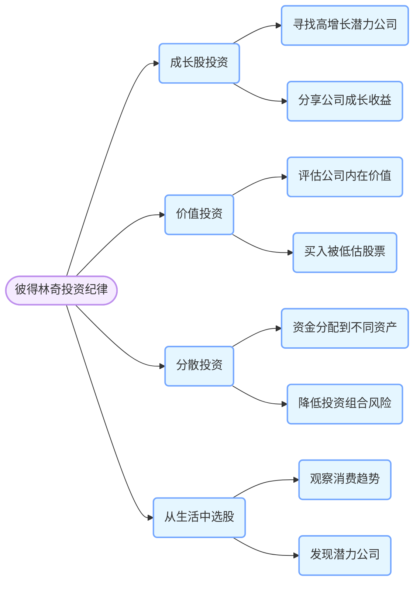

# 彼得林奇的投资纪律

> 关键词：彼得林奇、投资纪律、价值投资、成长股投资、资产配置

> 摘要：本文深入探讨了彼得林奇的投资纪律。彼得林奇作为投资界的传奇人物，其投资理念和纪律对投资者具有深远的指导意义。文章首先介绍了相关背景，包括目的、预期读者、文档结构和术语解释。接着阐述了核心概念，分析了彼得林奇投资纪律中的核心要素及它们之间的联系，并通过流程图展示。详细讲解了基于这些纪律的核心算法原理和具体操作步骤，用 Python 代码进行说明。给出了相关的数学模型和公式，并举例分析。通过项目实战，展示了如何在实际中运用这些纪律进行投资操作。探讨了实际应用场景，推荐了学习资源、开发工具框架和相关论文著作。最后总结了未来投资的发展趋势与挑战，解答了常见问题，并提供了扩展阅读和参考资料。

## 1. 背景介绍 
### 1.1 目的和范围
本文的目的是全面剖析彼得林奇的投资纪律，为投资者提供深入且实用的投资指导。通过对彼得林奇投资理念和方法的研究，揭示其投资成功的关键因素，帮助投资者理解并应用这些纪律进行投资决策。范围涵盖了彼得林奇投资纪律的各个方面，包括选股策略、资产配置、风险控制等，同时结合实际案例和代码实现，使读者能够更好地掌握和运用这些纪律。

### 1.2 预期读者
本文预期读者包括对投资感兴趣的初学者、有一定投资经验的投资者以及从事金融投资研究的专业人士。对于初学者，本文可以作为了解投资基本理念和方法的入门指南；对于有经验的投资者，能够从彼得林奇的独特视角中获得新的启发和思路；对于专业人士，则可以作为进一步研究投资策略和理论的参考资料。

### 1.3 文档结构概述
本文将按照以下结构进行阐述：首先介绍彼得林奇投资纪律的背景知识，包括相关术语和概念。接着详细讲解核心概念及其相互联系，通过流程图进行直观展示。然后阐述核心算法原理和具体操作步骤，并用 Python 代码实现。给出相关的数学模型和公式，并举例说明。通过项目实战展示如何在实际中应用这些纪律。探讨实际应用场景，推荐学习资源、开发工具框架和相关论文著作。最后总结未来投资的发展趋势与挑战，解答常见问题，并提供扩展阅读和参考资料。

### 1.4 术语表
#### 1.4.1 核心术语定义
- **成长股**：指那些销售额和利润额持续增长，且增长速度快于整个国家及其所在行业的公司所发行的股票。成长股的股价通常会随着公司业绩的增长而上升。
- **价值投资**：一种寻找被低估股票的投资策略，投资者通过分析公司的基本面，如财务报表、行业地位等，以低于其内在价值的价格买入股票，等待市场发现其价值并实现增值。
- **PEG 比率**：市盈率相对盈利增长比率，是用公司的市盈率除以公司的盈利增长速度。该指标用于衡量股票的估值是否合理，较低的 PEG 比率通常表示股票具有较好的投资价值。
- **分散投资**：将资金分散投资于不同的资产、行业、公司或地区，以降低单一投资的风险。通过分散投资，投资者可以减少因某一特定投资的不利表现而对整个投资组合造成的影响。

#### 1.4.2 相关概念解释
- **鸡尾酒会理论**：彼得林奇提出的一种判断股市走势的方法。在鸡尾酒会上，根据人们对股票的关注度和谈论程度，可以判断股市处于不同的阶段。例如，当人们很少谈论股票时，股市可能处于底部；当人们都热衷于谈论股票时，股市可能处于顶部。
- **从生活中选股**：彼得林奇认为投资者可以从日常生活中发现投资机会。例如，观察身边的消费趋势、热门产品和服务等，找到具有潜力的公司。因为普通消费者往往是最早接触到新产品和新服务的人群，通过对生活的观察可以提前发现一些有增长潜力的公司。

#### 1.4.3 缩略词列表
- **PEG**：Price/Earnings to Growth Ratio（市盈率相对盈利增长比率）
- **P/E**：Price-to-Earnings Ratio（市盈率）

## 2. 核心概念与联系 
彼得林奇的投资纪律包含多个核心概念，这些概念相互关联，共同构成了他独特的投资体系。核心概念主要包括成长股投资、价值投资、分散投资和从生活中选股等。

### 核心概念原理

#### 成长股投资
成长股投资的核心原理是寻找那些具有高增长潜力的公司。这些公司通常处于新兴行业或具有创新的商业模式，其销售额和利润能够持续快速增长。投资者通过买入成长股，分享公司成长带来的股价上涨收益。例如，一些科技公司在发展初期可能规模较小，但由于其技术创新和市场需求的增长，能够实现高速增长，成为行业的领军企业，其股价也会大幅上涨。

#### 价值投资
价值投资强调寻找被市场低估的股票。投资者通过深入分析公司的基本面，如财务状况、盈利能力、行业竞争力等，评估公司的内在价值。当股票价格低于其内在价值时，投资者认为该股票具有投资价值，买入并持有，等待市场纠正对该股票的低估，实现价值回归。例如，一家公司由于短期的市场波动或行业负面消息，股价大幅下跌，但其实质的业务和财务状况并没有发生根本性变化，此时该股票可能被低估，是价值投资的好机会。

#### 分散投资
分散投资的原理是通过将资金分配到不同的资产、行业和公司，降低投资组合的风险。不同的资产、行业和公司在不同的市场环境下表现不同，通过分散投资，当某一投资出现亏损时，其他投资可能表现良好，从而平衡整个投资组合的收益。例如，同时投资于股票、债券和房地产等不同资产类别，或者投资于多个不同行业的公司股票，可以有效降低单一资产或行业波动对投资组合的影响。

#### 从生活中选股
从生活中选股的原理是基于普通消费者对日常生活中的产品和服务具有直观的感受和体验。投资者可以通过观察身边的消费趋势、热门产品和服务等，发现具有潜力的公司。因为消费者的需求是推动公司发展的重要动力，那些能够满足消费者需求的公司往往具有较好的发展前景。例如，当发现身边的人都热衷于使用某一款智能手机时，就可以关注生产该手机的公司是否具有投资价值。

### 架构的文本示意图
```plaintext
彼得林奇投资纪律
|-- 成长股投资
|   |-- 寻找高增长潜力公司
|   |-- 分享公司成长收益
|-- 价值投资
|   |-- 评估公司内在价值
|   |-- 买入被低估股票
|-- 分散投资
|   |-- 资金分配到不同资产
|   |-- 降低投资组合风险
|-- 从生活中选股
|   |-- 观察消费趋势
|   |-- 发现潜力公司
```

### Mermaid 流程图


## 3. 核心算法原理 & 具体操作步骤 

### 核心算法原理
彼得林奇的投资纪律核心算法可以概括为以下几个步骤：首先，通过对公司基本面的分析和对行业趋势的研究，筛选出具有成长潜力和被低估的股票。然后，根据分散投资的原则，将资金合理分配到不同的股票和资产类别中。最后，通过持续跟踪和评估投资组合，及时调整投资策略。

### 具体操作步骤

#### 步骤 1：选股
- **成长股筛选**：寻找销售额和利润持续增长，且增长速度快于行业平均水平的公司。可以通过分析公司的财务报表、行业研究报告等资料来筛选。例如，选择过去几年净利润增长率连续超过 20%的公司。
- **价值股筛选**：计算公司的市盈率（P/E）、市净率（P/B）等估值指标，并与同行业其他公司进行比较。选择市盈率低于行业平均水平，且具有良好基本面的公司。同时，可以使用 PEG 比率来评估股票的估值是否合理，一般认为 PEG 小于 1 的股票具有较好的投资价值。

#### 步骤 2：资产配置
- **确定投资组合的资产类别**：根据自己的风险承受能力和投资目标，确定投资组合中股票、债券、现金等资产的比例。例如，对于风险承受能力较高的投资者，可以将股票的比例设置为 70%，债券为 20%，现金为 10%。
- **分散投资于不同行业和公司**：在股票投资中，选择不同行业的公司进行投资，避免过度集中于某一行业。同时，投资于多个不同规模和风格的公司，以降低单一公司的风险。

#### 步骤 3：持续跟踪和评估
- **定期关注公司的财务状况和经营业绩**：通过阅读公司的季报、年报等财务报告，了解公司的收入、利润、现金流等指标的变化情况。同时，关注公司的重大事件，如新产品推出、管理层变动等。
- **评估投资组合的表现**：定期计算投资组合的收益率、波动率等指标，并与市场基准进行比较。如果投资组合的表现不佳，需要分析原因并及时调整投资策略。

### Python 代码实现

```python
import pandas as pd
import yfinance as yf

# 步骤 1：选股
def select_stocks():
    # 假设我们有一个包含公司财务数据的 DataFrame
    data = {
        'symbol': ['AAPL', 'MSFT', 'GOOG'],
        'net_income_growth': [0.25, 0.2, 0.3],  # 净利润增长率
        'pe_ratio': [20, 18, 22],  # 市盈率
        'peg_ratio': [0.8, 0.9, 1.1]  # PEG 比率
    }
    df = pd.DataFrame(data)
    
    # 筛选成长股
    growth_stocks = df[df['net_income_growth'] > 0.2]
    
    # 筛选价值股
    value_stocks = df[df['peg_ratio'] < 1]
    
    return growth_stocks, value_stocks

# 步骤 2：资产配置
def asset_allocation():
    # 假设我们将资金分配为 70%股票，20%债券，10%现金
    stock_ratio = 0.7
    bond_ratio = 0.2
    cash_ratio = 0.1
    
    return stock_ratio, bond_ratio, cash_ratio

# 步骤 3：持续跟踪和评估
def track_and_evaluate(symbols):
    start_date = '2020-01-01'
    end_date = '2021-01-01'
    data = yf.download(symbols, start=start_date, end=end_date)
    returns = data['Close'].pct_change()
    portfolio_return = returns.mean(axis=1)
    volatility = portfolio_return.std()
    
    return portfolio_return, volatility

# 主程序
if __name__ == "__main__":
    growth_stocks, value_stocks = select_stocks()
    print("成长股：")
    print(growth_stocks)
    print("价值股：")
    print(value_stocks)
    
    stock_ratio, bond_ratio, cash_ratio = asset_allocation()
    print(f"股票比例：{stock_ratio * 100}%")
    print(f"债券比例：{bond_ratio * 100}%")
    print(f"现金比例：{cash_ratio * 100}%")
    
    symbols = growth_stocks['symbol'].tolist() + value_stocks['symbol'].tolist()
    portfolio_return, volatility = track_and_evaluate(symbols)
    print(f"投资组合收益率：{portfolio_return.mean()}")
    print(f"投资组合波动率：{volatility}")
```

## 4. 数学模型和公式 & 详细讲解 & 举例说明 

### 市盈率（P/E）
市盈率是最常用的估值指标之一，用于衡量股票价格相对于每股盈利的倍数。其计算公式为：

$$P/E = \frac{股票价格}{每股盈利}$$

#### 详细讲解
市盈率反映了投资者为获得公司每一元盈利所愿意支付的价格。一般来说，较低的市盈率意味着股票可能被低估，具有较高的投资价值；而较高的市盈率可能表示股票被高估，投资风险相对较大。但市盈率的高低也受到行业特点、公司成长前景等因素的影响，不同行业的市盈率水平可能存在较大差异。

#### 举例说明
假设某公司的股票价格为 50 元，每股盈利为 5 元，则该公司的市盈率为：

$$P/E = \frac{50}{5} = 10$$

这意味着投资者为获得该公司每一元盈利愿意支付 10 元的价格。如果同行业其他公司的平均市盈率为 15，那么该公司的股票可能被低估。

### 市净率（P/B）
市净率是指股票价格与每股净资产的比率，计算公式为：

$$P/B = \frac{股票价格}{每股净资产}$$

#### 详细讲解
市净率反映了股票价格相对于公司净资产的倍数。较低的市净率可能表示股票被低估，具有一定的安全边际；而较高的市净率可能表示市场对公司的未来发展前景给予了较高的预期。但市净率也不能单独作为投资决策的依据，还需要结合其他因素进行分析。

#### 举例说明
假设某公司的股票价格为 30 元，每股净资产为 10 元，则该公司的市净率为：

$$P/B = \frac{30}{10} = 3$$

如果同行业其他公司的平均市净率为 4，那么该公司的股票可能具有一定的投资价值。

### 市盈率相对盈利增长比率（PEG）
PEG 比率是用公司的市盈率除以公司的盈利增长速度，计算公式为：

$$PEG = \frac{P/E}{盈利增长率}$$

#### 详细讲解
PEG 比率综合考虑了股票的估值和公司的盈利增长情况。一般认为，PEG 小于 1 的股票具有较好的投资价值，因为这意味着公司的盈利增长速度能够支撑其当前的市盈率水平。当 PEG 大于 1 时，股票可能被高估；当 PEG 小于 0.5 时，股票可能被严重低估。

#### 举例说明
假设某公司的市盈率为 20，盈利增长率为 30%，则该公司的 PEG 比率为：

$$PEG = \frac{20}{30\%} = \frac{20}{0.3} \approx 0.67$$

由于 PEG 小于 1，该公司的股票可能具有较好的投资价值。

### 夏普比率（Sharpe Ratio）
夏普比率用于衡量投资组合的风险调整后收益，计算公式为：

$$Sharpe Ratio = \frac{R_p - R_f}{\sigma_p}$$

其中，$R_p$ 是投资组合的预期收益率，$R_f$ 是无风险收益率，$\sigma_p$ 是投资组合的波动率。

#### 详细讲解
夏普比率越高，说明投资组合在承担相同风险的情况下能够获得更高的收益。它反映了投资组合的收益与风险之间的平衡关系，是评估投资组合绩效的重要指标之一。

#### 举例说明
假设某投资组合的预期收益率为 15%，无风险收益率为 3%，波动率为 20%，则该投资组合的夏普比率为：

$$Sharpe Ratio = \frac{0.15 - 0.03}{0.2} = 0.6$$

这意味着该投资组合每承担 1%的风险，能够获得 0.6%的额外收益。

## 5. 项目实战：代码实际案例和详细解释说明 

### 5.1  开发环境搭建
在进行基于彼得林奇投资纪律的项目实战时，我们需要搭建相应的开发环境。以下是具体的步骤：

#### 安装 Python
首先，确保你已经安装了 Python 3.x 版本。你可以从 Python 官方网站（https://www.python.org/downloads/）下载并安装适合你操作系统的 Python 版本。

#### 安装必要的库
我们需要安装一些用于数据处理、金融分析和可视化的 Python 库，主要包括 `pandas`、`yfinance`、`matplotlib` 等。可以使用以下命令进行安装：

```sh
pip install pandas yfinance matplotlib
```

### 5.2  源代码详细实现和代码解读

```python
import pandas as pd
import yfinance as yf
import matplotlib.pyplot as plt

# 步骤 1：选股
def select_stocks():
    # 定义股票列表
    symbols = ['AAPL', 'MSFT', 'GOOG', 'AMZN', 'FB']
    
    # 获取股票数据
    data = yf.download(symbols, start='2020-01-01', end='2021-01-01')
    close_prices = data['Close']
    
    # 计算每股盈利（假设已知）
    earnings_per_share = {
        'AAPL': 4.0,
        'MSFT': 5.0,
        'GOOG': 6.0,
        'AMZN': 20.0,
        'FB': 10.0
    }
    
    # 计算市盈率
    pe_ratios = {}
    for symbol in symbols:
        pe_ratios[symbol] = close_prices[symbol].iloc[-1] / earnings_per_share[symbol]
    
    # 筛选市盈率低于 20 的股票
    selected_stocks = [symbol for symbol, pe in pe_ratios.items() if pe < 20]
    
    return selected_stocks

# 步骤 2：资产配置
def asset_allocation(selected_stocks):
    # 假设将资金平均分配到选中的股票中
    num_stocks = len(selected_stocks)
    allocation = {symbol: 1 / num_stocks for symbol in selected_stocks}
    
    return allocation

# 步骤 3：模拟投资组合
def simulate_portfolio(selected_stocks, allocation):
    start_date = '2021-01-01'
    end_date = '2022-01-01'
    data = yf.download(selected_stocks, start=start_date, end=end_date)
    close_prices = data['Close']
    
    # 计算投资组合的价值
    portfolio_value = pd.Series(index=close_prices.index, data=0.0)
    for symbol, weight in allocation.items():
        portfolio_value += close_prices[symbol] * weight
    
    return portfolio_value

# 主程序
if __name__ == "__main__":
    # 选股
    selected_stocks = select_stocks()
    print("选中的股票：", selected_stocks)
    
    # 资产配置
    allocation = asset_allocation(selected_stocks)
    print("资产配置：", allocation)
    
    # 模拟投资组合
    portfolio_value = simulate_portfolio(selected_stocks, allocation)
    
    # 绘制投资组合价值曲线
    plt.figure(figsize=(10, 6))
    plt.plot(portfolio_value)
    plt.title('投资组合价值曲线')
    plt.xlabel('日期')
    plt.ylabel('价值')
    plt.show()
```

### 5.3  代码解读与分析

#### 选股部分
- `select_stocks` 函数首先定义了一个股票列表 `symbols`，包含了一些知名公司的股票代码。
- 使用 `yfinance` 库下载这些股票在 2020 年 1 月 1 日至 2021 年 1 月 1 日期间的收盘价数据。
- 假设已知每股盈利，通过收盘价除以每股盈利计算出市盈率。
- 筛选出市盈率低于 20 的股票，并返回这些股票的代码列表。

#### 资产配置部分
- `asset_allocation` 函数接收选中的股票列表作为输入，将资金平均分配到这些股票中，返回一个字典，键为股票代码，值为该股票的投资比例。

#### 模拟投资组合部分
- `simulate_portfolio` 函数接收选中的股票列表和资产配置字典作为输入，下载这些股票在 2021 年 1 月 1 日至 2022 年 1 月 1 日期间的收盘价数据。
- 根据资产配置计算投资组合的价值，并返回一个包含投资组合价值随时间变化的 `pandas.Series` 对象。

#### 主程序部分
- 调用 `select_stocks` 函数进行选股，并打印选中的股票。
- 调用 `asset_allocation` 函数进行资产配置，并打印资产配置结果。
- 调用 `simulate_portfolio` 函数模拟投资组合，并绘制投资组合价值曲线。

通过这个项目实战，我们可以看到如何运用彼得林奇的投资纪律进行选股和资产配置，并模拟投资组合的表现。

## 6. 实际应用场景 
彼得林奇的投资纪律在多个实际应用场景中具有重要的指导意义，以下是一些常见的应用场景：

### 个人投资者
- **长期投资规划**：个人投资者可以根据彼得林奇的投资纪律，制定长期的投资规划。通过筛选成长股和价值股，进行分散投资，构建一个具有合理风险收益特征的投资组合。例如，一个年轻的投资者可以将一部分资金投资于成长股，以获取较高的长期收益；同时，将另一部分资金投资于价值股和债券，以降低投资组合的风险。
- **日常选股决策**：在日常选股过程中，个人投资者可以运用彼得林奇从生活中选股的方法，观察身边的消费趋势和热门产品，发现具有潜力的公司。例如，当发现身边的人都热衷于使用某一款健身应用时，可以关注开发该应用的公司是否具有投资价值。

### 基金经理
- **基金投资策略制定**：基金经理可以借鉴彼得林奇的投资纪律，制定基金的投资策略。通过深入研究公司基本面和行业趋势，筛选出符合投资标准的股票，并进行合理的资产配置。例如，一只成长型基金可以重点投资于具有高增长潜力的成长股；而一只平衡型基金可以同时投资于成长股和价值股，并根据市场情况进行动态调整。
- **投资组合管理**：基金经理可以运用彼得林奇的分散投资原则，管理基金的投资组合。通过投资于不同行业、不同规模和不同风格的公司股票，降低基金的风险。同时，定期跟踪和评估投资组合的表现，及时调整投资策略，以实现基金的投资目标。

### 金融机构
- **投资咨询服务**：金融机构可以向客户提供基于彼得林奇投资纪律的投资咨询服务。通过分析客户的风险承受能力和投资目标，为客户制定个性化的投资方案。例如，对于风险承受能力较低的客户，推荐以价值股和债券为主的投资组合；对于风险承受能力较高的客户，推荐适当配置成长股的投资组合。
- **研究报告撰写**：金融机构的研究人员可以运用彼得林奇的投资理念和方法，撰写研究报告。通过对公司基本面和行业趋势的分析，评估股票的投资价值，并为投资者提供投资建议。例如，一份关于科技行业的研究报告可以筛选出具有成长潜力的科技公司，并分析其投资机会和风险。

## 7. 工具和资源推荐
### 7.1 学习资源推荐
#### 7.1.1 书籍推荐
- 《彼得·林奇的成功投资》：这是彼得林奇的经典著作之一，详细介绍了他的投资理念、选股方法和投资策略。书中通过大量的案例分析，深入浅出地阐述了如何从生活中发现投资机会，以及如何进行有效的投资组合管理。
- 《战胜华尔街》：在这本书中，彼得林奇分享了他在富达麦哲伦基金的投资经验和成功故事。书中包含了他对不同行业和公司的分析，以及如何应对市场波动和投资风险的建议。
- 《聪明的投资者》：虽然这本书不是彼得林奇所著，但它是价值投资领域的经典之作。作者本杰明·格雷厄姆是价值投资的创始人，他的投资理念对彼得林奇产生了重要影响。书中介绍了价值投资的基本原理和方法，以及如何进行股票估值和风险控制。

#### 7.1.2 在线课程
- Coursera 上的“投资学原理”：这门课程由知名大学的教授授课，涵盖了投资学的基本概念、理论和方法。课程内容包括股票投资、债券投资、资产配置等方面，适合对投资感兴趣的初学者。
- edX 上的“金融市场与投资策略”：该课程介绍了金融市场的基本结构和运行机制，以及各种投资策略的原理和应用。课程中会结合实际案例，分析不同投资策略的优缺点和适用场景。
- 网易云课堂上的“彼得林奇投资策略实战”：这是一门专门介绍彼得林奇投资策略的课程，通过案例分析和实践操作，帮助学员掌握彼得林奇的选股方法和投资技巧。

#### 7.1.3 技术博客和网站
- Seeking Alpha：这是一个知名的金融投资博客平台，上面有大量的投资分析文章和研究报告。许多专业投资者和分析师会在该平台上分享他们的投资观点和研究成果，你可以从中获取有关彼得林奇投资纪律的相关讨论和案例分析。
- 雪球网：国内的一个投资社区，聚集了大量的投资者和投资爱好者。在雪球网上，你可以找到关于彼得林奇投资理念的讨论和分享，还可以关注一些投资大 V 的观点和操作。
- 东方财富网：提供丰富的金融资讯和数据服务，你可以在该网站上查询股票的基本面数据、行业研究报告等信息，有助于你运用彼得林奇的投资纪律进行选股和分析。

### 7.2 开发工具框架推荐
#### 7.2.1 IDE和编辑器
- PyCharm：一款专业的 Python 集成开发环境，具有强大的代码编辑、调试和分析功能。它支持多种 Python 库和框架，适合进行金融数据分析和投资策略开发。
- Jupyter Notebook：一种交互式的开发环境，允许你在浏览器中编写和运行代码，并将代码、文本和可视化结果集成在一起。Jupyter Notebook 非常适合进行数据探索和分析，以及展示投资策略的实现过程。
- Visual Studio Code：一款轻量级的代码编辑器，支持多种编程语言和插件。它具有丰富的扩展功能，可以通过安装相关插件来实现 Python 开发和金融数据分析。

#### 7.2.2 调试和性能分析工具
- PDB：Python 自带的调试器，允许你在代码中设置断点，逐行执行代码，查看变量的值和程序的执行流程。通过 PDB，你可以快速定位和解决代码中的问题。
- cProfile：Python 标准库中的性能分析工具，用于分析代码的运行时间和函数调用次数。通过使用 cProfile，你可以找出代码中的性能瓶颈，并进行优化。
- Py-Spy：一个轻量级的 Python 性能分析工具，无需修改代码即可对 Python 程序进行性能分析。它可以实时显示程序的 CPU 使用率和函数调用情况，帮助你快速定位性能问题。

#### 7.2.3 相关框架和库
- Pandas：一个强大的数据处理和分析库，提供了高效的数据结构和数据操作方法。在金融数据分析中，Pandas 可以用于读取、处理和分析股票价格数据、财务报表数据等。
- NumPy：Python 的数值计算库，提供了高效的多维数组对象和数学函数。在金融计算中，NumPy 可以用于计算收益率、波动率等指标。
- Matplotlib：一个用于数据可视化的库，支持多种图表类型，如折线图、柱状图、散点图等。在投资分析中，Matplotlib 可以用于绘制股票价格走势图、投资组合价值曲线等。

### 7.3 相关论文著作推荐
#### 7.3.1 经典论文
- “The Random Walk Hypothesis”：该论文提出了随机漫步假说，认为股票价格的变化是随机的，无法通过历史数据预测未来价格走势。虽然彼得林奇的投资方法强调基本面分析，但随机漫步假说对投资理论的发展产生了重要影响。
- “Efficient Capital Markets: A Review of Theory and Empirical Work”：这篇论文是有效市场假说的经典之作，探讨了市场效率的不同形式和检验方法。理解有效市场假说对于评估彼得林奇投资纪律的有效性具有重要意义。
- “On Persistence in Mutual Fund Performance”：该论文研究了共同基金业绩的持续性问题，分析了哪些因素会影响基金的长期业绩表现。对于投资者选择基金和评估基金经理的投资能力具有参考价值。

#### 7.3.2 最新研究成果
- 一些学术期刊如《Journal of Finance》、《Review of Financial Studies》等会发表关于投资策略和市场效率的最新研究成果。你可以关注这些期刊，了解彼得林奇投资纪律在当前市场环境下的应用和发展。
- 一些金融研究机构和智库也会发布相关的研究报告，分析不同投资策略的有效性和风险特征。例如，麦肯锡、波士顿咨询集团等机构的研究报告可以为你提供更全面的投资视角。

#### 7.3.3 应用案例分析
- 一些商业媒体和财经网站会发布关于彼得林奇投资纪律应用案例的分析文章。通过阅读这些案例分析，你可以学习到如何在实际投资中运用彼得林奇的方法，以及如何应对各种市场情况。
- 一些投资书籍也会包含实际案例分析，通过具体的投资案例展示彼得林奇投资纪律的应用过程和效果。例如，《彼得·林奇的成功投资》中就包含了大量的案例分析，帮助读者更好地理解和应用他的投资方法。

## 8. 总结：未来发展趋势与挑战
### 未来发展趋势
#### 科技与投资的融合
随着科技的不断发展，人工智能、大数据、区块链等技术将在投资领域得到更广泛的应用。投资者可以利用这些技术更高效地筛选股票、分析市场趋势和进行风险控制。例如，通过人工智能算法可以对海量的财务数据和新闻资讯进行分析，挖掘潜在的投资机会；利用区块链技术可以实现投资交易的透明化和安全化。

#### 可持续投资的兴起
越来越多的投资者开始关注环境、社会和治理（ESG）因素，将可持续发展理念纳入投资决策中。未来，符合 ESG 标准的公司可能会受到更多投资者的青睐，彼得林奇的投资纪律也需要考虑这些因素。投资者在选股时不仅要关注公司的财务状况和成长潜力，还要评估公司的社会责任和环境影响。

#### 全球投资机会的增加
随着全球经济一体化的发展，投资者将有更多的机会投资于不同国家和地区的市场。彼得林奇的分散投资原则将在全球范围内得到更广泛的应用。投资者可以通过投资海外市场，进一步降低投资组合的风险，获取更丰富的投资回报。

### 挑战
#### 市场不确定性增加
全球政治、经济形势的不确定性不断增加，如贸易摩擦、地缘政治冲突、疫情等因素都会对市场产生影响。这使得投资者更难准确预测市场走势和公司业绩，增加了投资决策的难度。彼得林奇的投资纪律需要在这种复杂的市场环境中不断调整和优化。

#### 信息过载
在信息时代，投资者面临着海量的信息，如何从这些信息中筛选出有价值的信息成为一个挑战。过多的噪音信息可能会干扰投资者的判断，导致投资决策失误。投资者需要具备更强的信息分析和筛选能力，才能有效地运用彼得林奇的投资纪律。

#### 竞争加剧
随着投资市场的发展，越来越多的投资者和机构进入市场，竞争日益激烈。要在市场中获得超额收益变得更加困难。投资者需要不断提升自己的投资能力和专业水平，深入研究公司基本面和行业趋势，才能在竞争中脱颖而出。

## 9. 附录：常见问题与解答
### 问题 1：彼得林奇的投资纪律适用于所有投资者吗？
解答：彼得林奇的投资纪律具有一定的普适性，但并不适用于所有投资者。不同投资者的风险承受能力、投资目标和投资经验不同，需要根据自己的实际情况进行调整和应用。例如，对于风险承受能力较低的投资者，可能需要更加注重价值投资和分散投资，减少成长股的配置；而对于风险承受能力较高的投资者，可以适当增加成长股的投资比例。

### 问题 2：如何判断一只股票是否是成长股？
解答：判断一只股票是否是成长股可以从以下几个方面入手：首先，分析公司的财务报表，查看其销售额和利润是否持续增长，且增长速度快于行业平均水平。其次，关注公司的行业前景和竞争优势，选择处于新兴行业或具有创新商业模式的公司。此外，还可以关注公司的研发投入、市场份额等指标，评估公司的成长潜力。

### 问题 3：分散投资是否意味着投资的股票越多越好？
解答：分散投资并不意味着投资的股票越多越好。虽然分散投资可以降低单一投资的风险，但过度分散可能会导致投资组合过于复杂，难以管理，并且可能会降低投资组合的整体收益。一般来说，投资者可以选择 10 - 20 只不同行业、不同规模和不同风格的股票进行投资，以达到分散风险和获取合理收益的目的。

### 问题 4：如何运用彼得林奇的从生活中选股方法？
解答：运用彼得林奇的从生活中选股方法，需要投资者保持对生活的敏锐观察。可以从以下几个方面入手：关注身边的消费趋势，如热门产品和服务的流行情况；注意新出现的商业模式和科技应用；观察家人、朋友和同事的消费行为和喜好。当发现具有潜力的产品或服务时，进一步研究提供这些产品或服务的公司，评估其投资价值。

### 问题 5：彼得林奇的投资纪律在当前市场环境下是否仍然有效？
解答：彼得林奇的投资纪律在当前市场环境下仍然具有一定的有效性。虽然市场环境在不断变化，但价值投资和成长股投资的基本原理并没有改变。投资者可以根据市场的变化，对彼得林奇的投资纪律进行适当的调整和优化。例如，在科技快速发展的今天，投资者可以更加关注科技行业的成长股；在市场波动较大时，更加注重价值投资和风险控制。

## 10. 扩展阅读 & 参考资料
### 扩展阅读
- 《金融炼金术》：乔治·索罗斯的经典著作，介绍了他的反身性理论和投资哲学。通过阅读这本书，你可以了解到不同的投资思维方式和市场分析方法。
- 《非理性繁荣》：罗伯特·席勒的著作，探讨了金融市场中的非理性行为和泡沫现象。这本书可以帮助你更好地理解市场的波动和投资者的心理。
- 《穷查理宝典》：收录了查理·芒格的演讲和文章，介绍了他的多元思维模型和投资智慧。芒格的投资理念与彼得林奇有一定的相似之处，通过阅读这本书可以获得更多的投资启示。

### 参考资料
- Lynch, Peter. *One Up on Wall Street*. Simon & Schuster, 1989.
- Lynch, Peter. *Beating the Street*. Simon & Schuster, 1993.
- Graham, Benjamin. *The Intelligent Investor*. HarperBusiness, 2003.

作者：AI天才研究院/AI Genius Institute & 禅与计算机程序设计艺术 /Zen And The Art of Computer Programming