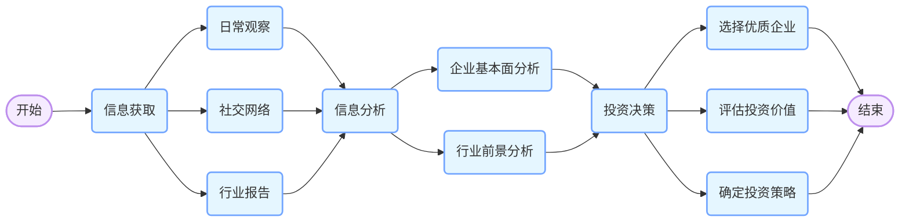

# 彼得林奇的本地投资优势理论

> 关键词：彼得林奇、本地投资优势理论、股票投资、信息优势、投资策略

> 摘要：本文围绕彼得林奇的本地投资优势理论展开深入探讨。详细介绍了该理论的背景，包括目的、预期读者等。阐述了核心概念，通过文本示意图和 Mermaid 流程图展示其架构。深入分析了核心算法原理，结合 Python 代码示例进行说明。讲解了相关数学模型和公式，并举例阐述。通过项目实战案例展示了理论的实际应用，分析了开发环境搭建、代码实现与解读。探讨了该理论在实际中的应用场景，推荐了学习该理论的工具和资源，最后总结了其未来发展趋势与挑战，还提供了常见问题解答和扩展阅读参考资料。

## 1. 背景介绍 
### 1.1 目的和范围
彼得林奇是投资界的传奇人物，他所提出的本地投资优势理论旨在为投资者提供一种基于本地信息获取和分析的有效投资策略。该理论的目的在于帮助投资者利用自身在本地生活和工作中所积累的信息优势，发掘具有投资价值的股票，从而在股票市场中获得超额收益。

本文章的范围将全面涵盖彼得林奇本地投资优势理论的各个方面，包括核心概念、算法原理、数学模型、实际应用案例等。我们将深入剖析该理论的内在逻辑和应用方法，以便读者能够更好地理解和运用这一理论进行投资决策。

### 1.2 预期读者
本文的预期读者主要包括以下几类人群：
- **个人投资者**：希望通过学习有效的投资策略，提高自己在股票市场中的投资收益，尤其是那些缺乏专业投资知识和资源的普通投资者。
- **金融从业者**：如证券分析师、投资顾问等，他们可以从本文中获取新的投资思路和分析方法，丰富自己的专业知识体系。
- **金融专业学生**：对于正在学习金融投资相关课程的学生来说，本文可以作为一个生动的案例，帮助他们更好地理解投资理论和实践之间的联系。

### 1.3 文档结构概述
本文将按照以下结构进行详细阐述：
- **核心概念与联系**：介绍彼得林奇本地投资优势理论的核心概念，通过文本示意图和 Mermaid 流程图展示其架构和逻辑关系。
- **核心算法原理 & 具体操作步骤**：深入分析该理论的核心算法原理，并结合 Python 代码示例说明具体的操作步骤。
- **数学模型和公式 & 详细讲解 & 举例说明**：介绍与该理论相关的数学模型和公式，通过详细讲解和实际例子帮助读者理解。
- **项目实战：代码实际案例和详细解释说明**：通过一个实际的投资项目案例，展示如何运用该理论进行投资决策，包括开发环境搭建、源代码实现和代码解读。
- **实际应用场景**：探讨该理论在不同市场环境和投资领域中的实际应用场景。
- **工具和资源推荐**：推荐学习该理论所需的工具和资源，包括书籍、在线课程、开发工具等。
- **总结：未来发展趋势与挑战**：总结该理论的优势和不足，分析其未来的发展趋势和可能面临的挑战。
- **附录：常见问题与解答**：解答读者在学习和应用该理论过程中可能遇到的常见问题。
- **扩展阅读 & 参考资料**：提供相关的扩展阅读资料和参考文献，方便读者进一步深入学习。

### 1.4 术语表
#### 1.4.1 核心术语定义
- **本地投资优势**：指投资者利用自己在本地生活和工作中所积累的信息，对本地企业的经营状况、市场竞争力等方面有更深入的了解，从而在投资决策中获得优势。
- **股票投资**：指投资者购买股票以获取股息和资本增值的投资行为。
- **信息优势**：指投资者在获取、分析和利用信息方面比其他投资者更具优势，从而能够做出更准确的投资决策。

#### 1.4.2 相关概念解释
- **基本面分析**：通过对企业的财务状况、经营业绩、行业前景等基本面因素进行分析，评估企业的内在价值，从而判断股票的投资价值。
- **市场效率**：指市场价格反映所有可用信息的程度。在有效市场中，股票价格已经反映了所有公开信息，投资者很难通过分析信息获得超额收益。

#### 1.4.3 缩略词列表
- **PE**：市盈率（Price-to-Earnings Ratio），指股票价格与每股收益的比率，用于衡量股票的估值水平。
- **ROE**：净资产收益率（Return on Equity），指企业净利润与净资产的比率，用于衡量企业的盈利能力。

## 2. 核心概念与联系 

### 核心概念原理
彼得林奇的本地投资优势理论基于一个简单而深刻的观点：投资者在本地生活和工作，会接触到大量关于本地企业的信息，这些信息是其他投资者难以获取的。通过对这些本地信息的分析和利用，投资者可以发现那些被市场低估的优质企业，从而进行投资并获得超额收益。

该理论的核心在于信息的获取和分析。投资者可以通过以下几种方式获取本地信息：
- **日常观察**：在日常生活中，注意观察本地企业的经营状况，如店铺的客流量、产品的销售情况等。
- **社交网络**：与本地企业的员工、客户、供应商等进行交流，了解企业的内部情况和市场口碑。
- **行业报告**：关注本地行业的发展动态和相关报告，了解行业的整体趋势和竞争格局。

### 文本示意图
```plaintext
本地投资优势理论
|
|-- 信息获取
|   |-- 日常观察
|   |-- 社交网络
|   |-- 行业报告
|
|-- 信息分析
|   |-- 企业基本面分析
|   |-- 行业前景分析
|
|-- 投资决策
|   |-- 选择优质企业
|   |-- 评估投资价值
|   |-- 确定投资策略
```

### Mermaid 流程图


## 3. 核心算法原理 & 具体操作步骤 

### 核心算法原理
彼得林奇的本地投资优势理论并没有一个严格意义上的算法，但可以将其核心思想转化为以下几个步骤：
1. **信息收集**：通过日常观察、社交网络和行业报告等方式，收集本地企业的相关信息。
2. **信息筛选**：对收集到的信息进行筛选，排除那些明显不具备投资价值的企业。
3. **基本面分析**：对筛选后的企业进行基本面分析，评估其盈利能力、财务状况、市场竞争力等。
4. **估值计算**：根据企业的基本面情况，计算其合理的估值水平。
5. **投资决策**：比较企业的当前股价和合理估值，选择那些被低估的企业进行投资。

### 具体操作步骤及 Python 代码示例
以下是一个简单的 Python 代码示例，演示如何运用上述步骤进行投资决策：

```python
import pandas as pd

# 步骤 1：信息收集
# 假设我们已经收集到了一些本地企业的信息，存储在一个 CSV 文件中
data = pd.read_csv('local_companies.csv')

# 步骤 2：信息筛选
# 假设我们只关注那些市盈率低于 20 的企业
filtered_data = data[data['PE'] < 20]

# 步骤 3：基本面分析
# 假设我们使用净资产收益率（ROE）来评估企业的盈利能力
# 筛选出 ROE 大于 15% 的企业
fundamental_analysis = filtered_data[filtered_data['ROE'] > 15]

# 步骤 4：估值计算
# 假设我们使用简单的市盈率估值法，计算企业的合理股价
fundamental_analysis['Fair_Price'] = fundamental_analysis['EPS'] * 20

# 步骤 5：投资决策
# 选择那些当前股价低于合理股价的企业
investment_decisions = fundamental_analysis[fundamental_analysis['Current_Price'] < fundamental_analysis['Fair_Price']]

print("推荐投资的企业：")
print(investment_decisions)
```

### 代码解释
- **信息收集**：使用 `pandas` 库读取存储在 CSV 文件中的本地企业信息。
- **信息筛选**：通过条件筛选，选择市盈率低于 20 的企业。
- **基本面分析**：进一步筛选出净资产收益率大于 15% 的企业。
- **估值计算**：使用市盈率估值法，计算企业的合理股价。
- **投资决策**：选择当前股价低于合理股价的企业作为推荐投资的对象。

## 4. 数学模型和公式 & 详细讲解 & 举例说明 

### 市盈率（PE）估值模型
市盈率是一种常用的股票估值方法，其公式为：

$$PE = \frac{P}{EPS}$$

其中，$PE$ 表示市盈率，$P$ 表示股票价格，$EPS$ 表示每股收益。

通过变形可以得到股票的合理价格公式：

$$P = PE \times EPS$$

### 详细讲解
市盈率反映了投资者为了获得每股收益所愿意支付的价格。一般来说，市盈率越低，股票越被低估，投资价值越高。在使用市盈率估值时，需要选择一个合理的市盈率倍数。通常可以参考同行业的平均市盈率或者企业的历史市盈率。

### 举例说明
假设某企业的每股收益为 $2$ 元，行业平均市盈率为 $20$，则该企业的合理股价为：

$$P = 20 \times 2 = 40 \text{ 元}$$

如果该企业的当前股价为 $35$ 元，则说明该股票被低估，具有投资价值。

### 净资产收益率（ROE）模型
净资产收益率是衡量企业盈利能力的重要指标，其公式为：

$$ROE = \frac{Net Income}{Shareholders' Equity}$$

其中，$ROE$ 表示净资产收益率，$Net Income$ 表示净利润，$Shareholders' Equity$ 表示股东权益。

### 详细讲解
净资产收益率反映了企业运用自有资本获取收益的能力。一般来说，净资产收益率越高，企业的盈利能力越强。投资者可以通过比较不同企业的净资产收益率，选择盈利能力较强的企业进行投资。

### 举例说明
假设某企业的净利润为 $1000$ 万元，股东权益为 $5000$ 万元，则该企业的净资产收益率为：

$$ROE = \frac{1000}{5000} = 0.2 = 20\%$$

如果同行业的平均净资产收益率为 $15\%$，则说明该企业的盈利能力较强。

## 5. 项目实战：代码实际案例和详细解释说明 

### 5.1  开发环境搭建
在进行项目实战之前，需要搭建相应的开发环境。以下是具体的步骤：
1. **安装 Python**：可以从 Python 官方网站（https://www.python.org/downloads/）下载并安装最新版本的 Python。
2. **安装必要的库**：使用 `pip` 命令安装 `pandas` 库，用于数据处理和分析。
```bash
pip install pandas
```
3. **准备数据**：收集本地企业的相关信息，存储在一个 CSV 文件中。文件应包含以下列：`Company_Name`（企业名称）、`PE`（市盈率）、`ROE`（净资产收益率）、`EPS`（每股收益）、`Current_Price`（当前股价）。

### 5.2  源代码详细实现和代码解读
以下是完整的源代码：

```python
import pandas as pd

# 步骤 1：信息收集
# 读取存储在 CSV 文件中的本地企业信息
data = pd.read_csv('local_companies.csv')

# 步骤 2：信息筛选
# 筛选出市盈率低于 20 的企业
filtered_data = data[data['PE'] < 20]

# 步骤 3：基本面分析
# 筛选出净资产收益率大于 15% 的企业
fundamental_analysis = filtered_data[filtered_data['ROE'] > 15]

# 步骤 4：估值计算
# 使用市盈率估值法，计算企业的合理股价
fundamental_analysis['Fair_Price'] = fundamental_analysis['EPS'] * 20

# 步骤 5：投资决策
# 选择当前股价低于合理股价的企业
investment_decisions = fundamental_analysis[fundamental_analysis['Current_Price'] < fundamental_analysis['Fair_Price']]

# 输出推荐投资的企业
print("推荐投资的企业：")
print(investment_decisions[['Company_Name', 'Current_Price', 'Fair_Price']])
```

### 代码解读
- **信息收集**：使用 `pandas` 库的 `read_csv` 函数读取存储在 CSV 文件中的本地企业信息。
- **信息筛选**：通过条件筛选，选择市盈率低于 20 的企业，排除那些估值过高的企业。
- **基本面分析**：进一步筛选出净资产收益率大于 15% 的企业，选择盈利能力较强的企业。
- **估值计算**：使用市盈率估值法，计算企业的合理股价。
- **投资决策**：选择当前股价低于合理股价的企业作为推荐投资的对象。

### 5.3  代码解读与分析
通过上述代码，我们可以看到如何运用彼得林奇的本地投资优势理论进行投资决策。首先，我们通过信息收集和筛选，缩小了投资范围。然后，通过基本面分析和估值计算，评估了企业的投资价值。最后，根据投资决策原则，选择了那些被低估的企业进行投资。

需要注意的是，该代码只是一个简单的示例，实际应用中可能需要考虑更多的因素，如行业前景、宏观经济环境等。此外，股票市场是复杂多变的，投资决策需要综合考虑多种因素，不能仅仅依赖于单一的指标和方法。

## 6. 实际应用场景 
彼得林奇的本地投资优势理论在实际投资中有广泛的应用场景，以下是一些常见的应用场景：

### 个人投资者
对于个人投资者来说，本地投资优势理论可以帮助他们利用自己在本地生活和工作的优势，发掘那些被市场忽视的优质企业。例如，个人投资者可以通过观察本地超市的销售情况，发现那些业绩增长良好的食品企业；或者通过与本地企业的员工交流，了解企业的内部情况和发展前景。

### 小型投资机构
小型投资机构通常资源有限，难以进行大规模的研究和分析。本地投资优势理论可以帮助他们聚焦本地市场，利用本地信息优势进行投资决策。例如，小型投资机构可以关注本地的新兴产业，发掘那些具有成长潜力的初创企业。

### 行业分析师
行业分析师可以运用本地投资优势理论，深入了解本地行业的发展动态和企业情况。通过对本地企业的实地调研和分析，行业分析师可以提供更准确的行业研究报告和投资建议。

### 长期投资
本地投资优势理论更适合长期投资。通过对本地企业的深入了解和长期跟踪，投资者可以发现企业的内在价值，并在合适的时机进行投资。长期投资可以避免短期市场波动的影响，获得更稳定的投资收益。

## 7. 工具和资源推荐
### 7.1 学习资源推荐
#### 7.1.1 书籍推荐
- 《彼得·林奇的成功投资》：彼得·林奇的经典著作，详细介绍了他的投资理念和方法，包括本地投资优势理论。
- 《战胜华尔街》：进一步阐述了彼得·林奇的投资策略和实践经验，对投资者有很大的启发。
- 《聪明的投资者》：本杰明·格雷厄姆的经典著作，是价值投资的奠基之作，对理解投资的本质和方法有很大帮助。

#### 7.1.2 在线课程
- Coursera 上的“投资学原理”课程：由知名教授授课，系统介绍了投资学的基本原理和方法。
- 网易云课堂上的“股票投资实战技巧”课程：结合实际案例，讲解股票投资的实战技巧和方法。

#### 7.1.3 技术博客和网站
- 雪球网：国内知名的投资社区，提供丰富的股票投资信息和交流平台。
- 东方财富网：提供全面的金融信息和数据分析工具，对投资者有很大的帮助。

### 7.2 开发工具框架推荐
#### 7.2.1 IDE和编辑器
- PyCharm：一款专业的 Python 集成开发环境，提供丰富的代码编辑、调试和分析功能。
- Jupyter Notebook：一种交互式的开发环境，适合进行数据探索和分析。

#### 7.2.2 调试和性能分析工具
- PDB：Python 自带的调试工具，可以帮助开发者定位和解决代码中的问题。
- cProfile：Python 自带的性能分析工具，可以帮助开发者分析代码的性能瓶颈。

#### 7.2.3 相关框架和库
- Pandas：用于数据处理和分析的 Python 库，提供了丰富的数据结构和函数。
- Numpy：用于科学计算的 Python 库，提供了高效的数组操作和数学函数。

### 7.3 相关论文著作推荐
#### 7.3.1 经典论文
- 《有效资本市场：理论与实证研究回顾》：该论文系统阐述了有效市场假说，对理解股票市场的效率和投资策略有重要意义。
- 《资本资产定价模型：理论与实证》：介绍了资本资产定价模型的基本原理和实证研究结果，是现代金融理论的重要基础。

#### 7.3.2 最新研究成果
- 关注《金融研究》、《经济研究》等国内权威金融学术期刊，了解国内最新的金融研究成果。
- 关注《Journal of Finance》、《Review of Financial Studies》等国际顶级金融学术期刊，了解国际最新的金融研究动态。

#### 7.3.3 应用案例分析
- 可以参考一些投资机构的研究报告和案例分析，了解他们如何运用各种投资理论和方法进行投资决策。
- 关注一些知名投资者的投资案例，学习他们的投资思路和方法。

## 8. 总结：未来发展趋势与挑战
### 未来发展趋势
- **数字化和智能化**：随着信息技术的不断发展，投资者可以利用大数据、人工智能等技术获取和分析更多的本地信息，提高投资决策的准确性和效率。
- **全球化和多元化**：尽管本地投资优势理论强调本地信息的重要性，但在全球化的背景下，投资者也需要关注全球市场的动态和趋势，进行多元化的投资组合。
- **社会责任投资**：越来越多的投资者开始关注企业的社会责任和可持续发展，未来本地投资优势理论可能会与社会责任投资相结合，发掘那些具有良好社会形象和可持续发展能力的企业。

### 挑战
- **信息过载**：随着信息的爆炸式增长，投资者面临着信息过载的问题，如何从海量的信息中筛选出有价值的本地信息是一个挑战。
- **市场竞争加剧**：越来越多的投资者开始关注本地投资优势理论，市场竞争加剧，可能会导致本地信息的优势逐渐减弱。
- **宏观经济环境不确定性**：宏观经济环境的不确定性会对企业的经营状况和股票市场产生影响，投资者需要考虑宏观经济因素对本地投资的影响。

## 9. 附录：常见问题与解答
### 问题 1：本地投资优势理论是否适用于所有市场？
解答：本地投资优势理论在一定程度上适用于各个市场，但在不同市场的有效性可能会有所不同。在一些新兴市场或信息不发达的市场，本地投资者可能更容易获得信息优势；而在一些成熟市场，市场效率较高，信息传播较快，本地投资优势可能会相对减弱。

### 问题 2：如何判断本地信息的可靠性？
解答：判断本地信息的可靠性需要综合考虑多个因素。可以通过多个渠道验证信息的真实性，如与不同的人交流、查阅相关的官方资料等。同时，要注意信息的来源和提供者的可信度。此外，还可以结合企业的基本面情况和市场表现，对信息进行分析和判断。

### 问题 3：本地投资优势理论是否可以完全替代其他投资理论？
解答：本地投资优势理论不能完全替代其他投资理论。不同的投资理论都有其适用的场景和局限性，投资者应该综合运用多种投资理论和方法，进行全面的分析和判断。例如，在进行投资决策时，除了考虑本地信息优势外，还需要考虑宏观经济环境、行业前景、企业基本面等因素。

### 问题 4：如何培养自己的本地信息获取能力？
解答：培养自己的本地信息获取能力可以从以下几个方面入手：
- 增加与本地企业和人群的接触，建立良好的社交网络。
- 关注本地的新闻媒体、行业协会等，获取最新的本地信息。
- 定期进行实地调研，观察本地企业的经营状况和市场情况。
- 学习数据分析和信息处理的方法，提高自己对信息的分析和利用能力。

## 10. 扩展阅读 & 参考资料
### 扩展阅读
- 《邓普顿教你逆向投资》：介绍了逆向投资的理念和方法，与本地投资优势理论有一定的互补性。
- 《金融炼金术》：乔治·索罗斯的著作，阐述了他的反身性理论和投资哲学。

### 参考资料
- 《彼得·林奇的成功投资》，彼得·林奇著
- 《有效资本市场：理论与实证研究回顾》，Eugene F. Fama 著
- 《资本资产定价模型：理论与实证》，William F. Sharpe 著

作者：AI天才研究院/AI Genius Institute & 禅与计算机程序设计艺术 /Zen And The Art of Computer Programming