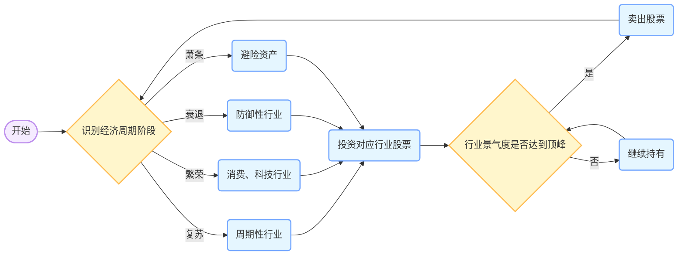

# 彼得林奇的行业轮动策略

> 关键词：彼得林奇、行业轮动策略、投资分析、股票市场、经济周期

> 摘要：本文深入探讨了彼得林奇的行业轮动策略。首先介绍了该策略提出的背景以及适用的读者群体等内容。接着详细阐述了核心概念与联系，包括策略的原理和架构，并给出了相应的文本示意图和Mermaid流程图。通过Python代码详细讲解了核心算法原理及具体操作步骤，同时介绍了相关的数学模型和公式并举例说明。在项目实战部分，给出了开发环境搭建、源代码实现与解读。分析了该策略的实际应用场景，推荐了学习、开发等方面的工具和资源，最后总结了未来发展趋势与挑战，解答了常见问题并提供了扩展阅读和参考资料，旨在帮助投资者深入理解和运用彼得林奇的行业轮动策略。

## 1. 背景介绍 
### 1.1 目的和范围
彼得林奇是投资界的传奇人物，他所提出的行业轮动策略对于投资者在股票市场中把握投资机会具有重要的指导意义。本文的目的在于全面深入地解析彼得林奇的行业轮动策略，详细阐述其核心概念、算法原理、实际应用等方面。范围涵盖了该策略从理论到实践的各个环节，包括其在不同经济周期下的表现、如何通过Python代码实现策略的模拟以及在实际投资中的具体应用等。

### 1.2 预期读者
本文预期读者包括有一定投资基础的个人投资者，他们希望通过学习专业的投资策略来提升自己的投资收益；金融行业的从业者，如分析师、基金经理等，他们需要深入研究各种投资策略以更好地为客户服务；以及对金融投资领域感兴趣的研究人员和学生，他们希望通过本文了解行业轮动策略的相关知识。

### 1.3 文档结构概述
本文将按照以下结构进行阐述：首先介绍核心概念与联系，明确行业轮动策略的基本原理和架构；接着讲解核心算法原理及具体操作步骤，通过Python代码进行详细说明；然后介绍相关的数学模型和公式并举例说明；在项目实战部分，给出开发环境搭建、源代码实现与解读；之后分析该策略的实际应用场景；推荐学习、开发等方面的工具和资源；最后总结未来发展趋势与挑战，解答常见问题并提供扩展阅读和参考资料。

### 1.4 术语表
#### 1.4.1 核心术语定义
- **行业轮动策略**：根据经济周期的不同阶段，不同行业的表现会有所差异，投资者通过在不同行业之间进行轮动投资，以获取超越市场平均水平的收益。
- **经济周期**：指经济活动沿着经济发展的总体趋势所经历的有规律的扩张和收缩，一般分为复苏、繁荣、衰退和萧条四个阶段。
- **行业景气度**：反映行业在一定时期内的发展状况和市场表现，通常通过行业的销售额、利润、增长率等指标来衡量。

#### 1.4.2 相关概念解释
- **行业轮动的驱动因素**：包括宏观经济因素、政策因素、行业自身的生命周期等。宏观经济因素如GDP增长率、通货膨胀率等会影响不同行业的需求和盈利能力；政策因素如税收政策、产业政策等会对特定行业产生影响；行业自身的生命周期则决定了行业在不同阶段的发展速度和竞争力。
- **行业轮动的时机选择**：需要综合考虑经济数据、行业指标、市场情绪等多方面因素。例如，在经济复苏初期，通常是周期性行业如钢铁、水泥等率先启动；而在经济繁荣后期，防御性行业如医药、消费等可能表现更好。

#### 1.4.3 缩略词列表
- **GDP**：国内生产总值（Gross Domestic Product）
- **PE**：市盈率（Price Earnings Ratio）

## 2. 核心概念与联系 
### 核心概念原理
彼得林奇的行业轮动策略基于对经济周期和行业特性的深刻理解。经济周期的不同阶段，各个行业的盈利能力和市场表现会有显著差异。例如，在经济复苏阶段，制造业、建筑等周期性行业往往会受益于需求的增加，业绩开始回升，股价也可能随之上涨；而在经济衰退阶段，公用事业、消费等防御性行业由于其需求相对稳定，受经济下滑的影响较小，表现可能相对较好。

投资者通过识别经济周期的不同阶段，提前布局那些即将进入景气周期的行业，在行业景气度达到顶峰时卖出，转而投资其他处于上升阶段的行业，从而实现资产的增值。

### 架构的文本示意图
```plaintext
经济周期
|-- 复苏阶段
|   |-- 周期性行业（制造业、建筑等）
|-- 繁荣阶段
|   |-- 消费、科技等行业
|-- 衰退阶段
|   |-- 防御性行业（公用事业、消费等）
|-- 萧条阶段
|   |-- 避险资产（黄金等）

投资者决策
|-- 识别经济周期阶段
|-- 选择对应行业的股票
|-- 持有至行业景气度顶峰
|-- 卖出并转投其他行业
```

### Mermaid 流程图


## 3. 核心算法原理 & 具体操作步骤 
### 核心算法原理
行业轮动策略的核心算法可以分为以下几个步骤：
1. **经济周期识别**：通过分析宏观经济数据，如GDP增长率、通货膨胀率、利率等，判断当前经济所处的周期阶段。
2. **行业选择**：根据经济周期阶段，选择对应的行业。例如，在复苏阶段选择周期性行业，在衰退阶段选择防御性行业。
3. **股票筛选**：在选定的行业中，筛选出具有投资价值的股票。可以通过财务指标（如市盈率、市净率等）、行业排名等进行筛选。
4. **投资组合构建**：根据筛选出的股票，构建投资组合。可以采用等权重、市值加权等方法进行组合构建。
5. **动态调整**：定期监测经济周期和行业景气度的变化，根据变化及时调整投资组合。

### 具体操作步骤及Python源代码
```python
import pandas as pd
import numpy as np
import matplotlib.pyplot as plt
from sklearn.linear_model import LogisticRegression

# 模拟宏观经济数据
np.random.seed(0)
n_periods = 100
gdp_growth = np.random.normal(2, 1, n_periods)
inflation = np.random.normal(2, 0.5, n_periods)
interest_rate = np.random.normal(3, 0.5, n_periods)

# 模拟经济周期标签：0 - 衰退，1 - 复苏，2 - 繁荣，3 - 萧条
economic_cycle = np.random.randint(0, 4, n_periods)

# 构建数据集
data = pd.DataFrame({
    'GDP Growth': gdp_growth,
    'Inflation': inflation,
    'Interest Rate': interest_rate,
    'Economic Cycle': economic_cycle
})

# 划分训练集和测试集
train_size = int(0.8 * n_periods)
X_train = data.iloc[:train_size, :-1]
y_train = data.iloc[:train_size, -1]
X_test = data.iloc[train_size:, :-1]
y_test = data.iloc[train_size:, -1]

# 训练逻辑回归模型进行经济周期识别
model = LogisticRegression()
model.fit(X_train, y_train)

# 预测经济周期
predicted_cycle = model.predict(X_test)

# 行业选择函数
def select_industry(cycle):
    industries = {
        0: ['Utilities', 'Consumer Staples'],
        1: ['Manufacturing', 'Construction'],
        2: ['Consumer Discretionary', 'Technology'],
        3: ['Gold']
    }
    return industries[cycle]

# 模拟行业选择
selected_industries = [select_industry(cycle) for cycle in predicted_cycle]

# 输出结果
print("Predicted Economic Cycles:", predicted_cycle)
print("Selected Industries:", selected_industries)
```
### 代码解释
1. **数据模拟**：使用`numpy`库模拟宏观经济数据和经济周期标签，构建数据集。
2. **数据划分**：将数据集划分为训练集和测试集，用于模型训练和预测。
3. **模型训练**：使用`sklearn`库中的`LogisticRegression`模型进行经济周期识别。
4. **行业选择**：定义`select_industry`函数，根据预测的经济周期选择对应的行业。
5. **结果输出**：输出预测的经济周期和选择的行业。

## 4. 数学模型和公式 & 详细讲解 & 举例说明 
### 经济周期识别模型
在上述代码中，我们使用逻辑回归模型进行经济周期识别。逻辑回归是一种广义线性模型，其基本公式为：
$$P(y = 1|x) = \frac{1}{1 + e^{-(w_0 + w_1x_1 + w_2x_2 + \cdots + w_nx_n)}}$$
其中，$P(y = 1|x)$ 表示在给定特征 $x$ 的情况下，类别为 1 的概率；$w_0, w_1, \cdots, w_n$ 是模型的参数；$x_1, x_2, \cdots, x_n$ 是特征变量。

逻辑回归通过最大化似然函数来估计参数 $w$，似然函数的表达式为：
$$L(w) = \prod_{i = 1}^{m} P(y^{(i)}|x^{(i)})^{y^{(i)}} (1 - P(y^{(i)}|x^{(i)}))^{1 - y^{(i)}}$$
其中，$m$ 是样本数量，$y^{(i)}$ 是第 $i$ 个样本的真实标签。

### 举例说明
假设我们有一个简单的数据集，包含两个特征 $x_1$ 和 $x_2$，以及对应的标签 $y$：
| $x_1$ | $x_2$ | $y$ |
| --- | --- | --- |
| 1 | 2 | 0 |
| 2 | 3 | 1 |
| 3 | 4 | 1 |

我们使用逻辑回归模型进行训练，最终得到参数 $w_0 = -1, w_1 = 0.5, w_2 = 0.3$。对于一个新的样本 $x = [4, 5]$，我们可以计算其属于类别 1 的概率：
$$P(y = 1|x) = \frac{1}{1 + e^{-(-1 + 0.5 \times 4 + 0.3 \times 5)}} = \frac{1}{1 + e^{-1.5}} \approx 0.817$$
由于 $P(y = 1|x) > 0.5$，我们预测该样本属于类别 1。

## 5. 项目实战：代码实际案例和详细解释说明 
### 5.1  开发环境搭建
为了实现彼得林奇的行业轮动策略，我们需要搭建一个Python开发环境。以下是具体步骤：
1. **安装Python**：从Python官方网站（https://www.python.org/downloads/）下载并安装Python 3.x版本。
2. **安装必要的库**：使用`pip`命令安装所需的库，包括`pandas`、`numpy`、`matplotlib`、`sklearn`等。
```bash
pip install pandas numpy matplotlib scikit-learn
```
3. **选择开发工具**：可以选择使用Jupyter Notebook、PyCharm等开发工具进行代码编写和调试。

### 5.2  源代码详细实现和代码解读
```python
import pandas as pd
import numpy as np
import matplotlib.pyplot as plt
from sklearn.linear_model import LogisticRegression
import yfinance as yf

# 下载历史数据
tickers = ['XLI', 'XLY', 'XLP', 'XLU', 'GLD']  # 分别代表工业、可选消费、必选消费、公用事业、黄金
start_date = '2010-01-01'
end_date = '2023-01-01'
data = yf.download(tickers, start=start_date, end=end_date)['Adj Close']

# 计算收益率
returns = data.pct_change().dropna()

# 模拟宏观经济数据（这里简化处理）
gdp_growth = np.random.normal(2, 1, len(returns))
inflation = np.random.normal(2, 0.5, len(returns))
interest_rate = np.random.normal(3, 0.5, len(returns))

# 构建数据集
features = pd.DataFrame({
    'GDP Growth': gdp_growth,
    'Inflation': inflation,
    'Interest Rate': interest_rate
})

# 划分训练集和测试集
train_size = int(0.8 * len(returns))
X_train = features.iloc[:train_size]
y_train = np.random.randint(0, 4, train_size)  # 模拟经济周期标签
X_test = features.iloc[train_size:]

# 训练逻辑回归模型进行经济周期识别
model = LogisticRegression()
model.fit(X_train, y_train)

# 预测经济周期
predicted_cycle = model.predict(X_test)

# 行业选择函数
def select_industry(cycle):
    industries = {
        0: ['XLU', 'XLP'],
        1: ['XLI'],
        2: ['XLY'],
        3: ['GLD']
    }
    return industries[cycle]

# 模拟行业轮动投资
portfolio_returns = []
for i in range(len(predicted_cycle)):
    selected_industry = select_industry(predicted_cycle[i])
    industry_returns = returns.iloc[train_size + i][selected_industry]
    portfolio_return = industry_returns.mean()
    portfolio_returns.append(portfolio_return)

# 计算累计收益率
cumulative_returns = (1 + np.array(portfolio_returns)).cumprod()

# 绘制累计收益率曲线
plt.figure(figsize=(10, 6))
plt.plot(cumulative_returns)
plt.title('Cumulative Returns of Sector Rotation Strategy')
plt.xlabel('Time')
plt.ylabel('Cumulative Returns')
plt.show()
```
### 代码解读
1. **数据下载**：使用`yfinance`库下载不同行业ETF的历史数据。
2. **收益率计算**：计算各行业ETF的日收益率。
3. **宏观经济数据模拟**：简化处理，模拟GDP增长率、通货膨胀率和利率等宏观经济数据。
4. **数据集构建**：将宏观经济数据作为特征，构建数据集。
5. **模型训练**：使用逻辑回归模型进行经济周期识别。
6. **行业选择**：根据预测的经济周期选择对应的行业。
7. **投资模拟**：模拟行业轮动投资，计算投资组合的收益率。
8. **累计收益率计算与绘图**：计算累计收益率并绘制曲线，直观展示策略的表现。

### 5.3  代码解读与分析
通过上述代码，我们实现了一个简单的行业轮动策略模拟。在实际应用中，宏观经济数据的获取可以通过专业的金融数据提供商，如Wind、Bloomberg等。同时，经济周期的识别模型可以使用更复杂的机器学习算法，如随机森林、支持向量机等，以提高预测的准确性。

从代码运行结果的累计收益率曲线可以看出，行业轮动策略的表现受到经济周期预测准确性和行业选择的影响。如果能够准确识别经济周期并选择合适的行业，该策略有望获得超越市场平均水平的收益。

## 6. 实际应用场景 
### 个人投资者
对于个人投资者来说，彼得林奇的行业轮动策略可以帮助他们在不同的经济环境下调整投资组合，降低风险并提高收益。例如，在经济复苏阶段，个人投资者可以增加对周期性行业股票的投资；而在经济衰退阶段，增加对防御性行业股票的配置。

### 基金管理公司
基金管理公司可以运用行业轮动策略构建基金产品，为投资者提供多样化的投资选择。通过专业的研究团队对经济周期和行业趋势的分析，基金经理可以更准确地进行行业轮动操作，提高基金的业绩表现。

### 宏观经济研究机构
宏观经济研究机构可以使用行业轮动策略来分析经济周期的变化和行业发展趋势。通过对不同行业的数据分析和监测，研究机构可以为政府和企业提供决策参考，促进经济的稳定发展。

## 7. 工具和资源推荐
### 7.1 学习资源推荐
#### 7.1.1 书籍推荐
- 《彼得林奇的成功投资》：彼得林奇的经典著作，详细介绍了他的投资理念和方法，包括行业轮动策略的相关内容。
- 《聪明的投资者》：本杰明·格雷厄姆的代表作，是价值投资的经典书籍，对于理解投资的基本原理和方法有很大帮助。
- 《金融市场技术分析》：约翰·墨菲的著作，介绍了技术分析的基本理论和方法，对于分析市场趋势和行业轮动有一定的参考价值。

#### 7.1.2 在线课程
- Coursera上的“投资学原理”课程：由知名大学的教授授课，系统介绍了投资学的基本原理和方法，包括行业轮动策略的相关内容。
- 网易云课堂上的“金融投资实战课程”：结合实际案例，讲解了投资分析和决策的方法，对于理解行业轮动策略的应用有很大帮助。

#### 7.1.3 技术博客和网站
- 雪球网：国内知名的投资社区，提供了丰富的投资资讯和分析文章，投资者可以在上面交流和学习行业轮动策略的应用经验。
- Seeking Alpha：国外知名的投资研究网站，提供了专业的投资分析和研究报告，对于了解国际市场的行业轮动趋势有很大帮助。

### 7.2 开发工具框架推荐
#### 7.2.1 IDE和编辑器
- PyCharm：一款专业的Python集成开发环境，具有强大的代码编辑、调试和分析功能，适合进行行业轮动策略的代码开发。
- Jupyter Notebook：一个交互式的开发环境，支持代码、文本、图表等多种形式的展示，方便进行数据分析和可视化，对于行业轮动策略的研究和测试非常有用。

#### 7.2.2 调试和性能分析工具
- pdb：Python自带的调试工具，可以帮助开发者逐行调试代码，查找问题。
- cProfile：Python的性能分析工具，可以分析代码的运行时间和函数调用情况，帮助开发者优化代码性能。

#### 7.2.3 相关框架和库
- pandas：一个强大的数据分析库，提供了丰富的数据结构和数据处理方法，对于处理金融数据和进行行业轮动策略的分析非常有用。
- numpy：一个用于科学计算的库，提供了高效的数组操作和数学函数，是很多数据分析和机器学习库的基础。
- scikit-learn：一个常用的机器学习库，提供了多种机器学习算法和工具，对于经济周期识别和行业选择模型的构建非常有帮助。

### 7.3 相关论文著作推荐
#### 7.3.1 经典论文
- "Industry Rotation Strategies and the Business Cycle"：该论文深入研究了行业轮动策略与经济周期的关系，通过实证分析验证了行业轮动策略的有效性。
- "The Equity Risk Premium: A Solution"：论文探讨了股票市场的风险溢价问题，对于理解行业轮动策略在不同市场环境下的表现有一定的参考价值。

#### 7.3.2 最新研究成果
- 近年来，随着人工智能和大数据技术的发展，一些研究开始将这些技术应用于行业轮动策略的研究中。例如，使用深度学习算法进行经济周期预测和行业选择，提高了策略的准确性和有效性。

#### 7.3.3 应用案例分析
- 一些金融机构和研究机构会发布行业轮动策略的应用案例分析报告，通过实际案例展示策略的实施过程和效果。这些报告可以帮助投资者更好地理解和应用行业轮动策略。

## 8. 总结：未来发展趋势与挑战
### 未来发展趋势
- **智能化和自动化**：随着人工智能和机器学习技术的不断发展，行业轮动策略将越来越智能化和自动化。通过大数据分析和深度学习算法，可以更准确地识别经济周期和行业趋势，实现自动化的投资决策。
- **跨市场和跨资产**：未来的行业轮动策略将不仅仅局限于股票市场，还将涉及债券、期货、外汇等多个市场和资产类别。通过跨市场和跨资产的轮动投资，可以进一步降低风险，提高收益。
- **个性化定制**：随着投资者需求的多样化，行业轮动策略将越来越注重个性化定制。根据投资者的风险偏好、投资目标和投资期限等因素，为投资者提供定制化的行业轮动投资方案。

### 挑战
- **经济周期预测的准确性**：准确预测经济周期是行业轮动策略成功的关键。然而，经济周期受到多种因素的影响，如政策变化、突发事件等，使得经济周期的预测具有一定的难度。
- **市场的不确定性**：股票市场和其他金融市场具有高度的不确定性，行业轮动策略可能会受到市场波动、黑天鹅事件等因素的影响，导致策略的表现不如预期。
- **数据质量和隐私问题**：行业轮动策略的实施需要大量的金融数据和宏观经济数据。数据的质量和隐私问题将是未来面临的重要挑战，如何保证数据的准确性、完整性和安全性，以及如何合法合规地使用数据，是需要解决的问题。

## 9. 附录：常见问题与解答
### 问题1：行业轮动策略适合所有投资者吗？
解答：行业轮动策略并不适合所有投资者。该策略需要投资者具备一定的投资知识和经验，能够对经济周期和行业趋势进行分析和判断。对于缺乏投资经验的投资者来说，可能难以准确把握行业轮动的时机，反而可能增加投资风险。

### 问题2：如何判断经济周期的阶段？
解答：判断经济周期的阶段可以通过分析宏观经济数据，如GDP增长率、通货膨胀率、利率等。同时，也可以关注一些领先指标，如PMI（采购经理人指数）、消费者信心指数等。此外，还可以参考专业机构的研究报告和分析观点。

### 问题3：行业轮动策略的风险如何控制？
解答：可以通过以下方法控制行业轮动策略的风险：
- 分散投资：不要将所有资金集中在一个行业或几只股票上，而是分散投资于不同的行业和资产类别。
- 设定止损点：在投资过程中，设定合理的止损点，当投资损失达到一定程度时，及时止损，避免损失进一步扩大。
- 定期调整投资组合：根据经济周期和行业趋势的变化，定期调整投资组合，确保投资组合的合理性和有效性。

## 10. 扩展阅读 & 参考资料
### 扩展阅读
- 《金融炼金术》：乔治·索罗斯的著作，介绍了他的反身性理论和投资哲学，对于理解金融市场的运行机制和投资策略有一定的启发。
- 《漫步华尔街》：伯顿·马尔基尔的著作，介绍了随机漫步理论和有效市场假说，对于理解股票市场的效率和投资策略的有效性有很大帮助。

### 参考资料
- 彼得林奇的官方网站和相关访谈记录。
- 金融数据提供商（如Wind、Bloomberg等）的数据库和研究报告。
- 学术期刊和会议论文，如《金融研究》、《管理世界》等。

作者：AI天才研究院/AI Genius Institute & 禅与计算机程序设计艺术 /Zen And The Art of Computer Programming