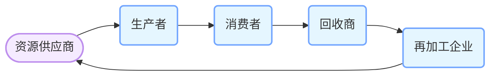

# 循环经济商业模式的可扩展性与投资机会

> 关键词：循环经济、商业模式、可扩展性、投资机会、可持续发展

> 摘要：本文深入探讨了循环经济商业模式的可扩展性与投资机会。首先介绍了循环经济的背景，包括其目的、预期读者、文档结构等。接着阐述了循环经济商业模式的核心概念及联系，分析了核心算法原理与具体操作步骤，给出了相关数学模型和公式。通过项目实战展示了代码实现与分析，探讨了实际应用场景。同时推荐了学习资源、开发工具框架及相关论文著作。最后总结了循环经济商业模式的未来发展趋势与挑战，解答了常见问题，并提供了扩展阅读与参考资料。旨在为读者全面了解循环经济商业模式的可扩展性和投资潜力提供有价值的参考。

## 1. 背景介绍 
### 1.1 目的和范围
循环经济作为一种可持续的经济发展模式，旨在通过资源的高效利用和循环利用，减少对自然资源的依赖，降低环境影响。本文章的目的是深入研究循环经济商业模式的可扩展性，即探讨这些商业模式如何在不同的行业、地域和规模下复制、拓展和创新。同时，分析其中蕴含的投资机会，为投资者提供决策依据，帮助他们识别有潜力的循环经济项目和企业。

文章的范围涵盖了循环经济商业模式的各个方面，包括其概念、原理、实现方式、市场前景等。不仅关注理论层面的探讨，还结合实际案例进行分析，以确保研究成果具有现实指导意义。

### 1.2 预期读者
本文预期读者包括但不限于以下几类人群：
- **投资者**：希望了解循环经济领域的投资机会，寻找具有潜力的投资项目，实现资产的增值和可持续发展。
- **企业管理者**：关注企业的可持续发展战略，希望借鉴循环经济商业模式，提升企业的竞争力和社会形象。
- **政策制定者**：需要制定相关政策来推动循环经济的发展，了解循环经济商业模式的特点和需求，有助于制定更加科学合理的政策。
- **研究人员**：对循环经济领域的理论和实践进行深入研究，本文可以为他们提供新的研究思路和参考资料。
- **创业者**：有意进入循环经济领域创业，希望了解该领域的商业模式和市场机会，为创业项目的策划和实施提供指导。

### 1.3 文档结构概述
本文将按照以下结构进行组织：
- **核心概念与联系**：介绍循环经济商业模式的核心概念、原理和架构，通过文本示意图和 Mermaid 流程图直观展示其内部联系。
- **核心算法原理 & 具体操作步骤**：阐述循环经济商业模式中涉及的核心算法原理，并使用 Python 源代码详细说明具体操作步骤。
- **数学模型和公式 & 详细讲解 & 举例说明**：给出循环经济商业模式的数学模型和公式，进行详细讲解并通过具体例子说明其应用。
- **项目实战：代码实际案例和详细解释说明**：通过一个实际的项目案例，展示循环经济商业模式的代码实现过程，并对代码进行详细解读和分析。
- **实际应用场景**：探讨循环经济商业模式在不同行业和领域的实际应用场景，分析其优势和挑战。
- **工具和资源推荐**：推荐学习循环经济商业模式的相关资源，包括书籍、在线课程、技术博客和网站等，同时介绍开发工具框架和相关论文著作。
- **总结：未来发展趋势与挑战**：总结循环经济商业模式的未来发展趋势，分析面临的挑战，并提出相应的应对策略。
- **附录：常见问题与解答**：解答读者在阅读过程中可能遇到的常见问题。
- **扩展阅读 & 参考资料**：提供扩展阅读的建议和相关参考资料，方便读者进一步深入研究。

### 1.4 术语表
#### 1.4.1 核心术语定义
- **循环经济**：是一种以资源的高效利用和循环利用为核心，以“减量化、再利用、资源化”为原则，以低消耗、低排放、高效率为基本特征，符合可持续发展理念的经济增长模式。
- **商业模式**：是企业为了创造价值、传递价值和获取价值而建立的一种逻辑架构和运营方式。
- **可扩展性**：指商业模式能够在不同的环境和条件下，通过复制、改进和创新等方式，实现规模的扩大和范围的拓展。
- **投资机会**：指在特定的市场环境和经济条件下，投资者能够获得收益的投资项目和领域。

#### 1.4.2 相关概念解释
- **资源循环利用**：是循环经济的核心环节，包括对废弃物的回收、再加工和再利用，以减少资源的浪费和环境的污染。
- **闭环供应链**：是一种将产品的生产、销售和回收等环节有机结合起来的供应链模式，通过实现资源的循环流动，提高供应链的效率和可持续性。
- **可持续发展**：是指既满足当代人的需求，又不损害后代人满足其需求的能力的发展模式。

#### 1.4.3 缩略词列表
- **CE**：循环经济（Circular Economy）
- **B2B**：企业对企业（Business-to-Business）
- **B2C**：企业对消费者（Business-to-Consumer）

## 2. 核心概念与联系 
### 核心概念原理
循环经济商业模式的核心原理是基于资源的循环利用和价值的最大化。传统的线性经济模式遵循“资源 - 产品 - 废弃物”的单向流动，而循环经济则构建了一个“资源 - 产品 - 再生资源”的闭环系统。在这个系统中，产品在其生命周期结束后，通过回收、再加工等环节，重新进入生产过程，实现资源的循环利用。

这种商业模式的实现需要多个参与主体的协同合作，包括生产者、消费者、回收商、再加工企业等。生产者需要设计易于回收和再利用的产品，消费者需要积极参与废弃物的分类和回收，回收商负责收集和运输废弃物，再加工企业则将废弃物转化为再生资源。

### 架构的文本示意图
```plaintext
循环经济商业模式架构

            ┌─────────────┐
            │  资源供应商  │
            └─────────────┘
                   │
                   ▼
            ┌─────────────┐
            │  生产者      │
            │  （产品设计） │
            └─────────────┘
                   │
                   ▼
            ┌─────────────┐
            │  消费者      │
            │  （产品使用） │
            └─────────────┘
                   │
                   ▼
            ┌─────────────┐
            │  回收商      │
            │  （废弃物收集）│
            └─────────────┘
                   │
                   ▼
            ┌─────────────┐
            │  再加工企业  │
            │  （再生资源生产）│
            └─────────────┘
                   │
                   ▼
            ┌─────────────┐
            │  资源供应商  │
            └─────────────┘
```

### Mermaid 流程图


这个流程图展示了循环经济商业模式中各个参与主体之间的循环关系。资源供应商提供原材料给生产者，生产者生产产品供消费者使用，消费者使用完产品后将废弃物交给回收商，回收商将废弃物运输到再加工企业，再加工企业将废弃物转化为再生资源，重新供给资源供应商，形成一个闭环。

## 3. 核心算法原理 & 具体操作步骤 
### 核心算法原理
在循环经济商业模式中，一个重要的算法原理是资源优化配置算法。该算法的目标是在满足产品生产需求的前提下，最大化地利用再生资源，减少对原生资源的依赖。

资源优化配置算法的基本思路是通过对资源的供需情况进行分析，建立数学模型，然后使用优化算法求解最优的资源配置方案。具体步骤如下：
1. **数据收集**：收集资源的供需数据，包括原生资源和再生资源的供应量、产品生产对资源的需求量等。
2. **模型建立**：根据收集到的数据，建立资源优化配置的数学模型，通常可以表示为一个线性规划问题。
3. **算法求解**：使用线性规划求解器求解数学模型，得到最优的资源配置方案。
4. **方案实施**：根据求解得到的方案，实施资源的配置和调度。

### 具体操作步骤（Python 源代码）
以下是一个简单的资源优化配置算法的 Python 实现示例：

```python
from pulp import LpMaximize, LpProblem, LpVariable

# 定义问题
prob = LpProblem("Resource_Optimization", LpMaximize)

# 定义变量
# 原生资源的使用量
x1 = LpVariable("x1", lowBound=0)
# 再生资源的使用量
x2 = LpVariable("x2", lowBound=0)

# 定义目标函数
# 假设再生资源的使用价值更高，目标是最大化再生资源的使用量
prob += x2

# 定义约束条件
# 产品生产对资源的总需求量
total_demand = 100
# 原生资源的供应量
primary_supply = 80
# 再生资源的供应量
recycled_supply = 60

# 资源总量满足需求
prob += x1 + x2 == total_demand
# 原生资源不超过供应量
prob += x1 <= primary_supply
# 再生资源不超过供应量
prob += x2 <= recycled_supply

# 求解问题
prob.solve()

# 输出结果
print("Status:", prob.status)
print("Optimal Solution:")
print("Primary Resource Usage:", x1.value())
print("Recycled Resource Usage:", x2.value())
```

### 代码解释
1. **导入模块**：使用 `pulp` 库来解决线性规划问题。
2. **定义问题**：创建一个最大化问题 `Resource_Optimization`。
3. **定义变量**：定义两个变量 `x1` 和 `x2` 分别表示原生资源和再生资源的使用量，且使用量不能为负数。
4. **定义目标函数**：目标是最大化再生资源的使用量，即 `x2`。
5. **定义约束条件**：
    - 资源总量要满足产品生产的总需求。
    - 原生资源和再生资源的使用量不能超过各自的供应量。
6. **求解问题**：调用 `prob.solve()` 方法求解线性规划问题。
7. **输出结果**：输出问题的求解状态和最优的资源配置方案。

通过这个算法和代码示例，我们可以在给定资源供需条件下，找到最优的资源配置方案，实现资源的优化利用。

## 4. 数学模型和公式 & 详细讲解 & 举例说明 
### 数学模型
资源优化配置问题可以用线性规划模型来表示。设 $x_1$ 表示原生资源的使用量，$x_2$ 表示再生资源的使用量，$b$ 表示产品生产对资源的总需求量，$s_1$ 表示原生资源的供应量，$s_2$ 表示再生资源的供应量。

目标函数：
$$\max Z = c_2x_2$$
其中 $c_2$ 是再生资源的价值系数，这里假设为 1（即最大化再生资源的使用量）。

约束条件：
$$x_1 + x_2 = b$$
$$x_1 \leq s_1$$
$$x_2 \leq s_2$$
$$x_1 \geq 0, x_2 \geq 0$$

### 详细讲解
- **目标函数**：目标是最大化再生资源的使用量，因为再生资源的使用可以减少对原生资源的依赖，降低环境影响。
- **约束条件**：
    - 第一个约束条件表示资源的总量要满足产品生产的总需求，即原生资源和再生资源的使用量之和等于总需求量。
    - 第二个和第三个约束条件分别表示原生资源和再生资源的使用量不能超过各自的供应量。
    - 最后两个约束条件表示资源的使用量不能为负数。

### 举例说明
假设产品生产对资源的总需求量 $b = 100$，原生资源的供应量 $s_1 = 80$，再生资源的供应量 $s_2 = 60$。

将这些值代入线性规划模型中，通过求解目标函数和约束条件，得到最优的资源配置方案。

在前面的 Python 代码示例中，我们已经实现了这个求解过程。运行代码后，得到的结果可能是：
- 原生资源使用量 $x_1 = 40$
- 再生资源使用量 $x_2 = 60$

这意味着在满足产品生产需求的前提下，我们应该尽可能多地使用再生资源，当再生资源的供应量足够时，优先使用再生资源。

## 5. 项目实战：代码实际案例和详细解释说明 
### 5.1  开发环境搭建
在进行循环经济商业模式的项目实战之前，需要搭建相应的开发环境。以下是具体步骤：

#### 安装 Python
首先，确保你已经安装了 Python。可以从 Python 官方网站（https://www.python.org/downloads/）下载适合你操作系统的 Python 版本，并按照安装向导进行安装。

#### 安装必要的库
在项目中，我们使用了 `pulp` 库来解决线性规划问题。可以使用以下命令来安装 `pulp` 库：
```sh
pip install pulp
```

### 5.2  源代码详细实现和代码解读
以下是一个更完整的循环经济商业模式项目的 Python 代码示例，包含了数据输入、模型建立、求解和结果输出等步骤：

```python
from pulp import LpMaximize, LpProblem, LpVariable

def resource_optimization(total_demand, primary_supply, recycled_supply):
    # 定义问题
    prob = LpProblem("Resource_Optimization", LpMaximize)

    # 定义变量
    x1 = LpVariable("x1", lowBound=0)
    x2 = LpVariable("x2", lowBound=0)

    # 定义目标函数
    prob += x2

    # 定义约束条件
    prob += x1 + x2 == total_demand
    prob += x1 <= primary_supply
    prob += x2 <= recycled_supply

    # 求解问题
    prob.solve()

    # 输出结果
    if prob.status == 1:
        print("Optimal Solution Found:")
        print("Primary Resource Usage:", x1.value())
        print("Recycled Resource Usage:", x2.value())
    else:
        print("No optimal solution found.")

    return x1.value(), x2.value()

# 示例数据
total_demand = 150
primary_supply = 100
recycled_supply = 80

# 调用函数进行资源优化配置
primary_usage, recycled_usage = resource_optimization(total_demand, primary_supply, recycled_supply)
```

### 5.3  代码解读与分析
- **函数定义**：`resource_optimization` 函数接受三个参数：`total_demand` 表示产品生产对资源的总需求量，`primary_supply` 表示原生资源的供应量，`recycled_supply` 表示再生资源的供应量。
- **问题定义**：使用 `LpProblem` 定义一个最大化问题 `Resource_Optimization`。
- **变量定义**：定义两个变量 `x1` 和 `x2` 分别表示原生资源和再生资源的使用量，且使用量不能为负数。
- **目标函数**：目标是最大化再生资源的使用量，即 `x2`。
- **约束条件**：
    - 资源总量要满足产品生产的总需求。
    - 原生资源和再生资源的使用量不能超过各自的供应量。
- **求解问题**：调用 `prob.solve()` 方法求解线性规划问题。
- **结果输出**：根据求解状态输出最优解或提示没有找到最优解。

通过这个代码示例，我们可以根据不同的资源供需情况，快速计算出最优的资源配置方案，为循环经济商业模式的实施提供决策支持。

## 6. 实际应用场景 
### 制造业
在制造业中，循环经济商业模式可以通过产品的再制造和零部件的回收利用来实现。例如，汽车制造企业可以回收废旧汽车，对其零部件进行检测、修复和再加工，然后将这些零部件重新用于新车的生产。这样不仅可以降低生产成本，还可以减少原材料的消耗和废弃物的排放。

### 电子电器行业
电子电器产品更新换代速度快，产生了大量的电子废弃物。循环经济商业模式可以通过电子废弃物的回收、拆解和再利用来实现资源的循环利用。例如，回收废旧手机中的贵金属、塑料等材料，经过加工后重新用于手机的生产。

### 包装行业
包装行业是一个资源消耗较大的行业，循环经济商业模式可以通过推广可回收、可降解的包装材料，以及建立包装回收体系来实现资源的循环利用。例如，一些企业采用纸质包装代替塑料包装，并建立了包装回收箱，鼓励消费者将使用后的包装进行回收。

### 农业
在农业领域，循环经济商业模式可以通过农业废弃物的资源化利用来实现。例如，将农作物秸秆进行发酵处理，生产沼气作为能源，剩余的沼渣和沼液可以作为有机肥料还田，提高土壤肥力。

### 建筑行业
建筑行业在建设和拆除过程中会产生大量的建筑垃圾。循环经济商业模式可以通过建筑垃圾的回收和再利用来减少资源的浪费。例如，将废弃的混凝土、砖块等进行破碎和筛分，制成再生骨料，用于道路基层和建筑基础的施工。

## 7. 工具和资源推荐
### 7.1 学习资源推荐
#### 7.1.1 书籍推荐
- 《循环经济：理论、方法与案例》：全面介绍了循环经济的理论、方法和实践案例，是学习循环经济的经典书籍。
- 《从摇篮到摇篮：重塑制造方式》：提出了“从摇篮到摇篮”的设计理念，强调产品设计要考虑整个生命周期的环境影响，对循环经济商业模式的设计有很大的启发。
- 《零废弃社会》：探讨了如何实现零废弃的社会目标，介绍了相关的政策、技术和实践经验。

#### 7.1.2 在线课程
- Coursera 上的“Circular Economy: An Introduction”：由知名教授授课，系统介绍了循环经济的基本概念、原理和实践。
- edX 上的“Circular Economy and the Role of Business”：聚焦于企业在循环经济中的角色和作用，通过实际案例分析，帮助学员了解如何在企业中实施循环经济商业模式。

#### 7.1.3 技术博客和网站
- 循环经济网（https://www.cycle-economy.com/）：提供了丰富的循环经济资讯、政策法规、技术动态等内容。
- 世界经济论坛（https://www.weforum.org/）：关注全球可持续发展问题，发布了许多关于循环经济的研究报告和观点文章。

### 7.2 开发工具框架推荐
#### 7.2.1 IDE和编辑器
- PyCharm：是一款专业的 Python 集成开发环境，提供了丰富的代码编辑、调试和分析功能，适合开发循环经济相关的 Python 项目。
- Visual Studio Code：是一款轻量级的代码编辑器，支持多种编程语言，通过安装相关插件可以方便地进行 Python 开发。

#### 7.2.2 调试和性能分析工具
- `pdb`：Python 内置的调试器，可以帮助开发者快速定位代码中的问题。
- `cProfile`：Python 标准库中的性能分析工具，可以分析代码的运行时间和函数调用情况，帮助开发者优化代码性能。

#### 7.2.3 相关框架和库
- `pulp`：用于解决线性规划、整数规划等优化问题，在资源优化配置算法中非常有用。
- `pandas`：用于数据处理和分析，可以帮助开发者处理和分析循环经济中的资源供需数据。

### 7.3 相关论文著作推荐
#### 7.3.1 经典论文
- “The Circular Economy – A new sustainability paradigm?”：探讨了循环经济作为一种新的可持续发展范式的理论基础和实践意义。
- “Conceptualizing the circular economy through products' life cycle lens”：从产品生命周期的角度对循环经济进行了概念化分析。

#### 7.3.2 最新研究成果
- 可以通过学术数据库如 Web of Science、Scopus 等搜索关于循环经济商业模式的最新研究论文，了解该领域的前沿动态。

#### 7.3.3 应用案例分析
- 许多企业和研究机构会发布循环经济商业模式的应用案例分析报告，可以通过相关企业官网、行业协会网站等渠道获取这些报告，学习实际案例中的经验和做法。

## 8. 总结：未来发展趋势与挑战
### 未来发展趋势
- **技术创新推动**：随着科技的不断进步，如物联网、大数据、人工智能等技术的应用，将为循环经济商业模式的发展提供更强大的支持。例如，通过物联网技术可以实现对产品全生命周期的跟踪和管理，提高资源的利用效率。
- **政策支持加强**：政府对循环经济的重视程度不断提高，将出台更多的政策措施来推动循环经济的发展。例如，给予循环经济企业税收优惠、财政补贴等支持，促进循环经济产业的发展。
- **消费者意识提升**：消费者对环境保护和可持续发展的意识不断增强，越来越愿意选择具有环保和可持续性的产品和服务。这将促使企业更加积极地采用循环经济商业模式，以满足消费者的需求。
- **跨行业合作增加**：循环经济的发展需要不同行业之间的协同合作，未来跨行业的合作将不断增加。例如，制造业与回收行业、能源行业等的合作，共同推动资源的循环利用。

### 挑战
- **技术难题**：虽然科技在不断进步，但在循环经济领域仍然存在一些技术难题，如某些废弃物的高效回收和再利用技术还不够成熟，需要进一步的研发和创新。
- **经济成本**：循环经济商业模式的实施可能需要较高的前期投资，如建设回收设施、研发再利用技术等。这对于一些企业来说可能是一个较大的经济负担，需要寻找合适的商业模式和融资渠道来降低成本。
- **政策法规不完善**：目前循环经济的政策法规还不够完善，存在一些政策空白和执行不到位的问题。需要进一步完善政策法规体系，加强政策的引导和监管作用。
- **消费者行为改变困难**：改变消费者的消费习惯和行为是一个长期而艰巨的任务。虽然消费者的环保意识在不断提高，但要真正实现大规模的绿色消费还需要更多的宣传和教育。

### 应对策略
- **加强技术研发**：加大对循环经济技术研发的投入，鼓励科研机构和企业开展相关技术的研究和创新，突破技术瓶颈。
- **创新商业模式**：探索多元化的商业模式，如共享经济、产品即服务等，降低循环经济商业模式的经济成本，提高企业的盈利能力。
- **完善政策法规**：政府应进一步完善循环经济的政策法规体系，明确各参与主体的责任和义务，加强政策的执行和监管力度。
- **加强宣传教育**：通过各种渠道加强对循环经济和绿色消费的宣传教育，提高消费者的环保意识和责任感，引导消费者积极参与循环经济。

## 9. 附录：常见问题与解答
### 问题 1：循环经济商业模式的实施难度大吗？
解答：循环经济商业模式的实施难度因行业和企业而异。对于一些已经建立了完善的回收和再利用体系的行业，实施难度相对较小；而对于一些新兴行业或技术含量较高的领域，实施难度可能较大。总体来说，实施循环经济商业模式需要企业具备一定的技术、资金和管理能力，同时也需要政府和社会的支持。

### 问题 2：循环经济商业模式能带来哪些经济效益？
解答：循环经济商业模式可以带来多方面的经济效益。首先，通过资源的循环利用可以降低企业的生产成本，提高资源的利用效率。其次，开发再生资源市场可以为企业带来新的业务增长点和利润来源。此外，采用循环经济商业模式还可以提升企业的社会形象，增强企业的市场竞争力，从而获得更多的商业机会。

### 问题 3：如何评估循环经济项目的投资价值？
解答：评估循环经济项目的投资价值需要综合考虑多个因素。包括项目的技术可行性、市场前景、经济效益、环境效益等。可以通过进行市场调研、技术分析、财务预测等方法，对项目的投资回报率、净现值、内部收益率等指标进行评估，同时也要考虑项目的风险因素，如政策风险、技术风险等。

### 问题 4：循环经济商业模式与传统商业模式有哪些区别？
解答：传统商业模式通常遵循线性经济模式，即“资源 - 产品 - 废弃物”的单向流动，注重产品的生产和销售，对资源的利用效率较低，会产生大量的废弃物。而循环经济商业模式构建了一个“资源 - 产品 - 再生资源”的闭环系统，强调资源的循环利用和价值的最大化，注重产品的全生命周期管理，能够减少对自然资源的依赖，降低环境影响。

## 10. 扩展阅读 & 参考资料
### 扩展阅读
- 《蓝色经济》：介绍了一种全新的经济发展模式，强调通过创新和合作实现资源的高效利用和可持续发展，与循环经济有一定的关联。
- 《第三次工业革命》：探讨了第三次工业革命的特点和趋势，其中包括循环经济等可持续发展理念在工业领域的应用。

### 参考资料
- Stahel, W. R. (2016). The circular economy. Nature, 531(7595), 435-438.
- Geissdoerfer, M., Savaget, P., Bocken, N. M. P., & Hultink, E. J. (2017). The circular economy–a new sustainability paradigm? Journal of Cleaner Production, 143, 757-768.

作者：AI天才研究院/AI Genius Institute & 禅与计算机程序设计艺术 /Zen And The Art of Computer Programming