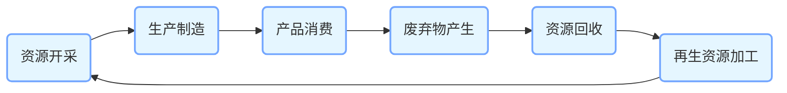

# 循环经济在不同行业的应用前景比较

> 关键词：循环经济、行业应用、应用前景、资源回收、可持续发展

> 摘要：本文聚焦于循环经济在不同行业的应用前景比较。首先介绍循环经济的背景和相关概念，阐述其重要性与发展趋势。接着深入探讨循环经济的核心概念与联系，通过示意图和流程图展示其原理架构。详细讲解核心算法原理与操作步骤，运用数学模型和公式进行理论分析并举例说明。通过项目实战案例，展示循环经济在实际中的代码实现与应用。分析不同行业中循环经济的实际应用场景，推荐相关学习资源、开发工具和论文著作。最后总结循环经济的未来发展趋势与挑战，解答常见问题并提供扩展阅读和参考资料，旨在全面呈现循环经济在各行业的应用前景差异与潜力。

## 1. 背景介绍 
### 1.1 目的和范围
目的在于全面、系统地比较循环经济在不同行业的应用前景，为企业、政府和投资者等提供决策依据，推动循环经济的广泛应用和可持续发展。范围涵盖制造业、农业、服务业、能源业等多个主要行业，分析各行业中循环经济的应用模式、优势、挑战以及未来发展潜力。

### 1.2 预期读者
本文预期读者包括从事经济、环境、管理等领域的研究人员，各行业的企业管理者和从业者，政府相关部门的政策制定者，以及对循环经济感兴趣的投资者和普通公众。

### 1.3 文档结构概述
本文首先介绍循环经济的背景和相关概念，包括目的、读者、术语等。接着阐述核心概念与联系，通过示意图和流程图展示循环经济的原理架构。然后讲解核心算法原理与操作步骤，运用数学模型和公式进行理论分析并举例。通过项目实战案例展示循环经济在实际中的代码实现与应用。分析不同行业中循环经济的实际应用场景，推荐相关学习资源、开发工具和论文著作。最后总结循环经济的未来发展趋势与挑战，解答常见问题并提供扩展阅读和参考资料。

### 1.4 术语表
#### 1.4.1 核心术语定义
- **循环经济**：以资源的高效利用和循环利用为核心，以“减量化、再利用、资源化”为原则，以低消耗、低排放、高效率为基本特征，符合可持续发展理念的经济增长模式。
- **减量化**：在生产、流通和消费等过程中减少资源消耗和废物产生。
- **再利用**：将废物直接作为产品或者经修复、翻新、再制造后继续作为产品使用，或者将废物的全部或者部分作为其他产品的部件予以使用。
- **资源化**：将废物直接作为原料进行利用或者对废物进行再生利用。

#### 1.4.2 相关概念解释
- **可持续发展**：既满足当代人的需求，又不损害后代人满足其需求的能力的发展。循环经济是实现可持续发展的重要途径之一。
- **绿色经济**：以市场为导向、以传统产业经济为基础、以经济与环境的和谐为目的而发展起来的一种新的经济形式，是产业经济为适应人类环保与健康需要而产生并表现出来的一种发展状态。循环经济是绿色经济的重要组成部分。

#### 1.4.3 缩略词列表
- **GDP**：国内生产总值（Gross Domestic Product）
- **EPR**：生产者责任延伸制度（Extended Producer Responsibility）

## 2. 核心概念与联系 

循环经济的核心概念基于资源的循环利用，旨在打破传统线性经济“资源 - 产品 - 废弃物”的模式，构建“资源 - 产品 - 再生资源”的闭环经济系统。

### 核心概念原理
循环经济的原理主要基于生态系统的物质循环和能量流动规律。在自然生态系统中，物质和能量在不同的生物群落和环境之间不断循环和转化，维持着生态系统的平衡和稳定。循环经济借鉴了这一原理，通过对资源的高效利用和循环利用，实现经济活动与生态环境的和谐共生。

### 架构的文本示意图
循环经济的架构可以分为三个层面：微观层面（企业层面）、中观层面（产业园区层面）和宏观层面（社会层面）。

- **微观层面**：企业通过实施清洁生产，采用先进的生产技术和管理方法，减少资源消耗和废物产生，提高资源利用效率。例如，企业可以对生产过程中的废弃物进行回收利用，将其转化为新的产品或原材料。
- **中观层面**：产业园区通过建立企业间的共生关系，实现资源的共享和循环利用。例如，一个产业园区内的不同企业可以相互交换废弃物和副产品，形成一个资源循环利用的产业链。
- **宏观层面**：社会通过建立完善的资源回收和再利用体系，实现全社会范围内的资源循环利用。例如，政府可以制定相关政策，鼓励居民和企业参与资源回收和再利用活动，推动循环经济的发展。

### Mermaid 流程图

该流程图展示了循环经济的基本流程，从资源开采开始，经过生产制造、产品消费，产生废弃物，然后通过资源回收和再生资源加工，将废弃物转化为再生资源，重新投入到资源开采环节，形成一个闭环的循环系统。

## 3. 核心算法原理 & 具体操作步骤 

在循环经济中，资源的优化配置和循环利用可以通过一些算法来实现。以下以资源分配算法为例，介绍核心算法原理和具体操作步骤。

### 核心算法原理
资源分配算法的目标是在满足一定约束条件下，将有限的资源分配到不同的生产环节或企业中，以实现资源的最大利用效率和经济效益。常见的资源分配算法包括线性规划、整数规划、动态规划等。

这里以线性规划为例，线性规划是一种数学优化方法，用于在一组线性约束条件下，最大化或最小化一个线性目标函数。在循环经济中，线性规划可以用于解决资源分配、生产计划、物流调度等问题。

### Python 源代码详细阐述
以下是一个简单的线性规划示例，假设我们有两种资源（资源 A 和资源 B），需要分配到两个生产环节（生产环节 1 和生产环节 2），以最大化总利润。

```python
from pulp import LpMaximize, LpProblem, LpVariable

# 创建线性规划问题实例，目标是最大化利润
prob = LpProblem("Resource_Allocation", LpMaximize)

# 定义决策变量
# x1 表示分配到生产环节 1 的资源数量
x1 = LpVariable("x1", lowBound=0)
# x2 表示分配到生产环节 2 的资源数量
x2 = LpVariable("x2", lowBound=0)

# 定义目标函数
# 生产环节 1 的单位利润为 3，生产环节 2 的单位利润为 4
prob += 3 * x1 + 4 * x2

# 定义约束条件
# 资源 A 的总量为 10，生产环节 1 消耗 2 单位资源 A，生产环节 2 消耗 1 单位资源 A
prob += 2 * x1 + x2 <= 10
# 资源 B 的总量为 8，生产环节 1 消耗 1 单位资源 B，生产环节 2 消耗 2 单位资源 B
prob += x1 + 2 * x2 <= 8

# 求解线性规划问题
prob.solve()

# 输出结果
print("最优解：")
print(f"分配到生产环节 1 的资源数量: {x1.value()}")
print(f"分配到生产环节 2 的资源数量: {x2.value()}")
print(f"最大利润: {prob.objective.value()}")
```

### 具体操作步骤
1. **定义问题**：明确问题的目标和约束条件，例如最大化利润、满足资源限制等。
2. **定义决策变量**：确定需要分配的资源数量或其他决策变量。
3. **定义目标函数**：根据问题的目标，定义一个线性函数，用于衡量目标的优劣。
4. **定义约束条件**：根据问题的限制条件，定义一组线性不等式或等式，限制决策变量的取值范围。
5. **求解问题**：使用线性规划求解器求解问题，得到最优解。
6. **分析结果**：根据求解结果，分析资源的分配方案和目标函数的最优值。

## 4. 数学模型和公式 & 详细讲解 & 举例说明 

### 数学模型
在循环经济中，资源的循环利用可以用数学模型来描述。以一个简单的资源回收再利用模型为例，假设我们有一个生产过程，生产过程中会产生废弃物，废弃物可以通过回收再利用转化为新的资源。

设 $x$ 为生产过程中投入的原始资源数量，$y$ 为生产过程中产生的废弃物数量，$z$ 为回收再利用后得到的再生资源数量。

### 数学公式
- **废弃物产生量公式**：$y = f(x)$，其中 $f(x)$ 表示废弃物产生量与原始资源投入量之间的函数关系。一般来说，废弃物产生量随着原始资源投入量的增加而增加。
- **再生资源回收量公式**：$z = g(y)$，其中 $g(y)$ 表示再生资源回收量与废弃物产生量之间的函数关系。一般来说，再生资源回收量随着废弃物产生量的增加而增加，但存在一定的回收率限制。

### 详细讲解
- **废弃物产生量公式**：$f(x)$ 可以是一个线性函数、非线性函数或分段函数。例如，在一些简单的情况下，废弃物产生量与原始资源投入量成正比，即 $y = kx$，其中 $k$ 为废弃物产生系数，表示每投入一单位原始资源产生的废弃物数量。
- **再生资源回收量公式**：$g(y)$ 通常受到回收率的限制。设回收率为 $r$，则 $z = ry$，其中 $0 \leq r \leq 1$。回收率 $r$ 取决于回收技术、回收成本、废弃物性质等因素。

### 举例说明
假设某生产过程中，每投入 1 单位原始资源会产生 0.2 单位废弃物，即 $k = 0.2$，则废弃物产生量公式为 $y = 0.2x$。如果回收率为 0.8，即 $r = 0.8$，则再生资源回收量公式为 $z = 0.8y$。

当投入原始资源数量 $x = 100$ 单位时，废弃物产生量 $y = 0.2 \times 100 = 20$ 单位，再生资源回收量 $z = 0.8 \times 20 = 16$ 单位。

## 5. 项目实战：代码实际案例和详细解释说明 

### 5.1  开发环境搭建
本项目使用 Python 语言进行开发，需要安装以下库：
- **pulp**：用于线性规划求解。可以使用以下命令进行安装：
```sh
pip install pulp
```
- **matplotlib**：用于数据可视化。可以使用以下命令进行安装：
```sh
pip install matplotlib
```

### 5.2  源代码详细实现和代码解读
以下是一个完整的项目实战案例，模拟一个企业的资源分配和循环利用过程。

```python
import pulp
import matplotlib.pyplot as plt

# 定义资源分配和循环利用问题
def resource_allocation_and_recycling():
    # 创建线性规划问题实例，目标是最大化利润
    prob = pulp.LpProblem("Resource_Allocation_and_Recycling", pulp.LpMaximize)

    # 定义决策变量
    # x1 表示分配到生产环节 1 的原始资源数量
    x1 = pulp.LpVariable("x1", lowBound=0)
    # x2 表示分配到生产环节 2 的原始资源数量
    x2 = pulp.LpVariable("x2", lowBound=0)
    # y1 表示生产环节 1 产生的废弃物数量
    y1 = pulp.LpVariable("y1", lowBound=0)
    # y2 表示生产环节 2 产生的废弃物数量
    y2 = pulp.LpVariable("y2", lowBound=0)
    # z 表示回收再利用后得到的再生资源数量
    z = pulp.LpVariable("z", lowBound=0)

    # 定义参数
    # 原始资源总量
    total_resource = 100
    # 生产环节 1 的单位利润
    profit1 = 3
    # 生产环节 2 的单位利润
    profit2 = 4
    # 废弃物产生系数
    waste_coefficient1 = 0.2
    waste_coefficient2 = 0.3
    # 回收率
    recycling_rate = 0.8

    # 定义目标函数
    prob += profit1 * x1 + profit2 * x2

    # 定义约束条件
    # 原始资源总量限制
    prob += x1 + x2 <= total_resource
    # 废弃物产生量与原始资源投入量的关系
    prob += y1 == waste_coefficient1 * x1
    prob += y2 == waste_coefficient2 * x2
    # 再生资源回收量与废弃物产生量的关系
    prob += z == recycling_rate * (y1 + y2)
    # 再生资源可以重新投入生产
    prob += x1 + x2 <= total_resource + z

    # 求解线性规划问题
    prob.solve()

    # 输出结果
    print("最优解：")
    print(f"分配到生产环节 1 的原始资源数量: {x1.value()}")
    print(f"分配到生产环节 2 的原始资源数量: {x2.value()}")
    print(f"生产环节 1 产生的废弃物数量: {y1.value()}")
    print(f"生产环节 2 产生的废弃物数量: {y2.value()}")
    print(f"回收再利用后得到的再生资源数量: {z.value()}")
    print(f"最大利润: {prob.objective.value()}")

    # 数据可视化
    labels = ['生产环节 1', '生产环节 2', '废弃物', '再生资源']
    sizes = [x1.value(), x2.value(), y1.value() + y2.value(), z.value()]
    colors = ['#ff9999', '#66b3ff', '#99ff99', '#ffcc99']
    explode = (0.1, 0, 0, 0)

    plt.pie(sizes, explode=explode, labels=labels, colors=colors, autopct='%1.1f%%', startangle=90)
    plt.axis('equal')
    plt.title('资源分配和循环利用情况')
    plt.show()

if __name__ == "__main__":
    resource_allocation_and_recycling()
```

### 5.3  代码解读与分析
- **导入库**：导入 `pulp` 库用于线性规划求解，导入 `matplotlib.pyplot` 库用于数据可视化。
- **定义问题**：创建线性规划问题实例，目标是最大化利润。
- **定义决策变量**：定义了 5 个决策变量，分别表示分配到生产环节 1 和生产环节 2 的原始资源数量、生产环节 1 和生产环节 2 产生的废弃物数量以及回收再利用后得到的再生资源数量。
- **定义参数**：定义了原始资源总量、生产环节的单位利润、废弃物产生系数和回收率等参数。
- **定义目标函数**：目标函数为生产环节 1 和生产环节 2 的利润之和。
- **定义约束条件**：包括原始资源总量限制、废弃物产生量与原始资源投入量的关系、再生资源回收量与废弃物产生量的关系以及再生资源可以重新投入生产的约束。
- **求解问题**：使用 `pulp` 库的求解器求解线性规划问题。
- **输出结果**：输出最优解，包括资源分配数量、废弃物产生数量、再生资源回收数量和最大利润。
- **数据可视化**：使用 `matplotlib` 库绘制饼图，展示资源分配和循环利用情况。

## 6. 实际应用场景 

### 制造业
在制造业中，循环经济的应用可以体现在多个方面。例如，汽车制造企业可以对废旧汽车进行回收拆解，将可再利用的零部件进行修复和翻新，重新投入到生产过程中。同时，企业可以采用先进的生产技术，减少原材料的使用量，提高资源利用效率。例如，3D 打印技术可以根据产品的实际需求，精确地使用原材料，减少废料的产生。

### 农业
农业是循环经济的重要应用领域。例如，生态农业模式可以将种植、养殖和农产品加工有机结合起来，实现资源的循环利用。农作物的秸秆可以作为饲料喂养家畜，家畜的粪便可以作为肥料还田，减少化肥的使用量。同时，农业废弃物可以通过厌氧发酵等技术转化为沼气，为农村提供清洁能源。

### 服务业
服务业中的循环经济应用也日益广泛。例如，酒店可以采用节能设备和节水措施，减少能源和水资源的消耗。同时，酒店可以对一次性用品进行回收再利用，如将用过的毛巾、床单等进行清洗和消毒后再次使用。此外，快递行业可以推广使用可降解的包装材料，减少包装废弃物的产生。

### 能源业
在能源业中，循环经济的应用主要体现在能源的高效利用和可再生能源的开发利用。例如，火力发电厂可以采用热电联产技术，将发电过程中产生的余热用于供暖或工业生产，