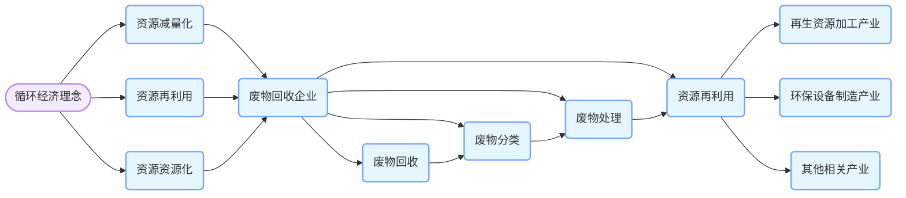

# 循环经济模式下的废物回收企业投资

> 关键词：循环经济、废物回收企业、投资分析、商业模式、风险评估

> 摘要：本文聚焦于循环经济模式下的废物回收企业投资。随着全球对可持续发展的重视，循环经济成为未来经济发展的重要方向，废物回收企业作为其中关键一环，具有巨大的发展潜力。文章深入探讨了废物回收企业的核心概念、商业模式、投资决策流程、数学模型以及实际案例，旨在为投资者提供全面的理论指导和实践参考，帮助其在循环经济浪潮中把握废物回收企业的投资机会，同时识别和应对潜在风险。

## 1. 背景介绍 
### 1.1 目的和范围
本文章的主要目的是为投资者提供在循环经济模式下对废物回收企业进行投资的全面指导。随着环境问题的日益突出和资源的逐渐稀缺，循环经济理念得到了广泛的关注和推广。废物回收企业作为循环经济产业链中的重要组成部分，具有巨大的发展潜力和投资价值。通过对废物回收企业的商业模式、投资决策流程、风险评估等方面进行深入分析，帮助投资者了解该领域的投资特点和潜在机会，为其投资决策提供科学依据。

本文的范围涵盖了废物回收企业的各个方面，包括企业的运营模式、核心技术、市场需求、政策环境等。同时，还将介绍投资决策过程中常用的数学模型和分析方法，以及实际案例的分析和解读。通过理论与实践相结合的方式，使投资者能够更加深入地了解废物回收企业的投资情况，提高投资决策的准确性和成功率。

### 1.2 预期读者
本文的预期读者主要包括以下几类人群：
1. **投资者**：包括个人投资者、机构投资者等，对循环经济领域感兴趣，希望了解废物回收企业的投资机会和风险。
2. **金融从业者**：如银行信贷人员、投资顾问等，需要为客户提供有关废物回收企业的投资建议和风险评估。
3. **废物回收企业管理人员**：希望了解行业的投资趋势和市场需求，为企业的发展战略提供参考。
4. **政府部门工作人员**：负责制定循环经济相关政策，需要了解废物回收企业的发展现状和需求，为政策的制定提供依据。
5. **研究人员**：对循环经济、废物回收等领域进行研究的学者和专家，希望通过本文了解该领域的投资情况和发展趋势。

### 1.3 文档结构概述
本文将按照以下结构进行组织：
1. **背景介绍**：介绍文章的目的和范围、预期读者、文档结构概述以及相关术语表。
2. **核心概念与联系**：阐述循环经济、废物回收企业等核心概念，并分析它们之间的联系。同时，通过文本示意图和Mermaid流程图展示废物回收企业的商业模式和运营流程。
3. **核心算法原理 & 具体操作步骤**：介绍投资决策过程中常用的核心算法原理，如净现值法、内部收益率法等，并通过Python源代码详细阐述具体的操作步骤。
4. **数学模型和公式 & 详细讲解 & 举例说明**：介绍投资决策过程中常用的数学模型和公式，如现金流折现模型、投资回收期模型等，并通过具体的例子进行详细讲解。
5. **项目实战：代码实际案例和详细解释说明**：通过一个实际的废物回收企业投资项目案例，详细介绍项目的开发环境搭建、源代码实现和代码解读，以及项目的投资分析和风险评估。
6. **实际应用场景**：介绍废物回收企业在不同领域的实际应用场景，如工业废物回收、电子废物回收、建筑垃圾回收等。
7. **工具和资源推荐**：推荐一些学习资源、开发工具框架和相关论文著作，帮助读者进一步深入了解废物回收企业投资领域。
8. **总结：未来发展趋势与挑战**：总结文章的主要内容，分析废物回收企业投资的未来发展趋势和面临的挑战。
9. **附录：常见问题与解答**：列出一些常见的问题，并提供相应的解答。
10. **扩展阅读 & 参考资料**：提供一些扩展阅读的建议和参考资料，供读者进一步深入学习和研究。

### 1.4 术语表
#### 1.4.1 核心术语定义
1. **循环经济**：是一种以资源的高效利用和循环利用为核心，以“减量化、再利用、资源化”为原则，以低消耗、低排放、高效率为基本特征，符合可持续发展理念的经济增长模式。
2. **废物回收企业**：是指专门从事废物回收、分类、处理和再利用的企业，通过对废物的回收和再利用，实现资源的循环利用和环境的保护。
3. **投资决策**：是指投资者在进行投资活动之前，根据自身的投资目标、风险承受能力和市场情况等因素，对投资项目进行分析、评估和选择的过程。
4. **净现值（NPV）**：是指投资项目在未来各期现金流量的现值之和减去初始投资成本后的余额，用于评估投资项目的盈利能力和投资价值。
5. **内部收益率（IRR）**：是指投资项目在未来各期现金流量的现值之和等于初始投资成本时的折现率，用于评估投资项目的内部收益率和投资回报率。

#### 1.4.2 相关概念解释
1. **废物分类**：是指将废物按照不同的种类、性质和用途进行分类的过程，以便于对废物进行回收、处理和再利用。
2. **废物处理**：是指对废物进行物理、化学或生物处理的过程，以减少废物的体积、重量和有害物质的含量，使其达到无害化、减量化和资源化的目的。
3. **资源再利用**：是指将废物经过处理后转化为可再利用的资源的过程，如将废旧金属回收后重新冶炼成新的金属材料，将废旧纸张回收后制成新的纸张等。
4. **投资风险**：是指投资项目在未来的发展过程中可能面临的各种不确定性因素，如市场风险、技术风险、政策风险等，这些因素可能会导致投资项目的收益低于预期或出现亏损的情况。

#### 1.4.3 缩略词列表
1. **NPV**：Net Present Value，净现值
2. **IRR**：Internal Rate of Return，内部收益率
3. **ROI**：Return on Investment，投资回报率
4. **WEEE**：Waste Electrical and Electronic Equipment，废弃电子电气设备

## 2. 核心概念与联系 

### 2.1 循环经济的概念与内涵
循环经济是一种以资源的高效利用和循环利用为核心，以“减量化、再利用、资源化”为原则，以低消耗、低排放、高效率为基本特征，符合可持续发展理念的经济增长模式。与传统的线性经济模式（资源 - 生产 - 消费 - 废弃物排放）不同，循环经济强调资源的循环利用和生态环境的保护，通过建立资源循环利用体系，实现经济活动与生态环境的和谐共生。

循环经济的内涵主要包括以下几个方面：
1. **资源的高效利用**：通过采用先进的技术和管理手段，提高资源的利用效率，减少资源的浪费和损失。
2. **资源的循环利用**：将废弃物转化为可再利用的资源，实现资源的循环利用，减少对自然资源的依赖。
3. **环境保护**：通过减少废弃物的排放和对环境的污染，保护生态环境，实现经济发展与环境保护的良性互动。
4. **经济发展与社会进步**：循环经济不仅可以促进资源的节约和环境的保护，还可以创造新的经济增长点和就业机会，推动经济发展和社会进步。

### 2.2 废物回收企业的定义与作用
废物回收企业是指专门从事废物回收、分类、处理和再利用的企业，通过对废物的回收和再利用，实现资源的循环利用和环境的保护。废物回收企业在循环经济产业链中扮演着重要的角色，其主要作用包括以下几个方面：
1. **资源回收与再利用**：废物回收企业通过对各种废弃物的回收和分类，将其中有价值的资源进行回收和再利用，如废旧金属、废旧纸张、废旧塑料等，减少对自然资源的开采和消耗。
2. **环境保护**：废物回收企业对废弃物进行处理和处置，减少废弃物对环境的污染和破坏，如对危险废物的安全处理、对废旧电池的回收和处理等。
3. **经济发展**：废物回收企业的发展可以创造新的经济增长点和就业机会，推动相关产业的发展，如再生资源加工产业、环保设备制造产业等。
4. **社会责任**：废物回收企业积极履行社会责任，提高公众的环保意识和资源节约意识，促进社会的可持续发展。

### 2.3 循环经济与废物回收企业的联系
循环经济与废物回收企业之间存在着密切的联系，废物回收企业是循环经济产业链中的重要组成部分，其发展对于推动循环经济的发展具有重要意义。具体表现在以下几个方面：
1. **废物回收企业是循环经济的重要实施主体**：废物回收企业通过对废弃物的回收、分类、处理和再利用，实现了资源的循环利用，是循环经济理念的具体实践者。
2. **循环经济为废物回收企业提供了发展机遇**：随着循环经济的发展，对废物回收和再利用的需求不断增加，为废物回收企业提供了广阔的市场空间和发展机遇。
3. **废物回收企业的发展有助于推动循环经济的深入发展**：废物回收企业通过技术创新和管理创新，不断提高废物回收和再利用的效率和水平，有助于推动循环经济的深入发展和升级。

### 2.4 核心概念原理和架构的文本示意图
```plaintext
循环经济
|
|-- 资源减量化
|-- 资源再利用
|-- 资源资源化
|
|-- 废物回收企业
|   |
|   |-- 废物回收
|   |-- 废物分类
|   |-- 废物处理
|   |-- 资源再利用
|
|-- 相关产业
|   |
|   |-- 再生资源加工产业
|   |-- 环保设备制造产业
|   |-- 其他相关产业
```

### 2.5 Mermaid 流程图


## 3. 核心算法原理 & 具体操作步骤 

### 3.1 净现值法（NPV）
#### 3.1.1 原理
净现值（Net Present Value，NPV）是指投资项目在未来各期现金流量的现值之和减去初始投资成本后的余额。净现值法是一种常用的投资决策方法，通过计算投资项目的净现值来评估项目的盈利能力和投资价值。如果净现值大于零，则说明项目的投资回报率高于预期收益率，项目具有投资价值；如果净现值小于零，则说明项目的投资回报率低于预期收益率，项目不具有投资价值。

净现值的计算公式为：
$$NPV = \sum_{t=0}^{n} \frac{CF_t}{(1 + r)^t} - I_0$$
其中，$NPV$ 表示净现值，$CF_t$ 表示第 $t$ 期的现金流量，$r$ 表示折现率，$n$ 表示项目的寿命期，$I_0$ 表示初始投资成本。

#### 3.1.2 Python 代码实现
```python
def npv(cash_flows, discount_rate):
    """
    计算净现值
    :param cash_flows: 现金流量列表，第一个元素为初始投资成本（负数）
    :param discount_rate: 折现率
    :return: 净现值
    """
    npv_value = 0
    for i, cf in enumerate(cash_flows):
        npv_value += cf / ((1 + discount_rate) ** i)
    return npv_value

# 示例
cash_flows = [-10000, 3000, 4000, 5000, 6000]  # 初始投资成本为 10000，后续四年的现金流量分别为 3000, 4000, 5000, 6000
discount_rate = 0.1  # 折现率为 10%
npv_result = npv(cash_flows, discount_rate)
print(f"净现值: {npv_result}")
```

### 3.2 内部收益率法（IRR）
#### 3.2.1 原理
内部收益率（Internal Rate of Return，IRR）是指投资项目在未来各期现金流量的现值之和等于初始投资成本时的折现率。内部收益率法也是一种常用的投资决策方法，通过计算投资项目的内部收益率来评估项目的投资回报率。如果内部收益率大于预期收益率，则说明项目的投资回报率高于预期，项目具有投资价值；如果内部收益率小于预期收益率，则说明项目的投资回报率低于预期，项目不具有投资价值。

内部收益率的计算通常需要使用迭代法，通过不断试错来找到使净现值等于零的折现率。

#### 3.2.2 Python 代码实现
```python
import scipy.optimize as optimize

def irr(cash_flows):
    """
    计算内部收益率
    :param cash_flows: 现金流量列表，第一个元素为初始投资成本（负数）
    :return: 内部收益率
    """
    def npv_func(r):
        return npv(cash_flows, r)
    result = optimize.root(npv_func, 0.1)
    return result.x[0]

# 示例
cash_flows = [-10000, 3000, 4000, 5000, 6000]
irr_result = irr(cash_flows)
print(f"内部收益率: {irr_result * 100:.2f}%")
```

### 3.3 投资回收期法
#### 3.3.1 原理
投资回收期是指投资项目通过其净现金流量收回初始投资成本所需的时间。投资回收期法是一种简单直观的投资决策方法，通过计算投资项目的投资回收期来评估项目的投资回收速度。投资回收期越短，说明项目的投资回收速度越快，项目的风险越小。

静态投资回收期的计算公式为：
$$P_t = \text{累计净现金流量开始出现正值的年份数} - 1 + \frac{\text{上一年累计净现金流量的绝对值}}{\text{当年净现金流量}}$$

#### 3.3.2 Python 代码实现
```python
def payback_period(cash_flows):
    """
    计算静态投资回收期
    :param cash_flows: 现金流量列表，第一个元素为初始投资成本（负数）
    :return: 静态投资回收期
    """
    cumulative_cash_flows = [cash_flows[0]]
    for i in range(1, len(cash_flows)):
        cumulative_cash_flows.append(cumulative_cash_flows[i - 1] + cash_flows[i])
    for i, cf in enumerate(cumulative_cash_flows):
        if cf >= 0:
            payback = i - 1 + abs(cumulative_cash_flows[i - 1]) / cash_flows[i]
            return payback
    return None

# 示例
cash_flows = [-10000, 3000, 4000, 5000, 6000]
payback = payback_period(cash_flows)
print(f"静态投资回收期: {payback} 年")
```

## 4. 数学模型和公式 & 详细讲解 & 举例说明 

### 4.1 现金流折现模型
#### 4.1.1 公式
现金流折现模型（Discounted Cash Flow Model，DCF）是一种基于未来现金流量折现的估值方法，通过将投资项目在未来各期的现金流量按照一定的折现率折现到当前时刻，来评估项目的投资价值。其基本公式为：
$$V = \sum_{t=1}^{n} \frac{CF_t}{(1 + r)^t}$$
其中，$V$ 表示投资项目的价值，$CF_t$ 表示第 $t$ 期的现金流量，$r$ 表示折现率，$n$ 表示项目的寿命期。

#### 4.1.2 详细讲解
现金流折现模型的核心思想是考虑货币的时间价值，即今天的一元钱比未来的一元钱更有价值。因此，需要将未来的现金流量按照一定的折现率折现到当前时刻，以反映其真实的价值。折现率 $r$ 通常是投资者要求的最低回报率，也可以根据项目的风险程度进行调整。

#### 4.1.3 举例说明
假设一个废物回收企业投资项目，初始投资成本为 $I_0 = 100$ 万元，预计未来三年的现金流量分别为 $CF_1 = 30$ 万元，$CF_2 = 40$ 万元，$CF_3 = 50$ 万元，投资者要求的最低回报率为 $r = 10\%$。则该项目的价值为：
$$V = \frac{30}{(1 + 0.1)^1} + \frac{40}{(1 + 0.1)^2} + \frac{50}{(1 + 0.1)^3} \approx 27.27 + 33.06 + 37.57 = 97.9$$（万元）

由于项目的价值 $V = 97.9$ 万元小于初始投资成本 $I_0 = 100$ 万元，因此从现金流折现模型的角度来看，该项目不具有投资价值。

### 4.2 投资回报率模型
#### 4.2.1 公式
投资回报率（Return on Investment，ROI）是指投资项目的净利润与初始投资成本的比率，用于衡量投资项目的盈利能力。其计算公式为：
$$ROI = \frac{NP}{I_0} \times 100\%$$
其中，$ROI$ 表示投资回报率，$NP$ 表示投资项目的净利润，$I_0$ 表示初始投资成本。

#### 4.2.2 详细讲解
投资回报率是一种简单直观的投资评价指标，它反映了投资项目的盈利能力。投资回报率越高，说明项目的盈利能力越强，投资价值越大。但是，投资回报率没有考虑货币的时间价值和项目的寿命期，因此在使用时需要结合其他指标进行综合评价。

#### 4.2.3 举例说明
假设一个废物回收企业投资项目，初始投资成本为 $I_0 = 200$ 万元，项目运营一年后的净利润为 $NP = 50$ 万元。则该项目的投资回报率为：
$$ROI = \frac{50}{200} \times 100\% = 25\%$$

这意味着该项目的投资回报率为 $25\%$，即每投入 100 元可以获得 25 元的净利润。

### 4.3 投资回收期模型
#### 4.3.1 公式
投资回收期（Payback Period，PP）是指投资项目通过其净现金流量收回初始投资成本所需的时间。静态投资回收期的计算公式为：
$$P_t = \text{累计净现金流量开始出现正值的年份数} - 1 + \frac{\text{上一年累计净现金流量的绝对值}}{\text{当年净现金流量}}$$

动态投资回收期则需要考虑货币的时间价值，将各期的净现金流量折现后再进行计算。

#### 4.3.2 详细讲解
投资回收期是一种简单直观的投资评价指标，它反映了投资项目的投资回收速度。投资回收期越短，说明项目的投资回收速度越快，项目的风险越小。但是，投资回收期没有考虑项目在回收期之后的现金流量，因此不能全面反映项目的盈利能力。

#### 4.3.3 举例说明
假设一个废物回收企业投资项目，初始投资成本为 $I_0 = 150$ 万元，预计未来五年的净现金流量分别为 $NCF_1 = 30$ 万元，$NCF_2 = 40$ 万元，$NCF_3 = 50$ 万元，$NCF_4 = 60$ 万元，$NCF_5 = 70$ 万元。则该项目的静态投资回收期为：

| 年份 | 净现金流量 | 累计净现金流量 |
|------|------------|----------------|
| 0    | -150       | -150           |
| 1    | 30         | -120           |
| 2    | 40         | -80            |
| 3    | 50         | -30            |
| 4    | 60         | 30             |

根据公式，累计净现金流量开始出现正值的年份数为 4，上一年累计净现金流量的绝对值为 30 万元，当年净现金流量为 60 万元。则静态投资回收期为：
$$P_t = 4 - 1 + \frac{30}{60} = 3.5$$（年）

这意味着该项目需要 3.5 年才能收回初始投资成本。

## 5. 项目实战：代码实际案例和详细解释说明 

### 5.1  开发环境搭建
#### 5.1.1 操作系统
本项目可以在 Windows、Linux 或 macOS 等主流操作系统上进行开发。建议使用 Ubuntu 18.04 或更高版本的 Linux 系统，因为 Linux 系统在开发和部署方面具有更好的稳定性和兼容性。

#### 5.1.2 Python 环境
本项目使用 Python 语言进行开发，建议使用 Python 3.7 或更高版本。可以通过以下步骤安装 Python：
1. **在 Ubuntu 系统上安装 Python**：
```bash
sudo apt update
sudo apt install python3 python3-pip
```
2. **验证 Python 安装**：
```bash
python3 --version
pip3 --version
```

#### 5.1.3 依赖库安装
本项目需要使用一些 Python 依赖库，如 `numpy`、`scipy` 等。可以使用以下命令进行安装：
```bash
pip3 install numpy scipy
```

### 5.2  源代码详细实现和代码解读
#### 5.2.1 投资项目评估类的实现
```python
import numpy as np
import scipy.optimize as optimize

class InvestmentProject:
    def __init__(self, cash_flows, discount_rate):
        """
        初始化投资项目
        :param cash_flows: 现金流量列表，第一个元素为初始投资成本（负数）
        :param discount_rate: 折现率
        """
        self.cash_flows = cash_flows
        self.discount_rate = discount_rate

    def npv(self):
        """
        计算净现值
        :return: 净现值
        """
        npv_value = 0
        for i, cf in enumerate(self.cash_flows):
            npv_value += cf / ((1 + self.discount_rate) ** i)
        return npv_value

    def irr(self):
        """
        计算内部收益率
        :return: 内部收益率
        """
        def npv_func(r):
            npv_value = 0
            for i, cf in enumerate(self.cash_flows):
                npv_value += cf / ((1 + r) ** i)
            return npv_value
        result = optimize.root(npv_func, 0.1)
        return result.x[0]

    def payback_period(self):
        """
        计算静态投资回收期
        :return: 静态投资回收期
        """
        cumulative_cash_flows = [self.cash_flows[0]]
        for i in range(1, len(self.cash_flows)):
            cumulative_cash_flows.append(cumulative_cash_flows[i - 1] + self.cash_flows[i])
        for i, cf in enumerate(cumulative_cash_flows):
            if cf >= 0:
                payback = i - 1 + abs(cumulative_cash_flows[i - 1]) / self.cash_flows[i]
                return payback
        return None
```

#### 5.2.2 代码解读
1. **`__init__` 方法**：用于初始化投资项目，接收现金流量列表和折现率作为参数。
2. **`npv` 方法**：用于计算投资项目的净现值，通过遍历现金流量列表，将各期现金流量按照折现率折现到当前时刻，并求和得到净现值。
3. **`irr` 方法**：用于计算投资项目的内部收益率，通过定义一个内部函数 `npv_func` 来计算净现值，然后使用 `scipy.optimize.root` 函数来找到使净现值等于零的折现率。
4. **`payback_period` 方法**：用于计算投资项目的静态投资回收期，通过计算累计净现金流量，找到累计净现金流量开始出现正值的年份数，然后根据公式计算静态投资回收期。

#### 5.2.3 主程序调用示例
```python
# 示例现金流量和折现率
cash_flows = [-10000, 3000, 4000, 5000, 6000]
discount_rate = 0.1

# 创建投资项目对象
project = InvestmentProject(cash_flows, discount_rate)

# 计算净现值
npv_result = project.npv()
print(f"净现值: {npv_result}")

# 计算内部收益率
irr_result = project.irr()
print(f"内部收益率: {irr_result * 100:.2f}%")

# 计算静态投资回收期
payback = project.payback_period()
print(f"静态投资回收期: {payback} 年")
```

### 5.3  代码解读与分析
#### 5.3.1 代码功能总结
上述代码实现了一个投资项目评估类 `InvestmentProject`，可以用于计算投资项目的净现值、内部收益率和静态投资回收期。通过创建 `InvestmentProject` 对象，并调用其相应的方法，可以方便地对投资项目进行评估。

#### 5.3.2 代码优点
1. **模块化设计**：将投资项目的评估功能封装在一个类中，提高了代码的可复用性和可维护性。
2. **易于扩展**：可以方便地添加其他评估指标的计算方法，如动态投资回收期、投资回报率等。
3. **使用科学计算库**：使用 `numpy` 和 `scipy` 等科学计算库，提高了代码的计算效率和准确性。

#### 5.3.3 代码局限性
1. **静态假设**：代码中假设现金流量和折现率在项目寿命期内保持不变，实际情况中这些因素可能会发生变化。
2. **未考虑风险因素**：代码中没有考虑投资项目的风险因素，如市场风险、技术风险等。
3. **简单模型**：代码中使用的评估模型较为简单，没有考虑复杂的经济环境和投资决策因素。

## 6. 实际应用场景 
### 6.1 工业废物回收
#### 6.1.1 金属废物回收
在工业生产过程中，会产生大量的金属废物，如废旧钢铁、废旧铜铝等。废物回收企业可以通过回收这些金属废物，进行分类、熔炼和加工，将其转化为可再利用的金属材料，用于制造新的工业产品。例如，钢铁企业可以将废旧钢铁回收后重新冶炼成新的钢材，不仅可以节约铁矿石等自然资源，还可以降低生产成本和能源消耗。

#### 6.1.2 化工废物回收
化工行业在生产过程中会产生各种化工废物，如废溶剂、废催化剂等。这些化工废物如果处理不当，会对环境造成严重的污染。废物回收企业可以通过采用先进的技术和工艺，对化工废物进行处理和回收，提取其中有价值的成分，实现资源的循环利用。例如，通过对废溶剂进行蒸馏、萃取等处理，可以回收其中的有机溶剂，用于化工生产。

### 6.2 电子废物回收
#### 6.2.1 废旧电子产品回收
随着科技的不断发展，电子产品的更新换代速度越来越快，产生了大量的废旧电子产品，如废旧手机、废旧电脑、废旧电视机等。这些废旧电子产品中含有大量的贵重金属和稀有金属，如金、银、铜、钯等，同时也含有一些有害物质，如铅、汞、镉等。废物回收企业可以通过对废旧电子产品进行拆解、分类和处理，回收其中的贵重金属和稀有金属，同时对有害物质进行安全处理，减少对环境的污染。

#### 6.2.2 电子废弃物再利用
除了回收贵重金属和稀有金属外，废物回收企业还可以对废旧电子产品中的其他零部件进行再利用。例如，将废旧手机中的电池进行修复和再利用，将废旧电脑中的硬盘、内存等零部件进行翻新和销售，延长电子产品的使用寿命，减少资源的浪费。

### 6.3 建筑垃圾回收
#### 6.3.1 建筑废弃物处理
在建筑施工和拆除过程中，会产生大量的建筑垃圾，如混凝土块、砖块、砂石等。这些建筑垃圾如果随意堆放，会占用大量的土地资源，同时也会对环境造成污染。废物回收企业可以通过对建筑垃圾进行破碎、筛分和处理，将其转化为再生建筑材料，如再生骨料、再生砖等，用于建筑工程中。

#### 6.3.2 再生建筑材料应用
再生建筑材料具有成本低、环保等优点，可以在一定程度上替代天然建筑材料。例如，再生骨料可以用于制备再生混凝土，再生砖可以用于建筑墙体的砌筑。使用再生建筑材料不仅可以减少对天然建筑材料的开采和消耗，还可以降低建筑垃圾的排放量，实现建筑行业的可持续发展。

### 6.4 农业废物回收
#### 6.4.1 农作物秸秆回收
农作物秸秆是农业生产中的主要废弃物之一，大量的农作物秸秆如果不进行有效处理，会造成资源的浪费和环境污染。废物回收企业可以通过对农作物秸秆进行收集、加工和处理，将其转化为生物质燃料、有机肥料等产品。例如，将农作物秸秆进行粉碎和发酵处理，可以生产出生物质沼气，用于农村能源供应；将农作物秸秆进行堆肥处理，可以生产出有机肥料，用于农业生产。

#### 6.4.2 畜禽粪便处理
畜禽养殖业在生产过程中会产生大量的畜禽粪便，如果处理不当，会对环境造成严重的污染。废物回收企业可以通过采用厌氧发酵、好氧堆肥等技术，对畜禽粪便进行处理和利用，生产出沼气、有机肥料等产品。例如，将畜禽粪便进行厌氧发酵处理，可以产生沼气，用于发电和供热；将发酵后的沼渣和沼液进行加工处理，可以生产出有机肥料，用于农业生产。

## 7. 工具和资源推荐
### 7.1 学习资源推荐
#### 7.1.1 书籍推荐
1. 《循环经济导论》：本书系统地介绍了循环经济的基本概念、理论和方法，以及循环经济在不同领域的应用实践，是学习循环经济的经典教材。
2. 《废物回收与再利用技术》：本书详细介绍了各种废物回收与再利用的技术和工艺，包括金属废物回收、电子废物回收、建筑垃圾回收等，是从事废物回收行业的技术人员和研究人员的重要参考书籍。
3. 《投资学》：本书全面介绍了投资的基本理论、方法和策略，包括投资组合理论、资本资产定价模型、投资分析方法等，是学习投资决策的经典教材。

#### 7.1.2 在线课程
1. Coursera 上的“循环经济：从理论到实践”：该课程由国际知名专家授课，系统地介绍了循环经济的基本概念、理论和实践案例，帮助学员深入了解循环经济的发展趋势和应用前景。
2. edX 上的“废物管理与资源回收”：该课程介绍了废物管理的基本原理、方法和技术，以及资源回收的重要性和实践案例，帮助学员掌握废物管理和资源回收的基本知识和技能。
3. 网易云课堂上的“投资决策分析”：该课程介绍了投资决策的基本理论、方法和工具，包括净现值法、内部收益率法、投资回收期法等，帮助学员掌握投资决策的基本方法和技巧。

#### 7.1.3 技术博客和网站
1. 中国循环经济协会官网：提供了循环经济领域的最新政策、法规、技术和项目信息，是了解中国循环经济发展动态的重要平台。
2. 资源再生利用网：专注于资源再生利用行业的信息服务，提供了金属回收、电子回收、塑料回收等领域的技术、市场和企业信息，是从事资源再生利用行业的人士获取信息的重要渠道。
3. 雪球网：是一个投资社区和资讯平台，提供了股票、基金、债券等投资领域的信息和分析，同时也有很多关于投资决策的讨论和分享，是投资者学习和交流的重要平台。

### 7.2 开发工具框架推荐
#### 7.2.1 IDE和编辑器
1. PyCharm：是一款专门为 Python 开发设计的集成开发环境（IDE），具有代码编辑、调试、版本控制等功能，是 Python 开发者的首选工具。
2. Visual Studio Code：是一款轻量级的代码编辑器，支持多种编程语言，具有丰富的插件和扩展功能，可以满足不同开发者的需求。
3. Jupyter Notebook：是一个基于 Web 的交互式计算环境，支持 Python、R 等多种编程语言，适合进行数据探索、分析和可视化。

#### 7.2.2 调试和性能分析工具
1. PDB：是 Python 自带的调试器，可以帮助开发者定位和解决代码中的问题。
2. cProfile：是 Python 自带的性能分析工具，可以帮助开发者分析代码的性能瓶颈，优化代码的运行效率。
3. Py-Spy：是一个轻量级的 Python 性能分析工具，可以实时监控 Python 程序的运行状态，找出性能瓶颈。

#### 7.2.3 相关框架和库
1. NumPy：是 Python 中用于科学计算的基础库，提供了高效的多维数组对象和各种数学函数，是进行数据分析和计算的重要工具。
2. SciPy：是 Python 中用于科学计算的高级库，提供了优化、积分、插值、统计等多种功能，是进行科学计算和数据分析的重要工具。
3. Pandas：是 Python 中用于数据处理和分析的库，提供了高效的数据结构和数据操作方法，是进行数据清洗、分析和可视化的重要工具。

### 7.3 相关论文著作推荐
#### 7.3.1 经典论文
1. Bocken, N. M. P., de Pauw, I., Bakker, C., & van der Grinten, B. (2016). Product design and business model strategies for a circular economy. Journal of Industrial and Production Engineering, 33(5), 308-320.
2. Geissdoerfer, M., Savaget, P., Bocken, N. M. P., & Hultink, E. J. (2017). The circular economy–a new sustainability paradigm? Journal of Cleaner Production, 143, 757-768.
3. Stahel, W. R. (2016). The circular economy. Nature, 531(7595), 435-438.

#### 7.3.2 最新研究成果
1. Kirchherr, J., Reike, D., & Hekkert, M. (2017). Conceptualizing the circular economy: An analysis of 114 definitions. Resources, Conservation and Recycling, 127, 221-232.
2. Schiederig, T., Tietze, F., & Herstatt, C. (2016). Green innovation in technology and innovation management–an exploratory literature review. R&D Management, 46(2), 163-183.
3. Wang, J., & Bi, J. (2018). A critical review of the circular economy in China: Moving from rhetoric to implementation. Journal of Cleaner Production, 172, 51-60.

#### 7.3.3 应用案例分析
1. Ellen MacArthur Foundation. (2015). Towards the circular economy: Economic and business rationale for an accelerated transition.
2. McKinsey Global Institute. (2015). Waste not, want not: The economic opportunity of the circular economy.
3. World Economic Forum. (2016). The circular economy: A new sustainability paradigm for business.

## 8. 总结：未来发展趋势与挑战
### 8.1 未来发展趋势
#### 8.1.1 政策支持力度加大
随着全球对可持续发展的重视，各国政府将加大对循环经济和废物回收行业的政策支持力度。例如，出台更加严格的环境保护法规，鼓励企业开展废物回收和再利用活动；提供财政补贴和税收优惠，支持废物回收企业的技术创新和设备升级；建立健全废物回收和处理体系，提高废物回收和处理的效率和水平。

#### 8.1.2 技术创新不断推进
随着科技的不断进步，废物回收和再利用技术将不断创新和发展。例如，开发更加高效的废物分类和处理技术，提高废物回收的效率和质量；研发新型的再生材料和产品，拓展废物回收和再利用的应用领域；应用物联网、大数据、人工智能等先进技术，实现废物回收和处理的智能化和信息化管理。

#### 8.1.3 产业融合趋势明显
废物回收行业将与其他产业实现更加深入的融合，形成更加完整的循环经济产业链。例如，废物回收企业与制造业企业合作，实现废物的源头减量和资源的循环利用；与能源企业合作，将废物转化为能源，实现能源的可持续供应；与金融企业合作，开展绿色金融业务，为废物回收和再利用项目提供融资支持。

#### 8.1.4 市场需求持续增长
随着人们环保意识的提高和对可持续发展的追求，市场对再生材料和产品的需求将持续增长。例如，消费者更加倾向于购买使用再生材料制造的产品，企业也更加注重产品的环保性能和可持续性。这将为废物回收企业提供广阔的市场空间和发展机遇。

### 8.2 面临的挑战
#### 8.2.1 技术瓶颈
尽管废物回收和再利用技术取得了一定的进展，但仍然存在一些技术瓶颈。例如，一些复杂废物的回收和处理技术还不够成熟，回收效率和质量有待提高；再生材料的性能和质量与原生材料相比还存在一定的差距，应用范围受到限制。

#### 8.2.2 成本压力
废物回收和再利用需要投入大量的资金和设备，成本较高。同时，由于再生材料的市场价格相对较低，废物回收企业的盈利能力受到一定的影响。此外，随着环保要求的不断提高，废物回收企业还需要承担更多的环保成本。

#### 8.2.3 市场机制不完善
目前，我国废物回收市场机制还不够完善，存在市场秩序混乱、价格波动较大等问题。例如，一些非法回收企业为了追求利润，采用不正当手段进行竞争，扰乱了市场秩序；废物回收价格受到市场供求关系和原材料价格波动的影响较大，增加了企业的经营风险。

#### 8.2.4 公众意识有待提高
尽管人们的环保意识有所提高，但对废物回收和再利用的重要性认识还不够深刻，公众参与度不高。例如，一些居民对废物分类的积极性不高，导致废物分类效果不佳；一些企业对废物回收和再利用的重视程度不够，缺乏主动参与的意识。

## 9. 附录：常见问题与解答
### 9.1 循环经济模式下的废物回收企业投资有哪些风险？
1. **市场风险**：废物回收市场价格波动较大，受到原材料价格、市场供求关系等因素的影响。如果市场价格下跌，企业的盈利能力将受到影响。
2. **技术风险**：废物回收和再利用技术不断发展，如果企业不能及时跟上技术进步的步伐，可能会导致回收效率低下、产品质量不稳定等问题。
3. **政策风险**：政府的环保政策和产业政策对废物回收企业的发展具有重要影响。如果政策发生变化，可能会对企业的经营产生不利影响。
4. **资金风险**：废物回收企业需要投入大量的资金用于设备购置、技术研发和场地租赁等方面。如果企业资金周转不畅，可能会导致经营困难。

### 9.2 如何评估废物回收企业的投资价值？
1. **财务分析**：通过分析企业的财务报表，如资产负债表、利润表和现金流量表，评估企业的盈利能力、偿债能力和运营能力。
2. **市场分析**：研究废物回收市场的规模、增长趋势、竞争格局等，评估企业的市场地位和发展潜力。
3. **技术分析**：了解企业的废物回收和再利用技术水平，评估技术的先进性、可靠性和创新性。
4. **管理分析**：考察企业的管理团队的经验、能力和素质，评估企业的管理水平和决策能力。

### 9.3 废物回收企业的商业模式有哪些？
1. **回收加工模式**：企业通过回收废物，进行分类、处理和加工，将其转化为再生材料或产品，然后销售给下游企业。
2. **委托处理模式**：企业接受其他企业或单位的委托，对其产生的废物进行回收和处理，收取处理费用。
3. **资源循环利用模式**：企业将回收的废物与自身的生产过程相结合，实现资源的循环利用，降低生产成本。
4. **产业链整合模式**：企业通过并购、合作等方式，整合上下游产业链，实现资源的优化配置和协同发展。

### 9.4 投资废物回收企业需要注意哪些问题？
1. **了解行业政策**：关注国家和地方政府的环保政策和产业政策，了解政策对废物回收企业的支持力度和发展方向。
2. **考察企业实力**：对拟投资的废物回收企业进行全面考察，包括企业的技术水平、管理能力、市场份额、财务状况等。
3. **评估投资风险**：对投资项目的市场风险、技术风险、政策风险等进行充分评估，制定相应的风险应对措施。
4. **选择合适的投资方式**：根据自身的投资目标和风险承受能力，选择合适的投资方式，如直接投资、股权投资、债权投资等。

## 10. 扩展阅读 & 参考资料
### 10.1 扩展阅读
1. 《循环经济与可持续发展》：深入探讨了循环经济与可持续发展的关系，以及循环经济在全球范围内的实践经验和发展趋势。
2. 《废物管理与环境可持续性》：介绍了废物管理的基本概念、方法和技术，以及废物管理对环境可持续性的影响。
3. 《绿色投资：机遇与挑战》：分析了绿色投资的市场前景、投资策略和风险评估方法，为投资者提供了在绿色领域进行投资的指导。

### 10.2 参考资料
1. 中国循环经济协会发布的相关报告和统计数据。
2. 国家发展和改革委员会、生态环境部等政府部门发布的关于循环经济和废物回收的政策文件和法规。
3. 学术期刊上发表的关于循环经济、废物回收和投资决策的研究论文。

作者：AI天才研究院/AI Genius Institute & 禅与计算机程序设计艺术 /Zen And The Art of Computer Programming